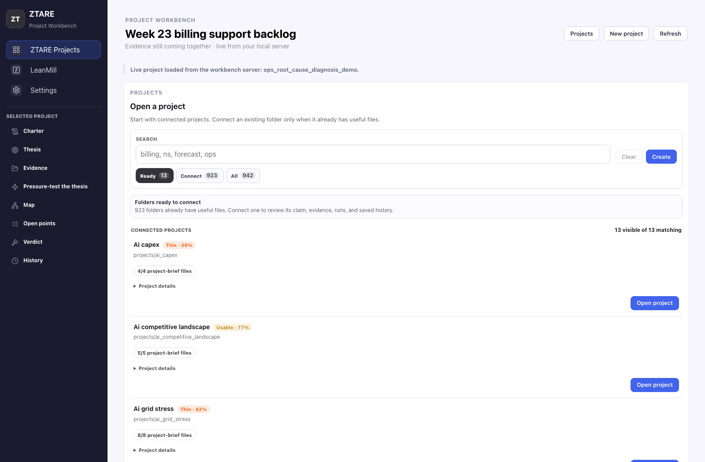

<div align="center">

# ZTARE

**Decide what you can stand behind.**

[](https://github.com/sparckix/ztare/actions/workflows/public-smoke.yml)
[](https://github.com/sparckix/ztare/releases)
[](LICENSE)

Bring a project folder, report, source pack, model output, proof note, dataset, or repo.
ZTARE pressure-tests the claim inside it and shows you the audit trail.



</div>

```bash
git clone https://github.com/sparckix/ztare && cd ztare
python3 -m venv venv && source venv/bin/activate
pip install -r requirements.txt && pip install -e .
make hello
```

`make hello` runs offline in seconds and shows the core discipline end to end: a plausible overclaim gets demoted to bounded wording, missing evidence gets named, a malformed project brief is blocked before any model spend, and the next falsifier is printed. No API key, no persistent state.

## The problem it attacks

A plausible answer with no clean audit trail. That failure gets worse when one model both produces the work and grades it, so ZTARE keeps drafting, checking, evidence, report readiness, and review as separate steps. A model can draft or search. The claim only counts as far as the sources and checks support it.

Before you trust a piece of work, ZTARE helps you answer:

- what is the thesis, and which files actually support it?
- what is missing, stale, or unsupported?
- what can run next without wasting model spend?
- what should be tested next, and what would change the verdict?

As a mental model:

```text
project -> thesis -> local sources -> evidence state -> readiness check / run
-> verdict, support issue, saved review, or next test
```

Code has compilers; reasoning needs similar discipline. Long term, the aim is to turn important thinking into objects you can check, log, revise, and hand to the next person or agent. For now the path is deliberately focused: local project review over inspectable sources and files.

## The Project Workbench

A local web app over your projects, backed by an API that relays to the CLI. One container, one port:

```bash
docker compose --profile workbench up --build workbench   # http://127.0.0.1:8765
```

or, from a fresh clone without Docker:

```bash
make forensic-workbench-live   # API on :8765, app on :5174, installs web deps on first run
```

Open a project and the workbench walks it from charter and thesis through sources, evidence, pressure-testing, and verdict. It critiques a scoring rubric before you spend a run on it, answers plain-language questions against the research map ("what could falsify the thesis?"), stress-tests a single claim to show how it could break, turns a source document into a bounded starting claim, and exports the verified research graph to an [Obsidian vault](docs/concepts/forensic_workbench_interface.md) to write from. The browser never gets raw filesystem access.

Prefer a static offline view? `make forensic-workbench-data WORKBENCH_PROJECT=<slug>` writes a snapshot the app reads without the server.

## Run it on your own work

[`projects/`](projects/) ships with illustrative demos that show the path and give you a shape to copy. Point ZTARE at whatever you need to stand behind: a compliance rule, a research claim, a dataset, a repo, a model report.

```bash
ztare project walkthrough     # guided project brief for a new claim and its sources
ztare project new --help      # scaffold a numeric or data project
```

Each project gets its own brief, evidence binding, trace, and review files under `projects/<your-project>/`. When unsure, start with the project brief: it is the cheapest way to find missing sources, vague claims, or a task that belongs outside the validation loop.

| Route | Use it when | Start |
|---|---|---|
| Project brief | The claim or its sources are not run-ready yet | `ztare project walkthrough` |
| In-loop autoresearch | Bounded claim, stable evaluator, rubric, saved output all ready | `ztare autoresearch trace --brief` |
| Out-of-loop research | Source gathering, proof decomposition, synthesis, one-off agent work | `ztare autoresearch route` |
| Proof work | Lean formalization, proof search, proof-credit governance | [`ztare leanmill`](docs/concepts/leanmill_architecture.md) |
| Reflexive review | Checking whether the system's own routing and instruments improve | `make first-run` + the [evidence atlas](docs/evidence_atlas/README.md) |

Find the full command surface, including the guarded model-backed entry, in the [CLI guide](docs/guides/cli.md), the walkthrough tour in the [quickstart](docs/guides/quickstart.md), and a scripted first session in [first 30 minutes](docs/guides/first-30-minutes.md).

## What is actually here

| Track | Maturity | What it does |
|---|---|---|
| Validation engine and trusted checks | stable / evolving | The in-loop validator plus the checks around it: proposal, fit, adversarial review, deterministic gates, run history. Home of the [LLM gaming behavior catalog](docs/gaming_behavior_catalog.md). |
| Project brief and evidence readiness | release path | Source typing, evidence binding, claim support, and run readiness before model spend. |
| Report readiness | release path | Stops stale or unsupported reports from being promoted. |
| LeanMill | active frontier | Governed Lean proof search. Come to it after the main path. |
| Reflexive layer | advisory | Mines forecasts, actions, catches, and experiment records; surfaces stale ledgers and dead instruments. |

Terminology is layered: **workbench** is the user-facing product, **kernel** the trusted checks and contracts, **engine** a runnable subsystem. The [glossary](docs/concepts/glossary.md#core-concepts) is the reference.

## Design invariants

- **The proposer does not grade itself.** Generation, adversarial review, scoring, and deterministic gates are separate actors.
- **A compile is necessary but insufficient.** A proof or program can compile while laundering the target through a hypothesis, citation, or hidden oracle; governance checks those cases separately.
- **Failures are first-class evidence.** Nulls, refusals, residuals, and failed branches are recorded because they change the next experiment.
- **Worker transport is metadata.** API calls, subscription CLIs, and local workers are interchangeable; the typed contract and check decide whether a result counts.
- **Chat is not the system of record.** Durable files live under `projects/`, `research_areas/`, `org/`, `papers/`, and generated analytics.

## Evidence first

Judge the repo by whether you can inspect the path from a source file to a claim boundary, never by its size:

- [Live analytics dashboard](https://sparckix.github.io/ztare/) — volume, taste, and compounding metrics through a leak-gated pipeline
- [Evidence atlas](docs/evidence_atlas/README.md) — public claims crosswalked to experiments, runnable checks, and caveats
- [Public claim register](docs/public_claim_register.md) — claim by claim: scope, evidence, non-claims, next falsifiers
- [LLM gaming behavior catalog](docs/gaming_behavior_catalog.md) — self-certifying code strategies with catch patterns, tied to executable anchors by `make gaming-catalog-audit`
- [Experiment track record](research_areas/EXPERIMENT_TRACK_RECORD.md) and [insights ledger](research_areas/insights_ledger.md) — the durable experiment and finding record

Five questions to ask of any run: did a command catch a weak claim? can you find the file behind the verdict? can you see what the result does not prove? can you see the next check that would change the answer? can you reproduce the path without trusting a chat transcript?

```bash
make first-run     # full offline public review path: value demo, catalog audit,
                   # benchmark evidence, claim-boundary and terminology audits,
                   # public smoke (make smoke-public), adversarial checks, docs checks
make demo          # three small evaluation-failure reproducers, offline
```

External review is still sparse, so read each claim at the evidence level its own files support.

## Adding model keys

Keys are only needed for a model-backed loop. Supported providers: `GEMINI_API_KEY`, `ANTHROPIC_API_KEY`, `OPENAI_API_KEY`, `DEEPSEEK_API_KEY`, `KIMI_API_KEY`/`MOONSHOT_API_KEY`, `XAI_API_KEY`/`GROK_API_KEY`. Subscription-CLI dispatch is supported for wired call sites. Choose a mutator/judge pair from different model families ([model aliases](docs/reference/model_aliases.md)), and set `CROSS_FAMILY=1` to fail closed if the pair shares a provider. The guarded entry blocks before the first model call unless the project brief, evidence state, and launch checks agree. See the [CLI guide](docs/guides/cli.md) for the full sequence.

## Papers

Papers explain why the workbench exists; the repo is the stronger evidence.

- [Specification Gaming in LLM-Generated Code](papers/cognitive-camouflage/draft.md) — nine benchmarked self-certification strategies, caught by adversarial execution · [SSRN](https://papers.ssrn.com/sol3/papers.cfm?abstract_id=6512960)
- [Hardening an Adversarial Evaluator](papers/governed-evaluator-hardening/draft.md) — mined failure constraints plus deterministic promotion contracts · [SSRN](https://papers.ssrn.com/sol3/papers.cfm?abstract_id=6525598)
- [The Cognitive Firm](papers/cognitive-firm/draft.md) — a multidivisional-form architecture for recursive AI governance · [SSRN](https://papers.ssrn.com/sol3/papers.cfm?abstract_id=6543019)
- [The Limits of Audit for Self-Evaluating AI](papers/audit-limits/draft.md) — what sits beyond a non-gameable check
- [When a Consciousness Verdict Cannot Be Earned](papers/consciousness-admissibility/draft.md) — an admissibility criterion for unrecoverable properties · [SSRN](https://papers.ssrn.com/sol3/papers.cfm?abstract_id=6702939)

In revision: [Epistemic Verification](papers/epistemic-verification/draft.md) and [Epistemic Generation](papers/epistemic-generation/draft.md). For the philosophical grounding, read [The Three Legs of ZTARE](research_areas/philosophy/three_legs_of_ztare.md).

## What ZTARE does not claim

ZTARE improves claim discipline. It does not guarantee truth. A high score does not prove a discovery, a compile does not prove the statement was right, a calibration recovery is not new science, and the current gates do not catch every failure mode. If a result matters, it needs saved files, checks, review records, non-claims, and a next falsifier.

Named personas in synthetic review panels are shorthand for reasoning styles loosely inspired by public work, with no affiliation implied ([registry](src/ztare/personas/registry.py)).

## Go deeper

| If you want to… | Start at |
|---|---|
| See the capability inventory in two minutes | [capabilities.md](docs/concepts/capabilities.md) |
| Understand the validator architecture | [architecture.md](docs/concepts/architecture.md) |
| Understand governed proof search | [leanmill_architecture.md](docs/concepts/leanmill_architecture.md) |
| Reuse the ideas without the repo | [agentic engineering patterns](docs/concepts/agentic_engineering_patterns.md) · [reflexive primitives](docs/concepts/reflexive_engineering.md) · [epistemic principles](docs/concepts/epistemic_principles.md) |
| Read the why | [The Three Legs of ZTARE](research_areas/philosophy/three_legs_of_ztare.md) · [philosophy folder](research_areas/philosophy/) |
| Work inside the repo as an agent | [AGENTS.md](AGENTS.md) |

The design draws on Popper and Lakatos (falsification, research programmes), Goodhart and Holmström (measurement under optimization pressure), Chandler, Williamson, Ostrom, and Simon (organization), Ashby and Hofstadter (systems), and takes a deliberate stance against waiting for bigger models: an individual researcher's near-term leverage is the environment around a frozen model. Influences, not endorsements; none of the authors are affiliated.

## Repository map

| Path | Purpose |
|---|---|
| [`src/ztare/`](src/ztare/) | Validator, fit primitives, gates, the LeanMill solver and governance kernel, orchestration |
| [`projects/`](projects/) | Demo projects; create your own alongside them |
| [`docs/`](docs/) | Architecture, guides, concepts, evidence atlas |
| [`papers/`](papers/) | Public manuscript sources and replication packages |
| [`ztare_proofs/`](ztare_proofs/) | Lean proof sources |
| [`research_areas/`](research_areas/) | Experiment track record, seams, specs, research logs |
| [`org/`](org/) | Roles, mandates, runtime state ([cognitive-firm](https://github.com/sparckix/cognitive-firm) tenant overlay) |

Public by default: workbench source, validators, governance checks, Lean modules, docs, papers. Local and gitignored: active strategy, sealed pre-registrations, credentials, in-flight tactics. The instrument stays inspectable while live experiments keep sealed envelopes, so later results stay interpretable. Public forkability and multi-user hardening are roadmap work, still open.

## License & citation

MIT. The governance/orchestration code (`org/`, `supervisor/`, `orbit/`, `deploy/`, and `src/ztare/{orchestration,supervisor,sessions,signals,notifications}/`) is a tenant-overlay integration of the upstream [cognitive-firm](https://github.com/sparckix/cognitive-firm) kernel. Gitignored files are not part of the public grant until promoted. Map: [LICENSES.md](LICENSES.md) · [LICENSE](LICENSE) · [NOTICE.md](NOTICE.md). Cite the specific paper or file you use. `CITATION.cff` exists for tooling that requires one target.
