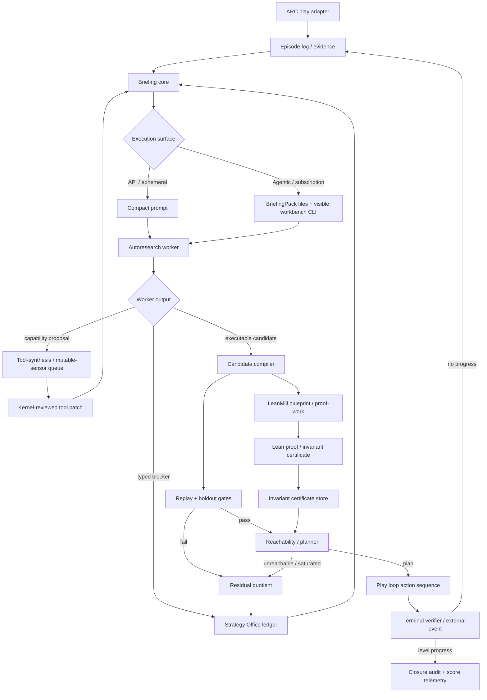
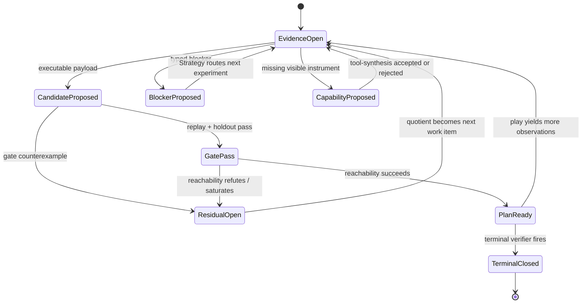

# ARC-AGI-3 World-Model System (GP-250)

> Up: [`docs/README.md`](../README.md)

GP-250 applies the ZTARE thesis to ARC-AGI-3 interactive grid games: governance around a frozen model produces more reliable behavior than an ungoverned agent. The system identifies a game's complete physics as a compact symbolic law, verifies it through deterministic gates, and hunts the win condition through planned exploration. Every hypothesis is falsifiable and every claim is receipted.

The seam document is at
[`research_areas/seams/substrates/arc/GP-250_arc_agi_3_interactive_program_synthesis_seam.md`](../../research_areas/seams/substrates/arc/GP-250_arc_agi_3_interactive_program_synthesis_seam.md).

## Table of Contents

- [What the system does](#what-the-system-does)
- [End-to-end flow](#end-to-end-flow)
- [The worldmodel pipeline](#the-worldmodel-pipeline)
  - [Spec abduction](#spec-abduction)
  - [The operator catalog](#the-operator-catalog)
  - [Replay and holdout gates](#replay-and-holdout-gates)
  - [Reachability sweep](#reachability-sweep)
  - [Sealed terminal verifier](#sealed-terminal-verifier)
- [Governance layers](#governance-layers)
- [Escalation ladder](#escalation-ladder)
- [Runtime proportionality invariants](#runtime-proportionality-invariants)
- [Case study: ls20](#case-study-ls20)
- [Generalization discipline](#generalization-discipline)
- [Flows](#flows)

---

## What the system does

ARC-AGI-3 levels are interactive: the agent earns evidence by acting in an environment whose rules are unknown. GP-250 treats each action as a falsifier. The next action is chosen as the cheapest experiment that kills the most surviving candidate world-models; when one candidate survives to a singleton committee, the reachability sweep produces a goal-directed plan.

The governed object is a transition program: a symbolic law `T(state, action) -> state'` over the declared state basis. Clocked behavior is admissible only when the clock/phase is itself a state-derived or adapter-certified feature, not an exogenous replay index. A candidate earns status by reproducing all observed transitions (replay gate) and predicting held-out future steps it was not fit on (holdout gate). When zero candidates survive, the gap is classified and the escalation ladder fires.

The system inherits the ZTARE deterministic enforcement floor. No candidate is ratified unless all deterministic gates pass. The key invariant is zero false ratification.

## End-to-end flow

ARC is the current interactive-environment adapter. Autoresearch is the System 2
compiler loop that turns evidence into candidates, blockers, or meta-tool
proposals. LeanMill is an asynchronous proof-work adapter. They share one
authority ladder.

The worker may iterate locally over syntax, carrier purity, visible probes, and
receipt compatibility. It may not see hidden holdout, terminal outcomes, or
promotion state through that local loop.

Run status belongs in receipts and observability files, not in this architecture
map. The stable contract is that an interaction-envelope failure is an
interface defect, while a replay/holdout/terminal failure is candidate evidence.
The next work item should be derived from the current typed residual quotient
and the admissible morphism frontier, not from stale prose in this document.

---

## The worldmodel pipeline

The substrate lives under `src/ztare/worldmodel/`.

### Spec abduction

Raw play transitions accumulate in the episode log (`episode_log.py`). Spec abduction (`spec_abduction.py`) recovers a candidate law deterministically from those transitions with zero LLM calls. A transition's changed-cell diff nearly dictates its rule, so the abductor reads candidate rules off the diff, proposes them into per-action option lists, and hands those lists to a population assembler. The assembler scores all option combinations by summing per-action mismatches and selects the fewest-rule spec among gate-passing assemblies by MDL.

Two learners populate the options. The write-function learner (`_fit_write_function`) fits constant, involution, and permutation rewrites from transition consistency and MDL. The Espresso guard learner constructs guard conjuncts using `when_dest` without replacing prior guards, so refinement compounds rather than resets.

`spec_nogood.py` maintains a visible-provenance conflict-clause ledger for eliminated spec hypotheses. It is env-gated and **default on** (`ZTARE_SPEC_NOGOOD`; set `"0"` to disable). When active, credited `INVESTIGATED` science turns write visible-evidence conflict clauses to `workspace/spec_visible_nogoods.jsonl`; subsequent abduction passes consult the ledger to prune already-refuted candidate families. A contamination firewall enforces that only evidence tagged `evidence==visible` may populate the nogood ledger; a holdout reference in a witness payload raises immediately.

### The operator catalog

The catalog is the vocabulary of expressible physics. Each operator is parameterized from observed episode-log evidence, carrying no game constants.

`translate_block` handles rigid-block translation. The diff reveals the displacement, block colors, fill color, and destination colors directly. It underlies the ARC objectness adapter in `object_roles.py`: that inducer labels grid features by behavioral role from transition statistics alone, with no game documentation visible. The ARC-facing names (`moves_under_actions`, `monotone_depleting`, `never_changes`, `covered_uncovered`, `static_structural_mirror`) are substrate-profile roles, not kernel ontology. A cellular automaton, text environment, or 3D simulator should supply a different `alpha` map and abstract signature rather than pretending it has an "agent" or "resource."

`region_event` fires a write when a mover crosses a spatial rectangle. Writes include fixed color assignments, toggle (self-inverse color permutation), and cycle (higher-order permutation). Contact events are the degenerate case where the rectangle bounds a single boundary cell.

`consume_extremal` rewrites the extremal point of a selected ordered component to a replacement feature value. In ARC-grid lowering, the ordered component is usually a row or column and the feature is a color; bars and counters are one observable lowering, not the kernel concept.

Guards compose onto any rule:
- `when_count` — step-start color count threshold
- `when_overlap` — mover-in-rect test
- `when_action` — action-id filter
- `when_region` — rectangle content pattern
- `when_phase` — periodic step gate
- `when_effect` — rule-coupling: fires only if a named rule changed the grid on this step
- `when_dest` — relational destination content gate

A post-closure refinement pass (`_derived_display_refine`) handles indicator-flag cells whose color state mirrors the goal condition without belonging to the physics chain. These derived-display laws extend the spec after the primary operator chain closes.

Lean parity (`spec_lean.py`) maps catalog operators to Lean 4 definitions. The LeanMill bridge (`lean_bridge.py`) certifies structural invariants such as monotone resource depletion and grid factorization.

### Abduction levels and LeanMill routing

The feedback loop uses three inference levels with different candidates and judges:

| Operation | Candidate | Evidence and judge | ARC effect |
|---|---|---|---|
| Worldmodel induction | A transition program | Episode transitions, replay, hidden holdout, terminal events, MDL | Supplies the current dynamics model |
| LeanMill premise abduction | A missing premise for one sequent | SMT/QE sufficiency followed by a Lean child obligation | Helps one proof campaign; it does not extend the theory |
| AxiomPack theory induction | A small reusable theory extension | Typed finite models, independence witnesses, frozen shadow tasks, exact proof ablation, separate ratification | Improves later proof campaigns after promotion |

`autoformalize-from-notes` is the default ARC route. It asks whether an invariant follows from the concrete abduced spec. A kernel-accepted proof may return through `invariant_certificates.jsonl` and constrain reachability.

AxiomPack is an escalation for a repeated family of distinct, admitted proof gaps under the same typed base theory. A candidate pack remains conditional even after it improves proof yield. Before an axiom-derived claim constrains ARC play, the claim must be proved from the concrete spec or receive independent environment evidence. This prevents a useful assumption from being mistaken for an observed world law.

The abstraction functor and constraint morphisms transport representations and certificates. Hypothesis induction remains the responsibility of the three operations above. The current `AbstractionFunctor` contract is an alpha/gamma abstraction interface with CEGAR checks; category-theoretic identity and composition laws are outside its present contract.

### Replay and holdout gates

`gates.py` runs two checks in sequence. The replay gate tests the candidate against every observed transition in the episode log. Any mismatch is a hard failure. The holdout gate presents a fresh action script the candidate never saw and checks cell-level prediction on the resulting episode.

The `env_frame_indices` function classifies episodic discontinuities (deaths, resets) from the log so that each life segment is treated as a separate evidence slice, preventing a death-reset from masking a replay failure on the prior life.

Both gates are exact and fail-closed.

Gate tiers and holdout exposure policy follow the CEGIS membrane. Gates carry an evidence tier: `observed` gates are must-pass (any failure is a hard block); `heldout` gates require only non-regression against the champion's recorded value, so a candidate is not required to solve unseen material before it is allowed to improve what has been observed. In DISCOVERY and HARNESS\_DEBUG runs the briefing pack may stage holdout slices as consumable counterexample evidence for alpha/gamma repair; in EVALUATION runs the holdout remains kernel-side and is never exposed to a leaf probe or workbench tool. The run role is read from `MANIFEST.json` and defaults to `EVALUATION` when absent.

**Dynamics assumption.** Both ARC rubrics (`arc3_ls20_gov`, `arc3_tu93_gov`) declare `dynamics_assumption: lawful_time`. This lifts the syntactic t-read ban in `worldmodel_carrier_purity.validate_worldmodel_carrier_source`; anti-memorization is instead discharged by the held-out rollout and dominance gates. The resolution order is `ZTARE_DYNAMICS_ASSUMPTION` env var > rubric `dynamics_assumption` field > `markovian` default. When `lawful_time` is in effect, the leaf-workbench fragment head emits a `PHYSICS DECLARATION` line so the leaf knows time-dependent laws are admissible for this substrate.

**Role-conditional personas.** Both ARC rubrics declare a `personas` dict with `discovery` and `evaluation` keys. `cegis_membrane.select_persona(rubric_data, run_role)` picks the relevant stance: DISCOVERY and HARNESS\_DEBUG roles receive the `discovery` key ("natural scientist of transition programs"), while EVALUATION receives the `evaluation` key ("adversarial reviewer"). Judges are dispatched with `run_role=EVALUATION` (`test_thesis.py` passes `EVALUATION` directly), so they always see the adversarial-reviewer stance. Mutators are dispatched under `resolve_cegis_run_role("mutator")`.

### Reachability sweep

When the candidate pool reaches singleton, `reachability.py` enumerates the reachable abstract state space under the champion law. The kernel sweep is parameterized by caller-supplied `abstract_fn`, `coverage_fn`, `goal_fn`, and optional ratified invariants. In the ARC adapter, the abstract key currently lowers to controllable support, monotone quantity state, and reactive supports; other substrates should provide their own quotient. Pruning is allowed only from kernel-ratified invariants. Role-derived coordinates are search hints until certified.

The downstream planner follows the same rule. If an `abstract_fn` is available,
fallback goal/novelty/progress planning prunes by `(alpha(state), phase)`,
not by action-prefix identity. Raw-grid planning remains the fallback when no
abstraction map is supplied. Novelty is measured over the chosen abstraction,
so visual churn that preserves the quotient does not count as exploration.

In environments with multi-life play, each life segment is swept independently under the same law. If the bounded object space exhausts without reaching the goal, the sweep returns `refuted_or_unreachable` with the deepest frontier, which opens a new falsification channel: the model must be wrong somewhere in the reachable space.

### Sealed terminal verifier

Goal hypotheses are abducted from indicator regions by `goal_abduction.py` and held as candidates alongside the physics candidates. The external environment exposes a sealed terminal verifier. In ARC-AGI-3 that verifier is reported through the game reward/status channel, but the kernel treats it as an exogenous pass/fail terminal event, not as a dense optimization target. A candidate that explains transitions but predicts the wrong terminal condition is falsified at this terminal gate.

---

## Governance layers

The system instantiates the recursive governance form described in
[One governance form at every level](../../research_areas/philosophy/three_legs_of_ztare.md#one-governance-form-at-every-level)
in the three-legs document. At every layer an agentic worker proposes; a deterministic mechanism disposes. Three layers operate in parallel.

Artifact authority is fixed. The sealed terminal verifier dominates replay, holdout, and
reachability; those dominate candidate snapshots and evidence logs; those
dominate strategy-office notes, judge rationale, conjectures, and prose. A
failed replay, holdout, reachability, reward, planted-synthetic, or deterministic
gate means candidate failure unless a separate gate-integrity receipt proves the
checker failed. Strategy can choose the next experiment, but it cannot promote a
candidate over the gate battery.

#### Production

The synthesis loop (`synthesis.py`, `spec_abduction.py`) generates candidate transition programs from episode-log transitions. This is the proposal surface for the interactive substrate, the analog of the in-loop mutator.

**Self-learning carryover.** The leaf scratchpad (`workspace/leaf_scratchpad.md`) persists across iterations: its tail (last 2000 characters) is injected at the fragment head of each new turn via `render_worldmodel_leaf_workbench_fragment`. Credited `INVESTIGATED` eliminations are written to `workspace/spec_visible_nogoods.jsonl` by the spec-nogood ledger and rendered in the same fragment head as "already eliminated (do not revisit)" case law. The tried-and-failed digest provider also surfaces the `RefutedExperimentsLedger` `REFUTED (machine-blocked)` block and recent `harness_weakness_receipts.jsonl` and `strategy_experiment_probe_rows.jsonl` rows so the mutator begins each turn with its negative memory intact.

#### Certification

The gate battery (replay, holdout, reachability, sealed terminal verifier) disposes every candidate. Promotion uses tiered dominance rather than all-gates-pass: every observed-tier gate must pass absolutely, and every heldout-tier gate must be non-regressing relative to the champion's last recorded value. A candidate that strictly improves observed performance without regressing on heldout depth is promotable even when the heldout gate has not yet closed. The `ZTARE_DOMINANCE_PROMOTION` environment variable (default `"1"`) controls this path; setting it to `"0"` restores the older all-gates-pass behavior for regression and A/B testing. The pre-registered synthetic harness (`harness.py`) provides the current behavioral baseline: BC-0 recovery ran 8 of 8 expressible environments to closure with 0 false ratifications. BC-1'' (high-arity efficiency, pre-registered 2026-07-02) is the live gate; BC-1' failed as registered and its historical verdict stands in the seam.

#### Strategy

Two arms. The per-iteration arm is the M-form alignment audit (`src/ztare/validator/mform_alignment_audit.py`): a rubric-governed check that runs beside each loop iteration and writes Goodhart incidents to `rubrics/goodhart_log.jsonl`. The cross-cycle arm is the strategy office substrate (`strategy_battery.py`, backing `research_director.strategy_office`): a deterministic battery of audits — novelty decay, conditional coverage, event context, ledger closure, sweep horizon, level-transfer pressure, semantic-deanchor pressure, planner-attention pressure, and loop-control pressure — that the Research Director consumes to choose the next experiment.

Strategy Office is meta-control, not a model patcher. Its receipts compile low-yield behavior into typed work orders: compressed counterexample repair, target/discriminator selection, semantic deanchoring, or scheduler-counterexample review. For example, `workspace/latest_information_yield.json` can surface repeated R1/pre-judge/patch-base stagnation as `scheduler_counterexample` pressure. This can redirect attention and commission a kernel-improvement proposal, but replay/holdout/terminal gates still own candidate authority. In agentic filepack mode, Strategy cards are records and refs; they must not become the primary `TASK.md` objective. The primary ask is substrate-invariant: compress visible transition evidence through alpha/gamma into an executable law, or return a receipt-bound obstruction.

#### Machinery

The machinery itself is a governed object under the same form.
Contradiction detectors (`machinery_contradictions.py`) issue proposal cards when classifier excusals conflict with live play. Cards travel through the operator-proposal ledger (`workspace/operator_proposals.jsonl`) and are adopted only under the rules in [MACHINERY_RULES.md](../../MACHINERY_RULES.md). Certifier-touched cards require conductor disposition; auto-adoption is restricted to tightening changes. The [Machinery governance](capabilities.md#machinery-governance) section records the substrate-agnostic parts of this contract.

---

## Cross-substrate algebra

The worldmodel substrate (`src/ztare/worldmodel/`) and the decision-support kernel ([`docs/concepts/decision_support_primitives.md`](decision_support_primitives.md)) instantiate the same five-cell decomposition — ADMIT / EVALUATE / ATTRIBUTE / AGENDA / MAINTAIN — over different evidence types. The warrant-tier ladder maps one-to-one: *unchecked* corresponds to leaf-authored prose and raw riders; *cited* corresponds to receipt-bound claims (`evidence_refs`, `search_receipts`); *reproducible* corresponds to deterministic gate replay; *proven* corresponds to kernel invariant certificates (`invariant_certificates.jsonl`). Both substrates built this structure independently; its recurrence is evidence that the decomposition is real, not an artifact of one design session.

The **shared-algebra-sovereign-substrates** policy governs which parts live where. Substrate-free math is extracted to `src/ztare/common/`: `identification_bits` (the prior-free information yield used in the AGENDA cell) lives in `src/ztare/common/information_yield_pricing.py`; the hitting-set core used for minimal environments lives in `src/ztare/common/hitting_sets.py`. Evidence semantics, receipt shapes, and determinism floors remain substrate-local — the worldmodel substrate's replay/holdout gates and the kernel's quote-binding and recheck door are not merged, because the evidence types they govern differ and the independence of the gatekeeping matters.

Full unification — admitting worldmodel witnesses (ratified invariant certificates, gate-passing candidates) directly into the governed argument graph at the *proven* tier — is possible in principle but is gated on a committee-adjudicated receipt naming the concrete need. Until that receipt exists, the substrates share algebra and common modules; their authority structures remain separate.

---

## Proposal engines: System 2 is plural, authority is singular

The governed autoresearch loop is no longer the sole System-2 entry. The
system now carries three proposal engines, selected by the *knowledge state*
of the project, all feeding one authority spine (deterministic gates →
dominance materializer as the single promoter → append-only ledgers):

1. **Governed autoresearch** (`validator/autoresearch_loop.py`) — the
   full-ceremony general engine: briefing pack, K-parallel persona-diverse
   mutators, judge, R1 contracts, committee. The entry when the frontier is
   *unshaped* — no champion, no witnessed failure, open-ended science on any
   substrate. Heaviest per iteration; the only engine that can change what
   kind of thing is being sought.
2. **Residual specialists** (`worldmodel/residual_specialists.py`) — the
   mechanism-frontier engine: the frontier is computed from the champion's
   own first divergence (propagated rollout, never stale records), shards
   are rival *mechanism families* (cause, not cell-attribute), leaves run in
   a workbench with the gate as an in-turn preflight tool, and deliverables
   are a mechanism + discriminator or an INVESTIGATED elimination. The entry
   when a champion exists and the question is *which law governs a witnessed
   divergence*.
3. **The version-space loop** (`worldmodel/version_space.py` +
   `population_enumerator.py` + `distinguishing_play.py`) — the extensional
   engine: maintain the *population* of visible-perfect programs (mechanism
   identity = behavioral fingerprint on a canonical probe battery, so
   "same idea, different wording" is undefined rather than policed);
   diversify by enumeration when authorship converges (measured: the entire
   LLM-authored candidate history of ls20 collapsed to one behavioral
   fingerprint); compute *distinguishing experiments* from survivor
   disagreements and play exactly there. Each observation writes both
   ledgers: an extensional prune and an intensional nogood. The entry when
   the law is catalog-expressible and *evidence acquisition* — not
   hypothesis generation — is the bottleneck.

The routing rule is mechanized: `worldmodel/engine_router.py` computes the
knowledge state from receipts (champion present, visible residual, frontier
witness freshness, population fingerprint diversity, unresolved
disagreement targets, stagnation) and selects the engine, appending every
decision to `workspace/engine_routing.jsonl`. On its first real invocation
the router out-routed the human conductor — the conductor's choice was
stale against receipts that had moved. Long-term the router's invocation
point belongs in autoresearch loop control (System 2 is a single shell with
plural proposal strategies, not plural loops); the play-loop seam carries a
kill-switch (`ZTARE_ENGINE_ROUTER=0`) for the interim.

Engines share the pricing door (`identification_bits` /
`residual_information_yield` — one function, all consumers), the warrant
tiers (population admission is *reproducible*-tier by construction), and the
promoter. None of them holds promotion authority; the materializer's
product-order dominance is the only door into `test_model.py`, whichever
engine authored the candidate.

**K-lines (Minsky), Shapley-filtered** (`common/k_line.py`) complete the
memory set: the catalog remembers laws, nogoods remember dead ends, the
mechanism ledger remembers rival theories, case-law remembers rulings —
K-lines remember *the configuration in force when the system won* (engine,
mode, model tier, width, briefing features), keyed by a coarse
problem-signature quotient. Attribution over the receipt corpus filters
superstition from the record (v1 is presence-contrast, explicitly labeled
correlational; scheduled component ablations — the K=1-ablation pattern
generalized — upgrade it to causal). `propose_configuration` re-activates
the highest-attribution configuration for a matching signature:
configurations only, never science content. This is the conductor's craft
moved into a machine ledger — the last routing function that had no receipt
home. It is also the second cross-task transfer object: the catalog
transfers laws; K-lines transfer ways of working.

### Category contracts: measurements vs causal identities

The system uses several named categories for committee members and episodes.
Their epistemic status differs and must not be conflated.

**Measurement categories (attribute-statuses).**  Holdout depth, visible-perfect,
champion, and level closure are *measurements*: they record what the current
evidence says about a candidate's performance on a defined gate.  A candidate
is ``visible-perfect`` when it reproduces every visible transition exactly;
``champion`` when it holds the highest dominance rank; ``closed`` when replay,
holdout, and terminal gates all pass.  These are contingent on the evidence
seen so far and can change as new transitions arrive.

**Causal-identity categories.**  Mechanism family and episode are causal
identities — they name *what produces the behavior*, not what the behavior
scores.  A mechanism family is a causal identity only after the candidate has
survived intervention-response tests (action perturbations that reveal the
underlying rule family).  An episode boundary is a causal identity only after
reset-invariance tests confirm that the physics resets cleanly rather than
carrying hidden state across lives.

**Closure claims require pre-registered receipts.**  Asserting that a level is
closed requires the pre-registered evaluation protocol — specifically,
``eval_protocol.jsonl`` receipts that name the gate battery, holdout slice,
and terminal-event witness.  A depth reading alone (``holdout_depth == N``) is
a measurement; it is not a closure claim.  The distinction matters because a
depth reading can be satisfied by a candidate that memorizes the holdout order
rather than generalizing the law.

**Adapter-Width Law.**  A substrate adapter's interface is the machine-readable
enumeration of every abduction outsourced to humans — the "givens": variables,
actions, success signal, reset semantics, time structure, observability, and
verification oracle.  Width is the count of fields still at status ``given``.
Generality is the ordered deletion of adapter fields, each replaced by an
abduction organ and a validation receipt.  This is a measured, receipted number:
the current baseline lives at ``analytics/public/adapter_width/`` and is
updated by ``ztare.common.adapter_width.declare_adapter_contract()``.  The
GP-250 worldmodel starts at width 6–7/7 (honest baseline); each field
deletion must produce a receipt before the width decreases.

---

## Escalation ladder

When abduction stalls, the system climbs a cost ladder before calling an LLM.

**Warm abduction (seconds).** `spec_abduction.py` runs deterministically from the current episode log. If the champion still passes all gates after appending new transitions, it is returned immediately via the CEGIS warm-start: one replay rather than a full search.

**Seeded search (minutes).** `synthesis.py` runs version-space candidate elimination over the per-action option lists, with MDL scoring, the population assembler cache, and the E-graph shared sub-evaluation. No LLM calls.

**Operator proposal cards.** When the gap survives seeded search, `closure_audit.py` emits an operator-proposal card describing the unresolved transition family. The implement leg (`operator_implement.py`) dispatches a sealed leaf worker that proposes one new guard or operator against that card. The proposal travels through the adoption cycle before entering the grammar.

**Tactical structural bridge.** If the normal implement leg fails at a grammar ceiling, the reflex may ask the structural-transport provider for one cached cross-domain prescription against the current residual cut. It runs as the reflex's last rung: one provider, SHA-cached inputs, `spec_patch` required, and the same strict-improvement/no-regression arbiter as the operator path. A surviving bridge writes back into the dictionary so future ceilings retrieve it as earned advice.

**Sealed 5.5 checkpoint.** `evidence_digest.py` builds a bounded, prioritized digest of the episode log under a character budget: all residuals first (the transitions the current champion does not yet explain), then exemplars by diff-signature cluster, then newest transitions. This digest is the evidence surface for a toolless single-shot LLM call — sealed and context-bounded.

**Champion materialization.** At loop bootstrap, `validator/core/champion_materialization.py` scans `workspace/candidate_*.py` and `workspace/submissions/*.py`, runs the project gate harness on each, and promotes the best dominance-eligible candidate to `test_model.py`. A candidate is eligible only if it passes all observed-tier gates and satisfies the tiered dominance check against the live model. The backup of the prior model is written to `workspace/test_model_pre_materialization_<ts>.py` and the promotion receipt appended to `workspace/champion_materialization.jsonl`. The behavior is env-gated (`ZTARE_CHAMPION_MATERIALIZATION`, default `"1"`). `test_model.py` is also staged into briefing packs as a compact visible-workbench reference artifact.

The live-champion briefing provider (`ztare.orchestrator.briefing_providers.live_champion`, tier 0, priority 18) reads the newest `"promoted"` row from `workspace/champion_materialization.jsonl` and renders it as a mandatory patch-base directive — the first directive the leaf sees. Without this provider the leaf cannot identify the correct patch base and regresses. When no promotion receipt exists but `test_model.py` is present, the provider renders a degraded banner.

**Envelope normalization.** The kernel normalizes declaration headers rather than rejecting them with strikes. `evaluate_mutation_declaration` (`ztare.validator.core.mutation_contract`) computes the actual touched artifacts from the diff. If the declared scope is narrower than the actual change (`UNDECLARED_ARTIFACT_BREADTH`), the kernel upgrades scope and records an attribution note. If the declared primitive is not in the approved index (`INVALID_PRIMITIVE_DECLARATION`), the kernel drops it with a note. Neither case consumes a strike. R1 retries run in `visible_workbench` mode via `resolve_agent_execution_mode("mutator")`, which preserves instruments across the retry.

**Impossibility-claim witnesses.** A `LOWERABILITY_BLOCKED` payload asserting a missing state feature must supply `search_receipts` (`ztare.common.sealed_boundary_cegar._validate_missing_feature_search_receipts`). The validator raises if `search_receipts` is absent when the obstruction names a missing-feature claim.

**Leaf workbench boundary.** A sealed leaf is not equivalent to an unbounded
terminal conductor. The leaf may only see compressed, redacted,
authority-ordered fibers of the project, while the kernel retains hidden
holdouts and terminal authority. When a task requires inspection rather than
one-shot synthesis, the correct shape is a capability-safe mini workbench:
bounded reads, named deterministic diagnostics, local preflight over staged
visible files, and typed command receipts that the candidate must cite. There
are two execution fibers, with one authority ladder. If the worker is a
subscription-backed visible-workbench agent, it runs in the staged workspace
profile: local probes and scratch files are allowed inside the staged pack, but
source artifacts, hidden evaluator data, live actions, and authority gates
remain outside the leaf. If the needed observation is authority-bearing
(sealed replay, hidden holdout, live world actions, canonical adoption, or
dictionary write-back), the worker must emit a typed workbench action request and
consume the kernel-produced receipt on retry. This is the in-loop analogue of
`ztare autoresearch route`: the outer router decides whether a task belongs in
the workbench; the inner leaf workbench gives an admitted worker the minimal
observation/action loop without raw repository or holdout access. It must
preserve the same authority ladder: workbench receipts can explain a patch, but
replay, holdout, and the sealed terminal verifier still decide.

The mutator briefing has two customer renderers over one deterministic core.
API/ephemeral workers receive a compact self-contained prompt. Agentic
subscription workers receive a small entry prompt plus a staged BriefingPack:
`TASK.md`, `ATTENTION.md`, `RECORDS.json`, `CONTEXT.md`,
`WORKBENCH_TOOLS.md`, and `MANIFEST.json`. `ATTENTION.md` is the sufficient
statistics front door over structured records: active obligation, residual
quotient, artifact refs, allowed tools, and output contract when present.
`RECORDS.json` carries exact provider records; `CONTEXT.md` is background.
`MANIFEST.json` binds staged file identity to bytes, authority class, and
visible/hidden status. This is an interface split, not a second authority
system: staged files and visible probes help the proposer reason, while replay,
holdout, terminal verification, and registered kernel actions remain the only
authority surfaces.

Interactive validators are admissibility tutors, not truth judges. In
agentic mode the staged workbench exposes visible preflight commands for
candidate-carrier and receipt compatibility checks before the final answer.
Those commands may report missing fields, malformed hashes, non-lowerable
receipt shapes, or temporal-carrier violations. They may not reveal hidden
holdout, terminal outcomes, promotion status, or sealed evaluator data. The
worker should use them to repair envelopes and local carrier compatibility
inside the same turn; final truth still belongs to replay, holdout, terminal
verification, and promotion gates after submission.

The same surface must not own the local stopping problem. The leaf-local
validator checks admissibility, carrier purity, visible refs, and receipt shape;
it does not enforce a fixed probe sequence before a blocker. A blocker is valid
only when it is evidence-bound: it names the candidate family attempted, the
visible receipts or command errors relied on, the current obstruction, and the
next non-promotional action. Tool-frontier helpers may exist for debugging, but
they are not surfaced as required work and cannot decide whether the leaf should
continue thinking.
Agentic packs stage the compact telemetry files
`workspace/latest_information_yield.json` and `workspace/p0_metrics.json` when
available. They are sufficient-statistic front-door files; the full iteration
history stays out of the default workbench unless an explicit task asks for it.
Deterministic producer receipts enter the pack when referenced by structured
records, for example `source_receipt=workspace/abduced_core.json` or
`diagnostics_ref=workspace/latest_replay_diagnostics_after_abduce.json`. These
are read models for the leaf's candidate reasoning; abduction and synthesis
computation remain producer steps, not prompt-renderer side effects.
Recursive-improvement tasks may also stage the producer source surfaces
(`spec_abduction.py`, `goal_abduction.py`, synthesis/refinement lowerings) as
mutable-sensor/tool-source files, but those source files are for proposals and
patch review. They do not authorize object-level candidate promotion.
The current Codex visible-workbench source bundle includes the abduction source
files for inspectability; their presence is a source-fiber affordance, not an
evidence receipt.

For the current harvest/debug phase, the default run shape is one science leaf
per iteration. That worker should first attempt a transportable executable law
with the current visible artifacts, producer receipts, and in-turn morphisms.
It may inspect source fibers to understand or propose apparatus improvements,
but a science-lane blocker must cite observed receipts or visible evidence,
not source-code files. The science leaf has three closing shapes: executable
candidate, registered workbench action request, or `LOWERABILITY_BLOCKED`.
A tool/capability proposal may be attached as optional meta evidence, but it
never satisfies the science turn by itself. Strategy aggregation owns promotion:
open tool-synthesis only when the same gap recurs, blocks a declared next gate,
or drives a repeated no-candidate/no-level loop under the same residual. Scaling
to multiple agents is a lane scheduler decision (science, meta-hardening,
proof-work, tool-synthesis), not a reason to mix apparatus backlog into the
science leaf's front-door attention.

The workbench menu is also governed. A leaf may not invent a missing action and cite it as evidence. Unknown or defective actions may be described as a tool gap inside `LOWERABILITY_BLOCKED`; optional proposal skeletons must include input/output contract, evaluator, secret policy, safety invariant, and rollback condition. Capability proposals are morphism-shaped: they name the current state, desired state, and admissibility witness, so a future tool can be tested as an extension rather than smuggled in as a hand-authored hint. Only registered capabilities can produce `LEAF_WORKBENCH_RECEIPT` evidence. In a skill-acquisition run, a proposal alone is cold meta-backlog: it neither satisfies the current residual nor authorizes an empty candidate. The science-lane obstruction is `LOWERABILITY_BLOCKED`, which must cite attempted visible capabilities, attempted candidate family, missing witness/sensor, next action, and evidence refs. Only a paired lowerability obstruction or repeated telemetry-backed recurrence makes a proposal eligible for Strategy Office batch review. Proposals targeting hard-kernel gates remain audit records only. This keeps the interface self-improving without making a hardcoded menu into a new prior.

Discovery blockers have one extra accounting rule. If a leaf marks staged
counterexamples or holdout slices as consumed evidence, the blocker must also
cite `evidence_analysis_refs`: a derived scratch artifact, visible diagnostic
receipt, or scored candidate that shows how those refs were used for
alpha/gamma repair. It must also include `stopping_rationale`, a local
information-yield statement explaining why the next visible action is not worth
or not possible inside the same turn, and `local_frontier_decision`, the typed
frontier of available, attempted, and unattempted local actions with expected
information and stop reason. Raw counterexample files plus failed registered
morphisms do not certify that no lowerable law exists. This preserves agency in
the leaf-local search while preventing receipt completion from becoming the stop
condition.

Candidate-delta scoring must preserve the search gradient even when promotion
fails. If a candidate improves the visible comparison surface against the
incumbent but still fails replay, holdout, or another deterministic gate, the
visible scorer returns a prior-comparison receipt with the counterexample
quotient and relation `improved_but_gate_failed`; it does not collapse the
result to an opaque hard failure. The gate still blocks promotion, but the leaf
keeps the relative information needed for the next alpha/gamma repair.

The kernel contract is substrate-general (`ztare.common.leaf_workbench_contract`). ARC/worldmodel only supplies a lowering (`ztare.worldmodel.leaf_workbench`): inspect the authoritative patch base, inspect the current replay-residual quotient, run or consume a frozen replay probe, validate Strategy-card receipts, and score candidate deltas against the incumbent. Other substrates should add their own lowerings under the same contract rather than importing ARC vocabulary into the kernel.

Identity and property fields must not be conflated. Identity fields name stable
artifacts, content hashes, command ids, receipt refs, and adapter-owned source
coordinates. Property fields describe current interpretation: freshness,
dominance, role, status, quotient relation, score, or admissibility. A prompt or
provider may summarize properties, but it must not encode them into artifact
refs or command identities. Conversely, substrate folklore (`row`, `color`,
`level`, `reward`, `agent`, `resource`) may appear inside adapter receipts when
that is the observed evidence vocabulary, but it must not become kernel policy.
The portable kernel vocabulary is artifact, carrier, quotient, gate, receipt,
adapter lowering, and prediction/action card.

Action requests are part of the same contract. A leaf may submit a `LEAF_WORKBENCH_ACTION_REQUEST` for a registered capability; the kernel executes only the registered lowering over allowed artifacts and returns `LEAF_WORKBENCH_RECEIPT` on the free retry. The kernel verbs stay generic: read an artifact, run a pure diagnostic, run a Strategy card's declared gate, score a candidate delta, record a missing-instrument observation, and record a receipt. Substrate commands such as ARC transfer probes live behind a registry selected by the Strategy card's `required_next_gate`; they are not new kernel verbs. A bounded common probe, `run_visible_json_probe`, lets the leaf run pure Python over explicitly named visible JSON artifacts when it needs a one-off aggregate before a stable wrapper exists. In visible-workbench mode, the same probe surface is also staged as an in-turn CLI over visible artifacts/stdin, so the leaf can run local counterexample checks before final submission; hidden holdout, live environment actions, candidate promotion, and dictionary write-back remain kernel-only. Every non-manifest visible CLI command writes a content-addressed receipt under `workspace/visible_cli_receipts/` and returns `persistent_receipt.ref`; the leaf can pass those refs into `probe-json` to compose visible evidence inside the same turn. If neither layer fits, the leaf emits `LOWERABILITY_BLOCKED` and may attach an optional proposal skeleton as cold backlog. This is the sealed-worker version of tool access: choose the next observation/action agentically, but execute through typed capability receipts rather than arbitrary repo access.

The receipt/action wording is centralized in `ztare.common.leaf_workbench_contract`. Prompt and projection files that expose that contract are mutable sensors: they may be improved through `tool_synthesis`, but they must render common action-request objects and must round-trip through the same parser and validator used by the loop. No substrate adapter owns a private receipt dialect.

Strategy Office cards split by role through one common classifier:
`ztare.common.control_work_items` (`strategy_card_roles` is only a compatibility
projection). Skill-acquisition cards are active memory and gateable obligations,
but they do not define the leaf's cognitive objective. The worker may cite a
card, satisfy it, refute it, or block it with evidence; the AskSpec remains the
single task contract. Meta-hardening cards improve mutable instruments
such as prompt renderers, workbench tools, briefing providers, retry adapters,
or abstraction sensors. They are visible queued work, but they do not block an
object-level candidate unless the current task is explicitly a meta-hardening
task. This preserves recursive improvement without letting apparatus work
starve the play/model loop.

Strategy Office has one decision membrane and two card producers:

1. Cross-cycle experiment scheduling: `ztare.research_director.strategy_office`
   runs a substrate `AuditBattery`, optionally asks a sealed strategy leaf
   bounded read-only queries, normalizes proposed experiments into Strategy
   cards, and sends the batch through
   `ztare.research_director.strategy_decision_policy.submit_strategy_card_batch`.
2. Tool/improvement promotion: leaves may emit cold capability proposals only
   as evidence attached to `LOWERABILITY_BLOCKED`. They are recorded by
   `ztare.common.leaf_workbench_proposals`, reviewed by
   `ztare.research_director.strategy_office --review-tool-proposals`, may collect
   reviewer positions through `ztare.research_director.tool_proposal_review`,
   and then use the same `submit_strategy_card_batch` membrane before any
   `tool_synthesis` card is written.

`decide_strategy_card_batch` is the pure aggregation step; `submit_strategy_card_batch`
is the only Strategy ledger write path. The membrane can approve, reject, or
escalate card writes; it cannot promote candidates, alter replay/holdout
authority, or define the leaf's primary task. Reviewer positions can be supplied directly with
`--decision-positions-json` or collected by explicit opt-in agents with
`--decision-position-agents env|default`; the env knobs are
`ZTARE_TOOL_PROPOSAL_REVIEW_AGENTS_JSON`,
`ZTARE_TOOL_PROPOSAL_REVIEW_AGENTS`,
`ZTARE_TOOL_PROPOSAL_REVIEW_POSITION_AGENTS`, and
`ZTARE_TOOL_PROPOSAL_REVIEW_TIMEOUT_SECONDS`. The dormant default panel is Kimi
API, DeepSeek API, Codex subscription, and Claude subscription; it is never
dispatched unless that CLI flag or env selector asks for it.

Recursive-improvement proposals should target the single doors rather than
scattered prompt text. Leaf asks are represented by `ztare.common.ask_spec`;
rendered prompts, agentic `TASK.md`, retry prompts, and workbench asks should
project that shared contract instead of defining private output policy. R1
retry surfaces use `ztare.orchestrator.retry_contract` as the common envelope:
numeric models, theorem packets, assertion suites, and worldmodel carriers may
render different carrier rules, but they share one error/history/free-retry/prior
carry-through boundary.
Workbench action/receipt language lives in `ztare.common.leaf_workbench_contract`;
parent-kernel execution of those action requests lives in
`ztare.common.leaf_workbench_executor`;
tool-synthesis card construction and mutable-surface validation live in
`ztare.common.tool_synthesis_contract`; control-work-item role semantics live in
`ztare.common.control_work_items`; agentic/API rendering lives in
`ztare.common.briefing_pack`; visible in-turn tool routing lives in
`ztare.common.visible_workbench_actions` and `ztare.common.visible_workbench_cli`;
boundary state projection lives in `ztare.common.control_state_machine` and
`ztare.common.sealed_boundary_cegar`.
Control receipt parsing also lives in `ztare.common.control_state_machine`:
raw JSON `control_receipts` and rendered marker blocks normalize through
`control_receipt_rows`. Renderers may emit markers for readability, but
preflights, retry routing, and lifecycle policy consume typed rows from that
single read model.
Substrate adapters can lower these contracts, but they should not create
private prompt dialects, private receipt parsers, or alternate card-role rules.
If a leaf sees an interface failure, its proposal should name one of these
surfaces, an evaluator, and a rollback condition.

The agent-computer interface has the same single-door rule. Execution profiles
are owned by `ztare.common.subscription_agent_runtime`: sealed completion maps to
the Codex sealed profile, while visible workbench maps to the Codex
workspace-write profile with JS/MCP/web disabled. `ztare.common.dispatch_model`
selects an execution profile and stages the `BriefingPack`; it does not define
private sandbox semantics. The staged visible-workbench contract text is owned
by `ztare.common.briefing_pack.visible_workbench_contract_text` and is projected
into the entry prompt and `README.md`. A meta-hardening proposal that changes
agentic interactivity should target those owners, not scattered prompt strings.

Changing any mutable interface surface follows this path. This includes prompt
renderers, retry envelopes, workbench tools, theorem/proof ask surfaces, typed
payload compilers, substrate lowerings, and visible preflight commands.

1. Declare or reuse the common contract in
   the canonical owner: `ztare.common.ask_spec` for asks,
   `ztare.orchestrator.retry_contract` for retry envelopes,
   `ztare.common.leaf_workbench_contract` for action/receipt/proposal shape,
   `ztare.common.control_work_items` for card role and blocking semantics, or
   the relevant gate contract for proof/theorem validation.
2. Project that contract into the customer surface. API mode gets a compact
   prompt; agentic mode gets `BriefingPack` files and visible preflight tools;
   retry mode gets a common retry envelope plus substrate carrier details.
   Renderers do not define private policy.
3. If the surface is a leaf/tool action, add the visible/agentic route in
   `ztare.common.visible_workbench_actions` and, when it can run inside the
   staged workbench, expose it through `ztare.common.visible_workbench_cli`.
   This is the leaf-local preflight surface, not candidate authority.
4. Add any substrate lowering in the adapter, currently
   `ztare.worldmodel.leaf_workbench`: handler, stateless/candidate-bound/local
   route metadata, input-ref lowering, and registry-parity check. ARC-specific
   artifact names stay here. Theorem/proof substrates should add their own
   lowerings under their proof gate or LeanMill adapter rather than importing
   ARC vocabulary into common code.
5. If the surface is missing rather than implemented, route it through
   `ztare.common.tool_synthesis_contract` as a `tool_synthesis` Strategy card.
   Mutable interface files include `ask_spec.py`, `briefing_pack.py`,
   `retry_contract.py`, `submission_path_helpers.py`,
   `leaf_workbench_executor.py`, `worldmodel/retry_surface.py`,
   visible-workbench files, typed-payload compilers, and adapter lowerings.
   Hard gates and candidate authority files remain outside the mutable surface.
6. Add a parity or round-trip fixture at the contract boundary: rendered asks
   preserve `AskSpec`; retry prompts share the retry envelope; declared
   capabilities route to in-turn CLI, parent kernel, or record-only status;
   surfaced examples parse through the same validator the loop uses. Hidden
   holdout, terminal events, promotion, proof authority, and dictionary
   write-back are never exposed by local preflights.

Implementation follows the same compression rule as the world-model learner.
When two modules classify the same boundary, factor the classifier into the
canonical owner and make the other module a projection. Current ownership:
`ztare.common.projection_owner_registry` is the machine-readable blast-radius
index for these owners; meta-hardening agents should consult it before changing
contract text, automaton events, prompt projections, or Strategy write policy.

- `control_work_items`: card/work-item lane, authority, blocking policy, and
  run-context blocking.
- `ask_spec`: requested output contract; API prompts, agentic `TASK.md`, retry
  text, and workbench asks render this object.
- `science_output_policy`: object-level science output policy: candidate,
  registered action request, `INVESTIGATED`, `LOWERABILITY_BLOCKED`, tool-gap
  firewall, visible receipt composition, discovery evidence status, and final
  JSON payload keys. `INVESTIGATED` is a first-class credited science-turn
  outcome when probes eliminate a new hypothesis class from visible evidence;
  K=3 consecutive investigated-only turns (no carrier ever emitted) trigger
  stagnation pressure. The constant `INVESTIGATED_STAGNATION_K = 3` is the
  single source of truth.
- `orchestrator.retry_contract`: shared retry envelope; substrate branches own
  carrier details but not retry semantics or stale resubmission boilerplate.
- `leaf_workbench_contract`: action requests, receipts, proposal shape, and
  registered capability identity.
- `patch_base_identity`: project-relative patch-base refs, full-digest
  identity checks, and verified legacy-prefix normalization for historical
  carrier chains. Active submitted carriers must still name full hashes.
- `leaf_workbench_executor`: parent-kernel execution of registered workbench
  action requests, current-candidate byte binding, receipt stamping, and
  unique Boundary-CEGAR morphism follow-up. `repair_preflight` calls this owner;
  it does not own private executor loops.
- `subscription_agent_runtime`: subscription CLI execution profiles and sandbox
  lowering. Sealed completion, visible workbench, and full-auto execution are
  named profiles here; callers should not hand-code equivalent Codex flags.
- `briefing_pack`: the agentic file-pack renderer, visible-workbench contract
  text, `MANIFEST.json`, `TASK.md`, `ASKS.json`, `ATTENTION.md`, `RECORDS.json`,
  `CONTEXT.md`, and `WORKBENCH_TOOLS.md`.
- `dispatch_model`: transport selection and pack staging only. It consumes
  execution profiles and briefing contracts; it does not own policy prose,
  sandbox semantics, or workbench capability identity.
- `projection_owner_registry`: machine-readable concept owners, blast radius,
  and the curated visible-workbench source membrane. Science-mode `ToolSource`
  staging uses `VISIBLE_WORKBENCH_SOURCE_REFS`, a narrow executable set for
  local preflight and worldmodel induction tools. This set includes
  `evidence_probe.py` (governed leaf-authored probe over episode transitions,
  zero-credit, AST allowlist, DISCOVERY-conditional holdout exposure) and
  `evidence_quotients.py` (`event_timeline` and `episode_contrast` as library
  and workbench capabilities). It should not be replaced by a transitive import
  graph or by every file named in the meta-hardening blast-radius map.
- `visible_workbench_actions` plus `visible_workbench_cli`: in-turn visible
  tool routing and parent-kernel routing; adapter capabilities are discovered
  from the adapter registry, not by common-code string tables.
- `sealed_boundary_cegar` plus `control_state_machine`: admissible boundary
  state transitions, control receipt read-model normalization, and
  lowerability interpretation.
- `candidate_first_policy` plus `worldmodel_typed_payload`: whether a final
  payload may omit executable code.
- `validator.core.candidate_preflight` and `validator.core.repair_preflight`:
  parent-owned candidate/control compatibility checks before authority gates.
  `candidate_preflight` owns the ordered `PreflightRule` registry (`id`,
  `applies_to`, `authority`, `run`). `repair_preflight` provides rule bodies
  only. They receive executable carrier bytes separately from response
  envelopes, so control receipts cannot pollute candidate identity. They may
  call common executors, but they do not define private receipt/action policy.
- replay, holdout, terminal, and proof gates: candidate authority.

No renderer decides policy. No preflight parses prose when a typed object
exists. No adapter owns a private receipt dialect. No common module should route
on substrate folklore such as a specific level, cell color, reward channel, or
gameplay noun. Adapter facts may appear in adapter receipts; common code should
route on registered capability ids, authority class, lane, lowerability signal,
and gate status.

The sealed Boundary-CEGAR automaton is the state-chart projection of this
boundary, not a separate solver. It uses `ztare.common.control_state_machine` to
surface states such as `counterexample_open`, `observation_requested`,
`candidate_pending_gate`, and `tool_gap_pending`, while pointing to
the existing carrier, leaf-workbench, tool-synthesis, operator-proposal, and
strategy-experiment contracts as ledger surfaces. The Strategy Office owns the
meta-tool path: a missing mutable sensor first becomes a cold capability
proposal, then an explicit batch review over proposal telemetry and
lowerability receipts may promote it into a `tool_synthesis` card with evaluator
and rollback fields. Hard-kernel gates remain outside that mutation surface. R1
is one adapter of the same lifecycle-chart discipline, not the ontology.

Observation receipts split into two classes. Context or quotient receipts refine
the abstraction map: they may say two charts differ, or that the current alpha
aliases states with divergent futures. They do not by themselves authorize
candidate code. A candidate delta is admissible only after a receipt supplies a
gamma-lowerable witness: an observable selector over carrier inputs plus the
local rewrite it supports. Diagnostic-only selector coverage remains
diagnostic, even if several receipts together cover all labels; a later receipt
must explicitly certify `candidate_delta_admissible=true` or the worker must
emit `LOWERABILITY_BLOCKED`. If a leaf asks for an unregistered action, the
visible router reports a tool gap; the science payload must then either submit
a candidate, submit a registered action request, or carry `LOWERABILITY_BLOCKED`
with the missing sensor/morphism. Optional proposal skeletons attached to that
blocker are meta evidence, not a new receipt class.

Typed control moves are terminal outcomes for the current iteration when they
carry no executable carrier. A registered `LEAF_WORKBENCH_ACTION_REQUEST`,
kernel `LEAF_WORKBENCH_RECEIPT`, or lowerability-blocked receipt may leave
`test_model_py` empty; the loop must then skip candidate replay/holdout gates,
write a control receipt snapshot, and avoid probing the previous or empty
carrier. A standalone `LEAF_WORKBENCH_CAPABILITY_PROPOSAL` is cold meta-backlog,
not an admissible substitute for candidate search. Capability proposals cannot
promote the current candidate and do not become active tool-synthesis cards
until Strategy Office batch review approves them.

The score/delta workbench action is a counterexample-quotient comparison, not a rule hint. If a candidate worsens the incumbent, the retry receipt must bind the verifier tuple and the top quotient relation (`same_support_changed_pairs`, `same_quotient_worse_frequency`, or `changed_support`) so the next leaf can self-correct against the same bounded evaluator. The receipt may route the next attempt, but it cannot promote a candidate or hand-author the missing law.

The workbench contract has an epistemic garbage-collection audit. Any prompt example, structured receipt, proposal schema, or retry instruction surfaced to a leaf must round-trip through the same parser and validator used by the loop. If a candidate is rejected because a surfaced contract was underspecified or validator-incompatible, that payload becomes a regression fixture. The audit is substrate-neutral: presentation, parser, validator, and ledger write-back must commute before the interface can be trusted as a capability fiber.

Interface contradictions are recorded as diagnostic receipts, not leaf chores. `ztare.common.interface_inconsistency` writes producer/consumer mismatches such as "prompt supplied a digest prefix, gate required full artifact identity" into `workspace/interface_inconsistency_receipts.jsonl` plus `workspace/latest_interface_inconsistency.json`. These rows guide harness cleanup and cold review; they cannot promote candidates, satisfy Strategy cards, or override deterministic gates.

Retry repair is obligation-preserving. A compiler/interface retry is a local
repair, not a fresh submission that may forget prior open work. The retry
surface must carry still-open typed obligations for the active substrate even
when the latest strike concerns a different interface. A tool proposal, action
request, or carrier patch may be added, but it does not replace an outstanding
receipt unless the relevant gate or disposition says so. A bounded sufficiency
certificate is an obligation surface, not background prose: the next worker must
lower it into a candidate carrier, refute its applicability with a typed
counterexample, or propose the missing capability needed to test/lower it.

**Strategy-office experiments.** When the cross-cycle audit identifies a structural coverage gap (a multi-flag configuration witnessed at too few agent positions, or a sweep horizon shorter than the resource bar length), the Research Director strategy office designs and registers the next experiment across cycles. Langlands-style conjecture sweeps belong here rather than inside the sprint: they propose a mother structure, lowerings on both sides, falsifiable predictions, kill conditions, champion-first adjudication, behavioral deduplication, and dictionary write-back for survivors.

## Runtime proportionality invariants

### P0 Learning Metrics

The harvest phase is judged by computable receipts, not by architectural
vocabulary. Each run should be able to emit a `ztare-arc3-p0-metrics-v1`
snapshot from existing workspace artifacts:

- Catalog growth velocity: `V_G = delta(|G|) / delta(N)`. The claim that the
  catalog behaves like reusable advice improves only if this rate falls as
  games accumulate. Linear growth with game count is a cache, not convergence.
- Operator reusability index: `R_O = transitions_explained_by_operator /
  transitions_tested`. Single-witness operators are treated as suspect until
  planted synthetics and held-out transitions show reuse.
- Temporal admissibility leakage: `L_T = temporal_admissibility_rejections /
  total_R1_attempts`. This measures how often mutators try to use absolute
  episode time instead of state-derived or phase-certified structure.
- Empirical transfer depth: `D_T = max d such that every transfer step <= d
  matches`. This is computed by the transfer probe over frozen logs/seeds.
- Hypothesis split ratio: `|M_survive| / |M_prior|` when producer receipts carry
  version-space counts. This is an active-learning metric; do not call it RHAE.
  Competition RHAE remains relative human action efficiency.
- Reachability abstract entropy: `H_R = log2(|V_alpha| + |E_alpha| + 1)`, from
  the abstract reachability receipt. If it exceeds budget or the quotient loops,
  the sweep exits with a receipt rather than burning search.

Current implementation: `python -m ztare.worldmodel.p0_metrics --project
projects/<project> --write` writes `workspace/p0_metrics.json`. The snapshot is
read-only telemetry; replay, holdout, and the sealed terminal verifier remain
candidate authority.

Run RCA is a read-only join over the same receipts, not a new telemetry clock.
`python -m ztare.worldmodel.arc3_run_observability --project projects/<project>
--write` writes `workspace/arc3_run_observability.json`. It revalidates the top
candidate-memory rows against the current carrier contract, summarizes existing
visible-workbench receipts, and points at the active abduction/transfer/P0
artifacts. Its job is to expose stale-prior and cognitive-parity failures in one
place; it does not promote, mutate, time, or judge candidates.

The live loop is split into producers and readers. Producers may compute: sprint abduction, refinement ladders, operator adoption, and strategy-office experiments. They persist receipts such as `workspace/champion_spec.json`, `workspace/abduced_core.json`, `workspace/structural_transport_cuts.json`, and dictionary entries. Readers may only read those receipts or a SHA-matched cache: mutator-briefing providers, `applies()` checks, and prompt renderers cannot run `abduce_spec`, replay a world, or query a provider just to decide whether text should be shown.

Prompt and strategy surfaces are reader-side projections of typed artifacts. They may compress or rank receipts, but must preserve artifact hashes, source refs, and authority boundaries. If an old thesis, strategy note, or candidate summary conflicts with a current replay diagnostic, terminal audit, candidate-memory receipt, or loop-control receipt, the structured artifact wins.

Artifact memory is an audit store, not automatically active advice. A candidate
or near-miss recorded under an older contract may remain inspectable, but prompt
providers, retry prompts, workbenches, and regression comparators may select it
as an active prior only if its carrier still satisfies the current admissibility
contract. The same rule that rejects a new carrier must also demote stale memory
that violates it.

Run status belongs in receipts and observability files, not in this system
document. If a run discovers a failure by inspecting an evaluation slice, that
slice is demoted into counterexample evidence and the next transport claim needs
a fresh withheld slice. This is the CEGIS membrane: discovery may consume
counterexamples; evaluation measures whether the next abstraction transports.
Every candidate/gate/closure reader should preserve the membrane metadata:
`run_role` (`DISCOVERY`, `EVALUATION`, or `HARNESS_DEBUG`),
`holdout_exposed_to_proposer`, `claim_class`, and
`fresh_holdout_required`. Discovery may stage holdout-like slices in the
visible workbench as consumable counterexamples; evaluation keeps them sealed.

Identity and property are separate. The project-root `test_model.py` is the
mutable submission ABI and may describe the current candidate attempt, but it is
not a reusable prior by identity. Active patch bases and candidate-memory priors
must be immutable `workspace/submissions/*` artifacts with a content hash and an
admissible carrier chain. A property such as "best visible replay score" cannot
promote a mutable root file into patch-base authority.

Harness weakness receipts are diagnostic error signals for self-repair, not
candidate authority. When a retry/pre-judge path detects a gate-process defect,
stale-prior leak, unclassifiable carrier failure, or local repair
overgeneralization, it writes a typed receipt under workspace and routes the
next work item toward carrier repair, a bounded workbench action, or a
capability proposal. The receipt cannot close a Strategy card, promote a
candidate, or override replay/holdout/sealed terminal authority.

Adapter coordinates must be typed in receipts. Any counterexample or local
residue that names cells or bounding boxes must include the adapter basis
(`row_col` and `row_min_col_min_row_max_col_max` for the current ARC adapter).
Legacy substrate labels such as `x/y` may be preserved as aliases, but they are
not a second patch basis. A repair that transposes an adapter coordinate is a
contract failure, not a scientific disagreement.

Workbench actions are idempotent by execution footprint. If a registered
bounded action is requested with the same Strategy card, seed, candidate bytes,
gate parameters, and handler version, the kernel may return the cached typed
receipt rather than rerunning the action. Cached workbench receipts remain
affordances: they support routing and repair context, not candidate promotion.
When a workbench receipt changes the information state during R1, the loop
grants one bounded post-receipt carrier retry before consuming the iteration.
This keeps tool use from arriving too late to matter while preserving the
finite strike budget.

Regression quotient failures route to tools before broadening. If a local delta
changes support, or flips the same support in opposite directions against the
best prior, the harness weakness receipt should point to a counterexample
context capability. The next useful act is to find the separating predicate
between candidate and prior quotients, not to make the coordinate patch wider.

Prompt compression may not shatter structured syntax. If a briefing provider
must cap a fragment, code fences and bracketed object/list blocks are atomic:
either render a valid compact receipt or omit the structured block and point to
the persisted sidecar. Character-level cuts are acceptable for prose summaries,
but not for typed receipts, executable snippets, or action schemas.

Stale-surface retirement is mandatory. When a prompt section, Strategy card,
candidate-memory entry, root `test_model.py`, latest-only audit file, or
workbench fact misroutes a worker, the next apparatus change must dispose that
surface at its own authority boundary: reject or supersede the card, demote a
patch base from mandatory to diagnostic, move prompt-time computation behind a
producer receipt or workbench action, append durable history instead of
overwriting latest state, or remove the provider from that substrate profile.
Adding another paragraph of guidance while the stale surface remains visible is
treated as apparatus debt. A worker may see only one active obligation per
failure family: the current typed receipt, its source hash, and the next gate
that can discharge it. Older surfaces stay in audit history, never in the
front-of-prompt action path.

The pre-briefing retirement mechanism is a producer sweep, not provider
cleverness. A stale-surface audit fingerprints the executable root, Strategy
ledger, candidate memory, latest eval, and seed artifacts; reruns the
deterministic gate only when those inputs changed; updates Strategy-card
dispositions from current receipts; and writes a sweep receipt for briefing
providers to read. Provider `applies()` checks remain O(1) profile/artifact
existence checks and may not bootstrap semantic machinery, replay worlds, or
query models merely to decide whether to render.

Cross-domain isomorphism is a leaf/workbench-style capability, not ambient
authority. A leaf may consume a cached structural-transport receipt or request
a missing structural-isomorphism tool, but live analogy/conjecture calls belong
to a producer clock and must return typed prediction/action cards. The result
can route an experiment or propose a mutable sensor; it cannot certify a
candidate carrier, weaken replay/holdout gates, or become dictionary advice
without a survived prediction.

Submitted candidate carriers are self-contained executable artifacts. They cannot depend on ambient filesystem anchors such as `__file__`, cwd-specific workspace reads, or importlib loading of prior submissions unless the rubric declares an explicit artifact-patch contract. Patch-base preservation is enforced by supplying the relevant bytes or by a typed patch carrier, not by hidden imports.

For worldmodel repair tasks, direct executable carriers remain admissible:
`step(state, action, t)`, `PROGRAM`, or a lowerable `WORLD_MODEL_SPEC`.
`PATCH_BASE` plus `PATCH_DELTA(base_next, state, action)` is only the
artifact-patch contract for a kernel-supplied prior carrier identity. The
candidate must not invent the base `source_ref` or hash; the deterministic
harness supplies and verifies the full digest, loads the base under gate
authority, applies the pure delta, and then runs the same replay and holdout
gates. Historical candidate-memory rows may contain legacy hash-prefix carrier
chains; those prefixes are usable only as verified diagnostic/history inside a
full-digest anchored load path, never as a new submitted carrier contract. In
algebraic terms, the prior carrier is a section over the observed
transition space and the delta is a proposed local re-gluing over a
counterexample quotient chart. Replay checks the observed chart and holdout
checks whether the gluing transports across overlaps. A coordinate-only delta
may be a useful diagnostic, but it is not adopted unless those overlap tests
pass. Reading the adapter replay index inside transition dynamics is a trace
lookup, not portable dynamics; clocked behavior must be derived from
state/action evidence or an adapter-provided state feature.

Candidate memory has two projections. Admissible records satisfy the current
carrier contract and may be used as active baselines or patch bases. Rejected
high-score witnesses are diagnostic only: if a historical artifact closes
visible replay by reading the adapter replay index or mutable replay-order
state, the leaf may inspect the rejection reason to derive a state/action
discriminator, but the artifact cannot be copied, composed, or promoted.

Transition carriers are pure call-level functions. They may use declared
constants, but they may not depend on replay-order memory, mutable hidden state,
or side effects. A candidate law must be a function of its declared inputs; if
it only works by remembering the evaluator's traversal, it is a diagnostic
failure, not a transportable model.

Carrier roles are part of the contract. A predictor is a model-shaped callable
such as `step(state, action, t)`. A patch delta is a combiner,
preferably `PATCH_DELTA(base_next, state, action)`, and must not be exported as
`f`, `model`, or `I_model`. Legacy predictor aliases remain supported, but the
compiler adds them only for predictor-shaped callables. Gate predictors also
canonicalize grid-shaped list outputs into the gate's tuple representation
before exact replay. This is boundary normalization so representation noise
cannot turn a near-miss into `prediction_none`.

The grammar reflex follows the same proportionality rule. A residual card carries the evidence rows that justify it; the harness uses that slice only as a fast rejection gate, seeded by the champion spec. Adoption still requires a full champion-vs-patch replay, so a patch cannot improve the inspected slice while regressing elsewhere. The planted synthetic acceptance test can be global because it is bounded and fixture-sized.

Local re-gluing is only one repair class. If a residual patch cannot improve
without regressing another chart, the correct disposition is not to weaken the
arbiter; it is to emit a grammar-family or abstraction-split card. Such a card
must name the old family it supersedes, the new role/signature or operator
family, the prior charts it must replay, and the counterexample quotient that
made local repair insufficient. This is the route for paradigm shifts such as a
new global dynamics family: change the abstraction or grammar under evidence,
then replay all prior obligations, rather than smuggling a global rewrite
through a local delta.

Any pruning guard must earn its place by measured elimination instead of mathematical appeal alone. Guards that repeatedly prune no candidates remain behind feature flags or are disabled; tuning an unproductive guard cannot substitute for measuring its yield. This is the operational form of the advice-string thesis: spend computation on new evidence and certified extensions, then reuse the compressed artifact.

Parallel width belongs only where the evaluator is cheap and non-world-facing. Live play remains serialized by the environment, and `spec_abduction.py` remains a deterministic miner rather than an LLM population search. Width is for the proposal layer: governed mutator checkpoints may run K-parallel proposals after stagnation; operator cards may fan out to several sealed leaves before the same harness; strategy-office conjecture sweeps may batch fingerprint pairs; offline replay gates may use multiprocessing when the candidate evaluations are pure. The kernel keeps one ledger and one adoption arbiter.

### Cost proportionality: the residual scaling law

Evaluation and identification cost must scale with the residual — the rows the
champion cannot yet explain — never with total history. Without this the system
gets slower the more it learns: every candidate gate replays the full evidence
log and every identification pass re-reads it, so cost grows monotonically with
evidence (measured: a 7,810-row log put whole-log replay at ~21s per candidate
and post-sprint identification in hours). The champion itself is the semantic
compression of the explained rows; only the residual is episodic.

The supporting organs, each equivalence-proven against the authority path
before use:

- `worldmodel/evidence_consolidation.py` — per-row correctness bitmaps keyed by
  `(carrier_sha, evidence_hash)`. `residual_view` returns the unexplained rows.
  Reconsolidation falls out of content addressing: any evidence append or
  champion swap is a cache miss that recomputes from raw. Bitmaps are ephemeral
  projections; the raw JSONL fiber is never deleted, so descent to full
  evidence is always possible.
- `worldmodel/batch_gate.py` — K candidates evaluated in one process with
  episodes loaded once (measured 3.6x at K=5 over subprocess-per-candidate;
  exact-match verdicts on champion and real candidates). Early-abort screening
  exists but its results are marked `partial` and can never stand as verdicts.
- `worldmodel/frontier_codec.py` — interned packed states and vectorized
  novelty over a uint8 matrix (measured ~166x at 2,000 visited states against
  the quadratic pure-Python path, with exact value equivalence on 500 probes),
  plus npz frontier persistence (~23x smaller than per-state JSON rows).
- `common/phase_timing.py` — every loop phase appends a
  `ztare.phase_timing.v1` receipt to `workspace/phase_timings.jsonl`, so time
  sinks are read from receipts rather than sampled from stacks.
- `common/image_set.py` `saturation_kind` — distinguishes `alpha_blind`
  (raw set growing while the image is flat: the abstraction is lossy here,
  refine the quotient) from `exhausted` (raw flat: the explored space is
  genuinely spent). A flat image alone never licenses either conclusion.

Authority is unchanged by all of the above: fast paths are screening and
telemetry; promotion verdicts remain with the full gate, and any fast-path
adoption requires a pasted equivalence proof against it.

---

## Case study: ls20

ls20 is the only ARC-AGI-3 level the system has run to physics closure.

The episode log reached 486 transitions covering all action-state combinations. After appending 653 further transitions from a second episode, closure held at 1139/1139: the champion law predicted every observed transition exactly, and the replay and holdout gates passed throughout.

Four hypotheses were falsified during that process:

**Count-guards as the primary gating mechanism.** The `when_count` guard was trialled as the main gate condition and rejected: live play produced transitions where count-conditioned rules misfired on frames the guard should have blocked.

**Lock-and-key state configurations.** Candidate laws with paired key-and-door mechanics were assembled and tested. They failed the holdout gate because key-consumption and door-open events did not co-occur with the predicted timing.

**Both-keys singleton.** A candidate requiring two keys held simultaneously reached singleton committee briefly. The conditional coverage audit flagged a multi-flag configuration witnessed at only one agent position. Probing that position falsified the singleton: the marker cell labeled "flag" turned out to be a terrain-restore event — the color reverts when the agent leaves, matching the `terrain` role in `object_roles.py`, not the `indicator` role.

**Horizon-check and coverage audits.** `strategy_battery.py` ran the novelty-decay and conditional-coverage audits continuously throughout. Both flagged insufficient coverage before the falsifications were discovered by replay, which is the intended workflow.

Current state: ls20 Level 1 has both physics closure and a sealed terminal-event receipt. The Level-2 boundary probe is not closed: `latest_level_transfer_probe.json` shows first-step transfer structure but deeper local transfer still mismatches. The current repair target is general, not ls20-specific: quotient-scope an existing ordered-component extremal rewrite to the selected connected-component class, then let replay/holdout decide whether the local transfer depth closes. The metric remains solve rate on held-out ARC-AGI-3 levels, measured against the sealed environment terminal verifier; replay closure and terminal success are separate receipts.

---

## Generalization discipline

Operators are parameterized from episode-log evidence, carrying no game constants. A `translate_block` rule names colors and a displacement extracted from the diff. A `when_count` guard names a threshold learned from observed firing counts. This is what makes the grammar portable across levels.

Grammar extension goes through planted-synthetic acceptance. Each new operator proposed through the implement leg must pass a planted synthetic test before entering the catalog. The strict-improvement gate then checks that overall spec quality does not regress. These two checks implement the same proposal-dispose structure used for kernel patches (see [MACHINERY_RULES.md](../../MACHINERY_RULES.md) Rule 2).

The closure-table audit (`closure_audit.py`) pre-registers grammar gaps before any manual inspection. It maps known operator kinds against the current catalog and emits cards for operator families that appear in the log but have no catalog entry.

The inter-game generalization test is tu93. The tu93 project is at `projects/arc3_tu93_gov/`. Current receipts show Level 1 closed by the main live loop: `workspace/arc3_play_loop_report.json` records `result=beat`, `levels_gained=1`, `steps=18`, and terminal witness `9dd53bf8b85698ac867f59b2df7a3ff84de042db603a1fbe84623db046f432d7`. The gate-passing candidate sha `d95c148c...` is recorded as a full survivor with `2581/2581` visible replay and holdout depth 10, without the older `codex_assisted` label. Non-laundering caveat: the live terminal event closes the Level-1 search-control residual; it does not promote later failed autoresearch candidates, and post-terminal transition-model refinements still obey replay/holdout and strategy-card gates. The checkable receipt is `workspace/terminal_closure_audit.json`; `python -m ztare.worldmodel.search_control_repair --project projects/arc3_tu93_gov --closure-audit --check` verifies that terminal closure, card discharge, candidate promotion, bridge-law support, and autonomy provenance remain separate.

## Flows

See [`docs/concepts/flows.md`](flows.md) for the sequence diagrams covering the science turn lifecycle, grammar reflex, proposal lifecycle, Strategy Office convene path, and escalation lattice.

## Theoretical position: bounded induction with earned advice

The system is a resource-bounded approximation of Solomonoff induction. Solomonoff's ideal inductor finds the shortest program that explains an observation stream; it is uncomputable, and it carries no verification story. Spec abduction performs the same search over a restricted grammar: the MDL-shortest law in the operator catalog that replays the transition stream exactly. Restricting the universal machine to a DSL is what makes the search terminate; the replay and holdout gates are what Solomonoff never had, a kernel that checks the found program against reality before anything downstream trusts it.

The operational math is automated abstract interpretation. Raw episode logs
are the concrete domain; residual quotients, object roles, component scopes,
and strategy cards are abstract domains. Each substrate adapter supplies an
abstraction map `alpha` from raw evidence to a quotient signature, and every
candidate abstract law must lower through a concretization back to raw replay,
holdout, and terminal-event checks. The adjunction ideal has the standard
shape `alpha(c) <= a` iff `c <= gamma(a)`, with the concrete order specialized
by substrate. GP-250 implements the finite receipt version: every abstract
claim must name the raw witnesses it covers and the gate that replays its
concretization.

A counterexample is therefore compressed before it is acted on. The point is
not the individual error cell but the smallest behavioral class that still
projects back to the failing raw witnesses. LLMs may propose an `alpha` split,
an operator family, or a patch delta, but deterministic gates decide whether
the concretized law preserves the raw fiber. When a Galois-style bound or
quotient abstraction yields no measured eliminations, it is disabled or
rerouted; the mathematics licenses the check shape, not its runtime utility.

Finite-state decomposition results such as Krohn-Rhodes are useful as a
diagnostic analogy for catalog ceilings: a missing symmetry, flip-flop, or
state component can appear operationally as an expressivity failure. GP-250
does not claim to compute a full decomposition of an ARC game. It uses the
engineering lesson: if the current primitive basis cannot express the quotient
dynamics, emit a grammar-family or abstraction-split card with replay
obligations, rather than hiding the behavior in a local coordinate patch.

The operator catalog, the scene grammar, and the core-knowledge priors together play the role of a non-uniform advice string in the P/poly sense. Advice is knowledge the per-instance computation receives rather than derives, and it is what collapses per-game inference from intractable to polynomial. A new game does not re-derive objectness, contact events, resource depletion, state machines, or panel structure; it receives them and fits parameters. The competition form of this claim is measurable: the catalog is a versioned artifact grown on public games, and the cost of closing a new game's physics should fall from thousands of transitions to hundreds as the advice string covers more of the mechanic space. The tu93 test above is that measurement.

Two properties distinguish this from advice as complexity theory imagines it. The advice is earned: every operator entered the catalog through evidence, a planted synthetic only it explains, and a strict-improvement gate, so the string contains no postulates. And the advice is self-extending under governance: when the grammar meets physics it cannot express, the residual becomes a proposal card, a sealed worker drafts the operator, and the same gates dispose. An advice string that grows itself while remaining auditable is the system's actual bet about general intelligence: not a larger model, but a longer, certified advice string and a fixed induction engine that consumes it.

## The examiner must be falsifiable; identity is revealed by movement (2026-07-11/12)

Level 1 closed (16/16 holdout) and level 2 fell the same night — and the week-long
"wall" turned out to be three-quarters instrument. The lessons are now standing
machinery:

**Gate achievability.** The holdout rollout propagated predictions across what was
actually four independent trajectories; the hard gate was unpassable by construction
for ANY law (every candidate scored exactly 4 or 0 for a week — a uniformity
fingerprint nobody priced). Doctrine: a plateau is a property; the failure's identity
is "max-achievable under the artifact's real structure < threshold", and its proof is
an achievability receipt (planted oracle reaching the threshold). Every hard gate now
owes one; the trace-auditor demands it whenever a sub-threshold plateau appears
(`check_gate_achievability`), and the rollout reseeds at segment boundaries.

**Verdicts owe witnesses, and witnesses owe delivery.** The feedback chain (gate
counterexample → weakness ledger → briefing digest → leaf) had three dead links:
computed-but-never-persisted, stale-passed-as-current, dropped-at-render. All fixed
and audited (`check_stale_latest_artifacts`); pre-judge blocks now write their full
residual table through to the next briefing. The A/B receipt: witness-starved round
= 8 identical failures; witness-fed round = visible-perfect law by iteration 7.

**Properties vs invariants, mechanized.** A portable law must factor through the
state quotient (`check_alpha_measurability`: equal grids at different t must predict
identically — fired on a t-keyed champion whose discriminating pairs had been in the
bank for days). The general form arrived via the isomorphism engine (conjecture mode):
four mother structures — loop-holonomy, gluing obstructions, stabilizer drops,
exchange matroids — that are LIFTS of organs we already had (collision table → loops,
measurability → chart compositions, saturation → stabilizer boundaries, pricing →
matroid rank). One consistency functor, evaluated at longer paths and higher object
levels. Identity is revealed by movement, not inspection.

**The level protocol (fixed code, per-level data).** Level 2's win (env-ratified,
45 steps) upleveled into the fiber-lift: state = position × discovered fiber
(rotation, timer, one-time flags); each board object contributes a holonomy element
learned from one transit; the win is shortest-path in the lifted graph. New level =
loop each object once (a closed loop returning to start isolates the hidden
coordinate; monsters are absorbing holonomy) → effect table → lifted plan → win.
Levels differ in data, not code — that is the generality claim the next levels test.

**Wiring discipline.** Twice tonight organs existed unwired (grammar reflex bypassed;
new auditor checks with no in-loop caller; profiler receipts without receipts_dir).
Built ≠ wired ≠ fired: every organ needs a caller in the loop and a receipt proving
first fire. The trace-auditor now runs at every play-cycle end.

## Proposal taxonomy, consolidated (MECE by mutated artifact)

Scattered across earlier sections; consolidated 2026-07-12. The MECE axis is
WHAT the proposal mutates — five mutually exclusive targets covering every
mutable surface. Leaf submission stays OPTIONAL everywhere it is permitted
(those closest to the task opine best); attention is priced by the standing
rule that a bare proposal is cold backlog until paired with a
LOWERABILITY_BLOCKED obstruction or telemetry-backed recurrence.

| # | Target | Proposal form | Proposers | Committee / gate | Builder | Status |
|---|--------|--------------|-----------|------------------|---------|--------|
| 1 | LAW (candidate/thesis) | code carrier / spec patch | mutator leaves | replay + holdout + dominance | none needed (the carrier IS the build) | implemented |
| 2 | GRAMMAR (operators) | operator card | closure_audit, reflex triage, leaves | replay arbiter (adoption cycle) | operator_implement sealed leg | implemented (fired + lawful rejection receipts) |
| 3 | TOOLS (capabilities/sensors) | morphism-shaped skeleton (contract, evaluator, secret policy, safety invariant, rollback) | leaves (optional), office | obstruction-pairing → Strategy Office batch review | **the gap**: no owner of build→register→wire→first-fire | partial — skeletons defined, pipeline unowned |
| 4 | HARNESS (machinery/kernel) | contradiction card / kernel-improvement commission | machinery_contradictions, office | MACHINERY_RULES: auto-adopt tightening only; certifier-touched needs conductor | conductor today; should inherit wired-and-fired | partial |
| 5 | CONTROL (budgets, routing order, ladder) | K-line routing priors, reframe/cold-seed activation, conjecture-rung findings | NEVER leaves — orchestrator organs only (capability sealing) | order-bias-only rule: priors bias defaults, rules stay rules; counterfactual audits | engine router | being wired (K-line forward edge) |

Adoption discipline shared by all five: a proposal is ADOPTED only when its
artifact is built, WIRED (has a caller), and FIRED (first-fire receipt) —
`check_organ_liveness` audits the gap. Rows 3 and 4 are where the repo's
dominant failure mode (orphaned tools) lived; row 3's unowned pipeline is the
open build.
