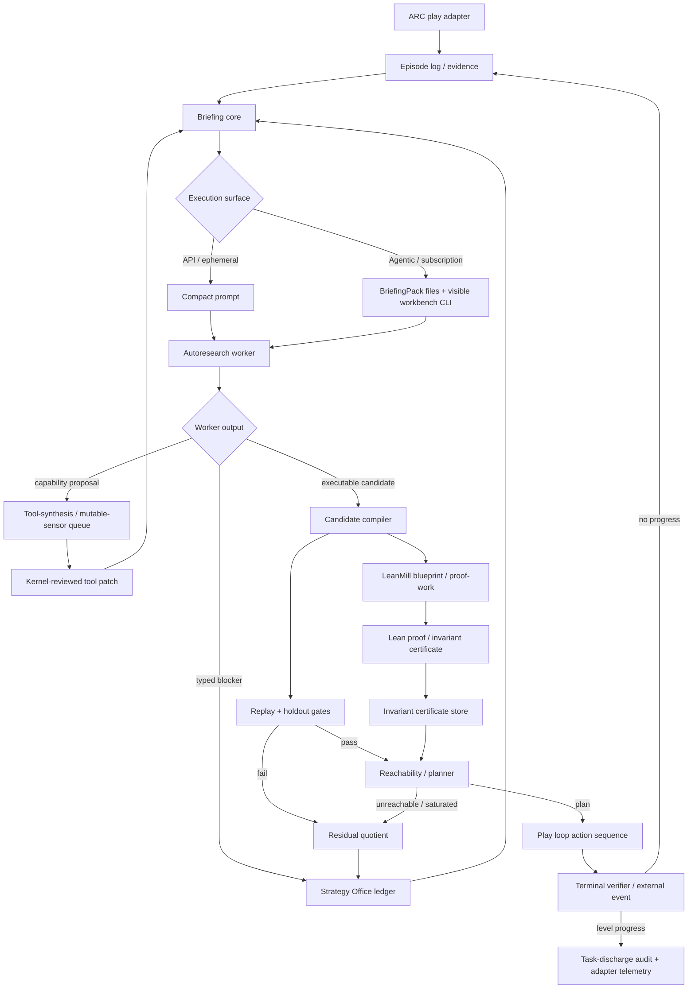

# ARC-AGI-3 World-Model System (GP-250)

> Up: [`docs/README.md`](../README.md)

GP-250 applies the ZTARE thesis to ARC-AGI-3 interactive grid games: governance around a frozen model produces more reliable behavior than an ungoverned agent. The system identifies a compact transition law, verifies it through deterministic gates, and searches for adapter-adjudicated task discharge through planned exploration. Every hypothesis is falsifiable and every claim is receipted.

The product target is general-purpose skill acquisition. ARC contributes a
2D observation adapter, discrete interventions, and one adjudicator. Common
contracts may not assume any of those properties. Observation payloads may be
text, 3D scenes, graphs, theorem states, quantitative models, or partial
histories; task discharge may be qualitative, kernel-checked, committee-owned,
or environment-owned. Substrate nouns remain in profiles and adapters.

The seam document is at
[`research_areas/seams/substrates/arc/GP-250_arc_agi_3_interactive_program_synthesis_seam.md`](../../research_areas/seams/substrates/arc/GP-250_arc_agi_3_interactive_program_synthesis_seam.md).

## Table of Contents

- [What the system does](#what-the-system-does)
- [End-to-end flow](#end-to-end-flow)
- [The active learning transaction](#the-active-learning-transaction)
- [The worldmodel pipeline](#the-worldmodel-pipeline)
  - [Spec abduction](#spec-abduction)
  - [The operator catalog](#the-operator-catalog)
  - [Replay and holdout gates](#replay-and-holdout-gates)
  - [Reachability sweep](#reachability-sweep)
  - [Task adjudication](#task-adjudication)
- [Governance layers](#governance-layers)
- [Escalation ladder](#escalation-ladder)
- [Runtime proportionality invariants](#runtime-proportionality-invariants)
- [Case study: ls20](#case-study-ls20)
- [Generalization discipline](#generalization-discipline)
- [Flows](#flows)

---

## What the system does

ARC-AGI-3 levels are interactive: the agent earns evidence by acting in an environment whose rules are unknown. GP-250 treats each action as a falsifier. The next action is chosen as the cheapest experiment that kills the most surviving candidate world-models; when one candidate survives to a singleton committee, the reachability sweep produces a goal-directed plan.

The governed object is a transition program over its declared observation
chart, such as `T(observation, intervention, chart_coordinates) ->
observation'`. Clocked behavior is admissible only when the coordinate belongs
to a versioned chart or is derived from observation state. A raw replay index
has no authority. A candidate earns status by reproducing all observed
transitions (replay gate) and predicting held-out future steps it was not fit
on (holdout gate). When zero candidates survive, the gap is classified and the
escalation ladder fires.

The system inherits the ZTARE deterministic enforcement floor. No candidate is ratified unless all deterministic gates pass. The key invariant is zero false ratification.

## End-to-end flow

ARC is the current interactive-environment adapter. Autoresearch is the System 2
compiler loop that turns evidence into candidates, blockers, or meta-tool
proposals. LeanMill is an asynchronous proof-work adapter. They share one
authority ladder.



The worker may iterate locally over syntax, carrier purity, visible probes, and
receipt compatibility. It may not see hidden holdout, terminal outcomes, or
promotion state through that local loop.


Run status belongs in receipts and observability files, not in this architecture
map. The stable contract is that an interaction-envelope failure is an
interface defect, while a replay/holdout/terminal failure is candidate evidence.
The next work item should be derived from the current typed residual quotient
and the admissible morphism frontier, not from stale prose in this document.

## The active learning transaction

The smallest object that can claim learning spans the full evidence-to-action
cycle. Its content identity binds the task contract, adapter, evidence epoch,
active abstraction or version space, incumbent carrier, and phase. The active
worldmodel lowering realizes the following state sequence:

```text
counterexample observed
-> operation identity abstracted
-> recurrence/discriminator obligation selected
-> intervention planned and executed
-> new transition checked
-> selector refined
-> candidate compiled over the named carrier
-> replay/holdout consequence consumed
-> carrier adopted or the next typed residual opened
```

No intermediate artifact can claim the whole transition. In particular,
prompt delivery is not consumption, a materialized candidate is not evaluated,
and a selector status from one evidence epoch cannot govern its successor. A
cached workbench receipt binds the bytes of the episode, regression, and
handler implementation it consumed. Evidence growth invalidates that receipt
and replays the same registered morphism chain.

Operational route events are idempotent under their declared governing
identity. Candidate materialization and gate consumption are emitted by the
single evaluator door; diagnostic proposal enumeration has no operational
write authority. A projection counterexample fences live action until its
consumer refines the factor roles. Apparatus obstruction, scientific
refutation, abstraction non-commutation, bounded capitulation, and task
discharge remain disjoint terminal outcomes.

This transaction has now first-fired through two successive LS20 operation
acquisitions. The repository still lacks one shared digest joining every stage,
and the P0 snapshot remains `observer_only`. The architectural migration is to
centralize that identity and reducer while deleting alternate `latest` readers,
private rerankers, and prompt-based acknowledgements. Adding a parallel
learning ledger would repeat the defect.

---

## The worldmodel pipeline

The substrate lives under `src/ztare/worldmodel/`.

### Spec abduction

Raw play transitions accumulate in the episode log (`episode_log.py`). The
module `spec_abduction.py` is the interactive-grid adapter: it recovers a
candidate law deterministically from those transitions with zero LLM calls. A
transition's changed-cell diff proposes rules into per-action option lists; a
population assembler scores combinations and selects the fewest-rule
gate-passing spec by MDL. Rectangles, cells, palettes, and spatial guards remain
inside this adapter.

The common spec-abduction contract is evidence population plus versioned
hypothesis language, consumer equality, complexity prior, executable
concretization, and falsifier. It returns a version space with supported and
undefined domains. Group actions govern certified invertible symmetries;
partial maps govern incomplete or irreversible transition graphs; groupoids
and chart morphisms govern local transport; alpha/gamma and future-behavior
equivalence govern abstraction and state merging. No observation totalizes a
partial graph merely because its presentation resembles a familiar group.

Two learners populate the options. The write-function learner (`_fit_write_function`) fits constant, involution, and permutation rewrites from transition consistency and MDL. The Espresso guard learner constructs guard conjuncts using `when_dest` without replacing prior guards, so refinement compounds rather than resets.

`spec_nogood.py` maintains a visible-provenance conflict-clause ledger for eliminated spec hypotheses. It is env-gated and **default on** (`ZTARE_SPEC_NOGOOD`; set `"0"` to disable). When active, credited `INVESTIGATED` science turns write visible-evidence conflict clauses to `workspace/spec_visible_nogoods.jsonl`; subsequent abduction passes consult the ledger to prune already-refuted candidate families. A contamination firewall enforces that only evidence tagged `evidence==visible` may populate the nogood ledger; a holdout reference in a witness payload raises immediately.

### The operator catalog

The catalog is the vocabulary of expressible physics. Each operator is parameterized from observed episode-log evidence, carrying no game constants.

`translate_block` handles rigid-block translation. The diff reveals the displacement, block colors, fill color, and destination colors directly. It underlies the ARC objectness adapter in `object_roles.py`: that inducer labels grid features by behavioral role from transition statistics alone, with no game documentation visible. The ARC-facing names (`moves_under_actions`, `monotone_depleting`, `never_changes`, `covered_uncovered`, `static_structural_mirror`) are substrate-profile roles, not kernel ontology. A cellular automaton, text environment, or 3D simulator should supply a different `alpha` map and abstract signature rather than pretending it has an "agent" or "resource."

`region_event` fires a write when a mover crosses a spatial rectangle. Writes include fixed color assignments, toggle (self-inverse color permutation), and cycle (higher-order permutation). Contact events are the degenerate case where the rectangle bounds a single boundary cell.

`consume_extremal` rewrites the extremal point of a selected ordered component to a replacement feature value. In ARC-grid lowering, the ordered component is usually a row or column and the feature is a color; bars and counters are one observable lowering, not the kernel concept.

Guards compose onto any rule:
- `when_count` — step-start color count threshold
- `when_overlap` — mover-in-rect test
- `when_action` — action-id filter
- `when_region` — rectangle content pattern
- `when_phase` — periodic step gate
- `when_effect` — rule-coupling: fires only if a named rule changed the grid on this step
- `when_dest` — relational destination content gate

A post-identification refinement pass (`_derived_display_refine`) handles indicator-flag cells whose color state mirrors the goal condition without belonging to the physics chain. These derived-display laws extend the spec after the primary operator chain passes its current replay obligations.

Lean parity (`spec_lean.py`) maps catalog operators to Lean 4 definitions. The LeanMill bridge (`lean_bridge.py`) certifies structural invariants such as monotone resource depletion and grid factorization.

### Abduction levels and LeanMill routing

The feedback loop uses three inference levels with different candidates and judges:

| Operation | Candidate | Evidence and judge | ARC effect |
|---|---|---|---|
| Worldmodel induction | A transition program | Episode transitions, replay, hidden holdout, terminal events, MDL | Supplies the current dynamics model |
| LeanMill premise abduction | A missing premise for one sequent | SMT/QE sufficiency followed by a Lean child obligation | Helps one proof campaign; it does not extend the theory |
| AxiomPack theory induction | A small reusable theory extension | Typed finite models, independence witnesses, frozen shadow tasks, exact proof ablation, separate ratification | Improves later proof campaigns after promotion |

`autoformalize-from-notes` is the default ARC route. It asks whether an invariant follows from the concrete abduced spec. A kernel-accepted proof may return through `invariant_certificates.jsonl` and constrain reachability.

AxiomPack is an escalation for a repeated family of distinct, admitted proof gaps under the same typed base theory. A candidate pack remains conditional even after it improves proof yield. Before an axiom-derived claim constrains ARC play, the claim must be proved from the concrete spec or receive independent environment evidence. This prevents a useful assumption from being mistaken for an observed world law.

The abstraction functor and constraint morphisms transport representations and
certificates. Hypothesis induction remains the responsibility of the three
operations above. `AbstractionFunctor` owns alpha/gamma CEGAR checks;
`common/equivariance.py` separately certifies group presentations, actions, and
quotient authority; `common/observation_chart.py` owns partial chart transport.
Keeping these certificates distinct prevents an invertible symmetry claim from
silently authorizing an irreversible or cross-epoch map.

### Replay and holdout gates

`gates.py` runs two checks in sequence. The replay gate tests the candidate against every observed transition in the episode log. Any mismatch is a hard failure. The holdout gate presents a fresh action script the candidate never saw and checks cell-level prediction on the resulting episode.

The `env_frame_indices` function classifies episodic discontinuities (deaths, resets) from the log so that each life segment is treated as a separate evidence slice, preventing a death-reset from masking a replay failure on the prior life.

Both gates are exact and fail-closed.

Gate tiers and holdout exposure policy follow the CEGIS membrane. Gates carry an evidence tier: `observed` gates are must-pass (any failure is a hard block); `heldout` gates require only non-regression against the champion's recorded value, so a candidate is not required to solve unseen material before it is allowed to improve what has been observed. Generative workers and leaf-authored evidence probes are visible-only in every run role. DISCOVERY may consume a formerly sealed slice only after an explicit evidence-state transition demotes it to visible counterexample evidence and requires a fresh future withheld slice; a role label alone never exposes active holdout. The run role is read from `MANIFEST.json` and defaults to `EVALUATION` when absent.

**Dynamics assumption.** Both ARC rubrics (`arc3_ls20_gov`, `arc3_tu93_gov`) declare `dynamics_assumption: lawful_time`. This lifts the syntactic t-read ban in `worldmodel_carrier_purity.validate_worldmodel_carrier_source`; anti-memorization is instead discharged by the held-out rollout and dominance gates. The resolution order is `ZTARE_DYNAMICS_ASSUMPTION` env var > rubric `dynamics_assumption` field > `markovian` default. When `lawful_time` is in effect, the leaf-workbench fragment head emits a `PHYSICS DECLARATION` line so the leaf knows time-dependent laws are admissible for this substrate.

**Role-conditional personas.** Both ARC rubrics declare a `personas` dict with `discovery` and `evaluation` keys. `cegis_membrane.select_persona(rubric_data, run_role)` picks the relevant stance: DISCOVERY and HARNESS\_DEBUG roles receive the `discovery` key ("natural scientist of transition programs"), while EVALUATION receives the `evaluation` key ("adversarial reviewer"). Judges are dispatched with `run_role=EVALUATION` (`test_thesis.py` passes `EVALUATION` directly), so they always see the adversarial-reviewer stance. Mutators are dispatched under `resolve_cegis_run_role("mutator")`.

### Observation charts and evidence migration

`common/observation_chart.py` separates coordinate presentation from
transition identity. An `ObservationChart` is versioned and content-addressed.
A `ChartTransportMorphism` is a declarative partial map between two charts. It
is not represented as a group action: chart transport may be non-invertible,
while `common/equivariance.py` certifies within-epoch automorphisms.

Whole-bank analysis may discover a clock origin or coordinate alignment. Once
admitted to incremental image maintenance, the resulting transport token must
be frozen and pointwise: registered operations receive one packet value and
immutable JSON parameters. Exact target checks plus repeated, reversed, and
rotated witness order expose stateful or order-dependent maps. A contextual map
that still requires history is executed as a batch evidence migration or as a
stateful transducer with explicit state identity.

An append to a sidecar-bound evidence log advances two coupled identities: the
episode bytes and the sidecar binding. Before replacement, every existing bound
row and transport witness is checked against the proposed row positions and
observation hashes. After a compatible append, the sidecar is rebound to the
successor episode digest. Reorder, deletion, or mutation of a bound observation
fails before the authority moves.

Concretization is a constrained fiber selection. A canonical observation may
lower only to a unique destination-chart member whose reachability receipt
binds canonical identity, chart identity, and presentation bytes. Zero members
returns `unreachable`; multiple members return `ambiguous`.

Every governed run pins an `EvidenceEpochSnapshot` before its first leaf prompt
and checks the same content identity before subsequent prompts and candidate
gates. This is multi-version concurrency rather than a global lock. A worker
may finish against its pinned epoch, while the promoter rejects that result for
any successor epoch. Chart migration publishes a new bank identity; caches and
image histories rebuild lazily under that identity. System 1.5 cannot move the
scientific leaf's data manifold inside a live CEGAR round.

### Reachability sweep

When the candidate pool reaches singleton, `reachability.py` enumerates the reachable abstract state space under the champion law. The kernel sweep is parameterized by caller-supplied `abstract_fn`, `coverage_fn`, `goal_fn`, and optional ratified invariants. In the ARC adapter, the abstract key currently lowers to controllable support, monotone quantity state, and reactive supports; other substrates should provide their own quotient. Pruning is allowed only from kernel-ratified invariants. Role-derived coordinates are search hints until certified.

The downstream planner follows the same rule. If an `abstract_fn` is available,
fallback goal/novelty/progress planning prunes by `(alpha(state), phase)`,
not by action-prefix identity. Raw-grid planning remains the fallback when no
abstraction map is supplied. Novelty is measured over the chosen abstraction,
so visual churn that preserves the quotient does not count as exploration.

In environments with multi-life play, each life segment is swept independently
under the same law. Exact finite-frontier drainage returns
`model_target_unreachable`: a theorem only about the current model and quotient.
Hitting the state cap returns `search_budget_exhausted` with frontier size,
expanded-state count, recent discovery rate, and deepest witness. A flat
discovery derivative may change allocation or trigger an abstraction-cost
audit; it cannot refute the transition law or prove target unreachability.

The active allocator pays for at most one full projected-coverage exhaustion
per pursuit. After `search_budget_exhausted`, subsequent replans use
`incremental_novelty_after_bounded_capitulation`; the carrier, task contract,
prompt, and environment adjudicator do not change. Both policies write the
same acquisition-routing receipt family. The multi-epoch wrapper preserves
the final planning status and typed planning outcome; the number of execution
segments is reported separately. This prevents a history property such as
`multilife` from hiding the state transition that Strategy routing consumes.

Accepted carriers may expose a consumer-indexed factor lowering through
`worldmodel/compiled_fiber_planning.py`. The lowering compiles carrier-emitted
effect receipts into seven algebraic jobs: controlled base, finite
configuration, presentation assignment, operation-domain assignment, ordered
feasibility configuration, ordered feasibility scalar, and one-shot
availability. Pattern-triggered operations lower to
the relative relation between controlled objects and current trigger
occurrences; their adapter coordinates do not enter the common kernel. These
names are worldmodel lowering vocabulary; `common/factored_search.py` receives
only opaque keys, an ordered vector, an edge predicate, and an estimate.

The terminal projection and the reachability projection are deliberately
different. Terminal-edge steering compares controlled base plus finite
configuration. Search retains availability and Pareto-orders feasibility,
because those coordinates determine whether the edge can be reached inside the
active lifecycle without changing what the edge means. Every compiled
projection writes `compiled` and `first_fire` events under the registered
`compiled_factors_to_planner.v1` route. A projected transition image that fails
to commute returns a projection counterexample plus a bounded
substrate-interpretable source difference rather than silently merging the
states. Time remains in the consumer equality key until a carrier certificate
authorizes time-translation quotienting. A targeted state-cap receipt widens
the factored frontier geometrically while leaving the goal family unchanged.

### Task adjudication

Goal hypotheses are abducted from indicator regions by `goal_abduction.py` and
held as steering candidates alongside the physics candidates. Steering targets
do not decide task achievement. The project profile declares a
`TaskDischargeContract`; the ARC adapter owns `arc.level_count.v1` and returns a
`TaskDischargeReceipt` bound to adapter evidence. Common lifecycle code sees
only the receipt status. A proof substrate can lower the same contract through
a kernel checker, and a prose substrate through a registered human or committee
adjudicator, without importing ARC counters or spatial assumptions.

`GoalHypothesisSet` identifies itself as a hypothesis version space rather than
a defined terminal identity. Factored search may try to reach a member, but a
state-cap receipt preserves the family and switches control to
information-yield acquisition instead of authorizing repeated widening. A
reached member is removed only after the adapter keeps the task open.

The grid lowering also compiles an experiment edge when a carrier operation is
a writer of a surviving predicate's observation region. Search then seeks that
operation firing through the same factored problem and commutation checks. The
relation is carrier-scoped and can change without changing predicate identity;
the adapter still disposes the resulting task hypothesis.

Terminal witnesses carry their source epoch. They may steer only inside that
epoch; an epoch boundary severs terminal identity unless target-epoch evidence
attests a new edge. When terminal identity is undefined, the planner does not
invent or transport an objective. It allocates interventions to disagreement or
the first unseen abstract class, then lets the external adjudicator and the
new observations determine the next refinement.

For repeated skill acquisition, a task contract may name a relative lifecycle
relation rather than an absolute milestone. The ARC lowering records the
adapter-attested epoch at post-seed run entry and discharges after a declared
successor delta. The counter remains adapter evidence; the common identity is
the authority-bound lifecycle morphism. Other substrates supply different
relations under the same contract.

---

## Governance layers

The system instantiates the recursive governance form described in
[One governance form at every level](../../research_areas/philosophy/three_legs_of_ztare.md#one-governance-form-at-every-level)
in the three-legs document. At every layer an agentic worker proposes; a deterministic mechanism disposes. Three layers operate in parallel.

Artifact authority is fixed. The sealed terminal verifier dominates replay, holdout, and
reachability; those dominate candidate snapshots and evidence logs; those
dominate strategy-office notes, judge rationale, conjectures, and prose. A
failed replay, holdout, reachability, task-adjudication, planted-synthetic, or deterministic
gate means candidate failure unless a separate gate-integrity receipt proves the
checker failed. Strategy can choose the next experiment, but it cannot promote a
candidate over the gate battery.

#### Production

The synthesis loop (`synthesis.py`, `spec_abduction.py`) generates candidate transition programs from episode-log transitions. This is the proposal surface for the interactive substrate, the analog of the in-loop mutator.

**Self-learning carryover.** The leaf scratchpad (`workspace/leaf_scratchpad.md`) persists across iterations: its tail (last 2000 characters) is injected at the fragment head of each new turn via `render_worldmodel_leaf_workbench_fragment`. Credited `INVESTIGATED` eliminations are written to `workspace/spec_visible_nogoods.jsonl` by the spec-nogood ledger and rendered in the same fragment head as "already eliminated (do not revisit)" case law. The tried-and-failed digest provider also surfaces the `RefutedExperimentsLedger` `REFUTED (machine-blocked)` block and recent `harness_weakness_receipts.jsonl` and `strategy_experiment_probe_rows.jsonl` rows so the mutator begins each turn with its negative memory intact.

#### Certification

The gate battery (replay, holdout, reachability, sealed terminal verifier) disposes every candidate. Promotion uses tiered dominance rather than all-gates-pass: every observed-tier gate must pass absolutely, and every heldout-tier gate must be non-regressing relative to the champion's last recorded value. A candidate that strictly improves observed performance without regressing on heldout depth is promotable even when the heldout gate has not yet reached its threshold. The `ZTARE_DOMINANCE_PROMOTION` environment variable (default `"1"`) controls this path; setting it to `"0"` restores the older all-gates-pass behavior for regression and A/B testing. The pre-registered synthetic harness (`harness.py`) provides the current behavioral baseline: BC-0 recovery discharged its registered protocol on 8 of 8 expressible environments with 0 false ratifications. BC-1'' (high-arity efficiency, pre-registered 2026-07-02) is the live gate; BC-1' failed as registered and its historical verdict stands in the seam.

#### Strategy

Two arms. The per-iteration arm is the M-form alignment audit (`src/ztare/validator/mform_alignment_audit.py`): a rubric-governed check that runs beside each loop iteration and writes Goodhart incidents to `rubrics/goodhart_log.jsonl`. The cross-cycle arm is the strategy office substrate (`strategy_battery.py`, backing `research_director.strategy_office`): a deterministic battery of audits — novelty decay, conditional coverage, event context, ledger consumer coverage, sweep horizon, level-transfer pressure, semantic-deanchor pressure, planner-attention pressure, and loop-control pressure — that the Research Director consumes to choose the next experiment.

Strategy Office is meta-control, not a model patcher. Its receipts compile low-yield behavior into typed work orders: compressed counterexample repair, target/discriminator selection, semantic deanchoring, or scheduler-counterexample review. For example, `workspace/latest_information_yield.json` can surface repeated R1/pre-judge/patch-base stagnation as `scheduler_counterexample` pressure. This can redirect attention and commission a kernel-improvement proposal, but replay/holdout/terminal gates still own candidate authority. In agentic filepack mode, Strategy cards are records and refs; they must not become the primary `TASK.md` ask. The primary ask is substrate-invariant: compress visible transition evidence through alpha/gamma into an executable law, or return a receipt-bound obstruction.

#### Machinery

The machinery itself is a governed object under the same form.
Contradiction detectors (`machinery_contradictions.py`) issue proposal cards when classifier excusals conflict with live play. Cards travel through the operator-proposal ledger (`workspace/operator_proposals.jsonl`) and are adopted only under the [machinery rules](../reference/machinery_rules.md). Certifier-touched cards require conductor disposition; auto-adoption is restricted to tightening changes. The [Machinery governance](capabilities.md#machinery-governance) section records the substrate-agnostic parts of this contract.

---

## Cross-substrate algebra

The worldmodel substrate (`src/ztare/worldmodel/`) and the decision-support kernel ([`docs/concepts/decision_support_primitives.md`](decision_support_primitives.md)) instantiate the same five-cell decomposition — ADMIT / EVALUATE / ATTRIBUTE / AGENDA / MAINTAIN — over different evidence types. The warrant-tier ladder maps one-to-one: *unchecked* corresponds to leaf-authored prose and raw riders; *cited* corresponds to receipt-bound claims (`evidence_refs`, `search_receipts`); *reproducible* corresponds to deterministic gate replay; *proven* corresponds to kernel invariant certificates (`invariant_certificates.jsonl`). Both substrates built this structure independently; its recurrence shows that the decomposition is not an artifact of one design session.

The **shared-algebra-sovereign-substrates** policy governs which parts live where. Substrate-free math is extracted to `src/ztare/common/`: `identification_bits` (the prior-free information yield used in the AGENDA cell) lives in `src/ztare/common/information_yield_pricing.py`; the hitting-set core used for minimal environments lives in `src/ztare/common/hitting_sets.py`. Evidence semantics, receipt shapes, and determinism floors remain substrate-local — the worldmodel substrate's replay/holdout gates and the kernel's quote-binding and recheck door are not merged, because the evidence types they govern differ and the independence of the gatekeeping matters.

Full unification — admitting worldmodel witnesses (ratified invariant certificates, gate-passing candidates) directly into the governed argument graph at the *proven* tier — is possible in principle but is gated on a committee-adjudicated receipt naming the concrete need. Until that receipt exists, the substrates share algebra and common modules; their authority structures remain separate.

---

## Proposal engines: System 2 is plural, authority is singular

The governed autoresearch loop is no longer the sole System-2 entry. The
system now carries three proposal engines, selected by the *knowledge state*
of the project, all feeding one authority spine (deterministic gates →
dominance materializer as the single promoter → append-only ledgers):

1. **Governed autoresearch** (`validator/autoresearch_loop.py`) — the
   full-ceremony general engine: briefing pack, K-parallel persona-diverse
   mutators, judge, R1 contracts, committee. The entry when the frontier is
   *unshaped* — no champion, no witnessed failure, open-ended science on any
   substrate. Heaviest per iteration; the only engine that can change what
   kind of thing is being sought.
2. **Residual specialists** (`worldmodel/residual_specialists.py`) — the
   mechanism-frontier engine: the frontier is computed from the champion's
   own first divergence (propagated rollout, never stale records), shards
   are rival *mechanism families* (cause, not cell-attribute), leaves run in
   a workbench with the gate as an in-turn preflight tool, and deliverables
   are a mechanism + discriminator or an INVESTIGATED elimination. The entry
   when a champion exists and the question is *which law governs a witnessed
   divergence*.
3. **The version-space loop** (`worldmodel/version_space.py` +
   `population_enumerator.py` + `distinguishing_play.py`) — the extensional
   engine: maintain the *population* of visible-perfect programs. Executable
   hypothesis identity remains content-addressed source; a behavioral
   fingerprint on a frozen probe battery is an equivalence certificate used
   to allocate distinguishing experiments and never merges source identities.
   Diversify by enumeration when authorship converges (measured: the entire
   LLM-authored candidate history of ls20 collapsed to one behavioral
   fingerprint); compute *distinguishing experiments* from survivor
   disagreements and play exactly there. Each observation writes both
   ledgers: an extensional prune and an intensional nogood. The entry when
   the law is catalog-expressible and *evidence acquisition* — not
   hypothesis generation — is the bottleneck.

The routing rule is mechanized: `worldmodel/engine_router.py` computes the
knowledge state from receipts (champion present, visible residual, frontier
witness freshness, population fingerprint diversity, unresolved
disagreement targets, stagnation) and selects the engine, appending every
decision to `workspace/engine_routing.jsonl`. On its first production invocation
the router out-routed the human conductor — the conductor's choice was
stale against receipts that had moved. Long-term the router's invocation
point belongs in autoresearch loop control (System 2 is a single shell with
plural proposal strategies, not plural loops); the play-loop seam carries a
kill-switch (`ZTARE_ENGINE_ROUTER=0`) for the interim.

Engines share the pricing door (`identification_bits` /
`residual_information_yield` — one function, all consumers), the warrant
tiers (population admission is *reproducible*-tier by construction), and the
promoter. None of them holds promotion authority; the materializer's
product-order dominance is the only door into `test_model.py`, whichever
engine authored the candidate.

**Configuration memory remains a causal-experiment requirement.** The former
`common/k_line.py` presence-contrast implementation and its router-prior lane
were removed: no production path wrote matched treatment/control evidence, its
stored vocabularies could not match router signatures, and no routing decision
had consumed its output. Ordinary stagnation and pivot control are independent
and remain active.

A successor may remember a configuration only as a prospective ablation over a
declared problem population. Correlational telemetry may nominate the factor;
it has no allocation authority. A matched treatment/control consequence on the
same population can then authorize a bounded allocator change. This control
memory changes search topology only and never supplies scientific content.

Control receipts compile only into search topology: allocation weights,
frontier width/depth, active tools, phase transitions, and structural filters.
They do not become semantic advice in a worker prompt. Review packets remain
queryable, but the worker supplies their scientific interpretation.

### Category contracts: measurements vs causal identities

The system uses several named categories for committee members and episodes.
Their epistemic status differs and must not be conflated.

**Measurement categories (attribute-statuses).** Holdout depth,
visible-perfect, champion, and task-discharge status are measurements: they
record what the current evidence says about a candidate or run under a defined
protocol. A candidate is `visible-perfect` when it reproduces every visible
transition exactly; `champion` when it holds the highest dominance rank. A run
is `discharged` only when its declared adjudicator emits a bound receipt. These
statuses are contingent on the evidence and protocol and may change when a new
epoch begins.

**Causal-identity categories.**  Mechanism family and episode are causal
identities — they name *what produces the behavior*, not what the behavior
scores.  A mechanism family is a causal identity only after the candidate has
survived intervention-response tests (action perturbations that reveal the
underlying rule family).  An episode boundary is a causal identity only after
reset-invariance tests confirm that the physics resets cleanly rather than
carrying hidden state across lives.

**Protocol discharge requires bound receipts.** A law-identification claim
requires replay and withheld-transition receipts. A task-achievement claim
requires the separate `TaskDischargeReceipt`. A search-exhaustion claim
requires its bounded frontier receipt. These obligations are neither
interchangeable nor summarized by one broad status. A depth reading alone
(`holdout_depth == N`) is a measurement and cannot discharge any other
obligation.

**Operational schemas declare their governing identity.** The schema route
registry requires job, owner, lifecycle or epoch, authority, equality relation,
compatibility relation, and an active producer-to-consumer edge. Cold proposals
and telemetry have different lifecycle identities and cannot acquire authority
from mere existence.

**Adapter-Width Law.**  A substrate adapter's interface is the machine-readable
enumeration of every abduction outsourced to humans — the "givens": variables,
actions, success signal, reset semantics, time structure, observability, and
verification oracle.  Width is the count of fields still at status ``given``.
Generality is the ordered deletion of adapter fields, each replaced by an
abduction organ and a validation receipt. The former standalone width reporter
was deleted because it wrote snapshots that no decision path read. Width is
now a derived architectural score over registered adapter contracts and their
first-fire receipts; a self-written JSON file cannot lower it. The current ARC
adapter still supplies every listed category, so no graduation should be
claimed until one is removed from the adapter API and recovered through the
same common transaction on at least one additional substrate.

---

## Escalation ladder

When abduction stalls, the system climbs a cost ladder before calling an LLM.

**Warm abduction (seconds).** `spec_abduction.py` runs deterministically from the current episode log. If the champion still passes all gates after appending new transitions, it is returned immediately via the CEGIS warm-start: one replay rather than a full search.

**Seeded search (minutes).** `synthesis.py` runs version-space candidate elimination over the per-action option lists, with MDL scoring, the population assembler cache, and the E-graph shared sub-evaluation. No LLM calls.

**Operator proposal cards.** When the gap survives seeded search, the
grammar-completeness audit (legacy module name `closure_audit.py`) and current
residual triage emit proposal cards bound to the visible evidence digest, row
count, residual family, and active task when present. `grammar_reflex.py` owns
only this binding and delivery. The registered briefing consumer exposes the
card to the ordinary governed executable-carrier worker; the single evaluator
owns materialization, replay, withheld evaluation, and adoption. The previous
grid-only sealed implementer and disabled structural-bridge branch were removed
because they formed a second implementation door.

**Sealed 5.5 checkpoint.** `evidence_digest.py` builds a bounded, prioritized digest of the episode log under a character budget: all residuals first (the transitions the current champion does not yet explain), then exemplars by diff-signature cluster, then newest transitions. This digest is the evidence surface for a toolless single-shot LLM call — sealed and context-bounded.

**Champion materialization.** At loop bootstrap, `validator/core/champion_materialization.py` scans `workspace/candidate_*.py` and `workspace/submissions/*.py`, runs the project gate harness on each, and promotes the best dominance-eligible candidate to `test_model.py`. A candidate is eligible only if it passes all observed-tier gates and satisfies the tiered dominance check against the live model. The backup of the prior model is written to `workspace/test_model_pre_materialization_<ts>.py` and the promotion receipt appended to `workspace/champion_materialization.jsonl`. The behavior is env-gated (`ZTARE_CHAMPION_MATERIALIZATION`, default `"1"`). `test_model.py` is also staged into briefing packs as a compact visible-workbench reference artifact.

**Active search carrier.** Promotion history and the next repair baseline are separate objects. A configured producer may supply a stronger but still refuted carrier as the governed repair frontier. The play loop copies those exact bytes to `test_model.py` and records the selection in its existing play receipt without granting promotion authority. The tier-0 carrier provider composes three existing surfaces: current root bytes, admissible candidate memory, and the newest promotion receipt. It renders a promotion directive only when the promoted digest still equals the root carrier; otherwise an equal-byte candidate-memory record becomes the repair baseline with `promotion_authority:false`. This prevents an old champion directive and a newer repair frontier from competing in the same prompt without introducing another ledger.

**Envelope normalization.** The kernel normalizes declaration headers rather than rejecting them with strikes. `evaluate_mutation_declaration` (`ztare.validator.core.mutation_contract`) computes the actual touched artifacts from the diff. If the declared scope is narrower than the actual change (`UNDECLARED_ARTIFACT_BREADTH`), the kernel upgrades scope and records an attribution note. If the declared primitive is not in the approved index (`INVALID_PRIMITIVE_DECLARATION`), the kernel drops it with a note. Neither case consumes a strike. R1 retries run in `visible_workbench` mode via `resolve_agent_execution_mode("mutator")`, which preserves instruments across the retry.

**Impossibility-claim witnesses.** A `LOWERABILITY_BLOCKED` payload asserting a missing state feature must supply `search_receipts` (`ztare.common.sealed_boundary_cegar._validate_missing_feature_search_receipts`). The validator raises if `search_receipts` is absent when the obstruction names a missing-feature claim.

**Leaf workbench boundary.** A sealed leaf is not equivalent to an unbounded
terminal conductor. The leaf may only see compressed, redacted,
authority-ordered fibers of the project, while the kernel retains hidden
holdouts and terminal authority. When a task requires inspection rather than
one-shot synthesis, the correct shape is a capability-safe mini workbench:
bounded reads, named deterministic diagnostics, local preflight over staged
visible files, and typed command receipts that the candidate must cite. There
are two execution fibers, with one authority ladder. If the worker is a
subscription-backed visible-workbench agent, it runs in the staged workspace
profile: local probes and scratch files are allowed inside the staged pack, but
source artifacts, hidden evaluator data, live actions, and authority gates
remain outside the leaf. If the needed observation is authority-bearing
(sealed replay, hidden holdout, live world actions, canonical adoption, or
dictionary write-back), the worker must emit a typed workbench action request and
cite the durable kernel-produced receipt on retry. The parent resolves that ref
and verifies its subject identity against the submitted carrier; the worker does
not copy the parent-owned receipt object into its response. This is the in-loop analogue of
`ztare autoresearch route`: the outer router decides whether a task belongs in
the workbench; the inner leaf workbench gives an admitted worker the minimal
observation/action loop without raw repository or holdout access. It must
preserve the same authority ladder: workbench receipts can explain a patch, but
replay, holdout, and the sealed terminal verifier still decide.

The mutator briefing has two customer renderers over one deterministic core.
API/ephemeral workers receive a compact self-contained prompt. Agentic
subscription workers receive a small entry prompt plus a staged BriefingPack:
`TASK.md`, `ATTENTION.md`, `RECORDS.json`, `CONTEXT.md`,
`WORKBENCH_TOOLS.md`, and `MANIFEST.json`. `ATTENTION.md` is the sufficient
statistics front door over structured records: active obligation, residual
quotient, artifact refs, allowed tools, and output contract when present.
`RECORDS.json` carries exact provider records; `CONTEXT.md` is background.
`MANIFEST.json` binds staged file identity to bytes, authority class, and
visible/hidden status. This is an interface split, not a second authority
system: staged files and visible probes help the proposer reason, while replay,
holdout, terminal verification, and registered kernel actions remain the only
authority surfaces.

Interactive validators are admissibility tutors, not truth judges. In
agentic mode the staged workbench exposes visible preflight commands for
candidate-carrier and receipt compatibility checks before the final answer.
Those commands may report missing fields, malformed hashes, non-lowerable
receipt shapes, or temporal-carrier violations. They may not reveal hidden
holdout, terminal outcomes, promotion status, or sealed evaluator data. The
worker should use them to repair envelopes and local carrier compatibility
inside the same turn; final truth still belongs to replay, holdout, terminal
verification, and promotion gates after submission.

The same surface must not own the local stopping problem. The leaf-local
validator checks admissibility, carrier purity, visible refs, and receipt shape;
it does not enforce a fixed probe sequence before a blocker. A blocker is valid
only when it is evidence-bound: it names the candidate family attempted, the
visible receipts or command errors relied on, the current obstruction, and the
next non-promotional action. Tool-frontier helpers may exist for debugging, but
they are not surfaced as required work and cannot decide whether the leaf should
continue thinking.
Agentic packs stage the compact telemetry files
`workspace/latest_information_yield.json` and `workspace/p0_metrics.json` when
available. They are sufficient-statistic front-door files; the full iteration
history stays out of the default workbench unless an explicit task asks for it.
Deterministic producer receipts enter the pack when referenced by structured
records, for example `source_receipt=workspace/abduced_core.json` or
`diagnostics_ref=workspace/latest_replay_diagnostics_after_abduce.json`. These
are read models for the leaf's candidate reasoning; abduction and synthesis
computation remain producer steps, not prompt-renderer side effects.
Recursive-improvement tasks may also stage the producer source surfaces
(`spec_abduction.py`, `goal_abduction.py`, synthesis/refinement lowerings) as
mutable-sensor/tool-source files, but those source files are for proposals and
patch review. They do not authorize object-level candidate promotion.
The current Codex visible-workbench source bundle includes the abduction source
files for inspectability; their presence is a source-fiber affordance, not an
evidence receipt.

For the current harvest/debug phase, the default run shape is one science leaf
per iteration. That worker should first attempt a transportable executable law
with the current visible artifacts, producer receipts, and in-turn morphisms.
It may inspect source fibers to understand or propose apparatus improvements,
but a science-lane blocker must cite observed receipts or visible evidence,
not source-code files. The science leaf has three closing shapes: executable
candidate, registered workbench action request, or `LOWERABILITY_BLOCKED`.
A tool/capability proposal may be attached as optional meta evidence, but it
never satisfies the science turn by itself. Strategy aggregation owns promotion:
open tool-synthesis only when the same gap recurs, blocks a declared next gate,
or drives a repeated no-candidate/no-level loop under the same residual. Scaling
to multiple agents is a lane scheduler decision (science, meta-hardening,
proof-work, tool-synthesis), not a reason to mix apparatus backlog into the
science leaf's front-door attention.

The workbench menu is also governed. A leaf may not invent a missing action and cite it as evidence. Unknown or defective actions may be described as a tool gap inside `LOWERABILITY_BLOCKED`; optional proposal skeletons must include input/output contract, evaluator, secret policy, safety invariant, and rollback condition. Capability proposals are morphism-shaped: they name the current state, desired state, and admissibility witness, so a future tool can be tested as an extension rather than smuggled in as a hand-authored hint. Only registered capabilities can produce `LEAF_WORKBENCH_RECEIPT` evidence. A card is lowerable only when its typed parameters select a registered executor whose consequence has a downstream consumer; a matching kind string or a workspace script is insufficient. In a skill-acquisition run, a proposal alone is cold meta-backlog: it neither satisfies the current residual nor authorizes an empty candidate. The science-lane obstruction is `LOWERABILITY_BLOCKED`, which must cite attempted visible capabilities, attempted candidate family, missing witness/sensor, next action, and evidence refs. Only a paired lowerability obstruction or repeated telemetry-backed recurrence makes a proposal eligible for Strategy Office batch review. Proposals targeting hard-kernel gates remain audit records only. This keeps the interface self-improving without making a hardcoded menu into a new prior.

Discovery blockers have one extra accounting rule. If a leaf marks staged
visible or explicitly demoted counterexamples as consumed evidence, the blocker must also
cite `evidence_analysis_refs`: a derived scratch artifact, visible diagnostic
receipt, or scored candidate that shows how those refs were used for
alpha/gamma repair. It must also include `stopping_rationale`, a local
information-yield statement explaining why the next visible action is not worth
or not possible inside the same turn, and `local_frontier_decision`, the typed
frontier of available, attempted, and unattempted local actions with expected
information and stop reason. Raw counterexample files plus failed registered
morphisms do not certify that no lowerable law exists. This preserves agency in
the leaf-local search while preventing receipt completion from becoming the stop
condition.

Candidate-delta scoring must preserve the search gradient even when promotion
fails. If a candidate improves the visible comparison surface against the
incumbent but still fails replay, holdout, or another deterministic gate, the
visible scorer returns a prior-comparison receipt with the counterexample
quotient and relation `improved_but_gate_failed`; it does not collapse the
result to an opaque hard failure. The gate still blocks promotion, but the leaf
keeps the relative information needed for the next alpha/gamma repair.

The kernel contract is substrate-general (`ztare.common.leaf_workbench_contract`). ARC/worldmodel only supplies a lowering (`ztare.worldmodel.leaf_workbench`): inspect the authoritative patch base, inspect the current replay-residual quotient, run or consume a frozen replay probe, validate Strategy-card receipts, and score candidate deltas against the incumbent. Other substrates should add their own lowerings under the same contract rather than importing ARC vocabulary into the kernel.

Identity and property fields must not be conflated. Identity fields name stable
artifacts, content hashes, command ids, receipt refs, and adapter-owned source
coordinates. Property fields describe current interpretation: freshness,
dominance, role, status, quotient relation, score, or admissibility. A prompt or
provider may summarize properties, but it must not encode them into artifact
refs or command identities. Conversely, substrate folklore (`row`, `color`,
`level`, `outcome counter`, `agent`, `resource`) may appear inside adapter receipts when
that is the observed evidence vocabulary, but it must not become kernel policy.
The portable kernel vocabulary is artifact, carrier, quotient, gate, receipt,
adapter lowering, and prediction/action card.

Action requests are part of the same contract. A leaf may submit a `LEAF_WORKBENCH_ACTION_REQUEST` for a registered capability and parameter tuple; the kernel executes only a tuple inside the consumer's declared executable domain and returns `LEAF_WORKBENCH_RECEIPT` on the free retry. Wrapper capability identity does not authorize arbitrary inner commands. A Strategy card's `required_next_gate` is a verification predicate; it becomes an executable control action only when the substrate adapter registers that command as a consumer. The kernel verbs stay generic: read an artifact, run a pure diagnostic, invoke a registered bounded action, score a candidate delta, record a missing-instrument observation, and record a receipt. Substrate commands such as ARC transfer probes live behind that adapter registry. A bounded common probe, `run_visible_json_probe`, lets the leaf run pure Python over explicitly named visible JSON artifacts when it needs a one-off aggregate before a stable wrapper exists. In visible-workbench mode, the same probe surface is also staged as an in-turn CLI over visible artifacts/stdin, so the leaf can run local counterexample checks before final submission; hidden holdout, live environment actions, candidate promotion, and dictionary write-back remain kernel-only. Every non-manifest visible CLI command writes a content-addressed receipt under `workspace/visible_cli_receipts/` and returns `persistent_receipt.ref`; the leaf can pass those refs into `probe-json` to compose visible evidence inside the same turn. If neither layer fits, the leaf emits `LOWERABILITY_BLOCKED` and may attach an optional proposal skeleton as cold backlog. This is the sealed-worker version of tool access: choose the next observation/action agentically, but execute through typed capability receipts rather than arbitrary repo access.

The receipt/action wording is centralized in `ztare.common.leaf_workbench_contract`. Prompt and projection files that expose that contract are mutable sensors: they may be improved through `tool_synthesis`, but they must render common action-request objects and must round-trip through the same parser and validator used by the loop. No substrate adapter owns a private receipt dialect.

Strategy Office cards split by role through one common classifier:
`ztare.common.control_work_items` (`strategy_card_roles` is only a compatibility
projection). Skill-acquisition cards are active memory and gateable obligations,
but they do not define the leaf's primary ask. The worker may cite a
card, satisfy it, refute it, or block it with evidence; the AskSpec remains the
single task contract. Meta-hardening cards improve mutable instruments
such as prompt renderers, workbench tools, briefing providers, retry adapters,
or abstraction sensors. They are visible queued work, but they do not block an
object-level candidate unless the current task is explicitly a meta-hardening
task. This preserves recursive improvement without letting apparatus work
starve the play/model loop.

Strategy Office has one decision membrane and two card producers:

1. Cross-cycle experiment scheduling: `ztare.research_director.strategy_office`
   runs a substrate `AuditBattery`, optionally asks a sealed strategy leaf
   bounded read-only queries, normalizes proposed experiments into Strategy
   cards, and sends the batch through
   `ztare.research_director.strategy_decision_policy.submit_strategy_card_batch`.
2. Tool/improvement promotion: leaves may emit cold capability proposals only
   as evidence attached to `LOWERABILITY_BLOCKED`. They are recorded by
   `ztare.common.leaf_workbench_proposals`, reviewed by
   `ztare.research_director.strategy_office --review-tool-proposals`, may collect
   reviewer positions through `ztare.research_director.tool_proposal_review`,
   and then use the same `submit_strategy_card_batch` membrane before any
   `tool_synthesis` card is written.

`decide_strategy_card_batch` is the pure aggregation step; `submit_strategy_card_batch`
is the only Strategy ledger write path. The membrane can approve, reject, or
escalate card writes; it cannot promote candidates, alter replay/holdout
authority, or define the leaf's primary task. Reviewer positions can be supplied directly with
`--decision-positions-json` or collected by explicit opt-in agents with
`--decision-position-agents env|default`; the env knobs are
`ZTARE_TOOL_PROPOSAL_REVIEW_AGENTS_JSON`,
`ZTARE_TOOL_PROPOSAL_REVIEW_AGENTS`,
`ZTARE_TOOL_PROPOSAL_REVIEW_POSITION_AGENTS`, and
`ZTARE_TOOL_PROPOSAL_REVIEW_TIMEOUT_SECONDS`. The dormant default panel is Kimi
API, DeepSeek API, Codex subscription, and Claude subscription; it is never
dispatched unless that CLI flag or env selector asks for it.

Recursive-improvement proposals should target the single doors rather than
scattered prompt text. Leaf asks are represented by `ztare.common.ask_spec`;
rendered prompts, agentic `TASK.md`, retry prompts, and workbench asks should
project that shared contract instead of defining private output policy. R1
retry surfaces use `ztare.orchestrator.retry_contract` as the common envelope:
numeric models, theorem packets, assertion suites, and worldmodel carriers may
render different carrier rules, but they share one error/history/free-retry/prior
carry-through boundary.
Workbench action/receipt language lives in `ztare.common.leaf_workbench_contract`;
parent-kernel execution of those action requests lives in
`ztare.common.leaf_workbench_executor`;
tool-synthesis card construction and mutable-surface validation live in
`ztare.common.tool_synthesis_contract`; control-work-item role semantics live in
`ztare.common.control_work_items`; agentic/API rendering lives in
`ztare.common.briefing_pack`; visible in-turn tool routing lives in
`ztare.common.visible_workbench_actions` and `ztare.common.visible_workbench_cli`;
boundary state projection lives in `ztare.common.control_state_machine` and
`ztare.common.sealed_boundary_cegar`.
Control receipt parsing also lives in `ztare.common.control_state_machine`:
raw JSON `control_receipts` and rendered marker blocks normalize through
`control_receipt_rows`. Renderers may emit markers for readability, but
preflights, retry routing, and lifecycle policy consume typed rows from that
single read model.
Substrate adapters can lower these contracts, but they should not create
private prompt dialects, private receipt parsers, or alternate card-role rules.
If a leaf sees an interface failure, its proposal should name one of these
surfaces, an evaluator, and a rollback condition.

The agent-computer interface has the same single-door rule. Execution profiles
are owned by `ztare.common.subscription_agent_runtime`: sealed completion maps to
the Codex sealed profile, while visible workbench maps to the Codex
workspace-write profile with JS/MCP/web disabled. `ztare.common.dispatch_model`
selects an execution profile and stages the `BriefingPack`; it does not define
private sandbox semantics. The staged visible-workbench contract text is owned
by `ztare.common.briefing_pack.visible_workbench_contract_text` and is projected
into the entry prompt and `README.md`. A meta-hardening proposal that changes
agentic interactivity should target those owners, not scattered prompt strings.

Changing any mutable interface surface follows this path. This includes prompt
renderers, retry envelopes, workbench tools, theorem/proof ask surfaces, typed
payload compilers, substrate lowerings, and visible preflight commands.

1. Declare or reuse the common contract in
   the canonical owner: `ztare.common.ask_spec` for asks,
   `ztare.orchestrator.retry_contract` for retry envelopes,
   `ztare.common.leaf_workbench_contract` for action/receipt/proposal shape,
   `ztare.common.control_work_items` for card role and blocking semantics, or
   the relevant gate contract for proof/theorem validation.
2. Project that contract into the customer surface. API mode gets a compact
   prompt; agentic mode gets `BriefingPack` files and visible preflight tools;
   retry mode gets a common retry envelope plus substrate carrier details.
   Renderers do not define private policy.
3. If the surface is a leaf/tool action, add the visible/agentic route in
   `ztare.common.visible_workbench_actions` and, when it can run inside the
   staged workbench, expose it through `ztare.common.visible_workbench_cli`.
   This is the leaf-local preflight surface, not candidate authority.
4. Add any substrate lowering in the adapter, currently
   `ztare.worldmodel.leaf_workbench`: handler, stateless/candidate-bound/local
   route metadata, input-ref lowering, and registry-parity check. ARC-specific
   artifact names stay here. Theorem/proof substrates should add their own
   lowerings under their proof gate or LeanMill adapter rather than importing
   ARC vocabulary into common code.
5. If the surface is missing rather than implemented, route it through
   `ztare.common.tool_synthesis_contract` as a `tool_synthesis` Strategy card.
   Mutable interface files include `ask_spec.py`, `briefing_pack.py`,
   `retry_contract.py`, `submission_path_helpers.py`,
   `leaf_workbench_executor.py`, `worldmodel/retry_surface.py`,
   visible-workbench files, typed-payload compilers, and adapter lowerings.
   Hard gates and candidate authority files remain outside the mutable surface.
6. Add a parity or round-trip fixture at the contract boundary: rendered asks
   preserve `AskSpec`; retry prompts share the retry envelope; declared
   capabilities route to in-turn CLI, parent kernel, or record-only status;
   surfaced examples parse through the same validator the loop uses. Hidden
   holdout, terminal events, promotion, proof authority, and dictionary
   write-back are never exposed by local preflights.

Implementation follows the same compression rule as the world-model learner.
When two modules classify the same boundary, factor the classifier into the
canonical owner and make the other module a projection. Current ownership:
`ztare.common.projection_owner_registry` is the machine-readable blast-radius
index for these owners; meta-hardening agents should consult it before changing
contract text, automaton events, prompt projections, or Strategy write policy.

- `control_work_items`: card/work-item lane, authority, blocking policy, and
  run-context blocking.
- `ask_spec`: requested output contract; API prompts, agentic `TASK.md`, retry
  text, and workbench asks render this object.
- `science_output_policy`: object-level science output policy: candidate,
  registered action request, `INVESTIGATED`, `LOWERABILITY_BLOCKED`, tool-gap
  firewall, visible receipt composition, discovery evidence status, and final
  JSON payload keys. `INVESTIGATED` is a first-class credited science-turn
  outcome when probes eliminate a new hypothesis class from visible evidence;
  K=3 consecutive investigated-only turns (no carrier ever emitted) trigger
  stagnation pressure. The constant `INVESTIGATED_STAGNATION_K = 3` is the
  single source of truth.
- `orchestrator.retry_contract`: shared retry envelope; substrate branches own
  carrier details but not retry semantics or stale resubmission boilerplate.
- `leaf_workbench_contract`: action requests, receipts, proposal shape, and
  registered capability identity.
- `patch_base_identity`: project-relative patch-base refs, full-digest
  identity checks, and verified legacy-prefix normalization for historical
  carrier chains. Active submitted carriers must still name full hashes.
- `leaf_workbench_executor`: parent-kernel execution of registered workbench
  action requests, current-candidate byte binding, receipt stamping, and
  unique Boundary-CEGAR morphism follow-up. `repair_preflight` calls this owner;
  it does not own private executor loops.
- `subscription_agent_runtime`: subscription CLI execution profiles and sandbox
  lowering. Sealed completion, visible workbench, and full-auto execution are
  named profiles here; callers should not hand-code equivalent Codex flags.
- `briefing_pack`: the agentic file-pack renderer, visible-workbench contract
  text, `MANIFEST.json`, `TASK.md`, `ASKS.json`, `ATTENTION.md`, `RECORDS.json`,
  `CONTEXT.md`, and `WORKBENCH_TOOLS.md`.
- `dispatch_model`: transport selection and pack staging only. It consumes
  execution profiles and briefing contracts; it does not own policy prose,
  sandbox semantics, or workbench capability identity.
- `projection_owner_registry`: machine-readable concept owners, blast radius,
  and the curated visible-workbench source membrane. Science-mode `ToolSource`
  staging uses `VISIBLE_WORKBENCH_SOURCE_REFS`, a narrow executable set for
  local preflight and worldmodel induction tools. This set includes
  `evidence_probe.py` (governed leaf-authored probe over visible episode
  transitions, zero-credit, AST allowlist) and `evidence_quotients.py`
  (`event_timeline` and visible-only comparisons as library
  and workbench capabilities). It should not be replaced by a transitive import
  graph or by every file named in the meta-hardening blast-radius map.
- `visible_workbench_actions` plus `visible_workbench_cli`: in-turn visible
  tool routing and parent-kernel routing; adapter capabilities are discovered
  from the adapter registry, not by common-code string tables.
- `sealed_boundary_cegar` plus `control_state_machine`: admissible boundary
  state transitions, control receipt read-model normalization, and
  lowerability interpretation.
- `candidate_first_policy` plus `worldmodel_typed_payload`: whether a final
  payload may omit executable code.
- `validator.core.candidate_preflight` and `validator.core.repair_preflight`:
  parent-owned candidate/control compatibility checks before authority gates.
  `candidate_preflight` owns the ordered `PreflightRule` registry (`id`,
  `applies_to`, `authority`, `run`). `repair_preflight` provides rule bodies
  only. They receive executable carrier bytes separately from response
  envelopes, so control receipts cannot pollute candidate identity. They may
  call common executors, but they do not define private receipt/action policy.
- replay, holdout, terminal, and proof gates: candidate authority.

No renderer decides policy. No preflight parses prose when a typed object
exists. No adapter owns a private receipt dialect. No common module should route
on substrate folklore such as a specific level, cell color, scalar outcome channel, or
gameplay noun. Adapter facts may appear in adapter receipts; common code should
route on registered capability ids, authority class, lane, lowerability signal,
and gate status.

The sealed Boundary-CEGAR automaton is the state-chart projection of this
boundary, not a separate solver. It uses `ztare.common.control_state_machine` to
surface states such as `counterexample_open`, `observation_requested`,
`candidate_pending_gate`, and `tool_gap_pending`, while pointing to
the existing carrier, leaf-workbench, tool-synthesis, operator-proposal, and
strategy-experiment contracts as ledger surfaces. The Strategy Office owns the
meta-tool path: a missing mutable sensor first becomes a cold capability
proposal, then an explicit batch review over proposal telemetry and
lowerability receipts may promote it into a `tool_synthesis` card with evaluator
and rollback fields. Hard-kernel gates remain outside that mutation surface. R1
is one adapter of the same lifecycle-chart discipline, not the ontology.

Observation receipts split into two classes. Context or quotient receipts refine
the abstraction map: they may say two charts differ, or that the current alpha
aliases states with divergent futures. They do not by themselves authorize
candidate code. A candidate delta is admissible only after a receipt supplies a
gamma-lowerable witness: an observable selector over carrier inputs plus the
local rewrite it supports. Diagnostic-only selector coverage remains
diagnostic, even if several receipts together cover all labels; a later receipt
must explicitly certify `candidate_delta_admissible=true` or the worker must
emit `LOWERABILITY_BLOCKED`. If a leaf asks for an unregistered action, the
visible router reports a tool gap; the science payload must then either submit
a candidate, submit a registered action request, or carry `LOWERABILITY_BLOCKED`
with the missing sensor/morphism. Optional proposal skeletons attached to that
blocker are meta evidence, not a new receipt class.

Typed control moves are terminal outcomes for the current iteration when they
carry no executable carrier. A registered `LEAF_WORKBENCH_ACTION_REQUEST`,
kernel `LEAF_WORKBENCH_RECEIPT`, or lowerability-blocked receipt may leave
`test_model_py` empty; the loop must then skip candidate replay/holdout gates,
write a control receipt snapshot, and avoid probing the previous or empty
carrier. A standalone `LEAF_WORKBENCH_CAPABILITY_PROPOSAL` is cold meta-backlog,
not an admissible substitute for candidate search. Capability proposals cannot
promote the current candidate and do not become active tool-synthesis cards
until Strategy Office batch review approves them.

The score/delta workbench action is a counterexample-quotient comparison, not a rule hint. If a candidate worsens the incumbent, the retry receipt must bind the verifier tuple and the top quotient relation (`same_support_changed_pairs`, `same_quotient_worse_frequency`, or `changed_support`) so the next leaf can self-correct against the same bounded evaluator. The receipt may route the next attempt, but it cannot promote a candidate or hand-author the missing law.

The workbench contract has an epistemic garbage-collection audit. Any prompt example, structured receipt, proposal schema, or retry instruction surfaced to a leaf must round-trip through the same parser and validator used by the loop. If a candidate is rejected because a surfaced contract was underspecified or validator-incompatible, that payload becomes a regression fixture. The audit is substrate-neutral: presentation, parser, validator, and ledger write-back must commute before the interface can be trusted as a capability fiber.

Interface contradictions are recorded as diagnostic receipts, not leaf chores. `ztare.common.interface_inconsistency` writes producer/consumer mismatches such as "prompt supplied a digest prefix, gate required full artifact identity" into `workspace/interface_inconsistency_receipts.jsonl` plus `workspace/latest_interface_inconsistency.json`. These rows guide harness cleanup and cold review; they cannot promote candidates, satisfy Strategy cards, or override deterministic gates.

Retry repair is obligation-preserving. A compiler/interface retry is a local
repair, not a fresh submission that may forget prior open work. The retry
surface must carry still-open typed obligations for the active substrate even
when the latest strike concerns a different interface. A tool proposal, action
request, or carrier patch may be added, but it does not replace an outstanding
receipt unless the relevant gate or disposition says so. A bounded sufficiency
certificate is an obligation surface, not background prose: the next worker must
lower it into a candidate carrier, refute its applicability with a typed
counterexample, or propose the missing capability needed to test/lower it.

**Strategy-office experiments.** When the cross-cycle audit identifies a structural coverage gap (a multi-flag configuration witnessed at too few agent positions, or a sweep horizon shorter than the resource bar length), the Research Director strategy office designs and registers the next experiment across cycles. Langlands-style conjecture sweeps belong here rather than inside the sprint: they propose a mother structure, lowerings on both sides, falsifiable predictions, kill conditions, champion-first adjudication, behavioral deduplication, and dictionary write-back for survivors.

## Runtime proportionality invariants

### P0 Learning Metrics

The harvest phase is judged by computable receipts, not by architectural
vocabulary. Each run should be able to emit a `ztare-arc3-p0-metrics-v2`
snapshot from existing workspace artifacts:

- Catalog growth velocity: `V_G = delta(|G|) / delta(N)`. The claim that the
  catalog behaves like reusable advice improves only if this rate falls as
  games accumulate. Linear growth with game count is a cache, not convergence.
- Operator reusability index: `R_O = transitions_explained_by_operator /
  transitions_tested`. Single-witness operators are treated as suspect until
  planted synthetics and held-out transitions show reuse.
- Temporal admissibility leakage: `L_T = temporal_admissibility_rejections /
  total_R1_attempts`. This measures how often mutators try to use absolute
  episode time instead of state-derived or phase-certified structure.
- Empirical transfer depth: `D_T = max d such that every transfer step <= d
  matches`. This is computed by the transfer probe over frozen logs/seeds.
- Hypothesis split ratio: `|M_survive| / |M_prior|` when producer receipts carry
  version-space counts. This is an active-learning metric; do not call it RHAE.
  Competition RHAE remains relative human action efficiency.
- Reachability abstract entropy: `H_R = log2(|V_alpha| + |E_alpha| + 1)`, from
  the abstract reachability receipt. If it exceeds budget or the quotient loops,
  the sweep exits with a receipt rather than burning search.

Current implementation: `python -m ztare.worldmodel.p0_metrics --project
projects/<project> --write` writes `workspace/p0_metrics.json`. The snapshot is
read-only telemetry and is excluded from leaf briefing packs. Each metric
declares the identity of its evidence population. Missing denominators remain
`null`: candidate fidelity is not operator reuse, cumulative proposal counts
are not catalog velocity, and residual classes divided by actions are not a
hypothesis split. Carrier fidelity reads only admissible candidates on the
active maximum visible evidence epoch; shorter historical survivors cannot
project a perfect score onto a longer bank. A snapshot remains `observer_only` until a registered
allocator consumes it and its evidence populations share the required
run-and-epoch identities. Project receipts, rather than this document, own the
current values. Replay, holdout, and task-adjudication receipts retain candidate
and task authority.

The former ARC run-RCA module was removed because its output had no consumer and
had remained stale while the loop continued. Diagnostic joins must be views of
the same transaction identity and must either alter a registered decision or
remain external inspection queries; they do not earn a second telemetry clock.

The live loop is split into producers and readers. Producers may compute: sprint abduction, refinement ladders, operator adoption, and strategy-office experiments. They persist receipts such as `workspace/champion_spec.json`, `workspace/abduced_core.json`, `workspace/structural_transport_cuts.json`, and dictionary entries. Readers may only read those receipts or a SHA-matched cache: mutator-briefing providers, `applies()` checks, and prompt renderers cannot run `abduce_spec`, replay a world, or query a provider just to decide whether text should be shown.

Prompt and strategy surfaces are reader-side projections of typed artifacts. They may compress or rank receipts, but must preserve artifact hashes, source refs, and authority boundaries. If an old thesis, strategy note, or candidate summary conflicts with a current replay diagnostic, terminal audit, candidate-memory receipt, or loop-control receipt, the structured artifact wins.

Artifact memory is an audit store, not automatically active advice. A candidate
or near-miss recorded under an older contract may remain inspectable, but prompt
providers, retry prompts, workbenches, and regression comparators may select it
as an active prior only if its carrier still satisfies the current admissibility
contract. The same rule that rejects a new carrier must also demote stale memory
that violates it.

Run status belongs in receipts and observability files, not in this system
document. If a run discovers a failure by inspecting an evaluation slice, that
slice is demoted into counterexample evidence and the next transport claim needs
a fresh withheld slice. This is the CEGIS membrane: discovery may consume
counterexamples; evaluation measures whether the next abstraction transports.
Every candidate, gate, and protocol-status reader should preserve the membrane metadata:
`run_role` (`DISCOVERY`, `EVALUATION`, or `HARNESS_DEBUG`),
`holdout_exposed_to_proposer`, `claim_class`, and
`fresh_holdout_required`. Discovery may stage explicitly demoted slices in the
visible workbench as counterexamples; the active withheld slice stays sealed
and is replaced after any demotion.

Identity and property are separate. The project-root `test_model.py` is the
mutable submission ABI and may describe the current candidate attempt, but it is
not a reusable prior by identity. Active patch bases and candidate-memory priors
must be immutable `workspace/submissions/*` artifacts with a content hash and an
admissible carrier chain. A property such as "best visible replay score" cannot
promote a mutable root file into patch-base authority.

Conversely, `workspace/submissions/*` is an adoption namespace, not scratch
space. Out-of-loop probes and conductor diagnostics must live outside every
candidate/champion scan. Placing diagnostic code in that namespace changes its
authority regardless of its filename; removal and restoration are required
before a subsequent run can count as governed acquisition.

Admissibility is scoped to the judged subject. A replay failure refutes one
carrier. A selector-miner failure refutes one finite selector family. Neither
may be rendered as a global lowerability verdict. Only a typed
`LOWERABILITY_BLOCKED` receipt can claim a current search-space obstruction,
and it must bind the searched space, evidence epoch, attempted families,
stopping rationale, and remaining affordances. The retry surface carries
negative verdicts as `refuted_scopes` and keeps other carrier families open.

The counterexample object is a chart-bound observation triple containing
source state, incumbent consequence, observed consequence, intervention,
proposal identity, transition identity, and evidence epoch. The ARC adapter may
localize that object to an axis-aligned window; the window is presentation
metadata. The common contract also accepts token spans, subgraphs, tensors,
volumes, and partially observed histories. Retry compression carries the triple
rather than substituting selected cell features. Its operational route requires
paired `materialized` and candidate-synthesis `first_fire` events under one
digest.

Harness weakness receipts are diagnostic error signals for self-repair, not
candidate authority. When a retry/pre-judge path detects a gate-process defect,
stale-prior leak, unclassifiable carrier failure, or local repair
overgeneralization, it writes a typed receipt under workspace and routes the
next work item toward carrier repair, a bounded workbench action, or a
capability proposal. The receipt cannot close a Strategy card, promote a
candidate, or override replay/holdout/sealed terminal authority.

Operational awareness uses the common ACI criterion: the registered consumer
must parse the exact typed producer object and change control state. The
counterexample-observation route satisfies this by appending `first_fire` only
after candidate synthesis parses a
`ztare-counterexample-context-observation-v1` receipt and inserts its
`observation_sha256` into the next synthesis facts. File presence and prompt
text alone do not count. `assert_operational_routes_ready` runs before a new
governed mutation and before each play cycle; an open operational route stops
science while cold capability proposals remain non-blocking.

Adapter coordinates must be typed in receipts. Any counterexample or local
residue that names cells or bounding boxes must include the adapter basis
(`row_col` and `row_min_col_min_row_max_col_max` for the current ARC adapter).
Legacy substrate labels such as `x/y` may be preserved as aliases, but they are
not a second patch basis. A repair that transposes an adapter coordinate is a
contract failure, not a scientific disagreement.

Workbench actions are idempotent by execution footprint. If a registered
bounded action is requested with the same Strategy card, seed, candidate bytes,
gate parameters, and handler version, the kernel may return the cached typed
receipt rather than rerunning the action. Cached workbench receipts remain
affordances: they support routing and repair context, not candidate promotion.
When a workbench receipt changes the information state during R1, the loop
grants one bounded post-receipt carrier retry before consuming the iteration.
This keeps tool use from arriving too late to matter while preserving the
finite strike budget.

The task's `admissible_capability_ids` are compiled into one active action door.
`active_workbench_task_capability_scope` binds the task to visible carrier
bytes, and the same resolver drives the staged CLI manifest, CLI execution, and
parent-kernel action executor. Evidence actions outside that set fail before
execution. Carrier syntax checks, receipt validation, and aggregate scoring are
retained as operational exits, but a candidate cannot enter evaluation until a
kernel receipt from one admitted evidence action is carried. The capability set
therefore controls topology rather than adding semantic instructions to the
leaf prompt.

Regression quotient failures route to tools before broadening. If a local delta
changes support, or flips the same support in opposite directions against the
best prior, the harness weakness receipt should point to a counterexample
context capability. The next useful act is to find the separating predicate
between candidate and prior quotients, not to make the coordinate patch wider.

The counterexample-context capability also joins an observed behavioral fiber
to the immutable `PATCH_BASE` chain. `resolved_patch_base_paths` is the shared
content-addressed traversal used by complexity accounting, provenance, and
this diagnostic. Each ancestor is evaluated only on the fiber members, and the
receipt records which members become correct or regress at each layer. Repeated
layers adding disjoint members of one consequence fiber are thereby visible as
one composition problem rather than unrelated coordinates. Retry compression
retains those layer consequences while dropping raw prediction fingerprints.
The receipt grants neither an operation identity nor promotion authority; the
leaf still proposes the invariant and the ordinary gates decide it.

Prompt compression may not shatter structured syntax. If a briefing provider
must cap a fragment, code fences and bracketed object/list blocks are atomic:
either render a valid compact receipt or omit the structured block and point to
the persisted sidecar. Character-level cuts are acceptable for prose summaries,
but not for typed receipts, executable snippets, or action schemas.

Stale-surface retirement is mandatory. When a prompt section, Strategy card,
candidate-memory entry, root `test_model.py`, latest-only audit file, or
workbench fact misroutes a worker, the next apparatus change must dispose that
surface at its own authority boundary: reject or supersede the card, demote a
patch base from mandatory to diagnostic, move prompt-time computation behind a
producer receipt or workbench action, append durable history instead of
overwriting latest state, or remove the provider from that substrate profile.
Adding another paragraph of guidance while the stale surface remains visible is
treated as apparatus debt. A worker may see only one active obligation per
failure family: the current typed receipt, its source hash, and the next gate
that can discharge it. Older surfaces stay in audit history, never in the
front-of-prompt action path.

The pre-briefing retirement mechanism is a producer sweep, not provider
cleverness. A stale-surface audit fingerprints the executable root, Strategy
ledger, candidate memory, latest eval, and seed artifacts; reruns the
deterministic gate only when those inputs changed; updates Strategy-card
dispositions from current receipts; and writes a sweep receipt for briefing
providers to read. Provider `applies()` checks remain O(1) profile/artifact
existence checks and may not bootstrap semantic machinery, replay worlds, or
query models merely to decide whether to render.

Cross-domain isomorphism is a leaf/workbench-style capability, not ambient
authority. A leaf may consume a cached structural-transport receipt or request
a missing structural-isomorphism tool, but live analogy/conjecture calls belong
to a producer clock and must return typed prediction/action cards. The result
can route an experiment or propose a mutable sensor; it cannot certify a
candidate carrier, weaken replay/holdout gates, or become dictionary advice
without a survived prediction.

Submitted candidate carriers are self-contained executable artifacts. They cannot depend on ambient filesystem anchors such as `__file__`, cwd-specific workspace reads, or importlib loading of prior submissions unless the rubric declares an explicit artifact-patch contract. Patch-base preservation is enforced by supplying the relevant bytes or by a typed patch carrier, not by hidden imports.

For worldmodel repair tasks, direct executable carriers remain admissible:
`step(state, action, t)`, `PROGRAM`, or a lowerable `WORLD_MODEL_SPEC`.
`PATCH_BASE` plus `PATCH_DELTA(base_next, state, action)` is only the
artifact-patch contract for a kernel-supplied prior carrier identity. The
candidate must not invent the base `source_ref` or hash; the deterministic
harness supplies and verifies the full digest, loads the base under gate
authority, applies the pure delta, and then runs the same replay and holdout
gates. Historical candidate-memory rows may contain legacy hash-prefix carrier
chains; those prefixes are usable only as verified diagnostic/history inside a
full-digest anchored load path, never as a new submitted carrier contract. In
algebraic terms, the prior carrier is a section over the observed
transition space and the delta is a proposed local re-gluing over a
counterexample quotient chart. Replay checks the observed chart and holdout
checks whether the gluing transports across overlaps. A coordinate-only delta
may be a useful diagnostic, but it is not adopted unless those overlap tests
pass. Reading the adapter replay index inside transition dynamics is a trace
lookup, not portable dynamics; clocked behavior must be derived from
state/action evidence or an adapter-provided state feature.

Candidate memory has two projections. Admissible records satisfy the current
carrier contract and may be used as active baselines or patch bases. Rejected
high-score witnesses are diagnostic only: if a historical artifact closes
visible replay by reading the adapter replay index or mutable replay-order
state, the leaf may inspect the rejection reason to derive a state/action
discriminator, but the artifact cannot be copied, composed, or promoted.

Transition carriers are pure call-level functions. They may use declared
constants, but they may not depend on replay-order memory, mutable hidden state,
or side effects. A candidate law must be a function of its declared inputs; if
it only works by remembering the evaluator's traversal, it is a diagnostic
failure, not a transportable model.

Carrier roles are part of the contract. A predictor is a model-shaped callable
such as `step(state, action, t)`. A patch delta is a combiner,
preferably `PATCH_DELTA(base_next, state, action)`, and must not be exported as
`f`, `model`, or `I_model`. Legacy predictor aliases remain supported, but the
compiler adds them only for predictor-shaped callables. Gate predictors also
canonicalize grid-shaped list outputs into the gate's tuple representation
before exact replay. This is boundary normalization so representation noise
cannot turn a near-miss into `prediction_none`.

The grammar reflex follows the same proportionality rule. A residual card carries the evidence rows that justify it; the harness uses that slice only as a fast rejection gate, seeded by the champion spec. Adoption still requires a full champion-vs-patch replay, so a patch cannot improve the inspected slice while regressing elsewhere. The planted synthetic acceptance test can be global because it is bounded and fixture-sized.

Local re-gluing is only one repair class. If a residual patch cannot improve
without regressing another chart, the correct disposition is not to weaken the
arbiter; it is to emit a grammar-family or abstraction-split card. Such a card
must name the old family it supersedes, the new role/signature or operator
family, the prior charts it must replay, and the counterexample quotient that
made local repair insufficient. This is the route for paradigm shifts such as a
new global dynamics family: change the abstraction or grammar under evidence,
then replay all prior obligations, rather than smuggling a global rewrite
through a local delta.

Any pruning guard must earn its place by measured elimination instead of mathematical appeal alone. Guards that repeatedly prune no candidates remain behind feature flags or are disabled; tuning an unproductive guard cannot substitute for measuring its yield. This is the operational form of the advice-string thesis: spend computation on new evidence and certified extensions, then reuse the compressed artifact.

Parallel width belongs only where the evaluator is cheap and non-world-facing. Live play remains serialized by the environment, and `spec_abduction.py` remains a deterministic miner rather than an LLM population search. Width is for the proposal layer: governed mutator checkpoints may run K-parallel proposals after stagnation; operator cards may fan out to several sealed leaves before the same harness; strategy-office conjecture sweeps may batch fingerprint pairs; offline replay gates may use multiprocessing when the candidate evaluations are pure. The kernel keeps one ledger and one adoption arbiter.

### Cost proportionality: the residual scaling law

Evaluation and identification cost must scale with the residual — the rows the
champion cannot yet explain — never with total history. Without this the system
gets slower the more it learns: every candidate gate replays the full evidence
log and every identification pass re-reads it, so cost grows monotonically with
evidence (measured: a 7,810-row log put whole-log replay at ~21s per candidate
and post-sprint identification in hours). The champion itself is the semantic
compression of the explained rows; only the residual is episodic.

The supporting organs, each equivalence-proven against the authority path
before use:

- `worldmodel/evidence_consolidation.py` — per-row correctness bitmaps keyed by
  `(carrier_sha, evidence_hash)`. `residual_view` returns the unexplained rows.
  Reconsolidation falls out of content addressing: any evidence append or
  champion swap is a cache miss that recomputes from raw. Bitmaps are ephemeral
  projections; the raw JSONL fiber is never deleted, so descent to full
  evidence is always possible.
- `worldmodel/batch_gate.py` — K candidates evaluated in one process with
  episodes loaded once (measured 3.6x at K=5 over subprocess-per-candidate;
  exact-match verdicts on champion and production candidates). Early-abort screening
  exists but its results are marked `partial` and can never stand as verdicts.
- `worldmodel/frontier_codec.py` — interned packed states and vectorized
  novelty over a uint8 matrix (measured ~166x at 2,000 visited states against
  the quadratic pure-Python path, with exact value equivalence on 500 probes),
  plus npz frontier persistence (~23x smaller than per-state JSON rows).
- `common/phase_timing.py` — every loop phase appends a
  `ztare.phase_timing.v1` receipt to `workspace/phase_timings.jsonl`, so time
  sinks are read from receipts rather than sampled from stacks.
- `common/image_set.py` `saturation_kind` — distinguishes `alpha_blind`
  (raw set growing while the image is flat: the abstraction is lossy here,
  refine the quotient) from `exhausted` (raw flat: the explored space is
  actually spent). A flat image alone never licenses either conclusion.
- Frontier images are maintained along a certified append lineage. Reuse
  requires the prior episode bytes to be an exact prefix, unchanged sidecar
  semantics, and the same abstraction version. A compatible append projects
  only new rows and delta-appends new quotient keys to the same cache object;
  a prefix mutation starts a new cache lineage. Evidence-induced object roles
  are computed once per episode/sidecar byte identity and shared by abstraction,
  coverage, and resource projections within the play turn.

Current violation: operation-domain selection still re-evaluates the carrier
and proposed delta over the whole visible bank in order to find beneficial and
harmful firings, and the authority gate repeats a full replay after small
appends. The correctness bitmap and append lineage exist but are not the single
read path for these consumers. The next performance refactor should index
operation-trigger candidates over the residual plus previously certified
harmful supports, and validate only the compatible suffix before reusing a
prior full-gate receipt. Until equivalence with full replay is demonstrated,
the existing full gate remains authoritative. This is the current weakest
computational seam, not a reason to weaken exact checking.

Authority is unchanged by all of the above: fast paths are screening and
telemetry; promotion verdicts remain with the full gate, and any fast-path
adoption requires a pasted equivalence proof against it.

---

## Case study: ls20

This section records dated acquisition episodes; project receipts own current
scores, rows, and task state. Historical replay or withheld numbers cannot be
projected onto a later evidence epoch. The former effect-table compiler and
fiber extractor were deleted after a caller/consumer audit showed that neither
participated in the active transaction.

The active acquisition path is task-bound counterexample inspection, operation
identity, recurrence/discriminator planning, domain selection, and
`worldmodel.catalog_operation_patch_compiler.v1`. The compiler consumes the
receipt family and composes a delta over the exact carrier named by the task.
It neither reads a semantic answer from a prompt nor edits the incumbent.

A 2026-07-15 operation frontier began from carrier `23c7576c…`, which was
14,574/14,576 exact and 16/16 on the then-configured discovery rollout. One arrival-conditioned
remote consequence occurred at visible row 14950. Factored search rejected a
non-commuting projection, reclassified an ordered quantity as an
equality-bearing factor for this consumer, and selected a distinct 23-action
experiment. Live play produced a second occurrence at row 14952 under a
different source observation. Evidence growth invalidated the one-witness
workbench cache; the selector recomputed, found support `{14950,14952}`, and
excluded one harmful historical firing. Candidate `b5abed8c…` then passed
14,576/14,576 visible transitions and 16/16 on that discovery rollout through the normal
project gate.

Fresh play with that adopted carrier reached depth 25 and opened a different
operation identity: departure from the controlled region revealed previously
covered substrate at row 14957. The same acquisition transaction selected a
second experiment and produced recurrence at row 14959. The selector found
support `{14957,14959}`, the compiler composed the departure operation over the
arrival carrier, and candidate `83e6ea51…` passed 14,583/14,583 visible
transitions plus 16/16 on that discovery rollout. Fresh play then reached depth 26 and
opened a successor one-row frontier (14,586/14,587 exact). The adapter still
reports two task discharges; the next task is open. These receipts establish
two consecutive in-loop skill refinements without a conductor-authored law,
not completion of the general-purpose program.

Two apparatus defects had blocked this sequence. Workbench caching bound task
and handler identity but omitted the consumed evidence bytes, so recurrence
returned a stale singleton receipt. After invalidation, the operation compiler
still rejected the fresh selector because it privileged the inspector's old
`operation_recurrence_required` property. Removing that redundant check let the
downstream selector own current authority. A third single-door defect allowed a
diagnostic proposal call to emit an unconsumed materialization event; candidate
production and gate consumption now share the evaluator door, and duplicate
events with the same governing identity are idempotent.

An earlier four-row residual combined adapter lifecycle frames and a
presentation described as a col-57 oscillator. Those rows were separated by
transition identity and extraction evidence. A later historical evidence
append changed that frontier. Its first counterexample was visible row 14262
(`t=71`, intervention 0): a localized source/incumbent/observed triple over
rows 5–9 and columns 9–38. The source contains one 5×5 structured object at the
left presentation, the incumbent consequence places it on the left, and the
environment consequence places the same value structure on the right. The
unresolved object is the state relation selecting that transport, rather than
the coordinates or values in this witness. The triple is now produced and
first-fired in-loop. A conductor-authored contact rule used during diagnosis
was invalidated and is excluded from candidate selection.

The visible bank also merged two clock charts. Rows 14077/14078 are exact
environment replay at local times 65/66; rows 13958/13959 contain the same
state, intervention, successor, and transition identities at legacy-bank times
90/91. The identity sidecar now carries a certified `+25` pointwise chart
transport over that exact two-row domain. This repairs evidence presentation;
it does not add a mechanic to the carrier.

The banked successor-epoch prefix from rows 14210 through 14253 has zero carrier
failures and reaches the task edge at row 14254. A raw distance-to-witness beam
dropped the necessary detour at depth 17 because it preserved the whole grid
and clock presentation. A controlled-base-only quotient reached the witnessed
position in 17 interventions but the adapter did not discharge the task.
Adding finite configuration isolated the terminal identity, while dropping
ordered feasibility caused a lifecycle loss before the target. These
counterexamples routed to different projection owners.

The wired factored planner then generated 434 states, expanded 403, and found a
45-intervention successor-epoch plan. The normal self-play entry point composed the
accepted PATCH_BASE carrier, replayed the content-addressed prior-epoch skill seed,
called `pursue_goal`, and received the adapter boundary receipt
`levels_completed:1->2` with zero replans and zero transition divergence. The
projection ledger contains paired `compiled` and `first_fire` events with the
same projection and problem identities; neither event stores the action route.

The subsequent epoch exposed a different category: the prior epoch's terminal
presentation had been reused as an objective despite having no target-epoch
witness. Epoch scoping severs that identity. With terminal identity undefined,
the planner switches from task-directed search to abstraction-shattering
acquisition and stops after the first unseen quotient class. A live acquisition
then exposed a transition-law counterexample, localizing the next scientific
object to dynamics rather than objective transport or planning. The out-of-loop
probe can write a caller-selected quarantined transition trace for apparatus
inspection, but that trace is marked `admissible_to_synthesis=false`; only the
governed collector may add target-epoch rows to the evidence bank.

At the 2026-07-15 cold-audit boundary, immutable carrier `8d3e1f…` was refuted on
the newest visible evidence: 15,082/15,084 exact, with two wrong rows and 28
wrong cells. It also reaches only 17/106 on the newest sealed trajectory. The
historical 16/16 episode was declared consumable discovery evidence by the
project manifest and task file; that exposure path was subsequently removed,
and P0 records the earlier transfer as
`historical_or_unbound`. It cannot authorize a transfer or task-discharge
claim.

That audit's two residual identities were remote support effects under
intervention 2. At local time 81, the observation creates a 2×10 value-11
support at rows 61–62 and columns 13–22 beside an existing support; the carrier
leaves 24 cells at the background value inside the gate projection. At local
time 169, a 2×2 value-9 support relocates to rows 59–60 and columns 5–6 while
the carrier writes value 12, leaving four wrong cells. These witnesses localize
the open question to the trigger and operation identity for remote support
effects. Their coordinates and values are adapter presentation metadata.

The earlier “col-57 oscillator” was a partial residual projection. Its physical
object was a full 2×2 support at rows 61–62 and columns 56–57, changing
uniformly between values 8 and 3 inside value-5 borders. Column 56 happened to
be predicted correctly, so only column 57 remained visible in one residual
table. The object occurred under every intervention label, and the same local
time differed across runs; neither action identity nor global clock was its
selector. This is the structural signature required before proposing another
scientific split.

Sealed live trajectories now bind the exact SHA-256 of the immutable carrier
that generated them, and the gate rechecks both that binding and the slice
bytes. A later carrier trained on the appended transitions cannot borrow the
earlier slice as unseen evidence. The governed successor therefore began from
the refuted carrier and had to acquire a new executable consequence through the
active transaction.

At the start of the 2026-07-17 planning audit, the immutable carrier
`158a5bff…` passed 15,621/15,621 then-current law-owned rows and the configured
16/16 withheld rollout under evidence epoch `b11af8dc…`; the adapter reported
two task discharges. Goal abduction produced ten separately identified
predicates. Two were reached under live control and removed after the adapter
kept the task open; their task-, epoch-, origin-, carrier-, and
trajectory-bound refutations now replay from the sealed-slice store. Eight
survived that point.

Composing those predicates with the carrier projection produced three
successive commutation witnesses. First, two equal projected states at
different clock coordinates had different images, so clock identity was
restored. Second, equal states under the old factors differed by swapping two
3×3 outline objects between two sites; contact with one presentation replenished
the ordered quantity while contact with the other spent it. The existing
pattern-triggered operation therefore contributed an operation-domain
assignment, expressed as trigger origins relative to the controlled object.
Third, two states had the same scalar quantity but different live-group
supports; one intervention distinguished them. Ordered support configuration
therefore became an equality coordinate while its scalar remained the
feasibility order. No game noun or coordinate entered common search.

With those refinements the quotient commuted for 25,000 generated states to
depth 33 but reached none of the eight predicates. This is a bounded search
receipt, not an unreachability claim. It also exposed a control-category error:
the abducted version space had been treated like an attested terminal identity.
`GoalHypothesisSet` now identifies its own category. A bounded miss preserves
its members and switches to information-yield acquisition; only a defined
terminal target authorizes geometric widening. The task remains open.

The writer-overlap experiment then found an 18-action factored path and spent
19 live interventions including the discriminating edge. That edge added one
within-epoch counterexample. The carrier predicted 53 of its 77 changed cells,
including controlled motion, ordered depletion, and the registered writer;
the sole residual is a remote 6×6 mask at rows 55–60 and columns 3–8 whose
support is unchanged while its presentation changes uniformly from 9 to 14.
The current reseal is therefore 15,621/15,622, with one 24-cell
presentation-transport consequence awaiting governed re-identification. No
coordinate clause has been added to the carrier. This experiment is scientific
yield from the apparatus: a surviving target hypothesis selected a registered
writer, factored search reached its firing edge, and live execution produced a
localized counterexample to the transition model.

Subsequent identification found seven banked occurrences of the same
boundary-conditioned object transition. Their presentations form the witnessed
partial graph `12 -> 9 -> 14`; no observation authorizes an outgoing edge from
`14`, so the compiler leaves that image undefined rather than inventing a
cycle. A cross-epoch counterexample selected an adapter-local transport guard,
and same-operation refinement replaced the earlier layer over its parent
instead of stacking another patch. The resulting carrier covers all 15,671
currently scored transition rows and the 16-step withheld rollout. The active
task adjudicator nevertheless remains open: dynamics coverage and task
discharge are separate identities.

That statement is bound to immutable artifact `b125054e…`. The older
`8d3e1f…` and `158a5bff…` results, the mutable root `test_model.py`, and sealed
trajectories generated by those artifacts remain distinct records. A score
attached to one of them cannot be reported as the status of an unspecified
"carrier."

The next clean control experiment exposed a provenance quotient. Two compiled
carriers had identical base digest, literal operation IR, and predictions, but
different task and receipt references. Byte identity remains the artifact and
audit identity; search-control consequences now join on a conservative
execution identity for statically lowerable IR. Free-form programs remain
byte-identified. Reusing fourteen prior non-discharge edges under that quotient
redirected the next run into 22 previously unbanked transition packets, all of
which the carrier predicted. This is the first measured payoff from the
execution/provenance split.

Goal search had committed the inverse error: its quotient key stored every raw
cell in every candidate region, including one large rectangle. Cosmetic
presentation changes therefore counted as information and inflated search
memory. The consumer identity is now the Boolean truth vector of the active
task-predicate hypotheses, composed with the transition and feasibility
factors. Duplicate predicate identities merge their intervention
presentations. One factored problem now seeks either a satisfied active
predicate or a previously unseen truth vector through a relevant operation;
the former three-stage goal/search/acquisition cascade was deleted. The
deterministic value-transport authoring heuristic was also removed: its runtime
operator remains available for historical carriers and leaf proposals, but the
harness no longer prescribes that scientific family.

The next allocation-only control test widened this same factored experiment
from 250 to 5,000 generated states, expanding 3,329 to depth 18. It found no
satisfied active predicate and no new truth-vector route. No environment action
fired, no evidence changed, and the carrier was not resealed. This excludes
small search width as the immediate explanation. Because the target object is
a version-space experiment rather than an adapter-attested terminal identity,
the receipt does not claim unreachability or task discharge; it routes back to
terminal-identity acquisition and quotient review.

The next failure was inside goal abduction. Exact write supports were reduced
to their bounding rectangles before predicate compilation. One 30-cell sparse
indicator thereby became a mutable `[5,5,58,58]` hull, and disconnected writes
became one 45-row copy region. The adapter now preserves exact cell support as
predicate identity; bounding rectangles remain display metadata, and template
comparisons split disconnected write components. The active presentations
dropped from twelve to eleven. Factored search then found a 17-intervention
experiment after generating 161 states, reached one candidate predicate, and
the adapter kept the task open. Only that predicate identity was refuted. Its
sealed consequence replayed in the next run, which took zero actions and did
not recreate routing debt.

The Strategy Office had also appeared blind because its CLI resolved the
explicit path `projects/arc3_ls20_gov` as the shadow
`projects/projects/arc3_ls20_gov`. Project resolution now uses the common
explicit-path-first door. On the active dossier the office commissioned a
registered path experiment, whose first fire admitted seven new transition
observations. Immutable carrier `b125054e…` remained exact on all 15,678 scored
rows and the 16-step withheld rollout. The path executor now compiles requested
prefixes into maximal executions and receipts separate origin-replay cost from
active-intervention cost.

The same run exposed a planner lifecycle defect: after a factored plan was
consumed, its problem object could survive into the next replan even when no
current lowering selected it, producing a blank policy receipt. Each replan now
starts without a factored problem and all factored attempts pass through one
search-and-receipt door. A regression test forbids problem identity from
crossing that boundary.

Boundary seeds preserve execution identity as typed segments—verified origin,
disagreement acquisition, and active control—with source authority and action
intervals. The flat action sequence is an adapter projection checked against
those segments, not the authoritative trace identity.

The remaining chart caveat is reset identity. The ARC adapter currently emits
small integer epochs that can recur across fresh adapter instances. Active-bank
sampling may use the latest verified boundary receipt inside one run, but it
must not treat equal epoch integers from different resets as the same causal
episode. Cross-reset reuse needs an explicit run identity plus a certified
reset-transport relation; until then, reset invariance remains unratified.

The active planning split is the substrate-neutral
`common/factored_search.py` protocol plus the compiler-derived interactive-grid
lowering in `compiled_fiber_planning.py`. This establishes an ARC first fire;
transport to another ontology is still required before claiming broad planning
transfer.

---

## Generalization discipline

Adapter operators are parameterized from episode-log evidence. A
`translate_block` rule may name values and a displacement extracted from an ARC
diff; a `when_count` guard may name a threshold learned from observed firing
counts. Those parameters are adapter properties. Portability requires the
operator identity, proposal/falsification path, and consumer route to lower into
another ontology without source-project coordinates or mechanism advice.

An operator card carries a planted or metamorphic falsification obligation, but
the card itself cannot enter the catalog. The governed worker must produce
executable bytes; the single evaluator checks the bound residual, full replay,
withheld consequences, and no-regression dominance. Catalog registration
requires a later first-fire receipt under the same operator identity. This is
the proposal-dispose structure used for kernel patches (see
[Machinery Rules](../reference/machinery_rules.md), Rule 2).

The grammar-completeness audit (legacy module name `closure_audit.py`) pre-registers grammar gaps before any manual inspection. It maps known operator kinds against the current catalog and emits cards for operator families that appear in the log but have no catalog entry.

The inter-game generalization project is `projects/arc3_tu93_gov/`. Its receipts,
not this document, own current outcomes. The architectural test is whether the
same operator identities, induction path, and task-discharge contract lower into
the new game without source-game coordinates or manually supplied mechanisms.
The checkable receipt retains the legacy filename
`workspace/terminal_closure_audit.json`; `python -m
ztare.worldmodel.search_control_repair --project projects/arc3_tu93_gov
--closure-audit --check` verifies that task discharge, card disposition,
candidate promotion, bridge-law support, and autonomy provenance remain
separate.

## Flows

See [`docs/concepts/flows.md`](flows.md) for the sequence diagrams covering the science turn lifecycle, grammar reflex, proposal lifecycle, Strategy Office convene path, and escalation lattice.

## Theoretical position: bounded induction with earned advice

The system is a resource-bounded approximation of Solomonoff induction. Solomonoff's ideal inductor finds the shortest program that explains an observation stream; it is uncomputable, and it carries no verification story. Spec abduction performs the same search over a restricted grammar: the MDL-shortest law in the operator catalog that replays the transition stream exactly. Restricting the universal machine to a DSL is what makes the search terminate; the replay and holdout gates are what Solomonoff never had, a kernel that checks the found program against reality before anything downstream trusts it.

The operational math is automated abstract interpretation. Raw episode logs
are the concrete domain; residual quotients, object roles, component scopes,
and strategy cards are abstract domains. Each substrate adapter supplies an
abstraction map `alpha` from raw evidence to a quotient signature, and every
candidate abstract law must lower through a concretization back to raw replay,
holdout, and terminal-event checks. The adjunction ideal has the standard
shape `alpha(c) <= a` iff `c <= gamma(a)`, with the concrete order specialized
by substrate. GP-250 implements the finite receipt version: every abstract
claim must name the raw witnesses it covers and the gate that replays its
concretization.

A counterexample is therefore compressed before it is acted on. The point is
not the individual error cell but the smallest behavioral class that still
projects back to the failing raw witnesses. LLMs may propose an `alpha` split,
an operator family, or a patch delta, but deterministic gates decide whether
the concretized law preserves the raw fiber. When a Galois-style bound or
quotient abstraction yields no measured eliminations, it is disabled or
rerouted; the mathematics licenses the check shape, not its runtime utility.

There is a family of typed quotients rather than one erased quotient object:

- the state-behavior functor partitions observations by future intervention
  behavior inside one chart epoch;
- the hypothesis functor partitions executable carriers by fingerprints over
  a declared probe battery;
- the residual functor partitions counterexamples by repair obligation and
  witness shape;
- the epistemic functor partitions search-state telemetry for allocator
  experiments.

They may share a parametric partition/refinement data structure and one typed
consequence ledger. They do not share object identifiers, counterexample
schemas, equality relations, epochs, or consumers. A grid divergence can split
a state or residual class; it cannot directly update a configuration-memory
causal estimate. The
`_ScoreContext` in `spec_abduction.py` memoizes candidate scoring by behavioral
equivalence over the current evidence population. `GoalHypothesisSet` supplies
a different consumer quotient: the truth vector of active terminal
hypotheses. These share partition algebra while retaining different objects,
refinement witnesses, and consumers. Composition requires equality of the
relevant equivalence relation; a second generic DFA minimizer would duplicate
machinery without establishing that equality.

Cross-domain transport follows the same rule. The portable object is the
invariant-owning contract plus target witnesses, never the ARC presentation
that first exposed it. A 3D adapter may lower pose, contact topology, and
occlusion state into opaque factors; prose, proof, and quantitative adapters
may lower entirely different carriers. Reuse is authorized only when the
consumer diagram commutes on the target domain.

Finite-state decomposition results such as Krohn-Rhodes are useful as a
diagnostic analogy for catalog ceilings: a missing symmetry, flip-flop, or
state component can appear operationally as an expressivity failure. GP-250
does not claim to compute a full decomposition of an ARC game. It uses the
engineering lesson: if the current primitive basis cannot express the quotient
dynamics, emit a grammar-family or abstraction-split card with replay
obligations, rather than hiding the behavior in a local coordinate patch.

The operator catalog and evidence-earned structural priors may eventually play
the role of a non-uniform advice string in the P/poly sense. The claim is
measurable only when stable operator identities are reused across distinct
context identities and acquisition cost falls on later substrates. A library
that grows one entry per task is a cache. The deleted scene-grammar prototype
and cumulative proposal counts provide no evidence for this claim.

The intended distinction from advice as complexity theory imagines it is an
evidence-earned and self-extending library. Current implementation is uneven.
The active play loop hands current-evidence residual cards to the ordinary
governed executable-carrier worker and its replay/withheld arbiter. The
grid-specific sealed catalog implementer was deleted. `grammar_extension.py`
now contains only the sandbox decoder needed to load historical carried
extension functions; it has no dispatch or promotion authority. Consolidation
is complete only when one typed counterexample route can produce, sandbox,
falsify, register, and first-fire a new operator identity across
adapter-defined observation and intervention types.

## Fast actor and outcome-priced wake-sleep recall (2026-07-29)

This circuit completes an unfinished part of the existing abstract-
interpretation design; it does not replace that design. The architecture
already had raw episodes as a concrete domain, typed quotient functors,
`alpha`/`gamma` replay obligations, wake-sleep seed growth, and sparse briefing
projections. Those components primarily refined executable world models or
placed records in prompts. They did not establish a causal path from a
frontier actor's episode, through selective recall, to a changed decision and
an externally settled consequence. Prompt delivery was observable, but
decision use and marginal value were absent.

The July 29 control experiment corrected the first identity. A deterministic
carrier had been choosing the ARC interventions while the frontier model
appeared only in slower authoring paths. `persistent_reasoning_controller.py`
and `arc3_responses_agent_probe.py` instead make one tool-sealed frontier
session the action owner. On `ls20`, a resumed GPT-5.6 Sol `xhigh` session
gained one level in 20 actions; a fresh session at every action gained zero in
32 under the same observation and action contract. Fast recurrent state
therefore changed measured task behavior. Extending the resumed actor to the
full 32-action budget still produced only one level, locating the next deficit
after short-horizon continuity.

The proposed memory composition has four typed arrows:

1. the **wake log** preserves exact source and successor observations,
   intervention identity, actor identity, and externally adjudicated
   boundaries;
2. `alpha_sleep` maps supported episodes to guarded memory candidates and a
   support hypergraph without erasing their acquisition provenance;
3. the **attention quotient** chooses a sparse compatible subset using
   observed inject/ablate decision effect minus retrieval, calibration, and
   guard-overlap costs;
4. concretization returns each recalled candidate to its cited episodes,
   predicted decision consequence, and later settlement. A compatible
   counterexample refines the guard or reopens the smallest boundary support
   before repeated contradictions may demote the revision.

The generic kernel in `wake_sleep_credit_router.py` preserves task,
controller, consumption-context, choice-set, and action-vocabulary scope.
Matched settlements cannot change primitive intervention cost. On the sealed
H85 synthetic discriminator, outcome calibration moved top-1 recall from a
higher-authority confuser to the lower-authority causal memory on all five
seeds and reduced held-out regret from `198,205,217,191,220` to
`66,72,60,74,81`. Guard-overlap cost also rejected a fully overlapping
confuser in a top-2 cross, while an outside-scope outcome left state
byte-identical. This validates the router's mechanics, not ARC benefit.

The first ARC micro-sleep integration, H86, was rejected. It used one stable
session, exactly 32 charged actions, 33 settled observations, and one
non-acting consolidation tick after the action-20 level boundary. Seven
candidate memories were compressed to three, but the actor again gained only
one level and pursued the same wrong-subgoal family after the boundary. With
no live settlements, selection reduced to the producer's own predicted value
minus retrieval cost; the highest-ranked item was the already-known cardinal
control map.

H86 also exposed a category error in the bridge. The router selected under the
boundary observation hash, then the actor carried that digest through later,
different observations without rechecking compatibility. The **acquisition
context** belongs to a memory's provenance; the **consumption context** belongs
to each recall decision. They are not one scope field. The next implementation
must retain the former, derive the latter at every decision, and retrieve only
guard-compatible revisions. Its payoff test must use externally settled,
matched inject/ablate decisions rather than self-reported usefulness.

Settlement introduces a third object. A stochastic controller instance cannot
simultaneously take the inject and ablate branches. The causal estimand
therefore belongs to a preregistered **exchangeability stratum** over restored
decision contexts and controller classes, while each arm retains its distinct
controller-instance and trajectory identities. Exact hashes protect
provenance; an evidence-backed quotient certificate authorizes generalization
across arm instances. Equating those jobs either makes counterfactual
settlement impossible or launders unmatched runs into credit.

H87 repaired those identities and supplied the first positive live
discriminator. `MemoryAcquisitionProvenance` now owns the source episode,
source observation, source controller instance, and supporting transition
hashes. `RecallConsumptionDecision` binds a selected revision to one current
observation and one harness-owned controller instance; its single direct
injection is burned before the external inference call.
`RecallExperimentStratum` owns only the equivalence claim needed to compare
distinct stochastic arms: restored prefix and observation, controller class,
choice set, action vocabulary, fixed budget/cost, scoring rule, and
randomization identity. Runtime session and trajectory identities remain
distinct and are checked before settlement.

The H87 paired-prefix probe restored the same `ls20` initial observation for
six fresh Sol `xhigh` arms, randomized order over three pairs, and charged 20
actions to every arm. Inject received the three-memory H86 bundle on decision
zero only. Inject completed Level 1 at actions `13,15,15`; controls completed
at `20,miss,15`. Total task score was `3` versus `2`; paired composite deltas
under the frozen `0.8 task + 0.2 efficiency` score were
`0.07,0.86,0.00`. The mean observed delta was `0.31` against predicted `0.20`,
and the exploratory criterion passed with two wins and one tie.

The result is narrow. Mean unique-settled-observation yield delta was `0.00`:
recall directed the same amount of visible contact more effectively rather
than increasing observation diversity. The three-pair delta variance was
large (per-pair prediction MSE `0.1642`), treatment had extra prompt tokens,
and the intervention was the whole bundle. H87 supplies a same-game causal
value signal for one-shot recall, while leaving state-conditional calibration,
prompt-length placebo control, individual-memory attribution, and cross-game
transfer open.

H88 factored that bundle into two evidence-supported active interventions.
The causal-mechanics bundle encoded the marker-to-glyph transition and the
glyph-matching task relation. The redundant-true bundle encoded controls,
wall blocking, and marker persistence. Both canonical presentations were
exactly 3,849 UTF-8 bytes, both were injected once at decision zero, and every
arm spent 20 actions from the same restored observation. Causal mechanics
completed Level 1 at actions `13,15,13`; redundant true memory completed at
`19,miss,14`. The causal bundle therefore scored `3/3` versus `2/3`, won all
three paired composite comparisons (`+0.06,+0.86,+0.01`), and moved learned
top-1 allocation to its revision despite a lower initial producer rating.

This supports content-sensitive outcome credit at one decision surface. The
redundant arms often inferred the mechanism later, after spending actions on
the attractive but wrong direct-to-terminal branch. Causal recall altered
early hypothesis control without supplying a complete route. Mean
distinct-observation yield again stayed unchanged, so the measured benefit was
policy allocation over available contact. The frozen H88 shuffles put causal
first in all three pairs, a `1/8` draw; a right-first replication is required
before assigning order-independent value.

H89 supplied that replication. All three pairs ran redundant true memory
first. Causal mechanics completed at `13,20,20`; redundant true memory
completed at `16,miss,13`. Causal won two pairs, lost one, and preserved a
`3/2` task advantage with mean composite effect `+0.2567`. Combined H88+H89
evidence is three pairs in each order, `6/6` causal completions versus `4/6`
redundant completions, and mean effect `+0.2833`. The negative H89 pair showed
that identical observation scope does not identify the stochastic
controller's active hypothesis.

H90 then tested whether this settled credit compounds. Its hash-verified H89
state selected causal mechanics for four fresh controllers; the empty-state
producer prior selected redundant memory. Execution order was balanced. The
trained choice completed at `19,20,13,miss`; producer-prior choice completed at
`14,20,13,13`. Trained selection won zero pairs, lost one task, and averaged
`-0.2325` against predicted `+0.20`. The compounding claim was rejected, and
the new outcomes moved top-1 allocation back to redundant memory.

The failure separates delivery from use. `RecallConsumptionReceipt` proves
that one intervention entered one prompt. It does not identify the
controller's unbriefed proposal or establish whether the intervention changed,
confirmed, contradicted, or was ignored by the charged decision. H90's causal
arms sometimes took the direct-terminal branch despite receiving the causal
bundle. Average content value over one observation is therefore the wrong
policy state when the controller's active hypothesis varies.

The next identity is a proposal-conditional decision-use transition:

```text
unbriefed proposal
-> candidate intervention
-> inject / challenge / silence gate
-> revised proposal
-> use relation
-> charged action
-> external settlement
```

The use relation distinguishes `already_satisfied`, `accepted_change`,
`rejected`, `contradicted`, and `unresolved`. External credit attaches to the
gate decision under the pre-intervention proposal state. Memories retain
evidence provenance; revised proposals retain controller authority; delivery
receipts cannot substitute for a changed decision.

The resulting critical-mass hypothesis is a loop-gain claim:

```text
experience
-> causal compression
-> compatible sparse intervention
-> improved action
-> matched external payment
-> better future intervention selection
```

Stored volume cannot establish that threshold. The operational sign is that
outcome-corrected selection produces progressively better later experience
after paying retrieval and primitive-action costs. H87 established positive
bundle recall; H88/H89 established order-robust local content discrimination;
H90 rejected observation-only learned selection. Proposal-conditional gating,
verified use, abstention, cross-context transport, and improvement-rate
acceleration remain untested edges.

The same intervention identity now has a provider-neutral lowering in
`decision_intervention_market.py`. Episodic memories, briefing-provider
records, skills, and retrieved traces retain their source vocabularies but bid
into one exact prompt-token budget as rendered decision interventions. A
provider or rendered-content change mints a new revision; acquisition
provenance remains separate; allocation reuses the wake-sleep outcome-credit
state rather than creating a second ranking system. Focused tests show that
matched outcomes can move allocation from a high-authority briefing record to
a lower-authority skill and that mixed provider kinds share one exact token
budget. This is mechanized plumbing, not evidence that the live briefing
system's choices improve.

The central retrieval-credit circuit has direct prior art. ProactAgent
(arXiv:2604.20572) represents retrieval as an agent action and trains it from
paired continuations with and without retrieval after a shared interaction
prefix; its reward combines environment outcome and interaction efficiency,
and retrieved entries gain priority only when associated with improvement.
AdaMEM (arXiv:2606.05684) performs step-wise adaptive memory during
long-horizon agent trajectories, while UMA (arXiv:2602.18493) jointly learns
consolidation and explicit memory-bank operations. The wake-sleep router is
therefore a ZTARE lowering of a convergent 2026 agent-memory direction, not a
new agent-memory architecture.

Two still-closer systems further narrow the claim. Decision-Aware Memory Cards
(arXiv:2606.08151) ranks evidence by expected action shift, outcome uplift,
necessity, and negative-transfer risk rather than semantic similarity.
Remember When It Matters (arXiv:2607.08716) runs a separate memory agent beside
an unchanged action agent and learns whether to inject a reminder or remain
silent; its reported ablations favor selective intervention over passive,
always-on, advisor-only, and general-retrieval variants. H87 is therefore a
fixed-prefix, always-inject precursor to the judgment problem that the latter
paper directly studies. RICE-PO (arXiv:2605.26352) also localizes retrieval
credit through counterfactual branches at high-uncertainty executable actions.

The narrower additions requiring comparison against that prior art are typed
actor chronology, separate acquisition/consumption/experimental-stratum
identities, guard-overlap interference, primitive-action-cost invariance, and
boundary-provenance reopening before demotion. H85 tests those mechanics only
on a synthetic stream; H86 supplied no task payoff; H87 supplied the first
same-game bundle-level payoff; H88/H89 supplied local content-specific payoff
under both execution orders; H90 rejected the first held-out learned-selection
  policy. These remain implementation claims and research questions, not
  established literature contributions.

H91 moved the governing identity from memory content to controller response.
Every scored controller emitted a memory-blind proposal and then a
same-observation commitment after either causal mechanics or an exact-byte
redundant-true placebo. Both conditions used 3,849 canonical UTF-8 bytes, two
inference calls before action, and 20 primitive actions. Target memory
completed Level 1 at `13,15,13,15`; placebo at `16,20,20,16`. Target won all
four paired composite comparisons and averaged `+0.04`.

The instrumented response estimator did not credit all four target successes.
It classified one newly supported target transport and zero placebo
transports, yielding first stage `+0.25`, an identified intent-to-treat effect,
and provisional complier effect `+0.16`. The other three target arms were
recorded as different response relations because their frozen blind-proposal
features already appeared to carry the contract. Delivery and task success
therefore no longer manufacture use credit.

The experiment also falsified the lexical proposal adapter as a final
abstraction. Several blind controllers called the small `0/1` floor object the
moving “marker” or “sprite.” A word match then treated a wrong-object plan as
precondition-compliant. H91's external target/placebo effect remains measured,
but its first-stage quotient is too noisy to authorize the next allocation
policy.

The architectural repair is a commuting pair of abstraction maps:

```text
raw observation --alpha_world--> content-addressed object/role graph
      |                                      |
blind proposal --alpha_judgment--> planned object/role path
```

The world and proposal sides must cite the same object identities and
relations. A remembered intervention then compiles to a morphism on a planned
role path; the response signature is the quotient of pre/post paths under
action-relevant equivalence. External settlement prices that morphism inside
its exact proposal basin. This is an extension of the existing
alpha/functor/quotient architecture to controller state. Adding another
semantic retrieval score or LLM judge would recreate the category error.

The candidate research contribution is therefore not proactive memory,
selective injection, counterfactual replay, or process attribution; all have
close public systems. The narrower object is an instrumented internal
controllability model: randomized memory encouragement, explicit
offer-versus-uptake separation, proposal-lineage response signatures,
weak-instrument refusal, fixed intervention cost, and external settlement,
with response families later quotienting into conditional admission rules.
H91 is one positive local discriminator. Object-linked transfer, held-out
admission, and accelerating loop gain remain open.

H92/H93 resolved the world/proposal bridge in two steps. H92 compiled the
settled frame into ten content-addressed component occurrences and required
proposals to cite the same objects as the world side. In its first two
balanced-order pairs, causal memory moved both blind plans from the five-cell
floor occurrence to the 25-cell moving occurrence with the floor occurrence
first in the waypoint path; both placebos stayed in the wrong controlled-object
basin. Target completed at `13,13`; placebo at `16,miss`. The third target
proposal copied one 64-hex occurrence ref incorrectly, and the kernel rejected
it before action under the frozen unknown-reference kill. H92 was rejected.

That failure separated evidence identity from active presentation. Full
content hashes remain appropriate inside receipts and compatibility checks;
they are brittle controller-facing pointers. H93 assigns deterministic,
role-free local handles (`o00...`) to the catalog's frozen occurrence order and
hashes the complete handle map with the observation and catalog. The actor sees
handles, geometry, and shape without exact refs or role labels. The adapter
resolves the handles before constructing the exact-ref proposal consumed by
the common kernel.

Two fresh H93 pairs supported the repair. Every raw blind/revised proposal was
persisted before resolution. Both targets revised `o02 -> o03`; both placebos
stayed `o02 -> o02`. Exact-ref supported transport was `2/2` versus `0/2`,
first stage `1.0`. Target completed at `13,15`; placebo at `miss,16`; task
delta was `+1` and mean paired composite delta `+0.445`. The instrumented
estimate was identified. The reusable sequence is now:

```text
alpha_world: observation -> exact object catalog
presentation: exact object catalog -> local role-free handles
alpha_judgment: raw handle plan -> exact object-role path
plasticity: randomized offer -> exact path displacement -> external settlement
```

H94 compiled that eligibility trace into a response family keyed by the exact
contract-relative blind proposal basin. A response is admissible only with
enough randomized offer and withhold support, a strong typed-path first stage,
and positive externally settled value after intervention cost. Prospective
admission has three actions: `offer` for an identified positive basin,
`silence` for an already-satisfied or identified nonpositive basin, and
`explore` for an unseen or weak basin. Condition names and memory text are not
inputs.

The frozen H93 family contained one admissible basin: counts `2/2`, first stage
`1.0`, net effect `+0.445`. On two fresh alternating-order pairs, both response
controllers entered that basin and received causal mechanics before action.
H90's independently rehydrated scalar credit state selected redundant true
memory twice. Response controllers completed at actions `13,13`; scalar
controllers at `14,15`. Task delta was `0`; response won both composite
comparisons and averaged `+0.015`. No H94 outcome was visible to either
selector.

H95 moved that response to the observation after frozen prefix `[2]`. Exact
source and target rendered intervention revisions remain distinct because the
presentation envelope carries consumption scope. A revision-transport
certificate relates them only when invariant payload, acquisition provenance,
provider identity, calibration, authority, cost, and every non-context scope
coordinate agree. Causal and placebo payloads require separate certificates.
The object transport independently maps every contract and response-witness
occurrence by unique content type. Only the causal target revision may enter
the transported response contract.

The positive object/intervention/proposal square commuted for all four fresh
blind controllers. Causal mechanics produced supported transport `2/2`;
redundant true memory produced spontaneous support `0/2`. Causal mechanics
completed Level 1 at action `12` in both pairs; placebo completed at `miss,19`.
Task delta was `+1.0`, causal mechanics won both composite comparisons, and
mean paired gain was `+0.48`. Prefix `[2,2,2,0,0,0]` removed a required
contract occurrence; transport refused before controller contact. Only the
four randomized target-fiber settlements promoted the new target response
family.

The active judgment circuit is therefore:

```text
alpha_world: observation -> exact object catalog
presentation: exact catalog -> local role-free handles
alpha_judgment: blind handle plan -> exact contract-relative basin
plasticity: randomized offer -> typed path displacement -> external settlement
response family: basin-local settlement -> offer | silence | explore
transport: object map + intervention re-rendering + commuting response square
refusal: missing/ambiguous object or changed payload/provenance/authority/cost
```

This establishes prospective state-conditioned intervention credit across one
observation boundary. It does not yet establish compositional memory. The next
architectural object is a path-defect operator: compare two composed transport
paths, charge or refuse noncommuting loops before delivery, and settle whether
that defect predicts false reuse. That is the next boundary between one
certified reactivation and accumulated skill.

The miss also changed the apparatus. Live research-isomorphism conjectures now
owe a `prior_art_inversion` plan containing non-empty search queries,
comparison axes, and a match-based kill condition. A model-generated plan is
not a novelty receipt; it only prevents the candidate from advancing without
an explicit nearest-system search. Conjecture-mode candidates lacking the plan
are rejected, and their action schema forbids novelty language until a
source-bound comparison receipt exists.

## The examiner must be falsifiable; identity is revealed by movement (2026-07-11/12)

The LS20 campaign produced successive adapter-attested task discharges after
the harness defects below were repaired. The architectural content is the
failure identity and its prevention; current epoch status belongs in project
receipts.

**Gate achievability.** The holdout rollout propagated predictions across what was
actually four independent trajectories; the hard gate was unpassable by construction
for ANY law (every candidate scored exactly 4 or 0 for a week — a uniformity
fingerprint nobody priced). Doctrine: a plateau is a property; the failure's identity
is "max-achievable under the artifact's segmented structure < threshold", and its proof is
an achievability receipt (planted oracle reaching the threshold). Every hard gate now
owes one through the gate's own validator, and the rollout reseeds at segment
boundaries. The former heuristic trace-auditor plateau detector was removed;
gate authority cannot depend on an unconsumed timing or shape alarm.

**Verdicts owe witnesses, and witnesses owe delivery.** The feedback chain (gate
counterexample → weakness ledger → briefing digest → leaf) had three dead links:
computed-but-never-persisted, stale-passed-as-current, dropped-at-render. All fixed
through typed source and consumer events; pre-judge blocks now write their full
residual table through to the next briefing. The A/B receipt: witness-starved round
= 8 identical failures; witness-fed round = visible-perfect law by iteration 7.

**Properties vs invariants, mechanized.** Equal serialized grids at different
times do not by themselves establish equal transition state: the rows may
belong to different lifecycle epochs or observation charts. A portable law must
commute across a certified chart transport. Full time remains part of state
identity until a quotient certificate proves otherwise. The general form
arrived via the isomorphism engine (conjecture mode):
four mother structures — loop-holonomy, gluing obstructions, stabilizer drops,
exchange matroids — that are LIFTS of organs we already had (collision table → loops,
measurability → chart compositions, saturation → stabilizer boundaries, pricing →
matroid rank). One consistency functor, evaluated at longer paths and higher object
levels. Identity is revealed by movement, not inspection.

**Compiler status and fiber hypothesis.** The task-bound catalog-operation
compiler remains the registered interactive-grid lowering. It consumes an
operation identity and evidence-bound selector, composes a delta over a named
carrier, and returns to the single evaluator. The unconsumed effect compiler
and fiber extractor were deleted. Their grid footprints, array windows, values,
bounding boxes, and local guards were adapter properties rather than common
System-1 identities.

The broader fiber hypothesis remains a research program: discover
transformation actions from interventions, certify their group action and
carrier equivariance, construct the quotient, and demonstrate transport to a
different ontology. A text, 3D, graph, proof, or quantitative adapter must
provide its own lowering under the same evidence, partial-transport, and
consequence contracts.

The active counterexample route is now inspect → lowerable-selector. The older
separating-feature diagnostic remains callable for explicit inspection but is
not inserted into this route: its output was not read by the selector, so the
extra stage created latency and a false appearance of composition. Prompt
delivery writes `delivered_to_synthesis_prompt`; only the registered operation
compiler may write candidate-synthesis `first_fire` for this route.

**Wiring discipline.** Module presence carries no authority. Every operational
producer declares its consumer and governing identity in the shared schema
route registry; entry preflight and the compact phase-exit audit use that same
registry. A missing active consequence fences the loop. The recurrence rung
fires only after anomaly → recovery → anomaly on a blocking route, and its
ledger has a registered forced-REFRAME briefing consumer.

The visible workbench applies the same rule to advertised actions. Its curated
source membrane must include the executable dependency graph of every registered
command, and an integration check imports the scorer from the staged directory.
Candidate-memory readers resolve carrier admissibility from the project-bound
transition contract, so a profile declaration cannot disappear between gate
evaluation and patch-base selection. The attention projection preserves one row
per active producer before filling spare slots; repeated near-miss rows cannot
hide the current committee or instrument diagnosis.

## Proposal taxonomy, consolidated (MECE by mutated artifact)

Scattered across earlier sections; consolidated 2026-07-12. The MECE axis is
WHAT the proposal mutates — five mutually exclusive targets covering every
mutable surface. Leaf submission stays OPTIONAL everywhere it is permitted
(those closest to the task opine best); attention is priced by the standing
rule that a bare proposal is cold backlog until paired with a
LOWERABILITY_BLOCKED obstruction or telemetry-backed recurrence.

| # | Target | Proposal form | Proposers | Committee / gate | Builder | Status |
|---|--------|--------------|-----------|------------------|---------|--------|
| 1 | LAW (candidate/thesis) | code carrier / spec patch | mutator leaves | replay + holdout + dominance | none needed (the carrier IS the build) | implemented |
| 2 | GRAMMAR (operators) | counterexample-bound operator/carrier proposal | grammar-completeness audit (`closure_audit.py`), reflex triage, leaves | replay arbiter (adoption cycle) | governed executable-carrier worker | partial — proposal delivery is wired; executable operator registration and cross-substrate first fire remain owed |
| 3 | TOOLS (capabilities/sensors) | morphism-shaped skeleton (contract, evaluator, secret policy, safety invariant, rollback) | leaves (optional), office | obstruction-pairing → Strategy Office batch review | **the gap**: no owner of build→register→wire→first-fire | partial — skeletons defined, pipeline unowned |
| 4 | HARNESS (machinery/kernel) | contradiction card / kernel-improvement commission | machinery_contradictions, office | MACHINERY_RULES: auto-adopt tightening only; certifier-touched needs conductor | conductor today; should inherit wired-and-fired | partial |
| 5 | CONTROL (budgets, routing order, ladder) | prospective configuration ablations, reframe/cold-seed activation, recurring-route conjectures | NEVER leaves — orchestrator organs only (capability sealing) | correlational rows may nominate ablations; only matched treatment/control receipts may bias allocation; rules stay rules | engine router | routing and stagnation active; causal configuration memory absent |

Adoption discipline shared by all five: a proposal is ADOPTED only when its
artifact is built, WIRED (has a caller), and FIRED (first-fire receipt) —
the operational schema-route registry requires the consumer edge, and paired
runtime events establish first fire. Rows 3 and 4 are where the repo's dominant
failure mode (orphaned tools) lived; row 3's unowned pipeline is the open build.
