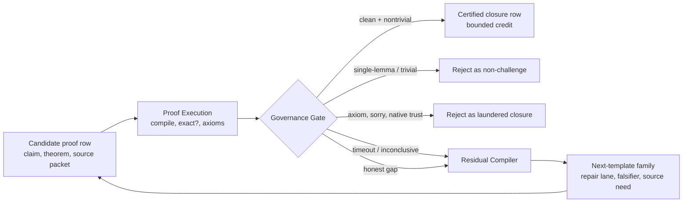

# Closure-Claim Governance

> Up: [Documentation map](../README.md)

*Status:* public / controlling concept
*Sibling docs:* [cognitive_gym.md](cognitive_gym.md) (constraint stack), [anti_pattern_catalog.md](anti_pattern_catalog.md) (failure modes), [goodhart_at_every_layer.md](goodhart_at_every_layer.md), [epistemic_principles.md](epistemic_principles.md)
*Source note:* the L2 catalog was developed from local epistemic-generation
research artifacts. Public readers should treat this page as the stable
published surface. Local workspaces are not part of the public docs contract.

This is the single authored surface for how the architecture governs
*closure claims*, any artifact (markdown note, Lean file, F-row) that
asserts a residual / theorem / sub-problem is closed. It is not a
dynamically-joined document: the dynamic join across the three catalog
languages already exists and is regenerated in code (see §3). Humans read
this doc. Machines read the join. [GP-225](../../research_areas/seams/engine/lean/GP-225_gnn_lemma_relevance_ranker_seam.md) consumes it but does not own it
(see §6). No dependency on a separate `exports/` tree: the previous
`exports/epistemic_hygiene_bundle/` was an extract of native `org/`
catalogs (shipped once as `epistemic_hygiene_bundle.zip` and removed
from the tree). Regenerated machine artifacts now live under
`analytics/public/product_exports/`.

---

## 0. Closure loop map

The proof/governance/residual loop belongs to this closure-claim governance
contract.

Read the loop this way:

- Proof Execution asks whether the row ran in the pinned verifier:
  compile, `exact?`, and kernel axiom audit.
- Governance Gate asks whether the row may receive proof credit:
  genuine closure, trivial/single-lemma reject, axiom-dependent reject,
  inconclusive, or honest gap.
- Residual Compiler asks what the failure teaches the next station:
  source packet, repair family, falsifier target, exact-gap packet, or
  tested retirement.

Useful failures are first-class outputs. A proof attempt is valuable when it
is classified and compiled into a sharper next target. Narrating progress does not make an attempt valuable. Credit boundaries are strict: proposing,
repairing, or executing a candidate never ratifies it. Governance is the only
proof-credit authority.

---

## 1. The three catalog languages

Closure governance spans three catalogs written in different languages.
They are deliberately separate, conflating them is itself a failure mode.

| Layer | Catalog (source of truth) | Operates on | Examples |
|---|---|---|---|
| **L1 Research process** | `org/patterns/*.md` + `org/menu/orchestration_menu.yaml` | WHO does WHAT and WHEN | friction-debate, darwin-idea-killer, swarm-dispatch, gowers-first-formalize-second |
| **L2 Mathematical content** | structural-language catalog, rendered into public docs when promoted | HOW mathematicians restructure problems | Problem Reformulation, Auxiliary Comparison Object, Limit-Passage Property Inheritance, Sharpness/Failure-Witness Construction |
| **L3 Failure modes** | `org/anti-patterns/*.md` | What goes WRONG when L1/L2 are misapplied | citation-laundering (AP-002), sorry-obligation-laundering (AP-004), vocabulary-chain-laundering (AP-012), **lean-closure-laundering (AP-013)** |

There is no L4. A *primitive* is a deterministic executable gate that
mechanizes detection of an L3 anti-pattern, exactly as
`circularity_gate` (primitive) mechanizes the SB-1 circularity anti-pattern.
Primitives are not patterns and are not `org/patterns/` entries.

## 2. The tier model (one capability, four tiers)

Closure-claim governance is one capability with four complementary
tiers. They are not parallel systems. Higher tiers catch what lower tiers
structurally cannot.

| Tier | What it asks | Mechanism | Where |
|---|---|---|---|
| **T0, execution-grounded** | *Is the closure actually false?* | Runs Lean / queries the Mathlib corpus. Leakage-independent: confirmation = Lean's own tactics / Mathlib's own node index, **zero post-hoc audit verdict**. | v33 organs (`scripts/public/control/v33_*`), enforced in-loop by `src/ztare/gates/lean_proof_gate.py` |
| **T1, discipline-presence** | *Did the artifact document the discipline?* | Token/structure check: 6-point block (AP-012), 4-scope coverage (MP-023), L2-catalog enumeration (MP-022). Reads all three catalogs + the architecture index. | `closure_claim_discipline_linter.py` |
| **T2, semantic** | *Right tokens, wrong chain?* | LLM semantic audit of the narrative (gpt-4.1-mini). | `closure_claim_discipline_linter_tier2.py` |
| **T3, cross-model** | *Single-model bias in T2?* | Same audit across 3 providers, agreement analysis. | `closure_claim_discipline_linter_tier3.py` |

T0 is the execution-grounded tier: [GP-211](../../research_areas/seams/engine/lean/GP-211_lean_proof_substrate_class_seam.md)'s compile + axiom-audit clears
a proof, but does not catch a proof that compiles, is sorry-free, has no
extra axioms, and is *still* vacuous / verbatim-gold-name / one-`exact?` /
indirect-leakage / currency-mismatched. Those five false-closure sub-modes
(catalogued as AP-013, 5 sub-modes) are exactly what slipped past
[GP-211](../../research_areas/seams/engine/lean/GP-211_lean_proof_substrate_class_seam.md) in tick541 and the v22-v30 chain until the organs mechanized them.

### T0 organs

| Organ | Catches | Independent verifier | GT-validated |
|---|---|---|---|
| `v33_preflight_risk_detector.py` | vacuous / `True`-hyp / `∃P,P` | Lean trivial-cascade probe | ✓ carleman pre-fix vs opaque-fixed |
| `v33_paraphrase_gate.py` | gold-name-verbatim of a real lemma | cited lemma ∈ Mathlib node index | ✓ H12 vs H07 |
| `v33_single_lemma_exact_gate.py` | one-`exact?` closure | Lean's own `exact?` | ✓ add_comm vs H07 |
| `v33_indirect_leakage_gate.py` | bare simp/fun_prop global-set carry | floor-fails-but-global-closes | ✓ fun_prop vs floor-trivial vs H07 |
| `v33_currency_mismatch_gate.py` | scalar-wrapper vs field obligation | Lean kernel type-slot rejection | ✓ scalar/Prop vs type-match |

## 3. The dynamic join already exists (do not rebuild it)

The cross-catalog join is regenerated
in code and consumed at tick start:

- `closure_claim_discipline_linter.py` reads L1 (`org/patterns/INDEX.md`),
  L2 (`structural_language_catalog_20260514.json`), L3
  (`org/anti-patterns/INDEX.md`), and `architecture_index.jsonl`, and
  emits a tick-start summary consumed by `rd_tick_brief.py`.
- `analytics/public/index/architecture_index.jsonl` is the discoverability
  source of truth (wired into `org/mandates/research_director_mandate.md`);
  `src/ztare/research_director/primitive_tick_surface.py` scores and
  auto-surfaces its rows per scope (`ns`, `neural_hunt`) at tick start;
  `render_architecture_index.py` re-renders `INDEX.md`.

So registering the T0 organs + AP-013 as rows in `architecture_index.jsonl`
(and as a Tier-0 hook in the discipline linter) makes them flow through the
existing join into the RD mandate and tick precheck automatically. A
second hand-authored join document would recreate this, the exact sprawl
this capability is meant to prevent.

## 4. In-loop enrichment (done, non-breaking)

`src/ztare/gates/lean_proof_gate.py` ([GP-211](../../research_areas/seams/engine/lean/GP-211_lean_proof_substrate_class_seam.md)) enriched in place:
`_run_v33_anti_laundering()` runs the T0 organs on every compiled proof;
`run_lean_proof_gate(..., enforce_anti_laundering=True, deep_verify=False)`
flips `gate_passed=False` on a CONFIRMED sub-mode, surfaces shape-suspects
as advisory, and fails open on organ crash (never blocks the loop on an
organ bug). Cheap by default (shape + corpus, no extra Lean). Deep Lean
re-probes behind `deep_verify`. New fields ride the existing `to_dict()` →
existing `eval_history.jsonl gate_verdicts`. No parallel ledger.
Unit-validated: VACUOUS→fail, GENUINE-H07→pass, GOLD-NAME→fail.

## 5. Consumers

| Consumer | Uses it for |
|---|---|
| **[GP-225](../../research_areas/seams/engine/lean/GP-225_gnn_lemma_relevance_ranker_seam.md)** | the line that produced T0 (one consumer, not the owner) |
| **NS Clay hunt** | per-tick T0 (CLI or in-loop) before any closure claim, the organ missing when GPT-5.5 caught tick541 offline |
| **epistemic-generation working paper** | T1/T2/T3 discipline linter is its operationalization. AP-013 + T0 extend the same governance story |
| **cognitive_gym** | T0 is a constraint-stack gate (deterministic machinery handed what the LLM does poorly: self-consistency under closure pressure) |
| **RD primitives** (human + agentic + ZTARE workbench) | architecture-index rows auto-surface via tick precheck. Mandate already reads `INDEX.md` |

### How NS uses it now

1. Standalone CLI per-tick (zero integration, available now):
   `python3 scripts/public/control/v33_preflight_risk_detector.py --statement "<goal>" --verify`
   (and the four sibling organs on the tick `.lean`).
2. Automatic in-loop: any rubric with
   `cage_meta.substrate_class == "lean_proof"` gets the T0 layer on its
   next loop run, vacuous/gold-name/single-lemma/indirect closures flip
   `gate_passed=False` before they can be scored.
3. Deep audit: `deep_verify=True` for pre-publication thoroughness.

## 6. Honest standing verdict ([GP-225](../../research_areas/seams/engine/lean/GP-225_gnn_lemma_relevance_ranker_seam.md) line)

- The arc: GNN lemma-relevance (v2.1-v6) killed. High-trust closure
  chain (v22-v30) all killed under fair audit (structural bound: 0-1
  honest high-trust closures per session-day on natural Mathlib goals).
  Meta-solver-as-mined-prior (v31-v32) un-obtainable from history
  (`failure-class-collapse-under-leakage-exclusion`: every historical
  failure label *was* the post-hoc audit verdict = the leakage. Excluding
  leakage empties the failure class, structural and corpus-independent).
- Forward-applied, the T0 organs are the leakage-independent failure
  attestation history could not provide. They accrue the contrastive
  corpus on *future* attempts.
- The product is a rigorously-audited **closure-claim governance
  capability**. Closure rate remains prover-bound (LLM
  proof-writing, not the harness, is the bottleneck, confirmed ≥5×).

## 7. Roadmap

- Done: T0 organs built/validated. In-loop enrichment done. AP-013
  catalogued. This concept doc upleveled off `gp225_`.
- Next (additive, low-risk): register T0 organs + AP-013 in
  `architecture_index.jsonl` + graph edges + re-render `INDEX.md`. Add the
  Tier-0 hook in `closure_claim_discipline_linter.py` so the existing join
  surfaces T0. Cross-ref from `cognitive_gym.md` + epistemic-generation
  working paper.
- Flagged, not force-fit: general currency-mismatch (arbitrary
  wrong-norm/units) needs a typed-companion / dimensional design, a
  separate seam.
- Open research: a deployable prior requires forward-collected
  leakage-independent failure data. The T0 organs now *produce* exactly
  that signal on every future attempt.
- Done (2026-05-16): the bundled proof-execution and governance-gate
  apparatus + the kernel-axioms authoritative 0-false-ratify guard, see §8.

## 8. The bundled closure run ([GP-225](../../research_areas/seams/engine/lean/GP-225_gnn_lemma_relevance_ranker_seam.md) consumer)

A single runnable bundle (`scripts/public/control/bundle_run.py`)
composes the two formerly separate lines and is the concrete [GP-225](../../research_areas/seams/engine/lean/GP-225_gnn_lemma_relevance_ranker_seam.md) consumer of
this governance concept.

- Proof execution (`bundle_verify.py`): author ≠
  prover ≠ verifier. Each proof is recompiled verbatim in the
  canonical pinned Mathlib v4.29.0 sandbox (rev `8a178386ff`), then a
  bare-goal `exact?` single-lemma adjudication runs. Conservative by
  construction: a row is eligible to be *genuine* only if compile is
  clean AND `exact?` ran to completion and explicitly could not
  single-close. A deterministic `whnf`/heartbeat/wall **timeout is a
  distinct `EXACT_TIMEOUT` verdict, never counted genuine** (an
  independent Meta-Darwin pass found the prior code laundering a 4M-hb
  timeout as a closure, now fixed. The corrected decomposition is
  mechanically reproducible).
- Governance gate (`gp233_adversary_yield_decomp.py`):
  4-way classify, `genuine_novel_closure` / `single_lemma_rejected` /
  `consequence_exposure_axiom_dependent_NOT_genuine` /
  `prover_self_gap_valid`, with 0 false-ratification as the
  controlling invariant. We generalized the id-regex to the verifier's
  own `<id>: compile=` output contract, so the decomposition
  auto-reproduces with no hand step (the prior `[A-Z]+\d+:` pattern
  forced hand-classification of every run).
- Residual compiler (`leansearch_factory_residual_plan.py` and the
  research-director residual-normal-form lane): turns failed proof rows,
  honest gaps, and timeout/inconclusive verdicts into next-template families,
  carrying forward what a binary pass/fail scoreboard would discard. This
  is the source of future audited-OOD signal. It is not a closure claim by
  itself.

### The authoritative 0-false-ratify guard (kernel `#print axioms`)

The consequence-exposure question, *does this proof assume the target
instead of proving it?*, is answered **by the Lean kernel, not by
surface-syntax pattern-matching**. After a clean compile, `bundle_verify`
runs `#print axioms <thm>`; only Mathlib's three foundational axioms
`{propext, Classical.choice, Quot.sound}` are trusted. Any other
dependency (`sorryAx`, a declared `axiom`, `Lean.ofReduceBool`/native
trust, `@[implemented_by]`, …) ⇒ `AXIOMS_SMUGGLED`; an unverifiable
result ⇒ `AXIOMS_UNVERIFIED`; both ⇒ never genuine, overriding the
`exact?` heuristic in `gp233.classify`.

This is **sound and complete for sorry/axiom/native-trust smuggling and
idiom-independent by construction**: every smuggle, through *any* surface
idiom (including ones never enumerated), reduces to an axiom/`sorryAx`
dependency the kernel already tracks. It explicitly supersedes the
regex consequence-exposure organ
(`src/ztare/gates/v33_consequence_exposure_gate.py`): that organ entered
a 10-round adversarial point-fix treadmill (each round closed real Lean
idioms, `have/let/suffices/show/change/replace/obtain/rcases`,
term-ascription, type-application, anon-ctor, `let rec`/`where`,
bare-claim-and-sorry, instance/attribute promotion, alias chains,
parenthesised `by exact`, standalone `≃`-family, with high recall and
controlled benign-FP, but no provable completeness). Fitting regexes to
observed adversary idioms is overfitting. Our kernel oracle is the
de-overfitting move and the source of truth. The regex organ is **demoted to a cheap advisory
pre-filter**.

*Status:* the kernel-axioms guard is under independent adversarial
review before trust (a forcing-verifier change must survive an
independent adversary per §3b discipline). Until it clears, the bundle's
genuine counts carry that caveat.

### Residual apparatus-risk register (R1-R4, tracked not closed)

`bundle_verify`'s compile gate alone does not reject `axiom`/`opaque`/
`sorryAx`/`native_decide`/`@[implemented_by]` (R1-R4). The kernel-axioms
guard above closes R1-R4 *for genuine-credit purposes*. An advisory
mechanical stopgap (`scripts/public/control/proof_source_integrity_lint.py`)
independently screens proof sources and is clean on all recorded
in-thread-authored proofs. The [GP-233](../../research_areas/seams/apparatus/instrumentation/GP-233_research_yield_decomposition_seam.md) evidence ledger
(`analytics/public/ledgers/research_yield_decomposition/`) carries the
full register and the empirical Tier-2 record (powered gate reached.
Closure route via in-thread AI grounded-iterative proving, reasoning
+ sandbox tool use by the assistant, with no human writing the proofs.
6/9 certified after Meta-Darwin correction. An unattended
batch-prover evaluation is pre-registered and pending). This Tier-2
record is a small capability / anti-laundering probe, not a benchmark
against LeanDojo / ReProver / LeanHammer. The external-prover comparison
gate (closure rate prover-bound, with the arXiv:2506.07477 falsifier
requiring Mathlib-test R@16 > 0.635 AND Carleson R@1 > 5%, not cleared) is unchanged
and was not re-tested here.

## 9. Directional benchmark hypothesis for proof execution

*Status:* directional/strategic. The external-prover benchmark is the END
gate (WIP), run only once proof execution, the governance gate, and the
residual compiler are built well together. This section is a documented
direction, not a claim of having arrived. Our standing §6 verdict (closure
prover-bound, external-prover superiority killed under fair audit) remains
until refuted.

Cold cross-provider correction (2026-05-17, accepted): do NOT claim
"external provers are blind to what the kernel accepts". LeanHammer
reconstructs kernel-checked Lean proofs (premise-selection + translation +
ATPs + Duper/Aesop reconstruction) and LeanDojo/ReProver extract and interact
with proof states. Our defensible hypothesis is narrower: *their
premise-selection / training signal is not primarily live target-local
kernel-delta + governance, ours is.* The proposed wedge is kernel-grounded
candidate-action ranking before search explodes, then feeding only
governance-clean attempts back into the data loop, not "we verify, they
don't". External systems (LeanHammer, LeanDojo/ReProver, Lean State Search)
are candidate sources and baselines. The comparison must
be candidate-source + generic action-sweep + same governance filter, never
retrieval-only.

### 9.1 External baseline systems vs. proof-execution direction

| | LeanDojo/ReProver, LeanHammer/LeanPremise | Proof execution direction |
|---|---|---|
| Premise selection | text-similarity retrieval over library | **kernel-grounded**: actual `exact?`/`apply?`/`simp`/`rw` progress + elaboration error as the relevance oracle |
| Goal/lemma representation | text-only (documented shared weakness) | typed `Expr` AST + Mathlib dependency-DAG position (Graph2Tac-style online) |
| Tactic ranking | LM logprob / search score | **verifier-grounded rerank**: real compile + goal-delta + `#print axioms`-clean + `exact?`-can't-single-close |
| Training/selection data | in-distribution Mathlib tactic traces (leaky) | **audited OOD-by-construction** pin-delta corpora (lemma absent at pinned version) the governance loop generates |
| OOD behaviour | collapses (Carleson ≈ 0%) | the regime we train/select *on*, by design |
| Closure numbers | generally not adversarially audited | 0-false-ratify, idiom-independent (`#print axioms`), adversarially hardened |

### 9.2 The distinguishing component

Not the tactic generator by itself: ReProver-style systems already
retrieve, generate, and verify. The distinguishing component is the
kernel-grounded, adversarially-hardened governance loop that produces
leakage-controlled, OOD-by-construction, un-laundered supervision. It is
expensive and discipline-bound to produce. The intended composition is the
governance gate plus residual compiler wired back into proof execution. The
signal generator is the part that is not already commodity.

### 9.3 The 10-step proof-execution sequence (staged, kill-gated, not a batch build)

1. Verifier-grounded premise scoring, rank candidates by real in-sandbox progress, not text. (Cheapest step: reuses bundle_verify, no training.)
2. Verifier-grounded tactic rerank, N candidates → rerank by kernel outcome + governance signal, not LM score.
3. Error-typed transition policy, structured Lean-error→action map (unknown-ident→re-resolve; unsolved→decompose; mismatch→normalize), vs flat best-first.
4. `exact?`/`simp?`/`aesop?` as a learned sub-oracle + skeleton seed, not a fallback.
5. Typed-AST + dep-DAG features (the documented unexploited lever). CPU path: SSL pretrain dep graph → frozen-encoder logistic probe → verifier rerank.
6. OOD-by-construction training/selection set from pin-delta + adversarial corpora (targets the Carleson-style external baseline directly).
7. Hard-negative curriculum from the audited residual (CoRNStack-style): retrain/prompt on the loop's own `honest_gap` rows, build from the residual.
8. Governance-taxonomy router, single-lemma→fast path, multi-step→assembly, axiom-dependent→reject. Typed routing beats undifferentiated search.
9. Self-play on the OOD generator, the vN+1∖vN miner is a self-renewing leakage-free goal stream.
10. The single falsifiable gate (also the benchmark): a prover tuned on harness-produced audited-OOD signal clears arXiv:2506.07477 Mathlib-test R@16 > 0.635 AND Carleson R@1 > 5%, with every number adversarially un-laundered by the governance gate.

### 9.4 Discipline overlay (non-negotiable)

Each step is premortem'd / killed before it is relied on. Test the most-assumed step first (e.g. "typed-AST GNN obviously wins"). Build only from the residual. Self-voiced adversary rounds are a monoculture. A decision-critical step needs a cold cross-provider generative pass (not another same-family self-review) before it is trusted as direction. Sequence by cheapest-falsifiable-first (step 1 before any training). The result is unproven until step 10. The verifier/governance loop (§9.2) is the only part demonstrated today.
