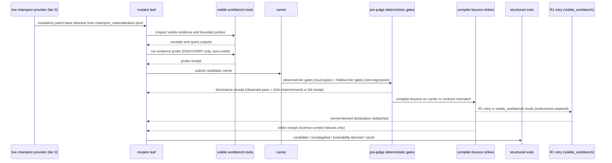
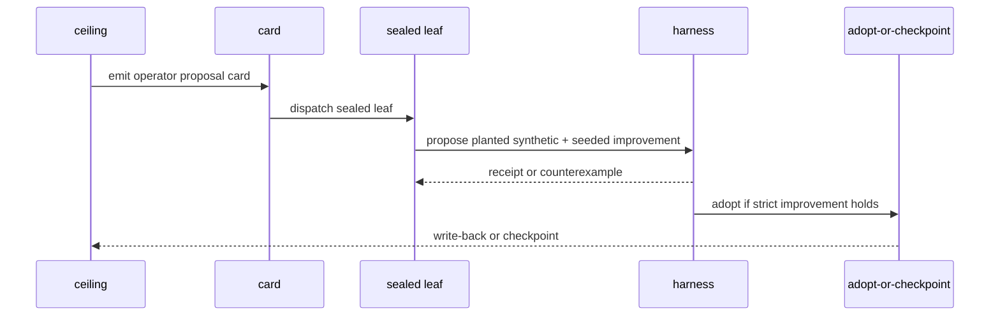
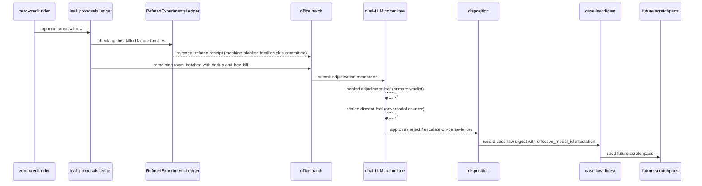
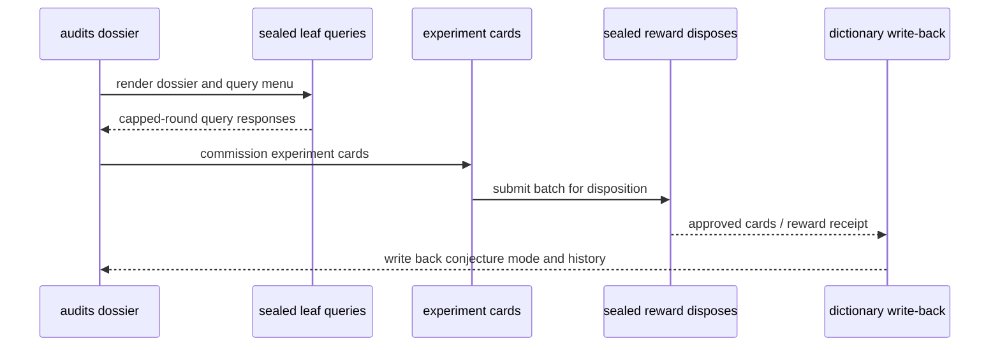
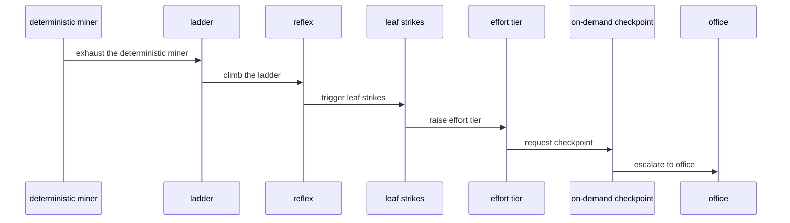
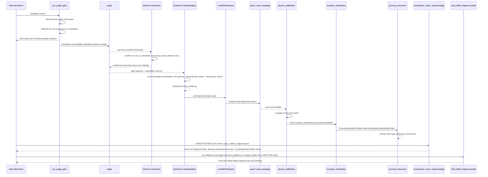

# Flows

This file records the as-built flow surfaces referenced by the ARC-AGI-3 system doc. Each diagram uses the current code names and the prose stays short so the lifecycle is easy to scan.

## 1. Science Turn Lifecycle

The science turn starts in the mutator leaf, uses only visible workbench affordances, and ends on one of the structured exits. The live-champion provider (tier 0, priority 18) renders the mandatory patch-base directive as the first directive the leaf sees. Deterministic gates own carrier admission and enforce tiered promotion: every observed-tier gate must pass absolutely, while heldout-tier gates require non-regression against the champion's recorded value. A turn may also close as `INVESTIGATED` — a credited first-class science outcome — when the leaf eliminates a new hypothesis class from visible evidence (K=3 stagnation bound before escalation pressure fires). Compiler-bounce is the early reject path when the surface is malformed or underspecified; R1 retries run in `visible_workbench` mode so instruments are retained. Envelope faults (`UNDECLARED_ARTIFACT_BREADTH`, `INVALID_PRIMITIVE_DECLARATION`) are kernel-normalized without consuming strikes.

## 2. Grammar Reflex

The reflex is a ceiling-to-card loop, not a free-form rewrite loop. A sealed leaf may plant a synthetic test and a seeded improvement, but the harness still disposes the candidate before any write-back.

## 3. Proposal Lifecycle

The proposal path is a ledgered side channel. A killed failure family is machine-blocked before the committee sees it: the RefutedExperimentsLedger checks the proposal's failure-family signature against prior `killed` dispositions and writes a `rejected_refuted` receipt; revised carriers with a new family signature pass through normally. Proposals that reach the committee are adjudicated by two sealed leaves — one primary, one adversarial dissent — with escalation when either verdict lacks a concrete reason or rule citation. The zero-credit rider can inform later work, but the committee decision and disposition decide whether a row becomes case-law or stays backlog.

## 4. Strategy Office Convene

Strategy Office reads a bounded dossier, allows only capped query rounds, then writes cards through the decision membrane. The downstream write-back updates the dictionary with the committed surface, including conjecture-mode outcomes.

## 5. Escalation Lattice

The lattice is ordered by cost and visibility. A failed lower rung should promote only the next needed instrument, with office escalation reserved for the cases that survive the deterministic ladder.

## 6. Promotion + Learning Cascade

The cascade is fully deterministic below the judge call. Champion materialization runs at loop bootstrap from memory artifacts; it backs up the live model before installing a better candidate. The LeanMill campaign is asynchronous and non-blocking: the play loop continues without waiting for proof work. Ratified certificates constrain reachability sweeps and may prune candidate families the abductor proposes on subsequent iterations.

The scratchpad and eliminations paths close the self-learning loop: `workspace/leaf_scratchpad.md` is re-fed verbatim (tail 2000 chars) at each turn's fragment head, and credited `INVESTIGATED` eliminations accumulate in `workspace/spec_visible_nogoods.jsonl` and appear as "already eliminated" case law. The tried-and-failed digest provider (`tried_failed_digest`) also includes the `RefutedExperimentsLedger` `REFUTED (machine-blocked)` block and recent `harness_weakness_receipts.jsonl` and `strategy_experiment_probe_rows.jsonl` entries.
