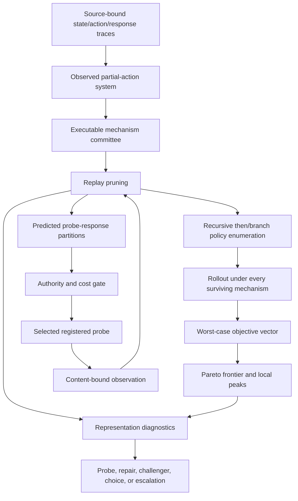

# JaggedThoughts: What Kind of Autonomous Strategy System Is This?

> Up: [`docs/README.md`](../README.md)

JaggedThoughts is a governed model-based decision-and-experiment controller for
strategic choices. It turns a declared strategic language, evidence-bound
transition history, competing executable mechanisms, objectives, and authority
envelope into three inspectable outputs:

1. a complete population of bounded contingent policies;
2. a robust Pareto frontier and neighborhood-relative local peaks;
3. the next admitted observation that best separates the surviving mechanisms.

Its strongest current capability is disciplined search and adaptive evidence
acquisition inside a declared representation. Strategic state discovery,
causal identification, mechanism invention, organizational execution, and
open-ended representation renewal remain separate capability claims.

The governing specification is
[`GP-252`](../../research_areas/specs/active/substrates/strategy/GP-252_jaggedthoughts_recursive_strategy_frontier_spec.md).
The runnable reference profile is
[`autonomous_service_strategy.yaml`](../../examples/jaggedthoughts/autonomous_service_strategy.yaml).

## Contents

- [The capability ladder](#the-capability-ladder)
- [How the loop works](#how-the-loop-works)
- [The mathematical object](#the-mathematical-object)
- [Reasoning by isomorphism](#reasoning-by-isomorphism)
- [Scientific positioning](#scientific-positioning)
- [What must be believed](#what-must-be-believed)
- [Counterexample-guided representation repair](#counterexample-guided-representation-repair)
- [What the reference case establishes](#what-the-reference-case-establishes)
- [What remains empirically open](#what-remains-empirically-open)
- [Improvement sequence](#improvement-sequence)
- [Operating it on a company decision](#operating-it-on-a-company-decision)

## The capability ladder

“Autonomous strategy” hides several different jobs. The ladder keeps them
separate.

| Level | Capability | JaggedThoughts status |
|---|---|---|
| `J0` | Compile and exhaust a declared option language | Implemented |
| `J1` | Maintain rival transition mechanisms and synthesize robust policies | Implemented within a source-bound profile |
| `J2` | Select, consume, and learn from bounded evidence probes | Implemented through registered adapters and explicit authority |
| `J3` | Execute strategic actions and optimize task value jointly with learning | Adapter-dependent; task-value deployment stays externally governed |
| `J4` | Discover missing state variables, mechanisms, objectives, and actions | Diagnostic repair contracts implemented; candidate generation and prospective validation remain open |
| `J5` | Sustain strategic advantage across regime changes and organizations | Unearned; requires longitudinal comparative evidence |

The current capability therefore spans `J0-J2`. Pieces required by `J3` and
`J4` exist as interfaces and diagnostics. A broad `J5` claim would need
prospective outcomes across several decisions, baselines, firms, and regime
changes.

In the investment workbench, the same ladder has a second learning loop:

```text
source-bound company state
  -> enumerated strategic options and local peaks
  -> dated implementation event
  -> later operating consequence
  -> revised earnings-power distribution
  -> price-implied expectations gap
  -> later benchmark-relative return
```

This is the business-investor reciprocity: investment research tests which
strategy mechanisms mattered; strategy research supplies structured inputs to
valuation. The implementation uses three grains. A move family generates a
broad transfer question, a mechanism phenotype selects comparable company
histories, and an exact instance owns the company object, conditions, breaks,
time, and sources. A good operating move never implies a good purchase price.

Two books keep that reciprocity from collapsing into selection bias:

- the **strategy-learning book** may study a current `qualified` or `monitor`
  company at zero portfolio weight when a source-bound date-exact move and
  measurable outcome contract exist; its new dossier and frontier must bind the
  current candidate leaf;
- the **capital book** still requires the stricter current-epoch underwriting,
  valuation, portfolio-fit, and authority gates.

Each new measurable move now binds its outcome contract to the mechanism's
exact objective coordinate and freezes the sign of that coordinate in every
authored scenario. A later settlement emits a content-addressed calibration
receipt. It may support the frozen direction, challenge it, or remain
inconclusive; mixed scenario directions and legacy unbound contracts cannot
receive directional credit. A challenge is input to a successor frontier
request, never a mutation of the settled parent frontier and never capital
authority. This is the edge that lets business evidence revise future search
without pretending that an operating metric and an ordinal score have the same
unit.

The historical strategy tournament provides the first closed-book check of the
grammar itself. At each fiscal-year boundary it uses only earlier settled
episodes, recursively evaluates every bounded phenotype projection, closes the
current Pareto frontier, selects one predictor, and only then scores the next
year. The current 58-episode replay yields eight scored folds and 48 forecasts.
Typed phenotype selection slightly trails the untyped global-median control on
mean absolute error, so it receives no predictive, causal, security-return, or
capital credit. This adverse result is retained as institutional memory. A new
evidence block may challenge it without rewriting any prior fold.

The recurring discovery cycle now owns both admissions. Strategy-learning jobs
use the same subscription research and typed dossier path, but are excluded from
the capital-candidate question-policy experiment and paper-proposal compiler.
This preserves one research institution while maintaining two authority sets.

## How the loop works



One compile pass performs the following operations.

### 1. Bind the decision identity

`StrategicState` binds the decision, evidence epoch, firm coordinates, actor
coordinates, and context. `StrategicAction` binds action identity, authority
tier, primitive cost, irreversibility, and evidence. A transition cannot cross
decision identity or silently change the coordinate schema.

### 2. Convert history into witnessed transitions

Each observation has the form

```text
(source state, strategic action, successor state, time, evidence)
```

The traces lower into the repository's shared `PartialActionSystem`. Undefined
outcomes remain boundaries rather than fabricated successors.

### 3. Replay every mechanism

A `StrategicMechanism` is an executable rule program. Primary rules transform
the firm and actor state first. Actor-owned response rules then read the
intermediate state and apply endogenous reactions. Every mechanism is replayed
against every observed transition; coordinate tolerances are declared by the
profile. The version space retains all consistent candidates.

### 4. Enumerate contingent policies

The policy grammar contains action terminals, condition terminals, and two
recursive constructors:

```text
then(Policy, Policy) -> Policy
branch(Condition, Policy, Policy) -> Policy
```

Bottom-up enumeration covers every well-typed program inside the frozen depth
and population bounds. Content hashes bind grammar epoch and tree structure.

The company-choice lowering's next stage makes this policy structure explicit
as commitment plus recourse. Irreversible options are selected now. Each later
leaf references an already-enumerated recourse bundle and may fire only from an
observable typed trigger whose value was available before the action. The
trigger regions must cover their declared domain exactly once. Each trigger
binds the company, public metric identifier, unit, comparison operator,
threshold basis, rationale, and source refs.

Z3 then answers a narrow operational question for every reachable region:
does the frozen now-plus-recourse bundle satisfy its compatibility,
prerequisite, capital, capacity, and management-bandwidth constraints? A
satisfiable region receives a concrete witness; an infeasible region receives
a counterexample and blocking-constraint core. The full policy advances only
when every reachable region is feasible.

This does not turn authored assumptions into facts. Trigger relevance and
thresholds, resource quantities, scenario likelihoods, strategic effects,
causality, profitability, and investment value remain empirical. The solver
certifies only total, deterministic, non-anticipating feasibility inside the
frozen declarations; scenario scoring and later outcome settlement remain
outside that certificate.

At recourse time, `select_company_contingent_recourse` consumes the immutable
policy plus typed `MetricObservation` rows. It rejects company or unit drift,
duplicate metric revisions, observations before commitment, late-arriving data,
and incomplete coordinate coverage. The resulting content-addressed receipt
names the exact Z3 region certificate, observation hashes, selected static
bundle, and research-only authority ceiling.

The deployed company-choice compiler uses the first-stage language `option(id)`
and the commutative recursive constructor
`combine_reinforcing_choices(left, right)`. Z3 closes non-empty bundle size,
declared pairwise incompatibilities, optional source-bound prerequisites, and
typed linear resource limits. Python applies scenario deltas and
interaction deltas, computes coordinate-wise robust scores, Pareto dominance,
and local peaks under the declared single-choice-edit neighborhood: add one,
remove one, or substitute one terminal. Each interaction is content-addressed
in the frontier and named on every program it affects.

Source acquisition now has a sealed activation for solver predicates. The
activation researcher proposes every source-supported mutual exclusion,
prerequisite, or common-unit resource limit it finds, up to the bounded maximum.
The kernel freezes that candidate set before a later evidence pass, rejects
semantic duplicates and predicates that exclude the same parent-feasible
bundles, and hides both predicates and prior sources from the later worker. That
worker sees only the exact option vocabulary, a cutoff, and an opaque source
embargo hash. It may return observed admitted bundles, excluded bundles, or
implications from post-freeze primary evidence. The constraint gate then
enumerates every frozen predicate subset, retains only a unique
inclusion-minimal explanation, and lets Z3 recompile the successor space.
Different URLs or model calls do not establish source or author independence;
research credit requires hidden predicates, source-family separation, role
separation, prior freezing, and at least two behaviorally distinct candidates.
The first learning-grade source adapter also resolves SEC documents against
EDGAR's submissions chronology and caches their bytes; a model-reported date or
an uncaptured non-SEC page remains diagnostic. Missing, ambiguous, or
insufficient evidence preserves the parent predicates.

The later activation envelope owns the exact question-policy episode. Its
embedded frontier therefore governs the sealed response matrix, assigned
program, browsing execution, and settlement even when an older dossier request
for the same candidate carries a different question. The dossier request still
owns candidate and research lineage. Keeping these identities separate prevents
the system from forecasting one question, researching another, and scoring the
pair as if they belonged to one episode.

The current compiler contract is v17. Its contingent stage, introduced in v14,
uses the same strategy language. A profile may freeze one feasible first-stage
bundle as the current commitment, declare dated typed conditions, and
recursively compose `branch` nodes whose leaves point to already enumerated
final bundles. The existing Z3
policy-region prover certifies that the condition space is total and
non-overlapping; exact membership in the first-stage choice-space certificate
establishes declared feasibility for every leaf. The executable reference case
commits to qualifying a second input, then chooses broadening, co-design, or a
commodity-price response from demand and contribution-margin thresholds.
This is a policy proposal surface, not an effect estimator: sourced live-company
conditions, calibrated thresholds, and prospective operating settlement remain
the next evidence activation. Every threshold carries a basis and rationale:
`source_disclosed`, explicitly labelled `analyst_hypothesis`, or
`reference_fixture`; an unlabeled threshold is rejected.

#### Concrete recursion, Z3, and predicate example

Suppose the frozen language has three typed terminals:

```text
option:qualify_second_input       -> ChoiceSystem
option:broaden_customer_program   -> ChoiceSystem
option:co_design_interface        -> ChoiceSystem
combine_reinforcing_choices(ChoiceSystem, ChoiceSystem) -> ChoiceSystem
```

Let their Boolean selection variables be `Q`, `B`, and `C`. If broadening
requires the second input, and broadening plus co-design each consume two units
of a three-unit management-bandwidth budget, the solver receives:

```text
1 <= Q + B + C <= 3
B => Q
2*B + 2*C <= 3
```

The first-stage predicate catalog is deliberately small and typed:

| Predicate | Meaning | Z3 lowering |
|---|---|---|
| `cardinality_ge(k)` | choose at least `k` terminals | `Sum(If(x,1,0)) >= k` |
| `cardinality_le(k)` | choose at most `k` terminals | `Sum(If(x,1,0)) <= k` |
| `not_all_selected(left, right)` | the named pair may not coexist | `Not(And(selected(left), selected(right)))` |
| `implies_all_selected(option, required)` | selecting `option` requires every terminal in `required` | `Implies(selected(option), And(selected(required)...))` |
| `linear_sum_le(use_map, limit)` | weighted resource use stays within a typed limit | `Sum(If(selected(option), use(option), 0)) <= limit` |

Z3 enumerates every satisfying assignment and blocks each model after emitting
it. In this example the complete feasible set is `{Q}`, `{C}`, `{Q,B}`, and
`{Q,C}`. The semantic set `{Q,B}` then becomes the canonical balanced AST
`combine_reinforcing_choices(option:broaden_customer_program,
option:qualify_second_input)`. `{B}` is rejected by the prerequisite, and
`{B,C}` is rejected by both the prerequisite when `Q` is absent and the
resource bound even when `Q` is present. Associativity and commutativity are
quotiented before recursive tree construction, so `(Q+B)+C` and `Q+(B+C)` do
not masquerade as different strategies.

The recursion is therefore representation-level composition over a semantic
bundle. Z3 searches the finite option-set constraint system; it does not search
AST shapes, infer strategic effects, or estimate payoffs. Python subsequently
evaluates the canonical AST under authored scenario and interaction effects,
takes the coordinate-wise worst case, computes Pareto dominance, and tests each
program against its declared neighborhood. Closure partitions every candidate
into frontier, dominated-with-witness, infeasible-with-claim, exact equivalent,
or residual; `scope_closed` additionally requires exhaustive enumeration and an
empty residual set.

`explain_strategy_bundle_feasibility(frontier, option_ids)` makes that rejection
inspectable for any proposed bundle. It evaluates the same compiled cardinality,
incompatibility, implication, and linear-resource predicates, returns every
violated constraint with observed operands, and cross-checks the verdict against
membership in Z3's exhausted feasible-bundle certificate. The explanation is
about the frozen vocabulary and quantities only; it does not establish that the
authored model describes the business correctly.

The investment consumer applies the same discipline to payoff uncertainty. For a
new candidate forecast, it separately asks what happens to the expected active-return
width if probability intervals, candidate-return intervals, or the benchmark-return
interval were resolved to a deterministic reference while all other uncertainty is
preserved. The largest marginal reduction names the next evidence target. This is an
acquisition priority, not a return estimate or position rule, and the three reductions
need not add to the total width.

When a later source epoch changes that authored vocabulary, the strategy-move
library compares the normalized solver predicates and reports which bundles become
newly admitted or newly excluded. This is representation lineage, not an outcome
test. A constraint challenger must bind a dated counterexample to the exact parent
frontier and predicate hashes before it may remove or revise a predicate in a
successor frontier.

The four-option constrained fixture makes the counts inspectable. Four terminals
have 14 nonempty subsets of size at most three. Incompatibility, prerequisite,
and resource predicates admit eight; scenario evaluation retains six Pareto
programs and six local peaks under the current add/remove/substitute
neighborhood. The source fixture without the added prerequisite and resource
rows admits 11 programs, with six frontier programs and six local peaks.

This fixture also records a useful falsification of an earlier representation.
Under the old add/remove-only neighborhood,
`{qualify_second_input, commodity_price_push}` appeared locally maximal while
`{co_design_interface, commodity_price_push}` dominated it globally. Adding
same-size substitutions makes those programs neighbors, so the former program
loses local-peak status. A peak is a theorem about a frozen neighborhood, not an
intrinsic property of a strategy. Neighborhood challenges can therefore remove
claimed ruggedness instead of merely producing more candidate programs.

The operator-facing form is:

```bash
python -m ztare.investment.cli workspace --path <workspace> strategy-explain \
  <compiled-frontier.json> broaden_customer_program commodity_price_push
```

It emits the frozen choice-space hash, feasibility verdict, exact violated
constraint IDs, structured operands, certificate-membership cross-check, and a
content hash. It performs no rescoring or capital action.

The same fixture then freezes `Q` and composes this second-stage program:

```text
branch(demand_score >= 0.60,
       act({Q, broaden_customer_program}),
       branch(contribution_margin >= 0.20,
              act({Q, co_design_interface}),
              act({Q, commodity_price_push})))
```

Here `branch(Condition, Policy, Policy) -> Policy`; `act(bundle_id) -> Policy`;
and the numeric condition operators are `eq`, `ne`, `gt`, `ge`, `lt`, and
`le`. The QF_LRA region prover supplies one witness for each path—respectively
`demand_score=3/5`, then `demand_score=0` and `margin=1/5`, then both zero—and
proves that no state selects two different actions or none. Each action leaf
must also name a bundle already admitted by the static Z3 certificate.

At the later decision time the workspace command
`strategy-recourse <request.json>` validates typed observations, selects the
one certified region, writes a content-addressed receipt, and appends both the
frozen policy and selection to golden-store lineage. The runnable request is
[`company_strategy_recourse_request.json`](../../examples/jaggedthoughts/investment/company_strategy_recourse_request.json).

Only then does the empirical layer add source-authored option and interaction
effects, replay rival scenarios, compute the Pareto frontier, and locate
single-choice-edit local peaks. The solver certifies the declared choice logic;
it does not certify that `B` grows earnings or that the shares are cheap.

The sealed synthetic apparatus in `recursive_strategy_benchmark.py` makes one
search comparison executable. On its fixed rugged landscape, flat single-option
search and Pareto-improving one-edit hill climbing both retain the incumbent,
while exhaustive interaction-aware Z3/frontier search identifies the reinforcing
two-option optimum. Its shortest edit path must first decline. The executable
[sealed benchmark artifact](../../projects/jaggedthoughts_capital/workspace/investment/research/benchmarks/recursive_strategy/20260825-agent-baseline/benchmark.json)
records that a tool-disabled Codex subscription also selected that known optimum
from a frozen pre-score choice. That fixture distinguishes exhaustive
interaction-aware search from flat, local-search, and additive-objective
ablations, but not from the LLM-only baseline.

The generated concealed suite now supplies the next comparison. Six cases were
created from seed `20260825`, content-addressed before one tool-disabled Codex
subscription call, and retained only when they contained a unique global
behavioral optimum that one-edit and additive-only search missed. Every case
contains seven moves, pair/triple interaction terms, and active Z3
incompatibility, prerequisite, and resource predicates. On the frozen suite,
the recursive compiler recovered an objective-optimal bundle in `6/6`; Codex
recovered one in `5/6` and the exact canonical representative in `4/6`; local
and additive-only arms recovered `0/6`. The single remaining agent miss scored
`11` against the compiler's `12`. The [concealed-suite artifact](../../projects/jaggedthoughts_capital/workspace/investment/research/benchmarks/recursive_strategy/20260825-concealed-suite/benchmark.json)
contains the profiles, hashes, selections, and scores.

This is evidence for exhaustive compilation on the conditioned rugged-landscape
class, not a prevalence estimate: case generation deliberately rejects easy
landscapes and the six selections came from one agent call. It is also not
company evidence. A publication comparison still needs more frozen seeds,
independent agent replicates, representation-challenge arms, and prospective
operating cases whose effects were not authored by the benchmark generator.

An interaction-blind solver ablation closes the identical six-bundle feasible
set but scores bundles from additive terminal effects only. It selects two
apparently score-seven pairs whose full-landscape score is four and misses the
score-twelve reinforcing pair. This separates feasibility closure from payoff-
landscape representation: Z3 can close the former while a missing interaction
model still chooses the wrong program.

The transfer learner uses a separate executable predicate language:
`eq(path,value)`, `ne(path,value)`, `same_as_focal(path)`,
`is_exact_adoption(path)`, `all_of(...)`, and `any_of(...)`. For example,
`all_of(eq(phenotype.action,"secure_supply"),
same_as_focal(environment.industry_id), is_exact_adoption(...))` selects
episodes only when the move, environment relation, and adoption clock all
match. These predicates define cohorts to test; they do not establish the law.

#### From an implemented option to a learnable outcome

A strategy option becomes measurable through a separate successor transition:

```text
source-bound option
  -> exact adoption event
  -> post-freeze primary-source metric / baseline / hurdle / horizon search
  -> immutable successor frontier with an outcome contract
  -> future operating observation
  -> settled episode and causal/transfer review
```

Interval-censored implementations first enter event-refinement research.
Counterfactual or unimplemented options never receive fabricated measurement
contracts. In the autonomous subscription lane, the hurdle is either
directional zero or source-disclosed; analyst forecasts are not executable
thresholds. Each source locates the metric and clock it supports, acquisition
must occur after the request freeze, and only the latest frontier for an entity
is eligible. A successful search changes only the exact target option in one
successor profile; a metric or source gap remains typed and may retry after a
cooldown.

#### Mechanism lifetime is part of event identity

A dated action and a still-active mechanism are different facts. A supply
agreement can be executed on one date yet guarantee capacity only through a later
expiry. JaggedThoughts therefore binds `mechanism_effective_until` to durative
events and requires the exact date to be supported by an opened primary source.

```text
event occurred
  -> source-supported mechanism window
  -> measurement start and horizon fit inside that window
  -> prospective operating settlement
```

A missing window blocks measurement. An expired window blocks attribution to the
old mechanism. Persistence after expiry remains a valid research question, but it
must become a new frozen hypothesis with its own sources, rival explanation,
falsifier, clock, and outcome contract; the system cannot stretch the old event to
cover later results.

MRVL supplied the failure witness. A 2021 capacity reservation applied during
2022-2025, but an early successor attached a 2026-2027 gross-margin contract. The
system quarantined the request, result, event receipt, and compiled successor, then
recompiled the current MRVL frontier without that contract. This is why temporal
identity sits outside the solver: Z3 can prove that a bundle satisfies declared
compatibility and resource predicates, but cannot prove that a business mechanism
still exists or that it produces operating gains or investment returns.

### 5. Evaluate under model uncertainty

Every policy is executed from the same initial state under every surviving
mechanism. Each objective is sign-normalized so larger is preferred. The robust
score is

```math
V_j(\pi) = \min_{m \in M_E} U_j\!\left(s_T^{\pi,m}\right),
```

where `M_E` is the evidence-consistent mechanism set. Pareto dominance compares
the vector `(V_1, ..., V_k)`. Local peaks use a separately named policy-rewrite
neighborhood.

### 6. Price the next observation

For each admitted probe, surviving mechanisms predict response coordinates.
Those responses partition the committee. The shared guarded-experiment kernel
prices identification, compression, novelty, primitive cost, and
irreversibility. Adapter ID and action tier must occur in the authority
allowlists. The execution boundary rechecks the same authority fields.

### 7. Update and diagnose

A registered adapter returns a content-bound transition observation. Replay
prunes the version space, policies are reevaluated, predicted and observed
information yield are recorded, and a temporal eligibility chain is opened.
The diagnostic compiler then chooses among:

```text
execute_selected_probe
refine_state_chart
extend_mechanism_language
extend_probe_language
factor_policy_grammar
refine_decision_surface
author_representation_challenger
external_policy_choice
collect_transition_evidence
```

## The mathematical object

Let:

- `S` be the typed strategic state space;
- `A` be the authorized strategic action alphabet;
- `T` be source-bound observed transitions;
- `M_E` be mechanisms consistent with evidence `E`;
- `G_d` be policy programs generated by grammar `G` through depth `d`;
- `N` be the declared policy neighborhood;
- `U` be the objective vector;
- `Q` be the admitted evidence probes.

JaggedThoughts computes:

```text
VersionSpace(T) = {m in M : replay(m, T) passes}

Policies(G, d) = every well-typed Policy program inside the bound

RobustValue(policy, objective) = minimum value across VersionSpace(T)

Frontier = policies without a robust Pareto dominator

LocalPeaks = policies without a dominating N-neighbor

NextProbe = admitted q in Q maximizing priced committee separation
```

The certificate closes only the frozen grammar and evidence epoch.
Representation status is a distinct field because a finite language can be
fully searched while excluding the governing strategic distinction.

## Reasoning by isomorphism

The useful analogies preserve objects, morphisms, and failure witnesses. A
surface resemblance alone provides no authority.

| Established field | JaggedThoughts mapping | What transports | Where transport stops |
|---|---|---|---|
| Compiler construction | grammar → typed AST → interpretation | type safety, deterministic enumeration, content identity, compile residuals | a compiler cannot establish that its source language contains every useful strategy |
| Program synthesis / CEGIS | candidate programs → counterexample → revised grammar | executable hypotheses, counterexample-driven pruning, bounded completeness | strategic counterexamples arrive slowly and may be confounded |
| Abstract interpretation / CEGAR | state abstraction `α`, mechanism law, concrete replay, abstraction refinement | state-aliasing witnesses, abstraction splits, separate law failure | omitted variables may remain unobserved, so a split proposal needs new evidence |
| System identification | transition history → compatible model set | version spaces, replay gates, experimental discrimination | profile-authored mechanisms currently precede automatic induction |
| Robust control | uncertainty set → worst-case policy value | committee-wide rollout and minimax objective coordinates | model-set coverage determines robustness; an omitted mechanism sits outside the guarantee |
| Dual control | action changes the state and reveals the dynamics | probe selection under cost and reversibility | current selection prices information; joint task-value/information planning is a named extension |
| Multi-objective optimization | partial order → Pareto antichain | non-dominance, local peaks, explicit choice surface | a wide antichain may signal missing constraints or an unavoidable value conflict |
| Game theory | actors respond to actions and incentives | actor-owned response phase and endogenous landscape movement | reactive rules do not yet solve equilibrium, belief, bargaining, or coalition formation |
| Scientific inference | rival explanations → discriminating observation → calibration | source binding, committee tests, information gain, prediction error | causal attribution requires intervention design, controls, and sufficient repeated observations |
| Organizational governance | delegated action → authority envelope → receipt | action tiers, cost limits, adapter registry, temporal eligibility | the kernel does not grant itself authority over material commitments |

The closest structural match is a composition of CEGIS, robust control, and
dual control:

```text
CEGIS owns model and grammar repair.
Robust control owns policy evaluation across surviving models.
Dual control owns the choice of actions that both move and teach.
Governance owns which actions may leave the simulator.
```

## Scientific positioning

JaggedThoughts is a candidate systems contribution, not a claim to have
invented the constituent methods. The research question is whether their typed
composition changes strategic search and learning outcomes.

### Inherited machinery

| Inherited result or method | What is reused here | Claim explicitly not made |
|---|---|---|
| Integrated choice systems, representation search, and performance landscapes | strategic options are evaluated as interacting systems and under declared neighborhoods | that strategy landscapes, complements, or local peaks are new concepts |
| Typed grammars, bounded program enumeration, CEGIS/CEGAR, and SMT solving | executable hypothesis spaces, witnessed elimination, counterexamples, and bounded search certificates | that any one synthesis or verification algorithm is new |
| Pareto optimization, robust control, and version-space system identification | multi-objective frontiers and policy evaluation across surviving mechanisms | that minimax or Pareto analysis identifies the true mechanism |
| Dual control, value of information, and Bayesian experimental design | interventions may change the state while discriminating models | that information gain alone establishes task value or causal identification |
| LLM hypothesis proposal | generation of candidate states, mechanisms, actions, and representation challenges | that fluent proposals own type validity, posterior belief, closure, or execution authority |

The landscape premise is inherited. [Levinthal
(1997)](https://pubsonline.informs.org/doi/10.1287/mnsc.43.7.934) formalizes
adaptation on rugged landscapes and path-dependent local search; [Rivkin
(2000)](https://pubsonline.informs.org/doi/10.1287/mnsc.46.6.824.11940) connects
interacting strategic decisions to difficult imitation and local peaks; and
[Rahmandad
(2019)](https://pubsonline.informs.org/doi/10.1287/stsc.2019.0090) shows why
interdependence alone does not determine ruggedness. Counterexample-guided
repair is likewise inherited from
[CEGAR](https://ptolemy.berkeley.edu/projects/chess/pubs/737.html) and
[implication-counterexample
learning](https://doi.org/10.1007/978-3-319-08867-9_5). Recursive enumeration
plus Z3 therefore earns no standalone novelty claim. The candidate contribution
is the source-bound, typed composition that makes neighborhood assumptions
challengeable, closes a bounded strategy space with witnesses, connects
programs to prospective outcomes, and tests whether those additions improve
concealed decisions over simpler search.

The closest recent systems precedent is [Model Discovery Agent
(MDA)](https://arxiv.org/abs/2608.09696). MDA composes LLM-proposed mechanistic
structures with sequential Monte Carlo or simulation-based inference, Bayesian
evidence, held-out predictive checks, and value-of-information experiment
selection. It is strong evidence for a Goldilocks division of labor: an LLM
expands an M-open hypothesis space while statistical machinery owns belief
updating and experiment choice. Its reported performance claim is limited to
its ForceBench, ChemBench, and NeuronBench tasks.

MDA does not validate JaggedThoughts' strategic capability. Its reported
experiments use synthetic data with known truth, controlled interventions,
small experiment budgets, and an available likelihood, simulator, or
simulation-based approximation. Company strategy instead has sparse and
partly observational histories, rival adaptation, nonstationarity, delayed
outcomes, irreversible actions, and contested objectives. MDA also does not
test bounded contingent-policy enumeration, representation-audited closure,
local strategic peaks, authority membranes, cross-company transport, or
investment return. Conversely, the current JaggedThoughts version-space and
response-partition scores are not a Bayesian posterior, calibrated model
evidence, or causal identification result.

The shared information-yield kernel can consume caller-supplied structure
weights and stochastic predictive distributions and compute their exact finite
posterior-predictive mutual information. Current strategy and ARC callers still
use the uniform deterministic special case because no admitted leaf yet owns a
calibrated strategy likelihood, simulator, or structure-posterior producer.
For investment acquisition, `prospective_response_matrix.py` now supplies the
chronology-preserving uniform special case: a web-disabled subscription call
freezes every thesis/rival/null response across the question frontier before a
separate browsing call observes and settles source-bound outcomes. The frontier
programs come from recursive strategy-conditioned question enumeration. A
frozen matched assignment chooses either the incumbent program or the
matrix-selected program; the dossier and settlement must carry that exact
execution identity. A paired learner may change only future activation-question
routing after 20 complete pairs and a sign-stable permutation result. This is a
separate later-stage experiment from the initial research-budget tournament.

Blind strategy-constraint acquisition is now another consumer of that kernel. A
frozen job enters the institutional scheduler with three non-interchangeable
coordinates: whether multiple behaviorally distinct predicates can be separated,
how much of the parent feasible choice space the candidates expose to falsification,
and whether a post-freeze source-disjoint replay can be verified. The scheduler and
shadow budget tournament compare those upper bounds per dispatch cost with other
research jobs. A single candidate therefore receives zero discrimination value even
when later evidence could refute it. No calibrated likelihood is invented, and the
score cannot influence security rank or capital.

The formal choice space also designs the next observation. The unchanged parent and
each frozen constraint are treated as a small model committee, then replayed over all
Z3-feasible option bundles. Existing information-yield pricing selects the bundles
whose permit/reject predictions split that committee most sharply, preferring smaller
bundles when yield ties. A later evidence agent receives only those option combinations
to investigate. It does not receive the model-to-bundle prediction matrix, so the
formal system focuses the search without asking the model to choose its own winner.

That observation is an executable dependency, not merely a score. If a frontier
request contains an unsettled blind constraint challenge, deterministic queue
maintenance retires or withholds the synthesis job and promotes the challenge to the
prospective-chain successor tier. Maintenance still runs when the daily subscription
call budget is spent; only the provider call waits. Once the challenge settles, its
content hash creates the sole eligible successor frontier. This prevents a high
candidate rank from bypassing the experiment that could falsify its grammar.

### Candidate contribution

The research contribution is therefore conditional on the following bundle
outperforming its parts:

1. a typed identity chain from source-bound strategic transitions through an
   executable mechanism committee to a bounded contingent-policy frontier;
2. a proof-level distinction between `scope_closed` and independently
   challenged `decision_closed`;
3. counterexample and diagnostic receipts that select a representation repair
   rather than merely record uncertainty;
4. one authority membrane for observations, experiments, and strategic
   actions; and
5. a longitudinal benchmark connecting concealed strategic forecasts,
   operating outcomes, valuation revisions, and later returns without treating
   any one link as proof of the next.

This bundle is a candidate contribution until comparative evidence isolates
its effect. If an MDA-style proposer plus Bayesian inference and experiment
design explains the full gain, JaggedThoughts is a strategy-domain adaptation
and governance artifact, not a new model-discovery method. If typed closure and
representation repair add no predictive or decision value over flat search,
those components should be rejected for this substrate.

### Falsifiable publication thresholds

Publication claims are earned in layers; success at one layer cannot mint the
next.

| Claim layer | Required discriminator | Passing criterion | Claim blocked by |
|---|---|---|---|
| Systems artifact | freeze grammar, sources, evaluator, and epoch; replay independently | deterministic reproduction, exhaustive disposition inside the bound, and zero eliminations without witnesses | nondeterminism, hidden profile edits, or an unbound source |
| Representation search | conceal later behavior and permit independent post-freeze challengers | lower false-closure rate or better concealed-policy quality than flat morphology and unconstrained LLM search | profile authors encode the winning option, or challengers routinely add frontier-changing behavior |
| Mechanism learning | predict concealed transitions using decision-episode-blocked splits | uncertainty-aware predictive loss beats persistence, regularized statistical controls, narrative LLM, and an MDA-style arm where its assumptions hold | predictive lift vanishes out of sample, or semantic mechanism recovery is confused with forecast accuracy |
| Probe selection | give each method the same probe menu, authority, cost, and irreversibility budget | greater cost-normalized reduction in held-out predictive loss or mechanism uncertainty than random and LLM-only selection | authority violations, unavailable probes, or information gain without downstream calibration |
| Strategic decision value | settle prospectively against a declared comparator and outcome horizon | lower ex-post regret or better declared operating outcome with uncertainty intervals excluding no improvement | retrospective option construction, regime leakage, or unmeasured confounding presented causally |
| Investment value | freeze thesis, price, benchmark, exposure, and horizon before observation | benchmark- and factor-aware excess outcome survives transaction-cost and multiple-testing controls | a strong operating move is treated as a good security price, or return is attributed without exposure controls |

The study must report negative and null results, all ablations, and the
strongest surviving comparator. Observational results support predictive
association. Causal language requires a valid intervention or identification
design. A paper may establish a reproducible artifact without establishing
autonomous strategy or investment alpha.

## What must be believed

The capability depends on falsifiable assumptions.

| Assumption | Failure witness | Consequence |
|---|---|---|
| The encoded state is sufficiently predictive for the decision horizon | one encoded state-action pair has incompatible successors | split the chart or introduce a stochastic mechanism family |
| Action semantics are stable inside the evidence epoch | the same action identity changes meaning across traces | create a new action or epoch identity |
| The mechanism language contains a useful approximation | every mechanism fails replay or concealed transition prediction | extend or replace the mechanism language |
| Actor responses are bounded by the declared state and horizon | minor omitted responses reverse frontier membership | add actors, state coordinates, or response horizons |
| Objectives and constraints represent the decision authority | most policies remain non-dominated or stakeholders reject the frontier surface | refine objectives, constraints, or ownership |
| Affordable probes separate strategically material models | several mechanisms survive while admitted probes induce one response cell | extend readouts, interventions, or horizon; otherwise retain underidentification |
| Feedback arrives before regime change | observation and attribution lag exceeds the decision window | shorten probes or route to external judgment |
| Representation challenges eventually stabilize | successive challenger epochs keep adding frontier behavior | withhold broader capability claims and continue representation search |

## Counterexample-guided representation repair

[`diagnostics.py`](../../src/ztare/strategy/diagnostics.py) compiles failures
into typed repair contracts. Each residual includes its counterexample,
required refinement, kill test, evidence references, priority, and structural
analogue.

| Diagnostic | Meaning | Required next artifact |
|---|---|---|
| `transition_nonfunctionality` | identical encoded state and action produced distinct successors | a chart split, stochastic family, or new regime/action epoch plus a withheld repetition test |
| `mechanism_language_exhausted` | all executable mechanisms failed replay | a new rule family, chart revision, or evidence-backed tolerance model |
| `committee_probe_deadlock` | multiple mechanisms survive with no admitted separating probe | a new readout, reversible action, horizon, or decision-equivalence quotient |
| `policy_enumeration_truncated` | the program bound ended before exhaustion | justified bound increase, factorization, or certified quotient |
| `frontier_saturation` | at least half of a material policy population is non-dominated | decision constraints, sharper consequences, or an explicit choice rule |
| `declared_representation_residual` | the profile already names an omitted distinction | a challenger grammar/state/mechanism epoch |
| `probe_yield_miscalibration` | repeated observed information differs from predicted yield | exact-authority response-partition or cost recalibration |

The repair contract improves autonomy because the next pass consumes it. A
representation warning that remains prose would leave the loop dependent on
operator memory.

## What the reference case establishes

The service-channel fixture demonstrates one complete controlled transaction:

```text
one source-bound historical transition
two replay-consistent mechanisms
one endogenous competitor-response mechanism
202 depth-two contingent policies
complete frozen-scope enumeration
30 robust frontier representatives
one selected one-bit probe
one content-bound successor observation
one contradicted mechanism removed
one provisional yield-calibration chain
zero repeated selection after committee agreement
```

This establishes implementation coherence and replayability for the declared
fixture. The residual audit continues to name absent customer response and
deterministic within-model deltas.

## What remains empirically open

The following claims need prospective evaluation:

1. Concealed-transition prediction beats persistence, simple regression, and
   narrative baselines.
2. Typed mechanism induction finds useful candidates without profile authors
   enumerating the winning model in advance.
3. Policy frontiers remain stable under new traces and independent grammar
   challenges.
4. Selected probes deliver their predicted information within the decision
   window and authority budget.
5. Policies chosen from the frontier improve externally adjudicated outcomes.
6. Temporal credit distinguishes enabling probes from distracting probes across
   matched decisions.
7. Representation-repair contracts reduce repeated omission rather than merely
   rename it.

## Improvement sequence

### P0 - implemented in this increment

- Counterexample-guided diagnostic compilation.
- State-aliasing detection from conflicting successors.
- Typed repair routing for model exhaustion, probe deadlock, enumeration cuts,
  frontier saturation, declared residuals, and calibration error.
- Diagnostic output in JSON summaries and Markdown reports.

### P1 - predictive validity

1. Add train/holdout trace epochs and compare every mechanism with persistence,
   linear, and frequency baselines.
2. Replace coordinate-wide hard tolerances with declared noise families,
   interval likelihood, or conformal prediction where sample size permits.
3. Add path-dependent policy constraints for capital, capability, commitments,
   action preconditions, and irreversible state boundaries.
4. Price task value and information value jointly under the same authority,
   while retaining both coordinates in the receipt.

### P2 - representation generation

1. Induce candidate rule templates from transition deltas and actor ownership.
2. Use counterexamples to add conditions, split states, or propose stochastic
   families through a CEGIS loop.
3. Generate challenger grammars from diagnostic contracts, then admit only
   candidates that compile and improve concealed-transition or combined-frontier
   performance.
4. Add decision-equivalence quotienting so behaviorally different mechanisms
   may merge only when every reachable policy and objective treats them alike.

### P3 - strategic interaction and deployment

1. Add belief-bearing actor models, bounded rationality, bargaining, and
   equilibrium-response adapters where the decision warrants them.
2. Register observation and action adapters for approved company systems.
3. Run prospective decisions with frozen evidence dates, concealed outcomes,
   baseline arms, and delayed outcome adjudication.
4. Measure mechanism survival, calibration, frontier stability, probe cost,
   decision latency, and downstream task effect.

## Operating it on a company decision

1. Name one decision, owner, evidence epoch, horizon, authority, and terminal
   outcome.
2. Encode the smallest state chart that distinguishes known response regimes.
3. Bind historical state/action/successor traces to source bytes.
4. Declare several rival mechanisms plus simple controls.
5. Define actions, conditions, objectives, constraints, and reversible probes.
6. Compile the version space and contingent-policy frontier.
7. Read the diagnostic next action before selecting a policy.
8. Execute only an admitted probe through a registered adapter.
9. Append the observation, recompile, and preserve the run-state receipt.
10. Challenge the representation before escalating commitment.
11. Resolve the downstream outcome later and assemble matched temporal-credit
    pairs when the decision design supports them.

The output is decision support with explicit search coverage, model uncertainty,
evidence acquisition, and authority. Broader strategic judgment becomes a
measurable research program through the residuals and prospective tests above.
