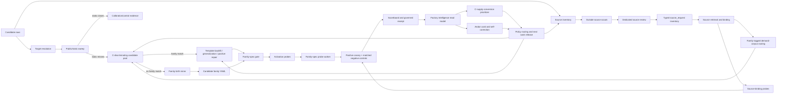
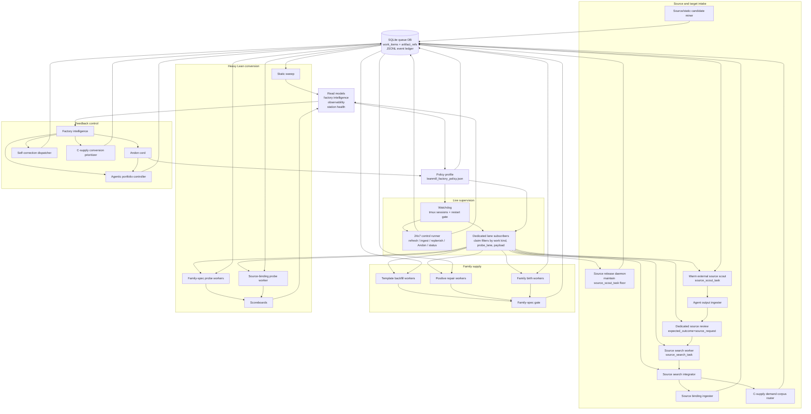

# LeanMill Architecture

> **Up:** [Documentation map](../README.md)
>
> **Current seam/spec:** `research_areas/seams/engine/lean/GP-225_leanmill_vnext_station_factory_seam.md` and `research_areas/specs/active/engine/lean/GP-225_leanmill_vnext_station_factory_spec.md`.
>
> **Canonical process-flow reference:** this document. The GP-225 spec owns the
> durable invariants and credit boundaries; this architecture document owns the
> current end-to-end lane topology, handoffs, and operating picture.

LeanMill is a station factory for Lean proof work. Its output unit is a typed learning-unit exit, not agent activity. Proof value is credited only when the execution artifact passes governance and matched controls. Everything else is inventory, routing signal, repair work, or retirement evidence.

## Core Boundary

The deterministic control plane owns queueing, leases, routing, stale-work checks, and read models. Agents and LLMs can propose YAML, source requests, templates, or repairs, but they cannot ratify proof value. Lean execution plus governance receipts decide whether a row becomes credit-ready.

Canonical kernel modules live under `src/ztare/leanmill/`. Operator scripts live under `scripts/public/control/`; legacy shim files there re-export canonical kernel APIs. New durable logic should go in the kernel when it is substrate-generic, and in operator scripts only when it is LeanMill-specific orchestration.

## MECE Contract Spine

The architecture target is not a larger set of workers. It is a smaller set of
non-overlapping contracts that every worker must obey. A station may specialize
the work it performs, but it may not invent a local meaning of "done",
"blocked", "credit-ready", "source-ready", or "handoff".

| Contract | Canonical owner | What it owns | What it must not own |
|---|---|---|---|
| Work bus contract | `src/ztare/leanmill/work_queue.py` | durable `work_items`, leases, terminal state, worker heartbeats, artifact role refs, and queue-boundary defaults | proof credit, benchmark credit, or station-specific scoring |
| Agentic handoff contract | `src/ztare/leanmill/contracts/handoff.py` plus policy `operations.agentic_handoff_contract_policy` | required terminal handoff receipts for accepted agentic generation; typed blocked/skipped receipts when no deterministic handoff exists | probe success, C credit, or benchmark lift |
| Source contract | source scout/review/search/integration contracts and receipts | typed source requests, retrieval evidence, allowed target bindings, and visible holds | treating an existing Mathlib theorem name as an unsolved target |
| Family contract | family-spec YAML, family-spec gate, activation selections, and target-aware template filters | positive/negative template pairs, target-safety, family birth, template backfill, and activation inventory | claiming proof value before downstream Lean/governance |
| Probe contract | probe packets, scoreboards, static filters, and matched controls | Lean execution evidence, positive canary results, negative-control outcomes, exact-gap/falsifier residuals | source or YAML generation credit |
| Governance contract | governance receipts and governed scoreboard summaries | final proof-value authority for rows and controls | queue routing or agent-generation allocation |
| Strict C credit contract | `leanmill_c_supply_credit.py` and factory-intelligence C read models | row-level `credit_ready` classification, dedupe, strict static no-signal, controls, family/source breadth diagnostics | relaxing the credit boundary to satisfy row-count goals |
| Factory intelligence contract | `leanmill_factory_intelligence.py` | deterministic single pane of glass: bottlenecks, recommendations, yield decomposition, and contract leakage | executing work or mutating scientific credit |
| Policy contract | `leanmill_factory_policy.json` | live priorities, worker counts, budgets, timeouts, model choices, breadth floors, and self-correction action allowlists | one-off station constants for live operating choices |

The table is intentionally MECE. If a new fact does not fit one row, add or
refine a contract before adding station-local state. If two stations need the
same classification, it belongs in a shared contract module or policy, not in
two scripts.

### Queue-Boundary Fail-Closed Rule

The queue DB is the distributed-system membrane. When a worker terminalizes an
accepted agentic family-spec patch, `work_queue.update_status` applies the
agentic handoff contract before storing the row. If the station did not write
the policy-required activation receipt, the queue stamps a visible
`skipped` handoff receipt with reason
`terminal_agentic_patch_missing_downstream_handoff_at_queue_boundary`. This
does not enqueue work or create credit. It prevents a completed agent transcript
from becoming hidden terminal state and gives factory intelligence a typed fact
to route against.

Richer station receipts still win when present. The queue-boundary receipt is
only the fail-closed default.

### Anti-Duplication Rule

Implementation should move toward these rules:

- Shared classifications live in `src/ztare/leanmill/contracts/` or another
  kernel module.
- Live knobs live in `leanmill_factory_policy.json`.
- Scripts may adapt CLI/path surfaces, launch tools, and write station
  receipts, but they should not re-derive credit, handoff, source, or priority
  semantics.
- Any new worker lane needs a typed input contract, typed terminal receipt,
  deterministic verifier or explicit blocked receipt, read-model projection,
  and policy-owned budget before it becomes part of the live factory.
- More workers are allowed only when the relevant contract read model shows the
  lane is producing deterministic downstream inventory and not merely
  increasing queued terminal artifacts.

## Main Lanes

| Lane                       | Purpose                                                                                                                           | Typical work kind                                                        | Credit boundary                                                                                                                                                 |
| -------------------------- | --------------------------------------------------------------------------------------------------------------------------------- | ------------------------------------------------------------------------ | --------------------------------------------------------------------------------------------------------------------------------------------------------------- |
| Static/tool sweep          | Determine whether public tools already solve a row                                                                                | checkpoint/static artifacts                                              | Calibration only; C is not tested if static closes first                                                                                                        |
| Family-spec probe          | Execute existing repair-family positive/negative canaries                                                                         | `repair_canary_probe` with `probe_lane=family_spec`                      | Credit-ready only with ratified positive proof value, matched negative-control failure, zero unexpected negative-control passes, zero invalid negative failures |
| Family-spec generalize     | Add sibling or heldout positive/negative pairs to an existing family                                                              | `agent_repair_task` with `family_spec_patch_mode=generalize_family_spec` | No proof credit; creates future probe supply                                                                                                                    |
| Family birth               | Create a new family YAML from unmatched static-failure clusters                                                                   | `agent_repair_task` with `family_spec_patch_mode=family_birth_candidate` | No proof credit; accepted YAML auto-activates family-spec probes                                                                                                |
| Positive repair/backfill   | Fix a known positive template that failed, preserving controls                                                                    | `family_spec_positive_repair` or `c_supply_template_backfill`            | No proof credit until the activation probe passes governance                                                                                                    |
| Quarantine repair          | Remove or repair unsafe YAML patterns such as holes or bad controls                                                               | `repair_quarantine`                                                      | Hygiene only; may unblock future probes                                                                                                                         |
| Source scout/review/search | Keep upstream outside-source breadth active, review source-scout transcripts, retrieve/bind concrete source candidates, and route family-tagged allowed target rows into demand corpora | `source_scout_task`, `llm_proposal_validate`, `source_search_task`, integration receipts | Inventory and routing only; integration receipts are not C credit and cannot treat existing Mathlib theorem names as unsolved facts                              |
| Source-binding probe       | Execute guarded canary probes produced by source binding                                                                          | `repair_canary_probe` with `probe_lane=source_binding`                   | No proof credit from the worker; only governed probe receipts may become value evidence                                                                          |
| Source materialization     | Convert stable Mathlib metadata or inline theorem goals into target-resolved Lean snapshots                                       | source snapshot receipts                                                 | Infrastructure only; no static, C, benchmark, or proof credit                                                                                                   |
| C-supply growth controller | Grow strict Path C rows through source mining, governed-static confirmation, template backfill, static sweep, and governed probes | `leanmill_c_supply_growth_controller.py`                                 | Publishes running and terminal receipts; routing only, strict C credit still comes from downstream receipts                                                     |
| C-supply conversion priority | Reprioritize queued repair/probe/source work from the C read model toward uncredited and underrepresented families              | `leanmill_c_supply_conversion_prioritizer.py`                            | Queue routing only; does not refresh candidate timestamps or create proof, benchmark, or C credit                                                               |
| Benchmark harness          | Compare declared arms on frozen slices                                                                                            | evaluation harness rows/checkpoints                                      | Benchmark credit is separate from factory credit and policy-classified by completed-row count                                                                   |
| Solver lane (2026-05-28)   | Attack `no_positive_family_template` C-pool rows (static-missed + no family template + executable) that family-spec probes cannot reach. Agentic-first proposal via the provider router (`leanmill_provider_registry.py`: native_hammer / claude_opus / codex_gpt5 / deepseek_v2 / leancopilot) with the mechanical semantic premise shelf attached. | `solver_lane` attempt → `unratified_closure_candidate` exit + matched context-stripped negative control | No proof credit at the lane — solver PROPOSES, governance RATIFIES (leak-tight + matched-neg-control + L3). Worker `leanmill_solver_lane_worker.py`; policy `operations.solver_lane`. **Target-corpus is now a first-class policy decision (`operations.target_corpus`): natural-Mathlib is Munger-empty for C credit (all no-template rows are `existing_mathlib_target_snapshot`); point the solver lane at Mathlib-resistant corpora (ZtareProofs open sorries / Carleson / NS Track B / AlphaProof replication) for credit-eligible runs.** |

## End-To-End Process Flow

The factory is a staged flow shop with feedback loops, not a pool of generic
agents. Queue rows are the work-in-process inventory; policy controls release
rates, station budgets, priorities, and routing. The normal flow is:

```text
candidate rows
  |
  v
target resolution + source inventory
  | \
  |  \-> outside source scouts -> source_review station
  |       -> source_request inventory -> source retrieval
  |       -> source-search integration receipts
  |       -> demand-corpus routing for family-tagged allowed targets
  |       -> source binding ingester -> source_binding probes
  |
  v
public/static sweep
  |                     static closes
  |------------------> calibration/control evidence
  |
  v                     static misses
C-discriminating candidate pool
  | \
  |  \-> no matching family -> family birth miner -> family YAML candidate
  |       -> family gate -> activation probes
  |
  |----> matching family -> template backfill/generalization/positive repair
          -> family gate -> activation probes

activation probes
  |
  v
family-spec/source-binding probe workers
  |
  v
positive canary + matched negative controls + scoreboard
  |
  v
governed receipt summary
  |
  v
factory intelligence read model
  |
  +-> conversion prioritizer, routing policy, source breadth pressure, family breadth pressure,
      benchmark readiness, Andon containment, retire/repair/backfill decisions
```

Obsidian-compatible Mermaid view of the same flow:



Only the lower half of this flow can produce factory proof-value evidence, and
only the intelligence read model decides whether that evidence counts as a
strict C credit-ready row. Source scouts, source review, source search,
  source-search integration, demand-corpus routing, source materialization,
static miners, family birth, and YAML repair create or filter inventory; they
do not create proof credit.

### Source-Growth Routing

The C-supply growth controller uses an advisory upstream rater for source-family
corpus ordering, but the rater is not allowed to starve newborn families that
just produced a ratified seed probe. Policy
`operations.c_supply_source_growth_routing` defines this ordering:

1. Apply the validated upstream-rater order.
2. Promote up to `recent_ratified_seed_max_promoted_families` written demand
   corpora whose family has a recent ratified family-spec seed probe.
3. Mine static failures from that ordered list.

This is routing only. A ratified seed row may still be a known Mathlib snapshot
and therefore not strict C credit. The promotion exists to force at least one
downstream search for non-laundered sibling rows before older source-demand
families consume all narrow source-mining slots. Source-family conversion still
uses the stricter `source_family_match` policy: low-confidence or seed-only
matches remain diagnostic and do not route C-template conversion.

## Stations And Worker Topology

Operations-science view:

- **Arrival streams:** MCB/evaluation rows, source-demand rows, external
  source-scout proposals, family-birth clusters, and post-probe repair needs.
- **Buffers/broker:** the node-local SQLite queue database plus JSONL event
  ledger. `work_items` is the durable pub/sub substrate, kanban board, and
  lease table. `artifact_refs` is the mutable artifact role registry for
  canonical, self-correction, and diagnostic paths. Queue claims are the
  subscription mechanism; claim filters by kind, `probe_lane`, expected exit,
  and payload fields are the topics.
- **Work centers:** deterministic prep/static/source tools, subscription-agent
  YAML/source workers, heavy-Lean probe workers, ingesters, and read-model
  compilers.
- **Bottleneck resources:** heavy Lean REPL slots, source breadth, target-safe
  family templates, and validated negative-control pairs.
- **Live supervision:** `leanmill_watchdog.py` is the tmux launch and restart
  authority. It reads policy, starts dedicated lane daemons, restarts missing
  or stale sessions, runs safety gates, and writes watchdog status.
- **Control loop:** `leanmill_24x7_runner.py` is the live control-plane runner:
  corpus refresh, source recovery, ingestion, replenishment, factory
  intelligence, station health, Andon/self-correction, and status heartbeats.
  Under live profiles `runner_drain_lanes=false`, so it does not serially drain
  source, repair, or proof lanes. `leanmill_c_supply_growth_controller.py`
  remains the C-supply release controller; its governed static/source/probe
  stages are enabled by the policy-owned `allow_heavy_lean` gate. While a
  long controller run is active it writes a running receipt with
  `current_stage`, `latest_selection`, `best_selection`, effective target, and
  partial round data, so factory intelligence does not reason from a stale
  terminal file. Policy key `resume_previous_running_state` lets a restarted
  controller adopt the prior running latest/best checkpoint when present, so
  partial conversion work survives restart without changing the strict credit
  boundary.
- **Lane daemons:** dedicated watchdog-started workers drain source, repair,
  source-binding, family-spec, and non-family probe lanes through queue claim
  filters. A separate source-release daemon maintains the source-scout work
  floor from policy, so upstream sourcing does not wait for a long static or
  proof-control cycle.

Station/topology view:



Current `supervised_24x7` policy topology is watchdog-supervised. The live
profile starts one watchdog, one control runner, and dedicated lane daemons. The
policy file owns counts and claim filters; CLI arguments are compatibility,
artifact-path, test, or emergency surfaces.

Under live profiles the control runner has:

```text
runner_drain_lanes=false
```

The runner station order remains policy-owned, but it is a fallback/simulation
path when `runner_drain_lanes=true`, not the normal live factory drain path:

```text
source_review -> source_scout -> source_search -> source_search_integrator -> source_binding_probe -> agent_repair -> generic_probe
```

The ordering rationale is operational: upstream source breadth and source-bound
conversion are the current bottleneck, while generic repair agents can occupy a
long subscription-agent window. In live operation that rationale is expressed
by dedicated watchdog sessions and lane counts rather than one serial drain.

| Station/work center | Worker shape | Current policy value | Specialization |
|---|---:|---:|---|
| Watchdog supervisor | one tmux supervisor | one `leanmill_watchdog` session per node/profile | Starts and restarts bounded sessions from policy; owns shutdown-marker respect and worker-version drift containment |
| Control runner | one control-plane daemon | one `leanmill_24x7_<profile>` session, `runner_drain_lanes=false` | Refreshes corpora/read models, ingestion/recovery/replenishment, station health, Andon, and status; does not claim lane work in live mode |
| Agentic portfolio control | policy-owned pre-refresh and post-intelligence control steps | `run_agentic_portfolio=true`, `run_preflight_agentic_portfolio_from_last_intelligence=true`, max actions, lane order, and deterministic no-enqueue preflight in `agentic_portfolio_controller` policy | Allocates bounded generation spend across source requests, source-to-target binding, template-family generation, family birth, and proof proposals immediately after the governance sentinel from the last read model and again after fresh intelligence; template/family-birth lanes spend only after preview receipts show concrete jobs or clusters; creates no credit |
| General agent repair | dedicated subscription-agent daemons | canary profile `repair_agent_workers=1`; `agent_worker_passes=1` only for fallback/sim drains | Specialized by `family_spec_patch_mode`: C-template backfill, positive repair, family birth |
| Source scout | warm subscription-agent daemon | `source_agent_workers=1`, `source_agent_warm_max_tasks=20` | Claims only `source_scout_task` and `expected_exit=source_request`; emits typed source inventory only |
| Source review | dedicated review daemon | canary profile `source_review_worker_passes=1` | Claims only `llm_proposal_validate` rows with `expected_outcome=source_request`; keeps scout transcripts ahead of generic backlog |
| Source search | policy-driven retrieval daemons | canary profile `source_search_worker_passes=1`; limits live in `source_search_worker` policy | Converts reviewed source requests into concrete retrieval and source inventory evidence; retrieval/ranking is generation-side inventory, not credit |
| Source search integration | bounded agentic binding plus deterministic ingestion | `source_search_integrator_passes=1`; `binding_mode` lives in `source_search_integrator` policy | Uses agents where semantic source-to-target binding is the generation problem; deterministic allowlists, active-corpus checks, binding ingestion, matched controls, Lean probes, and governance verify before any value evidence |
| Source-binding probe | heavy-Lean guarded source daemon | `source_binding_probe_worker_passes=1`, `source_binding_probe_govern_winners=true` | Claims only `probe_lane=source_binding`; uses the shared heavy-Lean lock and governance boundary |
| External source-scout release | dedicated source-release daemon | `external_source_scout_release_daemon=true`, canary profile `external_source_scout_floor=4`, `max_enqueued=2`, `max_families=4`, `tasks_per_family=1` | Maintains a target-bound source-scout buffer from policy, uses the shared source-routing policy to promote recent ratified-seed families, derives family hints from specs, and skips families already queued/running; outside/public-source inventory only |
| Family-spec probe supply | seeding budget | canary profile keeps family-spec generation/probe release one-at-a-time | Creates family-spec probe packets, no proof credit |
| Heavy Lean probe execution | dedicated Lean worker pool | canary profile `family_spec_probe_workers=1`, `non_family_probe_workers=0`, host heavy-Lean slots policy-owned | Specialized by probe lane; family-spec probes carry positive and negative canary pairs |
| C-supply growth | closed-loop controller | canary profile `allow_heavy_lean=true`; agent/static/template/family-birth substeps are one-at-a-time; C-slice size, source-static budget, advisory upstream rater, and 120-row growth goal are policy-owned | Controller treats 20 as a floor and continues toward 120+ strict C rows; downstream gates own credit |
| Ingestion and binding | mixed generation/verification pipeline | source binding ingester, agent output ingester, source search integrator | Agentic transcripts and bindings become typed inventory/contracts; deterministic ingestion rejects malformed, unallowlisted, Mathlib-existing-target, or non-controlled artifacts |
| Andon/self-correction | feedback controller | `run_andon_cord=true`, `self_correct_from_intelligence=true`, canary profile max 1 action/cycle plus max 1 preflight action from last intelligence | Source-bound zero-value pauses direct binding/probe expansion; source scouts pause only on verified overproduction or stronger safety warnings; no proof credit |
| C-supply conversion priority | feedback controller | policy-owned floors and family spread budget | Reprioritizes queued conversion/source work toward uncredited or underrepresented families; does not touch `updated_at` or grant credit |
| Strict C yield decomposition | deterministic read model over policy terms | time, population Elo/frontier, binding, static, probe, governance, and diversity terms | Explains which factor limits strict C growth; predictive/PCA fit stays disabled until enough resolved attempts exist |
| Read models | deterministic compilers | factory intelligence, observability, station health | No work execution; gives GM/operator state |

The policy file is the source of truth for these counts. The architecture doc
names the work centers and current operating profile so conflicts are visible;
it should not be used as a replacement for `leanmill_factory_policy.json`.
Preflight self-correction from a previous intelligence snapshot is restricted
to actions explicitly marked `early_dispatch`; expensive source/static mining
runs after a fresh factory-intelligence refresh, under the named budget profile
instead of ad hoc timeout overrides.

The canary C-supply growth controller uses an advisory upstream rater as a
generation-routing layer. The rater may reorder which source-family corpora get
static/template spend only after its JSON validates; invalid output falls back
to deterministic population-Elo order. Static no-signal, family-template,
probe, governance, and C-credit decisions remain deterministic.

The same source-routing policy also applies when the external source-scout
release lane chooses families. A recent ratified seed family is promoted into
the bounded source-scout candidate set before the `max_families` cut; recent
families with zero source spend are preferred over already-tried/open families,
and open-family duplicate suppression still prevents saturation. This is a
routing receipt only: the scout emits source requests, source search retrieves
and filters, binding/probe/static gates verify, and existing Mathlib targets or
static-positive rows still receive no strict C credit.

Within the C-supply growth loop, template backfill and family birth use the same
no-enqueue preview discipline as the portfolio controller. The controller may
observe stale template/family pressure, but it only enqueues agent work after a
preview shows concrete template-backfill jobs or family-birth clusters. This
keeps the productive source-static path active while avoiding agent spend on
empty pre-source inventory.

The agentic portfolio controller is the current execution hook for the stronger
agentic architecture. It reads factory intelligence, the C-supply growth
receipt, queue pressure, and Andon containment, then chooses a bounded set of
existing generation lanes to spend on next: source-request generation,
source-to-target binding, template-family generation, family birth, and proof
proposal generation. The runner executes it immediately after the governance
sentinel using the last read model so generation is not starved by refresh,
source-search, static, or probe work, and again after fresh factory intelligence
when the cycle reaches that point.

Demand pressure alone is not enough to spend a generation lane. For lanes with
known empty-input failure modes, the controller first runs the lane's
deterministic no-enqueue preview and records the result in the portfolio
receipt. Template generation is admitted only when preview finds concrete
template-backfill jobs from strict static-no-signal rows. Family birth is
admitted only when preview finds clusters under the current policy thresholds.
If pressure exists but preview returns zero jobs or clusters, factory
intelligence reports that as a first-class bottleneck instead of hiding it as a
successful no-op. This is portfolio allocation over stations, not a new credit
path; outcomes are joined back through deterministic read models, static/probe
receipts, governance, and strict C row accounting.

The handoff contract is also policy-owned. A terminal agentic generation row is
not enough: it must carry either a downstream deterministic handoff receipt or a
typed blocked/skipped receipt. Accepted family-spec patches must surface their
activation receipt; source-search rows with canary-ready candidates must be
integrated or held with a visible reason. `leanmill_factory_intelligence.py`
projects this as `agentic_handoff_contract` and raises
`agentic_handoff_contract_leakage` when completed agent work is missing the next
station receipt. This is routing integrity only; it creates no proof,
benchmark, governance, or strict C credit.

## Worker Specialization And Conflict Points

Worker specialization is intentional:

- `source_scout_task` workers are sourcing operators. They may use public
  Lean/mathlib lookup and the local mathlib lemma index, but their output is a
  typed `source_request` only.
- source-review workers claim only source-review proposals, so sourcing breadth
  does not wait behind generic decomposition/proposal backlog.
- source-binding probe workers claim only `probe_lane=source_binding` rows, so
  source-derived canaries do not depend on the generic probe-worker switch.
- the live control runner does not drain queue lanes when
  `runner_drain_lanes=false`; lane daemons are the production subscribers.
- `agent_repair_task` workers mutate family YAML only through scoped contracts,
  allowed paths, operator-contract checks, and family-spec gate validation.
- `repair_canary_probe` workers spend heavy Lean budget and are the only lane
  that can produce governed closure/exact-gap/falsifier evidence for a family.
- static sweep workers test public-tool solvability and must not be confused
  with proof-value workers.
- ingesters translate transcripts and source requests into typed queue work;
  they do not validate proof value.

The main conflict points are:

| Conflict point | Why it matters | Current guard |
|---|---|---|
| Heavy Lean slots | Parallel REPLs can contend for memory and make failures look like proof failures | policy-owned heavy slot counts and probe worker limits |
| Queue priority | Old high-score work can starve new family/source breadth | priority policy: higher integer wins, queue claims by priority then age |
| Source breadth vs. conversion | Converting one hot family can hit the row target while remaining brittle | C-breadth policy triggers source growth on row/family/source gaps |
| Source-search integration vs. target truth | Retrieval can find existing Mathlib theorem names that are useful source facts but not unsolved rows | integration receipts can route only family-tagged allowed targets into demand corpora; they do not create C credit |
| Source-scout queue vs. worker drain | Source scouts can be enqueued but not consumed if no source lane is active | `source_agent_workers` owns a source-scout drain lane |
| Source-binding probes vs. generic probe switch | Source-derived probes can be queued while generic probe execution is disabled | `source_binding_probe_worker_passes` owns a dedicated source-binding probe station |
| Bare runner vs. watchdog split-brain | A manually launched single-process runner can serialize lanes and hide missing dedicated subscribers | live profiles set `runner_drain_lanes=false`; `leanmill_restart.sh` should launch the watchdog path |
| Dedicated subscriber overlap | Two daemons claiming the same lane can distort conversion and retry accounting | watchdog sessions use policy-owned claim filters by work kind, `probe_lane`, expected exit, and patch mode |
| Canonical artifact overwrite | A corrective or diagnostic run can overwrite the JSON path consumed by read models | SQLite `artifact_refs` records path role and sha; self-correction c-supply runs are refused if they target shared dashboard outputs |
| Source overproduction vs. zero downstream value | More source rows can hide a bad binding/probe strategy | Andon cord pauses direct source binding on source-bound zero value; source scouts pause only after verified source overproduction or stronger safety warnings |
| Public-only no-signal vs. strict C no-signal | A public static miss alone is not enough for C credit | source-static candidates require strong family signatures and governed static confirmation |
| YAML repair vs. target leakage | A template can accidentally cite the theorem it is supposed to prove | target-aware family-spec gate quarantines target/gold references |
| Agent transcript vs. typed state | Free-form source or repair text can be laundered into state | agent output ingester and proposal gate require typed contracts |

## Family Lifecycle

1. **Static failures create pressure.** A row that static tools close is a control or calibration row. A row static tools miss can become C supply only if a repair-family signature matches or if it contributes to family-birth pressure.
2. **Existing-family path.** `family_spec_generalize` widens a known family with sibling or heldout positive/negative canaries. The YAML must pass `leanmill_family_spec_gate.py`. Then activation enqueues normal `family_spec` probes.
3. **New-family path.** `leanmill_family_birth_miner.py` clusters unmatched static failures and emits `family_birth_candidate` agent tasks. The policy may enqueue several distinct birth candidates per cycle when they cover distinct families or mechanisms. If the agent writes a valid family YAML and the patch receipt passes, `leanmill_agent_repair_worker.py` auto-creates a family-birth activation selection and calls the normal seeder.
   Family-birth token suppression uses the same source-family match policy as source-static conversion: only `candidate_family`-or-stronger existing families suppress birth tokens. Seed-only families may explain a weak lexical match, but they are not strong enough to erase new-family evidence or block birth pressure.
4. **Positive-repair path.** A `family_spec_positive_repair` task may improve a failed positive template, but it must preserve matched negative controls and must not silently downgrade the family lifecycle status. If a patch changes a `candidate_family` or stronger family into `seed_only`, the worker receipt fails and the patch is rolled back or retried with explicit feedback.
5. **Target-aware template path.** Family templates are filtered with concrete row target names before they enter C-supply prep, benchmark prep, demand-corpus building, static-failure mining, slice analysis, post-probe triage, or benchmark execution. Templates that cite the target/gold theorem are quarantined from usable supply.
6. **Source materialization path.** `leanmill_c_supply_demand_corpus_builder.py` can materialize demanded-family rows with missing source files through `leanmill_source_materialization.py`. Source-search integration receipts may add family-tagged allowed target rows to these demand corpora. They are routing receipts only: they do not count as C credit, and an existing Mathlib theorem name is source authority, not an unsolved fact. Mathlib metadata is preferred; inline theorem-goal skeletons are allowed only as source snapshots and must pass target resolution before static mining. Missing-source rows remain source debt, not static no-signal evidence.
7. **Source-binding path.** `leanmill_source_scout_worker.py`, `leanmill_source_review_worker.py`, `leanmill_source_search_worker.py`, and `leanmill_source_search_integrator.py` turn outside-source work into typed source-binding artifacts. `leanmill_source_binding_ingester.py` converts accepted bindings into `probe_lane=source_binding` work, and `leanmill_source_binding_probe_worker.py` executes that lane under heavy-Lean/governance policy. Source-binding receipts can become C evidence only after the downstream probe is C-discriminating and any owed static no-signal arms are present.
8. **Source-static confirmation path.** `leanmill_static_failure_miner.py` mines executable source rows with public-tool no-signal and family-signature matches. Source discovery stays broad, but conversion spend is gated by `src/ztare/leanmill/contracts/source_family_match.py` and policy `operations.source_static_family_match_policy`: a source-mined row may advance to template backfill only with enough distinctive hits, enough confidence, negative controls, and `candidate_family`-or-stronger family status. Seed-only lexical matches remain diagnostics/source-demand/family-birth evidence; they do not route directly into C-template/probe spend. A validated advisory rater can order the next corpora to spend on, but it cannot mark a row creditable. Recent ratified seed families get a policy-limited source-mining promotion so they can search for non-laundered siblings before older demand families consume all narrow mining slots. For conversion-eligible matches, the controller writes a temporary source-candidate selection and runs `leanmill_c_static_sweep_backfill.py` so template backfill sees a two-arm strict static miss, not a public-only candidate.
9. **Probe path.** `leanmill_learning_work_seeder.py` converts selected YAML rows into packets with shared family-spec probe signatures, static filters, and scoreboards. `leanmill_probe_worker.py` rejects stale family-spec packets when YAML changed since enqueue.
10. **Governed credit path.** `leansearch_repair_canary_drain.py` executes the positive and negative canary tests. `leanmill_factory_intelligence.py` counts a live-queue C credit only when the scoreboard receipt has proof value plus matched negative-control discipline and strict static no-signal evidence.

This means family birth and generalization are supply factories. Family-spec probes are the conversion gate. Factory intelligence is the single pane of glass.

## Current Credit Definition

A C-supply row is `credit_ready` only with probe-verified
C-discriminating evidence and all of these receipts:

- terminal governed probe from an eligible C-discriminating proof lane;
- target-safe family template: no direct target/gold theorem reference in the positive template;
- completed public and governed static arms with no positive static signal where owed by the slice-prep contract;
- scoreboard reports ratified closure, exact-gap candidate, or valid falsifier;
- matched negative control failed at least once;
- unexpected negative-control passes equal zero;
- invalid negative-control failures equal zero;
- row is deduped by `row_id`, not by receipt count.

The shared code boundary for row classification is
`scripts/public/control/leanmill/c_supply_credit.py`; controller and
intelligence consumers should use that helper instead of re-deriving strict
credit from `probe_credit_ready`.

The intelligence artifact stores the evidence under `c_supply_credit_ready_read_model.credit_ready_rows[].queue_evidence[]`: work id, family, exit kind, scoreboard path, proof-value counts, negative-control counts, and `receipt_ok`.

Rows with `c_discriminating_probe_verified_pending_static_sweep` are
near-ready inventory only. The growth controller and factory intelligence
surface them as `probe_verified_pending_static_count`, but they do not count as
strict C credit until the downstream slice-prep status is
`c_discriminating_probe_verified` and no static sweep is owed.

The row-count floor is policy-owned. The current policy minimum is 20 strict C
rows, and that is a readiness floor, not a stop condition. The live policy
growth goal is 120+ strict C rows, and continued growth is valuable only when
additional rows come from generalizable templates with family and source
breadth. Clean C-slice size is also policy-owned; docs and ad hoc scripts must
not freeze it. The breadth policy is a
diagnostic and routing contract: it can raise `c_supply_family_breadth_debt`,
`c_supply_source_breadth_debt`, or growth-goal debt, but it cannot create C
credit. A repeated-family run can still be useful mechanism evidence; it is not
enough for a moat-grade Path C claim.

Priority semantics live in the same policy file. Higher integer priority wins; durable queue workers claim by `priority DESC, created_at ASC`, and recommendations use `priority DESC, class ASC`. The rationale is explicit in policy so conflicts are inspectable: integrity and governance blockers outrank throughput, throughput outranks advisory observability once the credit boundary is safe, and priority never creates proof value.

## Restart And Resume Contract

The factory is distributed across tmux sessions, long-running controller
children, SQLite rows, JSONL events, and mutable artifact files. Restart safety
therefore has to be explicit:

- the queue owns claimed/running rows and worker heartbeats;
- watchdog shutdown reclaims open claims and terminates orphaned Lean/process
  groups;
- the C-supply controller writes running receipts with `latest_*` and `best_*`
  routing state;
- when a stage writes deterministic intermediate evidence before it can publish
  a new `latest_checkpoint`, the next controller run may adopt the recent
  stage-local artifact under policy max-age.

For C-supply source growth, the critical stage-local pair is:

```text
round_*.source_candidates.static_checkpoint.jsonl
round_*.source_static_candidates.selection.json
```

The checkpoint carries governed static evidence; the selection carries the
source-static candidate rows and family-match metadata. Both are required for
post-source slice prep and template backfill. Resuming only the checkpoint is
not enough because it loses the candidate/family context; resuming only the
selection is not enough because it lacks governed static evidence. The resume
contract preserves routing state only and creates no C credit.

## Strict C Yield Formula

Factory intelligence now emits a policy-owned strict C yield decomposition. It
does not replace the strict C credit boundary; it explains which factor is
limiting the path to 20, 120, or more rows:

```text
strict_c_yield_rate_per_hour =
  source_inventory_rate_per_hour
  * frontier_quality_multiplier
  * binding_quality_rate
  * static_no_signal_rate
  * probe_conversion_rate
  * governance_integrity_factor
  * diversity_retention_factor
```

The terms are intentionally separated:

- `source_inventory_rate_per_hour`: row-shaped upstream inventory divided by
  measured C-supply controller cycle time, or by the read-model trailing window
  when no controller wall-time receipt is present.
- `frontier_quality_multiplier`: population Elo/P-UCB signal over resolved
  executable attempts. It starts neutral until the policy minimum record count
  is met and never creates credit.
- `binding_quality_rate`: fraction of selected source/C rows that bind to
  executable, target-resolved, active rows.
- `static_no_signal_rate`: proxy for how often candidates survive the public
  and governed static filters without being a known/public solve.
- `probe_conversion_rate`: fraction of probe-visible candidates that become
  strict C credit-ready rows.
- `governance_integrity_factor`: policy-owned penalty for invalid controls,
  source disagreement, or live-queue/static-filter leakage.
- `diversity_retention_factor`: minimum coverage of family, source-file, and
  source-root breadth targets.

This is not a scalar credit score. `strict_c_yield_decomposition` also carries
`current_bottleneck`, `next_lever`, and a `feature_vector`. Predictive modeling
and PCA are gated by policy row-count thresholds; before there are enough
resolved attempts, the read model explicitly reports
`insufficient_resolved_attempts` or `feature_vector_only_not_enough_rows`.
That is deliberate: the factory should collect the variance-explaining feature
surface without fitting noise or laundering a tiny sample into a routing myth.

## Mechanism Vs Moat Evidence

A governed family-spec closure is proof-value evidence for the factory, but it is not automatically competitive or moat-grade evidence. `leanmill_family_spec_gate.py` now consumes row-context target names and source/gold names. Templates that directly reference the target/gold theorem are quarantined from usable probe supply. Templates that are public-lemma wrappers or generic tactic-floor closures remain visible as mechanism/calibration evidence, but `moat_disqualification_summary` marks them `mechanism_evidence_only` until the pre-registered arm comparison shows lift over public/static tools.

This prevents the factory from laundering Mathlib adaptation rows into solver-advantage claims. Competitive claims require C-discriminating rows: static/public tools fail, a family is eligible, controls pass, family/source breadth is visible, and the C arm improves closure/exact-gap/falsifier rate or efficiency under the frozen benchmark contract.

The operating rule is agentic generation and deterministic verification. Agents
should be used aggressively for source discovery, semantic source-to-target
binding, family-birth distinction, repair-template search, and adversarial
duplicate/laundering review. Their outputs are contracts and inventory, not
credit. Verification remains deterministic: target resolution, existing-Mathlib
target disqualification, source allowlists, active-corpus checks, static
no-signal, matched negative controls, Lean execution, governance, and the strict
C read model.

## Agentic Execution Modes

LeanMill uses three execution modes, and the discriminating criteria live in
`operations.agentic_execution_mode_policy` in the factory policy:

| Mode | Use when | Current LeanMill stations |
|---|---|---|
| Warm subscription agent | Multi-step semantic generation benefits from repository context, repeated task context, file inspection, source search, or scoped patch attempts | source scout, source review, family-birth, C-template backfill, positive repair, semantic source-to-target binding on full/overnight profiles |
| Cold subscription agent | A one-off high-context generation/review task needs file context or patch scope and no warm session is available, or warm session state/auth is stale | isolated source/review/repair tasks launched through the same subscription-agent contract |
| API LLM | The task is compact, bounded, and score-like: small JSON forecast, routing rater, classifier, or calibration packet where schema validation catches bad outputs | upstream routing rater and bounded independent scoring/review surfaces |
| Deterministic code | The task decides truth, credit, safety, queue state, target authority, or read-model joins | target resolution, Mathlib-existing-target disqualification, source allowlists, static sweeps, negative controls, Lean execution, governance, strict C credit, yield feature join, PCA readiness gate |

This split is practical, not aesthetic. Warm agents are better for generation
lanes that need long context and iterative artifact production. API LLM calls
are better for cheap bounded scoring and calibration. Verification and credit
stay deterministic because generated text cannot be allowed to ratify itself in
a distributed system.

Factory intelligence exposes this as `execution_mode_read_model`, a single-pane
view over intended lane modes, declared models, observed active workers,
observed open work, warm-session reuse, cold subscription calls, API LLM lanes,
and deterministic verification lanes. Model visibility is part of the contract:
the read model reports the general subscription-agent model, family-spec patch
model, source-scout model, API proposal model family/fallback, upstream rater
model, and source-search integration binding mode. Missing declared workers,
missing agentic source-binding work, or warm-session reuse failures become
`execution_mode_observability_gap` recommendations.

The same pane reports `declared_budgets` from
`operations.agentic_execution_budget_policy`: API LLM output-token and timeout
floors, warm source-agent wall time and iterations, source-binding agent wall
time and iterations, family-birth agent wall time and iterations, C-supply
agent worker timeout, and upstream-rater timeout. Budget failures become
`execution_budget_underprovisioned` recommendations. The rationale is narrow:
complex generation should not fail because it was truncated, but budget
adequacy still creates no proof, benchmark, governance, or C credit.

The evaluation harness emits a policy-backed claim class. Tiny runs and one-row smoke tests can show wiring health only, even when every arm is positive. Internal benchmark claims require a minimum completed-row count and clean preflight receipts; publishable benchmark claims require the policy's publishable threshold. This keeps integration smokes from being described as benchmark lift.

## Handoffs That Must Stay Mechanized

| Handoff | Mechanism | Failure mode to surface |
|---|---|---|
| YAML change -> queued packet | family-spec template fingerprint in WorkItem payload | stale packet must exit typed without Lean spend |
| Row/context -> probe target | target-resolution contract in seeder metadata and probe signature | multi-theorem files without a concrete theorem target must not become no-signal evidence |
| Source-demand row -> static miner | demand-corpus executable-source filter plus source-materialization receipt | rows whose source files are missing must become materialization/source debt, not static no-signal supply |
| Source-search integration -> demand corpus | integration receipt with family tags plus allowed target rows | route to C-supply demand corpora only; existing Mathlib theorem names must be treated as known/source facts, not unsolved target claims |
| Source miner candidate -> governed static | two-hit source-signature filter, temporary source-candidate selection, and `leanmill_c_static_sweep_backfill.py` | public-only no-signal rows, singleton family-token matches, and integration receipts must not stall invisibly or be treated as strict C supply |
| Queued budget exhausted -> terminal state | queue terminalizer | exhausted queued rows must not block replenishment invisibly |
| Agent patch -> YAML acceptance | family-spec patch receipt and gate validation | missing patch, schema drift, self-reference, weak controls |
| Terminal agentic output -> next station | policy-owned `agentic_handoff_contract` read model | completed agent rows without deterministic activation/integration/blocker receipts must be leakage, not success |
| New family -> first probes | family-birth activation seed command | accepted family with no activation is supply leakage |
| Positive repair -> retry probes | positive-repair activation seed command | repaired YAML with no follow-on probe is supply leakage |
| Probe scoreboard -> intelligence count | live queue receipt summary | dashboard undercount, duplicate inflation, missing evidence |
| Mutable artifact path -> read model | `artifact_refs` table in the LeanMill SQLite queue DB | self-correction/diagnostic output must not become canonical factory state by filename collision |
| C read model -> queue priority | `leanmill_c_supply_conversion_prioritizer.py` using policy floors and family spread budget | repeated-family conversion starving underrepresented families; priority-only refresh must not satisfy freshness gates |
| C benchmark slice -> harness | frozen selection and checkpoint resume | rerunning from scratch or counting static-solvable rows as C tests |
| Tiny benchmark smoke -> claim language | evaluation harness claim-class policy | one-row or two-row positive smoke must not become benchmark-lift language |
| C-supply count -> moat-grade read model | breadth policy in factory intelligence | 20 rows from one family/source aperture must remain breadth debt |
| Watchdog session -> lane claim | policy-generated tmux session plus claim filters | missing source/review/search/probe subscribers must show as station health/runtime defects, not as empty demand |

## Operational Read Model

`leanmill_factory_intelligence.py` should answer these without operator reconstruction:

- total C credit-ready rows and remaining-to-target;
- probe-verified-but-static-pending near-ready rows;
- family breadth distribution;
- source-file and source-root breadth distribution;
- upstream source-demand family breadth;
- receipt evidence for every credited row;
- family-birth pressure and queued/running/done birth tasks;
- family-generalization backlog and accepted patches;
- activation leakage: accepted patches with zero seeded probes;
- stale/exhausted queue hygiene counts;
- upstream rater calibration and realized outcomes;
- strict C yield decomposition: time, Elo/frontier quality, binding, static,
  probe conversion, governance integrity, diversity, bottleneck, and next
  lever;
- execution modes and model visibility: warm/cold subscription-agent usage,
  API LLM lanes, deterministic verification lanes, declared models, active
  workers, and gap classes;
- benchmark readiness separated from factory progress.
- benchmark claim class: wiring smoke, internal benchmark, or publishable benchmark boundary.
- target-resolution debt for family-spec probes, including unresolved rows and open probes missing concrete theorem metadata.
- artifact registry health: canonical/self-correction/diagnostic refs, sha
  mismatches, path mismatches, and role conflicts for mutable dashboard paths.

If an operator has to inspect raw chat or manually join scoreboards to know whether credit is real, the intelligence layer is incomplete.

In distributed operation, the VPS node-local SQLite queue DB is the live
authority for `work_items`, worker heartbeats, and `artifact_refs`. The
VPS-generated `leanmill_factory_intelligence.json` and `family_spec_gate.json`
are status projections over that state. Laptop-local runs are simulations or
operator projections over whatever local queue and temp selections are present;
their counts must not be reported as factory truth unless they were refreshed
from the VPS via the curated `deploy/vps_pull_files.txt` path. Do not run
multi-writer SQLite over file sync between Mac and VPS. If replication is
needed, replicate append-only events and DB snapshots from the authority node;
do not let two nodes write the same mutable queue/artifact database.

Every live code module used by watchdog, runner, or lane daemons must be listed
in `deploy/vps_sync_files.txt`. A local-only helper is a deployment bug: the
VPS may keep running already-loaded code until the next cycle, then fail at the
import boundary after restart or child-process launch.

Long Lean/static child commands must run in their own process group and be
killed as a group on timeout. A timed-out parent that keeps writing checkpoint
records after the controller has advanced is split-brain evidence, not useful
progress, because downstream selection refreshes will not consume that late
checkpoint deterministically.

Shutdown/restart also owns process-group cleanup. After tmux sessions stop,
`leanmill_shutdown.py` scans for LeanMill long-running controller/static/source
groups reparented outside tmux and terminates their process groups under the
policy key `shutdown_cleanup_process_groups`. This prevents an old generation
from consuming heavy Lean slots or writing stale checkpoints beside the current
controller generation.

## Scaling Rule

Scale by balanced learning exits, not by worker count. The healthy loop is:

```text
strict static failures -> source-demand breadth -> public source static candidate -> governed static confirmation -> family match or birth pressure -> YAML supply -> activation probes -> governed receipt -> intelligence feedback -> routing priorities
```

Adding workers helps only when this loop has open, non-duplicate work and the Lean slot is the bottleneck. If the bottleneck is missing families, weak templates, narrow sourcing, or activation leakage, worker scaling just burns compute.

## Benchmark Boundary

The public-tool calibration benchmark and C-discriminating benchmark are different artifacts. A row where static tools close first tests governance preservation and tool baseline strength. A row with the owed static no-signal and an eligible family/source template tests Path C. Benchmark reports must slice by this boundary, use the policy-owned clean C-slice size, and keep factory credits separate from benchmark wins.
