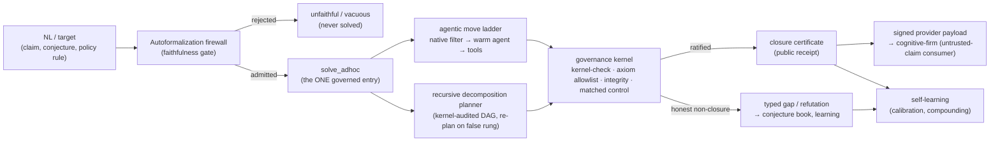

# LeanMill Architecture

> Up: [Documentation map](../README.md) · Design history / decision log: [`leanmill_design_history.md`](./leanmill_design_history.md) (the dated RCAs, A/B evidence, and "why" behind every invariant below).
>
> Seam/spec of record: `research_areas/seams/engine/lean/GP-225_leanmill_vnext_station_factory_seam.md`. This document owns the durable architecture; the seam owns the live operating spec.

## 1. Overview

LeanMill is a governed proof-search environment: a deterministic governance kernel wrapping a `formalize → solve → govern → self-learn` pipeline over swappable frontier-model agent leaves. Its output unit is a typed, governed exit: a kernel-verified closure, an honest gap, or a kernel-checked refutation. Agent activity is never the unit.

The distinctive bet is the untrusted-claim regime: where a compiling Lean proof is *necessary but not sufficient* (autoformalized mathematics, AI-generated proofs, open conjectures, and non-mathematical compliance rules). Competition provers optimize closure-% on *trusted* benchmarks where "it compiled" suffices. LeanMill makes the result *trustworthy*: every closure is re-verified by an anti-laundering kernel the leaf cannot influence, and every autoformalized statement is gated by a faithfulness firewall before any proof is attempted.

The agent leaf (codex/claude, or a trained prover) is the substrate that LeanMill wraps and multiplies. A stronger leaf occupies a provider-registry slot, available for swap-in.

## 2. Design principles

These are core invariants. Each is restated cleanly here. The dated derivation and the bugs each one closed live in the design history.

1. One governance kernel. Exactly one anti-laundering organ stack ratifies every solving mode (cascade, governed-DAG, ad-hoc, proof-repair, family/compounding, batch). A new check is registered once as a kernel organ and every mode inherits it. No mode re-implements governance. Canonical: `gates/lean_proof_gate.run_anti_laundering_kernel`.

2. One governed solve entry. Exactly one entry (`solver_core.solve_adhoc`) runs the move space and the kernel. Every way of producing work (ad-hoc, autoformalize, notes, residual-C, proof-repair, family, iso-decompose) is a target-producer that routes through it via the identical interface `(target_name, source, goal, *, substrate, mode, timeout_s)`. A new capability is a producer, never a parallel solve or governance path.

3. The Goldilocks line: determinism only at the soundness boundary, agency everywhere upstream. Put determinism exactly where soundness *requires* it (the trust primitives) and nowhere else; give the agent full agency upstream. The test for any knob: *does soundness require this to be mechanical?* Yes → boundary, deterministic. No → agency. The two failure modes are determinism creep into the agent's lane (hand-wired routers/statements cripple the leaf) and agency leak into the boundary (agent as its own judge → laundering).

4. The solver builds proofs; it is not a Mathlib lookup. A missing Mathlib lemma is a *sub-goal to prove*. A Mathlib survey maps the build-frontier: the citable foundation and the decomposition tree to construct above it. The matched-negative-control organ exists precisely to *reject* the degenerate "proof = library lookup."

5. Governance is the differentiator; the exogenous moves are a reliability layer. A shell-enabled frontier leaf can reproduce the SymPy/SMT moves itself (measured). What it *cannot* do is police itself, so the genuinely defensible capability is the deterministic anti-laundering kernel.

6. One WorkItem contract. Theorems, theory (definitions + API lemmas), and manifests are all typed, receipt-bearing work (`contracts/work_items.py`). Receipts are machine-consumed first (fed into the next dispatch) and human-rendered second. The conservation rule is that any later item can build on a receipt without re-derivation.

7. Notes are advisory; compile scope is authoritative. Campaign context (the blueprint, the proven shelf, the gap ledger) reaches the agent as *notes* (text, i.e. intent). What a target can actually *cite*, though, is its compile scope, which is assembled separately. These two channels MUST NOT drift: a lemma the notes advertise as "citable" has to be in scope, or it is not citable at all and the agent silently re-derives it inline (dead code, no dependency graph, the FTAP-composition bug). This is the root of the notes-path bug class (*text-context ≠ compile-scope*: shelf-as-text vs. standalone probe, blueprint defs vs. bare-`import Mathlib` verify, shelf-in-notes vs. cascade re-deriving from the goal), and it is insidious because the kernel safety net masks the drift as a *worse proof / silent drop / false-negative*, never a crash. The cure for the class is a single campaign probe assembler (`solver/autoformalize.assemble_campaign_probe`), the one source of truth for a target's scope: it places each proven shelf lemma in scope, dedups shared definitions (so theory-building targets that inline the same `def`/`structure` in every self-contained probe do not duplicate-declare), orders defs → shelf theorems → target, and falls back to the bare target on an unresolvable conflict (never a silent wrong merge). The `citable ⟺ in-scope` CI guard (`tests/test_leanmill_agentic_invariants.py::test_campaign_probe_assembler_citable_in_scope`) fails the build if the assembler stops enforcing this or a producer reintroduces a hand-rolled concat. Producers thread campaign context through the assembler, never as text alone.

8. Gate · Reporter · Move: the code-vs-primitive law (the cut Goldilocks leaves open). Principle 3 says *where* determinism goes (the boundary); this says *how* a capability reaches the system, which is the cut you hit the moment you want a new capability. Every capability is exactly one of three roles:
   - GATE (code, deterministic, *blocks*): soundness *requires* it to run agent-independently. If it is wrong or skipped, an unsound result passes. Kernel verify, axiom audit, `statement_integrity`, matched-negative-control. *Test: could trusting the agent here let something false through?*
   - REPORTER (code, deterministic, *never blocks*): honest measurement the agent must not self-grade. If skipped, a dishonest claim stands unflagged. `def_denotation` (denotation), `certify_nonvacuity` (vacuity), assumption-accounting, run telemetry, the probe-path-drift detector. *Test: is this a claim about what was/wasn't established that the agent shouldn't grade itself on?*
   - MOVE / PRIMITIVE (agent reasoning, surfaced via the ONE move corpus + dual-channel atlas, kernel-rechecked): a strategy to make progress or discover, whose output the gates re-verify and the reporters measure. `generalize`, `conjecture_lemma`, `corroborate`, `transport`, the Extremal method, Constraint Imposition & Propagation (`broad_08`, the "what does this hypothesis secretly force?" / hidden-consequence move), and the agent's own denotation anchors + vacuity witnesses.

   *Decision rule:* *discovery and strategy are ALWAYS moves (never hard-coded as an organ); verification and measurement are ALWAYS code (never delegated to the agent).* A capability is code iff trusting the agent to do it would let an unsound result pass (gate) or a dishonest claim stand (reporter); otherwise it is a move. Corollary (the trap this closes): a *prober* that DISCOVERS something (hidden consequences, the weakest sufficient hypothesis, a quantitative weakening) is a move, surfaced in the corpus and applied by the agent and kernel-verified, never a bespoke `*_prober.py` organ. Building one is determinism-creep into the reasoning lane and a parallel surface (it violates Principles 3 and the single-corpus rule at once); and it is usually redundant, since the hidden-consequence move already exists as `broad_08`. The recall/surfacing of a move (the atlas and both its channels) is code-infrastructure; the move itself is the agent's choice. Do not conflate these roles. *Self-check before adding any capability: name its role. If you reach for a new organ to do reasoning, you mis-cut: make it a corpus move. If you reach for the agent to guarantee soundness or grade its own honesty, you mis-cut: make it a gate or reporter.*

## 3. The soundness model

The single guarantee: no false closure. A `closed` from the solver is an *unratified proposal*. Only the kernel verdict ratifies. The trust boundary is a small set of deterministic primitives the agent cannot influence:

- *Kernel proof-check*: the Lean kernel re-verifies the proof term.
- *Axiom allowlist*: `#print axioms` on the closed decl must be ⊆ `{propext, Classical.choice, Quot.sound}`; `sorryAx`, `native_decide`'s `ofReduceBool`, and any other axiom are rejected.
- *Statement integrity*: the proved statement and every definition/structure it depends on are unaltered (no def-shell, no instance/notation/macro/`set_option` that changes meaning).
- *Matched-negative-control*: the proof must *need* the source prelude. A proof that compiles against bare Mathlib was a lookup, not a closure.
- *Non-degeneracy*: the statement is not vacuously true (instance battery / non-degenerate-instance probe).
- *Canonical re-elaboration*: strips added instance/notation context and recompiles. If the target no longer closes, the proof depended on a semantic hijack.

Gates fail-open on tooling-inconclusive and fail-closed only on a *confirmed* violation. Because soundness lives entirely at this boundary, the agent above it is fully free: a false sub-lemma fails honestly (no false closure), which is what makes agent-generated decompositions non-iatrogenic.

## 4. System architecture

LeanMill is a set of components separated by typed contracts. Each owns one responsibility and exposes one interface. None invents a local meaning of "done", "closed", or "credit-ready".

### 4.1 Governance kernel (`gates/`, `solver/governance*`)
The soundness boundary of §3: an extensible organ stack plus the axiom-allowlist gate and matched controls. Anti-laundering findings are catalogued to a cross-substrate registry (`gaming_vector_catalog.jsonl`); the gaming-pattern hardener (`common/kernel_hardener.py`) is shared with autoresearch. The kernel never trusts "it compiled."

### 4.2 Autoformalization firewall (`solver/autoformalize.py`)
Gates the solver: an unfaithful, vacuous, or trivial NL→Lean statement is rejected *before* any proof is attempted. Legs, fail-closed (admit only on a positive signal):

| Leg | Checks |
|---|---|
| Compilation | typechecks with `sorry` |
| Non-triviality | cheap tactics can't close it; not vacuously true |
| Structural faithfulness | binder counts, conclusion operator, quantifier order match the reference (catches dropped hypotheses, weakened conclusions, quantifier reordering) |
| Semantic instance battery | the predicate must `decide` to human-labelled cases (ground truth, not opinion) |
| SMT-boundary battery | z3 finds the exact decision-flip edge over ∞ domains (`SmtPolicyChecker.threshold_cases`); Lean kernel ratifies each case |
| **Certified faithfulness** | a **typed 3-verdict artifact** (`certified_faithfulness.certify_policy_faithfulness`), never an opinion: `CERTIFIED_EQUIVALENT` (z3 exhaustive equivalence over the whole domain, optionally **kernel-promoted** to a Lean `omega`/`decide` proof) / `REFUTED` (a concrete, re-verifiable distinguishing input) / `OUT_OF_FRAGMENT` (the honest Rice-theorem boundary → advisory fallback, never a silent admit) |
| Round-trip judge | back-translate to NL; a cold cross-family judge (majority-of-N) must rule it the same problem |
| Cross-vote consensus | ≥2 independent formalizers agree on a kernel-equivalent statement |

The deterministic structural carrier overrides a charitable LLM judge. The instance + SMT-boundary legs are what let the firewall apply beyond mathematics (compliance policy, see §4.6).

The firewall guarantees FIDELITY, not TRUTH, so the NL is the maintainer's critical input (`faithful ≠ correct`). Every leg above answers one question: *does the Lean statement mean the same thing as the NL?* None of them (and none of them *can*) answer the prior question: *is the NL itself a correct statement of the intended result?* That second question is undecidable in general and belongs to the maintainer. The consequence is a failure mode that lives entirely upstream of the solver and is invisible to the gates: a *faithful* formalization of a mis-stated or false NL produces a formal target that is itself false, vacuous, or (most insidiously) a *plausible-but-wrong* rendering that silently swaps the intended object for a different one (e.g. conflating "this specific construction fails to descend" with "the ambient structure fails a global property," or asserting an implication that is subtly too strong). The firewall admits it (it *is* faithful to the NL), the planner decomposes it, and the leaf then cannot close it, because it is not true, so the run terminates in honest `no_advance`/`exact_gap`, never a laundered closure. Soundness is fully preserved (the kernel admits nothing false), but an entire campaign's budget can be consumed proving something unprovable, and the symptom (persistent gap) mimics "hard math" exactly. The tells of a *statement* fault (a wrong NL masquerading as a hard problem): a target that *should* be near-definitional gaps repeatedly; the decomposition produces sub-lemmas that are individually suspect; the leaf's probes fail on the goal being false, with tactic search exhausted. The discipline: the precise NL is the single highest-leverage and highest-risk input to the whole pipeline. Invest in stating it correctly (prefer near-definitional, decomposed, or already-on-the-shelf phrasings; have the domain expert ratify a non-trivial claim *before* a campaign), and read a stubborn gap first as "is the statement even true?" before "is the prover too weak?" The apparatus is honest about *the question it was asked*; asking the wrong question is the maintainer's error to catch.

Encoding choice: a faithful rendering can still be the WRONG (intractable) one (`faithful ≠ tractable`). A second upstream failure mode, distinct from FIDELITY-not-TRUTH above: there the NL is *wrong*; here the NL is *right* but the formalizer picks the heaviest of the many *faithful* renderings. An abstract NL ("a presheaf of groups `G`, a Čech 1-cocycle on the cover's nerve, its class `[g] ∈ Ȟ¹`…") pattern-matches its vocabulary onto the nearest Mathlib machinery (and Mathlib *has* that machinery), so a faithful, typechecking formalizer (the interactive one even uses its `search`/Loogle tool to find the real names) renders the target over the full Grothendieck-site stack (`PresheafOfGroups.OneCocycle`/`H1`/`OneCohomologyRelation` over an arbitrary site), which typechecks faithfully and stays proof-intractable, when the same claim has a logically-equivalent *elementary* model the leaf could actually close (e.g. the cyclic-holonomy nucleus on a `ZMod n` cycle). The planner then dutifully decomposes the monster and the run grinds. The symptom again mimics "hard math," while the leaf is plenty strong (the elementary nucleus is a six-line proof). The root cause is structural and was a default-off sibling: the formalizer optimizes pure *fidelity* with no *tractability* objective, and the one input that would steer it to the light model (the maintainer's blueprint `## Idea`, "the general statement is heavy; find the minimal concrete instance") was withheld because notes-as-render-context was gated behind a default-OFF flag (`ZTARE_LEANMILL_FORMALIZE_NOTES`), AND the reduce-to-witness move fires only at *proving* time (`move_atlas`), a stage too late once the goal's TYPE is already the abstract one. Fix (2026-06-21): context parity, NOT coaching. The required change is that the blueprint reaches the formalizer DEFAULT-ON (anti-sibling cure; callers opt OUT via `ZTARE_LEANMILL_FORMALIZE_NOTES=0` for the notes-blind A/B baseline), plus a one-line un-gag of the context framing: the old "use the context ONLY to render faithfully; do NOT formalize the context" implicitly discouraged honoring the blueprint's intended *model*, so the context may now steer *which* model/nucleus to formalize (the maintainer's lane) while the surrounding prose is still not itself formalized. That is all the code does, deliberately with no "prefer-elementary / keep-general" encoding lecture and no concrete types: an earlier draft added one and it was reverted as exactly the over-fitting trap (coaching the formalizer with this example's answer, info a capable formalizer should not need). The honest framing: the only legitimate asymmetry between an external agent that renders the right elementary nucleus and the in-harness leaf is context (the external agent knows the paper wants the §7.1 *nucleus*, the elementary model behind the general claim) and the faithfulness bar (the firewall judges the rendering against the *general* NL, so any nucleus rendering looks "unfaithful" to it; the external agent was never gated). Soundness is untouched: the firewall remains the sole arbiter, so honoring the blueprint's model can never specialise a general claim or launder a weakening past the gate. The clean resolution is decomposition: state the nucleus as its OWN target/lemma with its OWN faithful NL (kept general in its parameters, e.g. `∀ n`, not a fixed `ZMod 2`/`Fin 3` instance, which collapses to a *decidable* toy the non-triviality leg correctly rejects), prove it, bank it, then lift toward the general criterion (the blueprint-decomposition the campaign loop already runs: `## Nucleus, FORMALIZE THIS FIRST`). The discipline mirrors the FIDELITY-not-TRUTH one: a stubborn gap on an abstract target is read first as "did the formalizer over-model onto heavy machinery, or over-reduce to a decidable toy?" (inspect the committed `FormalizeProbe.lean` / `formalize_observations.jsonl`) before "is the prover too weak?", and the maintainer's highest-leverage lever is to state the intended elementary nucleus as a first-class lemma in the blueprint, not to strengthen the leaf or coach the formalizer.

Encoding choice: a faithful rendering can still be NARROWER than intended (`faithful ≠ general`). A third upstream failure mode: the NL asks for a general structure (a partial/ranked order, ties allowed) but a substrate-primed formalizer renders it over a STRONGER instance class (`[LinearOrder]`) that silently forbids the general case: fidelity-correct to *a* reading, yet a narrowing invisible to the structural legs, because a stronger instance gives an *identical* fingerprint (`[LinearOrder]` vs `[Preorder]` differ only in a typeclass field). The canonical instance is the pari-passu waterfall: a strict-total-order rendering closes the special case while the intent is equal-rank tranches sharing pro-rata. The leg `typeclass_generality_audit` is neurosymbolic: a symbolic instance-binder extraction (`_instance_classes`, bracket-matched over the canonical signature, kernel ground truth) grounds a cross-family majority-of-N LLM judge that rules whether the assumed instances are *stronger* than the intent's stated generality (no hardcoded domain registry, which would be brittle determinism). It is advisory, never gating (`[firewall] ⚠ generality: NARROWER …`; `ZTARE_LEANMILL_GENERALITY_AUDIT=0` reverts): as with `faithful ≠ tractable`, the cure is the maintainer's blueprint (state the general structure and forbid the narrowing in `## Target`/`## Idea`), and the honest outcome when the general case is genuinely harder is a *gap*, not a narrowed closure. A benign false-positive on `[Fintype]` (a finite collection *is* faithful) is tolerable precisely because the leg is advisory; a *missed* `[LinearOrder]` narrowing is the real failure it guards.

Certified faithfulness: opinion vs. certificate (the sharpened thesis). For the decidable policy fragment the firewall returns a checkable artifact that a formalization matches intent, an actual certificate (`certify_policy_faithfulness`, a thin typed composition over z3 `equivalence`/`distinguishing_requests` + `groebner_cert` + the Lean `omega`/`decide` kernel, no reimplemented decision procedure; z3 is complete for linear-integer policy). The lineage is named: PCP/IP (a bounded verifier policing an untrusted producer), Rice (the undecidability boundary that *requires* an honest `OUT_OF_FRAGMENT`), Gröbner/Farkas (certificate-of-equivalence). Measured at scale (`results/certify_policy_corpus_run.md`, N=18 across 8 compliance domains). What this is and is NOT: the engine *decides* 18/18 (no `OUT_OF_FRAGMENT` residue on this fragment) and agrees with the z3 ground truth on all 18, but the engine *is* z3, so that agreement is a consistency check, NOT an independent accuracy claim (z3 agreeing with z3 is expected, not evidence of an edge). The only non-tautological signals are (a) every verdict is a checkable artifact (a cert or a re-verifiable distinguishing input) and (b) the comparison against the independent oracle (the LLM judge), which is a kept null: the N=5 probe's witness gap (engine 3/3 vs judge 2/3) does not replicate. At N=18 the judge gets every verdict right *and* a valid witness for all 9 launders. So there is no measured accuracy/witness edge; the durable differentiator is the soundness guarantee (a decision-procedure certificate, sound by construction and re-runnable; an LLM opinion has no guarantee on the next corpus), not a number.

The trichotomy generalizes beyond policy into a transport-to-decidability router (`solver/decidability_router.py`): it routes a faithfulness/validity obligation to the theory where it is decidable (LIA/EUF → RCF/NIA → polynomial-ideal), composing `certify_policy_faithfulness` + `nlsat_decide` + `groebner_cert`. The decidable-fraction lift (`results/decidability_router.md`): on a mixed 7-obligation seed (incl. genuinely-undecidable rows, Fermat over ℤ and a non-ideal-member, that resolve to honest `OUT_OF_FRAGMENT`), the portfolio decides 5/7 (71%) vs a single best theory's 2/7 (29%) → lift +3. The Rice boundary surfaces here as a measured frontier the router maps. This exploration is safe by construction: the soundness red-team (§8) includes a transport-laundering class. A wrong Gröbner cofactor / false witness / asserted analogy is rejected by kernel re-verification (8/8 rejected, 0 false-positive, genuine transport passes).

This non-math firewall is a first-class spine: a committed corpus of 16 domains across compliance / finance (SMT-boundary) / IAM-access / DeFi-nonlinear / must-search (`scripts/public/control/leanmill/nonmath_domain_corpus.json`), and a deterministic, reviewer-runnable demo (`scripts/public/control/leanmill/nonmath_firewall_demo.py`) that shows the kernel admitting every faithful spec and rejecting every laundered one with no LLM in the loop. Measured edge over a steelmanned LLM judge: precision (firewall 14/14 vs judge 13/14, 0 vs 1 false-reject). The catch-rate is a kept null (the differentiator is the auditable certificate, not out-catching the judge). Public entry: `autoformalize.faithfulness_gate(nl, lean_statement)`.

#### 4.2a Blueprint authoring: carry the PROBLEM and the VOCABULARY, never the DECOMPOSITION (2026-06-23)

A campaign blueprint (`autoformalize_from_notes`) is a maintainer input, and the recurring authoring mistake is to *over-specify* it. In that entry a `## Lemmas` bullet is a FORCED sub-target: each bullet is `attack_fn(bullet)`, formalized into a `theorem … := by sorry` and proved on its own. Two consequences make over-specifying *iatrogenic*:

1. A bullet that is actually a DEFINITION produces a tautology. "Introduce the increasing-differences predicate …" has no theorem content, so the formalizer can only render it as `X ↔ (X's own body)` (`Iff.rfl`), which the firewall correctly rejects as degenerate. The symptom *looks* like a firewall false-negative (and "wtf, again"), but it is a blueprint fault: you asked the prover to "prove a definition." (Observed on the Topkis increasing-differences lemma, 2026-06-23; the judge was live and *passed* the substantive exchange lemma in the same run, so it was no false-reject.)
2. Prescribing the proof's sub-lemmas usurps the planner. The DAG planner's `conjecture_lemma` moves already decompose internally (`iso_lemma1/2/…`); a hand-written decomposition is determinism-creep into the agent's lane (Principle 3) and forces *your* (possibly worse) split.

*The authoring rule.* A blueprint carries the problem (`## Target`, the NL theorem) and the vocabulary (`## Theory file`, the `def`s Mathlib lacks, established once and never "proved"), plus an optional NL `## Idea` (advisory planner context). It does not carry the decomposition. Reach for `## Lemmas` only for a genuinely-known, *provable* sub-theorem the planner would otherwise miss; never a definition, and never "define X + show property" as one bullet (split it: the `def` goes to `## Theory file`, the property becomes its own provable lemma). This is the notes-path face of Principles 3 (agency upstream) and 7 (notes advisory / scope authoritative): the maintainer states *what to prove* and *what the words mean*; *how to decompose it* is the apparatus's job. Diagnosing a stubborn campaign: read a faithful-but-rejected or tautological lemma first as "did my blueprint force a definition or a bad split?" before "is the firewall over-rejecting?"

The `## Target` carries the CLAIM at full ambition, never the FORMALIZATION CHOICES. Decomposition is not the only agent lane a blueprint can usurp; the *formalization* is one too, and it hides *inside the NL `## Target` itself*. The `## Target` states the mathematical/scientific content the apparatus must prove; it must not pre-pick the type-class structure (`LinearOrder` vs `Lattice` vs `CompleteLattice`), the simplifying hypotheses (uniqueness, finiteness, differentiability, non-degeneracy), or the ambient framing. Those are the autoformalizer's formalization lane (NL → Lean is what it is *for*), exactly as the proof split is the planner's lane. Baking them in is determinism-creep that yields a true-but-WEAK ratified theorem; governance cannot flag it: the kernel checks *proof ⊨ statement* and `statement_integrity` checks *statement-unaltered-mid-proof*, but **nothing checks *statement ⊨ the NL ambition*** (the formalization-ambition gap; see §4.2b for why this is the open frontier). An under-ambitious `## Target` sails through every soundness organ and lands a correct proof of the wrong (weaker) theorem.

> Canonical failure: Topkis (2026-06-23). The blueprint's `## Target` typed *"a linearly ordered type of choices"* and *"the unique maximizer"*. The agent faithfully proved exactly that: the 1-D, unique-optimum corollary, whose order content collapses to `push_neg`+`linarith`. An external reviewer called it a trivial restriction of monotone comparative statics and blamed agentic corner-cutting; the receipts show the opposite: the blueprint chose the restrictions, the agent was faithful. The full-ambition rewrite then closed the genuine result (multi-dimensional, set-valued, strong-set-order) in both cardinal and ordinal forms (`ztare_proofs/ZtareProofs/strategy/topkis_monotone_comparative_statics.lean` + `…_ordinal_….lean`); the standalone 1-D elementary corollary was removed as redundant (subsumed by both).

The fix is **not to hunt for the *stronger* structure and type *that* in** (`Lattice` + Strong Set Order); that is the *same* violation in the other direction. State the content at full ambition in NL ("when choice and parameter are complements, the *set* of optimal choices rises with the parameter, choices multi-dimensional, optima not assumed unique") and let the autoformalizer pick the structure. The safety net that makes hands-off formalization *safe* (so the agent cannot quietly re-add a closing restriction to make its life easier) is the faithfulness stack: §4.2 round-trip faithfulness must reject a formalization that adds a hypothesis the NL did not. A weakening like "assume the maximizer is unique" round-trips back to NL as a visible extra clause a strict judge flags, and §4.2b denotation pins any built `def`s. If the round-trip judge does not reliably catch *added-hypothesis* weakenings (not just altered conclusions), that is the frontier to harden. The remedy is a stricter faithfulness check, leaving formalization in the autoformalizer's hands.

#### 4.2b Anti-laundering stack for theory-first built definitions (`solver/def_denotation.py` + reuse)
The danger when "the agent builds definitions" is the ultimate launder: define `HasRationalAntiderivative := True` so `G` is trivial. Four layers guard it. The first three already exist (reused as-is); the fourth is the new honest catch. Soundness comes from the *enforced* layers (1, 3, 4); layer 2 is agent discipline backstopped by them:

| # | Layer | Catches | Enforced by |
|---|---|---|---|
| 1 | **Statement faithfulness** (firewall, §4.2) | `G` no longer matches the NL | `faithfulness_gate`: kernel/round-trip, fail-closed |
| 2 | **Definition workability** (sanity lemmas) | a vacuous/wrong def fails its model cases | `theory_consolidation` DIVERGE/TRIAL/SELECT discipline (prompted agency; the agent must prove model-case sanity lemmas before shipping a def) |
| 3 | **Composition faithfulness** (the real backstop) | a wrong def *cannot plug into independently-proven neighbors* | `composite_ratify`: the built defs must compose with the proven shelf (RUNG B/C) into the {A,B,C} kernel-ratified composite; a theory built on a wrong antiderivative def cannot connect to RUNG C, so the parent never closes |
| 4 | **Denotation faithfulness** (the new honest catch) | a self-consistent **decoy** that passes 1–3 yet means something subtly different | `certify_def_denotation`: a kernel-verified external anchor (below); layer 3's composition is *consumed* here as a pinning anchor (`composed_defs`) |

Layers 1–3 already catch most laundering: you cannot launder a definition that must round-trip to the NL and prove its sanity lemmas and plug into independently-proven neighbors. Layer 4 addresses what they don't: the firewall's round-trip is circular for a brand-new symbol (the statement is phrased in the agent's own vocabulary), and the existing def legs only catch a *constant* shell (`detect_def_shells`) or an LLM-obvious wrong object (`default_def_faithfulness`). The genuinely hard question is denotation: does the new symbol `S` *mean* the intended concept `C`, or some self-consistent decoy `C'` that satisfies every internal sanity lemma *and* composes with the shelf yet means something subtly different? `A(S)` (the stated API) under-determines `S`. Proving denotation absolutely is impossible from inside the system, so we do not pretend to. We measure pinning and return a 3-valued verdict that never launders under-determination as certification:

| Verdict | Meaning |
|---|---|
| `REFUTED` | a declared agreement with a trusted reference is kernel-**false**: a decoy caught red-handed |
| `PINNED` | every built def carries ≥1 kernel-**verified external anchor** → a decoy is ruled out |
| `UNDERDETERMINED` | a built def has only self-consistency (no verified external anchor): an **honest gap**, surfaced, not certified |
| `NOT_APPLICABLE` | the formalization introduced no new defs (Mathlib objects only) |

An external anchor is either an overlap-agreement theorem the agent proved (`anchor_<def>_agrees_<ref> : ∀ …, <def> … = <Mathlib concept> …` over the overlap domain; a *decoy cannot* prove agreement with the established concept) or participation in a kernel-closed proof with the proven shelf (composition forces the value). The agent decides the reference and *states* the anchor (agency upstream); the kernel decides whether it *holds* (`kernel_denotation_verifier` reuses `_compile_probe` + `audit_axioms_subset`, zero new soundness surface). Anchors ride the existing sorried-work-item path for free: an `anchor_…` theorem is just a sorried theorem → queued → attacked → later scored. The verdict is advisory telemetry (`res["denotation"]`, default-on, `ZTARE_LEANMILL_DENOTATION_CHECK=0` reverts). It never gates a closure, so a kernel-clean proof is never blocked by an unanchored def; it only *reports* the denotation frontier truthfully.

*Lineage:* Kalman observability rank (a hidden state is uniquely recoverable iff its constraint set is full-rank over external outputs; rank-deficient ⇒ a decoy fits ⇒ under-determined), Mayers-Yao self-testing / Mostow-Birkhoff rigidity (one extremal external constraint pins the referent up to isomorphism), Universal Composability / Revelation Principle (composition with a trusted environment forces declared-symbol = true-referent). The honest stance is the point: this is the open frontier of create-beyond-Mathlib, reported as a measured verdict.

### 4.3 Solver lane (`solver/solver_core.py`, `solver/isomorphism_decompose.py`, `solver/proposer_pool.py`)
The agentic-PROPOSE / deterministic-RATIFY engine. The leaf *is* the agent (`agentic_leaf.default_dispatch` over a shared durable warm-session manager). Three layers:

#### 4.3.0 Entry points: which call does what (pick the right one; the recurring mistake is running a CAMPAIGN through the single-target entry)
The discriminating criterion is campaign-vs-single. All three go through the SAME governed pipeline (contract → moves → MNC → governance → kernel ratify → axiom audit) and bank kernel-closed decls to `family_lemma_library` (the durable cross-run *proof* compounder); they differ in scope and in whether they write the research-notes blueprint back.

| Entry | Scope | Notes behaviour | Use when |
|---|---|---|---|
| `solve_adhoc(target, src, goal, notes=…)` | ONE already-formal sorried target | **CONSUMES** `notes` (threads the blueprint into the recursive planner as decomposition guidance). Writes the **tactical** (`no_good_store.jsonl`) + **machine** (`conjecture_book.jsonl`) ledgers. **Does NOT** write the campaign blueprint (it has no campaign aggregate, and takes no `notes_path`). | a single lemma / one ad-hoc target |
| `solve_adhoc_governed(…)` | as above + a governance-rejection **retry** wrapper | same as `solve_adhoc` | a single target where a gamed-then-rejected proof should be re-attacked with the blocker fed back |
| `solve_family(preamble, siblings)` | an ordered **list of siblings** | threads one shared family ctx so each closure's helpers provision later siblings (library compounding). No blueprint write. | a known sibling set (A/B the compounding curve) |
| `autoformalize_from_notes(notes, notes_path=…)` | a **CAMPAIGN** over a blueprint (theory_consolidation → planner decomposes → prove each rung → shelf → target) | **WRITES THE RESEARCH NOTES BACK**: `write_refined_notes` (the `## Gaps this run` ledger + proven shelf → `<blueprint>.refined.md`) and `compound_into_original_notes` (the agent's finer decomposition into the original blueprint), capturing the **whole recursion tree's** deep closures incrementally + kill-safe. | a multi-rung blueprint / theory-first campaign where the next planner pass must see what's still open |

*The trap (operator-flagged 2026-06-20):* running a campaign as a *sequence of `solve_adhoc` calls* (e.g. per sorried rung) keeps the library + tactical + machine compounding but silently loses the blueprint status-map refresh. The next run's planner is then blind to what stayed open and why. For a campaign, call `autoformalize_from_notes` with the blueprint md as `notes`/`notes_path`. The blueprint write-back is *intentionally* campaign-only: it re-emits the WHOLE shelf + ALL gaps as a deterministic governed-facts section the agent cannot author (so a gap can never be laundered into a fake ✅, Goldilocks), which only makes sense over the full campaign result. A single solve has no such aggregate. See the three gap altitudes in §5.

- Agentic-first move ladder. A free deterministic filter (`native_hammer`) → the warm agent (`claude_warm`, tool-equipped) → decomposition (`conjecture`). The agent decides per node; cold one-shot provers are a fallback. Exogenous moves (witness-transport, abduce/QE, Groebner/nlsat/SOS transport edges, Isabelle hammer) are agent-electable tools, kernel-arbitrated. The full menu of moves the agent chooses from is the unified registry; see §4.3a. Do NOT add a parallel move surface.
  - Decompose-vs-direct is the AGENT's call at EVERY node (invariant B made real, 2026-06-22). A regression had `solve_adhoc._decomp_first` force-decompose ANY top-level target carrying notes (`(_is_top and bool(notes and notes.strip()))` short-circuited both the free `_native_prefilter_closes()` and the `_agent_strategy_verdict()` strategy-ask). The substrate-B cyclic-holonomy nucleus (a ~6-line direct telescoping proof) was then fragmented into `iso_lemma`s and gapped `admitted_and_exact_gap` (parent never reassembled). Decompose-vs-direct is *upstream agency*, not a soundness boundary; that was determinism-creep, contradicting this block's own claim. Fixed: `_decomp_first = AGENT_STRATEGY_ASSESS ∧ ¬native_prefilter_closes ∧ (_agent_strategy_verdict == DECOMPOSE)` at every node; `_is_top` only selects WHICH notes feed a decomposition the agent *elects*. The strategy fork is MECE over two ORTHOGONAL dimensions (2026-06-23): `_agent_strategy_verdict` returns `SOLVE_DIRECT | DECOMPOSE | FALSIFY`. Dim A (TRUTH: is the goal true→prove or false→falsify, an ME+CE binary) × Dim B (proof-HOW: direct vs decompose). `FALSIFY` is the truth-branch, NOT a flat peer of the how-options: it is the AGENCY that lets the agent NOTICE a goal is FALSE (its context/substrate may refute a too-weak formulation) and elect to prove ¬G, instead of the harness deterministically falsifying for it (a "falsify-on-stall" was tried + REVERTED as exactly this creep). The kernel-confirmed ¬G then drives the governed reformulation re-entry (the agent STRENGTHENS + re-attacks; `autoformalize._solve_refutation` → re-entry; firewall re-gates faithfulness). Goldilocks holds: the DECISION is the agent's (a strategy/move), the kernel only VERIFIES the elected ¬G (the soundness boundary). Same target then ratified DIRECT in 155s (agent → SOLVE_DIRECT, codex closed it axiom-clean) vs gapped at 408s force-decomposed. Soundness unchanged (reorders which proving path is tried first; the kernel ratifies regardless). Standing guard for the recurring sibling/creep class: `python -m ztare.leanmill.flag_audit` fails on a SPLIT-BRAIN boolean gate (the same `ZTARE_*` on/off flag read with conflicting `.get` defaults across files, e.g. the `proposer_pool.pool_enabled` split-brain). Keyed on the default *argument* (not comparison truth), so no false-positive on save/restore reads, negative-logic `== "0"` disabled-checks, or string mode-flags; `--list` prints the default-OFF inventory for the "sound knob ⇒ default-ON?" review. The semantic faces (duplicated decision LOGIC, deterministic shortcuts in an agency lane) are not mechanically decidable; the re-runnable Explore audit + this Goldilocks principle cover them.
- Self-correction loop: target FALSIFY → reformulate → STRENGTHEN (Goldilocks-clean, 2026-06-23). When the AGENT elects `FALSIFY` at the strategy fork (it judges the target FALSE, i.e. its context/substrate refutes a too-weak formulation), the kernel verifies ¬G (`verify_statement_false_claim`). A CONFIRMED refutation drives the bounded reformulation re-entry (`autoformalize_and_solve` → `_solve_refutation` → `_reformulate_feedback`), where the agent STRENGTHENS the offending hypothesis and re-attacks. The feedback is advisory (orient "strengthen the too-weak hypothesis"; surface the refuting case; list the substrate's OWN already-proven theorems via `_substrate_proven_shelf` so the agent can ADOPT + CITE its consolidation correction *if one matches*, with the agent judging relevance). Prompt TEXT lives in `prompts.py` (`REFORMULATE_FEEDBACK` / `REFORMULATE_SHELF_BLOCK`), never inlined in `autoformalize`. Goldilocks-exact: the decision to falsify and the strengthening are the agent's (MOVES); the ONLY determinism is the soundness boundary (kernel ¬G, faithfulness firewall, statement_integrity, and the kernel re-verifying every cite; a wrong `exact` fails to compile, so the proven-shelf hint can't launder or mislead). A deterministic *falsify-on-stall* was tried and REVERTED as determinism-creep (the harness must not decide to falsify *for* the agent; it only verifies the agent's election). Validated: the agent reliably elects FALSIFY and the loop fires end-to-end.
  - Literal-first recovery: the integration wire that closes the loop when the agent over-strengthens (2026-06-23). The above assumes the FIRST formalization renders the *literal* NL (so the kernel can refute it → mint the ¬G license → the agent strengthens through the disclosed-strengthening override). But a substrate-primed formalizer often jumps straight to the *corrected* (strengthened) theorem; the firewall then rejects it as round-trip-weakened and, with no license ever minted, the reject DEAD-ENDED (the reformulation re-entry runs only *after* an admitted-then-refuted solve, so a firewall reject never reached it). Diagnosis: integration/sequencing, not iatrogenic harness (every component was individually sound; the wire between "firewall rejects a strengthening" and "establish the literal's truth-status" was missing). Fix (`autoformalize._needs_literal_first_recovery` + the firewall-reject branch in `autoformalize_and_solve`): on a round-trip reject that fingerprints as a strengthening with no license yet, re-enter the SAME `autoformalize_and_solve` ONCE with a literal-first cue (`prompts.LITERAL_FIRST_CUE`, the inverse of `REFORMULATE_FEEDBACK`). Render the literal, solve it (agent elects FALSIFY → kernel ¬G → `statement_false` in the ONE ledger + literal deposited), and the EXISTING reformulation re-entry then re-strengthens through the override. Not a new surface: it reuses this function, the firewall, the kernel falsifier, the one ledger, and the override; bounded to one attempt (`_literal_first_done`); `ZTARE_LEANMILL_LITERAL_FIRST_RECOVERY=0` reverts (byte-parity). Non-gamable and strictly additive: the license is kernel-EARNED. A "literal" rendering that is itself a strengthening just fails the firewall again ⇒ no license ⇒ the original reject stands; only a recovered *faithful closure* is returned, else the original outcome is kept. Worst case = today's dead-end, never a false closure.
  - GATE2 production-wiring fix (same date, the second seam). The disclosed-strengthening override (`_licensed_strengthening_admit`) required `checks["non_vacuous"] is True`, but the production `autoformalize_and_solve` path supplies no `consistency_fn`, so that key is never populated. The override was DEAD end-to-end (the unit test injected the key directly and missed it). Fixed to require `non_trivial is True` (ALWAYS populated; `default_triviality` already subsumes the vacuity check: cheap-tactic contradiction + `nondegenerate_instance_probe` no-satisfying-instance) and to additionally reject only an EXPLICIT consistency failure (`non_vacuous is False`) when a leg is supplied. Soundness bar unchanged; the override can now fire in production.
  - GATE3 + the SINGLE-DOOR anti-sibling cure (the third seam, and the class-fix). GATE3 fingerprinted via `_parse_lean_statement(whole_blob)`, which parses the FIRST decl (the leading `def` of a multi-decl `define_then_state` blob) masking the TARGET theorem (1-vs-1 binders instead of 2-vs-4); and the real correction is a weak→strict DEF-SWAP (same binder arity), so the old "strictly-MORE-binders" test was also wrong. The SAME `_parse_lean_statement(whole_blob)` line had been copied to FIVE sites (GATE2/GATE3 + `structural_faithfulness` + `reference_fingerprint` + the firewall-admit deposit), the recurring sibling failure. Root of "why do we keep having bugs": every one of these was unit-tested on a TOY single-decl input whose shape/provenance diverged from the real producer's output. Cure = ONE entry door `autoformalize.statement_fingerprint(stmt) = _parse_lean_statement(_target_signature(stmt))` (canonical `lean_source.theorem_names[-1]` + `extract_signature`; targets the theorem), through which EVERY gate/decision/reference routes; `_parse_lean_statement` stays the low-level *signature* parser. GATE3 is Goldilocks-coarse, not a brittle oracle: hypotheses CHANGED + not-dropped + conclusion-connective-not-weakened (canonical `top_level_colon`, NO regex, NO text-identity). The downstream kernel proof + the disclosure are the soundness boundary, so the override is permissive and the kernel disposes. CI guard `test_firewall_gates_validated_on_production_shape_not_toys` mechanizes the invariant: a substring scan fails CI if any `_parse_lean_statement(<raw statement>)` sibling reappears, each consumer must route through the door, and a provenance check drives `faithfulness_gate` through the exact production fn-set and asserts the override admits on only the keys production populates. Plus `_substrate_proven_shelf` now reads the registered substrate `.lean` content (the convergence lever; the 88-theorem topkis substrate already proves `OrdinalStrongSingleCrossing` + `existence_and_strongSetMonotone`, so the no-converge was HARNESS, not a model ceiling). Validated token-free on the REAL generated statements: the override rejects the unfolded re-statement, admits the def-swap correction; `test_literal_first_recovery_closes_the_loop_end_to_end` now drives the whole loop on a MULTI-DECL fixture (the shape that hid all three seams). Open frontier (agentic-only): the WIRING + fingerprinting are proven; a live run still confirms the AGENT cites the proven strict theorem and elects FALSIFY (failure ⇒ no closure, never a wrong one).
- Governed proposer pool (`solver/proposer_pool.py`, the isomorphism-surfaced "swarm done tastefully"; default-on `ZTARE_LEANMILL_PROPOSER_POOL`, native-gated so trivial goals never pay it). The orchestration seam ("diverse parallel proposers + ONE serial exact verifier over a DAG") runs through `research_isomorphism`. The impossibility pass fences off naive parallelism: verification is inherently serial (Circuit-Value-Problem P-completeness, no speculative batching), the serial verifier caps the closure-rate (Haldane), no static budget split is optimal (No-Free-Lunch), and greedy max-budget firing makes the bottleneck worse (Graham). The edge is NOT parallelism; it is the governed composition the solve-candidates converge on: a diverse portfolio (claude/codex/Kimi) proposes in parallel with per-proposer explore↔exploit *temperatures* (Parallel-Tempering) and live anti-correlation so the pool never redundantly attacks one (node, approach) (Pauli / CSMA / Competitive-Exclusion / VOQ: four fields agree) → a cheap EV champion-select (`per-model prior × est_p − λ·cost`; Multiple-Try-Metropolis) → the single serial kernel commit, verified in EV order, first-close-wins (Reorder-Buffer; the kernel/`composite_ratify` is *unchanged*). Per-model priors (`move_calibration.calibrate_by_model`) make the allocation adaptive (NFL) on both scarce resources: the EV-rank adapts the serial verify order (the CVP/Haldane bottleneck), and a prior-floor prunes measured-weak proposers from the generation portfolio. A token-neutral *reallocation* re-points each pruned slot to a surviving model, so dead-model budget becomes an extra diverse shot. This never spends *more* to chase the best, which would trade against the diversity that is the pool's edge. Architecture quasi-invariant: no hardcoded priors. Every prior in the live ranking is MEASURED (Beta posteriors from the attempts DB); the only scalars (cold-start stub, EV cost-λ) are env-overridable, and the cold-start itself is the *empirical* base rate (mean of measured priors) whenever any data exists, a magic constant only on a completely empty DB (don't spend a dispatch on a demonstrably-dead model; unmeasured models keep the stub so pruning is on sustained bad calibration, never absence of data). Those priors are fed by a per-model attribution write at the pre-attack. Each kernel-verified proposal is recorded as a per-model attempt (`_record_attempt`), so the diverse-model calibration (and the pool-vs-single lift) accrue from real runs as they happen. Cross-model agreement on a closing proof is an independent-corroboration signal (diversity-as-governance, the cross-substrate-consensus principle at the model layer). Wired as a `solve_adhoc` pre-attack that splices a verified champion for `solve()` to govern + bank, the *same* splice pattern as the proof_cache cite, so no new soundness surface (the kernel ratifies every closure regardless of how many/which agents proposed). Reuse-first: the proof is the canonical `agent_output.fenced_block` (no code regex), proposals dispatch through the existing `default_dispatch`/`llm_runtime`. Validated E2E on miniF2F (`mathd_algebra_182` closed via deepseek, gemini corroborating); closure-lift vs the single leaf is the open measurement (a small N=6 API-portfolio probe was null, gemini dominated, so the lift needs a complementary set where no model dominates, now accruing for free via the attribution write).
- Recursive decomposition planner (`route_and_solve`). On an honest non-closure the warm leaf *generates* a decomposition; the kernel audits it (`decomposition_dag_audit`: sorry-free, non-circular, every-lemma-used, proves-G); sub-lemmas solve through `solve_adhoc` (recursion, depth-bounded); the parent closes only via `composite_ratify`'s anti-laundering kernel. A planner sub-lemma proven false (kernel-checked ¬G) triggers a bounded re-plan with the agent's correction. The planner is a *contract the fungible leaf fills*, not a separate agent. Deterministic conjunctive decomposition (`derive_conjunctive_dag`, default-on `ZTARE_LEANMILL_DETERMINISTIC_CONJ_DAG`): when the target is a *top-level conjunction* `C₁ ∧ … ∧ Cₙ`, the work-items are its conjuncts, derived *mechanically* (canonical `lean_source` parsers + the one top-level connective splitter, no LLM and no decl regex) and fed through the same `decomposition_dag_audit` + `composite_ratify` pipeline. This retires the *consolidation lottery* (an LLM inventing misaligned sub-lemmas) for the conjunctive case, the conjuncts align with the target *by construction*, prove (kernel), then the And-intro composite ratifies. Zero new soundness surface (the kernel still ratifies G; an N/A or audit-miss falls through to the agentic split). A top-level `↔` is left to the planner. Validated end-to-end on the real kernel (split → audit → `composite_ratify` passed, axiom-clean; a bogus chain proving a weaker G is refused).
- Governed obligation-DAG search (`governed_dag_search`). Over the decomposition DAG the search expands ONE open node per round by a best-first `_frontier_score` (`est_p × value − cost + progress-gradient`), then the move runner attacks it and the kernel ratifies. The policy is a tunable budget-allocation layer (it never replaces the agent or touches soundness; the kernel ratifies every close): UCB-over-moves + UCB-over-frontier (explore under-expanded branches), Luby restarts (heavy-tailed-runtime backstop), boosting (concentrate depth on a re-selected bottleneck rung), structural closure-propagation (a parent closes by propagation only when its children *re-prove the parent goal*, premise-anchored restatements, and then it carries a child's kernel-verified proof; a genuine decomposition (a top-level ∧/↔ conjunct or a contract sub-goal, `composition_required`) is *always* withheld pending composite-ratification, since closing distinct sub-lemmas does not kernel-prove the parent without the And-intro composite. Single-door invariant: `status == "closed"` ⟺ a kernel-verified `proof_text` is present, enforced at the search readout (any closed-without-proof node is downgraded to an honest gap) and re-checked at the `solve_adhoc` dag_search consumer. This keys the soundness on the *property* (do the children re-prove the parent?), not on the `ZTARE_CONJECTURE_DECOMPOSE` flag, the flag-keyed guard previously let a conjunctive root flip to "closed" with an empty proof in the default config), and value-backup (the MCTS arm: a move's realized reward is backed up the ancestor chain so productive branches expand first and doomed ones drain last; `ZTARE_LEANMILL_VALUE_BACKUP=1`, complements boosting which the other knobs don't cover). All default-off except the base best-first, so each is an isolable A/B knob with byte-parity when off. *Adjacent capabilities that already exist (no rebuild):* best-of-N kernel-rewarded sampling (`agentic_leaf.best_of_n` + `_sample_diverse`), and the decidable-fragment completeness portfolio (§4.2 `decidability_router` + the agent-electable transport tools).

#### 4.3a Move corpus & consumer surfaces (the SINGLE registry: read this before touching move selection)
The recurring frankenstein was a *forgotten move surface*: the moves lived in four separate catalogues, so an
agent reaching for "theory-building" or "the math catalogue" bolted on a new parallel surface instead of using
the menu that already existed. The fix is ONE source of truth and ONE rendering seam, named here so it is never
forgotten again. **Adding a move anywhere in the four SOURCES flows to both consumers automatically; never add a
fifth surface.**

Precision on "MECE" (2026-06-23, operator-flagged): the move corpus is a single unified registry
(de-duped union of the four SOURCES), which is the *anti-frankenstein / single-source-of-truth* property. It is
NOT a *functional MECE partition* of moves, and the doc must not imply it is. The `MoveEntry.kind`
(`tool | structural | technique | research_op`) is provenance (which source catalogue), not a disjoint
functional role. Two moves from different sources can overlap functionally (handled by `aliases`, not by a
partition), and there is no collectively-exhaustive proof. The one genuine MECE claim in the architecture is
the contract spine (§6: each contract has one owner + a "must not own" column). The other MECE structure is
the strategy fork (§4.3 above): the agent's first-move election is MECE over two *orthogonal* dimensions,
TRUTH (prove / falsify) × proof-HOW (direct / decompose). The strategy fork (coarse: truth × {direct,
decompose}) and this corpus (fine: the full in-proof menu) live at different granularities, consistent but not
overlapping: the fork is the entry decision, the corpus is the in-proof menu, and a move like `FALSIFY` appearing
in both is the same primitive surfaced at two granularities (strategic entry vs in-proof move), not a duplicate.

- The single registry: `solver/move_corpus.py` (`build_corpus()` → a deduped `MoveEntry` list). It *reuses*
  (never re-authors) the four move SOURCES:
  1. Exogenous-tool cards: `solver/move_cards.py::_TOOL_SPECS` (witness / abduct / hammer / verify / search / falsity / sos / nlsat / groebner / goalstate), each with its WHEN/NOT + CLI + live `move_calibration` receipt.
  2. Structural moves: `governed_dag_search.MOVE_*` + the planner `_PLAN_ACTIONS` (DECOMPOSE/build-prerequisite, SPECIALIZE, GENERALIZE, REFLECTION, CORROBORATE, FUNCTOR/SPECTRAL-LIFT, TRANSPORT). *These were the amnesia*, live moves with no agent-facing card until the registry surfaced them.
  3. Transportable techniques: `isomorphism_decompose.TRANSPORTABLE_TECHNIQUES` (orthogonality·polynomial-method / Hankel-rank / obstruction-descent / Equiv-transport / …).
  4. Math research moves: `research_director.universal_research_ops.VOCABULARY_V5`, the two-cultures reconciled catalogue (`theory_building_ops` + `problem_solving_ops` collapsed; Decomposition&Recomposition / Transfer / Cross-Domain Unification / Extremal / …).
- The semantic recall + ordering: `solver/move_atlas.py` embeds the corpus through the SHARED
  `common/embeddings.build_atlas`/`query_atlas` (the same builder `semantic_premise_shelf` uses; a LeanMill-owned
  atlas, not the broad RD primitive atlas). At solve time `rank(goal)` retrieves the goal-relevant moves and
  drives the ORDER (most relevant first), so the ranking actively shapes what the agent sees. Build once (content-hash cached):
  `python -m ztare.leanmill.solver.move_atlas --build`. Degrades to the static fixed order
  (`move_cards.render_tool_block`) when the embedder is down / atlas unbuilt, no regression. A/B baseline arm:
  `ZTARE_LEANMILL_MOVE_ATLAS=0`; route provenance (which moves surfaced + scores + source) is logged to
  `move_atlas_provenance.jsonl` so the "does ranking lift closure?" measurement accrues for free.
- The two consumer surfaces (the only places the menu is injected):
  - *Solver leaf*: `agentic_leaf._leaf_prompt` → `move_atlas.render_for_goal(goal)` (full menu: tools + structural + techniques + research moves, goal-ranked, with tool CLIs + receipts + dead-backend liveness filter).
  - *Planner / theory-builder*: `isomorphism_decompose._plan_choice_prefix(goal=…)` → `move_atlas.render_research_moves_for_goal(goal)` (the research moves + techniques *without* the tool CLIs, the "lever deeper": the structural-action choice is informed by the math catalogue from the SAME corpus). The catalogue-guided MOVE_CONJECTURE generation prompt (`solver/theory_building.py::build_prompt`) deepens that one move's *generation*; it is not a separate menu.
- Goldilocks discipline. The registry/atlas decide ORDERING only (upstream agency: the better signal owns it). The governed scheduler still applies liveness/cost/calibration gates and the kernel ratifies every closure. Soundness never moves. A move surfaced wrongly is just tried first and fails honestly through the same gates.
- Campaign-preamble invariant (every move-gate verify probe: the recurring false-negative class). A move whose verify probe compiles a goal that references the campaign's *bespoke* defs (`poleTerm`, `HasRatDeriv`, `SimpleRootResiduesVanishFor`, …) MUST give that probe the definitions, or it fails `unknown identifier` and silently returns a FALSE negative (`no_advance` / "did not typecheck"), indistinguishable from a genuine non-following decomposition. The convention is one line at the call site: `preamble=_preamble_from_source(r)` (source prelude up to the target = imports + depended-on defs; threads into the gate's `_compile_probe`). A `_compile_probe` with no preamble is campaign-BLIND; the warm-env path (`set_campaign_substrate`/`campaign_file_env`) is the amortized AWARE path. All 9 move-gates carry it: specialize, specialize-implies, tactic_step, sledgehammer, reflection, functor_lift, dag-audit, conjecture, abduce (the last two were the stragglers fixed 2026-06-21; 146/218 conjecture attempts were this false-negative, ~67% of the backward-decomposition path dead on hard campaign lemmas). Soundness-safe by construction: a missing preamble only *loses* advances (false negative), never mints a false one (the kernel still gates). Prevention: (a) `conjecture_advances` now appends the FIRST Lean error to its reason (`unknown identifier`/`Function expected` ⇒ vocab false-neg; `unsolved goals`/`type mismatch` ⇒ genuine) so the next occurrence is self-classifying; (b) `projects/leanmill_experiments/conjecture_preamble_regression.py` is the Lean-live behaviour guard (preamble flips no_advance→advance). When you add a move that verifies over a campaign goal, copy the `preamble=` line. The compiler can't catch its omission.
- Anti-sibling principle (default-on at the consumer chokepoint, NOT opt-in per caller). The recurring "missed sibling" bug class: a shared safety check gains an *opt-in* enhancement param, and each of N call sites must remember to pass it. The compiler can't catch a missing one, so the degraded default silently recurs at every un-updated site (this is the SAME shape as the campaign-preamble invariant above; we have hit it 3-4×). The tasteful cure is structural: push the enhancement DEFAULT-ON to the single deepest chokepoint (the consumer), and let callers opt OUT, not in. Canonical instance (2026-06-21): the KERNEL type-equality oracle (`@orig = @agent := rfl` ⇒ same Prop ⇒ a faithful ∀-fronted / `↑(Set.range E)` reformulation ACCEPTS, a real weakening is a TYPE mismatch ⇒ REJECT) lived as two byte-identical copies (`lean_proof_gate._kernel_type_equiv_fn` in governance and `solver_core._target_type_equiv_fn` at solve-time) that had to be hand-synced. When the solve-time copy was generalized to both verify worlds, the governance copy was the forgotten sibling, so the consciousness-factorization campaign's faithful reformulations all got `statement_altered_confirmed` (4 closed / 0 ratified, all false-negatives). Fix: ONE canonical `statement_integrity.kernel_type_equiv_fn`, built DEFAULT-ON *inside* `statement_integrity.check` whenever it is handed a `lean_root`, so every governance/solve path that has Lean available gets reformulation-tolerance with no oracle to construct and no sibling to forget; pure-text callers (no `lean_root`) keep byte-parity; soundness intact (weakening still rejected, fail-closed). The old names survive as thin re-export shims. Test before reaching for "just remember to pass X at every site": can the default live at the consumer? (Soundness boundary stays deterministic; this only relaxes a brittle TEXT diff that was over-rejecting. The kernel `rfl` is the determinism.)
- Dual-channel (HYBRID) recall: dense embedding + structural triggers (the move-selection analogue of hybrid retrieval). Channel 1 is the dense embedding above (goal-text ↔ card-text cosine). It has a known failure mode: the IR vocabulary-mismatch / lexical gap: a *formal Lean goal* (`∃ x : <constructed type>, …`, a self-encoding impossibility) shares almost no surface tokens with a strategy card's *English* prose, so a move keyed on the goal's logical SHAPE instead of its vocabulary is effectively unretrievable by cosine alone (RCA 2026-06-21: the witness/instance move never surfaced for abstract `∃` goals → a real target gapped on exactly the move it never saw). The standard cure is hybrid dense+sparse retrieval; here channel 2 is a small registry of `(goal-shape matcher, move_id)` structural triggers (`move_atlas._STRUCTURAL_TRIGGERS`) that fuse a deterministic match on the goal's logical form with the dense ranking and guarantee a shape-keyed move reaches the menu. Two corollary fixes mattered for recall: (a) `MoveEntry.searchable()` must embed the collapsed-alias names. A primitive collapsed into another op (the two-cultures V5 reconciliation collapsed 16 `tb_*`/`ps_*` ops into 10) carries its trigger vocabulary only in the alias, so omitting it made the recall blind to it. Embedding the aliases recovers all of them at once (so the registry stayed unified; do not un-merge). (b) The triggers are agency-preserving (Goldilocks): a fired trigger *adds* a menu option just after the top dense hit, it never forces a move. The agent still chooses. Triggers shipped: `instances_first` (abstract `∃`/`↔` over a built carrier ⇒ reduce-to-minimal-witness) and `op_spec_02` (self-encoding impossibility / fixed-point ⇒ the Gödel–Lawvere diagonal, the R2/limitative tier). A/B-gated (`ZTARE_LEANMILL_STRUCT_TRIGGER=0` = pure-embedding baseline); the closure LIFT is measured, not assumed. The research's prior functional-uplift null was on the *text* channel; this is the untested *structural* channel, and `move_engagement.jsonl` (below) accrues the verdict. Extending = append one `(matcher, move_id)` line. Coverage (2026-06-23): five triggers shipped: `instances_first` (abstract ∃/↔), `op_spec_02` (self-reference), `op_broad_05` Extremal (`argmax`/`IsGreatest`/`sSup`/`⨆`/optimization, the Topkis/lattice family), `op_broad_08` Constraint-Propagation (`∃!`/`Unique`/`Subsingleton`, forced-structure / the hidden-consequence move), `reflection` (`Decidable`/`Fintype`/`Finset`). All key on general Mathlib vocabulary, none target-specific (anti-overfit), and binary `⊔`/`⊓` is deliberately excluded (lattice *algebra*, not optimization, would over-fire). The remaining shape-keyed moves (`functor_lift`, `transport`) are not yet triggered.

> Lineage: this is established hybrid-retrieval practice, not an invention. Fusing a dense semantic retriever with a sparse one is the standard cure for the vocabulary-mismatch / lexical-gap problem (Furnas, Landauer, Gomez & Dumais, *The vocabulary problem in human-system communication*, CACM 1987). The dense leg is DPR-style embedding retrieval (Karpukhin et al., EMNLP 2020); the sparse leg is classically lexical (BM25, Robertson & Zaragoza 2009; learned-sparse SPLADE, Formal et al. SIGIR 2021; COIL, Gao et al. NAACL 2021); the two are combined by score interpolation (Luan et al., *Sparse, Dense, and Attentional Representations for Text Retrieval*, TACL 2021) or rank fusion (Reciprocal Rank Fusion, Cormack, Clarke & Büttcher, SIGIR 2009). What is standard here is the dense+sparse FUSION; what is adapted is the sparse leg: channel 2 keys on the goal's *logical FORM* (a hand-specified symbolic shape) instead of BM25 *lexical terms*, which is the apt sparse signal for formal goals whose tokens are uninformative. The premise-selection literature for ITP makes the same dense+symbolic pairing (neural Magnushammer, Mikuła et al. 2023, alongside symbolic Sledgehammer). The design is on firm footing; the contribution is the symbolic-shape channel for Lean goals plus its agency-preserving, A/B-measured wiring.
- Engagement instrument (observability: `move_engagement.jsonl`). Surfacing is logged in `move_atlas_provenance.jsonl`; the JOIN ("the agent engaged a move the atlas ranked #k") is logged in `move_engagement.jsonl` at three `via` points: the governed-move runner (`solver_core` move-runner wrap), the a-priori `PLAN:` choice (`isomorphism_decompose`, reusing the existing declaration, the "plan-before-work helps the agent think" lever), and `declared` (the `RECEIPT:` a-priori, below). Each row stamps the engaged move's atlas rank/score + surfaced-flag + outcome, the A/B instrument for "does ranking change behaviour" (the discrete governed moves + the exogenous tools in `agent_tool_calls.jsonl` are the cleanly-logged engagement; advisory techniques use the receipt).
- Receipts-a-priori for advisory techniques (`RECEIPT:`). A TECHNIQUE/RESEARCH-MOVE has no exogenous tool-check the way sos/nlsat/groebner/witness do (those emit a VERBATIM-LEAN cert the kernel checks, already a receipt). So per the NS-RD `pattern_action_contract` lineage (H32–H42: "checked class + receipt beat free-form synthesis"), the move surfacing asks the leaf to state, BEFORE building, a `-- RECEIPT: <move>: <the structural precondition of THIS goal that licenses it>`, the a-priori check that it matched the right move (and the think-before-work reasoning lever). `agentic_leaf._extract_receipts` parses it (mirrors `_extract_gap`) → `move_engagement.jsonl` (`via=declared`). The kernel still verifies the proof; the receipt only sharpens + audits the move choice. Gated `ZTARE_LEANMILL_MOVE_RECEIPTS` (default-on). The *deeper* NS-RD move (composing a deterministic check, dimensional/pi-group/SymPy via `pde_estimate_workbench`, as the receipt where one exists) is the open follow-on for the techniques that admit it.

#### 4.3b Cross-run reuse: the compounding engine (THREE mechanisms; read this before building any "reuse prior work")
The recurring waste is re-deriving what the kernel already proved. There are three *distinct* reuse mechanisms at different granularities (do not conflate them), each named so it is never re-invented (2026-06-24; `rung_adjacency` was missed once because it was undocumented; this section fixes that):

1. Exact-goal reuse: `solver/proof_cache.py` (statement→proof; the "DP table"). Before re-deriving ANY goal, the pre-attack cite (`solver_core` ~`get(goal, key=…)`) looks it up. A hit splices the banked proof and re-verifies it in-context before closing (no false closure on reuse). Keyed on the canonical `Expr.hash` of the target's de-Bruijn TYPE (`repl_compile.canonical_type_hash_via_repl`, elaborate via the warm REPL, erase binder names, hash), which is α- AND ∀-fronting-invariant where a text key is not. *Why this matters:* the old text key (`normalize_statement`) ran `signature_before_proof`, cutting at the FIRST top-level `:=`, which on a multi-decl `define_then_state` probe is the leading `def`'s body, so every theory-building probe collided to its first def's signature (e.g. `abbrev ClaimSchedule …`) and never matched a real goal; reuse NEVER fired for theory campaigns. `ProofCache.get/put(key=…)` dual-indexes (Expr key + text key) so a no-REPL lookup still hits. `solve_adhoc` computes `_canon_key` ONCE, then uses it for the pre-attack cite AND the single closure-deposit door (`put` at the cert-ledger chokepoint; native-pre-filter / warm-direct / decompose closures ALL flow through it, where the older dag-search-only deposit silently missed them). Sound regardless of key quality (re-verify gates), so the key needs only *recall*. Migrate history with `scripts/public/control/leanmill/backfill_proof_cache.py` (+`--compact` to dedup). Reuses RE-PROOFS of the same goal, NOT decompositions (see the limit below).
2. Decomposition-steering: `solver/rung_adjacency.py` (#121, the Kossel–Stranski kink-site transport). Names the kernel-closed attachment sites (the all-time durable cert ledger) to the agentic planner so it decomposes TOWARD proven infrastructure (*it still decides*). `render_adjacency_block(proven, goal=…)` is RELEVANCE-RANKED (2026-06-24): it surfaces the proven rungs whose identifiers most OVERLAP the goal (the module's own `identifier_tokens` signal), not the k most RECENT, which silently buried the relevant banked atoms behind newer unrelated closures (so the planner re-derived). Injected into the planner prompt at `isomorphism_decompose.attack`. Goldilocks: the surfacing is deterministic + advisory (it changes only WHICH proven sites are named + the attack ORDER, never WHAT is provable); the decomposition is agentic; the kernel audits every lemma. `ZTARE_LEANMILL_RUNG_ADJACENCY=0` reverts.
3. Premise retrieval: `semantic_premise_shelf.py` (cite-don't-re-derive). Embeds the goal and retrieves the most-relevant banked lemmas (`own_ledger_hits` over the cert ledger, `top_k_own`) + Mathlib premises (`build_semantic_premise_shelf`), rendered (commented, kernel-fed) into the leaf's enriched context. The mechanical RECALL leg feeding the agent's `exact?`/`apply?`/explicit cite.

The Goldilocks split for ALL reuse (the design law, neither a move-card nor deterministic forcing): *surfacing* is mechanical retrieval (code, like `move_atlas`, driving the consideration set and surfacing candidates), *selection / decomposition / cite* is agentic (the agent decides), and *verification* is the kernel (the only determinism). A new "reuse-lemma" move-card would duplicate the recall seam + the agent's native cite; pinning "use lemma X here" would be brittle determinism. Extend these three seams; do not add a fourth.

*Two honest limits (and the cure for the second):* (a) the cache reuses exact goals, not decompositions. A *novel composite* goal benefits only when its sub-goals MATCH banked atoms (the DP table only helps if the decomposition LANDS on it; that landing is what `rung_adjacency` steers and what premise-retrieval surfaces). (b) For a fresh probe's sub-goals to match the banked atoms at all, the probe must reuse the canonical definitions, else def-drift orphans the shelf (the APR `AbsolutePriority` 1-clause-vs-2-clause bug, §4.2a). The established-vocabulary injection (`autoformalize._substrate_established_defs` surfaced at the ONE formalize chokepoint `_fctx`, excluding degenerate-constant witness defs via the shared `_degenerate_def_body` so it can't trip the def-shell gate) is what makes a fresh formalization copy the canonical defs verbatim → its sub-goals are α-identical to the banked atoms → exact-goal reuse fires.

#### 4.3c Single-entry-door registry (the 2026-06-24 purposeful sweep: check here BEFORE building anything reuse/parse/verify)
The recurring failure was *discovery-by-bug*: a concern implemented in N places, one of them subtly wrong, found only when a production run mis-behaved. The cure is an explicit inventory of every concern → its ONE canonical door → its CI guard, swept once so a new scatter site is caught at commit, not in production. Before writing code that parses Lean, verifies/compiles a proof, decides statement identity, or reuses a banked proof, find the concern here and route through its door. A concern's residual scatter is listed so it is visible, not silently re-divergent.

| Concern (category) | The ONE door | Enforcing guard | Status |
|---|---|---|---|
| Ratify a closure (anti-laundering) | `gates/lean_proof_gate.run_anti_laundering_kernel` via `_validate_and_maybe_close` | kernel-organ tests | ✅ enforced (§1) |
| Candidate proof verify+govern (cache/pool/external) | the `_preverified_proof` (`_pvp`) seam in `solve()` | `test_candidate_proof_reuse_routes_through_single_governance_door` | ✅ guarded |
| Deposit a closure to the reuse cache | the closure-cert chokepoint `ProofCache.put(goal, proof, key=_canon_key)` | (single write site) | ✅ |
| Cache reuse key = statement identity | `proof_cache._key_for` → Expr-hash (`repl_compile.canonical_type_hash_via_repl`, text fallback) | `test_proof_cache_keyed_on_canonical_expr_hash_not_text` | ✅ guarded |
| Gate/decision fingerprint of a target theorem | `autoformalize.statement_fingerprint` (NEVER `_parse_lean_statement` on a raw blob) | `test_firewall_gates_validated_on_production_shape_not_toys` | ✅ guarded |
| Kernel type-equality (faithfulness, ∀-fronting-tolerant) | `statement_integrity.kernel_type_equiv_fn` | anti-sibling re-export shims | ✅ |
| Compile / verify a proof or probe | 3-tier funnel: cold `gates/v33._compile_probe` · warm `repl_compile.compile_probe_via_repl` · no-false-closure `_verify_compile`/`LeanLakeChecker` (warm/cold + reject_sorry splits are legitimate) |, | ✅ funnel; **dead path to delete**: `formal/lean_repl.check_lean` (no consumer) |
| Campaign compile scope (citable shelf) | `autoformalize.assemble_campaign_probe` | `test_campaign_probe_assembler_citable_in_scope` | ✅ guarded |
| Established vocabulary → formalization | `_substrate_established_defs` at the `_fctx` chokepoint | `test_established_vocabulary_single_door_prevents_def_drift` | ✅ guarded |
| Def-degeneracy (shell) check | `_degenerate_def_body` (shared by the gate + the vocab exclusion) | `test_def_shell_detection_canonical_and_shared_with_vocab` | ✅ guarded |
| Move selection | `move_corpus` + `move_atlas` (the two consumer surfaces, §4.3a) | move-corpus tests | ✅ |
| Decomposition-steering (banked rungs → planner) | `rung_adjacency.render_adjacency_block(goal=…)` (relevance-ranked) | `test_planner_steering_surfaces_relevant_banked_rungs_not_recent` | ✅ guarded |
| Premise retrieval → leaf | `semantic_premise_shelf` |, | ✅ |
| Splice a proof into a source | `lean_source.swap_sorry` / `attach_proof` | (canonical splicer used everywhere) | ✅ |
| Boolean ZTARE_* flag defaults | `flag_audit` | `python -m ztare.leanmill.flag_audit` | ✅ guarded |
| Refutation ledger (statement-false) | the one `NoGoodStore` | single-ledger test | ✅ |
| **Lean source parsing (decl/sig/body/blocks)** | `lean_source` + `statement_integrity.decl_blocks` |, | ⚠ **residual scatter (tracked)**: `anti_unify.py:34` (≈`strip_decl_prefix`, but it also strips `@[…]`/`private`; door must be upgraded first), `abduction.py:785` (decl-head ≈ `theorem_names`), `autoformalize.py:799` + `conjecture.py:58` (multi-decl theorem-block extraction ≈ `decl_blocks`). Consolidate by UPGRADING the canonical parser to cover each case, then routing, not a bulk regex-swap (the door doesn't yet cover every case, so a naive swap regresses). |

The sweep's verdict: every *high-risk* concern (governance, candidate reuse, cache key, gate fingerprint, compile, vocab) already funnels through one guarded door; the residual is the Lean-parsing category, whose scatter causes parse *inaccuracy* (bounded, the kernel still gates soundness), tracked above for door-upgrade-then-route.

Closure-validation state machine & outcome vocabulary (`solver_core._validate_and_maybe_close` →
`_validate_against_contract`). A compiling proof is NOT yet a closure. It must clear a four-receipt gate
before it is credited. `credit_ready ⇔ kernel_compile ∧ matched_negative_control ∧ governance_kernel ∧ ¬banned_axiom`:
- *kernel_compile*: the proof elaborates (the v33 REPL/`lake env lean`). Both the compile *and* the
  `#print axioms` allowlist audit (`audit_axioms_subset`) run warm through the persistent REPL when usable
  (Mathlib preloaded), with a cold `lake env lean` fallback. The audit's raw output is parsed by the same
  `parse_axiom_output`/`AXIOM_ALLOWLIST` as cold, so the F1/F2 gate is byte-identical (warm-vs-cold parity
  holds incl. `native_decide`→reject; warm amortizes the ~100s Mathlib re-import the cold audit would otherwise
  pay on *every* closure).
- matched_negative_control (`_verify_matched_negative_control`): restates the goal under bare `import
  Mathlib` (no source prelude). It is three-valued and ABSTAINS by design: a proof that compiles bare is
  *undecidable* between "valid pure-Mathlib proof" and "leakage" without the source prelude, so the MNC
  returns INCONCLUSIVE (never a reject) for that case. The authoritative kernel (which *does* receive the
  original source) is the real leakage organ. A pure-Mathlib goal like `(I/2)²=-(1/4)` is therefore not flagged
  leakage just for compiling bare.
- *governance_kernel*: the ONE `run_anti_laundering_kernel` (vacuity / gold-name / single-lemma / leakage /
  consequence / currency / statement-integrity). Only a confirmed organ blocks; advisory flags do not.
  *Organ-blocking matrix (every live call passes `deep_verify=False`):* BLOCK =
  gold-name-verbatim *trivial-restatement* (`gold_name_verbatim_confirmed`), statement-integrity
  (`statement_altered_confirmed`), vacuity (`vacuity_suspect`), + the axiom audit and compile gates. **ADVISORY
  only** = `single_lemma_exact` and `indirect_leakage`. Their *confirmed* (blocking) flags require
  `deep_verify=True` (an extra independent-verify compile, lines 589/606), which no live path enables. This
  is sound (an advisory single-lemma / indirect-leak proof still compiles sorry-free + passes the axiom
  audit + statement-integrity, so it is a *valid proof of a true statement*; "leakage" here means "cited a
  lemma instead of original work," never "proved something false," so it can't be a false closure) and a
  deliberate precision/cost tradeoff (blocking all single-lemma proofs would reject legitimate library
  composition). The residual is capability honesty, not soundness: a trivial library-lookup rung
  (`by simp_all` glue) is credited as a closure without being marked trivial, addressed by **rung
  substance-tiering** (the advisory flag *is* the tier signal), NOT by blocking.
- *axiom_allowlist*: `#print axioms ⊆ {propext, Classical.choice, Quot.sound}`; a confirmed banned axiom
  (`native_decide`→`Lean.ofReduceBool`) blocks (tiered `true_modulo_banned_axioms`, not a cheat).

Outcome vocabulary (DERIVED from the failing receipt, never hardcoded via `_reject_reason_from_validation`):
`closed` · `rejected_compile` · `rejected_banned_axiom` · `rejected_anti_laundering:<organ>` ·
`rejected_mnc_leakage` · `uncredited_validated_closure_dropped` (all receipts passed but credit_ready=False ⇒
a control-flow bug, a kernel-valid closure lost, NOT laundering). Each rejection is labeled by the receipt
that actually fired, so rejections stay diagnosable and move-calibration is not poisoned (a non-closure is
never miscredited as a "caught cheat" in `_WRONG_TARGET`, which would drive real provers' priors down for
closures they produced). Only `rejected_mnc_leakage` / `rejected_anti_laundering` are cheats; `rejected_banned_axiom`
and the `uncredited_*` flow-bug labels are neutral and bucketed separately. The principle generalizes:
a control that cannot decide ABSTAINS (inconclusive); a rejection is labeled by the receipt that actually fired.

### 4.4 Cross-substrate layer (`common/cross_substrate_consensus.py`, Isabelle/SMT)
Lean is the closure arbiter; Isabelle and SMT are independent peers. Propose→ratify: SMT proposes an adversarial boundary, the Lean kernel certifies it. Consensus: ≥2 independent substrates (each with its own NL→formal translation) reconcile verdicts on one claim. Agreement is trust-lift; disagreement localizes a *translation bug* with no human. An Isabelle verdict is a corroboration signal, never a Lean closure.

*Honest status (kept):* the consensus mechanism is the novel part (treating cross-substrate *disagreement* as a faithfulness verdict, vs. the literature's agreement-as-confidence) but its applicability is bounded (on rich math the SMT/Isabelle translations bail out, so there is no second substrate to disagree with). The exogenous transport edges (the agent's CAS/SMT→kernel-cert moves) ARE measured: a controlled A/B (`results/transport_lift_controlled.md`, both arms kernel-verified, baseline = full local native incl. `subst_vars`) shows Gröbner→`linear_combination` and SOS→`nlinarith`-hints closing 2 degree-≥3 goals (`a+b+c=0 ⊢ a³+b³+c³=3abc`; `(x²−1)²≥0`) that the local native cascade cannot. Notably `polyrith`, the historical Gröbner competitor, is decommissioned in current Mathlib (its external service is dead), so this edge fills that gap locally and deterministically with an auditable cert; the lift is *not* a polyrith or baseline-weakness artifact. On witness-transport the honest picture is: vs the deterministic native cascade it is a clean 20/20 vs 0/20, but native is a weak baseline (fixed tactics cannot *construct* an existential witness). Against a strong reasoning model (gemini-3.1-pro, no tools) the original Pell/Kronecker corpus is largely subsumed (bare 10/11): the "Kronecker factoring" rows leak the answer via the sum (`x·y=N ∧ x+y=S` is a quadratic, `S²−4N=(p−q)²`, *not* factoring), and the fresh Pell `D` has small core solutions. The genuine, clean separation is only-N integer factorization: given *only* the product, a bare pure-text model (deepseek, with a passing small-N control) cannot factor a 16–26-digit semiprime (deepseek-reasoner exhausts its budget, deepseek-chat guesses wrong), while leanmill's `factorization` witness path (`solve_factor`, SymPy `factorint`) factors it and the kernel re-verifies `x·y=N ∧ 1<x<N`. That is the defensible "an LLM cannot do this; the kernel confirms leanmill did," on identical instances (`witness_transport_separation/`). The clean separation is scoped to only-N factorization, not the whole Pell/Kronecker corpus.

### 4.5 Self-learning layer (`solver/move_calibration.py`, forecast pool, `proof_cache`, `family_lemma_library`, `no_good_store`, `faithfulness_store`)
Loops scored on the exogenous kernel verdict, never model self-narration: move-prior calibration (carrier-liveness-gated against dead-instrument contamination), the diverse external forecaster pool (advisory routing), the verified-win / confirmed-refutation / faithful-correspondence memos, and error-conditioned fix memory. Soundness-isolated: a bad learned value costs efficiency, never a false closure.

Compounding: the library IS the environment (`solver/family_lemma_library.py`, the canonical compounding engine). A proven rung must become *reusable*, and the correct way to do that is not a `(statement → proof)` string replay cache (which fights the kernel: binder names, import preamble, and proof-splice format all break syntactic matching, and the planner ends up re-deriving already-banked lemmas). The literature is unanimous (LeanHammer / LeanPremise, LeanDojo / ReProver, LeanSearch v2): the library is the Lean environment, a proven lemma is a *decl* in that environment, and reuse is kernel-native. The cascade's `exact?` / `apply?` / `solve_by_elim` / `aesop` / hammer searches the env by type and cites the lemma by name (unification / defeq does the matching, robust to every syntactic skin a string cache chokes on). "Which lemma" is a retrieval problem (premise selection), which leanmill already serves via `semantic_premise_shelf`. `family_lemma_library` is that engine: it banks proven decls (`bank`, dedup-by-name), provisions them (`provision`/`provision_mdl`, with an MDL reuse/exposure keep-retire ledger), and via `bank_decl_to_env` appends a kernel-closed rung to the campaign theory file (the warm-env substrate loaded via `set_campaign_substrate` / `campaign_file_env`) so the next attempt finds it live. Banking is incremental, done at the kernel-ratify site (`solver_core` cert-write chokepoint), not an end-of-run epilogue, so a run that dies mid-way still compounds what it proved. Sound by construction. The rung's name is chosen so downstream citations bind to the *proof*, not a same-typed sorried sibling: a *named* work-item's proof supersedes its `:= by sorry` placeholder (it takes over the canonical name and the stub is stripped), while only the planner's *generic* node names (`iso_lemma1` may be ≥3 distinct theorems) get a *content-stable* `__hash`. The bank then re-verifies the rung in the persisted env over BOTH compile AND `#print axioms` (`campaign_file_decl_axiom_clean`, one query against the cached env) and reverts on any compile failure *or* `sorryAx` / banned axiom, so a rung that *compiles but laundered a sorry through a sibling* is dropped, never minted. This closes a two-verify-worlds gap: the closure-time audit runs in the isolated *probe* world, but a citation can resolve differently once persisted, so the audit that gates banking must run in the *persistence* world. No new soundness *relaxation*; these only TIGHTEN the boundary; gated `ZTARE_LEANMILL_BANK_RUNGS_TO_THEORY` (default-on). The legacy α-keyed `proof_cache` is retained only as a within-run speed memo (its hits are always re-verified in-context, so an over-collapse is a cache *miss*, never a false closure); the *library* is the durable, cross-run compounding path. The re-derivation rate is the amnesia smell test, surfaced each run via the canonical `scripts/.../compounding_curve.py` telemetry (it should trend → 0).

Banking carries the dependency closure, namespace-aware. A sizable rung is not one decl; its proof cites local helper lemmas, so `bank_decl_to_env` banks the content-stable-renamed headline *together with* the inline helpers it needs (`bank`/`bankable_helpers` dedup new decls by name, so the def preamble and already-banked helpers are skipped, no duplicate definition). Banking the headline alone strands it: its helpers absent, it cannot recompile, and the revert is silent, so reuse stays silently at zero for exactly the sizable, helper-using proofs. Because the campaign theory file wraps its defs in a `namespace`, the appended block is enclosed in `section … open <ns> … end` so a flat rung's short-name references resolve (the decls persist top-level; only the `open` is scoped; `_open_namespaces` reads the namespaces via canonical `lean_source.strip_comments` + a token split, not a regex). Because a silent revert is indistinguishable from "nothing to bank," every non-trivial non-bank is logged (`rung NOT banked (reason=…)`). Banking failures have historically presented as silent reverts, so the visibility check matters. Re-opening the namespace lets a flat rung cite the env's *defs* by short name, but it would equally let a rung bind a work-item's *canonical* name to that item's sorried placeholder (a same-typed sibling), which compiles yet carries `sorryAx`. Supersession (above) removes the placeholder and the persisted-env `#print axioms` bank-audit reverts any residual `sorryAx`, so the `open` cannot launder a sorry. These are completeness + observability around the (now compile-AND-axioms) soundness boundary (`family_lemma_library._self_test` covers multi-helper carry, the namespaced-env open, supersession, and the axiom-guard revert; `scripts/.../backfill_bank_closures.py` re-banks any stranded closure).

The library is a materialized view; the bank-events log is its source of truth. Each bank also emits a node-stamped event (`solver_lane_bank_events.jsonl`: substrate, content-stable name, the renamed probe with helpers carried): an append-only, content-addressed log that is a CvRDT keyed by `(substrate, name)`. The `.lean` theory file is the live materialized view (cited within the run); `family_lemma_library.rederive_library_from_events` folds the union of events back into a node-agnostic view (deduped by name, replayed in name order, reverify + revert as the unchanged soundness boundary). This is what makes compounding distributed-safe: two nodes' bank logs merge cleanly (§7) and re-materialize the same library, dissolving the concurrent-append race. The heavy `.lean` files therefore need not be replicated (reconstructible from the log). The live per-run path still appends incrementally; re-derivation is the reconcile step on a fresh node or after a cross-node merge.

*Per-campaign cycle-time: the factory cert.* Alongside the factory-wide read-models, `phase_timing` instruments the agent dispatch (`leaf.dispatch`, the dominant wall-clock) with formalize / native / pool / govern, and `summarize_campaign_cycle_time` is a per-campaign read-model over the durable attempts ledger: time-to-closure (closure timestamp − campaign start), cost-to-closure (cumulative wallclock), and yield, segmented by domain (`math` vs `formalization-nonmath`, stamped once per run by `record_campaign` from a blueprint `## Domain`). `factory_intelligence` surfaces it as `campaign_cycle_time` with a `by_domain` rollup, ex-post by construction, since it reads the durable attempts DB and phase ledger and any past run's economics are retrievable by `run_tag`. The same read-models feed `promote_campaign_artifact.py`, which files a closed campaign's verbatim machine proof under a generated provenance header (outcome and axioms, time- and compute-to-closure, the phase decomposition, the rungs it reused, yield, domain), a single source of truth for both the factory rollup and the per-`.lean` cert, with read-models in `src/phase_timing` and rendering/filing in `scripts/` per §6n.1. A campaign worked across several re-runs (`amm_cpmm`, `amm_cpmm_v2`, …) rolls up into ONE P0 view via `by_campaign_family` (`campaign_family` strips a `_v<N>` / `_dbg` suffix), so a multi-run milestone reports a single consolidated cert with each member run's role still visible.

Reuse is three tiers, by semantic distance (2026-06-25, the AMM vocab-orphan RCA). The α-keyed `proof_cache` collapses bound-VARIABLE renaming (`∀x,Px ≡ ∀y,Py`) but NOT definitional VOCABULARY (`PoolState.WellFormed` vs `PoolWellFormed`), so a re-formalization in a new vocab is a guaranteed cache MISS and the proof is re-derived (the failure that orphaned a proven AMM theory under a swapped vocabulary). The cross-vocab axis needs the SOTA retrieve-then-verify pattern (ReProver / Magnushammer), which now lives as the SEMANTIC tier of the same reuse store (`proof_cache.defeq_reuse_candidate`, no new module): the `semantic_premise_shelf` RETRIEVES candidates by embedding (vocab-agnostic), then the KERNEL VERIFIES `@goal = @cand := rfl` (the canonical `statement_integrity.kernel_type_equiv_fn`) before anything is cited, cosine similarity NEVER closes, only the kernel does, so ZERO new soundness surface. Wired default-on as an advisory "★ kernel-defeq to banked `<name>`, close with `exact @<name>`" signal into the enriched-context shelf block (`solver_core`), fail-safe and probe-capped. The three tiers, by distance: α-cache (binder axis) → theory-identity (same theory, the cheapest, no retrieval) → semantic-defeq (cross-vocab / cross-corpus). Theory-identity is the prevention for the AMM class: re-formalizing an already-proven theory from prose is what drifted the vocabulary, and the append-only consolidation gate can only block edits, never a rebuild-from-empty, so `theory_consolidation` now REFUSES to re-formalize a substrate that is *empty/trivial yet has prior banked facts* (a RESET), failing loud (`theory_reset_detected`) so the prior vocabulary is preserved (`ZTARE_LEANMILL_THEORY_IDENTITY_GUARD`, default-on). The metamorphic guards in `tests/test_leanmill_agentic_invariants.py` (proven-shelf invariant under namespace-wrap; reuse-vs-vocab-re-encoding; proven ⟺ `#print axioms`-clean) FAIL on the pre-fix code by construction.

Warm-compile door: one chokepoint, never cold on the hot path (2026-06-25). Cold `lake env lean` re-imports Mathlib (the documented 592–1016s heavy-substrate `leaf_verify` tax, the recurring "cold Lake"); there is no single compile door, so per-site patches kept leaving the next un-migrated site cold (17 direct subprocess spawns). The fix is warm-first when a campaign substrate is registered: the leaf RATIFY gate (`agentic_leaf.verify_lean_proof`, the dominant cold site) routes through the pre-elaborated warm env (`warm_verify_campaign`, the SAME compile + `#print-axioms` gate, fail-closed), `ZTARE_LEANMILL_WARM_VERIFY`; and the audit/composite compile (`v33_preflight._compile_probe`) tries the warm env FIRST, short-circuiting only on warm-SUCCESS so a self-contained probe still gets the authoritative cold standalone, `ZTARE_LEANMILL_WARM_COMPILE`. Both default-on, sound (the warm path can only return the same verdict faster), and fall back to cold when no substrate / REPL unavailable.

Campaign-start P0 forecast: predict before spending the wall (2026-06-25). The factory read-models above are ex-post; `forecast_router.forecast_campaign_p0` is the PREDICTIVE front-end, at campaign start it aggregates the per-lemma `P(close)` (the same Brier-calibrated `price()`/`aggregate()` ensemble) with the DOMAIN's historical mean time/cost (`domain_p0_history` over `summarize_campaign_cycle_time`) into expected yield, time-to-closure (the new estimate: a lemma at `P(close)=p` needs ~`1/p` expected attempts × the domain's mean ttc, summed), and cost, plus the hardest-lemma index. `autoformalize_from_notes` logs it at start and PRE-REGISTERS it to `campaign_p0_forecasts.jsonl`, a prediction SCORED ex-post against the actual (the self-learning loop; `forecast_router.reweight` recalibrates the signal weights from the realized Brier ledger). v1 uses the domain close-rate as a flat per-lemma prior (full per-candidate `price()` is the refinement); cold-start omits the time estimate honestly. This enables admissibility filtering + budget-allocation focus, and is validated by backfilling the estimator on the filed campaigns (APR / AMM / Topkis) and checking divergence vs the recorded P0.

### 4.6 Formal-verification provider boundary (`formal_verification_provider.py`)
LeanMill is a `formal-verification-provider/v1` provider: it runs the firewall + kernel and emits a provider-neutral, Ed25519-signed payload that an external governance kernel (cognitive-firm) records. Payload-only boundary, no import coupling either way. Verdict map: `verified` (faithful + checker-closed + ratified), `refuted` (kernel counterexample), `invalid` (unfaithful / anti-laundering failure; a *different* statement was proved), `inconclusive`. This is the seam through which the non-math wedge delivers value: a laundered compliance rule is caught by the LeanMill kernel and rejected by an independent firm's governed bundle, cryptographically chained (demo: `scripts/public/control/leanmill/nonmath_cognitive_firm_demo.py`).

### 4.7 Factory & work bus (`work_queue.py`, `contracts/`, stations)
The distributed control plane: a durable queue (`work_items`, leases, terminal state, heartbeats) is the system membrane. Stations specialize *work*, never *contracts*. The MECE contract spine (§6) is the invariant; agents may propose YAML/sources/repairs but cannot ratify proof value. The residual-C credit lane, source-growth routing, and family lifecycle are factory concerns layered on the same bus.

## 5. End-to-end control flow

A producer (notes blueprint, residual-C row, repair) enters at NL/target; everything converges on `solve_adhoc` → kernel → certificate-or-honest-gap. Only the kernel decides whether evidence becomes credit.

Gaps are first-class, never silently dropped (Goldilocks: a gap is *never* a closure). An honest non-closure is recorded at three distinct altitudes, each with its own consumer. They are complementary granularities, not duplicates:
- *Per-statement / tactical*: `no_good_store.jsonl` (CEGIS/CDCL conflict clauses: "don't retry *this* rejected approach"), rendered back into the leaf prompt when re-attacking that exact statement.
- *Machine evidence ledger*: `conjecture_book.jsonl` (open conjectures + evidence events; `obstruction_to_conjecture` turns a refutation into a construction target), consumed by the self-learning layer.
- *Campaign / blueprint status map*: the notes-channel gap ledger (`autoformalize_notes.write_refined_notes` → `## Gaps this run (honest non-closures, NOT proven, NOT citable)`), each gap tagged with a typed `failure_class` (`firewall_rejected` / `admitted_and_exact_gap` / `open` / `deferred:campaign_wall`). This is the next planner pass's view of what is still open and why, distinct in altitude from the per-statement no-good store. It lives in the deterministic governed-facts section the agent cannot author, so a gap can never be laundered into a fake `✅`.

## 6. Contracts and seams

LeanMill's complexity is held by a smaller set of non-overlapping contracts.

- Typed kernel seams (`contracts/kernel.py`, pydantic). Cross-module data is typed, not bare dicts: `ProofTarget` (the row), `MoveResult`/`GovernanceVerdict`/`FirewallResult` (the outcome vocabulary, `"closed"` encoded once via read-only accessors), `primary_result` (fails loud on a missing `results` key). Config is a `YamlConfig` subclass (defaults-in-code + optional YAML override, byte-parity when absent; soundness-critical constants stay frozen). External-tool output goes through the producer's own decoder, regex only at the true boundary. Migration is highest-bug-risk-first, each behind a behaviour-equivalence test, never a blind sweep.
- The MECE contract spine. Work-bus, agentic-handoff, source, family, probe, governance, strict-C-credit, factory-intelligence, and policy contracts each have one canonical owner and an explicit "must not own" column. A new fact that fits no row means a contract is missing; add it before adding station-local state. The queue boundary is fail-closed: a terminal agentic patch without its required downstream receipt is stamped `skipped`, never hidden.

## 7. Distributed operation

- State model: the truth is an append-only log; everything else is a derived view. LeanMill's durable state is a set of append-only fact logs (`proof_cache`, `no_good_store`, `faithfulness_store`, `conjecture_book`, `adhoc_closure_certificates`, `phase_timings`) plus the `work_queue` OLTP store. The banked `.lean` library is a materialized view folded from "bank" events (§4.5). That is event-sourcing, and it makes the facts a grow-only set of kernel-verified facts (a CvRDT, convergent replicated data type): the merge of two nodes' logs is their set union, and **kernel verification *is* the conflict-freedom guarantee**. Every element is independently checkable, so a union is automatically valid, and the only impossible state (a Prop both *proved* and *refuted*) is a soundness bug the merge surfaces, not a conflict it resolves. The consequence is the whole design: the facts need no consensus (replication is log-union, not Paxos), and the one operation that genuinely needs linearizable compare-and-set (the queue's `claim`) is localized to a single-owner coordinator, never multi-mastered.
- Replication: union-merge, never clobber (`state_convergence.py`). Nodes converge by merging logs, not overwriting files. `state_convergence` is the CvRDT merge: a per-store identity (a declared key tuple for the keyed stores; a provenance-stripped content hash for the event logs and any *unknown* store, safe by default so a new store never silently loses a record) deduplicates records, with a total node-agnostic tie-break so every replica picks the same survivor regardless of merge order. The merge is idempotent, commutative, and monotonic: re-pulling, pulling from N nodes, or pulling in any order all converge to the same state. `deploy/vps_pull.sh` reconciles through it (rsync → staging → merge the convergent logs → copy the rest); the prior path rsync-clobbered the whole file, silently losing a node's offline writes. A post-merge cross-store check (`detect_conflicts`) flags any proved-AND-refuted key, the merge doubling as a soundness instrument.
- Topology and lanes: honest about what is and isn't distributed today. An operator node plus one or more worker nodes (e.g. a Hetzner VPS) carry the same proof-search instruments; code reaches a node through a curated rsync allowlist (`deploy/vps_sync_files.txt`), not git. Two lanes run on this topology. The discovery / supply lane (source search, probes, residual-C) runs on the work-queue bus (§4.7): `work_queue` (WAL SQLite) with node-stamped events, leases, and capability routing, drained by station workers, genuinely multi-node. The proving / compounding lane (`autoformalize_notes` campaigns, the one used for flagship targets) is today a single-process, single-node path: it writes the fact logs and grows the library directly and does *not* yet claim through the queue. Two nodes can each run campaigns and their *results* converge through the merge layer (correct, just redundant). Coordination is now opt-in (`ZTARE_LEANMILL_DISTRIBUTED_LEMMAS=1`, `solver/campaign_coordination.py`): in distributed mode each node *leases* a lemma on the shared bus (`work_queue.claim_specific`, an atomic compare-and-set keyed by `(campaign, lemma)`) before attacking it and skips lemmas a peer holds, so N nodes partition a campaign's lemmas into disjoint shares. An unsolved lemma is released back to the queue for a peer (with a larger shelf) to retry; a solved one is terminal. Safety does not depend on this; the fact-log merge already makes concurrent campaigns correct, so coordination is pure efficiency layered on the convergent substrate, and is off by default (byte-identical single-node loop). The library itself is the event-sourced materialized view of §4.5, so a fresh node bootstraps by merging the bank-events log and re-deriving. No `.lean` replication needed.
- Calibration at bring-up: no node interprets a negative until its instruments pass a positive control. `node_preflight.py` hard-fails a node unless the REPL toolchain matches the project's Mathlib oleans *and* `import Mathlib` truly loads (positive controls + false-accept guard + sorry-gate). A toolchain mismatch would otherwise turn every probe into a silent false negative, so the preflight makes the substrate prove itself live before any verdict is trusted.
- Warm substrate. A persistent Lean REPL (`PersistentLean`) amortizes Mathlib elaboration; campaign theory is elaborated once into a warm env so per-probe verify is milliseconds, not minutes. This extends to the `#print axioms` audits: the per-closure finalize audit (`_campaign_aware_axioms`) and the def-denotation audit check the proof against the cached env (only the new decl elaborates), never a cold `lake env lean` re-importing Mathlib per item. A cold per-item audit over a *growing* theory is O(N²) (the verify-starvation tail), so the cold path survives only as the authoritative fallback. The warm-agent session manager (`common/subscription_agent_runtime.py`) persists and resumes the leaf across process boundaries.
- Resilience. Every blocking-op timeout resolves through one central factory (`common/timeouts.py`: defaults-in-code + env override + `clamp_to_remaining`), so a hung sub-call can't silently eat the budget. Observability is a single regenerating dashboard (solver-lane telemetry, autoformalizer funnel, factory intelligence, non-math wedge, compounding curve).

## 8. Positioning and prior art

| System | Approach | Reported results |
|---|---|---|
| LEAP (Google, 2026) | Agentic general LLM, no fine-tuning; blueprint → Lean → compiler-feedback over an AND-OR DAG with memoization | Putnam-2025 12/12; Lean-IMO-Bench 56.7% |
| AlphaProof (DeepMind, 2024) | RL-trained prover + large search | IMO-2024 silver-medal level |
| DeepSeek-Prover, LeanCopilot | Fine-tuned Lean provers | pluggable as a LeanMill provider slot |

*Convergent (corroborating, not differentiating):* the obligation DAG (`governed_dag_search`), kernel-native lemma reuse (the library-IS-the-environment compounding of §4.5, a proven rung becomes a cited decl, the same pattern as LeanHammer/ReProver premise selection; *not* a string replay cache), compiler-feedback refinement, and backward decomposition are independently arrived at by these systems.

*Distinctive:* the governance kernel and the regime it targets (closure verification beyond "it compiled": matched-negative-control, non-degeneracy, statement-integrity, axiom allowlist), the faithfulness firewall on autoformalized statements (extending beyond mathematics to compliance policy), self-learning scored on the exogenous verdict, and the signed cross-repo provider boundary. These matter most where a compiling proof is necessary but not sufficient.

Prior art on the verification side, and the honest edge (no false "first"). The transport-to-decidability trichotomy (§4.2) *composes* well-known techniques; novelty is the combination/application, not any single piece: translation validation (Pnueli, per-instance equivalence/refinement with a certificate; applied here to NL→formal *autoformalization* faithfulness, where the field uses LLM judges); portfolio / algorithm-selection SMT (used here as a faithfulness *decidability router* under one typed trichotomy); CEGAR (related; we route to decidable theories instead of refine abstractions); decision-procedure certificates (Gröbner/SOS/RCF/Presburger, made the verdict, kernel-re-verified); and the mature SMT-based policy/program-verification line (access-control/policy analysis, XACML/Margrave-style; cloud access-policy permissiveness reasoners; network-reachability verification; program-equivalence / peephole verification, Alive2-style). We do not out-verify those dedicated tools on their own turf (each has a complete, hardened, expert-built encoding of its *real* domain grammar). The edge is a *different and wider target*, where the LLM-era failure that line assumes away appears: (1) they take a *formal* artifact as ground truth and verify formal→formal properties; we target the intent→formal translation (the firewall: *is the formalization faithful to the stated intent?*); (2) their encodings are *bespoke per domain*, while our one trichotomy router spans access-policy, compliance/finance, and mathematics, agent-driven, no new expert encoding per domain; (3) we re-verify every certificate through an independent kernel and run a transport-laundering red-team (8/8), so a wrong transport cannot mint a closure. Same SMT-certificate *spirit* (which shows the approach is real and shippable), genuinely different *scope*. Receipts: `results/iam_refinement_run.md` (access-policy over-grant detection: 5/5 escalations caught with a re-verifiable witness; the 9/9-vs-z3 is a consistency check, not an accuracy claim), `results/decidability_router.md`.

*Honest scope (the claim register).* Measured against a live steelmanned LLM judge, over 7 compliance domains (14 faithful/laundered cases: Basel/Reg-T/tax numeric boundaries + HIPAA/pharma/aviation/export structural); receipts: `analytics/public/leanmill/dashboard_data/nonmath_firewall_ab.json`:
- Precision + verifiability: the real, measured edge. Every firewall verdict is an auditable kernel certificate, and the firewall does not false-reject: firewall 14/14 = 100% (0 false-alarms) vs. judge 13/14 = 93% (1 false-reject; it wrongly rejected a *faithful* aviation rule). The firewall's whole accuracy edge (+7%) is that one judge false-reject, i.e. precision, plus the certificate. (Corroborated by a 6-case structural-math pilot: firewall 0/6 false-rejects vs. judge 5/6.)
- Catch-rate lift: measured NULL across THREE launder classes (kept, not hidden). On the laundered cases the firewall and the steelmanned judge BOTH catch everything (+0 delta), at every class probed: SMT-boundary off-by-ones 7/7 vs 7/7, *and* a purpose-built must-search class (boolean precedence flip `(a∧b)∨c` vs `a∧(b∨c)`; divisibility refactor `n%8=0` vs `n%4=0 ∧ n%6=0`; linear-combination disguise) 3/3 vs 3/3 (the judge gpt-5.5 *reasons* through them: computes lcm(4,6)≠8, sees the regrouping). Honest conclusion: against a frontier judge the firewall has NO catch-rate edge. The differentiator is precision + the auditable certificate, not "catches more." The only remaining hypothetical is a launder whose distinguishing instance is findable *only* by exhaustive/SMT search over a large space (beyond symbolic reasoning) and is a valid faithfulness launder; that is increasingly contrived and we do not claim it. Receipts: `analytics/public/leanmill/results/nonmath_mustsearch_ab.md`.
- End-to-end signed flow into cognitive-firm: validated (the non-math wedge crosses the repo boundary as a signature-verified verdict).

Open bars: the full miniF2F-244 number (a depth-bounded N=23 run landed 10/23 = 43%, the N=9 pilot 6/9; see §9), and the must-search catch-rate class above.

### 8.1 Capability frontier: what LeanMill leads and lags vs SOTA

The table + wedge above are where LeanMill *leads* (governance, the faithfulness firewall, the signed provider boundary, the non-math wedge). The honest *lags* are the learned-machinery parts the SOTA neural provers carry, named here so they are tracked, not papered over:

- Learned guidance. SOTA neural provers (AlphaProof, DeepSeek-Prover, ReProver) carry a *trained* value/policy network and a closed *expert-iteration* loop. LeanMill's search guidance is LLM-prompt + empirical Beta-posterior move priors (kernel-arbitrated, `move_calibration`) + DAG reward value-backup, sound, but with no learned `V(s)`/`π(a|s)` and no structure-dependent generalization across goal classes. Its compounding is kernel-native lemma reuse (§4.5), not model retraining. Three named gaps, in priority order: (1) the expert-iteration loop is open (below); (2) no learned value/policy network; (3) no target-level curriculum (move-level ordering exists via `move_atlas`; difficulty-scheduled target ordering does not). These are genuine SOTA lags bounded by the base model, not missed implementation.
- The verified-inference training corpus: built; the loop is open (the planned closure). `export_training_corpus.py` runs at the end of every campaign and taps the kernel-verified stores into three corpora (prover `(statement, proof)`, faithful `(NL, Lean)`, and refutations, e.g. 63 prover / 98 NL↔Lean / 1 falsification, 52 void-novel). This is an unusually clean training signal: every example is kernel-verified (no label noise) and self-generated (we own the data, the field's most-validated compounding substrate). But it is today a dead-end export; nothing consumes it. Closing the loop has a Goldilocks ordering: first retrieval-augmentation, index the verified corpus and surface "N verified proofs of similar statements" into the leaf prompt through the existing premise-shelf machinery (`semantic_premise_shelf` domain-atlas plugin; no GPU/training infra; no new soundness surface, since every cited proof is re-verified in-context); then, only if the corpus proves discriminating, fine-tune a prover model (LoRA/SFT) as a provider slot with *measured* lift. We deliberately do not stand up a from-scratch fine-tuning pipeline now: it is a different infrastructure domain, the lift is base-model-bounded and uncertain, and per the *infer-via-use, not paid-A/B* rule the retrieval-first step both adds value and measures whether the corpus is worth training on. (Adjacent theater to keep avoiding: cross-assistant proof transport, a standalone DreamCoder abstraction pass, reflective-consolidation memory.)

## 9. Open areas

Tracked in the design history's capability-discipline ledger; the current frontier:

- *Benchmark number*: publish miniF2F / PutnamBench closure-% with the governance kernel on, comparable to LEAP/DeepSeek-Prover. The PutnamBench substrate (v4.27, 672 Lean problems, Mathlib built) is wired into an A/B harness guarded by a benchmark-admissibility pre-flight (a positive/negative control through the canonical verify path that *aborts* the moment the substrate is dead/misconfigured, so it can never publish a silent fake 0%; the dead-instrument class applied to the instrument itself) and a per-problem hard wall-cap (`AB_HARD`) so a full run is bounded. A v4.27-matched warm REPL (`repl_parity --substrate <putnam>`, ~12s rebuild, live-calibrated GREEN) drops probes ~258s→~0.1s. A warm PutnamBench N=3 pilot ran admissible (`warm_matched=true`) and closed 0/3 on three of the hardest early problems (regime "too hard"), a real small-N point, not a rate.

On miniF2F-test (compiled against the v4.30 ztare_proofs Mathlib; warm, admissible), a governed, depth-bounded N=23 random sample closes 10/23 = 43% (Wilson 95% 26–63%). An N=9 unbounded-depth pilot lands 6/9 = 67% (6/12 raw; 3 excluded as v4.30-inadmissible deprecated `∑ x in s` syntax). The larger bounded sample is the more reliable estimate and shows the small-N pilot is optimistic; it is also a conservative floor, because the depth-1 cost cap (the SIGALRM wall-cap is clobbered, so `MINIF2F_ISO_DEPTH` is the only real per-problem bound) times 5 problems out (budget-cut, not clean capability failures; a fuller search might close them). Every closure is kernel-ratified (axioms ⊆ allowlist, no `sorry`), including IMO problems; 3 non-closures are the governance *refusing* a compiling-but-possibly-vacuous proof (matched-negative-control). Honest caveats kept: the two runs use different budget regimes (depth-1 vs unbounded) so they are not apples-to-apples, and their CIs overlap. Receipts: `analytics/public/leanmill/results/minif2f_test_calibration{.json,_triage.md}`.

Solver lift: the solver vs a bare frontier model (the non-tautological solver edge, against an independent oracle). With the bare arm ON (`MINIF2F_AB=1`, depth-bounded, N=13): leanmill 7/13 = 54% vs a bare single-shot frontier model 3/13 = 23%, solver lift +4, and critically zero iatrogenic losses (`bare_only_targets` empty): leanmill closes every problem the bare model does plus 4 more (`mathd_algebra_362/170`, `induction_1pxpownlt1pnx`, `mathd_numbertheory_277`), problems a single shot fails and the moves/decomposition close. The agentic architecture earns its complexity here; the worry that decompose-first is iatrogenic is empirically refuted (leanmill ⊇ bare on this sample). Honest caveats: N=13 CIs overlap (the *dominance*, 0 losses, +4, is the robust finding; a tight CI needs larger N); leanmill runs depth-bounded (a conservative floor); the 2 hard-timeouts are wasted *compute*, not lift losses (the bare model also fails them). A real per-problem wall bound in core would save that compute (tracked debt). Bare arm = a no-scaffolding single shot. Receipt: `results/apparatus_lift_minif2f.md`.
- *Hard closure*: land one kernel-certified open closure with public receipts (the Lam–Litt order-1 program is the active campaign).
- *Non-math catch-rate*: the *precision* edge is measured (firewall 0/6 false-rejects vs. live judge 5/6); the *catch-rate* lift on subtle launders is a measured null (judge also catches 6/6). The single judge's weak leg is *false-rejection* of faithful statements, so the round-trip judge has an opt-in diverse-family panel + Dawid–Skene reliability weighting (`solver/judge_panel.py`, `ZTARE_LEANMILL_JUDGE_PANEL`, default-off): ≥3 different model families decorrelate errors so one over-rejecting judge can't veto, and DS down-weights a chronically-flaky judge without an oracle (`statement_integrity` still overrides, so the panel only moves the false-reject margin, never the no-false-admit floor). Lift vs. the single judge is measured NULL (`judge_panel_lift.py`: false-rejects baseline 1/6 vs panel 1/6, catch 6/6 vs 6/6), because the single gemini-3.1-pro judge is already strong (1/6), leaving no room, and DS has no vote history (equal-weight majority). The panel is a sound default-off capability whose lift would only show vs. a *weak/flaky* judge or once per-judge history accrues. The catch-rate frontier is otherwise closed (measured null across structural / SMT-boundary / must-search classes; see §8): leanmill's differentiator is precision + the certificate, not out-catching a frontier judge.
- Cross-substrate disagreement as a first-class faithfulness signal: productionize the consensus layer's translation-bug localization.
- *Learned machinery + the verified-inference corpus*: the honest capability lags and the retrieval-first plan are documented in §8.1.

Default-off capability dispositions (honest, not dormant claims). Four capabilities ship behind a default-off flag; none is *claimed* as a win, and each is kept off for a stated reason while remaining live in the codebase (they are sound and would help in the named regime):
- `JUDGE_PANEL` (diverse-family judge + Dawid–Skene): measured-null lift vs an already-strong single judge; sound (only moves the false-reject margin, never the no-false-admit floor). Keep off; lift would show vs a *weak/flaky* judge or once per-judge vote history accrues.
- `LEARNED_CONTEXT` (inject learned move-stats into the leaf): blocked on data, not broken. The attempts-DB is contaminated by dead-instrument rows, so it is double-gated (`+ CALIBRATION_TRUSTED`) until a re-baseline. Keep off until the DB is re-baselined.
- `POOL_ROUTER` / `CONJECTURE_POOL` (route forecast policy / wake the forecaster pool per emission): advisory, unmeasured lift (the router stays advisory until a `baseline_beaten` real-gate) and cost (waking the pool per emission). Keep off pending a measured advance-rate gain that justifies the cost.

These dispositions are the honest alternative to either a fake "measured lift" or deleting working code; revisit when the named blocker (a strong baseline / a clean DB / a cost-justifying lift) is resolved.

Every claim added here keeps the register honest: nulls are kept, and a capability is listed as *measured* only with an exogenous receipt.
