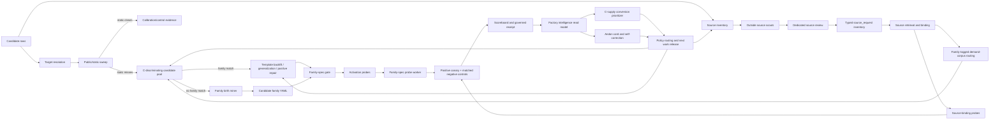
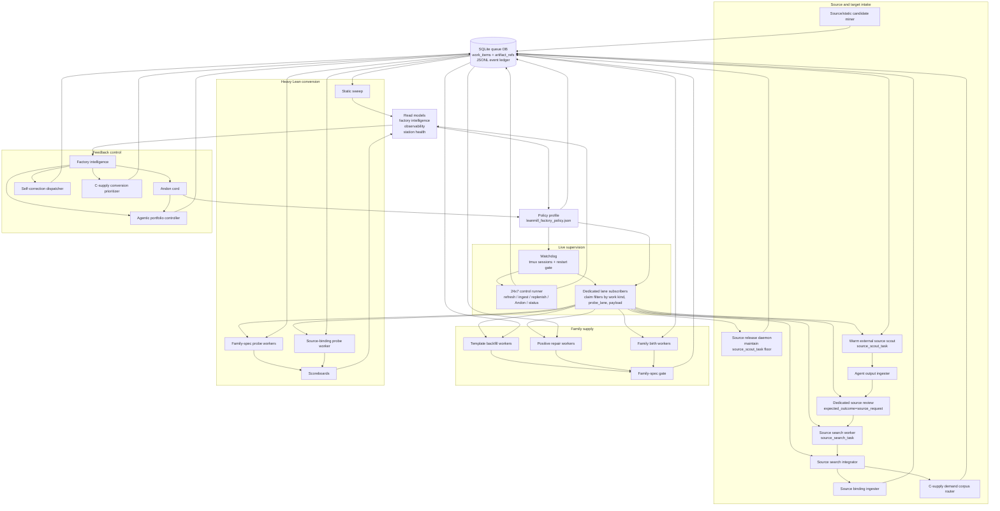

# LeanMill Architecture

> **Up:** [Documentation map](../README.md)
>
> **Current seam/spec:** `research_areas/seams/engine/lean/GP-225_leanmill_vnext_station_factory_seam.md` and `research_areas/specs/active/engine/lean/GP-225_leanmill_vnext_station_factory_spec.md`.
>
> **Canonical process-flow reference:** this document. The GP-225 spec owns the
> durable invariants and credit boundaries; this architecture document owns the
> current end-to-end lane topology, handoffs, and operating picture.

LeanMill is a station factory for Lean proof work. Its output unit is a typed learning-unit exit, not agent activity. Proof value is credited only when the execution artifact passes governance and matched controls. Everything else is inventory, routing signal, repair work, or retirement evidence.

## INVARIANT — ONE governance kernel, shared across all solving modes (2026-06-04)

**Everything is the factory.** There is exactly ONE governance kernel, and EVERY solving mode —
cascade, governed-DAG, ad-hoc (`solve_adhoc`), proof-repair, family/compounding, batch C-row — ratifies
through it. The kernel is the anti-laundering organ stack (`gates/lean_proof_gate.run_anti_laundering_kernel`
— renamed 2026-06-06 from the cryptic `_run_v33_anti_laundering`; back-compat alias kept; run by `proof_audit`)
+ the axiom-allowlist gate (the leaf's `#print axioms`) + matched-negative-control.
It is EXTENSIBLE BY ORGAN: a new governance check (e.g. `statement_integrity`, the def-alteration organ
added 2026-06-04) is registered ONCE in the kernel and every mode inherits it — it is NEVER bolted onto a
single mode. Rules: (1) no per-mode governance re-implementation (that is the frankenstein this invariant
forbids — it bred the duplicated-axiom-gate + ad-hoc-only-integrity bugs); (2) gates fail-OPEN on
tooling-inconclusive, fail-CLOSED only on a CONFIRMED violation; (3) solver `closed` is an UNRATIFIED
PROPOSAL — only the kernel verdict ratifies. `statement_integrity` is now a KERNEL ORGAN (in
`run_anti_laundering_kernel`, activated by passing `original_source`), so every mode inherits def-alteration
protection. **Re-confirmed 2026-06-06:** a `proof_cage` experiment (a Cage of a REDUCED gate set —
kernel/MNC/statement_integrity/axiom — beside the kernel) was exactly the per-mode re-implementation this
invariant forbids (a strict subset of the kernel's 6 organs) and was RETIRED; the fix is to REUSE
`run_anti_laundering_kernel` at the solver-lane gate (`_validate_against_contract`), which currently
ratifies on kernel-compile∧MNC and DEFERS the organ stack — `ZTARE_KERNEL_OBSERVE=1` logs what the kernel
would flag there (observe-first), ahead of folding its verdict into solve-time `credit_ready`. Backlog of mode-local governance bugs FIXED 2026-06-04 (cold-review-found): MNC now functional
(builds `theorem X <goal> := by body` from the row's goal — was a structural no-op) + FAIL-OPEN on
tooling/unknown-identifier (was false-rejecting on lake-absent); eligibility ignores governance-REJECTED
closures (`ratified=0` no longer poisons the queue); ratification stamps ONLY closing (`compile_ok=1`)
attempts (no fake per-move wins); source-slice is exact-prefix (no `LIKE` wildcard swallow);
governance-not-run flags `integrity_unverified`. RESIDUAL (deeper migration, not bugs): `est_p_close` is now recorded on EVERY mode — `_record_attempt`
auto-derives it from the provider via `PROVIDER_TO_MOVE → _move_prior` when a caller didn't pass it
(2026-06-04, kernel-fashion one-place fix). STILL OPEN: the cascade/DAG-typed closure path
(`_validate_and_maybe_close`) runs the MNC + kernel-compile receipt but NOT the v33+statement_integrity
organ stack inline — those reach batch closures only via the downstream `proof_audit` worker, and the
ad-hoc path inline. The clean unification = one `govern_closure()` the cascade/DAG path also calls
(reconstruct probe = source-with-sorry→proof_text, original = row source); deferred as a careful refactor,
not rushed (rushing shared governance is what bred the frankenstein).

**Context-semantic-hijack organs + the cross-substrate kernel-hardener (2026-06-06).** The FALSIFY
false-statement control (a calibration probe over known-FALSE targets) surfaced a real laundering vector:
the leaf ADDS a `local instance : HAdd α Nat α where hAdd a _ := a` so `n+1` elaborates to `n` — a
VERBATIM statement (`∀ n, n=n+1`) is semantically hijacked, `statement_integrity` passed (signature text
unchanged; the instance is an "added helper decl"), and `#print axioms` was clean. RCA: syntactic
preservation ≠ semantic preservation — meaning depends on the ELABORATION CONTEXT. Two new organs close
the class: (1) `statement_integrity` now flags an ADDED instance providing a CORE operation class (fast
lexical leg); (2) `canonical_reelaboration.check` (wired into `run_anti_laundering_kernel`,
`ZTARE_CANONICAL_REELAB`, default-ON) is the airtight backstop — it STRIPS added instance/notation/macro/
set_option context (KEEPS opens + lemmas) and recompiles; if the target no longer closes, the proof
DEPENDED on the manipulation (`context_hijack_confirmed`). It recompiles ONLY when there is hijack-context
to strip, so cost is paid only on suspect probes. — This is a gaming finding, so it is cataloged: the
gaming catalog is now the cross-substrate registry `analytics/public/queries/gaming_vector_catalog.jsonl`,
and the GP-086 cage gaming-pattern hardener is generalized into a shared `common/kernel_hardener.py`
contract (`KernelHardener` + `GamingVector` + `to_cage_gate`) instantiated by BOTH autoresearch
(`validator/autoresearch_hardener`, wraps `sandbox_gaming_extractor` + Cage gates) and leanmill
(`leanmill/solver/leanmill_hardener`, organs as `POST_JUDGE`/`proof_target` `cage.Gate`s) — neural mining
allowed (GP-248 proposer column), gates always deterministic.

## INVARIANT — ONE governed solve entry (`solve_adhoc`); every lane is a target-PRODUCER through it (2026-06-05)

There is exactly ONE governed solve entry — `solver_core.solve_adhoc` (and its `solve_adhoc_governed`
retry wrapper) — which runs the move space + the ONE governance kernel. EVERY way of producing work is a
target-PRODUCER that routes through it via the SAME interface `(target_name, source, goal, *, substrate,
mode, timeout_s)`; none re-implements solving or governance:
- **ad-hoc** — the CLI `adhoc` → `solve_adhoc_governed`.
- **autoformalize** — `autoformalize_and_solve` → `default_solve` → `solve_adhoc` (after the faithfulness firewall admits the statement).
- **residual-C / work_queue** — the C-row lane → `solve`; governance-rejection retry is "PARITY with the C path".
- **proof-repair** — `proof_repair.repair` → `solve_adhoc` (after confirming the break).
- **family / compounding** — `solve_family` → `solve_adhoc` per sibling.
- **iso-decompose** (deanchor→isomorphism→audit) — `isomorphism_decompose.solve_decomposition` → `solve_adhoc` per audited lemma. It is a PRODUCER, not a lane: it emits audited sub-goals; the kernel solves+ratifies them. (Frankenstein risk caught + fixed 2026-06-05: it previously dead-ended at the audited DAG without routing through `solve_adhoc`.)

SHARED PRIMITIVES the producers/lanes invoke (never fork): `agentic_leaf.default_dispatch` (the leaf),
`conjecture.{conjecture_advances, decomposition_dag_audit}` (decomposition soundness), `proof_cache`
(verified-win memo), `no_good_store` (confirmed-refutation memo), `statement_integrity` (kernel organ),
`obstruction_to_conjecture` (refutation→targeted seed), `RefineHandover` (the ONE produce→verify→
feedback→refine loop), `failure_class.classify_failure` (the apparatus-vs-math tagger — convergent
eigenquestion gemini+codex 2026-06-05; reuses `proof_state` error-class + `residual_to_lever` signatures;
tags EVERY non-closure APPARATUS [gating/budget/toolchain] vs MATH [genuine kernel dead-end] so an
apparatus limit is never laundered as math-hard; wired into `solve_adhoc`'s return). RULE: a new capability is a PRODUCER that routes through `solve_adhoc` + composes
these shared primitives — it does NOT add a parallel solve path or parallel governance. The audit gates
reduction-SOUNDNESS; `solve_adhoc`'s kernel gates lemma-TRUTH — so a false sub-lemma fails honestly
(no false closure), which is what makes producer-generated decompositions non-iatrogenic.

## SETTLED — the leaf solver IS the agents; leanmill is the environment (do not re-litigate)

The leaf solver **is** the subscription agents (codex/claude) — "swappable talent." **leanmill is the
ENVIRONMENT** (governed DAG + conjecture + cache + compounding + the ONE governance kernel) that
multiplies that leaf — it is itself a meta-solver. This is the **nurture** thesis, and it is the
world-class claim. A stronger leaf (an RL/trained prover, DeepSeek-Prover, LeanCopilot) is an OPTIONAL,
already-supported **provider-router registration** (`leanmill_provider_registry.py` slot) — NOT a missing
capability and NOT a requirement. **Do NOT re-raise "we need a trained/external prover to be world-class"**
— that chases AlphaProof's *nature* path and is off-thesis; the leaf is the agents, and the open question
is whether the ENVIRONMENT multiplies them (the SCALE / coherent-theory-build-up test), not leaf compute.

## INVARIANT — the solver BUILDS new proofs; it is NOT a Mathlib lookup (do not re-forget)

leanmill CONSTRUCTS proofs from first principles. **A missing Mathlib lemma is a SUB-GOAL to prove, never
a wall and never a reason to retarget to the "supported" side.** The whole point — the open-problem regime
that is leanmill's defensible niche — is proving things for which NO pre-existing proof exists to compose.
So when a target needs machinery Mathlib lacks (e.g. P1/Denef–Lipshitz needs algebraic-power-series theory
Mathlib does not have), the move is to **DECOMPOSE** the missing piece into intermediate lemmas
(`MOVE_CONJECTURE` / the variant-curriculum library) and recurse until the leaves rest on the citable
foundation — the solver constructs the interior. A Mathlib survey therefore maps the **BUILD-FRONTIER**
(citable foundation vs the to-be-constructed decomposition tree), NOT a no-go zone; sequence the most
foundational sub-lemma first and build up. The matched-negative-control organ exists precisely to reject the
degenerate case where a "proof" IS just a Mathlib lookup — i.e. lookups are the thing governance guards
AGAINST, not the solver's mode of operation. Recurring failure to avoid: surveying Mathlib, finding a gap,
and concluding "avoid that direction" — that silently demotes the meta-solver to a library composer and
abandons the open-problem regime (operator correction, 2026-06-05).

**Competitive landscape — LEAP (Google Cloud AI Research / DeepMind, arXiv:2606.03303, 2026-06-03).** An agentic Lean prover on **Gemini-3.1-pro, no fine-tuning**: informal blueprint → Lean → iterative compiler-feedback refinement, over an AND-OR DAG with shared-lemma memoization + DFS backtracking + an LLM decomposition-reviewer. Results: Putnam-2025 12/12, Lean-IMO-Bench 56.7% advanced, beats Aristotle, one-shot <10%→70%. **This VALIDATES the nurture thesis at Google scale** (general leaf + agentic environment, no trained prover → SOTA) — and convergently rebuilds our own pieces (their AND-OR DAG = `governed_dag_search`; their memoization = `proof_cache`; their compiler-refinement = our gap-refine / `autoformalize_refine`; their blueprint-decomposition = `MOVE_CONJECTURE`). **What LEAP has that we don't:** real benchmarks (Lean-IMO-Bench) + a frontier-leaf result. **What we have that LEAP does NOT:** the GOVERNANCE KERNEL — anti-laundering, matched-negative-control (is the proof just a Mathlib lookup?), nondegenerate-instance probe (is the statement vacuously true?), faithfulness firewall on autoformalized statements. LEAP trusts "it compiled," which is fine for KNOWN-TRUE competition statements and **useless for OPEN problems** (untrusted statement; "compiles" can be a vacuous/laundered shell). Our defensible niche is exactly the untrusted-statement / open-problem regime. **Rescue/adopt (all published):** (1) adopt Lean-IMO-Bench / Putnam-2025 as the DISCRIMINATING target tier (unblocks the cascade-vs-DAG A/B — SVD was too easy); (2) LEAP's blueprint-decomposition + memoization lift (73→83%) is direct evidence to WIRE THE DEAD `MOVE_CONJECTURE` production path over the spraying moves; (3) leaf = frontier model + governed search, NOT self-training (LEAP needs no fine-tuning).

## Comparable Systems & Positioning

leanmill is a *governed proof-search environment*: a deterministic governance kernel plus a
formalize → solve → govern → self-learn pipeline wrapping swappable frontier-model agent leaves. It
sits alongside, but is architecturally distinct from, recent automated-theorem-proving (ATP) systems
for Lean. Stated factually, with published results:

| System | Approach | Reported results |
|---|---|---|
| LEAP (Google, 2026) | Agentic, general LLM (Gemini), no fine-tuning; informal blueprint → Lean → compiler-feedback refinement over an AND-OR DAG with shared-lemma memoization | Putnam-2025 12/12; Lean-IMO-Bench 56.7% (advanced set) |
| AlphaProof (DeepMind, 2024) | RL-trained prover + large search (the "nature" path) | IMO-2024 silver-medal level |
| DeepSeek-Prover, LeanCopilot | Fine-tuned / trained Lean provers | pluggable as a leanmill provider-router slot |

**Convergence (corroborating, not differentiating).** Several leanmill mechanisms are independently
arrived at by these systems: the obligation DAG (`governed_dag_search`), lemma memoization
(`proof_cache`), iterative compiler-feedback refinement (`gap-refine`, `autoformalize_refine`), and
backward decomposition (`MOVE_CONJECTURE`).

**What is distinctive — the governance kernel and the regime it targets**, rather than leaderboard
rank on competition sets:
- Closure verification beyond "it compiled": a matched-negative-control (the proof must need the
  source prelude, not be a Mathlib lookup), a non-degenerate-instance probe (the statement is not
  vacuously true), a statement-integrity check (no altered dependency), and a kernel axiom-allowlist gate.
- A faithfulness firewall on autoformalized statements (compile + non-trivial + round-trip
  cross-family judge + structural fingerprint) that gates the solver, so an unfaithful or vacuous
  statement is rejected before any proof is attempted.
- Self-learning loops scored on the exogenous kernel/governance verdict rather than model
  self-narration (move-prior calibration, gap-refine, autoformalize-refine).

These matter most in the **open-problem / untrusted-statement** regime, where a compiling proof is
necessary but not sufficient — distinct from the known-true competition statements that leaderboard
provers target.

**Honest scope.** leanmill does not currently claim leaderboard-level results on competition
benchmarks (Putnam / IMO) — it has no comparable measured benchmark result yet, and adopting a shared
discriminating benchmark is tracked work. Its claim is governed *closure-or-honest-gap* throughput in
the untrusted-statement regime, with the frontier-agent leaf swappable as external provers improve.

## Core Boundary

The deterministic control plane owns queueing, leases, routing, stale-work checks, and read models. Agents and LLMs can propose YAML, source requests, templates, or repairs, but they cannot ratify proof value. Lean execution plus governance receipts decide whether a row becomes credit-ready.

Canonical kernel modules live under `src/ztare/leanmill/`. Operator scripts live under `scripts/public/control/`; legacy shim files there re-export canonical kernel APIs. New durable logic should go in the kernel when it is substrate-generic, and in operator scripts only when it is LeanMill-specific orchestration.

## MECE Contract Spine

The architecture target is not a larger set of workers. It is a smaller set of
non-overlapping contracts that every worker must obey. A station may specialize
the work it performs, but it may not invent a local meaning of "done",
"blocked", "credit-ready", "source-ready", or "handoff".

| Contract | Canonical owner | What it owns | What it must not own |
|---|---|---|---|
| Work bus contract | `src/ztare/leanmill/work_queue.py` | durable `work_items`, leases, terminal state, worker heartbeats, artifact role refs, and queue-boundary defaults | proof credit, benchmark credit, or station-specific scoring |
| Agentic handoff contract | `src/ztare/leanmill/contracts/handoff.py` plus policy `operations.agentic_handoff_contract_policy` | required terminal handoff receipts for accepted agentic generation; typed blocked/skipped receipts when no deterministic handoff exists | probe success, C credit, or benchmark lift |
| Source contract | source scout/review/search/integration contracts and receipts | typed source requests, retrieval evidence, allowed target bindings, and visible holds | treating an existing Mathlib theorem name as an unsolved target |
| Family contract | family-spec YAML, family-spec gate, activation selections, and target-aware template filters | positive/negative template pairs, target-safety, family birth, template backfill, and activation inventory | claiming proof value before downstream Lean/governance |
| Probe contract | probe packets, scoreboards, static filters, and matched controls | Lean execution evidence, positive canary results, negative-control outcomes, exact-gap/falsifier residuals | source or YAML generation credit |
| Governance contract | governance receipts and governed scoreboard summaries | final proof-value authority for rows and controls | queue routing or agent-generation allocation |
| Strict C credit contract | `leanmill_c_supply_credit.py` and factory-intelligence C read models | row-level `credit_ready` classification, dedupe, strict static no-signal, controls, family/source breadth diagnostics | relaxing the credit boundary to satisfy row-count goals |
| Factory intelligence contract | `leanmill_factory_intelligence.py` | deterministic single pane of glass: bottlenecks, recommendations, yield decomposition, and contract leakage | executing work or mutating scientific credit |
| Policy contract | `leanmill_factory_policy.json` | live priorities, worker counts, budgets, timeouts, model choices, breadth floors, and self-correction action allowlists | one-off station constants for live operating choices |

The table is intentionally MECE. If a new fact does not fit one row, add or
refine a contract before adding station-local state. If two stations need the
same classification, it belongs in a shared contract module or policy, not in
two scripts.

### Queue-Boundary Fail-Closed Rule

The queue DB is the distributed-system membrane. When a worker terminalizes an
accepted agentic family-spec patch, `work_queue.update_status` applies the
agentic handoff contract before storing the row. If the station did not write
the policy-required activation receipt, the queue stamps a visible
`skipped` handoff receipt with reason
`terminal_agentic_patch_missing_downstream_handoff_at_queue_boundary`. This
does not enqueue work or create credit. It prevents a completed agent transcript
from becoming hidden terminal state and gives factory intelligence a typed fact
to route against.

Richer station receipts still win when present. The queue-boundary receipt is
only the fail-closed default.

### Anti-Duplication Rule

Implementation should move toward these rules:

- Shared classifications live in `src/ztare/leanmill/contracts/` or another
  kernel module.
- Live knobs live in `leanmill_factory_policy.json`.
- Scripts may adapt CLI/path surfaces, launch tools, and write station
  receipts, but they should not re-derive credit, handoff, source, or priority
  semantics.
- Any new worker lane needs a typed input contract, typed terminal receipt,
  deterministic verifier or explicit blocked receipt, read-model projection,
  and policy-owned budget before it becomes part of the live factory.
- More workers are allowed only when the relevant contract read model shows the
  lane is producing deterministic downstream inventory and not merely
  increasing queued terminal artifacts.

## Main Lanes

| Lane                       | Purpose                                                                                                                           | Typical work kind                                                        | Credit boundary                                                                                                                                                 |
| -------------------------- | --------------------------------------------------------------------------------------------------------------------------------- | ------------------------------------------------------------------------ | --------------------------------------------------------------------------------------------------------------------------------------------------------------- |
| Static/tool sweep          | Determine whether public tools already solve a row                                                                                | checkpoint/static artifacts                                              | Calibration only; C is not tested if static closes first                                                                                                        |
| Family-spec probe          | Execute existing repair-family positive/negative canaries                                                                         | `repair_canary_probe` with `probe_lane=family_spec`                      | Credit-ready only with ratified positive proof value, matched negative-control failure, zero unexpected negative-control passes, zero invalid negative failures |
| Family-spec generalize     | Add sibling or heldout positive/negative pairs to an existing family                                                              | `agent_repair_task` with `family_spec_patch_mode=generalize_family_spec` | No proof credit; creates future probe supply                                                                                                                    |
| Family birth               | Create a new family YAML from unmatched static-failure clusters                                                                   | `agent_repair_task` with `family_spec_patch_mode=family_birth_candidate` | No proof credit; accepted YAML auto-activates family-spec probes                                                                                                |
| Positive repair/backfill   | Fix a known positive template that failed, preserving controls                                                                    | `family_spec_positive_repair` or `c_supply_template_backfill`            | No proof credit until the activation probe passes governance                                                                                                    |
| Quarantine repair          | Remove or repair unsafe YAML patterns such as holes or bad controls                                                               | `repair_quarantine`                                                      | Hygiene only; may unblock future probes                                                                                                                         |
| Source scout/review/search | Keep upstream outside-source breadth active, review source-scout transcripts, retrieve/bind concrete source candidates, and route family-tagged allowed target rows into demand corpora | `source_scout_task`, `llm_proposal_validate`, `source_search_task`, integration receipts | Inventory and routing only; integration receipts are not C credit and cannot treat existing Mathlib theorem names as unsolved facts                              |
| Source-binding probe       | Execute guarded canary probes produced by source binding                                                                          | `repair_canary_probe` with `probe_lane=source_binding`                   | No proof credit from the worker; only governed probe receipts may become value evidence                                                                          |
| Source materialization     | Convert stable Mathlib metadata or inline theorem goals into target-resolved Lean snapshots                                       | source snapshot receipts                                                 | Infrastructure only; no static, C, benchmark, or proof credit                                                                                                   |
| C-supply growth controller | Grow strict Path C rows through source mining, governed-static confirmation, template backfill, static sweep, and governed probes | `leanmill_c_supply_growth_controller.py`                                 | Publishes running and terminal receipts; routing only, strict C credit still comes from downstream receipts                                                     |
| C-supply conversion priority | Reprioritize queued repair/probe/source work from the C read model toward uncredited and underrepresented families              | `leanmill_c_supply_conversion_prioritizer.py`                            | Queue routing only; does not refresh candidate timestamps or create proof, benchmark, or C credit                                                               |
| Benchmark harness          | Compare declared arms on frozen slices                                                                                            | evaluation harness rows/checkpoints                                      | Benchmark credit is separate from factory credit and policy-classified by completed-row count                                                                   |
| Solver lane (2026-05-28)   | Attack `no_positive_family_template` C-pool rows (static-missed + no family template + executable) that family-spec probes cannot reach. Agentic-first proposal via the provider router (`leanmill_provider_registry.py`: native_hammer / claude_opus / codex_gpt5 / deepseek_v2 / leancopilot) with the mechanical semantic premise shelf attached. | `solver_lane` attempt → `unratified_closure_candidate` exit + matched context-stripped negative control | No proof credit at the lane — solver PROPOSES, governance RATIFIES (leak-tight + matched-neg-control + L3). Worker `leanmill_solver_lane_worker.py`; policy `operations.solver_lane`. **Target-corpus is now a first-class policy decision (`operations.target_corpus`): natural-Mathlib is Munger-empty for C credit (all no-template rows are `existing_mathlib_target_snapshot`); point the solver lane at Mathlib-resistant corpora (ZtareProofs open sorries / Carleson / NS Track B / AlphaProof replication) for credit-eligible runs.** |

## Solver Lane Subsystem

The solver lane (table row above) attacks `no_positive_family_template` C-pool
rows that family-spec probes cannot reach. It is agentic-PROPOSE /
deterministic-RATIFY: the lane never mints credit, governance does. Worker
`scripts/public/control/leanmill/solver_lane_worker.py`; canonical kernel under
`src/ztare/leanmill/solver/`. Its internals were previously only a single table
cell; they are documented here because they are where current proof-orchestration
work lives.

### Provider router (move generators)

A row's goal is attacked by a layered set of move generators, cheapest first:

| Layer | Generator | Cost | Module |
|---|---|---|---|
| 0 | Slice load + attempts-DB filter (skip already-closed, cooldown after `MAX_FAILED_ATTEMPTS_PER_ROW`) | free | `solver_lane_worker` |
| 2 | Deterministic tactic cascade (`aesop, simp_all, tauto, omega, decide, rfl, polyrith, positivity, norm_num, linarith, nlinarith, field_simp;ring, ring`) — first to compile clean wins | seconds | `solver/deterministic.py` (`native_hammer`) |
| 3-4 | LLM provers via the registry (`claude_opus`, `codex_gpt5`, `deepseek_v2`, `leancopilot`) — whole-proof generate, then kernel-compile | minutes / metered | `solver/llm_provers.py`, `leanmill_provider_registry.py` |

Whole-proof granularity is deliberate: providers emit a complete `:= by …` body
compiled as a unit, NOT a tactic-by-tactic proof-state search. The governed DAG
(`solver/governed_dag_search.py`) shares these same generators but, as of
2026-05-31, **consumes the partial-progress gradient** (below): a non-closing move
that left one goal raises that node's `best_progress`, which boosts its best-first
frontier score and keeps it from deferring on the static prior alone. The
production move-runner fills `MoveResult.progress/goals_remaining/error_class`
from each compile tail via `proof_state_signal` (zero extra compile). This is what
lets the DAG climb instead of treating every non-closure as identical (the
measured DAG≈cascade failure mode); it still earns adoption only by closing ≥ the
cascade on the same rows.

### Premise-shelf retrieval

`_build_solver_context()` enriches the bare goal with a semantic premise shelf
(`src/ztare/leanmill/semantic_premise_shelf.py`) before any prover runs. Three
retrieval routes, all cosine-similarity over gemini-embedding vectors, all using
a **corpus-driven inner join** (rows iterate the *corpus* JSON; embeddings join
by `id`; an entry absent from the corpus can never surface, regardless of the
embeddings file):

- `mathlib_semantic_neighbours` — Mathlib decl index.
- `apn_semantic_neighbours` (`src/ztare/research_director/apn_semantic.py`) — the
  AlphaProof-Nexus atlas (`analytics/public/queries/lean/apn_atlas_corpus.json` +
  `apn_atlas_embeddings.json`). This is the **live** APN route.
- domain-atlas route — additional atlases registered in policy
  `operations.semantic_premise_shelf.domain_atlases` (NS etc.); empty is a clean
  no-op. The shelf is gated by `LEANMILL_DISABLE_SEMANTIC_PREMISE_SHELF`.

#### Premise-shelf leakage (a first-class benchmark hazard)

A retrieval shelf built from the same repository as the benchmark TARGETS leaks:
the target's own published proof-helper DAG sits in the shelf, so a retrieving
solver is handed the proof skeleton and a closure measures retrieval, not
capability. This is real, not hypothetical — the curated hard corpus
(`projects/gp_spectral_apn_seed_2026_05_28/curated_hard_provable/`) is
`leakage_clean = 0/8` against the shipped apn_atlas shelf because that shelf was
built from `google-deepmind/alphaproof-nexus-results`, the same repo the 8
targets come from (32-156 helper decls per target present in the shelf).

Quarantine discipline is GENERAL (it applies to any atlas — mathlib, apn, or a
policy-registered domain atlas — whenever the shelf shares a source with the
benchmark targets) and **module-based**: the kernel/shelf owns the general
capability, and each project plugs in its own quarantine inputs. The general
mechanism is: because retrieval is a corpus-driven join, dropping the leaked
entries from the *corpus* fully quarantines with NO embedding rebuild and WITHOUT
mutating the shipped general-purpose shelf — then point the run at the quarantined
corpus. Concretely:

- The project supplies its own `leakage_manifest.json` + `build_quarantined_shelf.py`
  (e.g. the APN benchmark's live in
  `projects/gp_spectral_apn_seed_2026_05_28/curated_hard_provable/`). The builder
  drops the leaked source files' entries (the whole cross-duplicated family, not
  one file) and **verifies 0 target proof-helper decls survive** — fails loud
  otherwise. This is plug-in data, not core logic.
- Route the run at the quarantined corpus. The general path is a policy
  `domain_atlases` entry whose `corpus_path` points at the quarantined file; for
  the one built-in (non-policy) APN route, the bridge is the env override
  `ZTARE_LEANMILL_APN_CORPUS=…` (resolved at import in `apn_semantic.py`). Either
  way the substrate-specific paths are injected, never hardcoded in the shared
  loader.

### Proof-state telemetry (partial-progress gradient)

The attempts DB (`solver_lane_attempts.db`) historically recorded only a binary
`compile_ok` per attempt. A binary outcome gives a best-first / DAG search
nothing to climb — every non-closure is identical — which is the measured reason
`orchestration_alpha` is 0 on real attempts (no gradient, only a cost edge).
`src/ztare/leanmill/solver/proof_state.py` extracts, at zero extra compile cost,
from the Lean output `_verify_compile` already captures:

- `error_class` — `clean` / `unsolved_goals` / `tactic_failed` /
  `unknown_identifier` / `type_mismatch` / `timeout` / `other_error` (a router
  signal: `unknown_identifier` ⇒ shelf missing a name; `unsolved_goals` ⇒
  decompose; `tactic_failed` ⇒ swap closer).
- `goals_remaining` — open-goal count (0 on a clean close).
- `progress` — coarse 0..1 score, monotone in goals remaining
  (closed 1.0 > 1-goal-left 0.5 > broken-name 0.05; live-verified).

These are additive columns on `attempts` (migrated in place) and are recorded by
`_record_attempt`, derived from compile output with zero call-site change. This
is the GP-187 "missing middle layer": the gradient a governed DAG must order
candidates by before it can beat the cascade.

**Per-move yield shape (2026-06-06).** The DB keyed everything on `provider`, which conflates move identity
(`claude_opus`/`codex_gpt5` = cold_shot, `deepseek_v2` = frontier), so per-MOVE yield was not cleanly
groupable and the calibration map dropped the strategist rows. Three additive columns close this:
`move` (the CANONICAL move — **backfilled** for all historical rows from `provider`, which is deterministic;
this even re-unifies cold_shot that was split across provider names), `wallclock_s` (per-move wall time →
yield-per-second, the throughput axis; NULL for historical rows, populates forward), and `run_tag`
(`ZTARE_SOLVER_RUN_TAG`, slices A/B arms vs production). NOTE on semantics: only CLOSURE moves
(native/warm/cold/frontier/**generalize**/**tactic_step**) belong in `PROVIDER_TO_MOVE` (their success =
ratified `compile_ok`); the non-closure moves succeed differently — conjecture *advances*, specialize
*rungs*, falsify *falsifies* — so their `outcome` is their yield, NOT `compile_ok`, and they keep their
stub prior (calibrating their est_p_**close** from closure data would be wrong). generalize/tactic_step were
MISSING from the map (a latent bug surfaced when the unstarving fix below let them run): now added.

### Orchestration measurement (matrix vs the production lane)

The production lane is a cost-optimal **fallback cascade**: the warm agent runs
first and returns on closure, and the cold fan-out breaks on the first provider
that closes. That is correct for production but makes the ensemble's value
unobservable — if warm-claude closes a row, no other provider is asked, so
`orchestration_alpha` (rows the ensemble closes that the best single provider
misses) reads 0 as a measurement artifact, NOT as evidence orchestration is
worthless. To measure it, `orchestration_matrix.py` runs EVERY provider on EVERY
row INDEPENDENTLY (no short-circuit), reusing the worker's exact verify path so
it is apples-to-apples; `orchestration_alpha.py` then computes ensemble-vs-best.
Two disciplines make the result trustworthy: a backend-absent provider is
recorded `unavailable` (never a silent drop that could fake alpha=0), and a
closure is credit-grade only when it is kernel-clean **AND** passes the
matched-negative-control (`--no-mnc` downgrades to a faster, non-credit-grade
pilot). Leak-tight runs set `ZTARE_LEANMILL_APN_CORPUS` to the quarantined shelf.

### General proof-search engine (GP-246 v3 — conjecture · verify · cache)

The fair experiments established that one-shot whole-proof generation lands ONE goal
short on leak-clean research-grade rows (0/7), and that the closure is reachable by
DECOMPOSITION (on P2, the architecture banked a leaf one-shot never closed). The
general engine generalizes that into one loop — **conjecture → verify → cache** — built
on `governed_dag_search.py` (the proposes/ratifies DAG) + `proof_cache.py`. It rests on
three legs, which are ZTARE's substrate-agnostic core (Lean is one plug-in):

- **INVERT** (`MOVE_CONJECTURE`): don't forward-prove the whole goal — work backward,
  propose the intermediate lemma that would discharge it (general `have`/`suffices`,
  any goal shape; the ∧-split is a degenerate case), recurse. The runner may INVENT
  new machinery — a stronger generalization that's easier to prove, an auxiliary
  construction, a reformulation, a new invariant. The engine is **indifferent to whether
  the invented math is conventional**: the kernel + matched-negative-control are the
  sole arbiters — a conjecture earns its place by being verified and advancing the goal,
  not by looking familiar. (Also INVERT: truth-by-rejection — the no-false-closure
  oracle below — and the falsifier branch that tries to disprove a target before spend.)
- **COMPRESS** (`proof_cache.py` + the semantic atlas): a verified lemma is a compressed,
  reusable node (one citable fact in place of a search subtree). The cache is a growing,
  deduplicated, name-agnostic library of verified lemmas; premise retrieval (the
  primitive semantic atlas) finds the minimal closing set; the proof-state gradient
  compresses "how close" into a scalar the best-first search climbs.
- **SCALE** (cache as shared memory): a lemma proved once is free wherever the SAME lemma
  recurs — within a search, and across rows/substrates *that share sub-lemmas*.
  Decomposition is divide-and-conquer over independent subgoals. **Honest caveat
  (2026-06-01, measured):** cross-row compounding is CORPUS-DEPENDENT — on the APN
  hilbert set the 7 rows have *disjoint* leaf conjuncts (0 shared), so the cache gave
  zero cross-row reuse there. SCALE pays on a coherent theory build-up (one theorem's
  many shared lemmas), not on a grab-bag of independent targets. Within-search reuse
  (COMPRESS) holds regardless.

**Closure persistence — the system of record (so a verdict is never unauditable).** Durable, git-tracked
stores under `analytics/public/queries/`, each owning one fact:
- `solver_lane_proof_cache.jsonl` (`proof_cache.py`) — the PROOF TEXT, statement-keyed (the COMPRESS store).
- `solver_lane_no_good_store.jsonl` (`no_good_store.py`) — the REFUTATION dual: CONFIRMED governance
  rejections, statement-keyed, that `prompt_block` injects so the leaf never re-explores a refuted shape.
  Fed by the agentic-leaf statement-integrity path AND (2026-06-06) by `solve_adhoc`'s capability-entry
  kernel rejection (vacuity / leakage / def-alteration) — closing the CROSS-RUN governance loop (the
  same-run governed-retry covered only within a run; the witness was otherwise discarded to the certificate).
- `solver_lane_outcome_links.jsonl` (`outcome_link.py`, 2026-06-06) — the SELF-TUNING dual: binds a
  calibration RETUNE to a measured `closure_at_budget` outcome with `decisions_changed` (Holmström)
  attribution + a `verdict_coverage` read model. A retune that changed 0 move-selection decisions is
  `inconclusive` (NON-informative ⇒ never credited), so the self-tuning is scored against the OBJECTIVE,
  not the forecast-Brier proxy. Borrowed from cognitive-firm `orchestration/outcome_links.py`.
- `adhoc_closure_certificates.jsonl` — per ad-hoc closure, the AUDIT context: the governance-kernel verdict,
  the matched negative control, and the EXACT recompilable probe (re-running `#print axioms` on that probe
  reproduces the axiom audit with zero archaeology). Written for clean closures AND governance-rejections.
- `leanmill_solver_lane_results.json` + typed-exits — the batch run's per-row outcomes/proofs.

The leaf's working probes (`RobustProbe_*.lean` in the substrate, `/tmp` tempdir compiles) are EPHEMERAL —
overwritten by the next run; they are NEVER the system of record. Any ad-hoc harness MUST persist
`res["proof_text"]` + `res["governance"]` + `res["closure_certificate"]` from `solve_adhoc`'s return, not
just the `closed`/`outcome` verdict — the gap that briefly left the 2026-06-04 spectral closures recoverable
only from `/tmp` scratch (the proof itself was safe in the cache the whole time; the audit linkage was not).

The leaf solver (the LLM / future RL prover) is **swappable talent**; this engine is the
*environment* that multiplies it (the ZTARE nurture thesis). Status: the loop +
conjecture move + global cache are kernel-built and unit-tested (mock runner, no
Lean/LLM); the remaining gap to AlphaProof-Nexus on the hard leaves is **leaf-solver
strength** (their Gemini 3.1 Pro + RL prover + massive per-leaf search), orthogonal to
the engine. The production move-runner (LLM conjecture-generation + Lean verify) is the
wiring that turns this from kernel-tested to closing real rows.

**MOVE_CONJECTURE — WIRED + SOUND + UN-INERTED (2026-06-05).** Code: `src/ztare/leanmill/solver/conjecture.py` (extracted, #42) + the worker `move_runner`. Pipeline: `conjecture_generate` (invent lemma L + prove G-given-L) → `conjecture_advances` (kernel L⇒G sorry-discipline typecheck via the v33 `_compile_probe`, sorry-OK; comment-stripped cite-check + a DETERMINISTIC LOAD-BEARING probe (replace L's type with `True` → the goal-proof must BREAK, else L was cited-but-unused → reject; exogenous, stronger than the advisory reviewer); **never closes G ⇒ no false closure** — adversarially reviewed, w1162vqnh) → spawn L as `new_sub_goal_text` → **INERTNESS FIX** (`ZTARE_CONJECTURE_DECOMPOSE=1`, default off = byte-parity): spawned sub_goal nodes prove `node.goal_text`(=L), not re-prove G (the review found every generator re-proved G ⇒ the move was a no-op). **Borrow B reviewer** (`decomposition_review`, `ZTARE_CONJECTURE_REVIEW=1`, default off, ADVISORY + fail-OPEN): per-edge "is L strictly easier / non-circular?" productivity filter (LEAP §5.3). Three flags are default-off (parity); **the lift validation is the PutnamBench A/B (#27)** — gated on the v4.27 Mathlib build + the substrate-routing fix (`solve()` hardcodes `DEFAULT_LEAN_ROOT_FOR_VERIFY` at ~22 sites; must thread the substrate root so PutnamBench/v4.27 verifies against its own toolchain, not the v4.30 sandbox). A/B flips are gated by the anytime-valid `SequentialABGate` (`src/ztare/leanmill/sequential_ab.py`, #40, MC-calibrated) — no single-run lift claims.

**Strategist + Invert-leg moves (2026-06-06).** Beyond the base `MOVE_ORDER` walk, `STRATEGIST_MOVES` are offered ONLY when a node is STUCK (menu exhausted) and the move's env flag is set — default behaviour is byte-identical. The A=B control arm (`ZTARE_LEANMILL_STRATEGIST_RANDOM`) picks uniformly over the same eligible set, so SELECTION lift is the discriminator (signal > random) for any of them.
- **MOVE_SPECIALIZE / MOVE_GENERALIZE** (`ZTARE_LEANMILL_{SPECIALIZE,GENERALIZE}`, default-OFF, lift A/B in flight): a verified weaker-case RUNG (never closes G) / a closure via an internal strengthening.
- **MOVE_FALSIFY — the Invert leg (`ZTARE_LEANMILL_FALSIFY`, default-OFF pending box validation).** On the OPEN/untrusted regime the target may be FALSE; this PRODUCES a kernel-checked proof of `¬G` and feeds the existing falsifier sink (`MoveResult.falsifier` → `residual_to_lever`). SOUND by construction: the refuted Prop is OURS (`conjecture._closed_goal_prop` builds `∀ binders, concl` from the goal signature; the leaf supplies ONLY the proof), so "negate a strawman" is impossible. Kernel RATIFIES (sorry-free `¬G` compile via `falsification_is_genuine` + `run_anti_laundering_kernel` organs); never closes G. The Lean producer is the `conjecture.LeanFalsifier` instance of the **shared Popper inversion contract** `common/inversion.py` (`invert→specify→adjudicate`, "no doubt without a test"). `validator/inverter_agent` (autoresearch champion-thesis falsifier) is the OTHER instance (`ThesisInverter`, test-harness-DEFERRED adjudication) — ONE contract, two substrates; `cognitive_gym`'s Invert-leg connector now EXECUTES the Lean producer (was a sink). See GP-248.
- **MOVE_TACTIC_STEP — per-step agentic stepping (`ZTARE_LEANMILL_TACTIC_STEP`, default-OFF).** The leaf emits ONE tactic at a time vs a PERSISTENT REPL proofState (`conjecture.tactic_step_solve` → `formal/lean_persistent.PersistentLean.start_tactic_proof`/`step`), REACTING to the live goal after each step (the non-redundant value over whole-proof moves; bounded by a step budget + per-step retry with the error fed back). MOAT: the decl is OURS (built from the goal + preamble) so a tactic CANNOT redefine a depended-on decl — no file-edit cheat surface. CALIBRATION-FIRST: a dead/mismatched REPL ⇒ INADMISSIBLE (never a fake negative; `substrate_liveness.calibrate`). REPL-`closed` is NOT the verdict — the accepted sequence is reassembled and re-verified through the SAME `_verify_compile` + `_govern` (kernel + MNC + statement_integrity), exactly like generalize.
- **CEGIS no-good (`ZTARE_LEANMILL_NOGOOD`, DEFAULT-ON — disable via `=0`).** `no_good_store` INFORMS the leaf prompt with CONFIRMED prior refutations (never prunes — can only help/no-op) and RECORDS each confirmed `statement_integrity` cheat; `obstruction_to_conjecture` localizes a confirmed cheat into a TARGETED `MOVE_CONJECTURE` seed (refutation→construction dual). Sound (the seeded lemma still routes the kernel), no move-budget cost ⇒ safe default-ON.

**Move budget (don't starve the strategist moves).** `solve()` now passes `move_budget_units` (env `ZTARE_DAG_MOVE_BUDGET`, default **32**); the dag-search default of 20 let the base menu (cost 15) starve the cost-4 strategist moves regardless of wallclock (P1 hit exactly 20). Wallclock (`timeout_s`) + `max_moves` stay the real caps.

**Per-move wallclock caps — the REAL starvation fix (`ZTARE_LEANMILL_PERMOVE_CAPS=1`, default-OFF=parity, 2026-06-06).** Diagnosis (FALSIFY_DIAGNOSIS_2026-06-06 + workflow `w46e35wue`, all_wired confirmed): the move-budget UNITS were not the binding constraint — the per-move *leaf timeouts* were FRACTIONS of the total wallclock (`verify_timeout = timeout_s//2`; warm = `max(180, verify_timeout*2)` = the whole budget; native_hammer's 18-tactic cascade divides `timeout_s/18` then floors each, summing to ~400s). So `native_hammer + one warm call exhaust the wallclock` and the loop breaks (`wallclock_budget_exhausted`) before `move_policy` offers moves 3+ — FALSIFY is offered 6th and was NEVER reached. Production DB confirms: native+warm = **90% of all attempts, warm is the only move that ever closes**; the whole tail (cold/frontier/conjecture/generalize/specialize/falsify/tactic_step) is dormant. Because the caps were fractions of the total, **bumping the wallclock is leaky** (every per-move cap scales with it). FIX: `_cap(move, legacy)` returns the legacy expression byte-identically when off (parity) and an ABSOLUTE per-move cap when on (native 90 / warm 150 / cold_frontier 180 / conjecture 120 / falsify 120 …, env-overridable `ZTARE_LEANMILL_CAP_<MOVE>`), decoupling per-move time from the total so the full menu fits a sized wallclock. Three deadline guards make the caps actually BOUND wall time (the cap value alone was divided away): native's in-cascade deadline, cold/frontier's WHOLE-chain budget, conjecture's three sub-steps. All gated behind the flag (parity off). The `_propagate_closure` parent-by-children close is FAIL-SAFE under `ZTARE_CONJECTURE_DECOMPOSE=1` (withheld pending a composite `G-given-L ∧ L ⟹ G` re-ratification — no false closure via uncomposed lemmas).

**Measuring it — the equal-total-budget A/B (`ZTARE_LEANMILL_MENU=native_warm`).** `move_policy` can restrict the menu to native+warm so the A/B compares `{native+warm only}` vs `{full menu}` at the SAME caps + wallclock — the only difference being tail availability (unconfounded). Harness: `projects/leanmill_experiments/strategist_lift/_movespace_ab.py`. The CONFOUND fix is ATTRIBUTION: a win whose RESOLVING move is a tail move arm A lacks is unconfounded *by construction* (arm A cannot make it at any compute); a win via native/warm is the compute confound, flagged separately. This finally gives per-move YIELD data — currently we cannot evaluate ~90% of the move space we built.

**Nurture + budget hardening — the apparatus was the ceiling, not the leaf (2026-06-07).** A sweep driven by the operator's "you ARE the warm agent (codex-5.5-xhigh/opus) — if you'd see it, the leaf should, unless the apparatus blinds it" calibration. Findings + fixes, all env-reversible:
- **Prompts were iatrogenic (the gaming cause).** `agentic_leaf`'s warm prompt optimized for COMPILATION ("iterate until it compiles, the definitions are already in the file"), forbade only sorry/axioms (NOT the laundering vectors), and offered no honest-gap path — so a stuck leaf gamed (instance-shadowing). REPLACED with `_leaf_prompt` (`ZTARE_LEANMILL_LEGACY_PROMPT=1` reverts): prove-GENUINELY framing (compile = verification, not the goal), an explicit `-- GAP:` honest-gap exit (a localized gap is a VALUED outcome), and a precise prohibition on the laundering vectors (instances/notation/macros/set_option that change meaning, def-alteration, restating). The `isomorphism_decompose` deanchor prompt ALSO un-blindfolded — it forbade "recognize the named theorem / use memory," redundant with the kernel (MNC recompiles without gold context; the audit non-circular leg) and crippling on the open regime; now "USE your knowledge to find + transport the attack; you may not CITE a famous theorem as the proof." Result on P1: the leaf went gaming → a 4/5-sound G-function decomposition.
- **Transportable-attack catalog** (`isomorphism_decompose.TRANSPORTABLE_TECHNIQUES`, `ZTARE_ISO_TECHNIQUES`): a curated, MECHANISM-named, DOMAIN-GENERAL prior (orthogonality/polynomial-method/slice-rank; globally-bounded-ODE⇒algebraic = the G-function/André/p-adic-Frobenius vector; Christol; spectral-gap; duality; …) injected into the deanchor prompt so the leaf transports a NAMED attack instead of guessing — the cross-field LLM query returned EMPTY on P1.
- **Honest-gap consumption + retry feedback**: `agentic_leaf` extracts the `-- GAP:` diagnosis (`_extract_gap` → `LeafResult.gap`) and feeds the direct attempt's gap into the decompose retry (was discarded). `gap-refine` (the RefineHandover near-miss loop that hands the leaf back its own unsolved goals + shelf) flipped **DEFAULT-ON** (`ZTARE_GAP_REFINE=0` reverts) — safe-by-construction (keep-better can't regress).
- **Warm-domination budget bug FIXED**: `_cap("warm")` bounded a single leaf DISPATCH, but the warm move = `solve_robust(codex,claude) × (direct+decompose+retries)` ≈ 8 dispatches with NO whole-move budget, so warm ran ~1250s under a 150s cap and starved the move space. `agentic_leaf` now shares ONE deadline across `solve_leaf`'s phases AND across `solve_robust`'s providers (each dispatch gets the REMAINING budget; stop when spent) — the whole move is bounded to its cap.
- **Per-move caps → FRACTIONS of the wallclock (`_permove_cap` + `_PERMOVE_FRAC`), caps DEFAULT-ON.** The old absolute seconds (warm 150/360, native 90, …) silently assumed a ~900s run and didn't compose. Now each move's budget is `clamp(fraction × wallclock, floor, ceil)` — it SCALES (minutes→hours): at a 6h backstop warm is ≤30min/call and the hours spend across MANY moves; at 5min everything shrinks. The fractions ARE the allocation policy (scale-invariant), not magic constants. `PERMOVE_CAPS` default-on (`=0` reverts to the legacy parity expressions); per-move absolute override still via `ZTARE_LEANMILL_CAP_<MOVE>`.
- **Adaptive stall-termination** (`governed_dag_search`, `ZTARE_DAG_STALL_PATIENCE`, default 6): the search STOPS when it stalls — no AUDITED progress (more closed/rung nodes or higher best_progress) in K consecutive moves — so `max_moves`/`wallclock` become generous BACKSTOPS and the budget tracks PROGRESS, not an arbitrary clock. Safe: stopping early on a true stall only saves wasted budget; a node about to close shows RISING best_progress. **The tasteful budget model: one operator backstop ("most I'll spend") + adaptive stall + fractional caps — no hardcoded 900/600/12 governing the search.**
- **Autonomous recursion** (`isomorphism_decompose.route_and_solve` + `solve_adhoc` wiring, `ZTARE_LEANMILL_ISO_ROUTE`, default-OFF): an HONEST exact_gap on a `strong_missing` target routes into the blueprint producer and recurses on its sub-rungs (depth-guarded). The MOAT case (`rejected_governance`) is excluded.

**MCTS/UCB search-selection + parallel diverse decomposition sampling (2026-06-07).** Three flag-gated, default-OFF (byte-identical parity), self-tested selection upgrades, each A/B-able. **An adversarial red-team + a fresh-eyes self-pass caught a regressive first cut and reshaped the design — recorded here so it is not relitigated.**
- **UCB-over-MOVES** (`ZTARE_LEANMILL_UCB_MOVES`; `move_calibration.ucb_move_scores` + `governed_dag_search._ucb_move_policy`): replaces the fixed-priority closure-menu walk with argmax over `calibrated-Q + a SCALE-INVARIANT exploration bonus` (`c·span·√(ln N/(n+1))/(1+λ·cost)`, span = the Q-spread). The bonus is scaled by the Q-spread so `c` (`DEFAULT_UCB_C=0.15`, env `ZTARE_LEANMILL_UCB_C`) is a DIMENSIONLESS fraction that does not inflate as N grows — the first cut (`c=0.3`, un-scaled) was caught REGRESSING (the n=0 bonus was ~2× the whole Q-span, so the unproven tail steamrolled proven moves; measured on both the live skew and a matured-DB sim). **Pool = the closure menu only** (native/warm/cold/frontier/conjecture); the strategist tail (specialize/falsify/…) is EXCLUDED — blind UCB over their non-comparable Q (0.45=P(rung), 0.20=P(¬G)) over-promoted them (specialize won fresh nodes ahead of every closer). The tail stays on the existing stuck-gated `_strategist_move` path; its reachability is the **context-prior**'s job (GP-248), not blind exploration. SCOPE (honest): native is FREE and warm dominates, so closure-menu reordering is a MODEST lever, not the headline.
- **UCB-over-the-FRONTIER** (`ZTARE_LEANMILL_UCB_FRONTIER`; `governed_dag_search._frontier_select`): the MCTS-style NODE selection — expand an UNDER-EXPANDED open node (visits = `len(moves_tried)`) instead of greedy argmax of `_frontier_score`, so the search EXPLORES diverse decomposition branches rather than tunneling. Bonus scaled by the frontier-score spread (`DEFAULT_UCB_FRONTIER_C=0.5`, env `ZTARE_LEANMILL_UCB_FRONTIER_C`). This is the lever with real upside in the DEEP-decomposition regime (the P1 conjecture-DAG, `ZTARE_DAG_MAX_MOVES` raised); a no-op on a shallow single-node target.
- **Warm-start visit denominator** (`move_calibration.move_visit_counts`): UCB's exploration counts come from the canonical `move` column, FALLING BACK to the `provider` column via `PROVIDER_TO_MOVE` when `move` is absent/all-NULL (the un-backfilled live DB) — without this fallback the live DB returned `{}`, collapsing UCB to cold-start pure-Q and re-starving the tail. Installed once per solve, HOISTED OUT of the `CALIBRATE_PRIORS` guard (so a `CALIBRATE_PRIORS=0`+UCB worker can't consult a stale snapshot). WHOLE-DB read (no run_tag slice) is deliberate — the denominator IS the warm-start production skew.
- **Parallel diverse decomposition sampling** (`isomorphism_decompose`, `ZTARE_ISO_SAMPLES`, default 1 = single-shot): a BREADTH leg over the sequential refine loop — generate K decompositions priming K DISTINCT transportable techniques (`_diversity_seed` rotates `TRANSPORTABLE_TECHNIQUES`), AUDIT all, pursue survivors; on a miss the best near-miss seeds the refine loop. FORMAL DOMINANCE: under the SOUND `decomposition_dag_audit` filter, best-of-K weakly dominates best-of-1 on P(≥1 sound). The A/B knob is cost-normalized lift vs K=1.
- **A/B harness** (`projects/leanmill_experiments/strategist_lift/_ucb_ab.py` + `lib.py` arms `ms_full_ucb` / `ms_full_ucb_frontier` / `ms_full_ucb_both`): the INSTRUMENTED selector-vs-selector test (ms_full fixed-order vs a UCB arm, equal menu/budget). Records per-target the SELECTED move SEQUENCE + an ADMISSIBILITY GATE — a null lift is INCONCLUSIVE (not "UCB no lift") unless the selector demonstrably acted (selections differ from fixed-order on ≥1 target). Lift A/Bs are VPS-pending; the move-UCB substrate is the shallow tiers, the frontier-UCB substrate is the DEEP/P1 regime.
- **ENV KNOBS (all default-OFF / parity unless set; every tunable is an env var — no magic constants buried in code):** `ZTARE_LEANMILL_UCB_MOVES` (enable move-UCB), `ZTARE_LEANMILL_UCB_C` (move exploration weight, default `DEFAULT_UCB_C=0.15` — dimensionless fraction of the Q-spread), `ZTARE_LEANMILL_UCB_LAMBDA` (cost-discount, default 0.15), `ZTARE_LEANMILL_UCB_MIN_SPAN` (Q-spread floor, default 0.05); `ZTARE_LEANMILL_UCB_FRONTIER` (enable node-UCB), `ZTARE_LEANMILL_UCB_FRONTIER_C` (default 0.5), `ZTARE_LEANMILL_UCB_FRONTIER_MIN_SPAN` (default 0.5); `ZTARE_ISO_SAMPLES` (decomposition sampling K, default 1 = single-shot); `ZTARE_LEANMILL_BOOST` (enable budget-concentration on a bottleneck node), `ZTARE_LEANMILL_BOOST_AFTER` (failed moves before a node is a bottleneck, default `DEFAULT_BOOST_AFTER=3`), `ZTARE_LEANMILL_BOOST_MULT` (per-move cap multiplier, default `DEFAULT_BOOST_MULT=2.0`, bounded by the run wallclock); `ZTARE_LEANMILL_KRONECKER` (enable the linear-SYSTEM witness route — Hankel/Diophantine systems); `ZTARE_LEANMILL_ISO_DYNAMIC_PRIMARY` (make the per-target gemini isomorphism engine PRIMARY and shrink the static catalog to a fallback). Each default lives as a NAMED module constant (`DEFAULT_UCB_*`, `DEFAULT_BOOST_*`) — the single documented source of truth — that the env var overrides per-run; the A/B sweeps them and the end-state is auto-tuning (cf. `autotune_strength` for the prior strength k).

**Consequence-corroboration — the Popper DUAL of falsify (exogenous move, `MOVE_CORROBORATE`, `ZTARE_LEANMILL_CORROBORATE`, default-OFF, 2026-06-07).** Where `MOVE_FALSIFY` attacks G directly (prove ¬G), corroboration tests a CONSEQUENCE K of G: prove `G → K` AND `¬K`, then `¬G := fun hg => hnk (himpl hg)` follows by modus tollens — often FAR easier than direct ¬G because K can be a decidable instance / numerical corollary of a hard ∀-statement. Built in `conjecture.py` (`corroborate_generate` + the pure, unit-tested `assemble_consequence_refutation` + `LeanConsequenceCorroborator`), it REUSES the entire falsify machinery: we OWN the ¬G signature (`_closed_goal_prop`), the leaf supplies only K's Prop + the two proof bodies, and the assembled block routes through the IDENTICAL `falsification_is_genuine` + anti-laundering gate as `MOVE_FALSIFY` (the runner branch handles both moves). **Soundness is automatic and adds NO new surface:** if G is true, `G→K` true forces K true, contradicting `¬K`, so one leg cannot compile sorry-free — the kernel can never mint a falsifier for a true G. It is a stuck-gated strategist move offered BEFORE direct falsify (the consequence route is the cheaper disproof), never closes G, and emits a falsifier on success. ENHANCEMENT PATH (not yet built): the `¬K` step is where a SYMBOLIC COUNTEREXAMPLE SEARCH would seed the leaf — ztare HAS sympy (dispersed; extend a general-purpose helper, don't inline), SMT is absent (would extend the general-purpose libs). See `reference_sympy_capability_no_smt`.

**Composite ratification — the decomposition→closure assembler (`ZTARE_LEANMILL_COMPOSITE_RATIFY`, default-ON, kernel-gated, 2026-06-07).** THE blocker a cold review correctly named: the DAG `_propagate_closure` deliberately WITHHOLDS parent closure under decomposition (a child proving a distinct lemma L does not by itself prove G — the no-false-closure fail-safe), so sampling + iso-decompose could produce sound sub-lemmas + exact-gaps but never CLOSE a root. `isomorphism_decompose.composite_ratify` closes that: once every sub-lemma of an audited blueprint has closed, the pure `assemble_composite_proof` splices each lemma's ratified proof (from the proof cache) in place of its sorry and appends the CHAIN (which proves G using the lemma names) → one sorry-free source → `_compile_probe` (compile sorry-free) → `run_anti_laundering_kernel` on G (axioms / vacuity / statement-integrity vs the original). A RATIFIED parent closure, through the SAME gate as every other closure — a mis-assembled composite fails to compile or trips an organ, never a false close. Wired into `solve_decomposition`; the pure assembler is self-tested (`isomorphism_decompose._selftest`). (The DAG MOVE_CONJECTURE decompose path — which spawns sub-goal NODES rather than a blueprint+chain — still withholds; routing it through the same assembler is the open follow-up.)

**Cross-substrate witness transport — computational (`MOVE_WITNESS_TRANSPORT`, `ZTARE_LEANMILL_WITNESS_TRANSPORT`, default-OFF, 2026-06-07).** The exogenous move: transport a witness from the COMPUTATIONAL substrate (Python/SymPy) into Lean. The sound decomposition — **witness-FINDING (SymPy, complete on its fragment) ⟂ PROVING (the Lean kernel)** — gives zero hallucination risk: SymPy FINDS the witness, we INJECT a Lean tactic (`refine ⟨<w : T>, ?_⟩ <;> norm_num`), the kernel RE-VERIFIES; a wrong witness merely fails to compile (a miss). The niche is exactly the gap left by the native cascade (`omega`=linear-ℤ, `polyrith`=CAS linear-combination, `decide`=finite, `nlinarith`=inequalities): NON-LINEAR EXISTENTIALS, where Lean has no native FINDER. SEPARATION OF CONCERNS (per the operator): the SANDBOXED-EXECUTION half — a static import-whitelist guard (`script_is_safe`) + a bounded ISOLATED-subprocess runner (`run_guarded_script`) — lives in the CANONICAL shared home `ztare.common.sandboxed_python` (2026-06-07; the ONE home for "run Python out-of-process" across ZTARE — leanmill uses the guarded-snippet path, autoresearch's bridge/meta runners the trusted-file/module path; no more parallel subprocess wrappers — `bridge_discovery_evaluator` migrated, `v4_meta_runner`/`bridge_meta_runner` are remaining migration candidates). The MATH half — the witness/counterexample/recurrence/linear-system script BUILDERS — lives in `ztare.common.symbolic_witness` (`run_solver_script` kept there as a back-compat alias of `run_guarded_script`). leanmill's `witness_transport.py` IMPORTS both and owns only the Lean glue (the ∃-gate `is_computable_existential`, the Lean→SymPy translation, the type-aware tactic injection). It is a CLOSURE move (not a strategist-tail move): a REGEX gate (no LLM) tags computable existentials, the move is routed AFTER `native_hammer` (free native bridges first) but before the LLM moves, and the runner routes the tactic through the SAME `_verify_compile` + `_govern` closure gate as warm/generalize. Two-tier solver: a direct-SymPy path (no LLM, deterministic, unit-tested offline) + an opt-in LLM-writes-the-script fallback (`ZTARE_LEANMILL_WITNESS_LLM=1`, the model writes the EXTRACTOR not the answer). SMT/Z3 is a future extension of the COMMON module (absent today). The ABSTRACT (non-computable) complement — skeleton-indexed proof-PLAN transport — must be HINT-ONLY (never a closure path, per the cold review); deferred. Self-tested (`witness_transport._selftest`, `common.symbolic_witness._selftest`); VPS needs `sympy` in its venv.

**Exogenous-move telemetry + C-discriminating benchmark (cold-review #3/#4, 2026-06-07).** The discipline that keeps exogenous moves from becoming mythology: *"exogenous moves may generate ideas; only kernel-governed proof/exact-gap/falsifier exits create credit"*, and a move is PROMOTED only on evidence. `move_calibration.exogenous_move_telemetry` is the per-move outcome dashboard from the EXOGENOUS attempts DB (never self-scored): per move — attempts, **useful_exits** (closure | rung | falsified | advanced | exact_gap), no_positive (cheap misses), **wrong_target** (caught cheats), ratified_closes, **false_ratifications** (a `closed` that governance REJECTED — the safety tripwire), budget_s, useful_exit_rate; `promotion_eligible` iff useful_exit_rate > baseline AND false_ratifications == 0 AND attempts ≥ min. The **C-discriminating benchmark** (`projects/leanmill_experiments/strategist_lift/c_discriminating_benchmark.py` + the `ms_exogenous` arm) enforces *"test exogenous moves only where public tools fail"*: phase 1 runs `ms_baseline` (native+warm) and DROPS every row it resolves; phase 2 runs `ms_exogenous` (full menu + corroborate + witness-transport) on ONLY the baseline-FAILURE subset and reports per-move useful-exit lift via the telemetry (run_tag-sliced). A null on that subset is admissible (the baseline already failed those rows). The promotion gate replaces conceptual elegance with measured outcome lift. VPS-pending.

**Target-conditioned MOVE ROUTER — the move-reachability fix (`move_router`, `ZTARE_LEANMILL_MOVE_ROUTER`, default-OFF, 2026-06-07).** The fixed-priority menu is the wrong abstraction: a move's QUEUE POSITION has nothing to do with whether it fits THIS target, so the strategist/exogenous tail can STARVE UNREACHED behind a closure menu that exhausts the budget (conjecture diverting into sub-goals). The router (`governed_dag_search.move_router`) examines the goal's STRUCTURE + the failure SIGNAL and PROMOTES the matched move — selected on a PRECONDITION MATCH, fired after the free native probe: computable arithmetic `∃` → witness-transport (before warm — SymPy beats the LLM for an arithmetic witness); `unknown_identifier` → conjecture (invent the missing primitive); then, only AFTER warm has also failed (don't pre-empt the strong leaf): a CONFIRMED COUNTEREXAMPLE (a bounded `symbolic_witness.find_counterexample` grid search via `witness_transport.looks_false`) → falsify/corroborate, checked BEFORE the induction heuristic (a false ∀ that stalled goes to FALSIFY, not generalize); else an induction stall (`unsolved_goals`/`tactic_failed` on a true ∀) → generalize. So `symbolic_witness` powers BOTH arms — *witnesses* (→ witness-transport) and *counterexamples* (→ falsify) — the same exogenous-compute discipline as a front-end SELECTOR. The kernel still ratifies (selection-only); the counterexample subprocess is memoized per node. Default-off (byte-identical parity); the A/B arm is `apparatus_v2`. This is the principled reachability fix (vs the satisficing frontier-UCB/context-prior, which don't address WHY the right move starves). (Experiment results — keystone validation, apparatus move-lift, P1 frontier-reach — live in the project memories + `projects/leanmill_experiments/` logs, NOT this spec.)

**Kronecker / linear-SYSTEM witness route (`ZTARE_LEANMILL_KRONECKER`, default-OFF, 2026-06-07).** Extends the existential witness transport from a single equality to a CONJUNCTION of equalities — a linear/Diophantine SYSTEM existential `∃ c0 c1 …, e0 ∧ e1 ∧ …`. The motivating case is **Kronecker's theorem** (a generating function is rational ⇔ finite Hankel rank): recovering the recurrence coefficients IS solving the Hankel LINEAR SYSTEM for the c's. The general SymPy compute lives in `common.symbolic_witness` (`solve_linear_system` via `linsolve`+nonlinear fallback, rejecting parametric solutions; and `find_linear_recurrence`, which recovers the minimal recurrence by the **Hankel-determinant stabilization** criterion `D_k≠0 ∧ D_{k+1}=0` — the rank test that rejects a prefix-overfit; caveat: it certifies only fit-on-the-prefix, the kernel re-verifies globally so a false recurrence fails honestly). leanmill's `witness_transport.is_system_existential` gates the conjunction shape and routes it through the same `MOVE_WITNESS_TRANSPORT` runner (kernel verifies the FINITE conjunction = a clean close); `recurrence_specialize_seed` turns a recovered recurrence into a SPECIALIZE-rung conjecture for the ∀n claim (not a direct close). A/B arm `ms_kronecker` (vs `ms_witness`); meta `path=kronecker_system`. Self-tested (`symbolic_witness._selftest`, `witness_transport._selftest`). **Pell/diophantine extension (2026-06-07):** the same flag also routes a PELL-form existential `∃ x y, x²−D·y²=N [∧ 0<y]` through `solve_diophantine_pell` (SymPy `diop_DN`, the continued-fraction solver) → meta `path=pell_diophantine`. This is the genuinely-LLM-IMPOSSIBLE niche: the fundamental solution is enormous (D=61 ⇒ x=1766319049) — SymPy-trivial, unguessable by an LLM, no native finder — so it is the discriminating substrate for the witness lift (with large-semiprime FACTORING systems `∃ x y, x·y=N ∧ x+y=S`, which the existing `solve_linear_system` nonlinear fallback cracks). Corpora: `corpus/{kronecker,pell}_tier.jsonl`; a closure tests both witness-FINDING and the kernel VERIFYING the big-integer `norm_num` arithmetic.

**Boosting — budget-concentration on a bottleneck rung (`ZTARE_LEANMILL_BOOST`, default-OFF, 2026-06-07).** The AdaBoost analog for the DAG search: a node the frontier keeps RE-SELECTING after `BOOST_AFTER` (default 3) failed moves is a load-bearing BOTTLENECK, so its next move gets a per-move cap MULTIPLIER (`BOOST_MULT`, default 2.0, bounded by the run wallclock) — concentrating DEPTH on the hard sub-goal instead of spreading budget thin across already-tried nodes. Distinct from UCB-over-frontier (which NODE) and UCB-over-moves (which MOVE): boosting is HOW MUCH budget the chosen move gets. Pure helper `governed_dag_search._boost_factor(node)` (env-read-at-call) → `DagNode.boost_factor` → consumed in `solver_core._cap` (multiplies the per-move cap, wallclock-bounded so one node can't eat the whole budget). Default 1.0 = byte-identical caps (parity). A/B arm `apparatus_boost` (vs `apparatus_v2`). Self-tested (parity + bite + tunables + wallclock-bound).

**Static-catalog SHRINK — dynamic-primary isomorphism (`ZTARE_LEANMILL_ISO_DYNAMIC_PRIMARY`, default-OFF, 2026-06-07).** Addresses the operator's "why a static catalogue?" smell: the hand-curated `TRANSPORTABLE_TECHNIQUES` is a FALLBACK PRIOR, but it was ALWAYS injected alongside the per-target dynamic engine. Under this flag the static list is SHRUNK to a true fallback — suppressed once the per-target gemini engine (`surface_field_analogies`) surfaces real hints (redundant), kept only when dynamic is empty. The routing decision is a pure helper `_resolve_iso_catalog(have_dynamic, dynamic_primary, has_techniques)` returning `(inject_static, iso_source∈{dynamic,static,both,none})`; `iso_source` is stamped into the decomposition result for per-arm telemetry. Default (flag off) ALWAYS injects the static prior = byte-identical parity. A/B arm `apparatus_dyniso` (vs `apparatus_v2`; needs a gemini key for the dynamic engine to fire). Self-tested.

**GP-248 context-aware move prior (`ZTARE_LEANMILL_CONTEXT_PRIOR`, default-OFF).** WIRING (not a new model): `_effective_est_p` conditions the per-move prior on `node.last_error_class` via `move_calibration.calibrated_priors_for_class` (the existing BIC-selected per-`(move,error_class)` Beta posterior). Ordering-only — the kernel still ratifies, so a bad prior wastes budget but can NEVER launder. The only "learned/neural" addition that fits the topology; a learned/differentiable GATE is forbidden (`research_areas/seams/engine/GP-248_neurosymbolic_boundary_seam.md`).

**Governance→calibration loop CLOSED (the ratified verdict was emitted-then-dropped; 2026-06-06).** The attempts DB stamps `ratified` (the kernel/MNC governance verdict) on every closing attempt, but the per-`(move,error_class)` context prior + the BIC model-selector aggregated raw `compile_ok` (`_cells_from_db`), so a gamed-then-REJECTED closure (`compile_ok=1, ratified=0`) counted as a calibration WIN and poisoned the priors that ORDER the search (on the live DB, 4 of 7 `compile_ok` "wins" were governance-rejected cheats). FIX: `_cells_from_db` now scores `COALESCE(ratified, compile_ok)` — a ratified closure is a win, a rejected closure is a LOSS, an ungoverned attempt (ratified NULL) keeps its raw compile_ok so sparse data is never starved (a column guard degrades to compile_ok on an un-migrated DB = parity). This makes the per-class prior consistent with the marginal `selection_priors` (already ratified-aware). Reversible via `ZTARE_CALIBRATION_SCORE=compile_ok`; regression-locked (`context_prior_ratified_downweights_gamed`). The OBJECTIVE metric the loop now tunes toward is `move_calibration.closure_at_budget` (ratified closures), measured by `outcome_link` — NOT the forecast-Brier proxy.

### Agentic leaf solver + the calibrated multi-step lever (GP-246, validated 2026-06-02)

`src/ztare/leanmill/solver/agentic_leaf.py` productionizes the empirically-validated
proof-search lever. A layered, kernel-arbitrated experiment on the APN hilbert-functions
corpus (matched live pair repl v4.29 + atlas_lean_2026_05_29) established the ranking:

- **One-shot deterministic** (native tactic battery + the obligation-router vocabulary +
  MM-3 reframes): 1/12 components. The research-ops / pec / MM-3 vocabulary added **zero
  lift** over a plain battery in one-shot mode (router ⊇ battery, router-only closures = 0):
  passive op-labels are latent-internalized by the model; the forcing/contract layer is what
  changes behaviour, not the labels.
- **Multi-step agentic LLM leaf** (codex/claude on the operator's *subscription*, iterating
  against `lake`): closes leaves the one-shot path cannot — e.g. a degree-0 Hilbert-function
  value, by INVENTING a helper lemma (`totalDeg m = 0 → m = 0`) and decomposing. This is the
  per-node solver.
- **Agentic leaf + decomposition** (the conjecture-DAG move): on a hard frontier theorem
  (type-1 pure O-sequence unimodality) it *proves the scaffolding lemmas* and the lever reduces
  a hard theorem to proven structure + a **localized, concretely-targetable** open core. The
  obstruction was diagnosed as FORMALIZATION-bound (Mathlib lacks unimodal-sequence theory),
  collapsing to one missing reusable lemma (symmetric-unimodal product closure; symmetry is
  ~free via `Polynomial.mirror_mul_of_domain`). Whether the lane can MANUFACTURE that lemma
  under *guided missing-lemma targeting* (vs attacking the whole theorem) is an OPEN, staged
  two-route experiment — NOT a settled ceiling. An earlier "cannot invent the missing idea"
  read came from a non-probative whole-theorem attack (nested arms, n=1, unguided); see the
  GP-246 seam.

The primitive enforces three invariants (each a hard lesson — see
`docs/concepts/epistemic_principles.md` and the substrate/embedder/provider liveness gates):

1. **Calibration-first, fail-closed.** Before any "could not prove" is admissible, both
   instruments pass a positive control run through the SAME path: the LLM provider returns a
   live trivial answer AND the Lean substrate passes `substrate_liveness.calibrate`. A null
   from an un-calibrated instrument is `inadmissible=True`, never a real negative. This exists
   because every false signal in this thread (dead REPL via toolchain mismatch, env-blind
   proofState, dead API keys, prompt-not-delivered) was an uncalibrated instrument read as a
   negative.
2. **Agent composes, kernel arbitrates.** The agent's self-report is never trusted;
   `agentic_leaf` independently re-verifies compile + no-`sorry` + `#print axioms` ⊆
   {`propext`, `Classical.choice`, `Quot.sound`}.
3. **Subscription only** for OpenAI(codex)/Anthropic(claude) — never the metered API; deepseek
   and gemini are the genuine API providers. Dispatch routes through
   `common/subscription_agent_runtime`.

This is WIRED into the production worker: `solver_lane_worker._agentic_leaf_warm_solve`
routes the warm-solve through `agentic_leaf.solve_robust`, gated by `ZTARE_AGENTIC_LEAF=1`
(default **OFF** — `_warm_agent_solve` otherwise runs the one-shot scratch-dir Claude agent).
The remaining step is the §6n decision to FLIP THE DEFAULT ON, which needs a regression check
(worker closes ≥ the current warm path on the same rows, governance invariants intact) + an
adversarial review of the in-loop behavior swap before the validated multi-step lever becomes
the live per-node solver. NOT claimed:
world-class proof search — AlphaProof solves IMO problems; this closed degree-0 arithmetic +
scaffolding on one corpus. The distinct lever is the *environment* (a general model + a
governed loop), not trained-prover compute.

### Closure integrity (unchanged invariants)

Every claimed closure still passes: the no-false-closure oracle (`_is_compile_ok`
in `lean_compile_primitives.py`: exit 0 AND no error line AND no `sorry`/`admit`),
a matched context-stripped negative control, the axiom-allowlist
{`propext`, `Classical.choice`, `Quot.sound`} via `#print axioms`, and the
anti-pattern catalog (e.g. `gold_name_verbatim`). The lane exit is
`unratified_closure_candidate`; governance ratifies.

## End-To-End Process Flow

The factory is a staged flow shop with feedback loops, not a pool of generic
agents. Queue rows are the work-in-process inventory; policy controls release
rates, station budgets, priorities, and routing. The normal flow is:

```text
candidate rows
  |
  v
target resolution + source inventory
  | \
  |  \-> outside source scouts -> source_review station
  |       -> source_request inventory -> source retrieval
  |       -> source-search integration receipts
  |       -> demand-corpus routing for family-tagged allowed targets
  |       -> source binding ingester -> source_binding probes
  |
  v
public/static sweep
  |                     static closes
  |------------------> calibration/control evidence
  |
  v                     static misses
C-discriminating candidate pool
  | \
  |  \-> no matching family -> family birth miner -> family YAML candidate
  |       -> family gate -> activation probes
  |
  |----> matching family -> template backfill/generalization/positive repair
          -> family gate -> activation probes

activation probes
  |
  v
family-spec/source-binding probe workers
  |
  v
positive canary + matched negative controls + scoreboard
  |
  v
governed receipt summary
  |
  v
factory intelligence read model
  |
  +-> conversion prioritizer, routing policy, source breadth pressure, family breadth pressure,
      benchmark readiness, Andon containment, retire/repair/backfill decisions
```

Obsidian-compatible Mermaid view of the same flow:



Only the lower half of this flow can produce factory proof-value evidence, and
only the intelligence read model decides whether that evidence counts as a
strict C credit-ready row. Source scouts, source review, source search,
  source-search integration, demand-corpus routing, source materialization,
static miners, family birth, and YAML repair create or filter inventory; they
do not create proof credit.

### Source-Growth Routing

The C-supply growth controller uses an advisory upstream rater for source-family
corpus ordering, but the rater is not allowed to starve newborn families that
just produced a ratified seed probe. Policy
`operations.c_supply_source_growth_routing` defines this ordering:

1. Apply the validated upstream-rater order.
2. Promote up to `recent_ratified_seed_max_promoted_families` written demand
   corpora whose family has a recent ratified family-spec seed probe.
3. Mine static failures from that ordered list.

This is routing only. A ratified seed row may still be a known Mathlib snapshot
and therefore not strict C credit. The promotion exists to force at least one
downstream search for non-laundered sibling rows before older source-demand
families consume all narrow source-mining slots. Source-family conversion still
uses the stricter `source_family_match` policy: low-confidence or seed-only
matches remain diagnostic and do not route C-template conversion.

## Distributed Node Topology And Bring-Up Calibration

The factory runs across an operator node and one or more worker nodes (e.g. the Hetzner VPS).
Each node carries the same proof-search instruments, and each instrument is a potential SILENT
false-negative source if misconfigured — the dead-REPL episode (a vendored repl binary at a
different Lean toolchain than the project's Mathlib oleans → `import Mathlib` silently returned
an empty env → every probe "failed") was a node misconfiguration nothing checked at bring-up.
So every node is CALIBRATED at provisioning and a misconfigured node FAILS LOUD instead of
silently emitting void negatives.

```
            operator node (laptop)                         worker node(s) / VPS
        ┌────────────────────────────┐               ┌────────────────────────────────────┐
        │ RD pretick / governance     │  vps_update   │  solver_lane_worker (stations)       │
        │ amnesia firewalls           │  (rsync of    │   ├─ deterministic battery           │
        │  ├ primitive_amnesia ───────┼─ vps_sync_   ─┼─▶ ├─ agentic leaf (solve_leaf/robust) │
        │  └ scientific_amnesia       │   files.txt)  │   └─ governed DAG + ProofCache       │
        │ ↑ embedder_liveness guard   │               │                                      │
        └────────────────────────────┘               │  INSTRUMENTS (each calibrated):       │
                                                      │   • Persistent Lean REPL ──┐          │
        providers (shared, calibrated per node):      │       vendored repl binary │ MUST    │
          • codex  (OpenAI)  ── subscription CLI       │       + project Mathlib   ─┘ toolchain│
          • claude (Anthropic) ─ subscription CLI      │         oleans              MATCH     │
          • deepseek ─ API key                         │   • LLM providers (codex/claude/      │
          • gemini   ─ API key + embedding atlas       │       deepseek/gemini)                │
                                                      │   • embedder + semantic atlas         │
                                                      └──────────────┬───────────────────────┘
                                                                     │ bring-up
                                                    deploy/prepare_lean_backends.sh
                                                      step 6 → node_preflight.py
                                          ┌──────────────────────────────────────────────┐
                                          │ HARD (abort node if fail):                     │
                                          │   1 toolchain_match(repl, project) for ≥1 proj │
                                          │   2 substrate_liveness.calibrate (Mathlib loads,│
                                          │     false-accept + sorry-gate controls pass)   │
                                          │ SOFT (warn): embedder_liveness; provider avail. │
                                          └──────────────────────────────────────────────┘
```

**Why step 6 exists separately from step 5.** `prepare_lean_backends.sh` step 5 compiles a
trivial proof via `lake env lean`, which uses the *project's* toolchain and so passes even
when the *vendored repl binary* mismatches — it cannot catch the dead-REPL. Step 6
(`node_preflight.py`) calibrates the actual PersistentLean path: it confirms the repl
binary's `lean-toolchain` matches at least one Mathlib-built project AND that `import Mathlib`
truly loads there (positive controls + verifier false-accept guard + sorry-gate), HARD-failing
the node otherwise. Embedder and provider liveness are SOFT (warn; the node can run degraded
and be configured later, but visibly).

**Sync surface.** `vps_update.sh` does a targeted `rsync --files-from deploy/vps_sync_files.txt`
(KB, not the 33 GB tree). That list MUST include the instrument stack — `lean_persistent.py`,
`substrate_liveness.py`, `embedder_liveness.py`, `agentic_leaf.py`, `obligation_router.py`,
`node_preflight.py` — or a freshly-synced node would lack the REPL and the guards (this was a
real gap, fixed 2026-06-02). The calibration primitives (`substrate_liveness`,
`embedder_liveness`) and `node_preflight` are the substrate-neutral, reusable mechanization of
the lesson: **no node interprets a negative until its instruments pass a positive control.**

The general-purpose `src/`+`scripts/` surface is tracked by two hand-maintained allowlists
(`deploy/vps_sync_files.txt` and `sync_parity.sh`); a new solver/gate module must be added to both in the
same change, or a fresh node silently runs a stale copy. Operational detail + the maintenance rule live in
`docs/internal/deploy_ops/sync_allowlists.md`.

### Deploy & env provisioning (mechanized — for N nodes)

Node bring-up is one idempotent command: `make setup-vps VPS=root@<ip>` → `scripts/public/control/setup_vps.sh`.
It hardens SSH, installs OS deps + Node 22 + the `claude`/`codex` CLIs, creates the `ztare` user, clones
the public kernel, builds the venv, stages systemd units, and (the part that was a manual checklist step
and is now automatic) **replicates the environment, keys included**:

- **Env replication is mechanized.** The laptop's `.env` is the source of truth; the deploy script merges
  it key-by-key into the node's `.env` (every non-empty `KEY=val` upserted, node-only keys preserved,
  `chmod 600`). Skip on an untrusted node with `SYNC_ENV=0`. This replaced the old "grep `~/.zshrc` exports"
  step that missed keys not exported in the shell — the gap that left the VPS with `no GOOGLE_API_KEY` and a
  silently-dead semantic shelf.
- **Env loading is canonical and lazy.** `ztare.common.llm_runtime._bootstrap_dotenv_if_needed()` loads the
  project-root `.env` whenever a provider key is absent from `os.environ` (daemon/manual launches often run
  with a scrubbed env). Its gate includes `GEMINI/GOOGLE`, and the ONE embedding engine
  (`ztare.common.embeddings.make_client`) calls it — so the shelf/atlases never run keyless when the `.env`
  has the key. Reuse this loader; do not add a second dotenv path.
- **Subscription auth is a SEPARATE, interactive per-node step** (not in `.env`): `claude setup-token` (OAuth)
  and `rsync ~/.codex/auth.json`. Anthropic/OpenAI run via subscription CLI; the `ANTHROPIC_/OPENAI_` keys that
  ride along in `.env` are only for the fail-closed API-prover path (`ZTARE_ALLOW_API_PROVER=1`) and substrate
  python that genuinely needs metered access — the CLIs prefer OAuth when the key is unset in their env.
- **Per-node vs shared state.** Every node gets identical env + instruments; per-node durable proof state
  (the ProofCache `solver_lane_proof_cache.jsonl`, `adhoc_closure_certificates.jsonl`, results/typed-exits)
  lives under `analytics/public/queries/`. The sync surface (`deploy/vps_sync_files.txt`) ships the instrument
  stack so a fresh node is never missing the REPL or the liveness guards.

**Substrate-routing caveat (known, corrected 2026-06-04).** `solve_adhoc(substrate=…)` is **cosmetic for
proving**: `solve()` hardcodes `DEFAULT_LEAN_ROOT_FOR_VERIFY` (`ztare_proofs`, currently Mathlib v4.30) at
EVERY verify call site (warm AND cold paths alike). `substrate=` only sets where the `AdHoc_<target>.lean`
INPUT file is written and the governance probe-search root — it does NOT change where any proof is verified.
Consequence: every closure (the whole spectral seed included) is verified against **v4.30**, not the labeled
substrate. The closures are v4.30-**sound** (they compiled there — NOT void; e.g. rayleigh recompiles clean
with allowlisted axioms), but the "`apn_v427_sidecar`" attribution is **false** — a proof citing a v4.30-only
lemma (e.g. `Matrix.isSymmetric_toEuclideanLin_iff`) would not recompile against v4.27. The closure
certificate's `verify_root` field records the TRUE root; treat the experiment substrate as v4.30. Two honest
resolutions, both bigger than a label fix: (a) thread `substrate` through `solve()` so `substrate=` is
actually honored — but forcing v4.27 has FEWER Mathlib lemmas, so it CHANGES difficulty and would break
genuine v4.30 closures (a different experiment, not a bugfix); or (b) drop the v4.27 framing and label the
seed as v4.30. The critical-band calibration (below) must pin and report v4.30 as the substrate.

## Stations And Worker Topology

Operations-science view:

- **Arrival streams:** MCB/evaluation rows, source-demand rows, external
  source-scout proposals, family-birth clusters, and post-probe repair needs.
- **Buffers/broker:** the node-local SQLite queue database plus JSONL event
  ledger. `work_items` is the durable pub/sub substrate, kanban board, and
  lease table. `artifact_refs` is the mutable artifact role registry for
  canonical, self-correction, and diagnostic paths. Queue claims are the
  subscription mechanism; claim filters by kind, `probe_lane`, expected exit,
  and payload fields are the topics.
- **Work centers:** deterministic prep/static/source tools, subscription-agent
  YAML/source workers, heavy-Lean probe workers, ingesters, and read-model
  compilers.
- **Bottleneck resources:** heavy Lean REPL slots, source breadth, target-safe
  family templates, and validated negative-control pairs.
- **Live supervision:** `leanmill_watchdog.py` is the tmux launch and restart
  authority. It reads policy, starts dedicated lane daemons, restarts missing
  or stale sessions, runs safety gates, and writes watchdog status.
- **Control loop:** `leanmill_24x7_runner.py` is the live control-plane runner:
  corpus refresh, source recovery, ingestion, replenishment, factory
  intelligence, station health, Andon/self-correction, and status heartbeats.
  Under live profiles `runner_drain_lanes=false`, so it does not serially drain
  source, repair, or proof lanes. `leanmill_c_supply_growth_controller.py`
  remains the C-supply release controller; its governed static/source/probe
  stages are enabled by the policy-owned `allow_heavy_lean` gate. While a
  long controller run is active it writes a running receipt with
  `current_stage`, `latest_selection`, `best_selection`, effective target, and
  partial round data, so factory intelligence does not reason from a stale
  terminal file. Policy key `resume_previous_running_state` lets a restarted
  controller adopt the prior running latest/best checkpoint when present, so
  partial conversion work survives restart without changing the strict credit
  boundary.
- **Lane daemons:** dedicated watchdog-started workers drain source, repair,
  source-binding, family-spec, and non-family probe lanes through queue claim
  filters. A separate source-release daemon maintains the source-scout work
  floor from policy, so upstream sourcing does not wait for a long static or
  proof-control cycle.

Station/topology view:



Current `supervised_24x7` policy topology is watchdog-supervised. The live
profile starts one watchdog, one control runner, and dedicated lane daemons. The
policy file owns counts and claim filters; CLI arguments are compatibility,
artifact-path, test, or emergency surfaces.

Under live profiles the control runner has:

```text
runner_drain_lanes=false
```

The runner station order remains policy-owned, but it is a fallback/simulation
path when `runner_drain_lanes=true`, not the normal live factory drain path:

```text
source_review -> source_scout -> source_search -> source_search_integrator -> source_binding_probe -> agent_repair -> generic_probe
```

The ordering rationale is operational: upstream source breadth and source-bound
conversion are the current bottleneck, while generic repair agents can occupy a
long subscription-agent window. In live operation that rationale is expressed
by dedicated watchdog sessions and lane counts rather than one serial drain.

| Station/work center | Worker shape | Current policy value | Specialization |
|---|---:|---:|---|
| Watchdog supervisor | one tmux supervisor | one `leanmill_watchdog` session per node/profile | Starts and restarts bounded sessions from policy; owns shutdown-marker respect and worker-version drift containment |
| Control runner | one control-plane daemon | one `leanmill_24x7_<profile>` session, `runner_drain_lanes=false` | Refreshes corpora/read models, ingestion/recovery/replenishment, station health, Andon, and status; does not claim lane work in live mode |
| Agentic portfolio control | policy-owned pre-refresh and post-intelligence control steps | `run_agentic_portfolio=true`, `run_preflight_agentic_portfolio_from_last_intelligence=true`, max actions, lane order, and deterministic no-enqueue preflight in `agentic_portfolio_controller` policy | Allocates bounded generation spend across source requests, source-to-target binding, template-family generation, family birth, and proof proposals immediately after the governance sentinel from the last read model and again after fresh intelligence; template/family-birth lanes spend only after preview receipts show concrete jobs or clusters; creates no credit |
| General agent repair | dedicated subscription-agent daemons | canary profile `repair_agent_workers=1`; `agent_worker_passes=1` only for fallback/sim drains | Specialized by `family_spec_patch_mode`: C-template backfill, positive repair, family birth |
| Source scout | warm subscription-agent daemon | `source_agent_workers=1`, `source_agent_warm_max_tasks=20` | Claims only `source_scout_task` and `expected_exit=source_request`; emits typed source inventory only |
| Source review | dedicated review daemon | canary profile `source_review_worker_passes=1` | Claims only `llm_proposal_validate` rows with `expected_outcome=source_request`; keeps scout transcripts ahead of generic backlog |
| Source search | policy-driven retrieval daemons | canary profile `source_search_worker_passes=1`; limits live in `source_search_worker` policy | Converts reviewed source requests into concrete retrieval and source inventory evidence; retrieval/ranking is generation-side inventory, not credit |
| Source search integration | bounded agentic binding plus deterministic ingestion | `source_search_integrator_passes=1`; `binding_mode` lives in `source_search_integrator` policy | Uses agents where semantic source-to-target binding is the generation problem; deterministic allowlists, active-corpus checks, binding ingestion, matched controls, Lean probes, and governance verify before any value evidence |
| Source-binding probe | heavy-Lean guarded source daemon | `source_binding_probe_worker_passes=1`, `source_binding_probe_govern_winners=true` | Claims only `probe_lane=source_binding`; uses the shared heavy-Lean lock and governance boundary |
| External source-scout release | dedicated source-release daemon | `external_source_scout_release_daemon=true`, canary profile `external_source_scout_floor=4`, `max_enqueued=2`, `max_families=4`, `tasks_per_family=1` | Maintains a target-bound source-scout buffer from policy, uses the shared source-routing policy to promote recent ratified-seed families, derives family hints from specs, and skips families already queued/running; outside/public-source inventory only |
| Family-spec probe supply | seeding budget | canary profile keeps family-spec generation/probe release one-at-a-time | Creates family-spec probe packets, no proof credit |
| Heavy Lean probe execution | dedicated Lean worker pool | canary profile `family_spec_probe_workers=1`, `non_family_probe_workers=0`, host heavy-Lean slots policy-owned | Specialized by probe lane; family-spec probes carry positive and negative canary pairs |
| C-supply growth | closed-loop controller | canary profile `allow_heavy_lean=true`; agent/static/template/family-birth substeps are one-at-a-time; C-slice size, source-static budget, advisory upstream rater, and 120-row growth goal are policy-owned | Controller treats 20 as a floor and continues toward 120+ strict C rows; downstream gates own credit |
| Ingestion and binding | mixed generation/verification pipeline | source binding ingester, agent output ingester, source search integrator | Agentic transcripts and bindings become typed inventory/contracts; deterministic ingestion rejects malformed, unallowlisted, Mathlib-existing-target, or non-controlled artifacts |
| Andon/self-correction | feedback controller | `run_andon_cord=true`, `self_correct_from_intelligence=true`, canary profile max 1 action/cycle plus max 1 preflight action from last intelligence | Source-bound zero-value pauses direct binding/probe expansion; source scouts pause only on verified overproduction or stronger safety warnings; no proof credit |
| C-supply conversion priority | feedback controller | policy-owned floors and family spread budget | Reprioritizes queued conversion/source work toward uncredited or underrepresented families; does not touch `updated_at` or grant credit |
| Strict C yield decomposition | deterministic read model over policy terms | time, population Elo/frontier, binding, static, probe, governance, and diversity terms | Explains which factor limits strict C growth; predictive/PCA fit stays disabled until enough resolved attempts exist |
| Read models | deterministic compilers | factory intelligence, observability, station health | No work execution; gives GM/operator state |

The policy file is the source of truth for these counts. The architecture doc
names the work centers and current operating profile so conflicts are visible;
it should not be used as a replacement for `leanmill_factory_policy.json`.
Preflight self-correction from a previous intelligence snapshot is restricted
to actions explicitly marked `early_dispatch`; expensive source/static mining
runs after a fresh factory-intelligence refresh, under the named budget profile
instead of ad hoc timeout overrides.

The canary C-supply growth controller uses an advisory upstream rater as a
generation-routing layer. The rater may reorder which source-family corpora get
static/template spend only after its JSON validates; invalid output falls back
to deterministic population-Elo order. Static no-signal, family-template,
probe, governance, and C-credit decisions remain deterministic.

The same source-routing policy also applies when the external source-scout
release lane chooses families. A recent ratified seed family is promoted into
the bounded source-scout candidate set before the `max_families` cut; recent
families with zero source spend are preferred over already-tried/open families,
and open-family duplicate suppression still prevents saturation. This is a
routing receipt only: the scout emits source requests, source search retrieves
and filters, binding/probe/static gates verify, and existing Mathlib targets or
static-positive rows still receive no strict C credit.

Within the C-supply growth loop, template backfill and family birth use the same
no-enqueue preview discipline as the portfolio controller. The controller may
observe stale template/family pressure, but it only enqueues agent work after a
preview shows concrete template-backfill jobs or family-birth clusters. This
keeps the productive source-static path active while avoiding agent spend on
empty pre-source inventory.

The agentic portfolio controller is the current execution hook for the stronger
agentic architecture. It reads factory intelligence, the C-supply growth
receipt, queue pressure, and Andon containment, then chooses a bounded set of
existing generation lanes to spend on next: source-request generation,
source-to-target binding, template-family generation, family birth, and proof
proposal generation. The runner executes it immediately after the governance
sentinel using the last read model so generation is not starved by refresh,
source-search, static, or probe work, and again after fresh factory intelligence
when the cycle reaches that point.

Demand pressure alone is not enough to spend a generation lane. For lanes with
known empty-input failure modes, the controller first runs the lane's
deterministic no-enqueue preview and records the result in the portfolio
receipt. Template generation is admitted only when preview finds concrete
template-backfill jobs from strict static-no-signal rows. Family birth is
admitted only when preview finds clusters under the current policy thresholds.
If pressure exists but preview returns zero jobs or clusters, factory
intelligence reports that as a first-class bottleneck instead of hiding it as a
successful no-op. This is portfolio allocation over stations, not a new credit
path; outcomes are joined back through deterministic read models, static/probe
receipts, governance, and strict C row accounting.

The handoff contract is also policy-owned. A terminal agentic generation row is
not enough: it must carry either a downstream deterministic handoff receipt or a
typed blocked/skipped receipt. Accepted family-spec patches must surface their
activation receipt; source-search rows with canary-ready candidates must be
integrated or held with a visible reason. `leanmill_factory_intelligence.py`
projects this as `agentic_handoff_contract` and raises
`agentic_handoff_contract_leakage` when completed agent work is missing the next
station receipt. This is routing integrity only; it creates no proof,
benchmark, governance, or strict C credit.

## Worker Specialization And Conflict Points

Worker specialization is intentional:

- `source_scout_task` workers are sourcing operators. They may use public
  Lean/mathlib lookup and the local mathlib lemma index, but their output is a
  typed `source_request` only.
- source-review workers claim only source-review proposals, so sourcing breadth
  does not wait behind generic decomposition/proposal backlog.
- source-binding probe workers claim only `probe_lane=source_binding` rows, so
  source-derived canaries do not depend on the generic probe-worker switch.
- the live control runner does not drain queue lanes when
  `runner_drain_lanes=false`; lane daemons are the production subscribers.
- `agent_repair_task` workers mutate family YAML only through scoped contracts,
  allowed paths, operator-contract checks, and family-spec gate validation.
- `repair_canary_probe` workers spend heavy Lean budget and are the only lane
  that can produce governed closure/exact-gap/falsifier evidence for a family.
- static sweep workers test public-tool solvability and must not be confused
  with proof-value workers.
- ingesters translate transcripts and source requests into typed queue work;
  they do not validate proof value.

The main conflict points are:

| Conflict point | Why it matters | Current guard |
|---|---|---|
| Heavy Lean slots | Parallel REPLs can contend for memory and make failures look like proof failures | policy-owned heavy slot counts and probe worker limits |
| Queue priority | Old high-score work can starve new family/source breadth | priority policy: higher integer wins, queue claims by priority then age |
| Source breadth vs. conversion | Converting one hot family can hit the row target while remaining brittle | C-breadth policy triggers source growth on row/family/source gaps |
| Source-search integration vs. target truth | Retrieval can find existing Mathlib theorem names that are useful source facts but not unsolved rows | integration receipts can route only family-tagged allowed targets into demand corpora; they do not create C credit |
| Source-scout queue vs. worker drain | Source scouts can be enqueued but not consumed if no source lane is active | `source_agent_workers` owns a source-scout drain lane |
| Source-binding probes vs. generic probe switch | Source-derived probes can be queued while generic probe execution is disabled | `source_binding_probe_worker_passes` owns a dedicated source-binding probe station |
| Bare runner vs. watchdog split-brain | A manually launched single-process runner can serialize lanes and hide missing dedicated subscribers | live profiles set `runner_drain_lanes=false`; `leanmill_restart.sh` should launch the watchdog path |
| Dedicated subscriber overlap | Two daemons claiming the same lane can distort conversion and retry accounting | watchdog sessions use policy-owned claim filters by work kind, `probe_lane`, expected exit, and patch mode |
| Canonical artifact overwrite | A corrective or diagnostic run can overwrite the JSON path consumed by read models | SQLite `artifact_refs` records path role and sha; self-correction c-supply runs are refused if they target shared dashboard outputs |
| Source overproduction vs. zero downstream value | More source rows can hide a bad binding/probe strategy | Andon cord pauses direct source binding on source-bound zero value; source scouts pause only after verified source overproduction or stronger safety warnings |
| Public-only no-signal vs. strict C no-signal | A public static miss alone is not enough for C credit | source-static candidates require strong family signatures and governed static confirmation |
| YAML repair vs. target leakage | A template can accidentally cite the theorem it is supposed to prove | target-aware family-spec gate quarantines target/gold references |
| Agent transcript vs. typed state | Free-form source or repair text can be laundered into state | agent output ingester and proposal gate require typed contracts |

## Family Lifecycle

1. **Static failures create pressure.** A row that static tools close is a control or calibration row. A row static tools miss can become C supply only if a repair-family signature matches or if it contributes to family-birth pressure.
2. **Existing-family path.** `family_spec_generalize` widens a known family with sibling or heldout positive/negative canaries. The YAML must pass `leanmill_family_spec_gate.py`. Then activation enqueues normal `family_spec` probes.
3. **New-family path.** `leanmill_family_birth_miner.py` clusters unmatched static failures and emits `family_birth_candidate` agent tasks. The policy may enqueue several distinct birth candidates per cycle when they cover distinct families or mechanisms. If the agent writes a valid family YAML and the patch receipt passes, `leanmill_agent_repair_worker.py` auto-creates a family-birth activation selection and calls the normal seeder.
   Family-birth token suppression uses the same source-family match policy as source-static conversion: only `candidate_family`-or-stronger existing families suppress birth tokens. Seed-only families may explain a weak lexical match, but they are not strong enough to erase new-family evidence or block birth pressure.
4. **Positive-repair path.** A `family_spec_positive_repair` task may improve a failed positive template, but it must preserve matched negative controls and must not silently downgrade the family lifecycle status. If a patch changes a `candidate_family` or stronger family into `seed_only`, the worker receipt fails and the patch is rolled back or retried with explicit feedback.
5. **Target-aware template path.** Family templates are filtered with concrete row target names before they enter C-supply prep, benchmark prep, demand-corpus building, static-failure mining, slice analysis, post-probe triage, or benchmark execution. Templates that cite the target/gold theorem are quarantined from usable supply.
6. **Source materialization path.** `leanmill_c_supply_demand_corpus_builder.py` can materialize demanded-family rows with missing source files through `leanmill_source_materialization.py`. Source-search integration receipts may add family-tagged allowed target rows to these demand corpora. They are routing receipts only: they do not count as C credit, and an existing Mathlib theorem name is source authority, not an unsolved fact. Mathlib metadata is preferred; inline theorem-goal skeletons are allowed only as source snapshots and must pass target resolution before static mining. Missing-source rows remain source debt, not static no-signal evidence.
7. **Source-binding path.** `leanmill_source_scout_worker.py`, `leanmill_source_review_worker.py`, `leanmill_source_search_worker.py`, and `leanmill_source_search_integrator.py` turn outside-source work into typed source-binding artifacts. `leanmill_source_binding_ingester.py` converts accepted bindings into `probe_lane=source_binding` work, and `leanmill_source_binding_probe_worker.py` executes that lane under heavy-Lean/governance policy. Source-binding receipts can become C evidence only after the downstream probe is C-discriminating and any owed static no-signal arms are present.
8. **Source-static confirmation path.** `leanmill_static_failure_miner.py` mines executable source rows with public-tool no-signal and family-signature matches. Source discovery stays broad, but conversion spend is gated by `src/ztare/leanmill/contracts/source_family_match.py` and policy `operations.source_static_family_match_policy`: a source-mined row may advance to template backfill only with enough distinctive hits, enough confidence, negative controls, and `candidate_family`-or-stronger family status. Seed-only lexical matches remain diagnostics/source-demand/family-birth evidence; they do not route directly into C-template/probe spend. A validated advisory rater can order the next corpora to spend on, but it cannot mark a row creditable. Recent ratified seed families get a policy-limited source-mining promotion so they can search for non-laundered siblings before older demand families consume all narrow mining slots. For conversion-eligible matches, the controller writes a temporary source-candidate selection and runs `leanmill_c_static_sweep_backfill.py` so template backfill sees a two-arm strict static miss, not a public-only candidate.
9. **Probe path.** `leanmill_learning_work_seeder.py` converts selected YAML rows into packets with shared family-spec probe signatures, static filters, and scoreboards. `leanmill_probe_worker.py` rejects stale family-spec packets when YAML changed since enqueue.
10. **Governed credit path.** `leansearch_repair_canary_drain.py` executes the positive and negative canary tests. `leanmill_factory_intelligence.py` counts a live-queue C credit only when the scoreboard receipt has proof value plus matched negative-control discipline and strict static no-signal evidence.

This means family birth and generalization are supply factories. Family-spec probes are the conversion gate. Factory intelligence is the single pane of glass.

## Current Credit Definition

A C-supply row is `credit_ready` only with probe-verified
C-discriminating evidence and all of these receipts:

- terminal governed probe from an eligible C-discriminating proof lane;
- target-safe family template: no direct target/gold theorem reference in the positive template;
- completed public and governed static arms with no positive static signal where owed by the slice-prep contract;
- scoreboard reports ratified closure, exact-gap candidate, or valid falsifier;
- matched negative control failed at least once;
- unexpected negative-control passes equal zero;
- invalid negative-control failures equal zero;
- row is deduped by `row_id`, not by receipt count.

The shared code boundary for row classification is
`scripts/public/control/leanmill/c_supply_credit.py`; controller and
intelligence consumers should use that helper instead of re-deriving strict
credit from `probe_credit_ready`.

The intelligence artifact stores the evidence under `c_supply_credit_ready_read_model.credit_ready_rows[].queue_evidence[]`: work id, family, exit kind, scoreboard path, proof-value counts, negative-control counts, and `receipt_ok`.

Rows with `c_discriminating_probe_verified_pending_static_sweep` are
near-ready inventory only. The growth controller and factory intelligence
surface them as `probe_verified_pending_static_count`, but they do not count as
strict C credit until the downstream slice-prep status is
`c_discriminating_probe_verified` and no static sweep is owed.

The row-count floor is policy-owned. The current policy minimum is 20 strict C
rows, and that is a readiness floor, not a stop condition. The live policy
growth goal is 120+ strict C rows, and continued growth is valuable only when
additional rows come from generalizable templates with family and source
breadth. Clean C-slice size is also policy-owned; docs and ad hoc scripts must
not freeze it. The breadth policy is a
diagnostic and routing contract: it can raise `c_supply_family_breadth_debt`,
`c_supply_source_breadth_debt`, or growth-goal debt, but it cannot create C
credit. A repeated-family run can still be useful mechanism evidence; it is not
enough for a competitive Path C claim.

Priority semantics live in the same policy file. Higher integer priority wins; durable queue workers claim by `priority DESC, created_at ASC`, and recommendations use `priority DESC, class ASC`. The rationale is explicit in policy so conflicts are inspectable: integrity and governance blockers outrank throughput, throughput outranks advisory observability once the credit boundary is safe, and priority never creates proof value.

## Restart And Resume Contract

The factory is distributed across tmux sessions, long-running controller
children, SQLite rows, JSONL events, and mutable artifact files. Restart safety
therefore has to be explicit:

- the queue owns claimed/running rows and worker heartbeats;
- watchdog shutdown reclaims open claims and terminates orphaned Lean/process
  groups;
- the C-supply controller writes running receipts with `latest_*` and `best_*`
  routing state;
- when a stage writes deterministic intermediate evidence before it can publish
  a new `latest_checkpoint`, the next controller run may adopt the recent
  stage-local artifact under policy max-age.

For C-supply source growth, the critical stage-local pair is:

```text
round_*.source_candidates.static_checkpoint.jsonl
round_*.source_static_candidates.selection.json
```

The checkpoint carries governed static evidence; the selection carries the
source-static candidate rows and family-match metadata. Both are required for
post-source slice prep and template backfill. Resuming only the checkpoint is
not enough because it loses the candidate/family context; resuming only the
selection is not enough because it lacks governed static evidence. The resume
contract preserves routing state only and creates no C credit.

## Strict C Yield Formula

Factory intelligence now emits a policy-owned strict C yield decomposition. It
does not replace the strict C credit boundary; it explains which factor is
limiting the path to 20, 120, or more rows:

```text
strict_c_yield_rate_per_hour =
  source_inventory_rate_per_hour
  * frontier_quality_multiplier
  * binding_quality_rate
  * static_no_signal_rate
  * probe_conversion_rate
  * governance_integrity_factor
  * diversity_retention_factor
```

The terms are intentionally separated:

- `source_inventory_rate_per_hour`: row-shaped upstream inventory divided by
  measured C-supply controller cycle time, or by the read-model trailing window
  when no controller wall-time receipt is present.
- `frontier_quality_multiplier`: population Elo/P-UCB signal over resolved
  executable attempts. It starts neutral until the policy minimum record count
  is met and never creates credit.
- `binding_quality_rate`: fraction of selected source/C rows that bind to
  executable, target-resolved, active rows.
- `static_no_signal_rate`: proxy for how often candidates survive the public
  and governed static filters without being a known/public solve.
- `probe_conversion_rate`: fraction of probe-visible candidates that become
  strict C credit-ready rows.
- `governance_integrity_factor`: policy-owned penalty for invalid controls,
  source disagreement, or live-queue/static-filter leakage.
- `diversity_retention_factor`: minimum coverage of family, source-file, and
  source-root breadth targets.

This is not a scalar credit score. `strict_c_yield_decomposition` also carries
`current_bottleneck`, `next_lever`, and a `feature_vector`. Predictive modeling
and PCA are gated by policy row-count thresholds; before there are enough
resolved attempts, the read model explicitly reports
`insufficient_resolved_attempts` or `feature_vector_only_not_enough_rows`.
That is deliberate: the factory should collect the variance-explaining feature
surface without fitting noise or laundering a tiny sample into a routing myth.

## Mechanism Vs Moat Evidence

A governed family-spec closure is proof-value evidence for the factory, but it is not automatically competitive evidence. `leanmill_family_spec_gate.py` now consumes row-context target names and source/gold names. Templates that directly reference the target/gold theorem are quarantined from usable probe supply. Templates that are public-lemma wrappers or generic tactic-floor closures remain visible as mechanism/calibration evidence, but `moat_disqualification_summary` marks them `mechanism_evidence_only` until the pre-registered arm comparison shows lift over public/static tools.

This prevents the factory from laundering Mathlib adaptation rows into solver-advantage claims. Competitive claims require C-discriminating rows: static/public tools fail, a family is eligible, controls pass, family/source breadth is visible, and the C arm improves closure/exact-gap/falsifier rate or efficiency under the frozen benchmark contract.

The operating rule is agentic generation and deterministic verification. Agents
should be used aggressively for source discovery, semantic source-to-target
binding, family-birth distinction, repair-template search, and adversarial
duplicate/laundering review. Their outputs are contracts and inventory, not
credit. Verification remains deterministic: target resolution, existing-Mathlib
target disqualification, source allowlists, active-corpus checks, static
no-signal, matched negative controls, Lean execution, governance, and the strict
C read model.

## Agentic Execution Modes

LeanMill uses three execution modes, and the discriminating criteria live in
`operations.agentic_execution_mode_policy` in the factory policy:

| Mode | Use when | Current LeanMill stations |
|---|---|---|
| Warm subscription agent | Multi-step semantic generation benefits from repository context, repeated task context, file inspection, source search, or scoped patch attempts | source scout, source review, family-birth, C-template backfill, positive repair, semantic source-to-target binding on full/overnight profiles |
| Cold subscription agent | A one-off high-context generation/review task needs file context or patch scope and no warm session is available, or warm session state/auth is stale | isolated source/review/repair tasks launched through the same subscription-agent contract |
| API LLM | The task is compact, bounded, and score-like: small JSON forecast, routing rater, classifier, or calibration packet where schema validation catches bad outputs | upstream routing rater and bounded independent scoring/review surfaces |
| Deterministic code | The task decides truth, credit, safety, queue state, target authority, or read-model joins | target resolution, Mathlib-existing-target disqualification, source allowlists, static sweeps, negative controls, Lean execution, governance, strict C credit, yield feature join, PCA readiness gate |

This split is practical, not aesthetic. Warm agents are better for generation
lanes that need long context and iterative artifact production. API LLM calls
are better for cheap bounded scoring and calibration. Verification and credit
stay deterministic because generated text cannot be allowed to ratify itself in
a distributed system.

Factory intelligence exposes this as `execution_mode_read_model`, a single-pane
view over intended lane modes, declared models, observed active workers,
observed open work, warm-session reuse, cold subscription calls, API LLM lanes,
and deterministic verification lanes. Model visibility is part of the contract:
the read model reports the general subscription-agent model, family-spec patch
model, source-scout model, API proposal model family/fallback, upstream rater
model, and source-search integration binding mode. Missing declared workers,
missing agentic source-binding work, or warm-session reuse failures become
`execution_mode_observability_gap` recommendations.

The same pane reports `declared_budgets` from
`operations.agentic_execution_budget_policy`: API LLM output-token and timeout
floors, warm source-agent wall time and iterations, source-binding agent wall
time and iterations, family-birth agent wall time and iterations, C-supply
agent worker timeout, and upstream-rater timeout. Budget failures become
`execution_budget_underprovisioned` recommendations. The rationale is narrow:
complex generation should not fail because it was truncated, but budget
adequacy still creates no proof, benchmark, governance, or C credit.

The evaluation harness emits a policy-backed claim class. Tiny runs and one-row smoke tests can show wiring health only, even when every arm is positive. Internal benchmark claims require a minimum completed-row count and clean preflight receipts; publishable benchmark claims require the policy's publishable threshold. This keeps integration smokes from being described as benchmark lift.

## Handoffs That Must Stay Mechanized

| Handoff | Mechanism | Failure mode to surface |
|---|---|---|
| YAML change -> queued packet | family-spec template fingerprint in WorkItem payload | stale packet must exit typed without Lean spend |
| Row/context -> probe target | target-resolution contract in seeder metadata and probe signature | multi-theorem files without a concrete theorem target must not become no-signal evidence |
| Source-demand row -> static miner | demand-corpus executable-source filter plus source-materialization receipt | rows whose source files are missing must become materialization/source debt, not static no-signal supply |
| Source-search integration -> demand corpus | integration receipt with family tags plus allowed target rows | route to C-supply demand corpora only; existing Mathlib theorem names must be treated as known/source facts, not unsolved target claims |
| Source miner candidate -> governed static | two-hit source-signature filter, temporary source-candidate selection, and `leanmill_c_static_sweep_backfill.py` | public-only no-signal rows, singleton family-token matches, and integration receipts must not stall invisibly or be treated as strict C supply |
| Queued budget exhausted -> terminal state | queue terminalizer | exhausted queued rows must not block replenishment invisibly |
| Agent patch -> YAML acceptance | family-spec patch receipt and gate validation | missing patch, schema drift, self-reference, weak controls |
| Terminal agentic output -> next station | policy-owned `agentic_handoff_contract` read model | completed agent rows without deterministic activation/integration/blocker receipts must be leakage, not success |
| New family -> first probes | family-birth activation seed command | accepted family with no activation is supply leakage |
| Positive repair -> retry probes | positive-repair activation seed command | repaired YAML with no follow-on probe is supply leakage |
| Probe scoreboard -> intelligence count | live queue receipt summary | dashboard undercount, duplicate inflation, missing evidence |
| Mutable artifact path -> read model | `artifact_refs` table in the LeanMill SQLite queue DB | self-correction/diagnostic output must not become canonical factory state by filename collision |
| C read model -> queue priority | `leanmill_c_supply_conversion_prioritizer.py` using policy floors and family spread budget | repeated-family conversion starving underrepresented families; priority-only refresh must not satisfy freshness gates |
| C benchmark slice -> harness | frozen selection and checkpoint resume | rerunning from scratch or counting static-solvable rows as C tests |
| Tiny benchmark smoke -> claim language | evaluation harness claim-class policy | one-row or two-row positive smoke must not become benchmark-lift language |
| C-supply count -> competitive read model | breadth policy in factory intelligence | 20 rows from one family/source aperture must remain breadth debt |
| Watchdog session -> lane claim | policy-generated tmux session plus claim filters | missing source/review/search/probe subscribers must show as station health/runtime defects, not as empty demand |

## Operational Read Model

`leanmill_factory_intelligence.py` should answer these without operator reconstruction:

- total C credit-ready rows and remaining-to-target;
- probe-verified-but-static-pending near-ready rows;
- family breadth distribution;
- source-file and source-root breadth distribution;
- upstream source-demand family breadth;
- receipt evidence for every credited row;
- family-birth pressure and queued/running/done birth tasks;
- family-generalization backlog and accepted patches;
- activation leakage: accepted patches with zero seeded probes;
- stale/exhausted queue hygiene counts;
- upstream rater calibration and realized outcomes;
- strict C yield decomposition: time, Elo/frontier quality, binding, static,
  probe conversion, governance integrity, diversity, bottleneck, and next
  lever;
- execution modes and model visibility: warm/cold subscription-agent usage,
  API LLM lanes, deterministic verification lanes, declared models, active
  workers, and gap classes;
- benchmark readiness separated from factory progress.
- benchmark claim class: wiring smoke, internal benchmark, or publishable benchmark boundary.
- target-resolution debt for family-spec probes, including unresolved rows and open probes missing concrete theorem metadata.
- artifact registry health: canonical/self-correction/diagnostic refs, sha
  mismatches, path mismatches, and role conflicts for mutable dashboard paths.

If an operator has to inspect raw chat or manually join scoreboards to know whether credit is real, the intelligence layer is incomplete.

In distributed operation, the VPS node-local SQLite queue DB is the live
authority for `work_items`, worker heartbeats, and `artifact_refs`. The
VPS-generated `leanmill_factory_intelligence.json` and `family_spec_gate.json`
are status projections over that state. Laptop-local runs are simulations or
operator projections over whatever local queue and temp selections are present;
their counts must not be reported as factory truth unless they were refreshed
from the VPS via the curated `deploy/vps_pull_files.txt` path. Do not run
multi-writer SQLite over file sync between Mac and VPS. If replication is
needed, replicate append-only events and DB snapshots from the authority node;
do not let two nodes write the same mutable queue/artifact database.

Every live code module used by watchdog, runner, or lane daemons must be listed
in `deploy/vps_sync_files.txt`. A local-only helper is a deployment bug: the
VPS may keep running already-loaded code until the next cycle, then fail at the
import boundary after restart or child-process launch.

Long Lean/static child commands must run in their own process group and be
killed as a group on timeout. A timed-out parent that keeps writing checkpoint
records after the controller has advanced is split-brain evidence, not useful
progress, because downstream selection refreshes will not consume that late
checkpoint deterministically.

Shutdown/restart also owns process-group cleanup. After tmux sessions stop,
`leanmill_shutdown.py` scans for LeanMill long-running controller/static/source
groups reparented outside tmux and terminates their process groups under the
policy key `shutdown_cleanup_process_groups`. This prevents an old generation
from consuming heavy Lean slots or writing stale checkpoints beside the current
controller generation.

## Scaling Rule

Scale by balanced learning exits, not by worker count. The healthy loop is:

```text
strict static failures -> source-demand breadth -> public source static candidate -> governed static confirmation -> family match or birth pressure -> YAML supply -> activation probes -> governed receipt -> intelligence feedback -> routing priorities
```

Adding workers helps only when this loop has open, non-duplicate work and the Lean slot is the bottleneck. If the bottleneck is missing families, weak templates, narrow sourcing, or activation leakage, worker scaling just burns compute.

## Benchmark Boundary

The public-tool calibration benchmark and C-discriminating benchmark are different artifacts. A row where static tools close first tests governance preservation and tool baseline strength. A row with the owed static no-signal and an eligible family/source template tests Path C. Benchmark reports must slice by this boundary, use the policy-owned clean C-slice size, and keep factory credits separate from benchmark wins.

## Open Areas For Exploration (lift-mindful roadmap)

> ✅ **CANONICAL HOME (2026-06-03).** This section is the single source of truth for leanmill
> open areas + lift status. The GP-246 seam doc is FROZEN (historical log only). Memory holds
> one-line cross-session pointers. Record all new findings HERE — do not start a parallel log.

**Lift-status board (each lever: non-iatrogenic? + lift demonstrated?):**

| Lever | Non-iatrogenic | Lift |
|---|---|---|
| Agentic leaf warm-solve | ✅ default-on | ✅ closes governed rows |
| est_p_close calibration | ✅ free-floor | ✅ A/B: budget-tight row, no regression |
| Proof-cache re-verify-on-reuse | ✅ no-false-closure | ✅ A/B: 0-move reuse |
| Timeout-aware retry | ✅ parity when no timeout | ✅ recovers wall-hits |
| Ad-hoc entry (`solve_adhoc`) | ✅ new entry | n/a (entry, not a lever) |
| Governed proof-repair (`repair`) | ✅ confirm-break-first | ✅ **CONFIRMED** — controlled v4.x migration, kernel-verified |
| Closure-receipt leakage field | ✅ opt-in, fail-open | n/a (observability; caught contamination once) |
| Frontier-type triage | ✅ default-off defer | ⏳ defer-safe shown; budget-lift untested |
| Compounding (`solve_family`) | ✅ new fn, parity; banks the CLOSED SIBLING (not just body-helpers) | ✅ **SCALE MECHANISM DEMONSTRATED + N=3 REPLICATED** (2026-06-04): on a REAL coherent theory (KRF mollified-hypotheses, L1a shared base), compound banks each proven lemma and downstream `refine`/`exact`-CITE the banked base — **reuse=3 DETERMINISTIC across all 3 runs** (= the exact dependency-DAG edges; genuine kernel-verified citations). The environment multiplied the leaf on a coherent theory, not a grab-bag. **HONEST SCOPE (n=3): NO speed benefit** (Δwall +17%/+2%/−12% = noise, claim dropped) and **NO closure-rate benefit** (both arms 4/4 — easy build-up ceiling). The MECHANISM is proven; the BENEFIT (closure-rate AMPLIFICATION — banking unlocks otherwise-unclosable) needs a HARD build-up where baseline can't close = the decisive test, still pending (#1 queued) |
| Per-class calibration | ✅ nested shrinkage | ⏳ latent (sharpens as DB fills) |
| **Gap-refine tracked arm** (`MOVE_CLAUDE_WARM_REFINE`, #30) | ✅ parity-safe (no refine rows → stub; non-selectable, NOT in `MOVE_ORDER`); NO double-count (warm count unchanged — self-tested 0.3778 before/after) | n/a (observability arm — recovers near-miss-then-refined rows into calibration; posterior = P(close given near-miss + 2nd refine budget unit) → the "is refine worth it" signal) |
| **Unified RefineHandover contract** (`refine_handover.py`, #26/#33) | ✅ solver gap-refine + autoformalizer on ONE driver; **parity verified 7/7 mocked scenarios** (flag-off byte-parity, keep-better, near-miss gate, refine-label) | n/a (behavior-preserving unification — zero new governance; the gate is injected) |
| **Autoformalizer learn-from-feedback** (`autoformalize_refine`, #32) | ✅ fail-closed (accept only on `verdict.accepted`) | ✅ **CONFIRMED real e2e** (codex + lake + gemini): round-0 compile-reject → firewall failing-leg fed back as targeted guidance → round-1 REPAIRED + ADMITTED — the 3rd self-learning loop |
| Move forecast / Brier / Elo (`move_calibration.forecast_loop_report`) | ✅ honest forecast decoupled from selection floor | ✅ Brier=0.0995; claude_warm well-calibrated + Elo-top; native_hammer miscal 0.25→0.035 |
| **Ratified-outcome rating + recorded forecast** (false-positive fix) | ✅ scores governance verdict not compile_ok; per-attempt est_p_close logged | ✅ gamed cheats now LOSSES (mollifier 2/4 wins → 0/2); true skin-in-the-game Brier accumulates forward |
| DAG move-budget scaling (`ZTARE_DAG_MAX_MOVES`) | ✅ default 12 = batch parity; 60 for solve_adhoc | ⏳ "any-size" still untested (target trivially-closable, see note) |
| **Statement-integrity gate** (`statement_integrity`, governance) | ✅ fail-open on error, fail-closed on detected alteration | ✅ **catches the real false closure** — rejects probes that altered a depended-on def |
| Recursive self-tuning (`selection_priors`) | ✅ data-gated (sparse→compile_ok=parity); free-floor; ONE kernel fn | ⏳ wired (worker loads it); self-shifts compile_ok→ratified as governed data accrues — lift latent until governed DB grows |
| **Calibration→control auto-tune** (`autotune_strength`, #28) | ✅ flag-gated `ZTARE_CALIBRATE_AUTOTUNE` (off ⇒ strength=DEFAULT = PARITY); CONSERVATIVE raise-k-only (overfitting-gap ⇒ MORE shrinkage; can't collapse the distribution; free-floor untouched); recorded-Brier LOGGED every run (observability — the "measure" half) | ⏳ CLOSES the loop — the recorded-Brier monitor (was zero-callers) now DRIVES k; self-tested (empty/no-gap→base_k, overfit→k=24 bounded); lift latent until the governed DB grows |
| Information-yield routing (REUSE `validator/core/information_yield`) | ✅ advisory in solve_family (records CONTINUE/REFRESH/PIVOT) | ⏳ QUEUED-for-lift — wired-to-have-ready; not a rebuild (existing autoresearch primitive) |
| **Randomized falsification probe** (`randomized_falsification_probe`, #38 — Schwartz-Zippel ext. of #24) | ✅ ADVISORY (never auto-rejects); SOUND only for UNCONDITIONAL statements — a head-scan guard skips ALL hypothesis-guarded inputs (incl. nested-paren hyp types), so 0 false-positives on RED_TEAM_GENUINE | ⚖️ **RED-TEAM-GATED, scope REFUTED then RESCOPED**: pre-guard it false-positived `real_ineq` (ignored `h:a≤b`); does NOT beat #24 on the corpus (hypothesis-guarded vacuity defers to #24's linarith/omega, 3/4 caught there). Sound niche = a pre-proof FALSIFIER for **unconditional** conjectured lemmas (#35) / pure algebraic identities — NOT a governance-escape catcher. Catches unconditional-false (e.g. `a+b=a*b` at a=-8,b=4) |
| Adaptive-budget stall-defer | — | ❌ REVERTED (iatrogenic) |

### Capability A/B-discipline ledger (audit 2026-06-07)

> **Why this exists (operator):** the system is now complex enough that the capabilities are *un-auditable in
> aggregate* unless EVERY one carries the five elements — **flag** (default-OFF parity), **baseline/isolating
> A/B arm**, **telemetry** (per-move attribution sliceable by arm), **pass/fail gate**, and a **measured lift**.
> Each capability is individually plausible; together they can only be trusted if each is independently
> measurable. This ledger is the standing self-audit; "lift test pending" is an HONEST state, not a gap to hide.
> Legend: ✅ present · ⚠️ present-but-flawed · ❌ missing. Grounded by the 16-capability audit
> (`leanmill-capability-discipline-audit`, 2026-06-07).

| Capability | Flag (default-off) | Isolating A/B arm | Telemetry | Pass/fail gate | Lift |
|---|---|---|---|---|---|
| proof_cache (reuse) | ⚠️ default-**ON** (`ZTARE_PROOF_CACHE`) | ❌ only a MOCKED A/B (no kernel) | ✅ **FIXED 2026-06-07** (`MOVE_CACHE_REUSE` row + `on_cache_reuse` hook — reuse was invisible to the attempts DB) | ⚠️ ad-hoc | ⏳ pending (real bank→hit→reverify e2e) |
| UCB-over-moves | ✅ `ZTARE_LEANMILL_UCB_MOVES` | ✅ `ms_full_ucb` vs `ms_full` | ✅ | ✅ | ⏳ pending (run `_ucb_ab.py` on VPS) |
| UCB-over-frontier | ✅ `ZTARE_LEANMILL_UCB_FRONTIER` | ✅ `ms_full_ucb_frontier` (needs a DEEP-decomp corpus; no-op on shallow) | ⚠️ frontier-select trace only | ⏳ | ⏳ pending |
| witness_transport (∃) | ✅ `ZTARE_LEANMILL_WITNESS_TRANSPORT` | ✅ **`ms_witness` added 2026-06-07** (was bundled in `ms_exogenous`) | ✅ (path in attempt notes) | ✅ kernel | ⏳ pending |
| **Kronecker / linear-system** (NEW) | ✅ `ZTARE_LEANMILL_KRONECKER` | ✅ `ms_kronecker` (vs `ms_witness`) | ✅ (`path=kronecker_system`) | ✅ kernel | ⏳ pending |
| MOVE_FALSIFY | ✅ `ZTARE_LEANMILL_FALSIFY` | ✅ `falsify` | ✅ | ✅ | ⚖️ **0/4 = STARVATION** (offered 6th, never selected; root-caused, not a capability fail) |
| MOVE_CORROBORATE | ✅ `ZTARE_LEANMILL_CORROBORATE` | ⚠️ rides `ms_exogenous` (sliced post-hoc) | ✅ | ✅ | ⏳ pending |
| MOVE_SPECIALIZE | ✅ `ZTARE_LEANMILL_SPECIALIZE` | ✅ `ms_full`/`signal` | ✅ | ✅ (verified rung) | ⏳ never-fired (starvation — router fix targets this) |
| MOVE_GENERALIZE | ✅ `ZTARE_LEANMILL_GENERALIZE` | ⚠️ confounded w/ SPECIALIZE in `signal` | ✅ | ✅ | ⚖️ inadmissible (band `too_easy`) |
| MOVE_CONJECTURE | ⚠️ hardwired in `MOVE_ORDER` (no off-flag) | ❌ | ✅ | ✅ | ⚖️ inadmissible (no ablation control) |
| iso-decompose | ✅ `ZTARE_LEANMILL_ISO_ROUTE`/`ZTARE_ISO_SAMPLES` | ✅ `apparatus`/`apparatus_v2` | ⚠️ no `MOVE_ISO` constant (records under leaf move) | ✅ audit | ⏳ pending |
| **catalog-shrink** (dynamic-primary iso, NEW) | ✅ `ZTARE_LEANMILL_ISO_DYNAMIC_PRIMARY` | ✅ `apparatus_dyniso` (vs `apparatus_v2`) | ✅ (`iso_source` in result) | ✅ audit | ⏳ pending (needs gemini key) |
| composite ratification | ⚠️ default-on-in-`apparatus` (`ZTARE_LEANMILL_COMPOSITE_RATIFY`) | ❌ no `apparatus_no_composite` control | ⚠️ | ✅ kernel (keystone PASS) | ⏳ soundness ✅, lift pending |
| **boosting** (budget-concentration, NEW) | ✅ `ZTARE_LEANMILL_BOOST` (+`_AFTER`/`_MULT`) | ✅ `apparatus_boost` (vs `apparatus_v2`) | ✅ (`boost` trace events) | ✅ | ⏳ pending |
| target-conditioned move_router | ✅ `ZTARE_LEANMILL_MOVE_ROUTER` | ✅ `apparatus_v2` (vs `apparatus`) | ✅ | ✅ | ⏳ pending (the reachability fix) |
| parallel diverse sampling | ✅ `ZTARE_ISO_SAMPLES>1` | ✅ in `apparatus` | ⚠️ | ✅ best-of-K audit | ⏳ pending |
| gap-refine | ⚠️ default-**ON** (`ZTARE_GAP_REFINE`) | ❌ no isolating arm | ✅ | ✅ | ⏳ pending |
| autoformalize | ❌ no flag (opt-in/UNWIRED) | ❌ | ❌ | ✅ firewall | ⚖️ not a live capability (Mathlib-bound) |
| governance retry / MNC | n/a (a GATE, not a lever) | n/a | ⚠️ | ✅ | n/a (soundness gate) |

**Three gaps fixed THIS session (2026-06-07):** (1) **proof_cache reuse telemetry** — a cache hit closed via `closed_from_cache`+`continue` BEFORE `move_attribution`/`_record_attempt`, so reuse wrote NO attempts-DB row (invisible to `move_yield_report`/per-arm lift); now emits a `MOVE_CACHE_REUSE` attribution row + fires an injected `on_cache_reuse` → `_record_attempt(move="cache_reuse")`. (2) **isolating arms** — added `ms_witness` (witness-only), `ms_kronecker`, `apparatus_boost`, `apparatus_dyniso` so the four newest levers each have an UNCONFOUNDED control (the audit flagged witness/corroborate/composite/generalize as bundled). (3) **clear-list completeness** — verified every env key any of the 16 arms SETS is in `apply_arm_env`'s parity clear-list (no cross-arm leak).

**Later 2026-06-07 — more isolating arms + the witness-niche finding:** added `ms_corroborate` (corroborate-only vs `ms_baseline`) and `apparatus_no_composite` (the composite-ratify control) — corroborate + composite now have unconfounded controls. Built the **Pell/diophantine** witness route (`solve_diophantine_pell` via `diop_DN`) + the genuinely-LLM-hard corpora (`kronecker_tier` = large-semiprime FACTORING systems; `pell_tier` = huge fundamental solutions). **LIVE FINDING from the witness lift (`ms_baseline` vs `ms_kronecker`):** the warm agentic leaf (with Lean+Mathlib) **closes the large-semiprime systems itself** (it factors 13-digit semiprimes), so they drop as non-discriminating — the SAME "strong-leaf saturates the substrate" lesson, now at 13 digits. So **witness-transport's lift niche is NARROW**: a strong Lean-wielding leaf covers most computable existentials; the only robust discriminator left is the Pell tier (no native/Mathlib one-liner emits a 10-digit fundamental solution) — verdict pending. Honest implication for the ledger: witness/Kronecker lift is likely LOW not because the move is broken but because the leaf rarely NEEDS it; the move earns its place only on the narrow band the leaf can't compute-or-cite. **proof_cache e2e** (`_proof_cache_e2e.py` + `proof_cache_tier.jsonl`) BUILT + locally key-collision-validated + VPS-launch-ready — closes the "lift only ever mocked" gap (a same-Prop bank/hit pair must close via `MOVE_CACHE_REUSE` with the real in-context re-verify).

**Two OPEN polarity decisions (operator call — behavior-affecting, NOT flipped unilaterally):** `proof_cache` and `gap-refine` are default-**ON** but their lift is unmeasured (proof_cache's only A/B was mocked). The discipline wants default-OFF-parity-until-lift; but both have production history, so flipping is a behavior change. RECOMMENDATION: leave proof_cache/gap-refine ON (grandfathered, with the now-fixed telemetry to measure them in place); flip **composite ratification** to default-OFF (it is NEW + only soundness-validated) once the apparatus arm is decoupled. Decide before the next batch run.

**QUEUED for lift-testing (built/wired, lift not yet proven — REUSING existing primitives, not rebuilds):**
1. **Closure-rate amplification** (the decisive SCALE claim): a HARD cited-base build-up where compound closes what baseline can't. Highest-priority; validates the SCALE thesis.
2. **MDL-optimal lemma library** ✅ BUILT (default OFF until lift-tested): retire banked lemmas that don't compress future proofs (exposed ≥`min_exposure`, never reused) so the leaf's context stays lean. The MATH lives in the canonical `ztare.fit.mdl` (BIC + two-part-code MDL, de-duped from `compress_champion`'s 3 inline BIC copies); leanmill consumes it via the `MDLLibrary` interface with a Lean-token size function (`family_lemma_library.lean_description_length`) — Strategy pattern, no math reimplemented. Reuse/exposure tracked in a per-context `.mdl.json` ledger (recorded always; provisioning switches to `provision_mdl` only under `ZTARE_LEANMILL_MDL_LIBRARY=1`). The principled evolution of the proven reuse mechanism. NOTE: leanmill uses the **MDL/two-part-code** side; **BIC** is shared autoresearch infra (curve-fit model-selection), canonicalized here but not yet wired into leanmill.
3. **Information-yield routing**: REUSE `evaluate_information_yield` (now advisory in solve_family) to gate/pivot a stagnant build-up; gate it on once the lift A/B shows it cuts wasted spend.
4. **Frontier-triage budget-lift**: a defer-on run proving it never defers a closable row.
5. **MDL proof-form selection** ✅ SELECTOR BUILT (`family_lemma_library.mdl_shortest`): among best-of-N closing proofs of the same target, bank the description-length-shortest → minimizes the library's total DL (leaner context, faster recompiles, more portable). The proof-form analogue of compress_champion's "simplest gate-passing form". Live wiring is OPT-IN + queued: `solve_robust` short-circuits on the first closer (cost discipline), so collecting multiple closers to choose among costs extra generation — a cost/quality tradeoff to lift-test, not a free lunch.
6. **BIC calibration-model selection** ✅ BUILT (`move_calibration.select_calibration_model`, reuses canonical `bic_from_loglik` — the leanmill use of BIC): decides by BIC whether est_p_close should split by error_class (more params) or pool by move (fewer), so sparse governed data can't overfit the priors that route the solver. Lift = does BIC-gated splitting beat always-pooled / always-split on recorded-forecast Brier (needs governed data to accrue). Caveat: BIC over-splits at ~1 obs/cell (perfect separation); the existing nested shrinkage handles within-split sparse cells (complementary).
7. **Value-guided DAG frontier** ✅ WIRED (`governed_dag_search._effective_est_p`): the best-first frontier now ranks open nodes by the EXOGENOUS est_p (retrieval `est_p_seed` override, calibrated move prior else), the same value the policy acts on — previously it ignored `est_p_seed` and scored every premise node at the generic native prior. Surgical: byte-identical for seedless nodes; only premise-anchored nodes change (now expanded by retrieval value). Lift = does value-ordered expansion close more on a premise-rich substrate. Borrowed from the value-guided-search lineage (AlphaProof/DeepSeek) but reusing OUR calibration as the value function. Deeper refinements queued (per-error-class-conditioned priors via the BIC selector; beam/lookahead).
8. **Equivalence-keyed proof cache** ✅ BUILT default-off (`proof_cache.normalize_statement_equiv`, `ZTARE_LEANMILL_EQUIV_CACHE=1`): α-equivalence keying (bound-var-agnostic) so structurally-identical goals collapse — reuse as REACH, not just speed (covering-space-quotient lever, surfaced by the isomorphism engine). PURELY SYNTACTIC O(len) regex normal-form (the string IS the hash) — NOT semantic equivalence, which would be the "execution trap" (kernel cost > proof step); the in-context re-verify guards correctness on hits. Lift = cache hit-rate (equiv vs exact) on a build-up; deeper equivalence only via the goal term Lean already elaborates (free byproduct), never dedicated compute.
9. **Extra governance organs (ADVISORY)** ✅ BUILT default-off (`governance_organs.py`, `ZTARE_LEANMILL_EXTRA_ORGANS=1`): (a) MDL/generativity — flag a lone-citation lookup whose proof-DL is anomalously low for the claim; (b) Schwartz-Zippel randomized differential probe — perturb a numeric literal + re-verify the SAME proof (closing a should-be-false variant = vacuity/assumes-conclusion candidate). Surfaced by the engine on the governance ceiling. BOTH advisory (never auto-reject — SZ can't guarantee the perturbation falsifies, e.g. inequalities weaken-but-stay-true; per §3b don't hard-gate an unvalidated organ). Efficacy test = catch known laundering WITHOUT false-positives on genuine proofs (positive+negative controls); promotion to fail-closed only after that + adversarial review.
10. **Reachability invent-criterion** ✅ BUILT default-off (`governed_dag_search` `ZTARE_LEANMILL_REACH_INVENT=1`): fire the invent move EARLY only on an OUT-OF-SPAN signal (`unknown_identifier`/zero-progress after a commutative move) — skip doomed resource escalation, adjoin a primitive (Kronecker/Kalman lever). NOT the reverted BLANKET promotion (conditional + criterion-gated; default-off = byte-identical plain order). Lift = closes more out-of-span targets / saves budget vs the plain menu.
**CHEAP-LIFT VERDICT on the isomorphism-surfaced levers (2026-06-04, no-leaf replay over the real proof cache `lever_lift_cheap.py`; small-N but informative; survived an adversarial review that fixed real bugs in all 3):** #8 equiv-cache = **0 α-collapse on the real cache** (the leaf names consistently → no α-variants → the syntactic version rarely fires; the valuable definitional version is the execution-trap) → LIKELY LOW VALUE, undemonstrated. #9 MDL-generativity organ = **false-flags genuine banked-lemma reuse** (`exact PROVEN_…` IS the compounding mechanism); the MDL ratio cannot separate "right lemma" from "too-strong lemma" → **NOT VIABLE as a flag, demote to a reported ratio.** #9 SZ randomized-differential organ + #10 reachability-invent = NOT cheaply testable (need lake/leaf) → still queued. So cheap parallel calibration killed/demoted 2 of 3 before VPS spend.

These reuse ZTARE autoresearch primitives (info_yield, compress_champion/MDL+BIC, residual_to_lever, premise-shelf) + the isomorphism-surfaced levers (#8–10) — build-to-have-ready, prove lift before defaulting on. A/B harness for the MDL-library: `projects/leanmill_experiments/mdl_library_ab.py` (`--dry` positive control PASSES — drops 4 dead-ends, keeps the spine, context 127→43 tokens; `--live` is LAUNCH-READY for the VPS — consumes `longbuildup_substrate.py`'s 24-sibling triangular-number build-up, runs flat-vs-MDL, tests the Barrington prediction that flat's late-sibling closure degrades as length grows while MDL holds).

**LIFT DEBT (honest, §0 discipline):** every item in this QUEUED list — plus the prior engine round (ad-hoc entry, frontier-triage, leakage-gate, compounding closure-rate, per-class calibration, proof-repair, selection_priors, info-yield routing) — is BUILT + self-tested + parity-safe but has **NO run lift verdict**. The ONLY thing demonstrated is the SCALE reuse MECHANISM (deterministic reuse=3, N=3) — a mechanism-existence proof, not a lift measurement.

**STRATEGIC STATE — DISCRIMINATING-SUBSTRATE PIVOT + the criticality insight (2026-06-04).** The MDL-library Barrington A/B RAN to a verdict: **null** — flat 1.0 / MDL 1.0 closure (no degradation) and MDL ~24% SLOWER (pruning bookkeeping with nothing to prune). Root cause is general: **on EASY substrates the strong leaf solos every target, so the environment (library / governance / calibration / the surfaced levers) is invisible — every easy-substrate A/B comes out null.** The isomorphism engine, run on this exact ceiling, surfaced the **criticality** principle (Thom catastrophe / bifurcation / Griffith fracture / error-correction): a controller's value is measurable+dominant only at the **critical regime near the failure frontier** — i.e. on targets the leaf closes ~50% **stochastically**, not at 100% (easy) or 0% (impossible). So the real lift program is: (1) a HARD FORMAL substrate — the **APN spectral seed** (`projects/gp_spectral_apn_seed_2026_05_28/candidates/`, 13 well-formed sorried spectral-theory targets; project = `apn_v427_sidecar`, v4.27 Mathlib built; leaf verifies via `lake env lean`, no toolchain mismatch); (2) a cold-leaf BASELINE (`spectral_baseline.py`) to find the **critical** (~50%-solo) targets; (3) the environment-lift A/B THERE (does library/seeding close the marginal ones the cold leaf can't?). That A/B — not the easy-substrate ones — is the real measurement; paying down the lift debt = running it, not building more.

**SVD/SCHATTEN BAND + COMPOUNDING A/B — RAN, with a calibration correction (2026-06-05).** Built a coherent SVD/Schatten family (`candidates/svd_schatten/svd_1..8`, well-formed against v4.30 — `LinearMap.singularValues`; the old v4.27-curation ERROR was a substrate-version artifact). A SOLO band run (`svd_band.py`, ONE attempt/target) gave 3/8 = 0.375 — looked like the discriminating band. **It did NOT replicate:** the compounding A/B (`svd_compound_ab.py` via `solve_family`, leaf-first, compound on vs off) closed **8/8 on BOTH arms**. So (a) NO compounding lift — ceiling artifact (baseline saturates 8/8, no headroom), and (b) the 0.375 was **single-attempt stochastic** (claude_warm p≈0.83; the 5 `exact_gap`s were first-attempt misses the leaf closes on retry), NOT a stable substrate property. LESSON (hard): **never claim a closure RATE from one attempt per target** — a band must be measured over N≥5 runs at a FIXED budget. The SVD targets ARE harder than rayleigh (most needed >1 attempt) but the leaf still saturates at this budget, so the SCALE/compounding leg is **UNMEASURED, not refuted**. CORRECT next experiment: a budget-CONSTRAINED A/B — cap per-target attempts/timeout so the baseline sits at a stable ~50% (measured, not assumed), giving real headroom; the critical regime is budget-dependent, not a fixed property of the substrate.

**AUTOFORMALIZATION + faithfulness firewall (2026-06-04, built, OPT-IN, gated).** `solver/autoformalize.py` — the SCALE direction (unlock the NL math universe — Litt's problems, arXiv — as targets). Borrow the NL→Lean step (frontier model + premise-shelf retrieval); the distinctive value is the **faithfulness firewall** = governance applied to STATEMENTS (compile→`lean_proof_gate`, vacuity→`governance_organs`, structural weakening-diff→`statement_integrity`, DIRECTIONAL cold cross-family judge→the analogy/cold-dispatch). FAIL-CLOSED (a false ACCEPT = a fabricated success). Adversarial-review-hardened (strict-bool, all legs fail-closed, vacuity probe; the structural carrier = isomorphism + lossless round-trip, surfaced by the engine). Reuses the kernel — NOT a parallel governance. **Sequencing: it scales a value → gated on the spectral A/B showing the environment lifts on hard formal targets first.** (See also: the GitHub README needs a first-principles positioning rewrite — task #19.) **TESTED 2026-06-04 (adversarial, 15 triples, RAN the real code):** the DETERMINISTIC two legs (structural fingerprint + v33 vacuity) robustly catch quantifier-REORDER (5/5 — the `quantifier_sequence` feature, where ∀/∃ presence is unchanged), added-hypothesis (binder count), dropped-top-level-conjunct (`conclusion_op`) ≈ **11/15 on advertised carriers**; STRUCTURALLY BLIND to 4 classes — buried domain/membership weakening (`Ioo→Icc`), operator-inside-equation flip (`a²+b²→a²−b²`), unused-hypothesis (conclusion holds without a hyp), arithmetic empty-domain (`b<a ⇒ Icc a b = ∅`, which the LITERAL empty-domain rule can't derive). Those need the LAKE tier (`triviality_fn`/`independent_verify`, leave-one-hypothesis-out) + the COLD DIRECTIONAL JUDGE — both BUILT but UNTESTED + unwired (judge fails-closed ⇒ would reject the FAITHFUL too). The 15/15 literal-protocol headline is an ARTIFACT (it compares vs the byte-exact faithful conclusion — a discriminator a real firewall lacks; it has the NL spec, not the answer). NEXT: wire+test the cold directional judge on the 4 blind classes; reuse v33 `independent_verify` for the arithmetic-empty-domain. **Axis-1 OPAQUE-OBJECT GATE SHIPPED 2026-06-04** (`v33_preflight_risk_detector` flag `unanchored_opaque_object`, ADVISORY): flags a statement-local binder typed into Sort/Prop/Type — an introduced predicate the agent smuggled in (the master-discriminator made structural: a faithful formalization names objects that EXIST; an opaque shell introduces them). Validated on Litt's problemsilike.com: flags P1/P9/P12 (the clear `→ Prop` shells; P12 also `vacuous_True` via `fun _ => True`), 0 FP on genuine Mathlib rows; residual = opaque OPERATIONS into data types (P3 `genus:Scheme→ℕ`, P14) → need the no-new-axiom + Mathlib-decl-resolution check or the cold judge. So the firewall now HONESTLY DECLINES on opaque shells. **3-AXIS WORLD-CLASS VERDICT (2026-06-04 synthesis): GOVERNANCE is the moat** — the Axis-1 opaque-object gate and the Axis-3 non-degenerate-instance probe are the SAME reference-free fail-closed primitive (the agent can't flip the claim's truth via an object IT introduced/re-derived/narrated). The autoformalizer is library-blocked (0/5 Litt faithful; best = honest decline; gap is exogenous to leanmill = Mathlib coverage); the solver is a measurement adversary (strong leaf saturates substrates). Ranking: governance CLOSEST to world-class (one careful PR — the exogenous probe — from teeth), autoformalizer FURTHEST (Mathlib-bound), solver MIDDLE (run the rayleigh critical-band calibration; the band's existence is one empirical fact that reclassifies it). **SOLVER RCA FIX SHIPPED 2026-06-04** (operator-reported ad-hoc failure: `indicatorTranslationInteriorTerm_…_of_memLp`, closable by a 1-line `exact <imported lemma>`, failed with native_hammer timeout + claude_warm `open: compile_error`). Root cause = two gaps, both the same memoization wedge (cite the in-scope library, don't re-derive): (1) the native-hammer cascade (`solver_lane_worker._NATIVE_HAMMER_TACTICS`) had NO library search and NO analysis automation — added `exact?` FIRST (with a 60s budget vs the 20s floor, since library search needs ~22s on heavy imports — verified it closes the target) + `gcongr`/`fun_prop`/`measurability` (the cascade was algebra-tuned, NS is analysis); (2) the premise shelf (`semantic_premise_shelf`) indexed only the embedded atlases, NEVER the imported file's lemmas — added `in_scope_citation_hits` (resolve `import X` → the file → conclusion-match its lemmas → surface `exact <name>`, score 1.0 on exact-conclusion-match; verified it surfaces the cleaner lemma as "CLOSES"). This is why claude_warm also failed (the citation was invisible). Both paths now close the class.

**AUTOFORMALIZER — framing CORRECTION + the end-to-end link (2026-06-04, operator).** The "library-blocked / best = honest decline / gap = Mathlib coverage" verdict above is CORRECTED: the exogenous/endogenous discriminator is Lean-**DEFINABILITY**, not Mathlib coverage. A target can self-`def` its objects in-file (the norm, not the exception) — so "Mathlib lacks Gauss-Manin" does NOT block it; you define it, state it, solve it. Leaving an object OPAQUE when it is definable is ENDOGENOUS (lazy), not an honest decline. So the honest limit is **one-shot-scope-bound** (a one-shot formalizer can't build a whole theory), not Mathlib-bound; Litt's problems ARE autoformalize→solve candidates given a multi-step **define-then-state** mode (bounded by definition-effort + the theorems being open). The Litt coverage artifact (`projects/gp_spectral_apn_seed_2026_05_28/litt_coverage_results.json`, 12/15 Mathlib-absent) measures what Mathlib PRE-PROVIDES — a convenience signal, NOT the exo/endo discriminator.

**END-TO-END PIPELINE — the autoformalizer ↔ solver ↔ governance link.** The designed loop is:
`NL → autoformalize → FAITHFULNESS FIREWALL (governance on the STATEMENT: compile + non-vacuous + round-trip-equivalent [cold cross-family judge] + structural fingerprint) → admitted faithful statement → solve_adhoc (solver) → GOVERNANCE KERNEL (governance on the PROOF: v33 + statement-integrity + axioms)`. The firewall's vacuity/non-trivial leg IS the #24 `nondegenerate_instance_probe` — **#23 and #24 are the SAME governance competency on two artifacts** (statements vs proofs); the firewall PREVENTS the worst laundering (an unfaithful/vacuous statement that then gets "solved"). STATUS: **the live link is now BUILT (2026-06-04).** `autoformalize.py` adds the production wiring + the solver glue, reusing the ONE kernel + the #24 probe (no parallel governance): `default_compile` = kernel `_compile_probe` (typecheck-with-`sorry`); `default_triviality` = lexical `detect_risks` ∨ cheap-tactic-cascade-closes ∨ #24 `nondegenerate_instance_probe` vacuity-refutation (raises ⇒ gate fails-closed); `default_solve` routes into `solve_adhoc`; and **`autoformalize_and_solve(nl)`** is the end-to-end orchestrator. Orchestration VALIDATED (mocks, local): faithful+compiles+non-trivial → solver called → `admitted_and_<outcome>`; trivial / unfaithful (cold judge) / malformed → `rejected_by_firewall` with the **solver NEVER called** (the anti-laundering guarantee — no "closing" an unsound shell).

**LEARN-FROM-FEEDBACK (the autoformalizer's self-learning loop — the 3rd one, alongside move-calibration and gap-refine).** `autoformalize_refine(nl, …)` runs the formalize→firewall→feedback→re-formalize loop through the shared `RefineHandover` driver (same shape as the solver's gap-refine): on a firewall rejection, `_formalize_feedback_hint` turns the FAILING LEG into targeted NL guidance (`compiles=False` → "fix the syntax"; `non_trivial=False` → "state the genuine claim"; `structure_preserved=False` → "preserve every hypothesis"; round-trip → "re-formalize faithfully") and hands it + the prior attempt back to the formalizer, bounded by `max_refines`. Stays FAIL-CLOSED (accept only on `verdict.accepted`). `autoformalize_and_solve(…, max_refines=2)` uses it.

**OUTPUT-EXTRACTION CONTRACT (latent bug fixed 2026-06-05 — do NOT rediscover this).** `agentic_leaf.default_dispatch` returns the RAW codex/claude CLI stdout+stderr — banner + prompt echo + transcript + the answer (often printed TWICE). It is NOT a clean statement; compiling it raw chokes on the banner. This is WHY the one-shot e2e failed. `default_formalize` now pipes the blob through `_extract_lean_from_dispatch(blob, mode)`: oneshot = the LAST `theorem|lemma … := (by) sorry` statement (regex-keyed, so residual banner is harmless); define_then_state = the `import…theorem` block (best-effort; trailing-prose trim is a known refinement). Contrast: the SOLVER never reads stdout — `solve_leaf` has the agent EDIT a probe file and the harness verifies the FILE. REMAINS: (1) the real e2e VERDICT (warm `default_formalize` + lake gates) — extraction now unblocks it; controlled feedback-repair e2e in `projects/leanmill_experiments/autoformalize_refine_e2e.py`; (2) the **def-faithfulness gate** for the define-then-state mode. The GENERATIVE half is built — `default_formalize(mode="define_then_state")` (merged into one fn, NOT a duplicate dispatch; reuses `agentic_leaf.default_dispatch`, the same warm dispatch the solver uses) emits a self-contained file (defs + theorem) — the SAME artifact shape the solver already proves (most closures are non-Mathlib self-defined), so the link reuses `solve_adhoc` unchanged. The OPEN sub-problem is verifying the DEFINITIONS are faithful (a `def Genus := 0` shell makes a vacuous theorem typecheck — the opaque-shell problem one level down, no reference). **DEF-FAITHFULNESS GATE — deterministic layer BUILT + WIRED (2026-06-05, #23):** `detect_def_shells(formalization)` flags any `def`/`abbrev` whose body is a degenerate constant (bare literal / `True`/`False` / `∅` / `sorry` / `fun _ => <const>`), CONSERVATIVE (only unambiguous shells ⇒ no false-reject of a real def — self-tested: catches `Genus:=0`/`P:=True`/`fun _=>0`, passes `x^2` + multi-line pattern defs). `autoformalize_and_solve` runs it AFTER the firewall accepts and BEFORE the solver — a def-shell ⇒ `rejected_by_firewall` with the **solver NEVER called** (verified). **LLM-per-def layer BUILT (opt-in, 2026-06-05, #23):** `default_def_faithfulness(nl, formalization)` cold-judges each def/abbrev/structure vs the NL intent (`_default_def_judge`, gemini cross-family) and catches a NON-constant UNFAITHFUL def (right shape, wrong object — e.g. `def Genus := X.rank`) that the deterministic layer misses. BIASED-TO-ADMIT: rejects ONLY on a clear `UNFAITHFUL` verdict (FAITHFUL/ambiguous/empty/error → admit), so it never over-rejects a faithful def — the deterministic `detect_def_shells` + the statement-level firewall remain the fail-closed layers. Wired into `autoformalize_and_solve(..., def_faithfulness=True)` (opt-in for the per-def LLM cost); OFF = byte-parity (verified), ON+unfaithful ⇒ `rejected_by_firewall`, solver never called (verified). The def-faithfulness gate is now BOTH layers; the autoformalizer's deepest residual is EXOGENOUS (Mathlib coverage), which the firewall correctly handles by an honest decline — not a reasoning gap.

The flywheel A/B (the #15 lift test) was blocked by the return-shape bug (now fixed) and has not been re-run to a verdict. Paying this down = RUNNING the queued lift tests on the VPS, not building more.

**EXTERNAL-COMPARISON + 2 NEW PRIMITIVES + conjecture HARDENING (2026-06-05).** P1-informed comparison vs AlphaProof / DeepSeek-Prover-V2 / Goedel-V2 / Aristotle / LEAP + adjacent fields (CEGIS/CDCL/PCC/RLVR/saturation): leanmill is NOT behind on its thesis — almost everything is already-have, orthogonal LEAF-strength (pluggable under the provider slot), or #36-covered. Three genuinely-new: A=tactic-mode stepping (`lean_persistent.py` carrier, unwired — removes the whole-file-write cheat surface by construction), B=variant-curriculum lemma library (forward easier-neighbor generation), C=CEGIS no-good ledger. BUILT (substrate-agnostic core, default-UNWIRED — record/inform only; search-side frontier wiring is §3b, gated on lift + adversary):
- `solver/no_good_store.py` — capability C, the REFUTATION DUAL of `proof_cache` (reuses its `_key_for`). `proof_cache` memoizes WINS; this memoizes CONFIRMED refutations (statement_integrity / governance witnesses) + a `prompt_block` read-side. CDCL soundness: confirmed-only, never blocks (only informs) ⇒ cannot prune a closable path. Self-test = real P1 cheat class (positive) + never-refuted sound goal (negative).
- `solver/obstruction_to_conjecture.py` — the NOVEL primitive (the orthogonal insight): the REFUTATION→CONSTRUCTION dual. A def-weakening cheat is a CORRUPTED ORACLE for the bottleneck — the `statement_integrity` decl-diff LOCALIZES the obstruction Δ, so the sound conjecture the cheat shadowed is recoverable as a TARGETED `MOVE_CONJECTURE` seed (vs the blind "invent a lemma"). Sound because Δ is exogenous (deterministic diff, not leaf-narrated). Feeds `residual_to_lever` (targeted `next_target_statement`) + `conjecture.py`. Deterministic core calibrated (positive/negative/honest-miss/deleted + context-parity controls); **LIFT UNMEASURED** (see below).
- `conjecture.conjecture_advances` HARDENED (two production bugs found by the adversarial review, regression-locked in `conjecture._selftest`): (1) the load-bearing useless-lemma builder split on the FIRST `:` (a binder colon `(n : ℕ)`) → malformed probe → EVERY binder-carrying lemma was auto-credited load-bearing; now bracket-depth-aware via `statement_integrity._signature`. (2) NEW non-circularity leg — advance now rejects a conjecture whose conclusion RESTATES the goal (the typecheck+load-bearing legs PASS a verbatim restatement; the targeted prompt even nudges toward it). Wired in production (`solver_core` passes `goal_conclusion`). Also added optional `preamble` so def-dependent goals typecheck.

**AUTONOMOUS deanchor→isomorphism→decompose LOOP — Step-4 gate BUILT, Steps 1–3 DEFERRED on the substrate (2026-06-05).** Target design (operator): (1) deanchor/abstract the conjecture (reuse `ConstraintFingerprint`/`is_contaminated`/`quantize_fingerprint`/PATTERN-027), (2) isomorphism-search the solved-neighbor field (reuse `IsomorphismLoop`), (3) transport into a lemma DAG of TYPED `sorry` signatures (reuse `autoformalize` + `conjecture_generate`), (4) **Meta-Darwin AUDIT the DAG before the leaf touches it**. The whole loop is COMPOSITION of existing primitives (no frankenstein); the only genuinely-new glue is Step 4. **BUILT: `conjecture.decomposition_dag_audit`** — generalizes `conjecture_advances` from a single edge L⇒G to a multi-lemma DAG: kills a decomposition unless (a) chain sorry-free, (b) every Lᵢ cited, (c) NON-CIRCULAR (no Lᵢ restates G — the 'n=1 closes unconditionally' laundering killer), (d) the DAG typechecks (G follows from the assumed Lᵢ), (e) LOAD-BEARING (all Lᵢ:=True breaks the chain). It is the anti-iatrogenesis core — it rejects the laundered/circular/vacuous decompositions that would manufacture fake lift. Calibrated NON-IATROGENICALLY (`projects/leanmill_experiments/obstruction_lift/decomposition_audit_calibration.py`, 6/6: passes the sound DAG, kills circular/ill-typed/not-load-bearing/hidden-sorry/uncited via the correct leg). **Steps 1–4 are now BUILT** (`solver/isomorphism_decompose.py` — `deanchor` [comment-strip + banned-terms gate, the is_contaminated concept] → one deanchored transport dispatch → `_parse_dag` → `decomposition_dag_audit`). The earlier "defer until a ~50% substrate exists" was resolved by the operator's insight: **P1's decomposition tree IS the discriminating substrate** — a difficulty-graded set of real exogenous targets (L0 closes, higher rungs don't; the frontier is the ~50% band by construction), and the audit makes the decompositions sound. So the NON-IATROGENIC loop-lift = "how far up the P1 tree the loop climbs (audited sound rungs the solver then closes) vs the baseline single-shot solver." First autonomous run on P1 (`run_iso_decompose.py`): the deanchored leaf produced a 2-lemma DAG whose `iso_lemma2` RESTATED the goal → the audit KILLED it (non-circular leg firing on the real open conjecture — the gate working, no leaf effort wasted, no fake lift). Added a BOUNDED REFINE CYCLE (reuses `RefineHandover` — no new loop machinery; `ZTARE_ISO_REFINES`, default 2): on an audit-kill the kill reason is fed back and the leaf re-decomposes until an audited DAG passes or the budget is hit. NON-IATROGENIC end-to-end: a DAG that passes the audit but has a FALSE lemma is not fake lift — the solver simply fails to close that lemma (honest miss), and the lift metric is SOLVER-closed (kernel-verified) rungs, which a false lemma cannot fake. The loop-lift on the P1 tree = audited-and-closed rungs via the loop vs the baseline single-shot solver.

**P1 status + the two gaps closed (2026-06-07).** The loop ran on P1 end-to-end and produced a SOUND, audited, non-circular, load-bearing 2-lemma blueprint (`p1_iso_decompose.json`): `iso_lemma1` = the core integrality⇒algebraic-over-jets content (the open Denef–Lipshitz step), `iso_lemma2` = the jet→2-variable transport, with `iso_chain` discharging G. Solving the rungs (`p1_lemma_solve.json`): `iso_lemma1` → `rejected_governance` (the leaf GAMED it via instance-shadowing — the MOAT caught the cheat, NO false closure); `iso_lemma2` → `exact_gap` (honest non-closure). So decomposition + audit + governance all WORK end-to-end on the open conjecture; the ceiling is LEAF STRENGTH on the rungs (the swappable-leaf axis), not the environment. The leaf gaming `iso_lemma1` is the tell it had no ATTACK VECTOR to reach for. Two gaps were closed: **(1) AUTONOMOUS RECURSION** — the producer was invoked only by an experiment runner (`run_iso_decompose.py`), so an `exact_gap` rung was never re-decomposed. `isomorphism_decompose.route_and_solve` + a `solve_adhoc` non-closure call site (`ZTARE_LEANMILL_ISO_ROUTE=1`, default-OFF = parity) route an HONEST non-closure on a `strong_missing` target (per `frontier_triage`) into the blueprint producer and recurse on its sub-rungs — `solve_decomposition` re-enters `solve_adhoc`, which re-enters the route, until citable leaves (depth-guarded `ZTARE_ISO_DEPTH`/`ZTARE_ISO_MAX_DEPTH`, default 2). The MOAT case (`rejected_governance`) is EXCLUDED — a caught cheat is not re-decomposed. **(2) TRANSPORTABLE-ATTACK CATALOG** (`isomorphism_decompose.TRANSPORTABLE_TECHNIQUES`, `ZTARE_ISO_TECHNIQUES`) — the cross-field LLM query (`surface_field_analogies`) returned EMPTY on P1, so the engine surfaced no attack and the leaf flailed/gamed. A curated, MECHANISM-named, DOMAIN-GENERAL prior is injected into the deanchor prompt so the leaf TRANSPORTS a NAMED attack instead of guessing: orthogonality/polynomial-method/slice-rank (the GPT-5.5 unit-distance / sum–product lever); globally-bounded-ODE⇒algebraic (the G-function/André/p-adic-Frobenius attack — the named vector for `iso_lemma1`); automaticity⇒algebraic (Christol); spectral-gap; LP/SDP duality; compactness; probabilistic. Domain-general ⇒ no deanchor leak; the audit + kernel still gate, so an ill-fitting technique fails HONESTLY (never launders). Both flag-gated (parity) + self-tested (`isomorphism_decompose._selftest`). OPEN: the recursion-lift A/B (does autonomous deeper decomposition climb the P1 tree) + whether the technique prior gives the leaf a genuine `iso_lemma1` attack.

**obstruction_to_conjecture LIFT — UNMEASURED, and WHY the quick test can't measure it (2026-06-05).** Built the targeted-vs-matched-blind conjecture A/B (`projects/leanmill_experiments/obstruction_lift/`, context-parity prompts, SequentialABGate, kernel-scored). Constructed + lake-validated a 6-target corpus (deterministic `validate_target.py` gate: original well-formed + honest closes + cheat fires integrity + cheat trivializes). Adversarial design review + working through the metric exposed that the constructed corpus is **degenerate for the construct**: each target has ONE non-trivial def whose "bridge" is just that def UNFOLDED to a named Mathlib lemma (no genuine sub-lemma to discriminate on), and a trivial decoy ⇒ the obstruction-localization hint is uninformative; the seed/hard targets also sit at base=0 (both arms fail). A probative test needs MULTI-obstruction targets whose bridge is a lemma DISTINCT from the obstruction def — the natural habitat is rich formalizations (P1-style), which are open (advance-metric only, no closure ground truth). NOT run to a fake number (would be a mis-calibrated null). The real yield of the attempt = the two `conjecture_advances` production fixes above. **P1 RETRY (2026-06-05):** governed adhoc on the faithful `denef_lipshitz_question_formalization` → `exact_gap` (no closure — P1 is open; no cheat this run; degraded honestly to a residual). Combined with the earlier run where the cheat WAS caught by statement_integrity: P1 fails honestly on both paths, no false closure.

**STRATEGIST MOVES — the rest of Pólya's playbook, in the SHARED move space (2026-06-05).** The base menu (`MOVE_ORDER`) is a COMPILER: it attacks G as-stated (hammer/warm/cold/frontier) + the one structure-changing move (`MOVE_CONJECTURE`, decompose). The wm3zp587b isomorphism+eigenquestion pass mapped the missing STRATEGIST moves (change the battlefield) and their existing homes — so the wiring EXTENDS the canonical move space, no parallel. Two are now wired into the shared layer (`governed_dag_search` constants/`MOVE_COST`/`MOVE_PRIOR_P_CLOSE`/`MOVE_CLASS`=`non_commutative` + the `solver_core` move-runner) so they generalize across EVERY solver instance (all producers route through `solve_adhoc` → the DAG → the move space):
- **SPECIALIZE** (`MOVE_SPECIALIZE`, `conjecture.specialize_generate`+`specialization_is_genuine`): generate a PROVABLE WEAKER special case G' + the `G ⇒ G'` witness, kernel-gated (G' closes sorry-free ∧ G⇒G' typechecks ∧ G'≠G, non-vacuous) to a verified **RUNG** — honest partial progress on a hard/open goal. A rung NEVER closes G (`kernel_clean` stays False ⇒ no false-closure surface; it does NOT propagate closure — G' is weaker); new typed node status `"rung"` + `residual_to_lever` lever ("generalize the rung / escalate"). MNC is not run (nothing is being CLOSED).
- **GENERALIZE** (`MOVE_GENERALIZE`, `conjecture.generalize_generate`): the CLOSURE move (induction-strengthening). The leaf returns a SELF-CONTAINED tactic-block proof of the ORIGINAL goal that strengthens INTERNALLY (a `have`/`suffices` proving a stronger fact, then instantiates). Because a closure of G is a proof OF G, it routes through the EXACT SAME governance as a direct move (`_verify_compile` + `_validate_against_contract` = kernel + matched-negative-control + statement_integrity) — the strengthening lives in a `have`, the ratified theorem is G unaltered ⇒ no separate closure path, no false-closure surface. ("Did it really generalize vs prove G directly" is a LIFT question — the A=B selection test — not a soundness one.)

Both ship **DEFAULT-OFF** and are NOT in the default `MOVE_ORDER` walk: `move_policy._strategist_move` offers them ONLY when their env flag is set (`ZTARE_LEANMILL_GENERALIZE`/`ZTARE_LEANMILL_SPECIALIZE`) AND the node is STUCK (the standard menu is exhausted on that node) — generalize additionally gated on an INDUCTION-STALL signal (`last_error_class ∈ {unsolved_goals, tactic_failed}`), NEVER a blanket reorder (the 2026-06-02 Barrington blanket promotion was refuted). Default behaviour is therefore byte-identical (straight to DEFER). Regression-locked: `governed_dag_search --selftest` (10 new invariants incl. parity + stuck-gating + the rung path) + `tests/formal/test_strategist_moves.py` (real runner branches, pos+neg controls, the `by`-fold guard). **Lift is UNMEASURED** — promotion out of default-OFF requires the A=B master-discriminator (does signal-gated SELECTION beat random over the same strategist set? — vocabulary-as-prompt ties A=B by construction) on a stuck-regime tier, run only on the live Lean box. The cheat P1 hit earlier (alter-the-statement, caught by statement_integrity) was a MISSING-MOVE artifact: these add a LEGAL honest move when direct proof is infeasible, removing the incentive to cheat — not adding strategic freedom the kernel doesn't already gate.

**Solve-time statement-integrity in the warm path (2026-06-06, found by the strategist-lift false control).** The warm/agentic-leaf move edits a whole probe file, so it could keep the theorem NAME but ALTER the statement (on a false goal it proved `¬ ∀ n, …` under the original name) — and the DAG ratified `closed`, because the solve-time gate was kernel∧MNC only with `statement_integrity` deferred to the downstream worker. Cold/frontier moves are immune (they recompile against the original goal). Fix: `_agentic_leaf_warm_solve` now runs `statement_integrity.check(original, produced_probe, target)` at solve time — a laundered statement is an honest non-closure, not a ratified close (added helper decls still allowed). Validated with matched pos+neg controls on the box (false → rejected; genuine → closes) and locked offline (`tests/formal/test_warm_statement_integrity.py`). Reinforces the standing rule: a solver-layer `closed` is a proposal — consumers must apply the full kernel (axiom-allowlist + v33 + statement-integrity), not trust `root_status` alone.

**Post-closure ROBUSTNESS battery (`solver/proof_margin_of_safety.py`, 2026-06-06).** The proof-substrate
analogue of the cognitive gym's GP-112 margin-of-safety. Its numerical tests share NO code with proofs, so
this is SUBSTRATE-SPECIFIC (NOT a forced shared interface — that would be a hollow protocol), but it REUSES
the existing primitives: soundness = `run_anti_laundering_kernel` (re-confirmed as a CONFIDENCE signal, not
a re-gate), surveyability = `proof_surveyability_gate`, plus the one new test — a load-bearing-hypothesis
perturbation (trivialize each Prop hypothesis → recompile; one whose trivialization does NOT break the proof
is DECORATIVE = `weaken`, the proof analogue of "which coefficients survive perturbation"). ADVISORY
(annotates a CLOSED proof strengthen/weaken; never re-rejects); wired into `solve_adhoc` post-kernel
governance behind `ZTARE_PROOF_MARGIN=1` (default off = parity) so it is USED, not built-but-unwired.

**RD-uses-leanmill (NS):** ✅ 2 formalization-bound MLG-2/KRF lemmas closed via the production leaf,
both independently kernel-verified (axioms ⊆ allowlist) — `projects/leanmill_experiments/ns_closures/`.

**"Can leanmill handle any size?" (2026-06-03) — architecture YES, budget NO (until now).** The
conjecture-DAG IS arbitrary-depth recursive decomposition: a `MOVE_CONJECTURE` spawns a sub-goal as a
new DAG node (governed_dag_search.py:731), the best-first loop searches it recursively, and on closure
the sub-lemma is BANKED to the cache (line 716, "free everywhere else"). That IS the compounding
flywheel — deep decomposition banks reusable sub-lemmas. BUT the search was capped at `max_moves=12`
TOTAL moves across the whole DAG (worker passed only `wallclock_budget_s`, not `max_moves`), which
starves deep recursion → the conjecture move never fires in practice (`conjecture_lemma` is 0/0 across
all runs) → large proofs fail and compounding is never exercised. FIX: `max_moves` is now env-scalable
(`ZTARE_DAG_MAX_MOVES`, default 12 = batch parity, 60 for solve_adhoc). The "any-size" test = run a hard
target (mollifier_rate) through solve_adhoc with the raised budget and watch whether conjecture fires →
recurses → banks sub-lemmas → assembles. This unifies "any size" with the compounding lift.

**AD-HOC ↔ C-ROW PARITY + GOVERNANCE RETRY (2026-06-04).** The ad-hoc entry must MIRROR the C-row
infra, not re-implement it (frankenstein). C-row: solver proposes `unratified_closure_candidate` →
governance worker ratifies (axiom + MNC + v33) → `work_queue` re-attempts a rejected row. Ad-hoc had
(a) a BESPOKE inline governance block that DUPLICATED the leaf's axiom gate with broken glue
(`audit_axioms` read a non-existent key + `<lake-not-installed>` → false-rejected clean proofs — the
frankenstein), and (b) NO governance-level retry. Fixes: (a) governance now adds ONLY what the leaf
does not — v33 + `statement_integrity` — and TRUSTS the leaf's working `#print axioms` gate (no
duplicate); (b) `solve_adhoc_governed` adds the missing GOVERNANCE retry (PARITY with the work_queue):
on a CONFIRMED `rejected_governance` of a CLOSED proof, feed the blocker back to the agent as source
guidance + re-solve, bounded `ZTARE_GOV_MAX_RETRIES` (default 1). Compile-retry was already inside the
leaf (Layer-5); governance-retry was the gap. LESSON: don't hand-wire a second copy of a gate the
pipeline already runs — reuse it; gates must fail-OPEN on tooling-inconclusive, fail-CLOSED only on a
CONFIRMED violation (the axiom false-reject was fail-closed-on-tooling-error).

**GOVERNANCE UNDER-USE RCA (2026-06-04).** The solver lane emits `unratified_closure_candidate` — the
architecture is explicit: "solver PROPOSES, governance RATIFIES (leak-tight + MNC + L3); the lane never
mints credit." The batch/factory path honors this (exits → governance worker → ratify). BUT the `adhoc`
entry returns the unratified candidate DIRECTLY and never routed through the ratify step, so ad-hoc
"closures" got MNC only — the axiom-allowlist + v33 L3 stack (deferred to `leanmill_proof_audit`) never
ran. Root cause = a recently-added capability entry bypassed the documented proposes/ratifies boundary,
and I reported unratified proposals as verified. FIX: ratification now runs IN solve_adhoc — `audit_axioms`
+ `run_anti_laundering_kernel` + `statement_integrity` on the winning probe; a confirmed blocker →
`rejected_governance`. (Empirically the v33 stack alone MISSES def-alteration — it audits the probe in
isolation; `statement_integrity` is the original-vs-probe diff that catches it. So the fix is BOTH: run
the existing-but-unwired governance AND add the missing diff organ.) Lesson: solver `closed` = a PROPOSAL,
not a verified closure — never report it as a win without ratification.

**ANY-SIZE RUN OUTCOME (2026-06-04) — exposed a GOVERNANCE HOLE, not a capability.** With max_moves=60,
`mollifier_rate_pointwise` reported `closed` in 2 moves (conjecture never fired). Independent re-verify
against the ORIGINAL defs: FALSE CLOSURE — the agent (codex) EDITED the `MollifierFamily` structure in
its probe, adding a field `l2_approx_tendsto` asserting the conclusion, then discharged the theorem by
projecting it. Probe had 0 sorry / 0 axiom (kernel + MNC both passed) but the theorem was vacuous + NOT
the one posed. ROOT CAUSE: no statement-integrity check — MNC only re-checks under bare `import Mathlib`,
not whether the agent altered a DEPENDED-ON definition. FIX SHIPPED: `statement_integrity.check` (diffs
the winning probe's pre-existing decls + target signature vs the original; rejects alteration), wired
into solve_adhoc, validated to REJECT the real cheat. So: (1) "any size" STILL untested — the target was
trivially-closable-by-cheating, never forced recursion (conjecture still 0/0); a target that CANNOT be
gamed by def-editing is needed. (2) A real governance gap is now closed. Lesson: a clean `#print axioms`
is necessary, NOT sufficient — definition integrity is a separate, previously-unguarded axis.

**Move forecast / Brier / Elo + the ratify-vs-propose rating caveat (2026-06-04).** `move_calibration`
now exposes an HONEST forecast (no free-move floor) decoupled from the floored SELECTION priors, a
`brier_report` (overall Brier 0.0995 vs 0.25 chance; `claude_warm` well-calibrated 0.55→0.59; native_hammer
miscal fixed 0.25→0.035), and a `move_elo` leaderboard (textbook Elo; claude_warm 1035 ≫ rest ~988).
CLI: `python -m ztare.leanmill.solver.move_calibration --db <attempts.db> --forecast`. CAVEAT (data-found):
the attempts DB records `compile_ok` (solver PROPOSAL), NOT the governance verdict — so ad-hoc cheats that
compiled-then-got-`rejected_governance` still show as `closed` (e.g. `adhoc::mollifier_rate_pointwise` 2/4
were the rejected def-edits). An HONEST ad-hoc capability rating must score against the RATIFIED outcome,
not `compile_ok` (TODO: record governance verdict per attempt → Brier/Elo on ratified, sliced by source).
DOMAINS ARE SEPARATE: family **C-credit** = factory allocation economy (`family_elo_by_corpus_class`);
**general-purpose** proving (APN/NS/ad-hoc) = per-target ratified-capability. Share infra, must NOT be rolled
into one rating (category error).

**Ratified-outcome rating + recorded forecast SHIPPED (2026-06-04, false-positive fix).** Attempts DB gained
`ratified` (governance verdict: NULL=ungoverned / 1=ratified / 0=rejected) + `est_p_close` (the forecast logged
AT dispatch time). `solve_adhoc` stamps `ratified` via `_record_governance_verdict`; `move_runner` logs
`est_p_close`. `move_calibration` rating fns take `use_ratified`/`source`: scoring `ratified` makes a gamed
compile_ok=1-then-`rejected_governance` count as a LOSS (backfilled: `adhoc::mollifier_rate_pointwise` 2/4
"wins" → 0/2 losses). `recorded_forecast_brier` is the HONEST prediction-vs-outcome score (vs `brier_report`'s
prior-vs-history); n/a until est_p_close accrues, then it's skin-in-the-game. CLI:
`move_calibration --db <db> --forecast --ratified --source adhoc::`. Selection still uses compile_ok-floored
priors (ratified data sparse); switch when it grows.

**Compounding lift — why UNTESTED (2026-06-03, two configs both ceilinged):** (1) plain ProblemP2 family:
baseline 3/3, leaf closes INLINE → 0 helpers banked. (2) seeded discriminating config (19 Unimodal
helpers + `--timeout 150`): baseline STILL 2/2. Root cause: `--timeout` is PER-DISPATCH, but `solve_robust`
fans out best-of-N (codex+claude) + decompose + retry = ~5-7 dispatches/trial (~1000s), so total budget
stays large and ProblemP2/LogConcave closes from scratch regardless. **Compounding can only show lift on a
target leanmill CANNOT close from scratch** — the current corpus has none. To test: either find/construct a
genuinely hard target, or a CONSTRAINED single-shot/direct-only solve (isolates amortization but isn't the
production best-of-N path). NOT a refutation — no suitable target, same class as triage's untested budget-lift.

The harness IS the frontier prover (governed DAG + SOTA subscription-agent move generators +
premise shelf + governance); improving it means strengthening THESE, not bolting on external
models. Every candidate must clear one bar before shipping: **non-iatrogenic AND demonstrable
lift**, proven by a mechanism-level A/B (deterministic, real parameters — avoids the LLM
stochasticity / substrate-version confounds that make live A/Bs uninterpretable), then flag-gated
and reversible. Discipline note: a confounded or scoped prior result is **lift-unproven**, NOT a
negative — do not launder it into "don't pursue."

Frankenstein guard: before building any iteration / retry / error-feedback / best-of-N loop around
the solver, STOP — the leaf already does it. `solve_robust` runs best-of-N (codex+claude) + decompose
+ timeout-retry, the warm agent iterates against the kernel internally, Layer-5 classifies+retries,
and `work_queue` bounds attempts. A new ad-hoc target needs the `adhoc` entry, not a new harness. The
only genuinely-new layers earned their place by doing something the pipeline could NOT (leakage
quarantine, cross-family helper banking) — not by re-rolling control flow that exists.

**Shipped + A/B-confirmed (live, reversible flags):**
- Agentic leaf as the warm-solve (`ZTARE_AGENTIC_LEAF`, default on — validated: closed a governed row).
- Arc-H est_p_close calibration (`ZTARE_CALIBRATE_PRIORS`, default on — free moves floored, costly
  dead moves down-weighted; A/B: closes a budget-tight row stubs can't, no regression).
- Proof-cache reuse with re-verify-on-reuse (`ZTARE_PROOF_CACHE`, default on — no-false-closure
  preserved; A/B: recurring lemma reused at 0 moves).
- Timeout-aware retry in the leaf (`agentic_leaf.TIMEOUT_RETRY_FACTOR`, default on — a dispatch that
  hits the wall is re-tried once at 1.6× budget instead of scored as a capability failure;
  parity by construction when no timeout occurs).
- **Ad-hoc-target entry** (`solver_lane_worker adhoc` / `solve_adhoc`) — a one-off lemma runs through
  the SAME governed pipeline (contract → moves → MNC → governance → receipt) as corpus rows. Closes
  the gap that bred bespoke harnesses. Goal is derived from the source statement, not the bare name.

**Shipped governance / compounding (capability-entry only — deliberately NOT in batch solve):**
- **Reference-leakage gate** (`reference_leakage_gate.clean_capability`) — quarantines reachable
  SOLVED in-repo references (the second leakage channel beyond the premise shelf) for the duration of
  a capability run, restore guaranteed on exit. Wired at the ad-hoc/capability entry, NOT the batch
  corpus path: batch rows may legitimately depend on solved repo lemmas as premises, so quarantining
  there would be iatrogenic. Capability claims (novel targets) are where leakage-cleanliness matters.
- **Family lemma library** (`family_lemma_library`, compounding) — on a kernel-clean closure, banks the
  proof's invented helpers (excludes corpus preamble + leaf_/lift_ decls) so siblings in the same
  family provision them. Wired into the ad-hoc entry; validated banking 19 genuine helpers and reusing
  Type1Unimodal's helpers toward LogConcave.

**Shipped 2026-06-03 — PARITY-SAFE, lift test PENDING (wired safe, not yet lift-proven):**
Each is default-off / advisory / additive / data-gated, with a self-test proving the non-iatrogenic
property; none has *demonstrated* lift yet — the measured test for each is named below. Discipline:
do not claim lift before its test passes; do not default-on until then.
_Cold cross-family review (subscription `codex` CLI, 2026-06-03) hardened all five before any lift run —
the discipline "infra needs adversarial survival before trust" paid off literally:_
- CRITICAL: `solve()` returned a summary dict WITHOUT `results`, but `solve_adhoc`/`solve_family`/
  `proof_repair` read `res["results"][0]` → every closure scored as a FALSE NEGATIVE (the flywheel A/B
  would have read 0/0 = bogus "no signal"). Fixed: `solve()` now returns `results`. This is why the
  flywheel is re-run AFTER the review, not before.
- closure-receipt scan was ~12s/closure on a 20k-file repo → made opt-in (`ZTARE_CLOSURE_REF_CHECK`, on
  for `solve_adhoc`), default-off so batch throughput is untaxed.
- frontier triage deferred a closable `∃ carrier, …` on a lexical cue alone → defer now requires an
  EXPLICIT discovery marker (regression-locked with the reviewer's counterexample).
- `proof_repair` `:=` splitter didn't count `⦃ ⦄` strict-implicit binders → added (regression-locked);
  top-level `let`-in-type documented as a known limit.
- per-class calibration raised on a DB with no `attempts` table → guarded to fall back to stubs.

- **Closure-receipt in-repo-reference field** (`in_repo_reference_check` on every closure dict) — records
  whether a SOLVED reference of the target was reachable at closure time (beside the MNC / premise-shelf
  receipts). Observability only — does NOT reject (batch premises are legitimate; quarantine stays at the
  capability entry); fail-open; opt-in (`ZTARE_CLOSURE_REF_CHECK`). *Not a lift lever* — its win is
  catching contamination (already did once).
- **Frontier-type triage** (`frontier_triage`, composes `obligation_router`+`gap_typing`) — pre-attempt
  formalization-bound vs discovery-bound classifier. Advisory verdict on every result; DEFER action is
  opt-in (`ZTARE_FRONTIER_TRIAGE_DEFER=1`, default-off → parity). Conservative floor: defaults to ATTEMPT,
  defers only on strong discovery-bound evidence. *Lift test:* a defer-on run that ALSO proves it never
  defers a row the attempt-arm closes.
- **Compounding driver** (`solve_family` + `family` CLI) —
  > **SOLVER-LANE DESIGN FACT (known since the Barrington work 2026-06-02; do not re-derive):**
  > `agentic_leaf.solve_leaf(decompose=True)` runs the DIRECT attempt FIRST and only falls back to
  > decomposition WHEN DIRECT FAILS. So compounding can only bank helpers when the direct attempt
  > FAILS *and* the decompose round emits TOP-LEVEL `lemma`s (not inline `have`s). Easy targets close
  > direct → 0 helpers → nothing to compound. Therefore the compounding flywheel is only testable in a
  > DISCRIMINATING regime: baseline must NOT saturate (tight budget / hard target) AND proofs must
  > invent reusable named lemmas. The 2026-06-03 ProblemP2 flywheel run was NON-discriminating exactly
  > for this reason (baseline 3/3, 0 banked). `flywheel_discriminating.py` is the proper test: seed the
  > library with a saved decompose-proof's helpers, then A/B a sibling under a tight budget.
  > (A reuse-metric bug that counted corpus-decl refs as "reuse" was also fixed.)
  threads one shared family
  context through an ordered sibling list, banking each closure's helpers → provisioning to later siblings; `compound=False`
  is the baseline A/B arm. New function, existing paths byte-unchanged → parity. *Lift test:* the flywheel
  A/B (`flywheel_ab.py`): compound closure-rate > baseline AND banked-helper reuse > 0.
- **Finer calibration** (`move_calibration.calibrated_priors_for_class`) — per-(move × error-class) via
  NESTED shrinkage (sparse cell → marginal move → stub). Data-gated: equals the marginal calibration today
  (DB sparse → parity), sharpens as per-class cells fill. *Lift test:* DB accumulation, then per-class A/B.
- **Governed proof repair / version-migration** (`proof_repair` + `repair` CLI) — confirm-the-break-first
  (calibrate, fail-closed: a still-compiling proof is never "repaired"), strip the broken body to `sorry`
  with the old body kept as a warm-start hint, re-prove via `solve_adhoc`, emit a migration diff. Reuses
  the governed pipeline (no new loop). *Lift test:* repair the BohrMean v4.29→v4.30 break end-to-end.

**Tried → REVERTED (regression caught it iatrogenic):**
- Adaptive-budget stall-defer: deferring a stalled node cut it off BEFORE its late productive move
  (frontier/conjecture) — iatrogenic; and any non-iatrogenic guard collapses it to plain
  move-exhaustion (no net lift). The safe "prioritize progressing nodes" is already the GP-187
  `PROGRESS_WEIGHT` frontier boost.

**Lift UNPROVEN — needs a CLEAN test before deciding (NOT negatives; prior evidence was
non-probative / confounded / scoped):**
- **Premise shelf** — built + leakage-quarantined, lift unmeasured. A/B shelf on/off on a
  leak-clean corpus; only strengthen retrieval if positive (iatrogenic risk = leakage).
- **Guided decompose** (frontier-diagnosis → conjecture the specific missing reusable lemma).
  The "decompose ≈ direct" reading came from the non-probative Barrington test — untested, not
  negative. Needs a clean discriminating target (e.g. the unimodality crux).
- **Stepwise / proof-state continuation** — prior run was confounded; discriminator pending.
- **Cross-provider orchestration alpha** — measured ≈0 only on EASY slices; Jaccard suggested a
  hidden complementarity signal. Untested on hard slices.
- **External provers** (DeepSeek-Prover-V2 / LeanCopilot) — unprovisioned (no GPU) + unmeasured.
  Optional diversity move only; not a dependency. Fork of LeanCopilot rejected (frozen/dated; the
  agentic leaf subsumes it and auto-upgrades with the subscription model).

**Governance (the moat):** mature; diminishing returns. The one data-gated extension is finer
calibration (per-move × error-class) once the attempts DB is larger.
