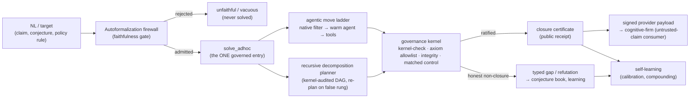

# LeanMill Architecture

> **Up:** [Documentation map](../README.md) · **Design history / decision log:** [`leanmill_design_history.md`](./leanmill_design_history.md) (the dated RCAs, A/B evidence, and "why" behind every invariant below).
>
> **Seam/spec of record:** `research_areas/seams/engine/lean/GP-225_leanmill_vnext_station_factory_seam.md`. This document owns the durable architecture; the seam owns the live operating spec.

## 1. Overview

LeanMill is a **governed proof-search environment**: a deterministic governance kernel wrapping a `formalize → solve → govern → self-learn` pipeline over swappable frontier-model agent leaves. Its output unit is a **typed, governed exit** — a kernel-verified closure, an honest gap, or a kernel-checked refutation — never agent activity.

The distinctive bet is the **untrusted-claim regime**: where a compiling Lean proof is *necessary but not sufficient* — autoformalized mathematics, AI-generated proofs, open conjectures, and **non-mathematical compliance rules**. Competition provers optimize closure-% on *trusted* benchmarks where "it compiled" suffices. LeanMill instead makes the result *trustworthy*: every closure is re-verified by an anti-laundering kernel the leaf cannot influence, and every autoformalized statement is gated by a faithfulness firewall before any proof is attempted.

The agent leaf (codex/claude, or a trained prover) is **the substrate, not the system**. LeanMill is the environment that wraps and multiplies it. A stronger leaf is a provider-registry slot, not a missing capability.

## 2. Design Principles

These are core invariants. Each is restated cleanly here; the dated derivation and the bugs each one closed live in the design history.

1. **One governance kernel.** Exactly one anti-laundering organ stack ratifies every solving mode (cascade, governed-DAG, ad-hoc, proof-repair, family/compounding, batch). A new check is registered once as a kernel **organ** and every mode inherits it; no mode re-implements governance. Canonical: `gates/lean_proof_gate.run_anti_laundering_kernel`.

2. **One governed solve entry.** Exactly one entry — `solver_core.solve_adhoc` — runs the move space and the kernel. Every way of producing work (ad-hoc, autoformalize, notes, residual-C, proof-repair, family, iso-decompose) is a **target-producer** that routes through it via the identical interface `(target_name, source, goal, *, substrate, mode, timeout_s)`. A new capability is a producer, never a parallel solve or governance path.

3. **The Goldilocks line — determinism only at the soundness boundary, agency everywhere upstream.** Put determinism exactly where soundness *requires* it (the trust primitives) and nowhere else; give the agent full agency upstream. The test for any knob: *does soundness require this to be mechanical?* Yes → boundary, deterministic. No → agency. The two failure modes are determinism creep into the agent's lane (hand-wired routers/statements cripple the leaf) and agency leak into the boundary (agent as its own judge → laundering).

4. **The solver builds proofs; it is not a Mathlib lookup.** A missing Mathlib lemma is a *sub-goal to prove*, never a wall. A Mathlib survey maps the **build-frontier** (citable foundation vs. the decomposition tree to construct), not a no-go zone. The matched-negative-control organ exists precisely to *reject* the degenerate "proof = library lookup."

5. **Governance is the differentiator; the exogenous moves are a reliability layer.** A shell-enabled frontier leaf can reproduce the SymPy/SMT moves itself (measured). What it *cannot* do is police itself — so the genuinely defensible capability is the deterministic anti-laundering kernel, not the move catalogue.

6. **One WorkItem contract.** Theorems, theory (definitions + API lemmas), and manifests are all typed, receipt-bearing work (`contracts/work_items.py`). Receipts are machine-consumed first (fed into the next dispatch), human-rendered second; the conservation rule is that any later item can build on a receipt **without re-derivation**.

## 3. The Soundness Model

The single guarantee: **no false closure.** A `closed` from the solver is an *unratified proposal*; only the kernel verdict ratifies. The trust boundary is a small set of **deterministic** primitives the agent cannot influence:

- **Kernel proof-check** — the Lean kernel re-verifies the proof term.
- **Axiom allowlist** — `#print axioms` on the closed decl must be ⊆ `{propext, Classical.choice, Quot.sound}`; `sorryAx`, `native_decide`'s `ofReduceBool`, and any other axiom are rejected.
- **Statement integrity** — the proved statement and every definition/structure it depends on are unaltered (no def-shell, no instance/notation/macro/`set_option` that changes meaning).
- **Matched-negative-control** — the proof must *need* the source prelude; a proof that compiles against bare Mathlib was a lookup, not a closure.
- **Non-degeneracy** — the statement is not vacuously true (instance battery / non-degenerate-instance probe).
- **Canonical re-elaboration** — strips added instance/notation context and recompiles; if the target no longer closes, the proof depended on a semantic hijack.

Gates **fail-open** on tooling-inconclusive and **fail-closed** only on a *confirmed* violation. Because soundness lives entirely at this boundary, the agent above it is fully free: a false sub-lemma fails honestly (no false closure), which is what makes agent-generated decompositions non-iatrogenic.

## 4. System Architecture

LeanMill is a set of components separated by typed contracts. Each owns one responsibility and exposes one interface; none invents a local meaning of "done", "closed", or "credit-ready".

### 4.1 Governance Kernel (`gates/`, `solver/governance*`)
The soundness boundary of §3 — an extensible organ stack plus the axiom-allowlist gate and matched controls. Anti-laundering findings are catalogued to a cross-substrate registry (`gaming_vector_catalog.jsonl`); the gaming-pattern hardener (`common/kernel_hardener.py`) is shared with autoresearch. The kernel never trusts "it compiled."

### 4.2 Autoformalization Firewall (`solver/autoformalize.py`)
Gates the solver: an unfaithful, vacuous, or trivial NL→Lean statement is rejected *before* any proof is attempted. Legs, fail-closed (admit only on a positive signal):

| Leg | Checks |
|---|---|
| Compilation | typechecks with `sorry` |
| Non-triviality | cheap tactics can't close it; not vacuously true |
| Structural faithfulness | binder counts, conclusion operator, quantifier order match the reference (catches dropped hypotheses, weakened conclusions, quantifier reordering) |
| Semantic instance battery | the predicate must `decide` to human-labelled cases — ground truth, not opinion |
| SMT-boundary battery | z3 finds the exact decision-flip edge over ∞ domains (`SmtPolicyChecker.threshold_cases`); Lean kernel ratifies each case |
| **Certified faithfulness** | a **typed 3-verdict artifact** (`certified_faithfulness.certify_policy_faithfulness`), never an opinion: `CERTIFIED_EQUIVALENT` (z3 exhaustive equivalence over the whole domain, optionally **kernel-promoted** to a Lean `omega`/`decide` proof) / `REFUTED` (a concrete, re-verifiable distinguishing input) / `OUT_OF_FRAGMENT` (the honest Rice-theorem boundary → advisory fallback, never a silent admit) |
| Round-trip judge | back-translate to NL; a cold cross-family judge (majority-of-N) must rule it the same problem |
| Cross-vote consensus | ≥2 independent formalizers agree on a kernel-equivalent statement |

The deterministic structural carrier **overrides** a charitable LLM judge. The instance + SMT-boundary legs are what let the firewall apply **beyond mathematics** (compliance policy, see §4.6).

**Certified faithfulness — opinion vs. certificate (the sharpened thesis).** For the decidable policy fragment the firewall does not *opine* that a formalization matches intent; it returns a checkable artifact (`certify_policy_faithfulness`, a thin typed composition over z3 `equivalence`/`distinguishing_requests` + `groebner_cert` + the Lean `omega`/`decide` kernel — **no reimplemented decision procedure**; z3 is complete for linear-integer policy). The lineage is named (research-isomorphism surface, 2026-06-16): **PCP/IP** (a bounded verifier policing an untrusted producer), **Rice** (the undecidability boundary that *requires* an honest `OUT_OF_FRAGMENT`), **Gröbner/Farkas** (certificate-of-equivalence). Measured at scale (`results/certify_policy_corpus_run.md`, **N=18** across 8 compliance domains). **What this is and is NOT:** the engine *decides* 18/18 (no `OUT_OF_FRAGMENT` residue on this fragment) and agrees with the z3 ground truth on all 18 — but the engine *is* z3, so that agreement is a **consistency check, NOT an independent accuracy claim** (z3 agreeing with z3 is expected, not evidence of an edge). The only non-tautological signals are (a) every verdict is a **checkable artifact** — a cert or a re-verifiable distinguishing input — and (b) the comparison against the **independent** oracle (the LLM judge), which is a **kept null**: the N=5 probe's witness gap (engine 3/3 vs judge 2/3) **did not replicate** — at N=18 the judge got every verdict right *and* a valid witness for all 9 launders. So there is **no measured accuracy/witness edge**; the durable differentiator is the **soundness guarantee** (a decision-procedure certificate, sound by construction and re-runnable; an LLM opinion has no guarantee on the next corpus), not a number.

The trichotomy generalizes beyond policy into a **transport-to-decidability router** (`solver/decidability_router.py`): it routes a faithfulness/validity obligation to the theory where it is decidable (LIA/EUF → RCF/NIA → polynomial-ideal), composing `certify_policy_faithfulness` + `nlsat_decide` + `groebner_cert`. Headline metric — the **decidable-fraction lift** (`results/decidability_router.md`): on a mixed 7-obligation seed (incl. genuinely-undecidable rows — Fermat over ℤ, a non-ideal-member — that resolve to honest `OUT_OF_FRAGMENT`), the portfolio decides **5/7 (71%)** vs a single best theory's **2/7 (29%)** → **lift +3**. The Rice boundary is a measured frontier, not a wall. And this exploration is **safe by construction**: the soundness red-team (§8) now includes a **transport-laundering** class — a wrong Gröbner cofactor / false witness / asserted analogy is caught by kernel re-verification (**8/8 rejected, 0 false-positive**, genuine transport passes).

This **non-math firewall is a first-class spine**, not a side-effect: a committed corpus of **16 domains** across compliance / finance (SMT-boundary) / IAM-access / DeFi-nonlinear / must-search (`scripts/public/control/leanmill/nonmath_domain_corpus.json`), and a deterministic, reviewer-runnable demo (`scripts/public/control/leanmill/nonmath_firewall_demo.py`) that shows the kernel admitting every faithful spec and catching every laundered one with **no LLM in the loop**. Measured edge over a steelmanned LLM judge: precision (firewall 14/14 vs judge 13/14, 0 vs 1 false-reject) — the catch-rate is a kept null (the differentiator is the auditable certificate, not out-catching the judge). Public entry: `autoformalize.faithfulness_gate(nl, lean_statement)`.

#### 4.2b Anti-laundering stack for theory-first built definitions (`solver/def_denotation.py` + reuse)
The danger when "the agent builds definitions" is the ultimate launder: define `HasRationalAntiderivative := True` so `G` is trivial. **Four layers** guard it — the first three already exist (reused, not rebuilt); the fourth is the new honest catch. Soundness comes from the *enforced* layers (1, 3, 4); layer 2 is agent discipline backstopped by them:

| # | Layer | Catches | Enforced by |
|---|---|---|---|
| 1 | **Statement faithfulness** (firewall, §4.2) | `G` no longer matches the NL | `faithfulness_gate` — kernel/round-trip, fail-closed |
| 2 | **Definition workability** (sanity lemmas) | a vacuous/wrong def fails its model cases | `theory_consolidation` DIVERGE/TRIAL/SELECT discipline (prompted agency; the agent must prove model-case sanity lemmas before shipping a def) |
| 3 | **Composition faithfulness** (the real backstop) | a wrong def *cannot plug into independently-proven neighbors* | `composite_ratify` — the built defs must compose with the proven shelf (RUNG B/C) into the {A,B,C} kernel-ratified composite; a theory built on a wrong antiderivative def cannot connect to RUNG C, so the parent never closes |
| 4 | **Denotation faithfulness** (the new honest catch) | a self-consistent **decoy** that passes 1–3 yet means something subtly different | `certify_def_denotation` — a kernel-verified external anchor (below); layer 3's composition is *consumed* here as a pinning anchor (`composed_defs`) |

Layers 1–3 already catch most laundering: you cannot launder a definition that must round-trip to the NL **and** prove its sanity lemmas **and** plug into independently-proven neighbors. Layer 4 addresses what they don't: the firewall's round-trip is **circular** for a brand-new symbol (the statement is phrased in the agent's own vocabulary), and the existing def legs only catch a *constant* shell (`detect_def_shells`) or an LLM-obvious wrong object (`default_def_faithfulness`). The genuinely-hard question is **denotation**: does the new symbol `S` *mean* the intended concept `C`, or merely some self-consistent **decoy** `C'` that satisfies every internal sanity lemma *and* composes with the shelf yet means something subtly different? `A(S)` (the stated API) **under-determines** `S`. Proving denotation absolutely is impossible from inside the system, so we do **not** pretend to — we **measure pinning** and return a 3-valued verdict that never launders under-determination as certification:

| Verdict | Meaning |
|---|---|
| `REFUTED` | a declared agreement with a trusted reference is kernel-**false** — a decoy caught red-handed |
| `PINNED` | every built def carries ≥1 kernel-**verified external anchor** → a decoy is ruled out |
| `UNDERDETERMINED` | a built def has only self-consistency (no verified external anchor) → an **honest gap**, surfaced, not certified |
| `NOT_APPLICABLE` | the formalization introduced no new defs (Mathlib objects only) |

An **external anchor** is either an **overlap-agreement** theorem the agent proved — `anchor_<def>_agrees_<ref> : ∀ …, <def> … = <Mathlib concept> …` over the overlap domain (a *decoy cannot* prove agreement with the established concept) — or **participation in a kernel-closed proof** with the proven shelf (composition forces the value). The agent decides the reference and *states* the anchor (agency upstream); the kernel decides whether it *holds* (`kernel_denotation_verifier` reuses `_compile_probe` + `audit_axioms_subset` — zero new soundness surface). Anchors ride the existing sorried-work-item path for free: an `anchor_…` theorem is just a sorried theorem → queued → attacked → later scored. The verdict is **advisory telemetry** (`res["denotation"]`, default-on, `ZTARE_LEANMILL_DENOTATION_CHECK=0` reverts) — it never gates a closure, so a kernel-clean proof is never blocked by an unanchored def; it only *reports* the denotation frontier truthfully.

**Lineage** (research-isomorphism surface, 2026-06-19 — deanchored from ITP): **Kalman observability rank** (a hidden state is uniquely recoverable iff its constraint set is full-rank over external outputs; rank-deficient ⇒ a decoy fits ⇒ under-determined), **Mayers-Yao self-testing** / **Mostow-Birkhoff rigidity** (one extremal external constraint pins the referent up to isomorphism), **Universal Composability / Revelation Principle** (composition with a trusted environment forces declared-symbol = true-referent). The honest stance is the point: this is the **open frontier** of create-beyond-Mathlib, reported as a measured verdict rather than asserted away.

### 4.3 Solver Lane (`solver/solver_core.py`, `solver/isomorphism_decompose.py`)
The agentic-PROPOSE / deterministic-RATIFY engine. The leaf *is* the agent (`agentic_leaf.default_dispatch` over a shared durable warm-session manager). Two layers:

- **Agentic-first move ladder.** A free deterministic filter (`native_hammer`) → the warm agent (`claude_warm`, tool-equipped) → decomposition (`conjecture`). The agent decides per node; cold one-shot provers are a fallback. Exogenous moves (witness-transport, abduce/QE, Groebner/nlsat/SOS transport edges, Isabelle hammer) are agent-electable tools (`agent_tools`/`move_cards`), kernel-arbitrated.
- **Recursive decomposition planner** (`route_and_solve`). On an honest non-closure the warm leaf *generates* a decomposition; the **kernel audits it** (`decomposition_dag_audit`: sorry-free, non-circular, every-lemma-used, proves-G); sub-lemmas solve through `solve_adhoc` (recursion, depth-bounded); the parent closes only via `composite_ratify`'s anti-laundering kernel. A planner sub-lemma proven false (kernel-checked ¬G) triggers a bounded **re-plan** with the agent's correction. The planner is a *contract the fungible leaf fills*, not a separate agent.

**Closure-validation state machine & outcome vocabulary** (`solver_core._validate_and_maybe_close` →
`_validate_against_contract`). A compiling proof is NOT yet a closure — it must clear a four-receipt gate
before it is credited. `credit_ready ⇔ kernel_compile ∧ matched_negative_control ∧ governance_kernel ∧ ¬banned_axiom`:
- **kernel_compile** — the proof elaborates (the v33 REPL/`lake env lean`). Both the compile *and* the
  `#print axioms` allowlist audit (`audit_axioms_subset`) run warm through the persistent REPL when usable
  (Mathlib preloaded), with a cold `lake env lean` fallback — the audit's raw output is parsed by the **same**
  `parse_axiom_output`/`AXIOM_ALLOWLIST` as cold, so the F1/F2 gate is **byte-identical** (warm-vs-cold parity
  validated incl. `native_decide`→reject; warm only amortizes the ~100s Mathlib re-import the cold audit paid
  on *every* closure — the recurring verify-starvation cost; 2026-06-19).
- **matched_negative_control** (`_verify_matched_negative_control`) — restates the goal under bare `import
  Mathlib` (no source prelude). It is **three-valued and ABSTAINS by design**: a proof that compiles bare is
  *undecidable* between "valid pure-Mathlib proof" and "leakage" without the source prelude, so the MNC
  returns INCONCLUSIVE (never a reject) for that case — the **authoritative kernel** (which *does* receive the
  original source) is the real leakage organ. (RCA 2026-06-18: this control had a latent `NameError: re` →
  silent dead instrument; and a pure-Mathlib goal like `(I/2)²=-(1/4)` must *not* be flagged leakage just for
  compiling bare.)
- **governance_kernel** — the ONE `run_anti_laundering_kernel` (vacuity / gold-name / single-lemma / leakage /
  consequence / currency / statement-integrity). Only a **confirmed** organ blocks; advisory flags do not.
  *Organ-blocking matrix (2026-06-18 — every live call passes `deep_verify=False`):* **BLOCK** =
  gold-name-verbatim *trivial-restatement* (`gold_name_verbatim_confirmed`), statement-integrity
  (`statement_altered_confirmed`), vacuity (`vacuity_suspect`), + the axiom audit and compile gates. **ADVISORY
  only** = `single_lemma_exact` and `indirect_leakage` — their *confirmed* (blocking) flags require
  `deep_verify=True` (an extra independent-verify compile, lines 589/606), which **no live path enables**. This
  is **sound** (an advisory single-lemma / indirect-leak proof still compiles sorry-free + passes the axiom
  audit + statement-integrity, so it is a *valid proof of a true statement* — "leakage" here means "cited a
  lemma instead of original work," never "proved something false," so it can't be a false closure) and a
  deliberate **precision/cost tradeoff** (blocking all single-lemma proofs would reject legitimate library
  composition). The residual is **capability honesty, not soundness**: a trivial library-lookup rung
  (`by simp_all` glue) is credited as a closure without being marked trivial — addressed by **rung
  substance-tiering** (the advisory flag *is* the tier signal), NOT by blocking.
- **axiom_allowlist** — `#print axioms ⊆ {propext, Classical.choice, Quot.sound}`; a confirmed banned axiom
  (`native_decide`→`Lean.ofReduceBool`) blocks (tiered `true_modulo_banned_axioms`, not a cheat).

**Outcome vocabulary (DERIVED from the failing receipt, never hardcoded** — `_reject_reason_from_validation`):
`closed` · `rejected_compile` · `rejected_banned_axiom` · `rejected_anti_laundering:<organ>` ·
`rejected_mnc_leakage` · `uncredited_validated_closure_dropped` (all receipts passed but credit_ready=False ⇒
a **control-flow bug**, a kernel-valid closure lost — NOT laundering). RCA 2026-06-18: a single hardcoded
`rejected_negative_control` catch-all previously collapsed all of these, making rejections un-diagnosable and
**poisoning move-calibration** (every non-closure scored as a "caught cheat" in `_WRONG_TARGET`, driving real
provers' priors down for closures they produced). Only `rejected_mnc_leakage` / `rejected_anti_laundering` are
cheats; `rejected_banned_axiom` and the `uncredited_*` flow-bug labels are neutral and bucketed separately.
The principle generalizes: **a control that cannot decide ABSTAINS (inconclusive); a rejection is labeled by
the receipt that actually fired.**

### 4.4 Cross-Substrate Layer (`common/cross_substrate_consensus.py`, Isabelle/SMT)
Lean is the closure arbiter; Isabelle and SMT are independent peers. **Propose→ratify**: SMT proposes an adversarial boundary, the Lean kernel certifies it. **Consensus**: ≥2 independent substrates (each with its own NL→formal translation) reconcile verdicts on one claim — agreement is trust-lift, disagreement localizes a *translation bug* with no human. An Isabelle verdict is a corroboration signal, never a Lean closure.

*Honest status (kept):* the **consensus mechanism is the novel part** — treating cross-substrate *disagreement* as a faithfulness verdict (vs. the literature's agreement-as-confidence) — but its applicability is bounded (on rich math the SMT/Isabelle translations bail out, so there is no second substrate to disagree with). The **exogenous transport edges** (the agent's CAS/SMT→kernel-cert moves) ARE measured: a controlled A/B (`results/transport_lift_controlled.md`, both arms kernel-verified, baseline = full local native incl. `subst_vars`) shows Gröbner→`linear_combination` and SOS→`nlinarith`-hints closing **2 degree-≥3 goals** (`a+b+c=0 ⊢ a³+b³+c³=3abc`; `(x²−1)²≥0`) that the local native cascade cannot. Notably **`polyrith` — the historical Gröbner competitor — is decommissioned in current Mathlib** (its external service is dead), so this edge fills that gap locally + deterministically with an auditable cert; the lift is *not* a polyrith or baseline-weakness artifact. On witness-transport, the honest picture (corrected 2026-06-16): vs the **deterministic native cascade** it is a clean **20/20 vs 0/20** — but native is a weak baseline (fixed tactics cannot *construct* an existential witness). Against a **strong reasoning model** (gemini-3.1-pro, no tools) the original Pell/Kronecker corpus is **largely subsumed** (bare 10/11): the "Kronecker factoring" rows leaked the answer via the sum (`x·y=N ∧ x+y=S` is a quadratic, `S²−4N=(p−q)²`, *not* factoring), and the fresh Pell `D` had small fundamental solutions. The **genuine, clean separation is only-N integer factorization**: given *only* the product, a bare pure-text model (deepseek, with a passing small-N control) **cannot** factor a 16–26-digit semiprime — deepseek-reasoner exhausts its budget, deepseek-chat guesses wrong — while leanmill's `factorization` witness path (`solve_factor`, SymPy `factorint`) factors it and the **kernel re-verifies** `x·y=N ∧ 1<x<N`. That is the defensible "an LLM cannot do this; the kernel confirms leanmill did," on identical instances (`witness_transport_moat/`). The earlier "12/12 non-subsumed" framing was vs native only and is superseded.

### 4.5 Self-Learning Layer (`solver/move_calibration.py`, forecast pool, `proof_cache`, `no_good_store`, `faithfulness_store`)
Loops scored on the **exogenous kernel verdict**, never model self-narration: move-prior calibration (carrier-liveness-gated against dead-instrument contamination), the diverse external forecaster pool (advisory routing), the verified-win / confirmed-refutation / faithful-correspondence memos, and error-conditioned fix memory. Soundness-isolated: a bad learned value costs efficiency, never a false closure.

### 4.6 Formal-Verification Provider Boundary (`formal_verification_provider.py`)
LeanMill is a `formal-verification-provider/v1` **provider**: it runs the firewall + kernel and emits a provider-neutral, Ed25519-**signed** payload that an external governance kernel (cognitive-firm) records. Payload-only boundary — no import coupling either way. Verdict map: `verified` (faithful + checker-closed + ratified), `refuted` (kernel counterexample), `invalid` (unfaithful / anti-laundering failure — a *different* statement was proved), `inconclusive`. This is the seam through which the **non-math wedge** delivers value: a laundered compliance rule is caught by the LeanMill kernel and rejected by an independent firm's governed bundle, cryptographically chained (demo: `scripts/public/control/leanmill/nonmath_cognitive_firm_demo.py`).

### 4.7 Factory & Work Bus (`work_queue.py`, `contracts/`, stations)
The distributed control plane: a durable queue (`work_items`, leases, terminal state, heartbeats) is the system membrane. Stations specialize *work*, never *contracts*. The MECE contract spine (§6) is the invariant; agents may propose YAML/sources/repairs but cannot ratify proof value. The residual-C credit lane, source-growth routing, and family lifecycle are factory concerns layered on the same bus.

## 5. End-to-End Control Flow

A producer (notes blueprint, residual-C row, repair) enters at NL/target; everything converges on `solve_adhoc` → kernel → certificate-or-honest-gap. Only the kernel decides whether evidence becomes credit.

**Gaps are first-class, never silently dropped** (Goldilocks: a gap is *never* a closure). An honest non-closure is recorded at three distinct altitudes, each with its own consumer — they are complementary granularities, not duplicates:
- **Per-statement / tactical** — `no_good_store.jsonl` (CEGIS/CDCL conflict clauses: "don't retry *this* rejected approach"), rendered back into the **leaf prompt** when re-attacking that exact statement.
- **Machine evidence ledger** — `conjecture_book.jsonl` (open conjectures + evidence events; `obstruction_to_conjecture` turns a refutation into a construction target), consumed by the **self-learning layer**.
- **Campaign / blueprint status map** — the notes-channel gap ledger (`autoformalize_notes.write_refined_notes` → `## Gaps this run (honest non-closures — NOT proven, NOT citable)`), each gap tagged with a typed `failure_class` (`firewall_rejected` / `admitted_and_exact_gap` / `open` / `deferred:campaign_wall`). This is the **next planner pass**'s view of what is still open and why — distinct in altitude from the per-statement no-good store. It lives in the deterministic governed-facts section the agent cannot author, so a gap can never be laundered into a fake `✅`.

## 6. Contracts

LeanMill's complexity is held by a **smaller set of non-overlapping contracts**, not more workers.

- **Typed kernel seams (`contracts/kernel.py`, pydantic).** Cross-module data is typed, not bare dicts: `ProofTarget` (the row), `MoveResult`/`GovernanceVerdict`/`FirewallResult` (the outcome vocabulary — `"closed"` encoded once via read-only accessors), `primary_result` (fails loud on a missing `results` key). Config is a `YamlConfig` subclass (defaults-in-code + optional YAML override, byte-parity when absent; soundness-critical constants stay frozen). External-tool output goes through the producer's own decoder, regex only at the true boundary. Migration is highest-bug-risk-first, each behind a behaviour-equivalence test — never a blind sweep.
- **The MECE contract spine.** Work-bus, agentic-handoff, source, family, probe, governance, strict-C-credit, factory-intelligence, and policy contracts each have one canonical owner and an explicit "must not own" column. A new fact that fits no row means a contract is missing — add it before adding station-local state. The queue boundary is fail-closed: a terminal agentic patch without its required downstream receipt is stamped `skipped`, never hidden.

## 7. Distributed Operation

- **Topology.** An operator node plus one or more worker nodes (e.g. a Hetzner VPS) carry the same proof-search instruments. Code reaches a node through a curated rsync allowlist (`deploy/vps_sync_files.txt`), not git.
- **Calibration at bring-up — no node interprets a negative until its instruments pass a positive control.** `node_preflight.py` hard-fails a node unless the REPL toolchain matches the project's Mathlib oleans *and* `import Mathlib` truly loads (positive controls + false-accept guard + sorry-gate). This mechanizes the dead-REPL lesson (a toolchain mismatch silently turned every probe into a false negative).
- **Warm substrate.** A persistent Lean REPL (`PersistentLean`) amortizes Mathlib elaboration; campaign theory is elaborated once into a warm env so per-probe verify is milliseconds, not minutes. The warm-agent session manager (`common/subscription_agent_runtime.py`) persists and resumes the leaf across process boundaries.
- **Resilience.** Every blocking-op timeout resolves through one central factory (`common/timeouts.py`: defaults-in-code + env override + `clamp_to_remaining`), so a hung sub-call can't silently eat the budget. Observability is a single regenerating dashboard (solver-lane telemetry, autoformalizer funnel, factory intelligence, non-math wedge, compounding curve).

## 8. Positioning

| System | Approach | Reported results |
|---|---|---|
| LEAP (Google, 2026) | Agentic general LLM, no fine-tuning; blueprint → Lean → compiler-feedback over an AND-OR DAG with memoization | Putnam-2025 12/12; Lean-IMO-Bench 56.7% |
| AlphaProof (DeepMind, 2024) | RL-trained prover + large search | IMO-2024 silver-medal level |
| DeepSeek-Prover, LeanCopilot | Fine-tuned Lean provers | pluggable as a LeanMill provider slot |

**Convergent (corroborating, not differentiating):** the obligation DAG (`governed_dag_search`), lemma memoization (`proof_cache`), compiler-feedback refinement, and backward decomposition are independently arrived at by these systems.

**Distinctive:** the governance kernel and the regime it targets — closure verification beyond "it compiled" (matched-negative-control, non-degeneracy, statement-integrity, axiom allowlist), the faithfulness firewall on autoformalized statements (extending **beyond mathematics** to compliance policy), self-learning scored on the exogenous verdict, and the signed cross-repo provider boundary. These matter most where a compiling proof is necessary but not sufficient.

**Prior art on the verification side, and the honest edge (no false "first").** The transport-to-decidability trichotomy (§4.2) *composes* well-known techniques and we say so plainly — novelty is the combination/application, not any single piece: **translation validation** (Pnueli — per-instance equivalence/refinement with a certificate; we apply it to NL→formal *autoformalization* faithfulness, where the field uses LLM judges); **portfolio / algorithm-selection SMT** (we use it as a faithfulness *decidability router* under one typed trichotomy); **CEGAR** (related; we route to decidable theories rather than refine abstractions); **decision-procedure certificates** (Gröbner/SOS/RCF/Presburger, made the verdict, kernel-re-verified); and the mature **SMT-based policy/program-verification** line — access-control/policy analysis (XACML/Margrave-style), cloud access-policy permissiveness reasoners, network-reachability verification, and program-equivalence / peephole verification (Alive2-style). We do **not** out-verify those dedicated tools on their own turf — each has a complete, hardened, expert-built encoding of its *real* domain grammar, which our toy-scale models do not. The edge is a *different and broader target*, and it is the LLM-era failure that line **assumes away**: (1) they take a *formal* artifact as ground truth and verify formal→formal properties — we target the **intent→formal translation** (the firewall: *is the formalization faithful to the stated intent?*); (2) their encodings are *bespoke per domain* — our one trichotomy router spans access-policy, compliance/finance, **and mathematics**, agent-driven, no new expert encoding per domain; (3) we **re-verify every certificate through an independent kernel** and run a transport-laundering red-team (8/8), so a wrong transport cannot mint a closure. Same SMT-certificate *spirit* (which shows the approach is real and shippable), genuinely different *scope*. Receipts: `results/iam_refinement_run.md` (access-policy over-grant detection — **5/5** escalations caught with a re-verifiable witness; the 9/9-vs-z3 is a consistency check, not an accuracy claim), `results/decidability_router.md`.

**Honest scope (the claim register).** Measured against a **live** steelmanned LLM judge, over 7 compliance domains (14 faithful/laundered cases: Basel/Reg-T/tax numeric boundaries + HIPAA/pharma/aviation/export structural) — receipts `analytics/public/leanmill/dashboard_data/nonmath_firewall_ab.json`:
- **Precision + verifiability — the real, measured edge.** Every firewall verdict is an auditable kernel certificate, and the firewall does not false-reject: **firewall 14/14 = 100%** (0 false-alarms) vs. **judge 13/14 = 93%** (1 false-reject — it wrongly rejected a *faithful* aviation rule). The firewall's whole accuracy edge (+7%) is that one judge false-reject — i.e. **precision**, plus the certificate. (Corroborated by an earlier 6-case structural-math pilot: firewall 0/6 false-rejects vs. judge 5/6.)
- **Catch-rate lift — measured NULL across THREE launder classes (kept, not hidden).** On the laundered cases the firewall and the steelmanned judge BOTH caught everything (+0 delta), at every class probed: SMT-boundary off-by-ones **7/7 vs 7/7**, *and* a purpose-built **must-search** class (boolean precedence flip `(a∧b)∨c` vs `a∧(b∨c)`; divisibility refactor `n%8=0` vs `n%4=0 ∧ n%6=0`; linear-combination disguise) **3/3 vs 3/3** — the judge (gpt-5.5) *reasons* through them (computes lcm(4,6)≠8, sees the regrouping). An earlier "+6 lift" was a retracted dead-instrument artifact. **Honest conclusion: against a frontier judge the firewall has NO catch-rate edge** — the differentiator is precision + the auditable certificate, not "catches more." The only remaining hypothetical is a launder whose distinguishing instance is findable *only* by exhaustive/SMT search over a large space (beyond symbolic reasoning) AND is a valid faithfulness launder — increasingly contrived; we do not claim it. Receipts: `analytics/public/leanmill/results/nonmath_mustsearch_ab.md`.
- **End-to-end signed flow into cognitive-firm — validated** (the non-math wedge crosses the repo boundary as a signature-verified verdict).

Open bars: the **full** miniF2F-244 number (a depth-bounded N=23 run landed 10/23 = 43%, the N=9 pilot 6/9 — §9), and the **must-search** catch-rate class above.

## 9. Open Areas

Tracked in the design history's capability-discipline ledger; the current frontier:

- **Benchmark number** — publish miniF2F / PutnamBench closure-% with the governance kernel on, comparable to LEAP/DeepSeek-Prover. The PutnamBench substrate (v4.27, 672 Lean problems, Mathlib built) is wired into an A/B harness guarded by a **benchmark-admissibility pre-flight** (a positive/negative control through the canonical verify path that *aborts* rather than letting a dead/misconfigured substrate publish a silent fake 0% — the dead-instrument class applied to the instrument itself) and a per-problem hard wall-cap (`AB_HARD`) so a full run is bounded. A v4.27-matched warm REPL (`repl_parity --substrate <putnam>`, ~12s rebuild, live-calibrated GREEN) drops probes ~258s→~0.1s. A **warm PutnamBench N=3 pilot** ran admissible (`warm_matched=true`) and closed 0/3 on three of the hardest early problems (regime "too hard") — a real small-N point, not a rate.

On **miniF2F-test** (compiled against the v4.30 ztare_proofs Mathlib; warm, admissible), a **governed, depth-bounded N=23** random sample closed **10/23 = 43% (Wilson 95% 26–63%)**. An earlier **N=9 unbounded-depth pilot** landed **6/9 = 67%** (6/12 raw; 3 excluded as v4.30-inadmissible deprecated `∑ x in s` syntax). The larger bounded sample is the more reliable estimate and shows the small-N pilot was **optimistic**; it is also a **conservative floor**, because the depth-1 cost cap (the SIGALRM wall-cap is clobbered, so `MINIF2F_ISO_DEPTH` is the only real per-problem bound) timed **5 problems out** — budget-cut, not clean capability failures (a deeper search might close them). Every closure is kernel-ratified (axioms ⊆ allowlist, no `sorry`), including IMO problems; 3 non-closures were the governance *refusing* a compiling-but-possibly-vacuous proof (matched-negative-control). Honest caveats kept: the two runs use **different budget regimes** (depth-1 vs unbounded) so they are not apples-to-apples, and their CIs overlap. Receipts: `analytics/public/leanmill/results/minif2f_test_calibration{.json,_triage.md}`.

**Solver lift — the solver vs a bare frontier model (the non-tautological solver edge, against an independent oracle).** With the bare arm ON (`MINIF2F_AB=1`, depth-bounded, N=13): **leanmill 7/13 = 54% vs a bare single-shot frontier model 3/13 = 23% — solver lift +4**, and critically **zero iatrogenic losses** (`bare_only_targets` empty): leanmill closed every problem the bare model did **plus 4 more** (`mathd_algebra_362/170`, `induction_1pxpownlt1pnx`, `mathd_numbertheory_277`) — problems a single shot failed and the moves/decomposition closed. So the agentic architecture earns its complexity here; the worry that decompose-first is iatrogenic is empirically refuted (leanmill ⊇ bare on this sample). Honest caveats: N=13 CIs overlap (the *dominance* — 0 losses, +4 — is the robust finding; a tight CI needs larger N); leanmill ran depth-bounded (a conservative floor); the 2 hard-timeouts are wasted *compute*, not lift losses (the bare model also failed them) — a real per-problem wall bound in core would save that compute (tracked debt). Bare arm = a no-scaffolding single shot. Receipt: `results/apparatus_lift_minif2f.md`.
- **Hard closure** — land one kernel-certified open closure with public receipts (the Lam–Litt order-1 program is the active campaign).
- **Non-math catch-rate** — the *precision* edge is measured (firewall 0/6 false-rejects vs. live judge 5/6); the *catch-rate* lift on subtle launders is a measured **null** (judge also caught 6/6). The single judge's weak leg is *false-rejection* of faithful statements, so the round-trip judge now has an opt-in **diverse-family panel + Dawid–Skene reliability weighting** (`solver/judge_panel.py`, `ZTARE_LEANMILL_JUDGE_PANEL`, default-off): ≥3 different model families decorrelate errors so one over-rejecting judge can't veto, and DS down-weights a chronically-flaky judge without an oracle (`statement_integrity` still overrides, so the panel only moves the false-reject margin, never the no-false-admit floor). Lift vs. the single judge is **measured NULL** (`judge_panel_lift.py`: false-rejects baseline 1/6 vs panel 1/6, catch 6/6 vs 6/6) — because the single gemini-3.1-pro judge was already strong (1/6), leaving no room, and DS had no vote history (equal-weight majority). The panel is a sound default-off capability whose lift would only show vs. a *weak/flaky* judge or once per-judge history accrues. The catch-rate frontier is otherwise **closed** (measured null across structural / SMT-boundary / must-search classes — see §8): leanmill's differentiator is precision + the certificate, not out-catching a frontier judge.
- **Cross-substrate disagreement as a first-class faithfulness signal** — productionize the consensus layer's translation-bug localization.

**Default-off capability dispositions (honest — not dormant claims).** Four capabilities ship behind a default-off flag; none is *claimed* as a win, and each is kept off for a stated reason rather than retired (they are sound and would help in the named regime):
- `JUDGE_PANEL` (diverse-family judge + Dawid–Skene) — **measured-null** lift vs an already-strong single judge; sound (only moves the false-reject margin, never the no-false-admit floor). Keep off; lift would show vs a *weak/flaky* judge or once per-judge vote history accrues.
- `LEARNED_CONTEXT` (inject learned move-stats into the leaf) — **blocked on data**, not broken: the attempts-DB was contaminated by dead-instrument rows, so it is double-gated (`+ CALIBRATION_TRUSTED`) until a re-baseline. Keep off until the DB is re-baselined.
- `POOL_ROUTER` / `CONJECTURE_POOL` (route forecast policy / wake the forecaster pool per emission) — **advisory, unmeasured lift** (the router stays advisory until a `baseline_beaten` real-gate) and **cost** (waking the pool per emission). Keep off pending a measured advance-rate gain that justifies the cost.

These dispositions are the honest alternative to either a fake "measured lift" or deleting working code; revisit when the named blocker (a strong baseline / a clean DB / a cost-justifying lift) is resolved.

Every claim added here keeps the register honest: nulls are kept, and a capability is listed as *measured* only with an exogenous receipt.
