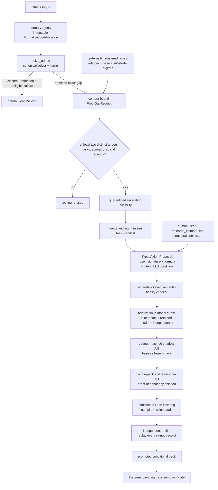
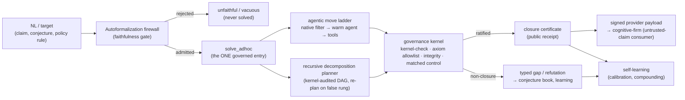

# LeanMill Architecture

> Up: [Documentation map](../README.md) · Design history / decision log: [`leanmill_design_history.md`](./leanmill_design_history.md) (the dated RCAs, A/B evidence, and "why" behind every invariant below).
>
> Seam/spec of record: `research_areas/seams/engine/lean/GP-225_leanmill_vnext_station_factory_seam.md`. This document owns the durable architecture; the seam owns the live operating spec.

## 1. Overview

LeanMill is a governed proof-search environment: a deterministic governance kernel wrapping a `formalize → solve → govern → self-learn` pipeline over swappable frontier-model agent leaves. Its output unit is a typed, governed exit: a kernel-verified closure, a recorded gap, or a kernel-checked refutation. Agent activity is never the unit.

The distinctive bet is the untrusted-claim regime: where a compiling Lean proof is *necessary but not sufficient* (autoformalized mathematics, AI-generated proofs, open conjectures, and non-mathematical compliance rules). Competition provers optimize closure-% on *trusted* benchmarks where "it compiled" suffices. LeanMill makes the result *trustworthy*: every closure is re-verified by an anti-laundering kernel the leaf cannot influence, and every autoformalized statement is gated by a faithfulness firewall before any proof is attempted.

The agent leaf (codex/claude, or a trained prover) is the substrate that LeanMill wraps and multiplies. A stronger leaf occupies a provider-registry slot, available for swap-in.

## 2. Design principles

These are core invariants. Each is restated cleanly here. The dated derivation and the bugs each one closed live in the design history.

1. One governance kernel. Exactly one anti-laundering organ stack ratifies every solving mode (cascade, governed-DAG, ad-hoc, proof-repair, family/compounding, batch). A new check is registered once as a kernel organ and every mode inherits it. No mode re-implements governance. Canonical: `gates/lean_proof_gate.run_anti_laundering_kernel`.

2. One governed solve entry. Exactly one entry (`solver_core.solve_adhoc`) runs the move space and the kernel. Every way of producing work (ad-hoc, autoformalize, notes, residual-C, proof-repair, family, iso-decompose) is a target-producer that routes through it via the identical interface `(target_name, source, goal, *, substrate, mode, timeout_s)`. A new capability is a producer, never a parallel solve or governance path.

3. The Goldilocks line: determinism only at the soundness boundary, agency everywhere upstream. Put determinism exactly where soundness *requires* it (the trust primitives) and nowhere else; give the agent full agency upstream. The test for any knob: *does soundness require this to be mechanical?* Yes → boundary, deterministic. No → agency. The two failure modes are determinism creep into the agent's lane (hand-wired routers/statements cripple the leaf) and agency leak into the boundary (agent as its own judge → laundering).

4. The solver builds proofs; it is not a Mathlib lookup. A missing Mathlib lemma is a *sub-goal to prove*. A Mathlib survey maps the build-frontier: the citable foundation and the decomposition tree to construct above it. The matched-negative-control organ exists precisely to *reject* the degenerate "proof = library lookup."

5. Governance is the differentiator; the exogenous moves are a reliability layer. A shell-enabled frontier leaf can reproduce the SymPy/SMT moves itself (measured). What it *cannot* do is police itself, so the defensible capability is the deterministic anti-laundering kernel.

6. One WorkItem contract. Theorems, theory (definitions + API lemmas), and manifests are all typed, receipt-bearing work (`contracts/work_items.py`). Receipts are machine-consumed first (fed into the next dispatch) and human-rendered second. The conservation rule is that any later item can build on a receipt without re-derivation.

7. Notes are advisory; compile scope is authoritative. Campaign context (the blueprint, the proven shelf, the gap ledger) reaches the agent as *notes* (text, i.e. intent). What a target can actually *cite*, though, is its compile scope, which is assembled separately. These two channels MUST NOT drift: a lemma the notes advertise as "citable" has to be in scope, or it is not citable at all and the agent silently re-derives it inline (dead code, no dependency graph, the FTAP-composition bug). This is the root of the notes-path bug class (*text-context ≠ compile-scope*: shelf-as-text vs. standalone probe, blueprint defs vs. bare-`import Mathlib` verify, shelf-in-notes vs. cascade re-deriving from the goal), and it is insidious because the kernel safety net masks the drift as a *worse proof / silent drop / false-negative*, never a crash. The cure for the class is a single campaign probe assembler (`solver/autoformalize.assemble_campaign_probe`), the one source of truth for a target's scope: it places each proven shelf lemma in scope, dedups shared definitions (so theory-building targets that inline the same `def`/`structure` in every self-contained probe do not duplicate-declare), orders defs → shelf theorems → target, and falls back to the bare target on an unresolvable conflict (never a silent wrong merge). The `citable ⟺ in-scope` CI guard (`tests/test_leanmill_agentic_invariants.py::test_campaign_probe_assembler_citable_in_scope`) fails the build if the assembler stops enforcing this or a producer reintroduces a hand-rolled concat. Producers thread campaign context through the assembler, never as text alone.

8. Gate · Reporter · Move: the code-vs-primitive law (the cut Goldilocks leaves open). Principle 3 says *where* determinism goes (the boundary); this says *how* a capability reaches the system, which is the cut you hit the moment you want a new capability. Every capability is exactly one of three roles:
   - GATE (code, deterministic, *blocks*): soundness *requires* it to run agent-independently. If it is wrong or skipped, an unsound result passes. Kernel verify, axiom audit, `statement_integrity`, matched-negative-control. *Test: could trusting the agent here let something false through?*
   - REPORTER (code, deterministic, *never blocks*): a measurement the agent must not grade itself on. If skipped, a false claim stands unflagged. `def_denotation` (denotation), `certify_nonvacuity` (vacuity), assumption-accounting, run telemetry, the probe-path-drift detector. *Test: is this a claim about what was/wasn't established that the agent shouldn't grade itself on?*
   - MOVE / PRIMITIVE (agent reasoning, surfaced via the ONE move corpus + dual-channel atlas, kernel-rechecked): a strategy to make progress or discover, whose output the gates re-verify and the reporters measure. `generalize`, `conjecture_lemma`, `corroborate`, `transport`, the Extremal method, Constraint Imposition & Propagation (`broad_08`, the "what does this hypothesis secretly force?" / hidden-consequence move), and the agent's own denotation anchors + vacuity witnesses.

   *Decision rule:* *discovery and strategy are ALWAYS moves (never hard-coded as an organ); verification and measurement are ALWAYS code (never delegated to the agent).* A capability is code if and only if trusting the agent to do it would let an unsound result pass (a gate) or a false claim stand (a reporter); otherwise it is a move.

   Corollary (the trap this closes): a *prober* that DISCOVERS something (hidden consequences, the weakest sufficient hypothesis, a quantitative weakening) is a move. It is surfaced in the corpus, applied by the agent, and kernel-verified; it is never a bespoke `*_prober.py` organ. Building one is determinism-creep into the reasoning lane and a parallel surface (it violates Principle 3 and the single-corpus rule at once), and it is usually redundant, since the hidden-consequence move already exists as `broad_08`.

   Recall and surfacing of a move (the atlas and both its channels) is code-infrastructure; the move itself is the agent's choice. Do not conflate these roles.

   *Self-check before adding any capability: name its role. If you reach for a new organ to do reasoning, you mis-cut: make it a corpus move. If you reach for the agent to guarantee soundness or grade its own claims, you mis-cut: make it a gate or reporter.*

9. Reuse identity is SEMANTIC — the one name-agnostic normalizer, never the name. The formalizer's output has a non-deterministic surface: the theorem NAME (content-stable mangling, `iso_lemma1` → `iso_lemma1__89847c75`) and syntactic restyling of the same Prop. So *every* "is this the same lemma/statement?" check keys on the kernel-normalized statement (`solver/proof_cache.normalize_statement` — decl-name + whitespace agnostic, last-theorem-extracting), never on the raw name or a per-run enriched hash. One normalizer, all identity doors: the faithfulness `confirms()`, the structural- and def-faithfulness legs, the proof-cache, the decomposition cache, and banked-lemma reuse (`autoformalize_notes._banked_lemma_reuse`). Explicit blueprint names in `**(name)**`, `` `name` ``, or `name:` form are only citable locators into existing theorem/lemma blocks; they are not equivalence evidence, never match `def` blocks, and the downstream citation still re-verifies in Lean. A door that matches on the name as statement identity is a *within-run-only* cache that misses across runs — the recurring "caches never hit / the campaign re-litigates already-proven lemmas through governance and never CLOSES" class (the 2026-07-05 CLOB not-closing root, and the 2026-07-01 compounding-flat RCA). SOUND: reuse only SHELVES / short-circuits an object already kernel-proven-or-confirmed; a wrong semantic match fails when the target CITES it and won't compile — never a false closure.

9a. Retrieval is layered; authority is typed. LeanMill already has more than one retrieval surface, and they are
    deliberately not equivalent: `proof_cache` is proof-credit after re-verification; `faithfulness_store` recalls
    confirmed NL↔Lean correspondences; `semantic_premise_shelf` surfaces Mathlib/APN/domain/own-ledger premises;
    graph-expansion re-ranks dependency neighbours in the Mathlib semantic layer; banked-rung relevance surfaces
    campaign-local facts; `no_good_store` recalls refutations and integrity failures. External graph-retrieval
    work such as TheoremGraph is therefore not a missing-module diagnosis. The local risk is different: each layer
    must advertise whether it is proof-credit or affordance, and each proof-bearing reuse must re-key against the
    current statement identity before it can matter. The diagnostics carrier is `leanmill.control_plane`:
    `StatementId`, `Verdict`, `CacheAuthority`, and `SubstrateMutationReceipt`. The JSONL ledger
    `leanmill_verdicts.jsonl` records typed falsify/closure/substrate-liveness verdict telemetry; confirmed `¬G` producers
    enter through `conjecture.adjudicate_statement_false_verdict`, and confirmed no-good records accepted
    by `NoGoodStore` map `statement_false` to `refuted` and other no-goods to
    `rejected_by_governance`; new proof-cache, no-good, and faithfulness rows carry `statement_id`;
    `solver_core.dag_move_dispatch_contract()` exposes the closure/progress/inversion move surface and
    checks that every contracted DAG move is handled by the single dispatch table, with cold-shot/frontier
    provider fanout kept on the shared cold/frontier branch;
    defeq-verified banked reuse returns
    `cache_authority=proof_credit` with `proof_credit_authority=kernel_defeq_then_governance_reverify`; staged
    proof rows emit `leanmill.staged_proof.v1` with `cache_authority=affordance` and
    `proof_credit_eligible=false`; bank attempts emit `leanmill.substrate_mutation.v1` rows with before/after
    hashes. `run_manifest.json` records launch authority, typed provider order/runtime selectors, input hashes,
    the exact launch blueprint snapshot path/hash/byte count, substrate hash, cache authority classes,
    `leanmill.launch_config.v1` grouped reuse/execution/budget/gate knobs, definition/API receipt data,
    library-delta declaration/API graph data, and source-file fingerprints for the
    control-plane/solver/verification modules. The observability stack has one layering rule:
    `run_diagnostics` reads the compact attempts/manifest/
    verdict subset, `run_observability` is the per-run join, and `factory_intelligence` consumes that bundle rather
    than rebuilding run RCA. `run_observability` joins launch authority, attempts, verdicts, bank
    mutations, notes writebacks, CoT traces, cache surfaces, and warm/cold/substrate env transitions by
    `run_tag`; the cache read model labels each row family by phase, environment, and authority class so
    staged affordances, proof-credit cache hits, no-good memory, faithfulness rows, and decomposition seeds
    are inspected together; `proof_flows` then groups attempts, typed verdicts, substrate mutations, and cache
    rows by target so one artifact's path through warm verify, cold reverify, governance, and reuse memory is
    inspectable without log archaeology. Its `operator_readout` names the run-level status, primary bottleneck,
    and next action; `factory_intelligence` consumes that as a ranked action item when a run is blocked, stuck,
    or needs inspection. Legacy cache stores are upgraded through the explicit dry-run-first
    `cache_metadata_backfill` tool; observability separates rows that can be mechanically backfilled from rows
    missing the statement payload. `control_plane_audit` is the maintenance coverage check for this section:
    it maps each cleanup item to concrete artifacts, required carrier strings, and executable regression IDs,
    so coverage is not inferred from memory. `state_convergence.detect_conflicts` treats
    `statement_false` no-goods as refutations when checking proof-cache/no-good collisions. Soft leaf
    falsification markers can feed reformulation context, but only a kernel-confirmed `¬G` enters
    `NoGoodStore` as confirmed `statement_false` memory. Statement-level gates that inspect a define-then-state
    formalization use the final theorem/lemma signature, not the leading definitions; `default_triviality` runs
    lexical risk detection on `_target_signature`, skips the cold cheap-proof replacement for multi-decl
    define-then-state blobs after target-signature risk detection passes, and keeps the single-theorem cheap probe
    to bounded tactics rather than broad proof search. These receipts
    consolidate RCA and dashboards; they do not bypass the kernel.

9b. Theory candidates and Lean statements have different retrieval identities.
    `ProofCache` and `NoGoodStore` key normalized Lean propositions. AxiomPack
    programs instead persist in `TheoryCampaignJournal`; the run snapshots are
    its materialized view. Search-wave membership is an observation, not program
    identity: a frozen program remains active across waves while its attached
    boundary evidence survives, and only a replayable failed prediction retires
    it. This avoids both a parallel cache and the inverse error of dropping a
    surviving theory merely because the newest wave produced no replacement.

10. Shared infra is serialized and fails gracefully — UNAVAILABLE is never a VERDICT. The warm Lean REPL, the campaign env, and the append-only ledgers (proof-cache, closure-certs, bank-events, cot) are SHARED resources under cross-process/thread concurrency. Two disciplines: (a) *serialize* — a per-resource lock (`repl_compile._robust_repl_check`'s per-project mutex with a **bounded** acquire that degrades to a fallback rather than deadlock; `common.append_jsonl_locked`'s `flock` for large records that exceed the ~4 KB `PIPE_BUF` atomic-append bound, so two workers can't interleave a torn line the reader silently drops); (b) *classify every infra outcome as one of three* — CLEAN, ERROR (a real negative verdict), or UNAVAILABLE (busy / dead / timeout / contended → a `None`/empty/exhausted-retry). An UNAVAILABLE must be RETRIED or DEFERRED, **never collapsed into a substantive `False`/reject at a gate boundary** — collapsing it is the dead-instrument fallacy that throws away completed, correct work (a false `statement_altered`, a false `context_hijack`, a faithful proof rejected because the judge was momentarily down). A campaign-budget exception is likewise a typed stop, never an empty provider response or an unfaithful verdict. Formalizer, back-translator, and judge samples use distinct subscription-session identities, so the independent gate does not inherit the producer's conversation. The verdict-collapse siblings (audited 2026-07-05) route through the retry+fallback discipline; a genuine ERROR still fails closed, so no laundering. Corollary: SQLite stores use WAL + `busy_timeout` (already); JSONL large-record appends use the `flock` door. Warm and cold are not interchangeable verdicts: warm REPL answers "can this loaded campaign environment elaborate/cite now?", while cold `lake env lean <substrate>.lean` answers "does the persisted source file parse and elaborate from byte zero?". Hot proof checks should use warm-first; persisted substrate mutations must pass a cold full-file compile before the write is credited as library growth.

11. Substrate fidelity is ONE predicate, enforced everywhere a self-contained probe is admitted or reused. The substrate `.lean` is the source of truth for the theory. A self-contained probe (a formalized statement, a falsify counterexample, a reuse seed) RE-DECLARES the theory to be checkable in base Mathlib (`env=None` — the critical cure for the universe-poly false-reject; §see design history), and that re-declaration can DRIFT from the substrate along two orthogonal dimensions: a WEAKER carrier order (`[LinearOrder K]` → bare `[LT K][LE K]` = the *carrier ghost* — a partial order cannot compare all elements, so the safety claim is a different, weaker, sometimes-vacuously-true theorem), or a divergent def BODY (`bestBid=head` vs `max` = the *def ghost*). Both are UNFAITHFUL to the theory the probe claims to extend, and admitting one into the store is a laundering vector the downstream semantic reuse (principle 9) would then TRUST. So "does this probe drift from the substrate?" is ONE pure-text predicate — `lean_source.substrate_infidelities` (unions `carrier_order_weakened` + `redeclared_defs_diverge`, each result tagged with its dimension) — and *every* admission/reuse site calls exactly it: the formalize firewall (entry gate), the falsify gate (`conjecture.adjudicate_statement_false_verdict`, used by `verify_statement_false_claim`, reuse-reverify, and strategist falsify/corroborate), and the reuse-store retrieval (`faithfulness_store.reference`/`_semantic_reference`, which excludes a drifted rendering exactly as it excludes a kernel-refuted one). One drift definition, N enforcement sites — never again a per-site subset (the split-check that let a pre-gate weakened statement, still stored as "faithful," get replayed as a reuse seed forever → reject loop, never closes; the 2026-07-05 CLOB reuse-ghost). PREVENTION at the source: the formalize context surfaces the substrate's own `variable` carrier VERBATIM (`prompts.CARRIER_CONTEXT_NOTE` ← `repl_compile.campaign_variables`) so the formalizer preserves `[LinearOrder K]` rather than the gate catching the weakening every run. All pure-text + no-op off-campaign (empty ⇒ byte-parity); the kernel + firewall stay the deterministic boundary, the note is advisory.

## 3. The soundness model

The single guarantee: no false closure. A `closed` from the solver is an *unratified proposal*. Only the kernel verdict ratifies. The trust boundary is a small set of deterministic primitives the agent cannot influence:

- *Kernel proof-check*: the Lean kernel re-verifies the proof term.
- *Axiom allowlist*: `#print axioms` on the closed decl must be ⊆ `{propext, Classical.choice, Quot.sound}`; `sorryAx`, `native_decide`'s `ofReduceBool`, and any other axiom are rejected.
- *Statement integrity*: the proved statement and every definition/structure it depends on are unaltered (no def-shell, no instance/notation/macro/`set_option` that changes meaning).
- *Matched-negative-control*: the proof must *need* the source prelude. A proof that compiles against bare Mathlib was a lookup, not a closure.
- *Non-degeneracy*: the statement is not vacuously true (instance battery / non-degenerate-instance probe).
- *Canonical re-elaboration*: strips added instance/notation context and recompiles. If the target no longer closes, the proof depended on a semantic hijack.

Gates fail-open when the tooling is inconclusive and fail-closed only on a *confirmed* violation. Because soundness lives entirely at this boundary, the agent above it is fully free: a false sub-lemma simply fails (no false closure), which is what makes agent-generated decompositions non-iatrogenic.

## 4. System architecture

LeanMill is a set of components separated by typed contracts. Each owns one responsibility and exposes one interface. None invents a local meaning of "done", "closed", or "credit-ready".

### 4.1 Governance kernel (`gates/`, `solver/governance*`)
The soundness boundary of §3: an extensible organ stack plus the axiom-allowlist gate and matched controls. Anti-laundering findings are catalogued to a cross-substrate registry (`gaming_vector_catalog.jsonl`); the gaming-pattern hardener (`common/kernel_hardener.py`) is shared with autoresearch. The kernel never trusts "it compiled."

### 4.1a PDE kernel service boundary

The PDE kernel (`src/ztare/pde/`) is a consumer of LeanMill services, not a LeanMill submodule. It owns PDE estimate/currency/operator semantics, gate metadata, receipt schemas, leaf work orders, and formal-surface inventory. LeanMill owns citable premise retrieval, proof cache, no-good memory, compiler feedback, typed exits, and proof governance.

The integration points are narrow adapters: `ztare.pde.formal_feedback` requests premise and compiler-feedback context, and `ztare.pde.knowledge_service` reads LeanMill proof-cache/no-good summaries. PDE theorem-profile cards remain PDE/project applicability objects; they are not inserted into LeanMill's theorem bank unless independently formalized through the normal LeanMill path.

Durable design doc: [`pde_kernel_architecture.md`](./pde_kernel_architecture.md).

### 4.2 Autoformalization firewall (`solver/autoformalize.py`)
Gates the solver: an unfaithful, vacuous, or trivial NL→Lean statement is rejected *before* any proof is attempted. Legs, fail-closed (admit only on a positive signal):

| Leg | Checks |
|---|---|
| Compilation | typechecks with `sorry` |
| Non-triviality | cheap tactics can't close it; not vacuously true |
| Structural faithfulness | binder counts, conclusion operator, quantifier order match the reference (catches dropped hypotheses, weakened conclusions, quantifier reordering) |
| Semantic instance battery | the predicate must `decide` to human-labelled cases (ground truth, not opinion) |
| SMT-boundary battery | z3 finds the exact decision-flip edge over ∞ domains (`SmtPolicyChecker.threshold_cases`); Lean kernel ratifies each case |
| **Certified faithfulness** | a **typed 3-verdict artifact** (`certified_faithfulness.certify_policy_faithfulness`), never an opinion: `CERTIFIED_EQUIVALENT` (z3 exhaustive equivalence over the whole domain, optionally **kernel-promoted** to a Lean `omega`/`decide` proof) / `REFUTED` (a concrete, re-verifiable distinguishing input) / `OUT_OF_FRAGMENT` (the Rice-theorem boundary, declared as such → advisory fallback, never a silent admit) |
| Round-trip judge | back-translate to NL; a cold cross-family judge (majority-of-N) must rule it the same problem |
| Cross-vote consensus | ≥2 independent formalizers agree on a kernel-equivalent statement |

The deterministic structural carrier overrides a charitable LLM judge. The instance + SMT-boundary legs are what let the firewall apply beyond mathematics (compliance policy, see §4.6).

The firewall guarantees FIDELITY, not TRUTH, so the NL is the maintainer's critical input (`faithful ≠ correct`). Every leg above answers one question: *does the Lean statement mean the same thing as the NL?* None of them (and none of them *can*) answer the prior question: *is the NL itself a correct statement of the intended result?* That second question is undecidable in general and belongs to the maintainer.

One consequence is a failure mode that lives entirely upstream of the solver and is invisible to the gates. A *faithful* formalization of a mis-stated or false NL produces a formal target that is itself false, vacuous, or (most insidiously) a *plausible-but-wrong* rendering that silently swaps the intended object for a different one. (Examples: conflating "this specific construction fails to descend" with "the ambient structure fails a global property," or asserting an implication that is subtly too strong.)

When that happens, the firewall admits the statement (it *is* faithful to the NL), the planner decomposes it, and the leaf then cannot close it, because it is not true. The run terminates in `no_advance`/`exact_gap`, never a laundered closure. Soundness is fully preserved (the kernel admits nothing false), but an entire campaign's budget can be consumed proving something unprovable, and the symptom (a persistent gap) mimics "hard math" exactly.

The tells of a *statement* fault (a wrong NL masquerading as a hard problem): a target that *should* be near-definitional gaps repeatedly; the decomposition produces sub-lemmas that are individually suspect; the leaf's probes fail on the goal being false, with tactic search exhausted.

The discipline: the precise NL is the single highest-leverage and highest-risk input to the whole pipeline. Invest in stating it correctly: prefer near-definitional, decomposed, or already-on-the-shelf phrasings, and have the domain expert ratify a non-trivial claim *before* a campaign. Read a stubborn gap first as "is the statement even true?" before "is the prover too weak?" The apparatus is faithful to *the question it was asked*; asking the wrong question is the maintainer's error to catch.

Encoding choice: a faithful rendering can still be the WRONG (intractable) one (`faithful ≠ tractable`). This is a second upstream failure mode, distinct from FIDELITY-not-TRUTH above: there the NL is *wrong*; here the NL is *right* but the formalizer picks the heaviest of the many *faithful* renderings.

An abstract NL ("a presheaf of groups `G`, a Čech 1-cocycle on the cover's nerve, its class `[g] ∈ Ȟ¹`…") pattern-matches its vocabulary onto the nearest Mathlib machinery (and Mathlib *has* that machinery). So a faithful, typechecking formalizer (the interactive one even uses its `search`/Loogle tool to find the real names) renders the target over the full Grothendieck-site stack (`PresheafOfGroups.OneCocycle`/`H1`/`OneCohomologyRelation` over an arbitrary site). That typechecks faithfully and stays proof-intractable, even though the same claim has a logically-equivalent *elementary* model the leaf could actually close (e.g. the cyclic-holonomy nucleus on a `ZMod n` cycle).

From there the planner dutifully decomposes the monster and the run grinds. The symptom again mimics "hard math," while the leaf is plenty strong (the elementary nucleus is a six-line proof).

Structurally, the root cause was a default-off sibling. The formalizer optimizes pure *fidelity* with no *tractability* objective. The one input that would steer it to the light model is the maintainer's blueprint `## Idea` ("the general statement is heavy; find the minimal concrete instance"). That input was withheld, because notes-as-render-context sat behind a default-OFF flag (`ZTARE_LEANMILL_FORMALIZE_NOTES`). And the reduce-to-witness move only fires at *proving* time (`move_atlas`), a stage too late once the goal's TYPE is already the abstract one.

Fix (2026-06-21): context parity, NOT coaching. The blueprint now reaches the formalizer DEFAULT-ON (the anti-sibling cure; callers opt OUT via `ZTARE_LEANMILL_FORMALIZE_NOTES=0` for the notes-blind A/B baseline). Plus a one-line un-gag of the context framing: the old "use the context ONLY to render faithfully; do NOT formalize the context" implicitly discouraged honoring the blueprint's intended *model*, so the context may now steer *which* model/nucleus to formalize (the maintainer's lane), while the surrounding prose is still not itself formalized. That is all the code does, deliberately, with no "prefer-elementary / keep-general" encoding lecture and no concrete types. An earlier draft added one and it was reverted as exactly the over-fitting trap (coaching the formalizer with this example's answer, info a capable formalizer should not need).

Why this is the right cut: the only legitimate asymmetry between an external agent that renders the right elementary nucleus and the in-harness leaf is context (the external agent knows the paper wants the §7.1 *nucleus*, the elementary model behind the general claim) and the faithfulness bar (the firewall judges the rendering against the *general* NL, so any nucleus rendering looks "unfaithful" to it; the external agent was never gated). Soundness is untouched: the firewall remains the sole arbiter, so honoring the blueprint's model can never specialise a general claim or launder a weakening past the gate.

Decomposition is the clean resolution. State the nucleus as its OWN target/lemma with its OWN faithful NL, kept general in its parameters (e.g. `∀ n`, not a fixed `ZMod 2`/`Fin 3` instance, which collapses to a *decidable* toy the non-triviality leg correctly rejects). Prove it, bank it, then lift toward the general criterion (the blueprint-decomposition the campaign loop already runs: `## Nucleus, FORMALIZE THIS FIRST`).

The discipline mirrors the FIDELITY-not-TRUTH one: a stubborn gap on an abstract target is read first as "did the formalizer over-model onto heavy machinery, or over-reduce to a decidable toy?" (inspect the committed `FormalizeProbe.lean` / `formalize_observations.jsonl`) before "is the prover too weak?" The maintainer's highest-leverage lever is to state the intended elementary nucleus as a first-class lemma in the blueprint, not to strengthen the leaf or coach the formalizer.

`faithful ≠ tractable`, second face: DEFINITIONAL REDUCIBILITY (2026-07-05, CLOB `matchInto`). The abstract-vs-concrete face above is about the wrong *type*; this face is about a def that is faithful and even of the right type but does not REDUCE — the kernel can state it but not compute with it. A predicate rendered as an opaque `∃`-existential (`Marketable := ∃ ask, bestAsk book = some ask ∧ ask ≤ price`) is **not decidable**, so an operation branching on it (`matchInto := if Marketable … then … else …`) is forced `noncomputable` and defined via `by classical; exact …` — a *tactic-def* that `unfold`/`simp`/`rfl` cannot open. The consequence is pathological: even the **trivial** branch lemma (`Marketable → matchInto book incoming = book`, just the `if`-true case) will not close, because the proof cannot get *past the definition* to the math. The symptom mimics "hard proof / needs more budget" (CLOB v10: 24 dispatches, zero sub-lemmas banked, `admitted_and_exact_gap`) while the underlying math is a one-liner. Diagnostic: a stubborn gap where even a *trivial* consequence of a def won't reduce ⇒ suspect a non-reducing def (`noncomputable` / `Classical.dec` / `by classical; exact` / an `∃`-existential where a decidable test was meant), NOT prover weakness — try to close the trivial lemma yourself; if `simp [f]`/`unfold f` can't touch it, the def is the blocker. Authoring rule (belongs with §4.2a): specify each meaning-bearing `def` so it formalizes into a REDUCING form — a **decidable** predicate (a `Bool`/`Decidable Prop` test on an `Option`, never an opaque `∃`), a **computable** operation (a plain `def` with a direct `if` on that decidable predicate, never `noncomputable`/`by classical`), a **structural** definition that `unfold`/`simp` open. This is the same class as the `bestBid=head`-vs-`max` representation weakness (§4.2a): the firewall gates FIDELITY and the kernel gates TRUTH, but NOTHING gates a def's *definitional ergonomics*, so a faithful, true, but non-reducing def silently stalls every proof built over it — pin it (decidable/computable/anchored) at authoring time.

Encoding choice: a faithful rendering can still be NARROWER than intended (`faithful ≠ general`). A third upstream failure mode: the NL asks for a general structure (a partial/ranked order, ties allowed) but a substrate-primed formalizer renders it over a STRONGER instance class (`[LinearOrder]`) that silently forbids the general case. This is fidelity-correct to *a* reading, yet a narrowing the structural legs cannot see, because a stronger instance gives an *identical* fingerprint (`[LinearOrder]` vs `[Preorder]` differ only in a typeclass field). The canonical instance is the pari-passu waterfall: a strict-total-order rendering closes the special case while the intent is equal-rank tranches sharing pro-rata.

That leg, `typeclass_generality_audit`, is neurosymbolic. A symbolic instance-binder extraction (`_instance_classes`, bracket-matched over the canonical signature, kernel ground truth) grounds a cross-family majority-of-N LLM judge that rules whether the assumed instances are *stronger* than the intent's stated generality (no hardcoded domain registry, which would be brittle determinism).

It is advisory, never gating (`[firewall] ⚠ generality: NARROWER …`; `ZTARE_LEANMILL_GENERALITY_AUDIT=0` reverts). As with `faithful ≠ tractable`, the cure is the maintainer's blueprint (state the general structure and forbid the narrowing in `## Target`/`## Idea`), and when the general case is harder the outcome is a *gap*, not a narrowed closure. A benign false-positive on `[Fintype]` (a finite collection *is* faithful) is tolerable precisely because the leg is advisory; a *missed* `[LinearOrder]` narrowing is the failure it guards.

Certified faithfulness: opinion vs. certificate (the sharpened thesis). For the decidable policy fragment the firewall returns a checkable artifact that a formalization matches intent: an actual certificate (`certify_policy_faithfulness`, a thin typed composition over z3 `equivalence`/`distinguishing_requests` + `groebner_cert` + the Lean `omega`/`decide` kernel, no reimplemented decision procedure; z3 is complete for linear-integer policy). The lineage is named: PCP/IP (a bounded verifier policing an untrusted producer), Rice (the undecidability boundary that *requires* a declared `OUT_OF_FRAGMENT`), Gröbner/Farkas (certificate-of-equivalence). Measured at scale (`results/certify_policy_corpus_run.md`, N=18 across 8 compliance domains).

What this is and is NOT: the engine *decides* 18/18 (no `OUT_OF_FRAGMENT` residue on this fragment) and agrees with the z3 ground truth on all 18. But the engine *is* z3, so that agreement is a consistency check, NOT an independent accuracy claim (z3 agreeing with z3 is expected, not evidence of an edge).

The only non-tautological signals are (a) every verdict is a checkable artifact (a cert or a re-verifiable distinguishing input) and (b) the comparison against the independent oracle (the LLM judge), which is a kept null: the N=5 probe's witness gap (engine 3/3 vs judge 2/3) does not replicate. At N=18 the judge gets every verdict right *and* a valid witness for all 9 launders. So there is no measured accuracy/witness edge; the durable differentiator is the soundness guarantee (a decision-procedure certificate, sound by construction and re-runnable; an LLM opinion has no guarantee on the next corpus), not a number.

The trichotomy generalizes beyond policy into a transport-to-decidability router (`solver/decidability_router.py`): it routes a faithfulness/validity obligation to the theory where it is decidable (LIA/EUF → RCF/NIA → polynomial-ideal), composing `certify_policy_faithfulness` + `nlsat_decide` + `groebner_cert`.

The decidable-fraction lift (`results/decidability_router.md`): on a mixed 7-obligation seed (including genuinely-undecidable rows, Fermat over ℤ and a non-ideal-member, that resolve to `OUT_OF_FRAGMENT`), the portfolio decides 5/7 (71%) vs a single best theory's 2/7 (29%) → lift +3. The Rice boundary surfaces here as a measured frontier the router maps.

This exploration is safe by construction: the soundness red-team (§8) includes a transport-laundering class. A wrong Gröbner cofactor / false witness / asserted analogy is rejected by kernel re-verification (8/8 rejected, 0 false-positive, genuine transport passes).

This non-math firewall is a first-class spine. It has a committed corpus of 16 domains across compliance / finance (SMT-boundary) / IAM-access / DeFi-nonlinear / must-search (`scripts/public/control/leanmill/nonmath_domain_corpus.json`), and a deterministic, reviewer-runnable demo (`scripts/public/control/leanmill/nonmath_firewall_demo.py`) that shows the kernel admitting every faithful spec and rejecting every laundered one with no LLM in the loop.

Measured edge over a steelmanned LLM judge: precision (firewall 14/14 vs judge 13/14, 0 vs 1 false-reject). The catch-rate is a kept null: the differentiator is the auditable certificate, not out-catching the judge. Public entry: `autoformalize.faithfulness_gate(nl, lean_statement)`.

#### 4.2a Blueprint authoring: carry the PROBLEM and the VOCABULARY, never the DECOMPOSITION (2026-06-23)

The campaign door enforces this distinction before provider dispatch. The
provider-free preflight rejects a blueprint that delegates decomposition to
the planner while also supplying an explicit Lemmas split; lint findings
remain advisory. The VPS campaign action runs the same receipt before a
detached launch, so an input-mode substitution cannot consume paid turns.
Semantic faithfulness-store neighbours are generation hints only: fingerprints,
defeq comparisons, reuse, and weakening guards accept only an exact NL
identity. If the host budget is exhausted, the notes loop records an execution
stop and defers untouched lemmas and the target; it never converts the stop
into empty formalization rows. A campaign's success stop is target closure (or
a decisive replayable obstruction), with wall/call caps as outer bounds.

A campaign blueprint (`autoformalize_from_notes`) is a maintainer input, and the recurring authoring mistake is to *over-specify* it. In that entry a `## Lemmas` bullet is a FORCED sub-target: each bullet is `attack_fn(bullet)`, formalized into a `theorem … := by sorry` and proved on its own. Two consequences make over-specifying *iatrogenic*:

1. A bullet that is actually a DEFINITION produces a tautology. "Introduce the increasing-differences predicate …" has no theorem content, so the formalizer can only render it as `X ↔ (X's own body)` (`Iff.rfl`), which the firewall correctly rejects as degenerate. The symptom *looks* like a firewall false-negative (and "wtf, again"), but it is a blueprint fault: you asked the prover to "prove a definition." (Observed on the Topkis increasing-differences lemma, 2026-06-23; the judge was live and *passed* the substantive exchange lemma in the same run, so it was no false-reject.)
2. Prescribing the proof's sub-lemmas usurps the planner. The DAG planner's `conjecture_lemma` moves already decompose internally (`iso_lemma1/2/…`); a hand-written decomposition is determinism-creep into the agent's lane (Principle 3) and forces *your* (possibly worse) split.

*The authoring rule.* A blueprint carries the problem (`## Target`, the NL theorem) and the vocabulary (`## Theory file`, the `def`s Mathlib lacks, established once and never "proved"), plus an optional NL `## Idea` (advisory planner context). It does not carry the decomposition. Reach for `## Lemmas` only for a known, *provable* sub-theorem the planner would otherwise miss; never a definition, and never "define X + show property" as one bullet (split it: the `def` goes to `## Theory file`, the property becomes its own provable lemma). This is the notes-path face of Principles 3 (agency upstream) and 7 (notes advisory / scope authoritative): the maintainer states *what to prove* and *what the words mean*; *how to decompose it* is the apparatus's job. Diagnosing a stubborn campaign: read a faithful-but-rejected or tautological lemma first as "did my blueprint force a definition or a bad split?" before "is the firewall over-rejecting?"

*Specify each vocabulary `def` UNAMBIGUOUSLY, and anchor it (the def-weakening class — 2026-07-05, CLOB).* The firewall gates the `## Target`'s NL↔Lean *faithfulness*, not its *truth*, and it does not gate whether a built `def` faithfully carries its intended MEANING. So a `def` the formalizer renders WEAKER than the blueprint intended slips through silently, and the resulting theorem is faithful-but-FALSE — surfacing only much later as a genuine falsification. Canonical failure: the blueprint said `bestBid` = "the **highest** resting bid price"; the formalizer built `bestBid = book.bids.head?` (the *first* element, not the max) over a `Book` with no ordering invariant, so on an unsorted book `head ≠ highest` and "the book never crosses" is genuinely false — the agent correctly proved `¬G` (canceling the head bid exposes a buried crossing order) after the campaign had already spent. Two disciplines close this: (1) **state the characterizing property, not a suggestive adjective** — write `bestBid` = "the **maximum** price over ALL resting bids (a max over the whole side, order-independent — NOT the first element)", so the formalizer cannot legitimately pick `head`; (2) **anchor it** — give each meaning-bearing `def` a characterizing ANCHOR lemma the substrate carries and the kernel checks at consolidation (the theory already does this for `betterPrice` via `anchor_betterPrice_bid`/`anchor_betterPrice_ask`). An anchor like `bestBid_is_max : ∀ b ∈ book.bids, (bestBid book).all (b.price ≤ ·)` is FALSE for a `head`-based def, so a too-weak formalization fails its anchor and is caught **mechanically at build time**, deterministically, instead of stochastically at prove-time. This is the *upstream* dual of `governed_def_revision_gate`, which already catches weakening on the DOWNLEVEL→UPLEVEL path (a def-revision must ship a kernel-verified `witness_strengthen_<D>` proving `new … → old …`; a weakening/trivialization/sideways-change cannot prove the implication, so it is rejected). The gate secures a *reformulation*; the anchor secures the *initial build* — together, def strength is kernel-pinned at both ends.

The `## Target` carries the CLAIM at full ambition, never the FORMALIZATION CHOICES. Decomposition is not the only agent lane a blueprint can usurp; the *formalization* is one too, and it hides *inside the NL `## Target` itself*. The `## Target` states the mathematical/scientific content the apparatus must prove; it must not pre-pick the type-class structure (`LinearOrder` vs `Lattice` vs `CompleteLattice`), the simplifying hypotheses (uniqueness, finiteness, differentiability, non-degeneracy), or the ambient framing. Those are the autoformalizer's formalization lane (NL → Lean is what it is *for*), exactly as the proof split is the planner's lane.

Baking them in is determinism-creep that yields a true-but-WEAK ratified theorem, and governance cannot flag it: the kernel checks *proof ⊨ statement* and `statement_integrity` checks *statement-unaltered-mid-proof*, but **nothing checks *statement ⊨ the NL ambition*** (the formalization-ambition gap; see §4.2b for why this is the open frontier). An under-ambitious `## Target` sails through every soundness organ and lands a correct proof of the wrong (weaker) theorem.

> Canonical failure: Topkis (2026-06-23). The blueprint's `## Target` typed *"a linearly ordered type of choices"* and *"the unique maximizer"*. The agent faithfully proved exactly that: the 1-D, unique-optimum corollary, whose order content collapses to `push_neg`+`linarith`. An external reviewer called it a trivial restriction of monotone comparative statics and blamed agentic corner-cutting; the receipts show the opposite: the blueprint chose the restrictions, the agent was faithful. The full-ambition rewrite then closed the genuine result (multi-dimensional, set-valued, strong-set-order) in both cardinal and ordinal forms (`ztare_proofs/leanmill-formalizations/strategy/TopkisMonotoneComparativeStatics.lean` + `TopkisOrdinalMonotoneComparativeStatics.lean`); the standalone 1-D elementary corollary was removed as redundant (subsumed by both).

The fix is **not to hunt for the *stronger* structure and type *that* in** (`Lattice` + Strong Set Order); that is the *same* violation in the other direction. State the content at full ambition in NL ("when choice and parameter are complements, the *set* of optimal choices rises with the parameter, choices multi-dimensional, optima not assumed unique") and let the autoformalizer pick the structure.

The safety net that makes hands-off formalization *safe* (so the agent cannot quietly re-add a closing restriction to make its life easier) is the faithfulness stack: §4.2 round-trip faithfulness must reject a formalization that adds a hypothesis the NL did not. A weakening like "assume the maximizer is unique" round-trips back to NL as a visible extra clause a strict judge flags, and §4.2b denotation pins any built `def`s.

The added-hypothesis frontier is now covered by a dedicated advisory leg, `added_hypothesis_audit` — the explicit-binder sibling of `typeclass_generality_audit`. The two share one shape: a stronger structure narrows the claim while the conclusion round-trips unchanged, so NL↔Lean faithfulness is blind to it. Generality narrowing hides in an *instance* binder (`[LinearOrder]` where the intent allows a partial order); ambition narrowing hides in an *explicit* one (a `(huniq : ∀ y, … → y = x)` uniqueness hypothesis the intent never granted). Each runs the same neurosymbolic split against the broadest available intent (the blueprint, else the per-rung NL): a symbolic extractor pins the assumed structures — `_instance_classes` for the instance binders, `_explicit_hypotheses` for the propositional ones — and a cross-family majority-of-N judge rules whether they exceed what the intent stated. Both are advisory reporters, never gates: a narrower theorem is still true and the kernel rightly closes it; the flag surfaces a suspected silent restriction for the maintainer. `ZTARE_LEANMILL_AMBITION_AUDIT=0` reverts. The residual frontier is only the confidence of that judge, not a missing check.

Prior-confirmed short-circuit (`FaithfulnessStore.confirms()`, 2026-07-03). The variance-prone GATING legs — round-trip (LLM judge) and the critical structural check (fingerprint / kernel-defeq vs a stored reference) — can FALSE-REJECT a genuinely faithful statement on a re-run, because the formalizer is non-deterministic: it renders the same NL slightly differently each time (a different theorem NAME, an ∀-fronted-vs-param-bound surface, a restyled binder). A statement that closed run N then gets `round_trip_faithful=False` or `structure NOT preserved` run N+1 — a flaky gate, not a real fault. The cure is a single door: a statement that matches a CONFIRMED-faithful rendering for this NL (name-agnostically, via the SAME `proof_cache` normalizer the proof-cache keys on — the theorem name is non-deterministic, so an exact-string match silently only fires within a run) skips the variance-prone legs entirely. `confirms()` short-circuits round-trip, structural, AND the opt-in per-def judge — every non-deterministic gating leg; the deterministic legs (compile / triviality / consistency / battery / def-shell) still run, so it can never admit a weaker Prop. The store keeps each confirmed statement WHOLE (no raw-char cap — a def-heavy target whose theorem sat past a 4000-char cut lost its conclusion, defeating both the anchor shown to the re-formalizer and the kernel-defeq reference; the `norm` key is the complete name-agnostic match). NOTE (upgraded 2026-07-05, the RBAC re-formalize-every-run cost): `confirms()` now keys on the α-invariant `normalize_statement_equiv` (recomputed on BOTH sides at match time, so records written with the weaker old name-only normalizer still match) — it collapses the bound-variable restyles the plain normalizer missed, which were silently defeating reuse and paying a full re-formalize + firewall every run. It is still a TEXT normalizer, not the proof-cache's `canonical_type_hash_via_repl` Expr-key (§4.5), so a DEEP structural restyle (∀-fronted vs param-bound) can still miss; the deterministic kernel-defeq-vs-reference remains the robust backstop, and the durable finish is to route `confirms()` through the Expr-hash (needs the REPL context threaded to the call site). SEPARATELY: `confirms()` skips only the variance-prone FIREWALL legs — it does NOT skip the FORMALIZE dispatch; whole re-formalization is avoided by `reference()` (a re-seen NL reuses its stored rendering) and, at the decomposition level, by the `DecompositionCache` (§4.5 limit-(a) cure), which pins the whole DAG so its rungs are cited, not re-formalized.

Upstream of a campaign, the same authoring discipline (§4.2a) is a deterministic REPORTER — `blueprint_lint`, run at campaign start — so the maintainer sees a definition posed as a lemma, a formalization restriction typed into `## Target`, or a fixed decidable-toy carrier while the blueprint can still be edited, not after the wall is spent. It never blocks (a blueprint fault at worst wastes wall; the kernel still gates every closure). Together the two legs close the loop the older prose only described: the ambition gap is hardened where a proof can slip through it (the added-hypothesis audit) and warned about where it is authored (the linter). The `strategy_in_lemmas` rule (2026-07-04, CLOB) closes the aggregate face the per-bullet rules missed: a `## Lemmas` bullet that carries the proof METHOD ("…at every reachable state: *by induction on the sequence, discharging each step with the per-operation lemmas*") is the whole decomposition typed into the blueprint — a forced split the apparatus never chose, whose forced per-op sub-lemmas were false *as formalized* (the substrate's `bestBid = head` vs the bullet's informal max/sorted reasoning). Be agnostic in NL: state the target claim, let the planner decompose.

Falsification soundness — the carrier ghost (2026-07-04, CLOB). A confirmed `¬G` is the ONLY thing that licenses a reformulation re-entry (a code `-- STATEMENT-FALSE:` comment is a hypothesis, not a verdict; §on `verify_statement_false_claim`). The fast path reuses the leaf's OWN sorry-free refutation probe (`_reverify_agent_refutation`) instead of re-deriving via a fresh skeptic. But a self-contained probe RE-DECLARES the theory, and the formalizer picks the *weakest* typeclasses each `def` needs — so a substrate `[LinearOrder K]` (total: `≤` links to `<`) is re-declared as independent `[LT K]`/`[LE K]`, and the "counterexample" builds a degenerate `≤` (e.g. always-false) that is IMPOSSIBLE under the real instance. Re-compiled in base Mathlib (`env=None`) it COMPILES → a false-*accept* of a falsification that refutes a WEAKER theory than the one committed to, driving a bogus reformulation forever. The cure is a single cross-file guard at the reuse door: `lean_source.carrier_order_weakened(probe, substrate)` rejects any probe that re-declares a substrate carrier with a strictly weaker order class (bare LE/LT where the substrate has a `*Order`); a genuine counterexample keeping the real `[LinearOrder K]` passes clean and still gets the fast reuse. This is the same class as the intra-signature `redundant_subsumed_instances` diamond and the universe-poly self-contained-probe false-*reject* — a self-contained re-declaration silently drifting from the substrate's committed context — here manifesting on the falsification side.

#### 4.2b Anti-laundering stack for theory-first built definitions (`solver/def_denotation.py` + reuse)
The danger when "the agent builds definitions" is the ultimate launder: define `HasRationalAntiderivative := True` so `G` is trivial. Four layers guard it. The first three already exist (reused as-is); the fourth is the new catch. Soundness comes from the *enforced* layers (1, 3, 4); layer 2 is agent discipline backstopped by them:

| # | Layer | Catches | Enforced by |
|---|---|---|---|
| 1 | **Statement faithfulness** (firewall, §4.2) | `G` no longer matches the NL | `faithfulness_gate`: kernel/round-trip, fail-closed |
| 2 | **Definition workability** (sanity lemmas) | a vacuous/wrong def fails its model cases | `theory_consolidation` DIVERGE/TRIAL/SELECT discipline (prompted agency; the agent must prove model-case sanity lemmas before shipping a def) |
| 3 | **Composition faithfulness** (the real backstop) | a wrong def *cannot plug into independently-proven neighbors* | `composite_ratify`: the built defs must compose with the proven shelf (RUNG B/C) into the {A,B,C} kernel-ratified composite; a theory built on a wrong antiderivative def cannot connect to RUNG C, so the parent never closes |
| 4 | **Denotation faithfulness** (the new catch) | a self-consistent **decoy** that passes 1–3 yet means something subtly different | `certify_def_denotation`: a kernel-verified external anchor (below); layer 3's composition is *consumed* here as a pinning anchor (`composed_defs`) |

Layers 1–3 already catch most laundering: you cannot launder a definition that must round-trip to the NL, prove its sanity lemmas, *and* plug into independently-proven neighbors.

Layer 4 addresses what they don't. The firewall's round-trip is circular for a brand-new symbol (the statement is phrased in the agent's own vocabulary), and the existing def legs only catch a *constant* shell (`detect_def_shells`) or an LLM-obvious wrong object (`default_def_faithfulness`). The hard question is denotation: does the new symbol `S` *mean* the intended concept `C`, or some self-consistent decoy `C'` that satisfies every internal sanity lemma *and* composes with the shelf yet means something subtly different? The stated API `A(S)` under-determines `S`.

Proving denotation absolutely is impossible from inside the system, so we do not pretend to. We measure pinning and return a 3-valued verdict that never launders under-determination as certification:

| Verdict | Meaning |
|---|---|
| `REFUTED` | a declared agreement with a trusted reference is kernel-**false**: a decoy caught red-handed |
| `PINNED` | every built def carries ≥1 kernel-**verified external anchor** → a decoy is ruled out |
| `UNDERDETERMINED` | a built def has only self-consistency (no verified external anchor): a **gap**, surfaced, not certified |
| `NOT_APPLICABLE` | the formalization introduced no new defs (Mathlib objects only) |

An external anchor is one of two things: an overlap-agreement theorem the agent proved (`anchor_<def>_agrees_<ref> : ∀ …, <def> … = <Mathlib concept> …` over the overlap domain; a *decoy cannot* prove agreement with the established concept), or participation in a kernel-closed proof with the proven shelf (composition forces the value). The agent decides the reference and *states* the anchor (agency upstream); the kernel decides whether it *holds* (`kernel_denotation_verifier` reuses `_compile_probe` + `audit_axioms_subset`, zero new soundness surface).

Anchors ride the existing sorried-work-item path for free: an `anchor_…` theorem is just a sorried theorem → queued → attacked → later scored. The verdict is theorem-closure telemetry (`res["denotation"]`, default-on, `ZTARE_LEANMILL_DENOTATION_CHECK=0` reverts): it never flips a kernel-clean theorem into a failed theorem. It does gate publication staging. Auto-promote into `.solver_scratch/filed/` consults `operations.faithfulness` in `leanmill_factory_policy.json`; by default, a theory-first artifact with missing, `UNDERDETERMINED`, or `REFUTED` definition-denotation receipts stays closed-but-review-needed and is not staged as public-review-ready. The escape hatch `ZTARE_LEANMILL_ALLOW_UNPINNED_AUTO_PROMOTE=1` is explicit and audit-visible.

*Lineage:* Kalman observability rank (a hidden state is uniquely recoverable iff its constraint set is full-rank over external outputs; rank-deficient ⇒ a decoy fits ⇒ under-determined), Mayers-Yao self-testing / Mostow-Birkhoff rigidity (one extremal external constraint pins the referent up to isomorphism), Universal Composability / Revelation Principle (composition with a trusted environment forces declared-symbol = true-referent). Admitting the limit is the point: this is the open frontier of create-beyond-Mathlib, reported as a measured verdict.

### 4.3 Solver lane (`solver/solver_core.py`, `solver/isomorphism_decompose.py`, `solver/proposer_pool.py`)
The agentic-PROPOSE / deterministic-RATIFY engine. The leaf *is* the agent (`agentic_leaf.default_dispatch` over a shared durable warm-session manager). Three layers:

#### 4.3.0 Entry points: which call does what (pick the right one; the recurring mistake is running a CAMPAIGN through the single-target entry)
The discriminating criterion is campaign-vs-single. All three go through the SAME governed pipeline (contract → moves → MNC → governance → kernel ratify → axiom audit) and bank kernel-closed decls to `family_lemma_library` (the durable cross-run *proof* compounder); they differ in scope and in whether they write the research-notes blueprint back.

| Entry | Scope | Notes behaviour | Use when |
|---|---|---|---|
| `solve_adhoc(target, src, goal, notes=…)` | ONE already-formal sorried target | **CONSUMES** `notes` (threads the blueprint into the recursive planner as decomposition guidance). Writes the **tactical** (`no_good_store.jsonl`) + **machine** (`conjecture_book.jsonl`) ledgers. **Does NOT** write the campaign blueprint (it has no campaign aggregate, and takes no `notes_path`). | a single lemma / one ad-hoc target |
| `solve_adhoc_governed(…)` | as above + a governance-rejection **retry** wrapper | same as `solve_adhoc` | a single target where a gamed-then-rejected proof should be re-attacked with the blocker fed back |
| `solve_family(preamble, siblings)` | an ordered **list of siblings** | threads one shared family ctx so each closure's helpers provision later siblings (library compounding). No blueprint write. | a known sibling set (A/B the compounding curve) |
| `autoformalize_from_notes(notes, notes_path=…)` | a **CAMPAIGN** over a blueprint (theory_consolidation → planner decomposes → prove each rung → shelf → target) | **WRITES THE RESEARCH NOTES BACK**: `write_refined_notes` (the `## Gaps this run` ledger + proven shelf → `<blueprint>.refined.md`) and `compound_into_original_notes` (the agent's finer decomposition into the original blueprint), capturing the **whole recursion tree's** deep closures incrementally + kill-safe. | a multi-rung blueprint / theory-first campaign where the next planner pass must see what's still open |

*The canonical campaign LAUNCHER is the `leanmill` CLI:* `leanmill campaign <campaign.md>` (`ztare.leanmill.cli`). Markdown without frontmatter preserves the established autoformalization launch byte-for-byte. Optional `leanmill.campaign.v1` YAML frontmatter selects `lane: formalize | axiompack` and freezes the shared profile, hard budget, runtime, and stop policy. The formalization lane still calls `autoformalize_notes.main`, which arms instrument standards, the liveness battery, run-tag attribution, theory consolidation, and the warm substrate. The AxiomPack lane calls `explore_axiom_space`; conditional proof work later enters the same `solve_adhoc` door. Calling `autoformalize_from_notes()` bare skips the campaign arming surface and triggers `_campaign_door_warning` for campaign-shaped uses.

Work is routed by identity, not by where its text happens to appear. A declaration parsed from the campaign theory as an open Lean target is a `FormalSourceWorkItem`: it keeps the exact theory bytes and enters `solve_adhoc` directly. Only natural-language bullets enter the faithfulness firewall. This prevents an already-typed theorem copied into `## Lemmas` from being re-formalized, structurally rejected, and charged as prose. Budget exhaustion on either route remains a typed execution stop. Formalization completion also materializes the existing `run_observability` join beside diagnostics and phase timings, so factory analysis sees formalization, solver, cache, governance, and bank evidence under one run tag.

The same door is available on a Lean node through bounded named actions in
`deploy/vps_run.sh`: `leanmill-preflight`, `leanmill-campaign`, `leanmill-status`,
`leanmill-inspect`, `leanmill-verify`, `leanmill-replay`, `leanmill-stop`, and
`leanmill-retire`. `leanmill-campaign` accepts only an allowlisted Markdown
campaign, synchronizes its declared typed blueprint and frozen context through
the curated deployment manifest, and then invokes `ztare.leanmill.cli` in the
node repository. It does not provide a generic remote shell or copy generated
attempt output into the deployment surface.

*The trap (operator-flagged 2026-06-20):* running a campaign as a *sequence of `solve_adhoc` calls* (e.g. per sorried rung) keeps the library + tactical + machine compounding but silently loses the blueprint status-map refresh. The next run's planner is then blind to what stayed open and why. For a campaign, call `autoformalize_from_notes` with the blueprint md as `notes`/`notes_path`. The blueprint write-back is *intentionally* campaign-only: it re-emits the WHOLE shelf + ALL gaps as a deterministic governed-facts section the agent cannot author (so a gap can never be laundered into a fake ✅, Goldilocks), which only makes sense over the full campaign result. A single solve has no such aggregate. See the three gap altitudes in §5.

- Agentic-first move ladder. A free deterministic filter (`native_hammer`) → the warm agent (`claude_warm`, tool-equipped) → decomposition (`conjecture`). The agent decides per node; cold one-shot provers are a fallback. Exogenous moves (witness-transport, abduce/QE, Groebner/nlsat/SOS transport edges, Isabelle hammer) are agent-electable tools, kernel-arbitrated. The full menu of moves the agent chooses from is the unified registry; see §4.3a. Do NOT add a parallel move surface.
  - Decompose-vs-direct is the AGENT's call at EVERY node (invariant B made real, 2026-06-22).

    A regression had `solve_adhoc._decomp_first` force-decompose ANY top-level target carrying notes (`(_is_top and bool(notes and notes.strip()))` short-circuited both the free `_native_prefilter_closes()` and the `_agent_strategy_verdict()` strategy-ask). The substrate-B cyclic-holonomy nucleus (a ~6-line direct telescoping proof) was then fragmented into `iso_lemma`s and gapped `admitted_and_exact_gap` (parent never reassembled). Decompose-vs-direct is *upstream agency*, not a soundness boundary; that was determinism-creep, contradicting this block's own claim. Fixed: `_decomp_first = AGENT_STRATEGY_ASSESS ∧ ¬native_prefilter_closes ∧ (_agent_strategy_verdict == DECOMPOSE)` at every node; `_is_top` only selects WHICH notes feed a decomposition the agent *elects*.

    The strategy fork is MECE over two ORTHOGONAL dimensions (2026-06-23): `_agent_strategy_verdict` returns `SOLVE_DIRECT | DECOMPOSE | FALSIFY`. Dim A (TRUTH: is the goal true→prove or false→falsify, an ME+CE binary) × Dim B (proof-HOW: direct vs decompose). `FALSIFY` is the truth-branch, NOT a flat peer of the how-options: it is the AGENCY that lets the agent NOTICE a goal is FALSE (its context/substrate may refute a too-weak formulation) and elect to prove ¬G, instead of the harness deterministically falsifying for it (a "falsify-on-stall" was tried and REVERTED as exactly this creep).

    The kernel-confirmed ¬G then drives the governed reformulation re-entry (the agent STRENGTHENS and re-attacks; `autoformalize._solve_refutation` → re-entry; firewall re-gates faithfulness). Goldilocks holds: the DECISION is the agent's (a strategy/move), the kernel only VERIFIES the elected ¬G (the soundness boundary). The same target then ratified DIRECT in 155s (agent → SOLVE_DIRECT, codex closed it axiom-clean) vs gapped at 408s force-decomposed. Soundness is unchanged (this reorders which proving path is tried first; the kernel ratifies regardless).

    Direct-continuation across `codex exec` turns — the affordance, and the determinism it must NOT become (2026-07-03). `codex exec` is ONE turn, and a WELL-DOCUMENTED CLI pattern (openai/codex #10828 "ends turn unexpectedly", #3996 "stops early after printing planned steps", #19309 "exit 0 but stops before executing", #26860 "GPT-5.5 xhigh stops mid-task") is that a high-reasoning model PLANS ("I'll add these helper lemmas next") and the turn ends `rc=0` *before* executing — at ~4% of our wall budget, so it is NEITHER our timeout NOR a give-up. The leaf's one-direct-then-decompose loop then abandoned the agent's in-progress DIRECT proof (observed: a 518-line `iso_lemma1` attempt, 3 compile errors from done, thrown to decompose). Cure: grant the agent its NEXT direct turn via the warm-resume session already in place (`ZTARE_LEANMILL_DIRECT_CONTINUE_TURNS`, default 2) — the sibling of the timeout-retry (that grants more wall-time; this grants more TURNS). GOLDILOCKS LINE (critical): the harness injects NO compiler errors and NO fix-strategy — the agent re-runs its OWN warm-check and fixes its OWN proof; the trigger is the agent's own state (a sorry-FREE non-compiling probe = mid-proof to finish; a `sorry` is its own signal to DECOMPOSE, which owns that path). An earlier version that FED the errors + a "fix these" prompt was REVERTED as determinism-creep (the harness driving the FIX — the same class as the reverted falsify-on-stall). More *turns* is an affordance (like more wall-time, or the warm checker); driving the *content* is determinism.

    REFINEMENT — "a `sorry` = decompose" was too coarse; the DUAL completes the symmetry (2026-07-05, RBAC `postOps` RCA). The rule above conflated two turn-ends that both leave a `sorry`: (a) the agent SPENT its budget and still has a `sorry` (a genuine give-up → decompose), and (b) a PREMATURE turn-end left a `sorry` because the agent PLANNED but ended before executing (a 10-line `iso_postOps_boundary_induction` — a textbook `induction ops` — ended at ~8% of a 270s budget with a bare `sorry`, and was force-decomposed to a 1800s planner grind while the agent had merely planned it; the agent had already, correctly, elected `SOLVE_DIRECT`). So a leaf turn ends THREE ways, each granted the affordance matched to its turn-END *condition* (never the content): **(1) timed out → more wall-time** (`timeout_retried`); **(2) premature → more turns** (the direct-continuation, now fired *even with a `sorry`* when the turn is premature — a real-but-short turn that ended clean under budget: `_is_premature`, `ZTARE_LEANMILL_PREMATURE_FRACTION`/`_FLOOR_S`, the floor excluding a broken 0s call); **(3) genuine give-up → DECOMPOSE** (spent its budget, still `sorry`). (2) is the exact dual of (1) — the agent's under-budget end vs its over-budget end — so only (3) decomposes. Goldilocks holds: the harness reads the agent's own turn-length (an affordance-gate, the same class as `_dispatch_timed_out`) and injects no content; the agent finishes its own proof; the kernel gates. The planner-cap band-aid tried first (hardcode the planner budget so the direct attempt survives) was determinism-creep — a fourth seam — and was rejected in favour of this.

    Standing guard for the recurring sibling/creep class: `python -m ztare.leanmill.flag_audit` fails on a SPLIT-BRAIN boolean gate (the same `ZTARE_*` on/off flag read with conflicting `.get` defaults across files, e.g. the `proposer_pool.pool_enabled` split-brain). It keys on the default *argument* (not comparison truth), so there is no false-positive on save/restore reads, negative-logic `== "0"` disabled-checks, or string mode-flags; `--list` prints the default-OFF inventory for the "sound knob ⇒ default-ON?" review. The semantic faces (duplicated decision LOGIC, deterministic shortcuts in an agency lane) are not mechanically decidable; the re-runnable Explore audit plus this Goldilocks principle cover them.
- Self-correction loop: target FALSIFY → reformulate → STRENGTHEN (Goldilocks-clean, 2026-06-23).

  When the AGENT elects `FALSIFY` at the strategy fork (it judges the target FALSE, i.e. its context/substrate refutes a too-weak formulation), the kernel verifies ¬G (`verify_statement_false_claim`). A CONFIRMED refutation drives the bounded reformulation re-entry (`autoformalize_and_solve` → `_solve_refutation` → `_reformulate_feedback`), where the agent STRENGTHENS the offending hypothesis and re-attacks.

  Confirm by REUSING the agent's own counterexample, not re-deriving it (`_reverify_agent_refutation`, `ZTARE_LEANMILL_REUSE_AGENT_REFUTATION`; RCA 2026-07-04, CLOB `cancelOrder_preserves_uncrossed` and EF1 `iso_lemma1`). `verify_statement_false_claim` confirms ¬G by dispatching an INDEPENDENT skeptic (`falsify_generate`) — but a fresh one-shot skeptic often CANNOT reproduce the leaf's clever counterexample (a `ULift`-engineered incoherent-order carrier, an unsorted-list book), so `¬G NOT kernel-confirmed` → the recovery NEVER FIRED and the campaign ground a *false* lemma forever (the recurring "false as stated, no recovery" bug). Yet the leaf had ALREADY proved it false — a sorry-free `-- STATEMENT-FALSE:` probe carrying a `¬`/`target_false`/`counterexample` theorem, sitting kernel-checked in the scratch. The fix reuses that: BEFORE the skeptic, re-compile the agent's own probe (self-contained → base Mathlib, `reject_sorry=True`); compiles sorry-free ⇒ the ¬G is genuine, confirm — no re-derivation, the recovery fires fast. SOUND + not the v7-trap: (a) the probe must RESTATE the target (a decl named `target_name`) so it refutes the ACTUAL statement, not a strawman; (b) the reformulation re-gates faithfulness vs the original NL downstream (it can never launder — the design's stated soundness model, §`_extract_statement_false`); a made-up-identifier "counterexample" fails the sorry-free recompile, so a bogus claim is never confirmed. Behaviour-preserving: falls through to the skeptic (now optionally NUGGET-seeded — `FALSIFY_NUGGET_SEED`, the CEGAR reuse recycled from `no_good_store`'s `statement_false` witness) when no reusable probe exists. This is the same reuse-the-agent's-KERNEL-CHECKED-work principle as the proof/decomposition caches (§4.5): the harness must not re-derive what the agent already proved.

  The feedback is advisory: it orients the agent ("strengthen the too-weak hypothesis"), surfaces the refuting case, and lists the substrate's OWN already-proven theorems via `_substrate_proven_shelf` so the agent can ADOPT and CITE its consolidation correction *if one matches*, with the agent judging relevance. Prompt TEXT lives in `prompts.py` (`REFORMULATE_FEEDBACK` / `REFORMULATE_SHELF_BLOCK`), never inlined in `autoformalize`.

  Goldilocks-exact: the decision to falsify and the strengthening are the agent's (MOVES); the ONLY determinism is the soundness boundary (kernel ¬G, faithfulness firewall, statement_integrity, and the kernel re-verifying every cite; a wrong `exact` fails to compile, so the proven-shelf hint cannot launder or mislead). A deterministic *falsify-on-stall* was tried and REVERTED as determinism-creep (the harness must not decide to falsify *for* the agent; it only verifies the agent's election). Validated: the agent reliably elects FALSIFY and the loop fires end-to-end.
  - Literal-first recovery: the integration wire that closes the loop when the agent over-strengthens (2026-06-23).

    The loop above assumes the FIRST formalization renders the *literal* NL, so the kernel can refute it → mint the ¬G license → the agent strengthens through the disclosed-strengthening override. But a substrate-primed formalizer often jumps straight to the *corrected* (strengthened) theorem. The firewall then rejects it as round-trip-weakened and, with no license ever minted, the reject DEAD-ENDED (the reformulation re-entry runs only *after* an admitted-then-refuted solve, so a firewall reject never reached it). Diagnosis: integration/sequencing, not iatrogenic harness. Every component was individually sound; the wire between "firewall rejects a strengthening" and "establish the literal's truth-status" was missing.

    Fix (`autoformalize._needs_literal_first_recovery` + the firewall-reject branch in `autoformalize_and_solve`): on a round-trip reject that fingerprints as a strengthening with no license yet, re-enter the SAME `autoformalize_and_solve` ONCE with a literal-first cue (`prompts.LITERAL_FIRST_CUE`, the inverse of `REFORMULATE_FEEDBACK`). Render the literal, solve it (agent elects FALSIFY → kernel ¬G → `statement_false` in the ONE ledger + literal deposited), and the EXISTING reformulation re-entry then re-strengthens through the override.

    Not a new surface: it reuses this function, the firewall, the kernel falsifier, the one ledger, and the override; bounded to one attempt (`_literal_first_done`); `ZTARE_LEANMILL_LITERAL_FIRST_RECOVERY=0` reverts (byte-parity). Non-gamable and strictly additive, because the license is kernel-EARNED: a "literal" rendering that is itself a strengthening just fails the firewall again ⇒ no license ⇒ the original reject stands. Only a recovered *faithful closure* is returned, else the original outcome is kept. Worst case = today's dead-end, never a false closure.
  - GATE2 production-wiring fix (same date, the second seam). The disclosed-strengthening override (`_licensed_strengthening_admit`) required `checks["non_vacuous"] is True`, but the production `autoformalize_and_solve` path supplies no `consistency_fn`, so that key is never populated. The override was DEAD end-to-end (the unit test injected the key directly and missed it). Fixed to require `non_trivial is True` (ALWAYS populated; `default_triviality` already subsumes the vacuity check: cheap-tactic contradiction + `nondegenerate_instance_probe` no-satisfying-instance) and to additionally reject only an EXPLICIT consistency failure (`non_vacuous is False`) when a leg is supplied. Soundness bar unchanged; the override can now fire in production.
  - GATE3 + the SINGLE-DOOR anti-sibling cure (the third seam, and the class-fix).

    GATE3 fingerprinted via `_parse_lean_statement(whole_blob)`, which parses the FIRST decl (the leading `def` of a multi-decl `define_then_state` blob) and so masked the TARGET theorem (1-vs-1 binders instead of 2-vs-4). The correction is a weak→strict DEF-SWAP (same binder arity), so the old "strictly-MORE-binders" test was also wrong. The SAME `_parse_lean_statement(whole_blob)` line had been copied to FIVE sites (GATE2/GATE3 + `structural_faithfulness` + `reference_fingerprint` + the firewall-admit deposit): the recurring sibling failure. The root of "why do we keep having bugs": every one of these was unit-tested on a TOY single-decl input whose shape and provenance diverged from the real producer's output.

    Cure = ONE entry door `autoformalize.statement_fingerprint(stmt) = _parse_lean_statement(_target_signature(stmt))` (canonical `lean_source.theorem_names[-1]` + `extract_signature`; targets the theorem), through which EVERY gate/decision/reference routes; `_parse_lean_statement` stays the low-level *signature* parser. GATE3 is Goldilocks-coarse, not a brittle oracle: hypotheses CHANGED + not-dropped + conclusion-connective-not-weakened (canonical `top_level_colon`, NO regex, NO text-identity). The downstream kernel proof and the disclosure are the soundness boundary, so the override is permissive and the kernel disposes.

    CI guard `test_firewall_gates_validated_on_production_shape_not_toys` mechanizes the invariant: a substring scan fails CI if any `_parse_lean_statement(<raw statement>)` sibling reappears, each consumer must route through the door, and a provenance check drives `faithfulness_gate` through the exact production fn-set and asserts the override admits on only the keys production populates. Plus `_substrate_proven_shelf` now reads the registered substrate `.lean` content (the convergence lever; the 88-theorem topkis substrate already proves `OrdinalStrongSingleCrossing` + `existence_and_strongSetMonotone`, so the no-converge was HARNESS, not a model ceiling).

    Validated token-free on the REAL generated statements: the override rejects the unfolded re-statement, admits the def-swap correction; `test_literal_first_recovery_closes_the_loop_end_to_end` now drives the whole loop on a MULTI-DECL fixture (the shape that hid all three seams). Open frontier (agentic-only): the WIRING and fingerprinting are proven; a live run still confirms the AGENT cites the proven strict theorem and elects FALSIFY (failure ⇒ no closure, never a wrong one).
- Governed proposer pool (`solver/proposer_pool.py`, the isomorphism-surfaced "swarm done tastefully"; default-on `ZTARE_LEANMILL_PROPOSER_POOL`, native-gated so trivial goals never pay it).

  The orchestration seam ("diverse parallel proposers + ONE serial exact verifier over a DAG") runs through `research_isomorphism`. The impossibility pass fences off naive parallelism: verification is inherently serial (Circuit-Value-Problem P-completeness, no speculative batching), the serial verifier caps the closure-rate (Haldane), no static budget split is optimal (No-Free-Lunch), and greedy max-budget firing makes the bottleneck worse (Graham).

  The edge is NOT parallelism; it is the governed composition the solve-candidates converge on. A diverse portfolio (claude/codex/Kimi) proposes in parallel with per-proposer explore↔exploit *temperatures* (Parallel-Tempering) and live anti-correlation so the pool never redundantly attacks one (node, approach) (Pauli / CSMA / Competitive-Exclusion / VOQ, four fields agree) → a cheap EV champion-select (`per-model prior × est_p − λ·cost`; Multiple-Try-Metropolis) → the single serial kernel commit, verified in EV order, first-close-wins (Reorder-Buffer; the kernel/`composite_ratify` is *unchanged*).

  Per-model priors (`move_calibration.calibrate_by_model`) make the allocation adaptive (NFL) on both scarce resources: the EV-rank adapts the serial verify order (the CVP/Haldane bottleneck), and a prior-floor prunes measured-weak proposers from the generation portfolio. A token-neutral *reallocation* re-points each pruned slot to a surviving model, so dead-model budget becomes an extra diverse shot. This never spends *more* to chase the best, which would trade against the diversity that is the pool's edge.

  Architecture quasi-invariant: no hardcoded priors. Every prior in the live ranking is MEASURED (Beta posteriors from the attempts DB); the only scalars (cold-start stub, EV cost-λ) are env-overridable, and the cold-start itself is the *empirical* base rate (mean of measured priors) whenever any data exists, a magic constant only on a completely empty DB. (Don't spend a dispatch on a demonstrably-dead model; unmeasured models keep the stub, so pruning fires on sustained bad calibration, never absence of data.)

  Those priors are fed by a per-model attribution write at the pre-attack. Each kernel-verified proposal is recorded as a per-model attempt (`_record_attempt`), so the diverse-model calibration (and the pool-vs-single lift) accrue from real runs as they happen. Cross-model agreement on a closing proof is an independent-corroboration signal (diversity-as-governance, the cross-substrate-consensus principle at the model layer).

  It is wired as a `solve_adhoc` pre-attack that splices a verified champion for `solve()` to govern and bank, the *same* splice pattern as the proof_cache cite, so no new soundness surface (the kernel ratifies every closure regardless of how many or which agents proposed). Reuse-first: the proof is the canonical `agent_output.fenced_block` (no code regex), proposals dispatch through the existing `default_dispatch`/`llm_runtime`. Validated E2E on miniF2F (`mathd_algebra_182` closed via deepseek, gemini corroborating); closure-lift vs the single leaf is the open measurement (a small N=6 API-portfolio probe was null, gemini dominated, so the lift needs a complementary set where no model dominates, now accruing for free via the attribution write).
- Recursive decomposition planner (`route_and_solve`).

  On a non-closure the warm leaf *generates* a decomposition; the kernel audits it (`decomposition_dag_audit`: sorry-free, non-circular, every-lemma-used, proves-G); sub-lemmas solve through `solve_adhoc` (recursion, depth-bounded); the parent closes only via `composite_ratify`'s anti-laundering kernel. A planner sub-lemma proven false (kernel-checked ¬G) triggers a bounded re-plan with the agent's correction. The planner is a *contract the fungible leaf fills*, not a separate agent.

  Deterministic conjunctive decomposition (`derive_conjunctive_dag`, default-on `ZTARE_LEANMILL_DETERMINISTIC_CONJ_DAG`): when the target is a *top-level conjunction* `C₁ ∧ … ∧ Cₙ`, the work-items are its conjuncts, derived *mechanically* (canonical `lean_source` parsers + the one top-level connective splitter, no LLM and no decl regex) and fed through the same `decomposition_dag_audit` + `composite_ratify` pipeline. This retires the *consolidation lottery* (an LLM inventing misaligned sub-lemmas) for the conjunctive case: the conjuncts align with the target *by construction*, prove (kernel), then the And-intro composite ratifies. Zero new soundness surface (the kernel still ratifies G; an N/A or audit-miss falls through to the agentic split). A top-level `↔` is left to the planner. Validated end-to-end on the real kernel (split → audit → `composite_ratify` passed, axiom-clean; a bogus chain proving a weaker G is refused). **Binder-form (2026-07-03):** each conjunct theorem is emitted ∀-FRONTED (`theorem <name> : ∀ <binders>, Cᵢ`), because the leaf ∀-fronts the goal (`pi_normalized_signature`) so its ratified proof begins `intro <binders>`; a param-BOUND conjunct (`theorem <name> <binders> : Cᵢ`) makes that intro fail (`introN`) the instant the proof is spliced back, and the composite stays open despite every conjunct proven — a soundness-safe COMPLETENESS bug that only bit MULTI-conjunct targets (the DeFi liquidation target; monolithic Basel/Topkis never hit it). `assemble_composite_proof` additionally strips a leaf's trailing `#print axioms <own-name>` diagnostic (which becomes an `unknown constant` under the composite decl).
- Governed obligation-DAG search (`governed_dag_search`).

  Over the decomposition DAG the search expands ONE open node per round by a best-first `_frontier_score` (`est_p × value − cost + progress-gradient`), then the move runner attacks it and the kernel ratifies. The policy is a tunable budget-allocation layer; it never replaces the agent or touches soundness, and the kernel ratifies every close. The knobs:

  - UCB-over-moves + UCB-over-frontier (explore under-expanded branches);
  - Luby restarts (a heavy-tailed-runtime backstop);
  - boosting (concentrate depth on a re-selected bottleneck rung);
  - structural closure-propagation (a parent closes by propagation only when its children *re-prove the parent goal*, i.e. premise-anchored restatements, and then it carries a child's kernel-verified proof). A genuine decomposition (a top-level ∧/↔ conjunct or a contract sub-goal, `composition_required`) is *always* withheld pending composite-ratification, since closing distinct sub-lemmas does not kernel-prove the parent without the And-intro composite;
  - value-backup (the MCTS arm: a move's realized reward is backed up the ancestor chain so productive branches expand first and doomed ones drain last; `ZTARE_LEANMILL_VALUE_BACKUP=1`, complements boosting, which the other knobs don't cover).

  Single-door invariant: `status == "closed"` ⟺ a kernel-verified `proof_text` is present. It is enforced at the search readout (any closed-without-proof node is downgraded to a gap) and re-checked at the `solve_adhoc` dag_search consumer. This keys soundness on the *property* (do the children re-prove the parent?), not on the `ZTARE_CONJECTURE_DECOMPOSE` flag; the flag-keyed guard previously let a conjunctive root flip to "closed" with an empty proof in the default config.

  All knobs default-off except the base best-first, so each is an isolable A/B knob with byte-parity when off. *Adjacent capabilities that already exist (no rebuild):* best-of-N kernel-rewarded sampling (`agentic_leaf.best_of_n` + `_sample_diverse`), and the decidable-fragment completeness portfolio (§4.2 `decidability_router` + the agent-electable transport tools).

#### 4.2c faithful ≠ tractable, and prover-context completeness (2026-07-05, CLOB)

The firewall gates the `## Target`'s NL↔Lean *faithfulness*. It does **not** gate three other properties a `def` needs to be *usable*, and each is a distinct "faithful-but-X" failure surface that a new domain (CLOB was the first data-structure campaign, so the first to expose them) hits fresh. All three run at `theory_consolidation` through ONE door — `lean_source.def_quality_audit`, whose `_DEF_AUDITS` registry every meaning-bearing single-source check is added to, so a new audit is one registry entry inherited by every call-site with no drift-prone sibling (`ZTARE_LEANMILL_DEF_QUALITY_AUDIT`, advisory — surfaced LOUD at build time, never a gate; the kernel still closes a true-but-awkward def):

1. **Representation-dependence** (`representation_dependent_defs`): a `def` that extracts from a collection by POSITION (`.head?`/`.get`/`.take`/`[0]`) is permutation-variant, so it only *means* "the best/highest/top" when a stored-order invariant the type does not enforce holds — the `bestBid = head` class (§4.2a). Cure: an order-independent def (`max`/`Finset.max'`) + an anchor.
2. **Non-reduction — definitional reducibility** (`non_reducing_defs`): a def that is faithful and TRUE but does not REDUCE (`noncomputable def`, a `:= by classical …` tactic-def, a `Prop := ∃ …` existential branched on by an `if`) — the kernel states it, but `unfold`/`simp`/`rfl` cannot open it, so even a TRIVIAL consequence will not close and the leaf mimics "hard proof / needs budget" (CLOB v10 `matchInto`: 24 dispatches, 0 banked, `admitted_and_exact_gap`). Diagnostic: a stubborn gap where a *trivial* consequence of a def won't reduce ⇒ the DEF is the blocker, not the prover; if `simp [f]`/`unfold f` can't touch it, re-spec the def to a REDUCING form (a DECIDABLE test on an `Option` + a computable `def` with a direct `if`, not `noncomputable`/`by classical`/`∃`).
3. **Partiality / well-founded recursion** (`partial_recursion_defs`) and **classical branching** (`classical_branch_defs`): a `partial def` has NO equation lemmas (the kernel can't compute it); a `termination_by`/`decreasing_by` def is total but `unfold`/`simp` can't open it without its `.eq_def`; a theory that `open`s `Classical` makes every `if <Prop>` resolve via classical decidability and thus NON-reducing. The foresight faces for the first campaign with a real recursive engine (a matching loop, graph traversal, fixpoint — Gemini's false-for-CLOB "termination trap" made real elsewhere) and the first finite-combinatorics/boolean campaign. Cure: structural recursion (reduces by `rfl`), and an explicit `Decidable`/`DecidablePred` instance so branches compute.

**Prover-context completeness — every CLOSE path must carry the theory, and a module global does not cross a process boundary.** The deepest CLOB "decomposes forever / 0 closures / 0 banked" root (v12–v14): the active campaign theory is registered in an in-memory module global (`repl_compile._CAMPAIGN_SUBSTRATE`, set once at consolidation). A **spawned subprocess** — `isomorphism_decompose` spawns `python -m ztare.formal.lean_check_server`; likewise any worker / re-imported-module context — starts with that global `None` (a fresh process does not inherit a Python global), so `get_campaign_substrate()` returned None off the main process and the **close-path** provers built probe envs WITHOUT the theory: `native_hammer` (cold) got `Book`/`Order`/`cancelOrder` = `unknown identifier` (then `autoImplicit` silently mangles them into free type vars → the cascade runs on a nonsense goal → 0/N), and `proposer_pool` (campaign REPL) got `Book` as a metavariable ("Function expected at Book"). Meanwhile the **decompose** move (`conjecture_lemma`, whose probe is `deanchor`'s self-contained `preamble + lemma`) DID carry the theory and "advanced" every time — so the engine decomposed into branch lemmas forever and never bottomed out to a sorry-free close. The substrate itself was HEALTHY (compiled clean); this is NOT substrate-death (§the substrate guard, a different class). The cure is a single-door env-var mirror: `set_campaign_substrate` also writes `os.environ["ZTARE_LEANMILL_CAMPAIGN_SUBSTRATE"]`; `get_campaign_substrate()` = `global or env or None` (the ONE reader every consumer — the native_hammer prepend `_native_campaign_context`, `current_substrate_fingerprint`, `campaign_namespaces`/`variables`, `campaign_file_env` — routes through), so `os.environ` (inherited by every child, visible to every import) carries the theory to EVERY prover env. Validated end-to-end: a subprocess with `global=None` gets the path via env and `native_hammer` compiles a `Book`-referencing goal (`aesop` runs, `unknown identifier` gone). A run-start CAMPAIGN-CONTEXT positive control (folded into `_native_hammer_self_test`, non-fatal) asserts a substrate-def-referencing goal resolves through the REAL probe path — it catches a context-blind prover in one compile instead of a whole spent run. **General diagnostic:** when MULTIPLE prover paths fail on the SAME identifier (`Book unknown`) but the substrate compiles clean, suspect *context not crossing a process boundary*, not the math — and read the DB `attempts` table (`move`/`outcome`/`error_class`/`notes`), because this failure is in the verify/compile ENV, never in the CoT (the CoT shows correct proof-writing). **Second facet — the SELF-CONTAINED source is the warm truth; the cold reconstruction must not discard it (2026-07-06, gale-Shapley `ProposalRun unknown`).** When a target's source is a self-contained probe that declares its OWN theory inline — an `inductive ProposalRun` the substrate never banked, so scratch/warm is the source of truth for it — native_hammer drops it: `compile_stub` needs a trailing `sorry` to swap, but a self-contained probe carries a REAL proof → returns `""` → the bare-goal fallback keeps only the signature → `_native_campaign_context` substitutes the substrate file (which lacks `ProposalRun`) → `unknown identifier` on every native_hammer/conjecture attempt, which `run_diagnostics` then mislabels "structural (7× unknown_identifier)" when the math was never reached. The cure is the warm-first principle (below) extended to the COLD cascade: when the source already declares the target's vocabulary, verify THAT probe in-place (base Mathlib, its inline theory intact) — never stub-extract-and-substitute the stale substrate; substrate-prepend is for a genuinely bare goal only. Same class as the cross-process global: a close/filter path built a theory-blind env, silent because the kernel masks it as a worse verdict, not a crash.

#### 4.3a Move corpus & consumer surfaces (the SINGLE registry: read this before touching move selection)
The recurring frankenstein was a *forgotten move surface*: the moves lived in four separate catalogues, so an
agent reaching for "theory-building" or "the math catalogue" bolted on a new parallel surface instead of using
the menu that already existed. The fix is ONE source of truth and ONE rendering seam, named here so it is never
forgotten again. **Adding a move anywhere in the four SOURCES flows to both consumers automatically; never add a
fifth surface.**

Precision on "MECE" (2026-06-23, operator-flagged): the move corpus is a single unified registry
(de-duped union of the four SOURCES), which is the *anti-frankenstein / single-source-of-truth* property. It is
NOT a *functional MECE partition* of moves, and the doc must not imply it is. The `MoveEntry.kind`
(`tool | structural | technique | research_op`) is provenance (which source catalogue), not a disjoint
functional role. Two moves from different sources can overlap functionally (handled by `aliases`, not by a
partition), and there is no collectively-exhaustive proof. The one genuine MECE claim in the architecture is
the contract spine (§6: each contract has one owner + a "must not own" column). The other MECE structure is
the strategy fork (§4.3 above): the agent's first-move election is MECE over two *orthogonal* dimensions,
TRUTH (prove / falsify) × proof-HOW (direct / decompose). The strategy fork (coarse: truth × {direct,
decompose}) and this corpus (fine: the full in-proof menu) live at different granularities, consistent but not
overlapping: the fork is the entry decision, the corpus is the in-proof menu, and a move like `FALSIFY` appearing
in both is the same primitive surfaced at two granularities (strategic entry vs in-proof move), not a duplicate.

- The single registry: `solver/move_corpus.py` (`build_corpus()` → a deduped `MoveEntry` list). It *reuses*
  (never re-authors) the four move SOURCES:
  1. Exogenous-tool cards: `solver/move_cards.py::_TOOL_SPECS` (witness / abduct / hammer / verify / search / falsity / sos / nlsat / groebner / goalstate), each with its WHEN/NOT + CLI + live `move_calibration` receipt.
  2. Structural moves: `governed_dag_search.MOVE_*` + the planner `_PLAN_ACTIONS` (DECOMPOSE/build-prerequisite, SPECIALIZE, GENERALIZE, REFLECTION, CORROBORATE, FUNCTOR/SPECTRAL-LIFT, TRANSPORT). *These were the amnesia*, live moves with no agent-facing card until the registry surfaced them.
  3. Transportable techniques: `isomorphism_decompose.TRANSPORTABLE_TECHNIQUES` (orthogonality·polynomial-method / Hankel-rank / obstruction-descent / Equiv-transport / …).
  4. Math research moves: `research_director.universal_research_ops.VOCABULARY_V5`, the two-cultures reconciled catalogue (`theory_building_ops` + `problem_solving_ops` collapsed; Decomposition&Recomposition / Transfer / Cross-Domain Unification / Extremal / …).
- The semantic recall + ordering: `solver/move_atlas.py` embeds the corpus through the SHARED
  `common/embeddings.build_atlas`/`query_atlas` (the same builder `semantic_premise_shelf` uses; a LeanMill-owned
  atlas, not the broad RD primitive atlas). At solve time `rank(goal)` retrieves the goal-relevant moves and
  drives the ORDER (most relevant first), so the ranking actively shapes what the agent sees. Build once (content-hash cached):
  `python -m ztare.leanmill.solver.move_atlas --build`. Degrades to the static fixed order
  (`move_cards.render_tool_block`) when the embedder is down / atlas unbuilt, no regression. A/B baseline arm:
  `ZTARE_LEANMILL_MOVE_ATLAS=0`; route provenance (which moves surfaced + scores + source) is logged to
  `move_atlas_provenance.jsonl` so the "does ranking lift closure?" measurement accrues for free.
- The two consumer surfaces (the only places the menu is injected):
  - *Solver leaf*: `agentic_leaf._leaf_prompt` → `move_atlas.render_for_goal(goal)` (full menu: tools + structural + techniques + research moves, goal-ranked, with tool CLIs + receipts + dead-backend liveness filter).
  - *Planner / theory-builder*: `isomorphism_decompose._plan_choice_prefix(goal=…)` → `move_atlas.render_research_moves_for_goal(goal)` (the research moves + techniques *without* the tool CLIs, the "lever deeper": the structural-action choice is informed by the math catalogue from the SAME corpus). The catalogue-guided MOVE_CONJECTURE generation prompt (`solver/theory_building.py::build_prompt`) deepens that one move's *generation*; it is not a separate menu.
- Goldilocks discipline. The registry/atlas decide ORDERING only (upstream agency: the better signal owns it). The governed scheduler still applies liveness/cost/calibration gates and the kernel ratifies every closure. Soundness never moves. A move surfaced wrongly is just tried first and fails through the same gates.
- Campaign-preamble invariant (every move-gate verify probe: the recurring false-negative class).

  A move whose verify probe compiles a goal that references the campaign's *bespoke* defs (`poleTerm`, `HasRatDeriv`, `SimpleRootResiduesVanishFor`, …) MUST give that probe the definitions, or it fails `unknown identifier` and silently returns a FALSE negative (`no_advance` / "did not typecheck"), indistinguishable from a genuine non-following decomposition. The convention is one line at the call site: `preamble=_preamble_from_source(r)` (source prelude up to the target = imports + depended-on defs; threads into the gate's `_compile_probe`). A `_compile_probe` with no preamble is campaign-BLIND; the warm-env path (`set_campaign_substrate`/`campaign_file_env`) is the amortized AWARE path.

  All 9 move-gates carry it: specialize, specialize-implies, tactic_step, sledgehammer, reflection, functor_lift, dag-audit, conjecture, abduce. The last two were the stragglers fixed 2026-06-21; 146/218 conjecture attempts were this false-negative, ~67% of the backward-decomposition path dead on hard campaign lemmas. Soundness-safe by construction: a missing preamble only *loses* advances (a false negative), never mints a false one (the kernel still gates).

  Prevention: (a) `conjecture_advances` now appends the FIRST Lean error to its reason (`unknown identifier`/`Function expected` ⇒ vocab false-neg; `unsolved goals`/`type mismatch` ⇒ genuine) so the next occurrence is self-classifying; (b) `projects/leanmill_experiments/conjecture_preamble_regression.py` is the Lean-live behaviour guard (preamble flips no_advance→advance). When you add a move that verifies over a campaign goal, copy the `preamble=` line. The compiler can't catch its omission.
- Anti-sibling principle (default-on at the consumer chokepoint, NOT opt-in per caller).

  The recurring "missed sibling" bug class: a shared safety check gains an *opt-in* enhancement param, and each of N call sites must remember to pass it. The compiler can't catch a missing one, so the degraded default silently recurs at every un-updated site (the SAME shape as the campaign-preamble invariant above; we have hit it 3-4×). The tasteful cure is structural: push the enhancement DEFAULT-ON to the single deepest chokepoint (the consumer), and let callers opt OUT, not in.

  Canonical instance (2026-06-21): the KERNEL type-equality oracle (`@orig = @agent := rfl` ⇒ same Prop ⇒ a faithful ∀-fronted / `↑(Set.range E)` reformulation ACCEPTS, while a real weakening is a TYPE mismatch ⇒ REJECT) lived as two byte-identical copies (`lean_proof_gate._kernel_type_equiv_fn` in governance and `solver_core._target_type_equiv_fn` at solve-time) that had to be hand-synced. When the solve-time copy was generalized to both verify worlds, the governance copy was the forgotten sibling, so the consciousness-factorization campaign's faithful reformulations all got `statement_altered_confirmed` (4 closed / 0 ratified, all false-negatives).

  Fix: ONE canonical `statement_integrity.kernel_type_equiv_fn`, built DEFAULT-ON *inside* `statement_integrity.check` whenever it is handed a `lean_root`, so every governance/solve path that has Lean available gets reformulation-tolerance with no oracle to construct and no sibling to forget. Pure-text callers (no `lean_root`) keep byte-parity; soundness intact (a weakening is still rejected, fail-closed). The old names survive as thin re-export shims. Test before reaching for "just remember to pass X at every site": can the default live at the consumer? (The soundness boundary stays deterministic; this only relaxes a brittle TEXT diff that was over-rejecting. The kernel `rfl` is the determinism.)
- Dual-channel (HYBRID) recall: dense embedding + structural triggers (the move-selection analogue of hybrid retrieval).

  Channel 1 is the dense embedding above (goal-text ↔ card-text cosine). It has a known failure mode: the IR vocabulary-mismatch / lexical gap. A *formal Lean goal* (`∃ x : <constructed type>, …`, a self-encoding impossibility) shares almost no surface tokens with a strategy card's *English* prose, so a move keyed on the goal's logical SHAPE instead of its vocabulary is effectively unretrievable by cosine alone (RCA 2026-06-21: the witness/instance move never surfaced for abstract `∃` goals → a real target gapped on exactly the move it never saw).

  The standard cure is hybrid dense+sparse retrieval. Here channel 2 is a small registry of `(goal-shape matcher, move_id)` structural triggers (`move_atlas._STRUCTURAL_TRIGGERS`) that fuse a deterministic match on the goal's logical form with the dense ranking and guarantee a shape-keyed move reaches the menu.

  Two corollary fixes mattered for recall. (a) `MoveEntry.searchable()` must embed the collapsed-alias names. A primitive collapsed into another op (the two-cultures V5 reconciliation collapsed 16 `tb_*`/`ps_*` ops into 10) carries its trigger vocabulary only in the alias, so omitting it made the recall blind to it. Embedding the aliases recovers all of them at once (so the registry stayed unified; do not un-merge). (b) The triggers are agency-preserving (Goldilocks): a fired trigger *adds* a menu option just after the top dense hit, it never forces a move. The agent still chooses.

  A/B-gated (`ZTARE_LEANMILL_STRUCT_TRIGGER=0` = the pure-embedding baseline); the closure LIFT is measured, not assumed. The research's prior functional-uplift null was on the *text* channel; this is the untested *structural* channel, and `move_engagement.jsonl` (below) accrues the verdict. Extending = append one `(matcher, move_id)` line.

  Coverage (2026-06-23): five triggers shipped. `instances_first` (abstract ∃/↔ over a built carrier ⇒ reduce-to-minimal-witness), `op_spec_02` (self-encoding impossibility / fixed-point ⇒ the Gödel–Lawvere diagonal, the R2/limitative tier), `op_broad_05` Extremal (`argmax`/`IsGreatest`/`sSup`/`⨆`/optimization, the Topkis/lattice family), `op_broad_08` Constraint-Propagation (`∃!`/`Unique`/`Subsingleton`, forced-structure / the hidden-consequence move), and `reflection` (`Decidable`/`Fintype`/`Finset`). All key on general Mathlib vocabulary, none target-specific (anti-overfit), and binary `⊔`/`⊓` is deliberately excluded (lattice *algebra*, not optimization, would over-fire). The remaining shape-keyed moves (`functor_lift`, `transport`) are not yet triggered.

> Lineage: this is established hybrid-retrieval practice, not an invention. Fusing a dense semantic retriever with a sparse one is the standard cure for the vocabulary-mismatch / lexical-gap problem (Furnas, Landauer, Gomez & Dumais, *The vocabulary problem in human-system communication*, CACM 1987). The dense leg is DPR-style embedding retrieval (Karpukhin et al., EMNLP 2020); the sparse leg is classically lexical (BM25, Robertson & Zaragoza 2009; learned-sparse SPLADE, Formal et al. SIGIR 2021; COIL, Gao et al. NAACL 2021); the two are combined by score interpolation (Luan et al., *Sparse, Dense, and Attentional Representations for Text Retrieval*, TACL 2021) or rank fusion (Reciprocal Rank Fusion, Cormack, Clarke & Büttcher, SIGIR 2009). What is standard here is the dense+sparse FUSION; what is adapted is the sparse leg: channel 2 keys on the goal's *logical FORM* (a hand-specified symbolic shape) instead of BM25 *lexical terms*, which is the apt sparse signal for formal goals whose tokens are uninformative. The premise-selection literature for ITP makes the same dense+symbolic pairing (neural Magnushammer, Mikuła et al. 2023, alongside symbolic Sledgehammer). The design is on firm footing; the contribution is the symbolic-shape channel for Lean goals plus its agency-preserving, A/B-measured wiring.
- Engagement instrument (observability: `move_engagement.jsonl`). Surfacing is logged in `move_atlas_provenance.jsonl`; the JOIN ("the agent engaged a move the atlas ranked #k") is logged in `move_engagement.jsonl` at three `via` points: the governed-move runner (`solver_core` move-runner wrap), the a-priori `PLAN:` choice (`isomorphism_decompose`, reusing the existing declaration, the "plan-before-work helps the agent think" lever), and `declared` (the `RECEIPT:` a-priori, below). Each row stamps the engaged move's atlas rank/score + surfaced-flag + outcome, the A/B instrument for "does ranking change behaviour" (the discrete governed moves + the exogenous tools in `agent_tool_calls.jsonl` are the cleanly-logged engagement; advisory techniques use the receipt).
- Receipts-a-priori for advisory techniques (`RECEIPT:`). A TECHNIQUE/RESEARCH-MOVE has no exogenous tool-check the way sos/nlsat/groebner/witness do (those emit a VERBATIM-LEAN cert the kernel checks, already a receipt). So per the NS-RD `pattern_action_contract` lineage (H32–H42: "checked class + receipt beat free-form synthesis"), the move surfacing asks the leaf to state, BEFORE building, a `-- RECEIPT: <move>: <the structural precondition of THIS goal that licenses it>`, the a-priori check that it matched the right move (and the think-before-work reasoning lever). `agentic_leaf._extract_receipts` parses it (mirrors `_extract_gap`) → `move_engagement.jsonl` (`via=declared`). The kernel still verifies the proof; the receipt only sharpens + audits the move choice. Gated `ZTARE_LEANMILL_MOVE_RECEIPTS` (default-on). The *deeper* NS-RD move (composing a deterministic check, dimensional/pi-group/SymPy via `pde_estimate_workbench`, as the receipt where one exists) is the open follow-on for the techniques that admit it.

#### 4.3b Cross-run reuse: the compounding engine (THREE mechanisms; read this before building any "reuse prior work")
The recurring waste is re-deriving what the kernel already proved. There are three *distinct* reuse mechanisms at different granularities (do not conflate them), each named so it is never re-invented (2026-06-24; `rung_adjacency` was missed once because it was undocumented; this section fixes that):

1. Exact-goal reuse: `solver/proof_cache.py` (statement→proof; the "DP table"). Before re-deriving ANY goal, the pre-attack cite (`solver_core` ~`get(goal, key=…)`) looks it up. A hit splices the banked proof and re-verifies it in-context before closing (no false closure on reuse). The key is the canonical `Expr.hash` of the target's de-Bruijn TYPE (`repl_compile.canonical_type_hash_via_repl`: elaborate via the warm REPL, erase binder names, hash), which is α- AND ∀-fronting-invariant where a text key is not.

   *Why this matters:* the old text key (`normalize_statement`) ran `signature_before_proof`, cutting at the FIRST top-level `:=`, which on a multi-decl `define_then_state` probe is the leading `def`'s body. So every theory-building probe collided to its first def's signature (e.g. `abbrev ClaimSchedule …`) and never matched a real goal; reuse NEVER fired for theory campaigns. `ProofCache.get/put(key=…)` dual-indexes (Expr key + text key) so a no-REPL lookup still hits.

   `solve_adhoc` computes `_canon_key` ONCE, then uses it for the pre-attack cite AND the single closure-deposit door (`put` at the cert-ledger chokepoint; native-pre-filter / warm-direct / decompose closures ALL flow through it, where the older dag-search-only deposit silently missed them). Sound regardless of key quality (re-verify gates), so the key needs only *recall*. Migrate history with `scripts/public/control/leanmill/backfill_proof_cache.py` (`--compact` to dedup). This reuses RE-PROOFS of the same goal; whole DECOMPOSITIONS are reused by its DAG-analog `DecompositionCache` (see the limit-(a) cure below).
2. Decomposition-steering: `solver/rung_adjacency.py` (#121, the Kossel–Stranski kink-site transport). Names the kernel-closed attachment sites (the all-time durable cert ledger) to the agentic planner so it decomposes TOWARD proven infrastructure (*it still decides*). `render_adjacency_block(proven, goal=…)` is RELEVANCE-RANKED (2026-06-24): it surfaces the proven rungs whose identifiers most OVERLAP the goal (the module's own `identifier_tokens` signal), not the k most RECENT, which silently buried the relevant banked atoms behind newer unrelated closures (so the planner re-derived). Injected into the planner prompt at `isomorphism_decompose.attack`. Goldilocks: the surfacing is deterministic + advisory (it changes only WHICH proven sites are named + the attack ORDER, never WHAT is provable); the decomposition is agentic; the kernel audits every lemma. `ZTARE_LEANMILL_RUNG_ADJACENCY=0` reverts.
3. Premise retrieval: `semantic_premise_shelf.py` (cite-don't-re-derive). Embeds the goal and retrieves the most-relevant banked lemmas (`own_ledger_hits` over the cert ledger, `top_k_own`) + Mathlib premises (`build_semantic_premise_shelf`), rendered (commented, kernel-fed) into the leaf's enriched context. The mechanical RECALL leg feeding the agent's `exact?`/`apply?`/explicit cite.

The Goldilocks split for ALL reuse (the design law, neither a move-card nor deterministic forcing): *surfacing* is mechanical retrieval (code, like `move_atlas`, driving the consideration set and surfacing candidates), *selection / decomposition / cite* is agentic (the agent decides), and *verification* is the kernel (the only determinism). A new "reuse-lemma" move-card would duplicate the recall seam + the agent's native cite; pinning "use lemma X here" would be brittle determinism. Extend these three seams; do not add a fourth. (Caching an AUDITED artifact for reuse — `proof_cache` for proofs, `DecompositionCache` for whole DAGs, §below — is NOT a fourth seam and NOT the forbidden pin: it amortizes the agent's own KERNEL-VERIFIED output, re-verified on reuse, exactly as tier-1 already does — the agent still decides, once.)

*Two limits, both now with cures:* (a) the α-keyed proof cache reuses exact goals, NOT decompositions — so a re-run whose agentic planner re-splits a STABLE target into DIFFERENTLY-named sub-lemmas orphans the rungs banked last run (the RBAC "no reuse after hours" RCA, 2026-07-05: v1-v4 banked 23 lemmas; v6's fresh split — `iso_applyOp_boundary_eq_union` vs the banked `iso_applyOp_preserves_boundary_exclusion` — cited NONE of them → full re-formalize + re-solve every run, the library never compounds). CURE = `isomorphism_decompose.DecompositionCache`, the DAG-analog of `proof_cache`: cache the agent's AUDITED decomposition (lemmas + chain) per target statement-hash (the same `canonical_type_hash_via_repl` key) and REUSE it, so the decomposition CONVERGES and its rungs stay banked/cited on every later run — expert iteration needs STABLE sub-goals. NON-IATROGENIC, and specifically NOT the "fourth seam" the split forbids: it AMORTIZES the agent's decision (decided once, reused) EXACTLY as proof_cache amortizes a proof; it reuses a KERNEL-AUDITED artifact, not a "pin use-lemma-X-here" mid-reasoning hint; the caller RE-AUDITS the cached DAG before use (a substrate/def change ⇒ it fails the audit ⇒ falls through to a fresh plan); and the kernel ratifies every closure. `rung_adjacency` still STEERS a FRESH decomposition toward proven infrastructure — the two compose (cache-hit reuses; a miss steers). `ZTARE_LEANMILL_DECOMP_CACHE=0` reverts. (b) For a fresh probe's sub-goals to match the banked atoms at all, the probe must reuse the canonical definitions, else def-drift orphans the shelf (the APR `AbsolutePriority` 1-clause-vs-2-clause bug, §4.2a).

The cure for (b) is the established-vocabulary injection (`autoformalize._substrate_established_defs`, surfaced at the ONE formalize chokepoint `_fctx`, excluding degenerate-constant witness defs via the shared `_degenerate_def_body` so it can't trip the def-shell gate). It makes a fresh formalization copy the canonical defs verbatim → its sub-goals are α-identical to the banked atoms → exact-goal reuse fires.

#### 4.3c Single-entry-door registry (the 2026-06-24 purposeful sweep: check here BEFORE building anything reuse/parse/verify)
The recurring failure was *discovery-by-bug*: a concern implemented in N places, one of them subtly wrong, found only when a production run mis-behaved. The cure is an explicit inventory of every concern → its ONE canonical door → its CI guard, swept once so a new scatter site is caught at commit, not in production. Before writing code that parses Lean, verifies/compiles a proof, decides statement identity, or reuses a banked proof, find the concern here and route through its door. A concern's residual scatter is listed so it is visible, not silently re-divergent.

| Concern (category) | The ONE door | Enforcing guard | Status |
|---|---|---|---|
| Ratify a closure (anti-laundering) | `gates/lean_proof_gate.run_anti_laundering_kernel` via `_validate_and_maybe_close` | kernel-organ tests | ✅ enforced (§1) |
| Candidate proof verify+govern (cache/pool/external) | the `_preverified_proof` (`_pvp`) seam in `solve()` | `test_candidate_proof_reuse_routes_through_single_governance_door` | ✅ guarded |
| Deposit a closure to the reuse cache | the closure-cert chokepoint `ProofCache.put(goal, proof, key=_canon_key)` | (single write site) | ✅ |
| Cache reuse key = statement identity | `proof_cache._key_for` → Expr-hash (`repl_compile.canonical_type_hash_via_repl`, text fallback) | `test_proof_cache_keyed_on_canonical_expr_hash_not_text` | ✅ guarded |
| Gate/decision fingerprint of a target theorem | `autoformalize.statement_fingerprint` (NEVER `_parse_lean_statement` on a raw blob) | `test_firewall_gates_validated_on_production_shape_not_toys` | ✅ guarded |
| Kernel type-equality (faithfulness, ∀-fronting-tolerant) | `statement_integrity.kernel_type_equiv_fn` | anti-sibling re-export shims | ✅ |
| Compile / verify a proof or probe | 3-tier funnel: cold `gates/v33._compile_probe` · warm `repl_compile.compile_probe_via_repl` · no-false-closure `_verify_compile`/`LeanLakeChecker` (warm/cold + reject_sorry splits are legitimate) |, | ✅ funnel; **dead path to delete**: `formal/lean_repl.check_lean` (no consumer) |
| Campaign compile scope (citable shelf) | `autoformalize.assemble_campaign_probe` | `test_campaign_probe_assembler_citable_in_scope` | ✅ guarded |
| Established vocabulary → formalization | `_substrate_established_defs` at the `_fctx` chokepoint | `test_established_vocabulary_single_door_prevents_def_drift` | ✅ guarded |
| Def-degeneracy (shell) check | `_degenerate_def_body` (shared by the gate + the vocab exclusion) | `test_def_shell_detection_canonical_and_shared_with_vocab` | ✅ guarded |
| Move selection | `move_corpus` + `move_atlas` (the two consumer surfaces, §4.3a) | move-corpus tests | ✅ |
| Decomposition-steering (banked rungs → planner) | `rung_adjacency.render_adjacency_block(goal=…)` (relevance-ranked) | `test_planner_steering_surfaces_relevant_banked_rungs_not_recent` | ✅ guarded |
| Premise retrieval → leaf | `semantic_premise_shelf` |, | ✅ |
| Splice a proof into a source | `lean_source.swap_sorry` / `attach_proof` | (canonical splicer used everywhere) | ✅ |
| Boolean ZTARE_* flag defaults | `flag_audit` | `python -m ztare.leanmill.flag_audit` | ✅ guarded |
| Refutation ledger (statement-false) | the one `NoGoodStore` | single-ledger test | ✅ |
| **Lean source parsing (decl/sig/body/blocks)** | `lean_source` (canonical: `DECL_START`/`DECL_TERMINATORS`/`decl_spans`/`decl_blocks`, from ONE `DECL_KINDS` list) | `family_lemma_library` re-exports `decl_blocks`; `statement_integrity._DECL_START` sources `DECL_KINDS` (its namespace-qualified `decl_blocks` keeps its own shape) — parity CI-guarded so the two decl-start regexes can't drift (the #51 kind-list class) | ⚠ **residual scatter (tracked, DIFFERENT class — theorem-statement extraction from RAW model output, not span-bounding, so no #51 exposure)**: `anti_unify.py:34` (≈`strip_decl_prefix`), `abduction.py:785` (decl-head ≈ `theorem_names`), `autoformalize.py:799` + `conjecture.py:58` (last-sorried-statement / `:= by`-block extraction — `theorem\|lemma` only). Consolidate by UPGRADING the canonical parser to cover each case, then routing — not a bulk regex-swap. |

The sweep's verdict: every *high-risk* concern (governance, candidate reuse, cache key, gate fingerprint, compile, vocab) already funnels through one guarded door; the residual is the Lean-parsing category, whose scatter causes parse *inaccuracy* (bounded, the kernel still gates soundness), tracked above for door-upgrade-then-route.

Closure-validation state machine & outcome vocabulary (`solver_core._validate_and_maybe_close` →
`_validate_against_contract`). A compiling proof is NOT yet a closure. It must clear a four-receipt gate
before it is credited. `credit_ready ⇔ kernel_compile ∧ matched_negative_control ∧ governance_kernel ∧ ¬banned_axiom`:
- *kernel_compile*: the proof elaborates (the v33 REPL/`lake env lean`). Both the compile *and* the
  `#print axioms` allowlist audit (`audit_axioms_subset`) run warm through the persistent REPL when usable
  (Mathlib preloaded), with a cold `lake env lean` fallback. The audit's raw output is parsed by the same
  `parse_axiom_output`/`AXIOM_ALLOWLIST` as cold, so the F1/F2 gate is byte-identical (warm-vs-cold parity
  holds incl. `native_decide`→reject; warm amortizes the ~100s Mathlib re-import the cold audit would otherwise
  pay on *every* closure).
- matched_negative_control (`_verify_matched_negative_control`): restates the goal under bare `import
  Mathlib` (no source prelude). It is three-valued and ABSTAINS by design: a proof that compiles bare is
  *undecidable* between "valid pure-Mathlib proof" and "leakage" without the source prelude, so the MNC
  returns INCONCLUSIVE (never a reject) for that case. The authoritative kernel (which *does* receive the
  original source) is the leakage organ. A pure-Mathlib goal like `(I/2)²=-(1/4)` is therefore not flagged
  leakage just for compiling bare.
- *governance_kernel*: the ONE `run_anti_laundering_kernel` (vacuity / gold-name / single-lemma / leakage /
  consequence / currency / statement-integrity). Only a confirmed organ blocks; advisory flags do not.
  *Organ-blocking matrix (every live call passes `deep_verify=False`):* BLOCK =
  gold-name-verbatim *trivial-restatement* (`gold_name_verbatim_confirmed`), statement-integrity
  (`statement_altered_confirmed`), vacuity (`vacuity_suspect`), + the axiom audit and compile gates. **ADVISORY
  only** = `single_lemma_exact` and `indirect_leakage`. Their *confirmed* (blocking) flags require
  `deep_verify=True` (an extra independent-verify compile, lines 589/606), which no live path enables. This
  is sound (an advisory single-lemma / indirect-leak proof still compiles sorry-free + passes the axiom
  audit + statement-integrity, so it is a *valid proof of a true statement*; "leakage" here means "cited a
  lemma instead of original work," never "proved something false," so it can't be a false closure) and a
  deliberate precision/cost tradeoff (blocking all single-lemma proofs would reject legitimate library
  composition). The residual is about capability disclosure, not soundness: a trivial library-lookup rung
  (`by simp_all` glue) is credited as a closure without being marked trivial, addressed by **rung
  substance-tiering** (the advisory flag *is* the tier signal), NOT by blocking.
- *axiom_allowlist*: `#print axioms ⊆ {propext, Classical.choice, Quot.sound}`; a confirmed banned axiom
  (`native_decide`→`Lean.ofReduceBool`) blocks (tiered `true_modulo_banned_axioms`, not a cheat).

Outcome vocabulary (DERIVED from the failing receipt, never hardcoded via `_reject_reason_from_validation`):
`closed` · `rejected_compile` · `rejected_banned_axiom` · `rejected_anti_laundering:<organ>` ·
`rejected_mnc_leakage` · `uncredited_validated_closure_dropped` (all receipts passed but credit_ready=False ⇒
a control-flow bug, a kernel-valid closure lost, NOT laundering). Each rejection is labeled by the receipt
that actually fired, so rejections stay diagnosable and move-calibration is not poisoned (a non-closure is
never miscredited as a "caught cheat" in `_WRONG_TARGET`, which would drive real provers' priors down for
closures they produced). Only `rejected_mnc_leakage` / `rejected_anti_laundering` are cheats; `rejected_banned_axiom`
and the `uncredited_*` flow-bug labels are neutral and bucketed separately. The principle generalizes:
a control that cannot decide ABSTAINS (inconclusive); a rejection is labeled by the receipt that actually fired.

### 4.4 Cross-substrate layer (`common/cross_substrate_consensus.py`, Isabelle/SMT)
Lean is the closure arbiter; Isabelle and SMT are independent peers. Propose→ratify: SMT proposes an adversarial boundary, the Lean kernel certifies it. Consensus: ≥2 independent substrates (each with its own NL→formal translation) reconcile verdicts on one claim. Agreement is trust-lift; disagreement localizes a *translation bug* with no human. An Isabelle verdict is a corroboration signal, never a Lean closure.

**Where this stands.** Two parts, scored separately.

*The consensus mechanism* is the novel piece: it treats cross-substrate *disagreement* as a faithfulness verdict, where the literature reads agreement-as-confidence. Its applicability is bounded, though. On rich math the SMT/Isabelle translations bail out, so there is no second substrate to disagree with, and the mechanism rarely fires. (The non-math decidable substrates, namely policy/IAM, linear/boolean, z3's home turf, are where a second translation would *not* bail; whether consensus is reachable there is tracked in §9.)

*The exogenous transport edges* (the agent's CAS/SMT→kernel-cert moves) are measured, and they hold up:

- Gröbner→`linear_combination` and SOS→`nlinarith`-hints close 2 degree-≥3 goals (`a+b+c=0 ⊢ a³+b³+c³=3abc`; `(x²−1)²≥0`) that the local native cascade cannot. Controlled A/B, both arms kernel-verified, baseline = full local native incl. `subst_vars` (`results/transport_lift_controlled.md`). `polyrith`, the historical Gröbner competitor, is decommissioned in current Mathlib (its external service is dead), so this edge fills that gap locally with an auditable cert; the lift is not a polyrith or baseline-weakness artifact.
- Witness-transport vs the deterministic native cascade is a clean 20/20 vs 0/20, but native is a weak baseline (fixed tactics cannot *construct* an existential witness). Against a strong reasoning model (gemini-3.1-pro, no tools) the original Pell/Kronecker corpus is largely subsumed (bare 10/11): the "Kronecker factoring" rows leak the answer through the sum (`x·y=N ∧ x+y=S` is a quadratic, `S²−4N=(p−q)²`, not factoring), and the fresh Pell `D` has small core solutions.
- The clean, defensible separation is only-N integer factorization. Given *only* the product, a bare pure-text model (deepseek, with a passing small-N control) cannot factor a 16–26-digit semiprime (deepseek-reasoner exhausts its budget, deepseek-chat guesses wrong), while leanmill's `factorization` witness path (`solve_factor`, SymPy `factorint`) factors it and the kernel re-verifies `x·y=N ∧ 1<x<N`, on identical instances (`witness_transport_separation/`). This is the "an LLM cannot do this; the kernel confirms leanmill did" result, scoped to only-N factorization, not the whole Pell/Kronecker corpus.

### 4.5 Self-learning layer (`solver/move_calibration.py`, forecast pool, `proof_cache`, `family_lemma_library`, `no_good_store`, `faithfulness_store`)
Loops scored on the exogenous kernel verdict, never model self-narration: move-prior calibration (carrier-liveness-gated against dead-instrument contamination), the diverse external forecaster pool (advisory routing), the verified-win / confirmed-refutation / faithful-correspondence memos, and error-conditioned fix memory. Soundness-isolated: a bad learned value costs efficiency, never a false closure.

Compounding: the library IS the environment (`solver/family_lemma_library.py`, the canonical compounding engine). A proven rung must become *reusable*, and the correct way to do that is not a `(statement → proof)` string replay cache. A string cache fights the kernel: binder names, import preamble, and proof-splice format all break syntactic matching, and the planner ends up re-deriving already-banked lemmas.

Here the literature is unanimous (LeanHammer / LeanPremise, LeanDojo / ReProver, LeanSearch v2): the library is the Lean environment, a proven lemma is a *decl* in that environment, and reuse is kernel-native. The cascade's `exact?` / `apply?` / `solve_by_elim` / `aesop` / hammer searches the env by type and cites the lemma by name (unification / defeq does the matching, immune to every syntactic skin a string cache chokes on). "Which lemma" is a retrieval problem (premise selection), which leanmill already serves via `semantic_premise_shelf`.

`family_lemma_library` is that engine. It banks proven decls (`bank`, dedup-by-name), provisions them (`provision`/`provision_mdl`, with an MDL reuse/exposure keep-retire ledger), and via `bank_decl_to_env` appends a kernel-closed rung to the campaign theory file (the warm-env substrate loaded via `set_campaign_substrate` / `campaign_file_env`) so the next attempt finds it live. Banking is incremental, done at the kernel-ratify site (`solver_core` cert-write chokepoint), not an end-of-run epilogue, so a run that dies mid-way still compounds what it proved. Sound by construction.

The rung's name is chosen so downstream citations bind to the *proof*, not a same-typed sorried sibling: a *named* work-item's proof supersedes its `:= by sorry` placeholder (it takes over the canonical name and the stub is stripped), while only the planner's *generic* node names (`iso_lemma1` may be ≥3 distinct theorems) get a *content-stable* `__hash`.

After that, the bank re-verifies the rung in the committed substrate before the append is allowed to stand. The compile leg is full-file cold `lake env lean` via `family_lemma_library._default_reverify`, followed by a fresh warm campaign-env load as a liveness/citation check; the axiom leg is `campaign_file_decl_axiom_clean` in the persisted env. The order matters: this is a source-mutation commit check, and the warm campaign env is cached, so mutation sites explicitly invalidate the file env cache and the cache key includes mtime, size, and a content hash. A warm env can retain already-loaded declarations and accept previous bytes after rapid source replacement; a cold full-file compile catches source corruption such as a misplaced `section` inserted between a doc-comment and `structure` or a broken dependency order. A bank event and `LIBRARY grew` log line are emitted only after the persisted file passes that commit check; otherwise the file is reverted and the rung remains usable only through reverified proof-cache/cert paths. Failed and successful substrate mutation attempts are also logged to `solver_lane_bank_attempts.jsonl` with before/after hashes, so postmortems no longer reconstruct the write path from console fragments. This closes a two-verify-worlds gap: the closure-time audit runs in the isolated *probe* world, but a citation can resolve differently once persisted, so the audit that gates banking must run in the *persistence* world. No new soundness *relaxation*; these only TIGHTEN the boundary; gated `ZTARE_LEANMILL_BANK_RUNGS_TO_THEORY` (default-on).

The legacy α-keyed `proof_cache` is retained only as a within-run speed memo (its hits are always re-verified in-context, so an over-collapse is a cache *miss*, never a false closure); the *library* is the durable, cross-run compounding path. The re-derivation rate is the amnesia smell test, surfaced each run via the canonical `scripts/.../compounding_curve.py` telemetry (it should trend → 0).

Banking carries the dependency closure, namespace-aware. A sizable rung is not one decl; its proof cites local helper lemmas, so `bank_decl_to_env` banks the content-stable-renamed headline *together with* the inline helpers it needs (`bank`/`bankable_helpers` dedup new decls by name, so the def preamble and already-banked helpers are skipped, no duplicate definition). Banking the headline alone strands it: with its helpers absent it cannot recompile, and the revert is silent, so reuse stays silently at zero for exactly the sizable, helper-using proofs.

Ratify in the environment you commit to — the env-parity single door (`ZTARE_LEANMILL_BANK_ENV_RATIFY`, RCA 2026-07-04, the RBAC `reverted_noncompile` cascade; sharpened 2026-07-07 after the Gale bank-corruption incident). A recurring, per-trigger-patched class (already-declared clash, universe false-reject, section variables, substrate-died-mid-run — §below and the design log) has ONE root: `closed` is granted by `warm_verify_campaign` PATH A, which verifies a SELF-CONTAINED probe (the formalizer's usual output, re-declaring the theory defs inline) against the FROZEN BASE Mathlib env — but `bank_decl_to_env` then commits that proof to the SUBSTRATE file, where the same identifiers resolve to the substrate's own defs and its context-dependent `by`-tactic helpers. Two environments, one authoritative verdict from the wrong one: a proof passes base-Mathlib, fails the substrate append, and the proven rung is not actually in the file the DAG later cites. The 2026-07-07 sibling was colder and nastier: a cached warm env stayed live after an append corrupted the source file itself (`unexpected token 'section'; expected 'lemma'`), so a warm-only bank check reported growth while cold `lake env lean` found the substrate dead. The fix makes the on-disk substrate compile the commit check for any source mutation: warm env load is necessary for citation liveness, cold full-file compile is the source-of-truth check for persistence. On a `reverted_noncompile` for a `closed` rung the closure is RETRACTED (`env_parity_retracted`, LOUD `⚠️ [single-door]`) → the rung becomes a gap the DAG re-attacks in-context, never a phantom the composite is built over; only `reverted_noncompile` retracts, not `reverify_unavailable` (dead infra, distinguished by whether the unmodified `before` file still reverifies). It extends the `closed ⟺ kernel-verified proof` single door (§4.4) with "…in the target env"; the proof-cache/cert deposits stay sound because they are re-verified on use (a stale entry only wastes a reuse, never launders). `=0` restores the prior closed-but-not-banked behaviour (A/B).

Substrate simp-friendliness — do not iatrogenically retract a CORRECT leaf proof (durable fix, RCA 2026-07-04, RBAC `iso_lemma3`). Once the env-parity door above makes non-porting VISIBLE (a retract, not a silent phantom-close), the next facet of the same class appears: theory-consolidation generates the def-denotation *reduction* anchors (`anchor_grants_assignRole : grants (assignRole g b) = g := rfl`, §4.2) but never marks them `@[simp]`. A leaf writes a CORRECT constructor-reduction proof (`simp [grants, …]`); it reduces against the self-contained probe's inline defs but NOT against the substrate (simp cannot find the untagged rfl-lemma), leaves an unsolved goal, and the env-parity door retracts it — a correct proof discarded because the substrate the harness built rejects the standard tactic. This first bit on RBAC because it is the first CONSTRUCTOR-REDUCTION-heavy substrate (an `Operation` inductive with pattern-matching `grants`/`boundaryAdds`); prior substrates used plain def-unfold (`simpa [postOps]`) that ports without `@[simp]`, so the same latent gap stayed silent — the recurring pattern where a chronic, input-dependent class hides until a new domain's shape triggers it. The cure is at the GENERATION site, a single door in consolidation (`lean_source.simp_tag_computational_anchors`, `ZTARE_LEANMILL_SIMP_TAG_ANCHORS`): tag exactly the COMPUTATION rules `@[simp]` — an `anchor_…` proved by pure `rfl` whose conclusion LHS is an application (`grants (assignRole …)` / `(applyOp s op).granted`) with NO logical connective, so a biconditional/quantified definitional unfold (`Reachable … ↔ ∃ ops, … = target := rfl`) is NEVER tagged (that would over-unfold everywhere — the iatrogenic over-eagerness the narrow rule avoids). Compile-GATED (a tag that induces a simp loop in the theory's own proofs reverts). The verify⟺bank PARITY TEST (the trust deliverable, §testing) is the real-substrate regression guard for this whole class: it reproduced the `iso_lemma3` failure red→green — a proof that passes warm-verify MUST bank into the substrate — which the 99%-component-test suite (mock-injected `reverify_fn`) never exercised.

Because the campaign theory file wraps its defs in a `namespace`, the appended block is enclosed in `section … open <ns> … end` so a flat rung's short-name references resolve (the decls persist top-level; only the `open` is scoped; `_open_namespaces` reads the namespaces via canonical `lean_source.strip_comments` + a token split, not a regex).

A silent revert is indistinguishable from "nothing to bank," so every non-trivial non-bank is logged (`rung NOT banked (reason=…)`). Banking failures have historically presented as silent reverts, so the visibility check matters.

Every substrate edit is transactional. The theory file is one shared mutable resource, and a bank is a read-modify-verify-commit against it, so exposing candidate bytes through the live path is a hazard: while one bank appends and before it reverts, a concurrent reader — the `campaign_file_env` positive control, a second bank from the parallel pool — sees a transient candidate and can report the substrate dead, and two banks racing their reverts restore each other's stale snapshots, accumulating broken rungs the warm env can no longer load. The fix is to make a bank all-or-nothing before the live file changes: build the candidate text, write it to a sibling candidate `.lean`, run the same path-based reverify there, and only then `_atomic_write` the live substrate with `os.replace` (atomic on the filesystem). A reader only ever observes complete committed bytes, and a failed bank leaves the substrate byte-identical; `_BANK_LOCK` serializes the compound read-mutate-verify-commit so commits cannot interleave. This is a robustness invariant, not a soundness one — the revert and the `campaign_file_env → None` fallback already guaranteed no false closure — but it is what stops a non-porting rung from corrupting the warm env instead of failing cleanly.

Re-opening the namespace lets a flat rung cite the env's *defs* by short name, but it would equally let a rung bind a work-item's *canonical* name to that item's sorried placeholder (a same-typed sibling), which compiles yet carries `sorryAx`. Supersession (above) removes the placeholder, and the persisted-env `#print axioms` bank-audit reverts any residual `sorryAx`, so the `open` cannot launder a sorry. These are completeness + observability around the (now compile-AND-axioms) soundness boundary (`family_lemma_library._self_test` covers multi-helper carry, the namespaced-env open, supersession, and the axiom-guard revert; `scripts/.../backfill_bank_closures.py` re-banks any stranded closure).

Treat the library as a materialized view; the bank-events log is its source of truth. Each bank also emits a node-stamped event (`solver_lane_bank_events.jsonl`: substrate, content-stable name, the renamed probe with helpers carried): an append-only, content-addressed log that is a CvRDT keyed by `(substrate, name)`. The `.lean` theory file is the live materialized view (cited within the run); `family_lemma_library.rederive_library_from_events` folds the union of events back into a node-agnostic view (deduped by name, replayed in name order, reverify + revert as the unchanged soundness boundary).

This is what makes compounding distributed-safe: two nodes' bank logs merge cleanly (§7) and re-materialize the same library, dissolving the concurrent-append race. The heavy `.lean` files therefore need not be replicated (they are reconstructible from the log). The live per-run path still appends incrementally; re-derivation is the reconcile step on a fresh node or after a cross-node merge.

*Per-campaign cycle-time: the factory cert.* Alongside the factory-wide read-models, `phase_timing` instruments the agent dispatch (`leaf.dispatch`, the dominant wall-clock) with formalize / native / pool / govern. `summarize_campaign_cycle_time` is a per-campaign read-model over the durable attempts ledger: time-to-closure (closure timestamp − campaign start), cost-to-closure (cumulative wallclock), and yield, segmented by domain (`math` vs `formalization-nonmath`, stamped once per run by `record_campaign` from a blueprint `## Domain`). `factory_intelligence` surfaces it as `campaign_cycle_time` with a `by_domain` rollup, ex-post by construction, since it reads the durable attempts DB and phase ledger, and any past run's economics are retrievable by `run_tag`.

Those same read-models feed `promote_campaign_artifact.py`, which files a closed campaign's verbatim machine proof under a generated provenance header (outcome and axioms, time- and compute-to-closure, the phase decomposition, the rungs it reused, yield, domain): a single source of truth for both the factory rollup and the per-`.lean` cert, with read-models in `src/phase_timing` and rendering/filing in `scripts/` per §6n.1. Two of those fields — the `#print axioms` result and the reuse count — are only honest in the *persisted* (warm-env) world, so they are computed ONCE at campaign close and stamped in a `closures/<target>.p0.json` sidecar for promote to read; promote never re-derives them from the cold standalone closure, whose probe world axiomatises cited deps as stubs (misreporting axioms, or timing out to `?`) and whose log has no record of intra-run banking (misreporting reuse as `0`). This is the general rule for any close-derived metric: compute it where the data is honest, persist it, read it back — do not recompute in a world that has lost the context.

The BODY promote files must be the self-contained real proof — the persisted substrate (the sidecar's `theory_file`), NOT the solver's portable standalone closure. That standalone axiomatises a composite's cited banked rungs as local `axiom` stubs so the one theorem recompiles in isolation; filing it under a clean-axioms header is a laundering-looking disconnect (`#print axioms` on the *file* shows the stubs, though the substrate proof is genuinely axiom-clean). A monolithic campaign's standalone has no stubs, so this only bites the first *composite* filed. A publish-boundary guard (`_laundering_markers`) makes it fail-closed: promote REFUSES to file any body carrying a local `axiom` declaration or a `sorry` (comment-aware via `lean_source`), so a clean-header-over-stubbed-body can never ship — file the substrate instead.

A campaign worked across several re-runs (`amm_cpmm`, `amm_cpmm_v2`, …) rolls up into ONE P0 view via `by_campaign_family` (`campaign_family` strips a `_v<N>` / `_dbg` suffix), so a multi-run milestone reports a single consolidated cert with each member run's role still visible.

Reuse is three tiers, by semantic distance (2026-06-25, the AMM vocab-orphan RCA). The α-keyed `proof_cache` collapses bound-VARIABLE renaming (`∀x,Px ≡ ∀y,Py`) but NOT definitional VOCABULARY (`PoolState.WellFormed` vs `PoolWellFormed`), so a re-formalization in a new vocab is a guaranteed cache MISS and the proof is re-derived (the failure that orphaned a proven AMM theory under a swapped vocabulary).

Closing the cross-vocab axis needs the SOTA retrieve-then-verify pattern (ReProver / Magnushammer), which now lives as the SEMANTIC tier of the same reuse store (`proof_cache.defeq_reuse_candidate`, no new module): the `semantic_premise_shelf` RETRIEVES candidates by embedding (vocab-agnostic), then the KERNEL VERIFIES `@goal = @cand := rfl` (the canonical `statement_integrity.kernel_type_equiv_fn`) before anything is cited. Cosine similarity NEVER closes, only the kernel does, so there is ZERO new soundness surface. Wired default-on as an advisory "★ kernel-defeq to banked `<name>`, close with `exact @<name>`" signal into the enriched-context shelf block (`solver_core`), fail-safe and probe-capped.

The three tiers, by distance: α-cache (the binder axis) → theory-identity (same theory, the cheapest, no retrieval) → semantic-defeq (cross-vocab / cross-corpus). Theory-identity is the prevention for the AMM class: re-formalizing an already-proven theory from prose is what drifted the vocabulary, and the append-only consolidation gate can only block edits, never a rebuild-from-empty. So `theory_consolidation` now REFUSES to re-formalize a substrate that is *empty/trivial yet has prior banked facts* (a RESET), failing loud (`theory_reset_detected`) so the prior vocabulary is preserved (`ZTARE_LEANMILL_THEORY_IDENTITY_GUARD`, default-on). The metamorphic guards in `tests/test_leanmill_agentic_invariants.py` (proven-shelf invariant under namespace-wrap; reuse-vs-vocab-re-encoding; proven ⟺ `#print axioms`-clean) FAIL on the pre-fix code by construction.

Warm-compile door: one chokepoint, never cold on the per-proof hot path (2026-06-25). Cold `lake env lean` re-imports Mathlib (the documented 592–1016s heavy-substrate `leaf_verify` tax, the recurring "cold Lake"). With no single compile door, per-site patches kept leaving the next un-migrated site cold (17 direct subprocess spawns). This performance rule stops at the mutation boundary: changing the substrate `.lean` file is a commit, not a hot-path proof check, and must cold-compile the whole file before the write is treated as persisted library state.

Warm-first is the fix when a campaign substrate is registered. The leaf RATIFY gate (`agentic_leaf.verify_lean_proof`, the dominant cold site) routes through the pre-elaborated warm env (`warm_verify_campaign`, the SAME compile + `#print-axioms` gate, fail-closed; `ZTARE_LEANMILL_WARM_VERIFY`). The audit/composite compile (`v33_preflight._compile_probe`) tries the warm env FIRST, short-circuiting only on warm-SUCCESS so a self-contained probe still gets the authoritative cold standalone (`ZTARE_LEANMILL_WARM_COMPILE`). Both default-on, sound for probe verification (the warm path can only return the same verdict faster), and fall back to cold when no substrate / REPL is available. They do not authorize persisted source edits; `bank_decl_to_env` uses the separate warm-plus-cold commit door above.

Campaign-start P0 forecast: predict before spending the wall (2026-06-25). The factory read-models above are ex-post; `forecast_router.forecast_campaign_p0` is the PREDICTIVE front-end. At campaign start it aggregates the per-lemma `P(close)` (the same Brier-calibrated `price()`/`aggregate()` ensemble) with the DOMAIN's historical mean time/cost (`domain_p0_history` over `summarize_campaign_cycle_time`) into expected yield, time-to-closure (the new estimate: a lemma at `P(close)=p` needs ~`1/p` expected attempts × the domain's mean ttc, summed), and cost, plus the hardest-lemma index.

`autoformalize_from_notes` logs it at start and PRE-REGISTERS it to `campaign_p0_forecasts.jsonl`, a prediction SCORED ex-post against the actual (the self-learning loop; `forecast_router.reweight` recalibrates the signal weights from the realized Brier ledger). v1 uses the domain close-rate as a flat per-lemma prior (full per-candidate `price()` is the refinement); on a cold start the time estimate is omitted rather than guessed. This enables admissibility filtering + budget-allocation focus, and is validated by backfilling the estimator on the filed campaigns (APR / AMM / Topkis) and checking divergence vs the recorded P0.

### 4.6 Formal-verification provider boundary (`formal_verification_provider.py`)
LeanMill is a `formal-verification-provider/v1` provider: it runs the firewall + kernel and emits a provider-neutral, Ed25519-signed payload that an external governance kernel (cognitive-firm) records. Payload-only boundary, no import coupling either way. Verdict map: `verified` (faithful + checker-closed + ratified), `refuted` (kernel counterexample), `invalid` (unfaithful / anti-laundering failure; a *different* statement was proved), `inconclusive`. This is the seam through which the non-math wedge delivers value: a laundered compliance rule is caught by the LeanMill kernel and rejected by an independent firm's governed bundle, cryptographically chained (demo: `scripts/public/control/leanmill/nonmath_cognitive_firm_demo.py`).

### 4.7 Factory & work bus (`work_queue.py`, `contracts/`, stations)
The distributed control plane: a durable queue (`work_items`, leases, terminal state, heartbeats) is the system membrane. Stations specialize *work*, never *contracts*. The MECE contract spine (§6) is the invariant; agents may propose YAML/sources/repairs but cannot ratify proof value. The residual-C credit lane, source-growth routing, and family lifecycle are factory concerns layered on the same bus.

### 4.8 PDE subkernel consumer boundary (`ztare.pde.*`)
PDE work uses LeanMill as a service, not as a place to copy PDE-specific theorem banks. The split is:

| Owner | Files | Owns |
|---|---|---|
| LeanMill | `ztare.leanmill.*` | semantic premise shelf, verified proof cache, no-good/failure memory, compiler feedback, typed exits, banked Lean library |
| PDE subkernel | `ztare.pde.registry`, `work_order`, `gate_runner`, `engine`, `knowledge_service` | PDE gate registry, leaf work-order schema, gate execution envelopes, theorem-profile applicability cards, formal-surface inventory, LeanMill-memory adapter |
| Project app | e.g. `projects/ns_millennium_hunt`, substrate packages | theorem profiles, hostile packets, source-specific receipts, substrate formal-surface rows |
| RD workbench | `research_director/pde_estimate_workbench.py` | pack assembly, markdown rendering, project run orchestration |

The PDE knowledge context is the boundary object. It combines project theorem-profile cards with read-only LeanMill proof-cache/no-good summaries, and can request LeanMill semantic premise retrieval only when a caller explicitly asks for it. Its credit boundary is strict: retrieval context grants no estimate credit; a PDE leaf still has to pass the relevant gates, theorem applicability checks, hostile-witness pressure, work-unit validation, and Lean/governance when formalized.

Operational entry points:

- `ztare pde status --json`: readiness and service-boundary report.
- `ztare pde work-order ...`: one atomic PDE leaf task with registry-backed gate requirements.
- `ztare pde run-gate ...` / `run-work-order ...`: execute supplied gate payloads by stable gate id.
- `ztare pde knowledge ...`: advisory PDE/LeanMill retrieval and memory context; semantic top-k defaults are zero to avoid embedder calls unless requested.
- `pde_estimate_workbench.py --pde-knowledge-context ...`: attaches the same context to RD packs.

### 4.9 AxiomPack theory-induction control plane (`axiom_pack.py`, `contracts/proof_gap.py`)

AxiomPack searches for a small reusable assumption set that compresses recurring proof gaps and improves separately frozen tasks without collapsing the intended model class. The existing LeanMill solver and kernel are its execution layer; AxiomPack adds theory-level routing, evaluation, and promotion. Candidate packs remain quarantined and grant no proof credit until a separate ratifier verifies the complete evidence bundle.

It now has two campaign inlets. The original warm inlet starts from registered,
repeated Lean proof gaps. The GP-251 frontier inlet starts from a
user/scout direction, compiles a reviewed campaign envelope and typed
theory blueprint, maps an anonymous formula–object incidence context, and
freezes theory presentations before costly lifting. Both converge on the same
conditional proof and promotion authorities; the frontier inlet does not
create a second solver.

Theory names are campaign data, not adapter identities. For example, an
inverse-semigroup campaign declares `mul`, `inv`, and reviewed base equations
over `generic_fol_finite.v1`; it does not add an inverse-semigroup module.
Formula enumeration, isomorphism quotienting, fixed-size countermodel search,
and external source relations are adapter capabilities. A new adapter is
warranted only when executable semantics or verification changes.

The three abductive surfaces have different hypothesis spaces and authority:

| Surface | Input | Hypothesis | Scope of effect |
|---|---|---|---|
| LeanMill `abduce` move | one sequent `Γ ⊢ G` | a missing premise `P` | `P` becomes a child proof goal; the ambient theory is unchanged |
| AxiomPack | a registered family of distinct exact proof gaps | a reusable conditional extension of a frozen base theory | available to later campaigns only after promotion |
| ARC worldmodel induction | transition observations `(s, a, s')` | a short transition program in the ARC DSL | predicts environment transitions; any Lean theorem still enters through a separate adapter and proof route |

The shared generate/test/compress shape does not make these interchangeable. Premise abduction repairs one derivation, AxiomPack compares theories across tasks, and ARC identifies a transition program from observations.

#### One campaign flow

Every human-authored campaign is one Markdown file:

```text
campaign.md
  ├─ optional YAML frontmatter: lane, profile, hard budget, runtime, stopping
  └─ Markdown body: theorem blueprint or theory-exploration direction
```

Frontier preflight is deliberately bounded. It compiles the exact finite
context and verifies the model receipt without enumerating the whole
syntactic presentation lattice. The navigator's topology page is a lazy
semantic read model: equivalent current formula profiles contribute one
representative node, while selection, witness, replay, and proof paths retain
the full formula IDs. This keeps identity distinct from the finite behavioral
quotient and leaves wider languages to the agent's typed expansion request.
Prompt transport and navigator trace caps are owned by the shared
`operations.prompt_transport` factory-policy stanza; large subscription
prompts use the CLI stdin boundary, while durable host receipts remain complete.
The leaf receives a consumer-indexed projection rather than the receipt log.
Projection has a hard byte ceiling and an aggressive last-result fallback; an
oversized nested receipt cannot bypass the ceiling. Blueprint compilation and
independent review also preserve the direction's search identity: a request to
invent coordinates or representation cannot be silently narrowed to selection
inside the initial formula catalog.

The body remains lane-specific because a theorem blueprint and a research
direction have different semantics. Their control envelope and CLI are shared.
An existing blueprint with no frontmatter remains compatible and enters the
formalization lane. A new campaign normally uses:

```bash
leanmill campaign campaign.md
leanmill status <attempt-dir>
leanmill inspect <attempt-dir>
```

Formalization performs statement compilation, governed solving, and result
writeback in that launch. AxiomPack stops after anonymous finalists are frozen;
costly lifting is a separate action:

```bash
leanmill verify <attempt-dir>                 # larger finite/raw checks
leanmill verify <attempt-dir> --with-lean --lean-root ztare_proofs
leanmill replay <attempt-dir>                 # provider-free replay
leanmill continue-epoch <attempt-dir>         # consume a frozen formula request
```

`status`, `inspect`, and the budget ledger use the same campaign identity.
`stop` and `retire` remain available for AxiomPack's resumable multi-stage
lifecycle. The public control script is a compatibility shell over the same
runner; it is not another campaign implementation.

Example AxiomPack frontmatter:

```yaml
---
schema: leanmill.campaign.v1
lane: axiompack
profile: standard
source_mode: human_directed
runtime:
  transport: subscription_agent_runtime
  profile: default
  role_overrides: {}
---
```

The Markdown body then contains only the research direction. Detailed resource
fields are optional profile overrides. Formalization campaigns reuse the same
call/turn/wall envelope, but each shared-runtime dispatch carries one logical
job identity: statement compilation, faithfulness review, or Lean solving.
The existing roll-forward allocator lets unused earlier capacity flow forward
while retaining a boundary slice for proof search; upstream review therefore
cannot consume every provider call before the solver is admitted. Zero metered
spend disables API fallback paths. Parallel planner/proposer threads inherit
the same dispatch scope, and frontmatter-free blueprints enter the same policy
through their default profile.

#### 4.9a Authority sequence



For agent-origin proposal generation, the unseen-task manifest is frozen before candidate generation. Proposer-facing input excludes task bytes, task identifiers, formulas, controls, and witnesses. Static calibration fixtures are apparatus inputs and do not execute or satisfy this manifest-first lifecycle. Natural-language isomorphism output remains diagnostic until it is converted to a typed formula over the exact frozen `TheorySignature` and approved by a configured semantic checker.

Each stage gains only the following authority:

| Artifact | What it establishes | What it cannot establish |
|---|---|---|
| `FormalizationAdmission` | the target passed the formalization firewall and is frozen at the solve boundary | proof closure or theory-extension eligibility |
| `ProofGapReceipt` | canonical `solve_adhoc` observed one structured, non-budget failure on that exact admission | recurrence, usefulness, or axiom status |
| escalation receipt | multiple distinct gaps match one pre-registered family/base/substrate | permission to alter Lean or see heldout tasks |
| typed proposal + signed fidelity verdict | one formula is well typed and matches its stated intent under the configured checker | consistency, independence, or proof yield |
| finite-model receipts | bounded relative satisfiability, anti-collapse, and candidate-separation facts | unbounded consistency or mathematical importance |
| shadow A/B receipt | matched heldout proof behavior and checked candidate dependency | theorem-campaign admissibility |
| conditional lowering receipt | the pack elaborates as explicit assumptions without global axioms | promotion |
| ratification receipt | all configured authorities and content bindings replay under distinct keys | truth beyond the declared base theory and evidence regime |

#### 4.9b Gap collection and family registration

`formalization_admission.formalize_only` reuses the context, refinement, faithfulness, and definition checks inside the normal autoformalization path. It freezes the exact admitted target before any solve attempt. `contracts.proof_gap.observe_admitted_proof_gap` then calls the canonical `solve_adhoc` interface using exactly `FormalizationAdmission.solve_input()`; it cannot retrofit a target after seeing a solver outcome.

A `RegisteredGapFamily` binds the explicit structure adapter, gap kind, registry artifact, base theory, and substrate by digest. The routing layer records that registration but cannot create or promote it. Escalation requires at least two alpha-distinct targets and distinct task, admission, and receipt identities, all with exact mathematical failures under the same registration. Budget exhaustion, apparatus failure, closure, refutation, and governance rejection are ineligible. The output is routing-only and leaves the theory untouched.

Workbench exposes the same boundary without adding another evaluator:

```bash
python -m ztare.leanmill.workbench_actions prepare-axiom-pack-trial receipts.json --json
python -m ztare.leanmill.workbench_actions prepare-axiom-pack-trial receipts.json --save
```

Preview replays the eligibility checks and writes nothing. Confirmed execution freezes the input bytes and writes one content-addressed preparation packet under `axiom_pack_trials/`; it does not begin proposal generation or grant access to the unseen manifest.

#### 4.9c Candidate, semantic, and causal-evaluation contracts

An `AxiomPackBlueprint` binds the natural-language intent, target structure family, frozen `TheorySignature`, typed base axioms, explicit base-theory resolution state, residuals, forbidden shortcuts, typed candidate templates, finite-search policy, and a shadow-only yield policy. An empty base is accepted only with an independently signed explicit-empty resolution receipt. A blueprint may originate with a human, a leaf, or `research_isomorphism`; origin changes no evaluator rule.

Agent-origin candidates must carry all three objects as exact evidence: the source structural conjecture, its `TypedAxiomProposal`, and a `SignedSemanticFidelityVerdict`. The proposal binds the source digest, signature, typed formula, natural-language intent, and kill condition. The checker key comes from the caller's trust configuration, never from the proposal receipt. Candidate construction and promotion both replay these bytes, so a formula or name cannot be substituted between proposal and evaluation.

`axiom_pack_orchestration.orchestrate_typed_axiom_proposals` is the bounded provider boundary for this sequence. It verifies the signed manifest and escalation receipt before invoking the proposer callback, passes only the caller-supplied proposer-safe view, rejects prose-only or sensitive payloads, then invokes the semantic-checker callback on each exact source/proposal pair. `make_json_proposer` and `make_signed_semantic_checker` adapt an existing generic text dispatcher; the latter signs only after the checker payload has been parsed. The callbacks are provider-registry dependencies; this module creates no model runtime. A successful result is still a quarantined structural-isomorphism receipt and must pass the existing blueprint construction and promotion replays.

Finite-model checks are relative to the typed base theory. They seek a joint model, retained nontrivial models outside declared collapse controls, candidate independence witnesses, and useful strength relations. Bounded `NO_MODEL_WITHIN_BOUND` and `NO_COUNTERMODEL_WITHIN_BOUND` results stay bounded claims.

Survivors enter `axiom_yield.evaluate_shadow_ab` on a manifest signed by an independent task curator. Existing LeanMill leaves attack the same frozen tasks with matched budgets under two arms: base theory and base plus the quarantined pack. Existing kernel and faithfulness checks certify each attempt. Causal attribution is proof replay: the full pack closes, whole-pack removal fails, and leave-one-out replay identifies indispensable candidate hashes. A solver-authored dependency list has no evidential authority.

`axiom_lowering.certify_conditional_lowering` renders survivors as explicit Lean structure/typeclass assumptions, compiles them, and audits the result; it never inserts a global `axiom`. `axiom_authority.promote_axiom_pack` then verifies independently signed base resolution, unseen-task manifest, shadow attempts, lowering, typed semantic evidence, and the ratification signature. Public-key fingerprints enforce role separation among the base resolver, task curator, shadow checker, lowering checker, semantic checker, and ratifier whenever those roles apply. Only a promoted receipt can pass `theorem_campaign_consumption_gate`.

#### 4.9d Reuse, pilots, and current boundary

AxiomPack reuses LeanMill rather than forking it:

| Need | Canonical owner |
|---|---|
| target admission and faithfulness | `formalization_admission.py`, `solver/autoformalize.py` |
| proof search and per-proof premise abduction | `solver/solver_core.py` via `solve_adhoc` |
| structured gap transport | `contracts/proof_gap.py` |
| typed first-order theory representation | `theory_ir.py` |
| bounded semantic stress | `finite_model.py` |
| hidden matched proof-yield evaluation | `axiom_yield.py` |
| conditional Lean emission | `axiom_lowering.py` |
| conditional theorem work | `contracts/work_items.py` → `solver_core.solve_adhoc` |
| proof/no-good/premise/library reuse | inherited from `solve_adhoc` |
| signed replay and promotion | `axiom_authority.py` |
| provider-independent proposal ordering | `axiom_pack_orchestration.py` |
| candidate transport | `common/constraint_isomorphism.py`, `research_director/research_isomorphism.py` |
| trial preparation | `workbench_actions.py` |
| shared campaign envelope, budget, and lifecycle | `campaign_manifest.py`, `frontier_campaign_definition.py`, `exploration_budget.py`, `frontier_campaign_actions.py` |
| anonymous context and navigation | `theory_context.py`, `finite_theory_context.py`, `evidence_theory_context.py`, `theory_navigator.py` |
| typed frontier expansion | `typed_axiom_proposal.py`, `typed_postfix_codec.py`, `conservative_definition.py`, `theory_language.py`, `context_epoch.py` |
| theory-program and lineage identity | `theory_program.py`, `theory_lineage_runner.py` |
| non-formula program outputs and stopping | `common/task_discharge.py` → adapter `theory_task_compiler` / `task_discharge_adjudicator` → `frontier_campaign_runner.py` |
| lineage synthesis and disagreement disposition | `theory_lineage_synthesis.py`, `theory_program_disagreement_policy.py` |
| adaptive representation/search choice | semantic wave image + residual-yield coordinates → typed move portfolio in `theory_lineage_synthesis.py` |
| signature-driven equation bands | `equational_formula_universe.py` |
| generic finite isomorphism quotient | `finite_model.py`, `adapters/generic_fol_finite.py` |
| imported finite classifications | generic model-universe envelope + frozen context snapshot; source project remains provenance, not adapter identity |
| exact base-constrained finite census | `finite_table_model_finder.py`, selected by `generic_fol_finite.v1` configuration |
| resumable boundary evidence and attribution | `frontier_boundary.py`, archived boundary results, `lean_consequence_bridge.py` |
| witnessed theory-search failure memory | `theory_conflict_ledger.py` over `common/conflict_ledger.py` |
| optional formal-peer proof | typed Theory IR renderer plus existing `solver/sledgehammer.py` transport and Isabelle verifier |
| source-bound premise ablation | `source_implication_oracle.py`, optional adapter capability |
| post-freeze interpretation | `frontier_interpretation.py`, native-web subscription role |
| structural prior-art recurrence | coordinate variants in `theory_ir.py`, finite-operation checks in `finite_model.py`, bound by `frontier_interpretation.py` |
| evidence-bound key-idea interpretation | `theory_interpretation.py` |
| post-freeze recurrence continuation | `leanmill.post_freeze_research_disposition.v1` projected and first-fired by `frontier_campaign_runner.py` |
| residual information pricing | `common/information_yield_pricing.py`, substrate baseline adapters |
| contrastive language refinement | `common/finite_incidence_context.py`, `axiompack_leaf_workbench.py`, `context_epoch.py`, `frontier_campaign_runner.py` |
| abstraction/lowering contract | `common/abstraction_functor.py` → `common/theory_substrate_adapter.py` |

LeanMill's solver proves one typed target; AxiomPack searches over candidate
theories and produces conditional targets for that solver. AxiomPack does not
contain another proof engine. It surrounds the ordinary solve with anonymous
finite/SMT exploration before proof, then matched premise attribution and
interpretation after proof. A surviving first-order implication may also use
the existing Isabelle service as a budgeted peer: the host renders the same
typed Theory IR, Sledgehammer searches, and a complete Isabelle build must
accept the returned proof. This adds a zero-model-token proof signal; it does
not replace Lean attribution or promotion.

AxiomPack's governing object is a theory-invention campaign, not a compact
equation pack. `compact_axiom_pack` remains a named profile for questions about
minimal jointly necessary bases. The default frontier profile,
`theory_program`, lets the leaf choose a nonempty bounded presentation and
explicit residual predictions without inheriting minimality, independence,
joint-only, or size-two gates. Exact formula--model geometry is a replaceable
referee chart: it validates typed claims, computes bounded consequences, and
returns counterexamples. It does not define the campaign's hypothesis language
or research strategy. The no-provider selector implements only the compact
control and fails if asked to stand in for theory-program navigation.

The deterministic formula grammar is the first exact chart, not a fixed
ceiling on what the leaf may conjecture. If that chart cannot express a useful
distinction, the anonymous navigator can call `propose_frontier_formula` with a
typed postfix first-order formula over anonymous operations and relations. The
codec supports equality, Boolean connectives, and quantifiers. Local derived
operations are conservative definitions: the host expands them into the prior
signature before evaluation. A needed primitive, observable, quotient, or
abstraction uses `propose_theory_language_expansion` and becomes an outbound
request for a newly reviewed blueprint or adapter capability. The host lowers
formula bytes through the existing `TypedAxiomProposal` codec. Before any
finalist freezes,
the host may rebuild the complete formula-model incidence inline as a new
context epoch, re-sign the campaign packet, and resume the budgeted navigator.
After a finalist freezes, the source presentation remains owned by its source
context and epoch; the proposal becomes an outbound successor request.
`continue-epoch` explicitly archives the source run and calls, admits the
formula, re-signs the rebuilt context, and starts a fresh navigator trace with
no carried finalist. The workbench receipt reveals hashes and status, not named
signature bytes. Syntactic novelty with an old bounded truth profile earns no
information credit. This keeps agency at formula choice while the host owns
typing, exact evaluation, identity, and replay.

A `TheoryProgram` binds one lineage, context epoch, hypothesis presentation,
explicit predictions, and the host selection receipt. Optional host-isolated
lineages receive the same frozen blueprint/context and prior witnessed
conflicts, while sibling action traces, candidates, rationales, and language
requests remain withheld until freeze. Their hard resource caps are shared;
their scientific stopping windows are local, so the first lineage cannot stop
the others by reaching its own target. Late comparison may identify common or
unique hypotheses and propose a union, but the union has no theory authority
until a fresh context replay validates it. This receipt establishes host
noninterference, not distinct training priors or statistical independence.

`TheoryProgram.v2` also carries adapter-lowered `TaskDischargeContract`s when a
consequential experiment is not naturally a formula implication. The leaf
authors the goal, observable, requested capability, evidence, and kill
condition through `propose_theory_task`; it cannot name the adjudicator that
will stop the campaign. The registered adapter compiles the request, the host
binds the resulting contract to campaign and lineage identity, and the adapter
later adjudicates it from the immutable boundary artifact. A discharged task
changes campaign state only when late independent synthesis also binds that
exact program to the outer objective. `open` continues search;
`unavailable` requests an adapter/language expansion and is never a scientific
negative. Formula predictions retain their v1 wire form and lower through the
same task-discharge outcome algebra at execution time.

The program lifecycle follows the same counterexample-carrying abstraction
rule used by ARC. Every host action leaves a pending leaf-decision edge until
the requesting leaf accepts, rejects, or chooses another move; late synthesis
cannot seal that edge. A prediction profile carries its seed-chart status and
leave-one-premise-out countermodels. A refuted or vacuous prediction becomes
conflict feedback and cannot freeze as a finalist. Synthesis receives that
full evidence projection rather than opaque program IDs. Navigation coverage
may stop search, but it cannot stop verification; phase-local stop rules keep
candidate discovery distinct from consequential evidence.

Boundary feedback is total over the program's prediction vector. A failed
prediction carries its replayable witness while nonfailed siblings remain
visible as live conjectures; refuting one target cannot erase the others. A
Lean refutation crosses the ordinary solve boundary as the shared typed
`Verdict`, content-bound to the closed proposition and complete Lean source,
then becomes campaign conflict evidence. Budget extensions use the same ledger
cap in admission and subscription dispatch, and objective feedback survives
budget stops and later resume waves.
Fixed-size boundary work is also symmetric across outcomes: witnessed
countermodels enter conflict memory, while exact `no_countermodel_at_fixed_size`
receipts replay from archived boundary results under the same signature,
premises, target, and stratum. Cancelled or unknown searches are retried.
Resumption does not charge a second boundary-query reservation for an already
started semantic query. Completion is total over frozen finalists: a query
limit produces an explicit `not_tested_query_limit` diagnostic, and a
budget-stopped partial vector cannot become objective feedback.
Formal survival is also feedback when the campaign has an outer objective.
Finishing the nominated SMT/formal checks does not discharge a representation,
classification, or construction objective by itself; the complete boundary
vector returns to the late leaf review, while only witnessed failures update
conflict memory.
That return path, including its late lineage synthesis, consumes the campaign's
reserved `expansion` allowance rather than requiring unused initial-navigation
or formal-boundary capacity. The same navigator and move cards remain in
control; the allocator only prevents the first chart search from starving
representation revision after boundary evidence arrives.

After isolated programs freeze, the host may price their witnessed prediction
disagreements. It evaluates every nominated target against every frozen
presentation, distinguishes explicit hold/refute disagreement from silence or
vacuity, and ranks the resulting boundary queries with the shared information-
yield policy. The output is proposal-only: it reorders ordinary boundary work
but cannot select a theory, truncate a program, or mint a verdict. Any selected
query therefore replays the complete frozen program through the existing
boundary executor.

Formula invention also has an active representation loop. The incidence
kernel partitions objects by their truth vector over the current language. A
non-singleton class records an observational blind spot while leaving
adapter-declared identity unchanged. The
workbench can expose a bounded anonymous same-stratum pair; the leaf authors a
typed first-order coordinate against that contrast; exact host evaluation grants an inline
admission or successor request only when the pair separates. A separating pair
proves a new finite profile relative to the current panel. It supplies no
cross-stratum, deductive,
formal-proof, or novelty credit. Formal contexts render anonymous typed tables;
evidence-induced contexts render adapter-declared anonymous observations.
An incomplete evidence panel enters through the same campaign packet with
`claim_scope=sampled_panel_behavior`. Its signed workbench contract omits
theory-node topology and exact closure actions. The leaf may still inspect
hypotheses, propose coordinates, freeze a theory program, and receive witnessed
refutations or observed-panel support. Neither observed support nor a sampled
presentation is upgraded to an exact implication by the packet, navigator, or
replay path.
An external finite-structure classification enters through this same boundary,
not through a substrate-named Python module. Its canonical tables and
multiplicities use the generic finite-model envelope, and the resulting context
snapshot is the reusable campaign cache. Unless the imported artifact binds a
replayable completeness and quotient receipt, it is admitted as a sampled
panel; a large collection or a producer's assertion cannot mint exact-closure
authority.

Representation changes use the shared pointwise-functor category. A forge leaf
may return a standard `TheorySignature` plus a source-object-to-`FiniteModel`
application; the host validates every image object, canonicalizes isomorphic
duplicates, records multiplicities and obstructions, and rebuilds incidence.
Completeness is relative to the frozen source and declared functor. Such an
image is never described as the census of every interpretation of its target
signature. The functor is agent-authored; canonicalization and claim scope are
host-owned.
Functor-image universes normalize their downstream object identity to
`sortwise_isomorphism_canonicalization.v1`; the source functor remains
provenance, not a weaker identity class. Consequently the same-stratum
indistinguishable-object contrast card remains available after functor
application.

Search-wave stopping reuses ARC's raw/image distinction. The raw set is the
set of conjecture presentations and nominated predictions. Its pointwise image
is the structural outcome class: seed-chart status, premise-ablation pattern,
baseline explanation, and presence of residual identification yield. A new raw
carrier with a flat image is `alpha_blind`; a flat raw set is `exhausted`; a new
image carrier is `expanding`. This receipt diagnoses the current lens without
choosing a successor language. The leaf may invent that language, move region,
or stop unresolved. Budget extension resumes the same attempt and cumulative
ledger; it cannot erase the preceding image or turn exhaustion into refusal.

Late synthesis consumes that diagnostic through an adaptive move portfolio.
The host composes the wave-image receipt with each frozen program's residual-
yield coordinates and exposes lawful route/mode pairs: continue within the
current context, author a formula coordinate, request a new theory language,
admit an already frozen coordinate, lift a prediction to the boundary, or stop
unresolved. Each row names its resource phases, reversibility class, and owed
receipt. There is no scalar winner: future representations retain option value
without a fabricated estimate, and the synthesis leaf chooses the move. A
typed `continuation_mode` carries that choice into the next isolated search
wave. The host then emits `adaptive_theory_move_consequence.v1`, classifying
the first consuming wave as followed, diversified, revised by the leaf, or
unconsumed. Thus information and quality-diversity measurements change the
next agent-facing affordance while proof, context, and novelty authority remain
with their existing owners.

Leaf-call failure is part of the same outcome algebra. A timeout, missing final
object, or invalid leaf transport terminates that lineage with a typed
`navigator_agent_turn_failure` receipt while retaining every earlier action and
workbench receipt in the materialized trace. Calls dispatched to a provider
remain charged; failures before dispatch do not. The adaptive consequence reads
the retained trace, so a contrast query followed by a provider timeout is
recorded as an executed diagnostic plus a failed dependent turn, rather than as
an unconsumed move or a stale prior run.

This frontier proposal is distinct from `formalization_admission.formalize_only`.
The latter freezes a theorem statement before an ordinary Lean solve; the
former expands a quarantined theory-search context and grants no theorem or
promotion authority.

The ARC connection is at the kernel seam, not by importing its abductor.
`TheorySubstrateAdapter` extends the shared `AbstractionFunctor`: an executable
substrate abstracts raw evidence, builds an observation-by-hypothesis incidence
context, lowers an abstract law, and lets raw replay dispose. The finite
protocol adapter already exercises that path. Formal finite algebra starts
one layer later because signatures, formulas, and models are already typed IR;
its backend constructs model/formula universes and reaches the same incidence
geometry. ARC spec abduction and AxiomPack theory induction therefore remain
different candidate producers over a shared quotient/gate kernel.

Structural analogy uses the same split. `constraint_isomorphism` and
`research_isomorphism` provide advisory transport candidates;
`theory_interpretation` can project a verified mechanism into their shared
fingerprint. Cold AxiomPack search does not automatically inject those
transports. A future navigator move may surface a catalogued anonymous
landscape match only with a destination-side discriminator and campaign-priced
cost. This preserves deanchoring while reusing ARC's analogy machinery.

The anonymous topology page is an orientation read-model, not the candidate
algebra. `topology_presentation_size` bounds only the semantic-profile map the
host materializes for `list/inspect/compare`; the frozen presentation bound
continues to govern agent-authored theories. Topology is built lazily, and a
wider selected presentation receives its node identity directly from its exact
extent. This prevents a four-law hypothesis horizon from forcing enumeration of
every four-column combination before the leaf has chosen one.

There is also a group-action rhyme rather than a current code abstraction. ARC
canonicalizes shapes under a supplied geometric group (normally `D4`) together
with translation and scale normalization. AxiomPack canonicalizes typed finite
structures under independent carrier permutations for each sort. Both prevent
symmetry copies from receiving separate credit. Their actions and normal forms
are sufficiently different that a common min-over-transforms wrapper would be
mostly ceremony; the shared contract is the invariant orbit receipt, not a
forced implementation.

```mermaid
sequenceDiagram
    actor U as User / residual router / scout
    participant C as Campaign compiler
    participant A as AxiomPack campaign
    participant R as Source implication relation
    participant S as SMT / raw checker
    participant P as Isabelle formal peer
    participant L as LeanMill solve_adhoc
    participant K as Lean kernel
    participant I as Theory interpretation

    U->>C: research direction or executable substrate
    C->>A: frozen blueprint, adapter, and budget
    A->>A: build context, navigate, freeze presentation
    opt seed chart cannot express the next distinction
        A->>A: display anonymous objects conflated by current formulas
        A->>A: host-check a leaf-authored contrastive coordinate
        A->>A: typecheck agent-authored formula / conservative definition
        A->>A: mint context epoch, recompute incidence, resume navigation
        opt the distinction changes the executable language
            A->>C: outbound primitive / observable / quotient request
            C-->>A: newly reviewed successor blueprint or blocked request
        end
    end
    opt host-isolated conjectural lineages requested
        A->>A: run sibling traces with no cross-trace candidate bytes
        A->>A: freeze programs, then compare; union remains proposal-only
        A->>A: quote adaptive move portfolio; synthesis leaf selects route/mode
        A->>A: next wave receipts follow, diversify, revise, or leave move unconsumed
        A->>A: price explicit hold/refute disagreements
        A->>S: replay prioritized complete theory programs
    end
    opt context carries a complete finite-census receipt
        A->>A: replay exact-context singleton countermodels
    else sampled evidence panel
        A->>A: retain observed-panel support / witnessed refutation scope
    end
    opt source implication capability is available
        A->>R: cross-check each premise -> target
        R-->>A: implies / does-not-imply / unavailable receipt
        A->>A: classify source-known implication before spend
    end
    A->>S: larger-model / decidable boundary query
    S-->>A: countermodel, no-model-within-bound, or unknown
    opt budgeted formal peer is enabled
        A->>P: typed (base and premises imply target)
        P-->>A: kernel-accepted proof / unresolved / unavailable
    end
    opt conditional target merits proof work
        A->>L: WorkItem(premises imply target)
        L->>K: governed proof candidate
        K-->>L: checked proof or rejection
        L-->>A: closure / refutation receipt
        A->>A: replay full, empty, leave-one-out arms
    end
    A->>I: frozen formulas + model/SMT/formal-peer/Lean receipts
    I->>I: key idea, source alignment, constraint fingerprint
    I-->>U: mapped or mechanically-characterized result
    Note over I: Cross-domain transport stays advisory until destination replay
```

The user-facing campaign envelope may contain only direction, source
mode, and a named profile. Optional budget or stopping preferences override
that profile. `prepare` materializes the full immutable caps and runtime policy
before any model or context work, keeping authoring compact without making the
host stop rules implicit. Phase allocations roll unused capacity forward while
protecting later boundary reserves; they are not independent quotas that can
strand an otherwise available campaign budget. That allocation policy is
stored in the campaign definition and budget digest, so replay does not depend
on whichever policy the current code happens to default to.
The navigator sees its exact remaining call/turn horizon on every turn; a
preview cannot become a finalist merely because the horizon expires. Agent
capacity assigned to AdapterForge is released when the frozen campaign forbids
forge attempts, and boundary capacity beyond the declared Lean-attempt count
may feed navigation while the declared Lean and interpretation calls remain
protected. These are affordances and stopping information: the leaf still
chooses where to inspect, which presentation to freeze, or whether to return a
receipted null.

Status also projects outstanding budget reservations by phase, action ID,
resources, and reservation time. This is the campaign progress surface during
sparse-output SMT/formal work. Known CLI setup rejections before provider
inference consume no scientific call/turn allowance; unfamiliar transport
failures conservatively consume one.

The freeze also carries ordered `boundary_target_ids` selected from the host's
previewed residual consequences. This keeps the epistemic choice with the
navigator when several implications survive. The boundary orchestrator
validates the nomination, preserves its order, runs the countermodel → optional
formal-peer → Lean cascade, and aggregates typed receipts. The division matches
the solver move-card law: mechanical surfacing, agentic selection, kernel
verification. Verifier acceptance and countermodel-first cost control are not
leaf-voted decisions.

The reuse boundary is deliberate. Exact finite navigation uses its materialized
incidence snapshot as positive semantic memory; embedding retrieval is
unnecessary there and would make an exact query approximate. Its negative
memory is `TheoryConflictLedger`, an append-only campaign ledger over the
shared `ConflictClause`: presentation and implication identities survive
context epochs, but a row suppresses work only when its zero-residual or finite
countermodel witness replays in the current exact context. The navigator sees
only the safe summary, while the host retains the witness. Once a finalist
becomes Lean work, the ordinary semantic premise shelf, proof cache,
faithfulness store, no-good store, and family lemma library all activate through
`solve_adhoc`. Theory-search identity remains separate from normalized Lean
statement identity.

The positive program view is also durable. `TheoryCampaignJournal` and frozen
run waves retain program identity and boundary receipts; the active projection
subtracts only programs with witnessed failed predictions. Thus a later empty
wave or a terminal-unresolved leaf disposition cannot erase a surviving law
family, while finite survival still receives no proof or novelty credit.

Proof attribution and logical premise attribution are separate properties.
Replaying identical proof bytes under full, empty, and leave-one-out packs says
which premises that proof text uses; it does not exclude a different proof from
one premise. An exact formal context already has a decisive route: if a target
is absent from each singleton closure, its stored models contain concrete
counterexamples to both singleton implications. `finite_context_ablation.py`
host-replays base, singleton, and failed target and receipts those witnesses.
`source_implication_oracle.py` is an optional external cross-check and can
reject a source-known singleton before further spend. Formula-to-source mapping
is an adapter property, never a new adapter identity. For an exact-two
presentation, a governed pair proof plus either concrete finite witnesses or
source-refuted singleton implications yields `proved_exact_two_synergy`;
without logical ablation the strongest status is
`proved_proof_attributed_only`.

`theory_interpretation.py` is the post-verification bridge for unfamiliar
results. It does not ask a model to narrate a theorem freely. It composes the
operational profile, countermodel frontier, governed proof, and matched premise
arms; the post-freeze role then proposes the key idea: which premise roles
recombine, which invariant or obstruction is crossed, and why the target is
unavailable in the controls. Every mechanism evidence reference must already
exist in the frozen packet. The result is either mapped to recorded knowledge,
mechanically characterized but unmapped, or inconclusive. It separately records
whether the result is a catalogued recovery, a likely routine reconstruction,
a recombination of recorded components whose implication was not located, or
an unmapped candidate. The latter two remain source-bound dispositions rather
than novelty certificates.
Packet v4 also supplies deterministic operation-coordinate variants for every
displayed formula and a bounded set of small premise-extent witnesses. A
literature role may propose a primary-source operation table, but the host owns
the comparison: `finite_model.py` checks carrier isomorphism, input-coordinate
equivalence, graph parastrophy, and one-way or mutual term definability through
the declared depth. The resulting receipt is bound to the frozen packet,
candidate model, cited URL, source table, and exhaustive finite input count.
This check can identify a recurring finite component missed by literal equation
search. Its scope remains one finite algebra pair; it cannot classify the
universal implication as known or establish equivalence of theories or
varieties.
The typed review contract binds `premise_roles` to the displayed candidate
premise IDs exactly; ambient base laws cannot substitute for a candidate
premise. A provider result that violates this semantic contract is preserved as
a rejected attempt and materialized as retryable inconclusive evidence instead
of aborting interpretation.

The same artifact can project the proposed mechanism to the shared
`ConstraintFingerprint` used by `common/constraint_isomorphism.py` and
`research_director/research_isomorphism.py`. This is an optional post-proof
search for structurally similar mechanisms, not an action inside `solve_adhoc`.
The transported mapping has advisory status until a typed morphism and a
destination-side discriminator replay successfully. An analogy can therefore
help a person internalize an unfamiliar result or seed a new campaign without
becoming evidence for either theorem.
Routine use requires a matched transport test: equal source artifact,
destination-choice count, and budget, with transported suggestions in one arm
and cold destination choice in the other. Only destination-side discriminator
yield can justify feeding the transport back into campaign selection.
Mechanism transport is withheld when only saved-proof dependency is known.
The explanation may still describe the proof steps, but it labels that boundary
and emits no reusable isomorphism fingerprint until logical premise ablation is
receipted.

AxiomPack does not treat a finite consequence as interesting by itself. Before
a presentation can freeze, the host subtracts a declared cheap
deduction baseline and reports the remaining consequence IDs, exact partition
entropy over the frozen object universe, presentation description units, and
verification cost. The shared kernel owns only set subtraction and entropy;
the substrate owns the baseline semantics. Finite equational contexts use
`leanmill.bidirectional_equational_deduction.v8`: proposed premises are not
counted as consequences, frozen base equations participate in the cheap
deduction, direct substitution instances are receipted, and target sides meet
through at most eight replayable rewrites in a state-capped bidirectional term
graph. Each side is capped at 4,096 terms; contractions and size-preserving
rewrites remain contextual, while size-increasing rewrites are limited to the
root or a direct child. Variables introduced only on a rewrite's replacement
side receive a bounded instantiation pass from target subterms before the
closed-term fallback. Non-equational base laws constrain the finite-model chart
but neither enter nor disable the equational rewrite fragment. Receipts report
the cap, growth policy, and explored counts. This reuses
intermediate equalities without the old product-state explosion. They also use
`finite_structure_baseline`: constant operations,
argument projections, and empty/full relations are anonymous low-complexity
templates. When a presentation forces such a property, residual entropy is
conditioned on the joint template support and template-closure consequences
are removed. This never changes adapter or theory identity; a property-induced
slice remains campaign data. Boundary execution replays the frozen selection
receipt and residual coordinates before it can spend on larger models or Lean.
If a bounded rewrite side reaches its state cap without a join, the target is
`cheap_baseline_inconclusive`, not a positive residual. It receives no residual
bits, cannot justify freeze, and does not enter zero-residual conflict memory.
This endogenous residual steers the cold search. After freeze, a
separate external-knowledge residual compares the candidate with a source-bound
theorem/literature graph when available; missing coverage is unavailable, not
positive novelty. External names never flow back into the navigator.

Four boundaries remain separate: the chosen domain may be under-explored, a
formula may separate the current finite models, a consequence may resist the
declared cheap deduction tier, and the result may or may not be absent from
recorded or readily recoverable knowledge. A candidate from a frontier domain
can therefore be a routine reconstruction. Cold search provenance establishes
that source rows were hidden; it cannot establish independence from model
training memory. Post-freeze interpretation records the knowledge relation as
catalogued recovery, routine reconstruction, discovery candidate, or
unresolved. Missing retrieval coverage leaves it unresolved.

The July 2026 ternary-quasigroup campaign exercised this boundary on a mixed
program outcome. One target was kernel-verified while a sibling was refuted by
a larger model. Governance therefore precedes return-to-search, and the
feedback receipt carries both dispositions; either branch disappearing is a
lifecycle failure. The run also showed why exact finite separation is a
calibration surface rather than a research objective: 11 order-three models
were already singleton-separated by 680 equations, yet the surviving theorem
was a two-step rewrite. Successor campaigns must let the leaf change the
representation and attach value to a held-out construction, classification,
or obstruction. Replay-checker schema is part of the cached audit identity, so
a strengthened checker cannot inherit an older `ok` result.

The quality check follows the same agency split as move selection. The host
first receipts the cheap coordinates: semantic residual, bounded-deduction
disposition, and primitive structural collapse. The leaf sees them through the
existing presentation preview and chooses whether to expand the grammar,
change region, refuse, or nominate. It cannot self-attest the coordinates.
Cross-stratum persistence, premise necessity, post-freeze recoverability, and
downstream lift are filled lazily only after earlier tiers survive. A freeze is
a provisional nomination rather than a discovery verdict, and the coordinates
remain a vector rather than one optimized score.
The cold manifest exposes the frozen base equations in positional typed IR,
without axiom names or theory labels, so the leaf can challenge the host's
quality signal rather than treating it as an oracle.

`pack_arity` is an upper cap, despite its historical name. A direction that asks for an exact or minimum
number of interacting formulas freezes
`navigator_contract.presentation_size`; navigation, recovery, signing, and
interpretation enforce it. This prevents an exact-two campaign from silently
becoming a single-law implication search while preserving replay of older
one-to-two attempts.

ARC's probe selector accepts
the same kernel coordinates only when a caller supplies explicit baseline IDs
and a replay-receipt identity; it does not infer champion success from near-miss
vocabulary. Autoresearch may use it
only where an experiment selector has explicit hypotheses, interventions, and
a declared control; iteration stagnation alone does not supply those semantics.

#### 4.9e Campaign identity and distributed ownership

AxiomPack follows the same distributed-system split as LeanMill, but its
mutable theory search is not a set-union log. Its identity chain is:

```text
CampaignDefinition → Attempt → ContextEpoch → Lineage → Action → Receipt → read model
```

The reviewed blueprint, signed packet, context snapshots, sealed lineage
outputs, and completed content-bound receipts are immutable and replicable.
The active epoch, budget reservations, stop/retire transition, and boundary
admission are one attempt owner's transaction state. A worker may execute an
action and return a receipt, but the owner commits it only after replaying the
binding `(attempt_id, packet_digest, context_hash, epoch, action_id)`. `status`,
`inspect`, `run.json`, and Workbench data are derived views and can be rebuilt.

This is intentionally a single-owner attempt: host-isolated lineages are
semantically independent but the ordered campaign journal/budget ledger are
not multi-writer merge structures. `frontier_campaign_runner.frontier_attempt_lease`
uses the existing work-queue CAS plus heartbeat, keyed by the attempt and its
immutable epoch-zero signed packet/context identity. Each host invocation gets
its own worker identity; the current epoch is heartbeat payload rather than a
second lock key, so a successor transition cannot race the shared ledger.
`lease.json` is only a queue-derived inspection view. Remote workers return
idempotency-keyed immutable receipts; they do not mutate the journal or reserve
budget directly. This keeps recovery within the existing queue, budget store,
and dashboard.
Long boundary actions may launch as detached systemd units, so their ownership
and logs survive an SSH control-channel loss. When a new exclusive owner
recovers an interrupted attempt, any orphaned reservations are conservatively
charged at their reserved amount; a crash cannot manufacture fresh budget.
Each governed Lean boundary also receives an attempt-and-task-scoped solver
run tag. The campaign status projects its ordinary run diagnostics and phase
timing from the shared observability stores; the boundary does not create a
second solver telemetry path.
Initial navigation acquires this same owner immediately after the signed packet
and epoch-zero context exist and holds it through `run.json` materialization;
continuations and boundary actions therefore cannot inherit mutable state from
an unowned initial phase.

The ACI contract is applied at this boundary as a receipt discipline. Every
model-authored typed move or nomination, including a malformed formula,
language request, or syntactically valid but unknown prediction ID, returns a
deterministic rejection receipt rather than escaping as an internal exception;
the navigator also normalizes malformed cross-surface identifiers (for example
a `base_formula:` label supplied where canonical `formula:` IDs are required).
The navigator may continue without changing the context. A transport/output
failure leaves a `pending_leaf_decision` bound to the failed-turn receipt; it is
retryable and is not scientific exhaustion. Recovered multi-lineage rows carry
their host `branch_index`, so a missing sibling cannot shift lineage identity.
If a lineage exhausts shared navigation capacity, the host records a
`host_isolated_lineage_exhaustion.v1` receipt for that lineage instead of
silently dropping it. While a detached attempt has an outstanding budget
reservation or live lease, the status read model reports `running` rather than
`missing`; durable run materialization remains a separate terminal transition.
For delegated research objectives, the same status view disables numeric
coverage stopping just as the navigator does. The blueprint compiler lowers
the common NL spelling `holdout_strata` to the executable
`verification_plan.heldout_strata` key before preflight.
These are lifecycle/read-model guarantees, not evidence for a theory. Prompt
projections may be bounded for transport, but durable receipts and the complete
host trace remain unchanged.

Each isolated lineage and the late synthesis role use the shared durable
subscription session manager. The session key is stable across search waves
but distinct across lineages and attempts, so the leaf owns a continuing
probe→receipt→decision scratch context without sibling leakage. Search-wave
artifacts remain immutable call records; the warm conversation is only the
interactive execution cache. If the next wave meets a budget edge, the last
completed synthesis remains the terminal decision. Recovery may reattach a
frozen synthesis only when its input digest exactly matches the reconstructed
lineage/request/image state; otherwise it remains prior objective-review
history.

Post-freeze source review is a separate, receipt-bound phase. A charged
provider timeout or malformed final message is recorded as
`review_unavailable`; a retry archives the failed call before dispatching a
new one. If the campaign wall cap is reached after boundary completion, an
explicit `wall_clock_extended` ledger event may extend only wall time (the
resource caps and budget digest remain unchanged), preserving the distinction
between additional review time and additional search capacity.

The cold leaf may return no finalist. This is a receipted outcome: each
host-visible nomination must have a selection receipt naming the baseline and
showing zero residual bits and no residual consequence. `reject_all` cannot be
self-attested. Sibling attempts under the same frozen campaign/context reduce
to a separate sequence receipt. The shared `INVESTIGATED_STAGNATION_K` bound
surfaces pressure after three consecutive receipted no-candidate outcomes; a
finalist resets the sequence. Boundary verification consumes residual
consequence IDs, not the unfiltered conjunction-only list.

Exact-context snapshots persist materialized incidence bitsets with formulas
and canonical models. A fresh campaign may reuse one only after digest and
blueprint-compatibility checks. Current snapshots load without reevaluating
formula/model cells; the backward-compatible loader can replay an older
formula+model-only snapshot once.

For finite total-operation signatures, the host can generate a complete
universal-equation band directly from the typed signature. It quotients
variable renaming and equation-side exchange, then evaluates the formulas on a
generic finite census quotiented by independent carrier relabelings for each
sort. Labeled multiplicities remain in the census receipt. The generic
fixed-size SMT boundary binds the signature and full base/premise/target theory
and host-replays any model it returns; an unsatisfiable premise pack is distinct
from a fixed-size search with no countermodel. Its deadline covers formula
lowering, solver checks, and model materialization as one operation; exceeding
it yields a scoped `unknown` receipt rather than an unbounded lowering process.

The same adapter has two model-generation properties. `exhaustive_tables`
retains direct iteration for small unconstrained signatures. `smt_exact`
lowers the frozen base theory through the shared finite SMT encoding, obtains
one model, blocks its full sort-preserving isomorphism orbit, and repeats. The
orbit size supplies labeled multiplicity and the canonical representative
supplies context identity. Exactness is granted only after a final `UNSAT` on
every declared size vector. A model cap, wall bound, or solver `unknown`
returns an incomplete enumeration receipt and context construction fails; no
sampled incidence is presented as an exact theory. Preflight budgets the
declared solver/orbit work bound while separately reporting the much larger raw
interpretation count. Operations are bounded finite functions whose concrete
applications remain the table cells used by host replay and orbit blocking;
nested terms therefore do not expand into conditional lookup trees. This is a
property of the generic adapter, so a new
finite equational family remains blueprint data rather than a Python module.

Campaign packet v3 binds the full reviewed blueprint identity as well as the
exact context. Navigation resume and boundary execution reject blueprint
drift, so a verification plan cannot change beside an otherwise valid signed
context. Historical v2 attempts remain replayable under their recorded claim
boundary.

The boundary solver remains the ordinary `solve_adhoc` pipeline. While it is
running for a frontier campaign, a scoped hook on the existing subscription
runtime reserves provider-call and agent-turn budget before every nested agent
dispatch. Outside that scope the runtime is unchanged. The campaign role also
defaults the governed proposer pool and cross-subscription failover off, so a
bounded proof query cannot silently fan out beyond its YAML policy.

An optional formal-peer stage precedes the Lean call only after finite
refutation has failed. It has its own attempt/time cap in the campaign budget,
uses the existing VPS Isabelle transport, and records `unavailable` separately
from a mathematical failure. Sledgehammer text alone has no authority: the
returned one-line proof must rebuild as a complete, cheat-free Isabelle theory.
The existing `common.cross_substrate_consensus` reconciles an Isabelle proof
with an attributed Lean proof (or explicit kernel refutation). Unavailable and
unresolved attempts do not enter that vote. The peer receipt is diagnostic and
corroborative; AxiomPack promotion still requires the ordinary Lean/governance
path.

Verifier allowances are per-instrument caps, not campaign stop conditions. If
an optional peer or Lean allowance is exhausted on a later ranked target, that
row records `skipped_budget_exhausted`; remaining admissible checks and targets
continue. Wall time, user stop, boundary-query exhaustion, and the campaign
stop rule retain global stopping authority. This distinction was added after a
one-peer campaign proved its first target in both Isabelle and Lean, then
incorrectly stopped while rendering its second target.

Campaigns use the engine-neutral effort vocabulary `low | medium | high`.
`common/llm_runtime.py` lowers it for API and subscription surfaces; LeanMill
does not carry provider-specific spellings such as `xhigh` or `max`. Codex
subscription calls default remote MCP off. Sealed discovery roles also disable
web, shell, JS, and unified execution. The post-freeze literature role is the
explicit exception: it keeps MCP and local execution off while enabling native
Codex web search. Remote launchers declare whether Codex can nest its Linux
sandbox. Hetzner cannot create bubblewrap UID maps, so its launcher sets
`ZTARE_CODEX_NESTED_SANDBOX=0`: the shared runtime uses the host process
boundary while retaining each role's shell/JS/MCP/web capability seal. Call
success requires a dedicated result artifact; exit code zero with no result is
a failed call and is eligible for retry.

`axiom_pack_band.finite_band_pilot_design()` is the causal-calibration design surface: one associative idempotent binary operation, a short-word generation grammar, nine heldout tasks across eight families, and explicit semilattice/left-zero/right-zero/singleton controls. `build_band_preregistration()` signs the user-side manifest and returns a separate proposer view. Each calibration candidate must retain a three-element model outside all controls. `BandPilotDesign.proposer_brief()` is the designated proposer serialization; callers can still inspect the public design object, so the production boundary must pass only this brief. The completed ten-row subscription calibration rejected one duplicate before semantic checking and preserved nine signed checked rows. Historical-byte salvage replays those nine without a provider call. They remain quarantined calibration evidence and carry no discovery or proof credit.

The first frontier campaign executed on the Hetzner Lean node on 2026-07-10.
The cold navigator selected the two-premise presentation
`x = x*((x*x)*x)` and `x*x = (x*x)*x`, with target `x = x*(x*x)`. Fixed-size
model queries found no countermodel on carriers four or five. Lean proved the
conditional implication, and the identical proof failed under the empty and
both leave-one-out packs. The premise-aware recheck therefore records
`proved_attributed`; this corrects a generic banned-axiom classifier that did
not distinguish local candidate-law fields from global declarations.
Post-freeze comparison identified the premises as Equational Theories Project
Equations 99 and 359 and the target as Equation 8. Equation 359 rewrites one
subterm of Equation 99 to Equation 8 in one step. The apparatus completed its
causal checks, but the ranking proxy selected an elementary known consequence.
Interpretation receipt:
`5fc23935e44bc7aeb17674f71f8057a9295ef318a0160da4c7b4eb1c99b253c9`.
Replaying the frozen context through the residual-baseline gate now assigns
this presentation zero residual formulas and zero residual bits, with no new
provider call.
The external single-equation relation also refutes both singleton
implications, so this is a low-difficulty positive control for exact-two
logical ablation. It does not rescue the scientific result because the
endogenous cheap baseline already explains the pair.

The third residual attempt selected the singleton
`x = x ◇ ((x ◇ y) ◇ x)` and targeted `x = x ◇ (x ◇ x)`. Size-four/five Z3
found no countermodel; Lean proved it with two premise instantiations; matched
replay attributed the proof. Post-freeze identification mapped it to Equational
Theories Project Equation 101 implying Equation 8, an implicit-true edge in the
project's completed single-equation graph. The result is a catalogued
rediscovery. It both validates a stronger-than-one-rewrite boundary and exposes
the missing minimum-arity contract fixed above. The source-bound retrospective
is in
`research_areas/pre_registrations/axiompack_gp251_smoke_20260710/attempt3_source_interpretation.md`.

The exact-two successor then selected E8 and E151 with residual targets E99
and E359. The source relation explicitly refutes E8 -> E99 and E151 -> E99;
size-four/five search found no countermodel; Lean proved E8 + E151 -> E99.
The proof self-instantiates E8, uses E151 to derive E359, then rewrites E8 into
E99. This is the first `proved_exact_two_synergy` result: it clears the cheap
deduction and singleton-source baselines while remaining an elementary
compound implication with no novelty claim. The bounded source review is
`research_areas/pre_registrations/axiompack_gp251_smoke_20260710/exact_two_source_interpretation.md`.

The fully conditioned inverse-semigroup size-two/three preflight collapsed to
seven isomorphism classes and was stopped before navigation. The successor
campaign explores regular unary semigroups over the same generic unary/binary
adapter: associativity and a selected inverse witness are base data, while
involution, product reversal, commuting idempotents, and the inverse-semigroup
characterization are not seeded. Its remote provider-free viability gate
requires at least 25 canonical models before launch.

The successor gate passed with 47 canonical models and 71 formulas. The cold
navigator froze `op1(x)*x=x` with constant `op1` and Lean proved that the pair
forces `a*b=b`; exact singleton countermodels established pair dependence. The
target is a right-zero consequence, so this is a selector-collapse diagnostic,
not a discovery result. Repricing the same frozen context through the generic
finite-structure baseline moves all ten apparent consequences into baseline and
reduces residual bits from `0.88785309` to zero without another provider call.
Across all 2,485 exact-two presentations, the only remaining positive
conditional residuals lie in the unary-identity slice, and none clears the
campaign's existing information-per-cost threshold. The next campaign should
widen the grammar or change substrate rather than repeat operation order two.

A later Sol-medium successor used the strengthened baseline and rejected its
first fully explained presentation. It froze commutativity together with
`op1(x)*x=x`, ranking `x*x=op1(x)` first. Size-four/five Z3 found no
countermodel; Isabelle rebuilt a `fastforce` proof; ordinary `solve_adhoc` and
the provider-free recheck proved and attributed the implication; concrete
singleton countermodels established exact-two dependence. The mechanism
collapses `op1(x)` to `x` and then forces idempotence, placing the result in
semilattice territory. The complete bounded result is in
`research_areas/pre_registrations/axiompack_inverse_semigroup_smoke_20260710/sol_dynamic_30m_result.md`.

Post-run repricing exposed one more arbitrary boundary in that baseline. The
campaign version stopped after four rewrites; the same generic replay with an
eight-step cap reuses the intermediate equality and derives both ranked
targets. All four joint consequences move into the cheap baseline, leaving zero
residual formulas and bits. The formal receipts remain valid, but the campaign
is classified as routine recovery rather than theorem discovery. Its AAR
separates domain, finite-semantic, deductive, and external-knowledge frontiers
and replaces “first positive residual” with an upstream receipted quality vector
for the leaf to judge.

The campaign's formula-authorship eigenquestion was not answered: the false
residual kept the leaf inside the seed chart, so no context-expansion action was
attempted. One bounded zero-boundary-spend discriminator may test the complete
fix stack; after that, novelty search should change to a semantics-richer
executable substrate unless an authored formula creates a new post-v5 profile.

That discriminator completed on 2026-07-13. Three isolated Sol-high lineages
authored quantified first-order coordinates over anonymous structures and
advanced the immutable context from 210 formulas/11 profiles to 217 formulas/15
profiles across five epochs. They converged on an exact-two program combining
existence of an `op0` left identity with a condition that every such identity is
not right-fixed. The predicted same witness is also an `op1` left identity by
the frozen left-division law. Size-five/six Z3 found no countermodel; Isabelle
and Lean proved the implication; empty and leave-one-out Lean replay failed;
and explicit size-four models refuted both singleton implications. The formal
result is therefore exact-two synergy.

The knowledge/mechanism disposition is weaker. Bounded review placed the
signature in the finite latin-rumple/right-cyclic quasigroup neighborhood and
classified the proof as elementary witness transport plus an obstruction
already present in the second premise. The review found no exact source, which
does not supply novelty evidence. This run establishes that dynamic formula
authorship, context rebuilding, isolated synthesis, and the full formal
boundary compose. It also closes this tiny anonymous chart as a useful novelty
target. The next scientific campaign must demand a held-out construction,
classification, or obstruction change on a semantics-richer executable
substrate. Finite incidence remains a referee rather than the campaign's
hypothesis language.

The run exposed two lifecycle boundaries now enforced in the kernel. A context
epoch clears every transient lineage-resume field, whether the epoch changes
inside a live driver or across process recovery. Equal semantic nodes emitted
by independent lineages project as one finalist while the sealed lineage and
program receipts retain the convergence evidence. Lean-enabled boundary
verification also performs the provider-free governance reconstruction before
returning, so post-freeze interpretation cannot open on a partially consumed
verification outcome.

That substrate is now prepared without a family adapter. A generic equational
expansion of nondegenerate cycle sets uses one anonymous binary operation, its
rowwise inverse operation, and the inverse of its diagonal map. Solver
enumeration reproduces the published isomorphism counts `2, 5, 23, 88` at
sizes two through five; size five reaches final `UNSAT` with 88 canonical
models and 2,640 labeled models. The initial order-two equation chart has 210
formulas but only 11 semantic profiles and 15 generated nodes. This makes the
next 30-minute campaign a direct formula-authorship discriminator: the cold
Sol navigator must either add a typed higher-order distinction, use it in a
residual exact-two pack, or return a receipted null. Published counts are an
encoding checksum and receive no discovery credit. Sources and named cycle-set
classes remain sealed until freeze; Fable is configured as the independent
post-freeze interpreter. Campaign and contract:
`research_areas/pre_registrations/axiompack_cycle_structure_frontier_20260710/`.
Laptop and Hetzner provider-free preflights agree on the blueprint, context,
universe receipt, and all landscape counts; both used zero provider calls.

The Sol 5.6 medium campaign then completed. It authored associativity once,
but the exact size-five context showed that formula duplicated an existing
semantic profile. Its frozen pair reduced the base structure to one common
permutation, and the first ranked target was the induced involution law.
Size-six/seven Z3, Isabelle, governed Lean, singleton ablation, and governance
replay supported the implication. This is a routine permutation-slice
reconstruction. The run therefore falsified the formula-authorship hypothesis
while validating the generic execution stack. Full disposition and receipts:
`research_areas/pre_registrations/axiompack_cycle_structure_frontier_20260710/sol_medium_result.md`.

The after-action review located the missing agency surface: the leaf could ask
for a separation-model ID but could not inspect anonymous structures that the
current language treated alike. The workbench now exposes same-stratum pairs
from language-relative observational classes and accepts pair-bound typed
formula proposals. Exact separation is required before a new context epoch.
This gives the leaf a concrete representation error while leaving formula
choice open. Sol medium handles the first source-backed interpretation; Fable
is a conditional second opinion after consequential unresolved ambiguity.

The contrastive Sol-high successor exercised that surface. From two anonymous
size-five structures agreeing on all 210 seed formulas, the leaf authored
`op2(op0(x,y)) = op0(op2(x),op2(y))`; exact evaluation separated the pair.
Epoch 1 increased the chart from 11 to 12 semantic profiles and from 15 to 20
theory nodes. A provider-free scan over all 210 possible partners found zero
conjunction-only consequences involving the authored formula, hence zero
positive-residual exact-two presentations. This is representation lift without
theory-selection lift, so no boundary or source-review stage ran. Result:
`research_areas/pre_registrations/axiompack_cycle_structure_frontier_20260710/sol_high_contrastive_result.md`.

That zero is relative to the seed chart: it excludes interactions between the
authored coordinate and each of 210 seed formulas. It does not exclude an
interaction between two later authored coordinates. The existing inline epoch
loop can admit multiple contrast-selected formulas before any finalist freeze;
testing that recursive language-learning regime is the next representation
discriminator and requires a newly frozen campaign budget.

The run also fixed the epoch boundary and recovery identities. A post-freeze
formula is an outbound request rather than a mutation of the source finalist;
`continue-epoch` consumes it explicitly. Subscription calls now freeze exact
prompt bytes, while old result-only traces replay through the deterministic
workbench. A capped epoch with no finalist or receipted rejection ends as
`budget_stopped`, never as an unsupported refusal. Replay receipts bind the
active run digest, context hash, and epoch, so a source-epoch cache cannot answer
for its successor.

That run also exposed an explanation-context omission: the first literature
packet carried base hashes but not the base formulas. Packet v3 now reveals the
frozen eigenquestion, signature, primitive semantics, and base theory only
after selection and verification. This preserves cold navigation while letting
the interpretation layer recognize the ambient theory instead of searching
anonymous symbol strings.

The subsequent three-lineage GPT-5.5-medium campaign froze two programs but no
agent-authored formula. Its attributed consequence was recognized post-freeze
as a cycle-set/Rump-left-quasigroup specialization: the premise collapses all
left translations to the inverse diagonal map, from which involutivity of that
map follows. The exact implication was not located in the bounded source
review, but the result remains chart recovery rather than a frontier-discovery
claim because both formulas came from the frozen universe and the mechanism is
an elementary constant-translation collapse.

That campaign also exposed an inner/outer success mismatch. A kernel-valid
program is inner success; it does not satisfy a delegated research objective by
itself. When a blueprint lowers `stop.when` to
`late_lineage_objective_review`, the anonymous objective enters the cold
manifest and numeric finalist coverage loses terminal authority. After isolated
lineages freeze, the existing late synthesis leaf binds program/request IDs and
chooses `proceed_boundary` or `continue_search`. The latter opens another
isolated wave in the same immutable context with only the prior discriminator
and kill condition. A search wave has its own durable agent-call identity;
continuation cannot replay the preceding wave's call indices. Hard budgets,
formula admission, context epochs, and all
evidence authority remain host-owned. This is the campaign-level analogue of a
backward-compatible representation refinement: old receipts replay while a new
prediction frontier is still owed.

The compound-implication successor exercised that lifecycle across an actual
language change. A navigator now freezes a proposal-only
`TheoryLanguageExpansionRequest` against one exact context hash and epoch; it
does not compile or carry that request across an epoch. `advance-language` is
the single continuation door. It first invokes registered compiler
capabilities, sends `compiled` to a successor epoch, returns `rejected` as
receipted navigator feedback, and opens `AdapterGap` only for `unavailable`.
The selected left-action-profile quotient ran through a staged subscription
coding workspace, full-context host conformance, and independent review without
changing the adapter registry. An admitted campaign-local functor image must
cover every source object exactly. Its successor is exact only relative to that
frozen image; held-out fixed-size generation remains unavailable until a
reviewed generative/roundtrip semantics supplies the target theory rather than
only its finite image. The CLI continuous loop and the named VPS
`leanmill-advance-language` action call this same resumable state machine.
The active generative seam is the data form of the shared `AbstractionFunctor`
contract. AdapterForge may emit a content-addressed alpha/gamma relation and
paired generated models, but LeanMill imports no campaign-generated code. The
host binds the bytes to the frozen request and context, checks exact source
coverage, replays raw→alpha→gamma up to sortwise isomorphism, checks every raw
base law, and then requires an independent review of that exact host receipt.
Only the reviewed abstract batches reach the fixed-size countermodel finder.
A witnessed countermodel is usable; failure to find one remains `unknown`
because finite replay does not certify generator exhaustiveness. Authority
comes from the staged artifact, host receipt, and review chain rather than a
caller-supplied label.

A reviewed finite construction family has a separate positive-result
lifecycle. AdapterForge remains the author of the data-only family; the host
replays normalization and the frozen predicate without relabeling the member
as a `witness_constructor` result. One admission is frozen for the first
parameter yielding each distinct normalized artifact and binds the family,
execution, Forge conformance and review, witness interface, predicate, and
verifier evidence. The campaign then enters a pending-ratification state and
passes those admissions through the common provider-free construction
ratifier. A governed certificate discharges only the exact frozen
construction objective. Rejection or capability unavailability returns the
content-bound execution and ratification receipts to navigation as typed
evidence; neither outcome grants ambient nonexistence authority. This makes a
positive family executable while keeping family authorship, kernel authority,
and retry identity in their respective lifecycle objects.

Post-freeze interpretation feeds the same inventor loop when the frozen outer
objective remains open. LeanMill removes source titles, URLs, model identities,
and named alignment. `leanmill.post_freeze_research_disposition.v1` carries the
domain-stripped mechanism when one exists, the content-bound source-review
disposition under its limited authority, and only receipt-bound relation kind,
scope, and size from deterministic finite recurrence checks. A mapped result or
verified finite recurrence withholds terminal outer-objective credit and names a
typed residual; the finite relation still grants no theory, variety, or
universal-implication equivalence. The carrier opens a new search wave and
receipts its first consumption even when no mechanism gloss was emitted. The
navigator chooses whether that evidence calls for another boundary query, a
typed formula coordinate, a theory-language/representation request, stronger
source adjudication, or abandonment. Any formula or representation still enters
through the existing epoch or `advance-language` admission door. Historical
mechanism-only receipts retain their v1 replay path.
On 3,340 frozen models, the request's declared observables—quotient class count
and descent status—split 131,897 of 756,705 equation-indistinguishable pairs
(17.43%) across 72 of 191 non-singleton classes. This is a representation
signal. Raw profiles, tables, witnesses, and model IDs are excluded from its
interest score; otherwise the coordinate approaches model identity and creates
a tautological information-yield result. AdapterForge therefore requires one
to four scalar `observable_paths` for coordinate proposals, while retaining
richer bytes as audit witnesses. Quarantine review grants neither registry
authority nor a claim beyond the frozen context.

The same incidence object now exposes an optional observation-algebra move:
`list_compound_dependencies` pages minimal presentations together with their
joint-only consequences. On the 410-formula magma chart this projected 1,687
exact dependencies, so the leaf could navigate dependency circuits without
enumerating syntactic tuples. The first subscription probe immediately used
the card and authored a candidate prediction. It also exposed a logical
coordinate bug: a universal conjunction had been counted as one prediction.

Prediction products now lower to separately receipted coordinates. Consecutive
same-kind quantifiers share an additive `logical_coordinate_hash`, leaving all
banked formula IDs and receipts unchanged. When every conjunct already has a
formula coordinate, the boundary executor fans the implication out
losslessly; otherwise the leaf receives a typed request to submit the missing
coordinates separately. In the first probe both recovered atoms were exact
two-premise consequences on the size-two/three chart, and both received
host-replayed size-four countermodels. Those witnesses entered the shared
theory-conflict ledger. This is apparatus and CEGIS evidence, with no
mathematical novelty claim.

The 2026-07-12 continuation sharpened the same finding. Lean kernel-checked a
size-six countermodel to the first compound program; a second independently
convergent program contained one unresolved prediction and one size-four
countermodel. Applying the latter table across the compound frontier eliminated
309 additional candidates at zero new SMT calls (814 of 20,257 eliminated in
total). The run also exposed search-layer iatrogenesis: navigator prompts had
reached 120 KB, formula authorship never fired, and boundary/sieve feedback was
lost across a budget-stopped resume. The prompt projection, feedback lifecycle,
and extended-budget dispatch now share the corrected boundaries. These results
map finite mirages and improve the next search; they do not establish a new
axiom or implication.

A fresh two-lineage run then found the exact compound implication
`{Eq166, Eq257} => Eq3`: in anonymous notation,
`x=(y*x)*(x*x)` and `x=((x*x)*y)*x` together force `x=x*x`. Size-four/five
SMT found no countermodel, Lean proved the implication, and provider-free
full/empty/leave-one-out replay certified that both premises are necessary.
The post-freeze source review located all three equations in ETP but no public
record of the pair implication; it classified the two-step overlap-collapse
proof as likely elementary or known. This exposed an upstream measurement gap:
the cheap rewrite baseline could not instantiate a variable occurring only on
the expanded side of an oriented equation, so it mislabeled the target as
residual. Baseline v7 now performs a two-step, target-subterm instantiation pass
before the deeper closed-variable search. Agent-nominated predictions get a
deeper single-bridge closure check, indexed by that consumer rather than run
over every chart coordinate. The first pass catches the pair result in under
one second over the full 410-formula chart; the targeted pass also catches the
later Eq205/Eq101 corollaries through idempotence. The leaf remains free to use
or reject cheap consequences as campaign context requires.

The next anonymous ternary-quasigroup campaign produced a stronger compound
consequence. The recovery premise forces the sandwich term `T(a,b,a)` to equal
the diagonal observable `d(b)=T(b,b,b)`; the diagonal premise then forces `d`
to be an involution, so a nested sandwich recovers its middle
argument. Order-four and order-five SMT found no countermodel, Isabelle checked
the proof, and governed Lean replay established full/empty/leave-one-out premise
attribution. A bounded post-freeze review found the ambient multary-quasigroup
theory but no exact formula or implication. The result is therefore a certified,
possibly unrecorded elementary lemma, with no novelty claim. It also showed why
the next controller must price representation-changing moves: fixed-chart
search was still producing consequences faster than it was inventing theory
languages.

Campaign preflight and execution call the same `compile_campaign_brief` lowerer.
The provider-free preflight therefore reports the exact blueprint identity
later signed by execution; budget-preference compilation can no longer create a
quiet identity mismatch between those stages.
Analytic and higher-order mathematics need explicit semantic backends; the
finite first-order IR should not be stretched by informal encoding.

The Workbench frontend projection is still pending. It should consume the
campaign CLI actions (`prepare`, `run`, `status`, `inspect`, `boundary-approve`,
`stop`, `replay`, `retire`) and must not duplicate campaign state in the UI.

The deferred evidence program is deliberately small: first complete one pre-registered pack with causal heldout lift, then measure both prover pass@k and faithfulness-discriminator accuracy on the same arms, expand the heldout set beyond diagnostic scale, and only then consider self-play conjecture generation or a broad benchmark. The scientific claim remains unresolved until an agent-origin pack yields a non-obvious reusable law under this sequence.

## 5. End-to-end control flow



A producer (notes blueprint, residual-C row, repair) enters at NL/target; everything converges on `solve_adhoc` → kernel → certificate-or-gap. Only the kernel decides whether evidence becomes credit.

Gaps are first-class, never silently dropped (Goldilocks: a gap is *never* a closure). A non-closure is recorded at three distinct altitudes, each with its own consumer. They are complementary granularities, not duplicates:
- *Per-statement / tactical*: `no_good_store.jsonl` (CEGIS/CDCL conflict clauses: "don't retry *this* rejected approach"), rendered back into the leaf prompt when re-attacking that exact statement.
- *Machine evidence ledger*: `conjecture_book.jsonl` (open conjectures + evidence events; `obstruction_to_conjecture` turns a refutation into a construction target), consumed by the self-learning layer.
- *Campaign / blueprint status map*: the notes-channel gap ledger (`autoformalize_notes.write_refined_notes` writes a `## Gaps this run` section, each entry marked NOT-proven and NOT-citable), with each gap tagged by a typed `failure_class` (`firewall_rejected` / `admitted_and_exact_gap` / `open` / `deferred:campaign_wall`). This is the next planner pass's view of what is still open and why, distinct in altitude from the per-statement no-good store. It lives in the deterministic governed-facts section the agent cannot author, so a gap can never be laundered into a fake `✅`.

## 6. Contracts and seams

LeanMill's complexity is held by a smaller set of non-overlapping contracts.

- Typed kernel seams (`contracts/kernel.py`, pydantic). Cross-module data is typed, not bare dicts: `ProofTarget` (the row), `MoveResult`/`GovernanceVerdict`/`FirewallResult` (the outcome vocabulary, `"closed"` encoded once via read-only accessors), `primary_result` (fails loud on a missing `results` key). Config is a `YamlConfig` subclass (defaults-in-code + optional YAML override, byte-parity when absent; soundness-critical constants stay frozen). External-tool output goes through the producer's own decoder, regex only at the true boundary. Migration is highest-bug-risk-first, each behind a behaviour-equivalence test, never a blind sweep.
- The MECE contract spine. Work-bus, agentic-handoff, source, family, probe, governance, strict-C-credit, factory-intelligence, and policy contracts each have one canonical owner and an explicit "must not own" column. A new fact that fits no row means a contract is missing; add it before adding station-local state. The queue boundary is fail-closed: a terminal agentic patch without its required downstream receipt is stamped `skipped`, never hidden.

## 7. Distributed operation

- State model: the truth is an append-only log; everything else is a derived view.

  LeanMill's durable state is a set of append-only fact logs (`proof_cache`, `no_good_store`, `faithfulness_store`, `conjecture_book`, `adhoc_closure_certificates`, `phase_timings`) plus the `work_queue` OLTP store. The banked `.lean` library is a materialized view folded from "bank" events (§4.5).

  That is event-sourcing, and it makes the facts a grow-only set of kernel-verified facts (a CvRDT, convergent replicated data type): the merge of two nodes' logs is their set union, and **kernel verification *is* the conflict-freedom guarantee**. Every element is independently checkable, so a union is automatically valid, and the only impossible state (a Prop both *proved* and *refuted*) is a soundness bug the merge surfaces, not a conflict it resolves.

  The consequence shapes the whole design: the facts need no consensus (replication is log-union, not Paxos), and the one operation that needs linearizable compare-and-set (the queue's `claim`) is localized to a single-owner coordinator, never multi-mastered.
- Replication: union-merge, never clobber (`state_convergence.py`). Nodes converge by merging logs, not overwriting files.

  `state_convergence` is the CvRDT merge: a per-store identity (a declared key tuple for the keyed stores; a provenance-stripped content hash for the event logs and any *unknown* store, safe by default so a new store never silently loses a record) deduplicates records, with a total node-agnostic tie-break so every replica picks the same survivor regardless of merge order. The merge is idempotent, commutative, and monotonic: re-pulling, pulling from N nodes, or pulling in any order all converge to the same state.

  `deploy/vps_pull.sh` reconciles through it (rsync → staging → merge the convergent logs → copy the rest); the prior path rsync-clobbered the whole file, silently losing a node's offline writes. A post-merge cross-store check (`detect_conflicts`) flags any proved-AND-refuted key, so the merge doubles as a soundness instrument.
- Topology and lanes: what is and isn't distributed today, stated plainly.

  The topology is whatever an adopter defines — any number of nodes (dedicated compute, a workstation, CI runners, a cluster), with no privileged "main" machine baked into the design. Each node carries the same proof-search instruments and holds a local replica of the stores; code reaches a node through a curated rsync allowlist (`deploy/vps_sync_files.txt`), not git; results converge peer-to-peer through the merge layer above (fact logs by identity, DB stores by natural key, both idempotent CvRDTs). Two lanes run on this topology.

  The discovery / supply lane (source search, probes, residual-C) runs on the work-queue bus (§4.7): `work_queue` (WAL SQLite) with node-stamped events, leases, and capability routing, drained by station workers, multi-node.

  The proving / compounding lane (`autoformalize_notes` campaigns, the one used for flagship targets) is today a single-process, single-node path: it writes the fact logs and grows the library directly and does *not* yet claim through the queue. Two nodes can each run campaigns and their *results* converge through the merge layer (correct, just redundant).

  A declared mutable `## Theory file` is a narrower resource identity. The
  sanctioned `leanmill campaign` door acquires a path-keyed `QueueLease` before
  reading or extending that theory head, holds it across consolidation and
  solving, snapshots the bytes, and records `blocked_by_theory_owner` without
  dispatching a provider when another attempt owns it. The lease serializes the
  materialized theory view; it does not partition lemma identities or turn the
  proving lane into a multi-writer store. The queue database must therefore be
  one reachable coordinator for workers that share a theory head; independent
  node-local SQLite files provide no cross-host ownership guarantee.

  Coordination is now opt-in (`ZTARE_LEANMILL_DISTRIBUTED_LEMMAS=1`, `solver/campaign_coordination.py`): in distributed mode each node *leases* a lemma on the shared bus (`work_queue.claim_specific`, an atomic compare-and-set keyed by `(campaign, lemma)`) before attacking it, and skips lemmas a peer holds, so N nodes partition a campaign's lemmas into disjoint shares. An unsolved lemma is released back to the queue for a peer (with a larger shelf) to retry; a solved one is terminal.

  Safety does not depend on this. The fact-log merge already makes concurrent campaigns correct, so coordination is pure efficiency layered on the convergent substrate, and is off by default (byte-identical single-node loop). The library itself is the event-sourced materialized view of §4.5, so a fresh node bootstraps by merging the bank-events log and re-deriving. No `.lean` replication needed. AxiomPack uses the same replication rule for immutable packets, snapshots, and receipts; its active attempt journal and budget ledger stay behind the single-owner queue lease described in §4.9e.
- Bring-up on a fresh node (the from-clone path). A worker, or a third party on their own server, stands up the solver without the operator's node.

  Three steps. (1) Python deps: `pip install -r requirements.txt && pip install -e .`. (2) The Lean backend: `deploy/prepare_lean_backends.sh` builds the pinned Lean sandbox, Zipperposition, and runs the parity probe on a fresh server. (3) The large retrieval inputs that the KB-only sync allowlist deliberately excludes (the ~254MB Mathlib dep-graph, the ~33GB `.lake` tree) are regenerated on the node, not shipped: `scripts/public/lean/extract_mathlib_graph.py` then `scripts/public/lean/build_atlas_adjacency.py` rebuild the graph and its atlas adjacency.

  The embedding atlases rebuild through a LOCAL sentence-transformers embedder by DEFAULT (`ZTARE_LEANMILL_LOCAL_EMBED=1`, free, no API key — 2026-07-05; runtime per-goal query embeddings were the paid-Gemini burn); set `=0` (or `ZTARE_EMBED_LOCAL_MODEL=`) to route back to the Gemini API (`GOOGLE_API_KEY`). Either way, a missing/dead embedder degrades premise recall to static kind-ordering rather than crashing. (The default model is the validated `all-MiniLM-L6-v2`; SOTA-small retrievers — bge/gte/e5/bge-m3, query-prefixes wired — are one env-var away but carry a COMPRESSED cosine distribution that needs a threshold re-tune before flipping.) The signed governance membrane (`deploy/FIRST_TIME_SETUP.md`) is a separate, optional layer for a multi-host official store, not a prerequisite for running the solver. Once the substrate is live, the node bootstraps its library by merging the bank-events log and re-deriving (above).

  What crosses the wire: code and small inputs push through the KB allowlist (`deploy/vps_sync_files.txt`); the worker's fact logs, plus its self-learning and observability logs (move-recall verdicts, Brier calibration, fix memory, P0 forecasts), pull back through `deploy/vps_pull_files.txt` and merge, so the compounding is not siloed on one node.
- Calibration at bring-up: no node interprets a negative until its instruments pass a positive control. `node_preflight.py` hard-fails a node unless the REPL toolchain matches the project's Mathlib oleans *and* `import Mathlib` loads (positive controls + false-accept guard + sorry-gate). A toolchain mismatch would otherwise turn every probe into a silent false negative, so the preflight makes the substrate prove itself live before any verdict is trusted.
- Warm substrate. A persistent Lean REPL (`PersistentLean`) amortizes Mathlib elaboration; campaign theory is elaborated once into a warm env so per-probe verify is milliseconds, not minutes. This extends to the `#print axioms` audits: the per-closure finalize audit (`_campaign_aware_axioms`) and the def-denotation audit check the proof against the cached env (only the new decl elaborates), never a cold `lake env lean` re-importing Mathlib per item. A cold per-item audit over a *growing* theory is O(N²) (the verify-starvation tail), so cold is not used as the ordinary proof-check path. It is still mandatory at substrate commit points: a banked append is durable only after the whole `.lean` file cold-compiles, because warm state can outlive a source-file parse/order break. Public-review staging is a third boundary: it is not another proof check, but a policy check over receipts such as P0/axioms and modeling faithfulness. Warm-verified closure therefore means "proved in the campaign environment"; it does not by itself mean "filed artifact is review-ready." The warm-agent session manager (`common/subscription_agent_runtime.py`) persists and resumes the leaf across process boundaries.
- Resilience. Every blocking-op timeout resolves through one central factory (`common/timeouts.py`: defaults-in-code + env override + `clamp_to_remaining`), so a hung sub-call can't silently eat the budget. Observability is a single regenerating dashboard (solver-lane telemetry, autoformalizer funnel, factory intelligence, non-math wedge, compounding curve).

## 8. Positioning and prior art

| System | Approach | Reported results |
|---|---|---|
| LEAP (Google, 2026) | Agentic general LLM, no fine-tuning; blueprint → Lean → compiler-feedback over an AND-OR DAG with memoization | Putnam-2025 12/12; Lean-IMO-Bench 56.7% |
| AlphaProof (DeepMind, 2024) | RL-trained prover + large search | IMO-2024 silver-medal level |
| DeepSeek-Prover, LeanCopilot | Fine-tuned Lean provers | pluggable as a LeanMill provider slot |

*Convergent (corroborating, not differentiating):* the obligation DAG (`governed_dag_search`), kernel-native lemma reuse (the library-IS-the-environment compounding of §4.5, a proven rung becomes a cited decl, the same pattern as LeanHammer/ReProver premise selection; *not* a string replay cache), compiler-feedback refinement, and backward decomposition are independently arrived at by these systems.

*Distinctive:* the governance kernel and the regime it targets (closure verification beyond "it compiled": matched-negative-control, non-degeneracy, statement-integrity, axiom allowlist), the faithfulness firewall on autoformalized statements (extending beyond mathematics to compliance policy), self-learning scored on the exogenous verdict, and the signed cross-repo provider boundary. These matter most where a compiling proof is necessary but not sufficient.

Prior art on the verification side, and where the edge actually is (no false "first"). The transport-to-decidability trichotomy (§4.2) *composes* well-known techniques; the novelty is the combination and application, not any single piece:

- translation validation (Pnueli, per-instance equivalence/refinement with a certificate; applied here to NL→formal *autoformalization* faithfulness, where the field uses LLM judges);
- portfolio / algorithm-selection SMT (used here as a faithfulness *decidability router* under one typed trichotomy);
- CEGAR (related; we route to decidable theories instead of refining abstractions);
- decision-procedure certificates (Gröbner/SOS/RCF/Presburger, made the verdict, kernel-re-verified);
- the mature SMT-based policy/program-verification line (access-control/policy analysis, XACML/Margrave-style; cloud access-policy permissiveness reasoners; network-reachability verification; program-equivalence / peephole verification, Alive2-style).

We do not out-verify those dedicated tools on their own turf (each has a complete, hardened, expert-built encoding of its *real* domain grammar). The edge is a *different and wider target*, where the LLM-era failure that line assumes away appears: (1) they take a *formal* artifact as ground truth and verify formal→formal properties, while we target the intent→formal translation (the firewall: *is the formalization faithful to the stated intent?*); (2) their encodings are *bespoke per domain*, while our one trichotomy router spans access-policy, compliance/finance, and mathematics, agent-driven, with no new expert encoding per domain; (3) we re-verify every certificate through an independent kernel and run a transport-laundering red-team (8/8), so a wrong transport cannot mint a closure.

Same SMT-certificate *spirit* (which shows the approach is real and shippable), genuinely different *scope*. Receipts: `results/iam_refinement_run.md` (access-policy over-grant detection: 5/5 escalations caught with a re-verifiable witness; the 9/9-vs-z3 is a consistency check, not an accuracy claim), `results/decidability_router.md`.

*Scope (the claim register).* Measured against a live steelmanned LLM judge, over 7 compliance domains (14 faithful/laundered cases: Basel/Reg-T/tax numeric boundaries + HIPAA/pharma/aviation/export structural); receipts: `analytics/public/leanmill/dashboard_data/nonmath_firewall_ab.json`:
- Precision + verifiability: the measured edge. Every firewall verdict is an auditable kernel certificate, and the firewall does not false-reject: firewall 14/14 = 100% (0 false-alarms) vs. judge 13/14 = 93% (1 false-reject; it wrongly rejected a *faithful* aviation rule). The firewall's whole accuracy edge (+7%) is that one judge false-reject, i.e. precision, plus the certificate. (Corroborated by a 6-case structural-math pilot: firewall 0/6 false-rejects vs. judge 5/6.)
- Catch-rate lift: measured NULL across THREE launder classes (kept, not hidden). On the laundered cases the firewall and the steelmanned judge BOTH catch everything (+0 delta), at every class probed: SMT-boundary off-by-ones 7/7 vs 7/7, *and* a purpose-built must-search class (boolean precedence flip `(a∧b)∨c` vs `a∧(b∨c)`; divisibility refactor `n%8=0` vs `n%4=0 ∧ n%6=0`; linear-combination disguise) 3/3 vs 3/3 (the judge gpt-5.5 *reasons* through them: computes lcm(4,6)≠8, sees the regrouping). The conclusion: against a frontier judge the firewall has NO catch-rate edge. The differentiator is precision + the auditable certificate, not "catches more." The only remaining hypothetical is a launder whose distinguishing instance is findable *only* by exhaustive/SMT search over a large space (beyond symbolic reasoning) and is a valid faithfulness launder; that is increasingly contrived and we do not claim it. Receipts: `analytics/public/leanmill/results/nonmath_mustsearch_ab.md`.
- End-to-end signed flow into cognitive-firm: validated (the non-math wedge crosses the repo boundary as a signature-verified verdict).

Open bars: the full miniF2F-244 number (a depth-bounded N=23 run landed 10/23 = 43%, the N=9 pilot 6/9; see §9), and the must-search catch-rate class above.

### 8.1 Capability frontier: what LeanMill leads and lags vs SOTA

The table + wedge above are where LeanMill *leads* (governance, the faithfulness firewall, the signed provider boundary, the non-math wedge). The *lags* are the learned-machinery parts the SOTA neural provers carry, named here so they are tracked, not papered over:

- Learned guidance. SOTA neural provers (AlphaProof, DeepSeek-Prover, ReProver) carry a *trained* value/policy network and a closed *expert-iteration* loop. LeanMill's search guidance is LLM-prompt + empirical Beta-posterior move priors (kernel-arbitrated, `move_calibration`) + DAG reward value-backup, sound, but with no learned `V(s)`/`π(a|s)` and no structure-dependent generalization across goal classes. Its compounding is kernel-native lemma reuse (§4.5), not model retraining. Three named gaps, in priority order: (1) the expert-iteration loop is open (below); (2) no learned value/policy network; (3) no target-level curriculum (move-level ordering exists via `move_atlas`; difficulty-scheduled target ordering does not). These are genuine SOTA lags bounded by the base model, not missed implementation.
- The verified-inference training corpus: built; the loop is open (the planned closure).

  `export_training_corpus.py` runs at the end of every campaign and taps the kernel-verified stores into FOUR corpora: prover `(statement, proof)` — now CoT-augmented by joining the planner's decomposition `reason` (solver_lane_plan_choices) onto each proof; faithful `(NL, Lean)`; refutations; and a faithfulness-DISCRIMINATOR negative stream (the firewall-caught mis-formalizations — data that exists only where a firewall rejects). Curated for diversity (α-key + token-Jaccard near-dup on NL + drop degenerate search-tactic `exact?` "proofs") to ~259 distinct pairs. Every example is kernel-verified (no label noise) and self-generated.

  First consumed 2026-07-01 (the expert-iteration loop's first turn). A QLoRA fine-tune (DeepSeek-Prover-V1.5-Base 7B, r32 all-linear, 4-bit) on ~370 SFT instructions showed a clear HELD-OUT NLL lift — prove 1.34→0.44, formalize 0.57→0.15, faithfulness classification 0→90.6% — but WITHIN-family (the held-out split shares campaigns with train): it learned the void *distribution*, not cross-domain generalization, exactly the reachable-scale signal expected of domain adaptation (10²–10³), not the 10⁴–10⁶ from-scratch regime. The real metric, kernel pass@1, was blocked by a mid-rebuild standalone Mathlib and is pending; a false "base 11/11" first surfaced a harness bug (empty generations → empty `.lean` files compile → run the gold/positive control first). The retrieval/few-shot arm (the Goldilocks-first step) generated real proof attempts on the same held-out set; the clean 3-way pass@1 (base vs LoRA vs few-shot) is the next measurement. Verdict so far: the corpus carries learnable signal; whether fine-tuning beats retrieval at this scale is unsettled.

  Closing the loop has a Goldilocks ordering. First, retrieval-augmentation: index the verified corpus and surface "N verified proofs of similar statements" into the leaf prompt through the existing premise-shelf machinery (`semantic_premise_shelf` domain-atlas plugin; no GPU/training infra; no new soundness surface, since every cited proof is re-verified in-context). Then, only if the corpus proves discriminating, fine-tune a prover model (LoRA/SFT) as a provider slot with *measured* lift.

  We deliberately do not stand up a from-scratch fine-tuning pipeline now: it is a different infrastructure domain, the lift is base-model-bounded and uncertain, and per the *infer-via-use, not paid-A/B* rule the retrieval-first step both adds value and measures whether the corpus is worth training on. (Adjacent theater to keep avoiding: cross-assistant proof transport, a standalone DreamCoder abstraction pass, reflective-consolidation memory.)

## 9. Open areas

Tracked in the design history's capability-discipline ledger; the current frontier:

- *Benchmark number*: publish miniF2F / PutnamBench closure-% with the governance kernel on, comparable to LEAP/DeepSeek-Prover.

  The PutnamBench substrate (v4.27, 672 Lean problems, Mathlib built) is wired into an A/B harness guarded by a benchmark-admissibility pre-flight (a positive/negative control through the canonical verify path that *aborts* the moment the substrate is dead/misconfigured, so it can never publish a silent fake 0%; the dead-instrument class applied to the instrument itself) and a per-problem hard wall-cap (`AB_HARD`) so a full run is bounded. A v4.27-matched warm REPL (`repl_parity --substrate <putnam>`, ~12s rebuild, live-calibrated GREEN) drops probes ~258s→~0.1s. A warm PutnamBench N=3 pilot ran admissible (`warm_matched=true`) and closed 0/3 on three of the hardest early problems (regime "too hard"), a real small-N point, not a rate.

On miniF2F-test (compiled against the v4.30 ztare_proofs Mathlib; warm, admissible), a governed, depth-bounded N=23 random sample closes 10/23 = 43% (Wilson 95% 26–63%). An N=9 unbounded-depth pilot lands 6/9 = 67% (6/12 raw; 3 excluded as v4.30-inadmissible deprecated `∑ x in s` syntax). The larger bounded sample is the more reliable estimate and shows the small-N pilot is optimistic; it is also a conservative floor, because the depth-1 cost cap (the SIGALRM wall-cap is clobbered, so `MINIF2F_ISO_DEPTH` is the only real per-problem bound) timed 5 problems out (budget-cut, not clean capability failures; a fuller search might close them).

Every closure is kernel-ratified (axioms ⊆ allowlist, no `sorry`), including IMO problems; 3 non-closures are the governance *refusing* a compiling-but-possibly-vacuous proof (matched-negative-control). Caveats kept: the two runs use different budget regimes (depth-1 vs unbounded) so they are not apples-to-apples, and their CIs overlap. Receipts: `analytics/public/leanmill/results/minif2f_test_calibration{.json,_triage.md}`.

Solver lift: the solver vs a bare frontier model (the non-tautological solver edge, against an independent oracle). With the bare arm ON (`MINIF2F_AB=1`, depth-bounded, N=13): leanmill 7/13 = 54% vs a bare single-shot frontier model 3/13 = 23%, a solver lift of +4, and critically zero iatrogenic losses (`bare_only_targets` empty). Leanmill closes every problem the bare model does plus 4 more (`mathd_algebra_362/170`, `induction_1pxpownlt1pnx`, `mathd_numbertheory_277`): problems a single shot fails and the moves/decomposition close. The agentic architecture earns its complexity here; the worry that decompose-first is iatrogenic is empirically refuted (leanmill ⊇ bare on this sample).

Caveats: N=13 CIs overlap (the *dominance*, 0 losses and +4, is the durable finding; a tight CI needs larger N); leanmill runs depth-bounded (a conservative floor); the 2 hard-timeouts are wasted *compute*, not lift losses (the bare model also fails them). A real per-problem wall bound in core would save that compute (tracked debt). Bare arm = a no-scaffolding single shot. Receipt: `results/apparatus_lift_minif2f.md`.
- *Hard closure*: land one kernel-certified open closure with public receipts (the Lam–Litt order-1 program is the active campaign).
- *Non-math catch-rate*: the *precision* edge is measured (firewall 0/6 false-rejects vs. live judge 5/6); the *catch-rate* lift on subtle launders is a measured null (judge also catches 6/6). The single judge's weak leg is *false-rejection* of faithful statements, so the round-trip judge has an opt-in diverse-family panel + Dawid–Skene reliability weighting (`solver/judge_panel.py`, `ZTARE_LEANMILL_JUDGE_PANEL`, default-off): ≥3 different model families decorrelate errors so one over-rejecting judge can't veto, and DS down-weights a chronically-flaky judge without an oracle (`statement_integrity` still overrides, so the panel only moves the false-reject margin, never the no-false-admit floor). Lift vs. the single judge is measured NULL (`judge_panel_lift.py`: false-rejects baseline 1/6 vs panel 1/6, catch 6/6 vs 6/6), because the single gemini-3.1-pro judge is already strong (1/6), leaving no room, and DS has no vote history (equal-weight majority). The panel is a sound default-off capability whose lift would only show vs. a *weak/flaky* judge or once per-judge history accrues. The catch-rate frontier is otherwise closed (measured null across structural / SMT-boundary / must-search classes; see §8): leanmill's differentiator is precision + the certificate, not out-catching a frontier judge.
- Cross-substrate disagreement as a first-class faithfulness signal: productionize the consensus layer's translation-bug localization.
- *Learned machinery + the verified-inference corpus*: the capability lags and the retrieval-first plan are documented in §8.1.
- *AxiomPack evidence*: the implemented theory-induction and promotion sequence is §4.9. The open bar is one pre-registered, agent-origin pack with causal heldout proof lift and a non-obvious reusable law; harness fixtures and finite-band calibration do not satisfy it.

Default-off capability dispositions (tracked, not dormant claims). Four capabilities ship behind a default-off flag; none is *claimed* as a win, and each is kept off for a stated reason while remaining live in the codebase (they are sound and would help in the named regime):
- `JUDGE_PANEL` (diverse-family judge + Dawid–Skene): measured-null lift vs an already-strong single judge; sound (only moves the false-reject margin, never the no-false-admit floor). Keep off; lift would show vs a *weak/flaky* judge or once per-judge vote history accrues.
- `LEARNED_CONTEXT` (inject learned move-stats into the leaf): blocked on data, not broken. The attempts-DB is contaminated by dead-instrument rows, so it is double-gated (`+ CALIBRATION_TRUSTED`) until a re-baseline. Keep off until the DB is re-baselined.
- `POOL_ROUTER` / `CONJECTURE_POOL` (route forecast policy / wake the forecaster pool per emission): advisory, unmeasured lift (the router stays advisory until a `baseline_beaten` real-gate) and cost (waking the pool per emission). Keep off pending a measured advance-rate gain that justifies the cost.

These dispositions are the straight alternative to either a fake "measured lift" or deleting working code; revisit when the named blocker (a strong baseline / a clean DB / a cost-justifying lift) is resolved.

Every claim added here keeps the register straight: nulls are kept, and a capability is listed as *measured* only with an exogenous receipt.
