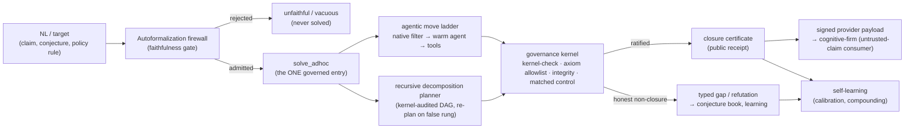

# LeanMill Architecture

> **Up:** [Documentation map](../README.md) · **Design history / decision log:** [`leanmill_design_history.md`](./leanmill_design_history.md) (the dated RCAs, A/B evidence, and "why" behind every invariant below).
>
> **Seam/spec of record:** `research_areas/seams/engine/lean/GP-225_leanmill_vnext_station_factory_seam.md`. This document owns the durable architecture; the seam owns the live operating spec.

## 1. Overview

LeanMill is a **governed proof-search environment**: a deterministic governance kernel wrapping a `formalize → solve → govern → self-learn` pipeline over swappable frontier-model agent leaves. Its output unit is a **typed, governed exit** — a kernel-verified closure, an honest gap, or a kernel-checked refutation — never agent activity.

The distinctive bet is the **untrusted-claim regime**: where a compiling Lean proof is *necessary but not sufficient* — autoformalized mathematics, AI-generated proofs, open conjectures, and **non-mathematical compliance rules**. Competition provers optimize closure-% on *trusted* benchmarks where "it compiled" suffices. LeanMill instead makes the result *trustworthy*: every closure is re-verified by an anti-laundering kernel the leaf cannot influence, and every autoformalized statement is gated by a faithfulness firewall before any proof is attempted.

The agent leaf (codex/claude, or a trained prover) is **the substrate, not the system**. LeanMill is the environment that wraps and multiplies it. A stronger leaf is a provider-registry slot, not a missing capability.

## 2. Design Principles

These are load-bearing invariants. Each is restated cleanly here; the dated derivation and the bugs each one closed live in the design history.

1. **One governance kernel.** Exactly one anti-laundering organ stack ratifies every solving mode (cascade, governed-DAG, ad-hoc, proof-repair, family/compounding, batch). A new check is registered once as a kernel **organ** and every mode inherits it; no mode re-implements governance. Canonical: `gates/lean_proof_gate.run_anti_laundering_kernel`.

2. **One governed solve entry.** Exactly one entry — `solver_core.solve_adhoc` — runs the move space and the kernel. Every way of producing work (ad-hoc, autoformalize, notes, residual-C, proof-repair, family, iso-decompose) is a **target-producer** that routes through it via the identical interface `(target_name, source, goal, *, substrate, mode, timeout_s)`. A new capability is a producer, never a parallel solve or governance path.

3. **The Goldilocks line — determinism only at the soundness boundary, agency everywhere upstream.** Put determinism exactly where soundness *requires* it (the trust primitives) and nowhere else; give the agent full agency upstream. The test for any knob: *does soundness require this to be mechanical?* Yes → boundary, deterministic. No → agency. The two failure modes are determinism creep into the agent's lane (hand-wired routers/statements cripple the leaf) and agency leak into the boundary (agent as its own judge → laundering).

4. **The solver builds proofs; it is not a Mathlib lookup.** A missing Mathlib lemma is a *sub-goal to prove*, never a wall. A Mathlib survey maps the **build-frontier** (citable foundation vs. the decomposition tree to construct), not a no-go zone. The matched-negative-control organ exists precisely to *reject* the degenerate "proof = library lookup."

5. **Governance is the differentiator; the exogenous moves are a reliability layer.** A shell-enabled frontier leaf can reproduce the SymPy/SMT moves itself (measured). What it *cannot* do is police itself — so the genuinely defensible capability is the deterministic anti-laundering kernel, not the move catalogue.

6. **One WorkItem contract.** Theorems, theory (definitions + API lemmas), and manifests are all typed, receipt-bearing work (`contracts/work_items.py`). Receipts are machine-consumed first (fed into the next dispatch), human-rendered second; the conservation rule is that any later item can build on a receipt **without re-derivation**.

## 3. The Soundness Model

The single guarantee: **no false closure.** A `closed` from the solver is an *unratified proposal*; only the kernel verdict ratifies. The trust boundary is a small set of **deterministic** primitives the agent cannot influence:

- **Kernel proof-check** — the Lean kernel re-verifies the proof term.
- **Axiom allowlist** — `#print axioms` on the closed decl must be ⊆ `{propext, Classical.choice, Quot.sound}`; `sorryAx`, `native_decide`'s `ofReduceBool`, and any other axiom are rejected.
- **Statement integrity** — the proved statement and every definition/structure it depends on are unaltered (no def-shell, no instance/notation/macro/`set_option` that changes meaning).
- **Matched-negative-control** — the proof must *need* the source prelude; a proof that compiles against bare Mathlib was a lookup, not a closure.
- **Non-degeneracy** — the statement is not vacuously true (instance battery / non-degenerate-instance probe).
- **Canonical re-elaboration** — strips added instance/notation context and recompiles; if the target no longer closes, the proof depended on a semantic hijack.

Gates **fail-open** on tooling-inconclusive and **fail-closed** only on a *confirmed* violation. Because soundness lives entirely at this boundary, the agent above it is fully free: a false sub-lemma fails honestly (no false closure), which is what makes agent-generated decompositions non-iatrogenic.

## 4. System Architecture

LeanMill is a set of components separated by typed contracts. Each owns one responsibility and exposes one interface; none invents a local meaning of "done", "closed", or "credit-ready".

### 4.1 Governance Kernel (`gates/`, `solver/governance*`)
The soundness boundary of §3 — an extensible organ stack plus the axiom-allowlist gate and matched controls. Anti-laundering findings are catalogued to a cross-substrate registry (`gaming_vector_catalog.jsonl`); the gaming-pattern hardener (`common/kernel_hardener.py`) is shared with autoresearch. The kernel never trusts "it compiled."

### 4.2 Autoformalization Firewall (`solver/autoformalize.py`)
Gates the solver: an unfaithful, vacuous, or trivial NL→Lean statement is rejected *before* any proof is attempted. Legs, fail-closed (admit only on a positive signal):

| Leg | Checks |
|---|---|
| Compilation | typechecks with `sorry` |
| Non-triviality | cheap tactics can't close it; not vacuously true |
| Structural faithfulness | binder counts, conclusion operator, quantifier order match the reference (catches dropped hypotheses, weakened conclusions, quantifier reordering) |
| Semantic instance battery | the predicate must `decide` to human-labelled cases — ground truth, not opinion |
| SMT-boundary battery | z3 finds the exact decision-flip edge over ∞ domains (`SmtPolicyChecker.threshold_cases`); Lean kernel ratifies each case |
| Round-trip judge | back-translate to NL; a cold cross-family judge (majority-of-N) must rule it the same problem |
| Cross-vote consensus | ≥2 independent formalizers agree on a kernel-equivalent statement |

The deterministic structural carrier **overrides** a charitable LLM judge. The instance + SMT-boundary legs are what let the firewall apply **beyond mathematics** (compliance policy, see §4.6).

### 4.3 Solver Lane (`solver/solver_core.py`, `solver/isomorphism_decompose.py`)
The agentic-PROPOSE / deterministic-RATIFY engine. The leaf *is* the agent (`agentic_leaf.default_dispatch` over a shared durable warm-session manager). Two layers:

- **Agentic-first move ladder.** A free deterministic filter (`native_hammer`) → the warm agent (`claude_warm`, tool-equipped) → decomposition (`conjecture`). The agent decides per node; cold one-shot provers are a fallback. Exogenous moves (witness-transport, abduce/QE, Groebner/nlsat/SOS transport edges, Isabelle hammer) are agent-electable tools (`agent_tools`/`move_cards`), kernel-arbitrated.
- **Recursive decomposition planner** (`route_and_solve`). On an honest non-closure the warm leaf *generates* a decomposition; the **kernel audits it** (`decomposition_dag_audit`: sorry-free, non-circular, every-lemma-used, proves-G); sub-lemmas solve through `solve_adhoc` (recursion, depth-bounded); the parent closes only via `composite_ratify`'s anti-laundering kernel. A planner sub-lemma proven false (kernel-checked ¬G) triggers a bounded **re-plan** with the agent's correction. The planner is a *contract the fungible leaf fills*, not a separate agent.

### 4.4 Cross-Substrate Layer (`common/cross_substrate_consensus.py`, Isabelle/SMT)
Lean is the closure arbiter; Isabelle and SMT are independent peers. **Propose→ratify**: SMT proposes an adversarial boundary, the Lean kernel certifies it. **Consensus**: ≥2 independent substrates (each with its own NL→formal translation) reconcile verdicts on one claim — agreement is trust-lift, disagreement localizes a *translation bug* with no human. An Isabelle verdict is a corroboration signal, never a Lean closure.

### 4.5 Self-Learning Layer (`solver/move_calibration.py`, forecast pool, `proof_cache`, `no_good_store`, `faithfulness_store`)
Loops scored on the **exogenous kernel verdict**, never model self-narration: move-prior calibration (carrier-liveness-gated against dead-instrument contamination), the diverse external forecaster pool (advisory routing), the verified-win / confirmed-refutation / faithful-correspondence memos, and error-conditioned fix memory. Soundness-isolated: a bad learned value costs efficiency, never a false closure.

### 4.6 Formal-Verification Provider Boundary (`formal_verification_provider.py`)
LeanMill is a `formal-verification-provider/v1` **provider**: it runs the firewall + kernel and emits a provider-neutral, Ed25519-**signed** payload that an external governance kernel (cognitive-firm) records. Payload-only boundary — no import coupling either way. Verdict map: `verified` (faithful + checker-closed + ratified), `refuted` (kernel counterexample), `invalid` (unfaithful / anti-laundering failure — a *different* statement was proved), `inconclusive`. This is the seam through which the **non-math wedge** delivers value: a laundered compliance rule is caught by the LeanMill kernel and rejected by an independent firm's governed bundle, cryptographically chained (demo: `scripts/public/control/leanmill/nonmath_cognitive_firm_demo.py`).

### 4.7 Factory & Work Bus (`work_queue.py`, `contracts/`, stations)
The distributed control plane: a durable queue (`work_items`, leases, terminal state, heartbeats) is the system membrane. Stations specialize *work*, never *contracts*. The MECE contract spine (§6) is the invariant; agents may propose YAML/sources/repairs but cannot ratify proof value. The residual-C credit lane, source-growth routing, and family lifecycle are factory concerns layered on the same bus.

## 5. End-to-End Control Flow

A producer (notes blueprint, residual-C row, repair) enters at NL/target; everything converges on `solve_adhoc` → kernel → certificate-or-honest-gap. Only the kernel decides whether evidence becomes credit.

## 6. Contracts

LeanMill's complexity is held by a **smaller set of non-overlapping contracts**, not more workers.

- **Typed kernel seams (`contracts/kernel.py`, pydantic).** Cross-module data is typed, not bare dicts: `ProofTarget` (the row), `MoveResult`/`GovernanceVerdict`/`FirewallResult` (the outcome vocabulary — `"closed"` encoded once via read-only accessors), `primary_result` (fails loud on a missing `results` key). Config is a `YamlConfig` subclass (defaults-in-code + optional YAML override, byte-parity when absent; soundness-critical constants stay frozen). External-tool output goes through the producer's own decoder, regex only at the true boundary. Migration is highest-bug-risk-first, each behind a behaviour-equivalence test — never a blind sweep.
- **The MECE contract spine.** Work-bus, agentic-handoff, source, family, probe, governance, strict-C-credit, factory-intelligence, and policy contracts each have one canonical owner and an explicit "must not own" column. A new fact that fits no row means a contract is missing — add it before adding station-local state. The queue boundary is fail-closed: a terminal agentic patch without its required downstream receipt is stamped `skipped`, never hidden.

## 7. Distributed Operation

- **Topology.** An operator node plus one or more worker nodes (e.g. a Hetzner VPS) carry the same proof-search instruments. Code reaches a node through a curated rsync allowlist (`deploy/vps_sync_files.txt`), not git.
- **Calibration at bring-up — no node interprets a negative until its instruments pass a positive control.** `node_preflight.py` hard-fails a node unless the REPL toolchain matches the project's Mathlib oleans *and* `import Mathlib` truly loads (positive controls + false-accept guard + sorry-gate). This mechanizes the dead-REPL lesson (a toolchain mismatch silently turned every probe into a false negative).
- **Warm substrate.** A persistent Lean REPL (`PersistentLean`) amortizes Mathlib elaboration; campaign theory is elaborated once into a warm env so per-probe verify is milliseconds, not minutes. The warm-agent session manager (`common/subscription_agent_runtime.py`) persists and resumes the leaf across process boundaries.
- **Resilience.** Every blocking-op timeout resolves through one central factory (`common/timeouts.py`: defaults-in-code + env override + `clamp_to_remaining`), so a hung sub-call can't silently eat the budget. Observability is a single regenerating dashboard (solver-lane telemetry, autoformalizer funnel, factory intelligence, non-math wedge, compounding curve).

## 8. Positioning

| System | Approach | Reported results |
|---|---|---|
| LEAP (Google, 2026) | Agentic general LLM, no fine-tuning; blueprint → Lean → compiler-feedback over an AND-OR DAG with memoization | Putnam-2025 12/12; Lean-IMO-Bench 56.7% |
| AlphaProof (DeepMind, 2024) | RL-trained prover + large search | IMO-2024 silver-medal level |
| DeepSeek-Prover, LeanCopilot | Fine-tuned Lean provers | pluggable as a LeanMill provider slot |

**Convergent (corroborating, not differentiating):** the obligation DAG (`governed_dag_search`), lemma memoization (`proof_cache`), compiler-feedback refinement, and backward decomposition are independently arrived at by these systems.

**Distinctive:** the governance kernel and the regime it targets — closure verification beyond "it compiled" (matched-negative-control, non-degeneracy, statement-integrity, axiom allowlist), the faithfulness firewall on autoformalized statements (extending **beyond mathematics** to compliance policy), self-learning scored on the exogenous verdict, and the signed cross-repo provider boundary. These matter most where a compiling proof is necessary but not sufficient.

**Honest scope (the claim register).** LeanMill does **not** yet claim a measured leaderboard benchmark (Putnam/IMO) — adopting a shared discriminating benchmark is open work. Measured to date: the non-math firewall vs. a steelmanned LLM judge holds **precision + verifiability** (perfect, zero false-alarms, every verdict an auditable certificate) on clearly-stated launders, and a **catch-rate lift** (the deterministic structural carrier catches subtle launders — ≤→<, dropped hypothesis, quantifier reorder, ∧→∨ — a plain judge misses, with zero false-rejects), with the end-to-end signed flow into cognitive-firm validated. The frontier-leaf benchmark number and a hard kernel-certified open closure remain the two open bars.

## 9. Open Areas

Tracked in the design history's capability-discipline ledger; the current frontier:

- **Benchmark number** — publish miniF2F / PutnamBench closure-% with the governance kernel on, comparable to LEAP/DeepSeek-Prover.
- **Hard closure** — land one kernel-certified open closure with public receipts (the Lam–Litt order-1 program is the active campaign).
- **Non-math catch-rate at scale** — extend the measured subtle-launder lift across compliance domains; wire judge diversity (Dawid–Skene reliability weighting) once a multi-judge panel substrate exists.
- **Cross-substrate disagreement as a first-class faithfulness signal** — productionize the consensus layer's translation-bug localization.

Every claim added here keeps the register honest: nulls are kept, and a capability is listed as *measured* only with an exogenous receipt.
