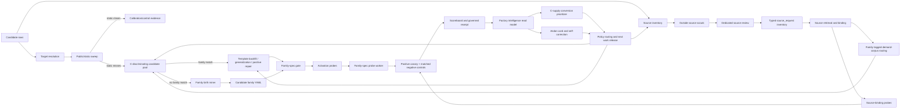
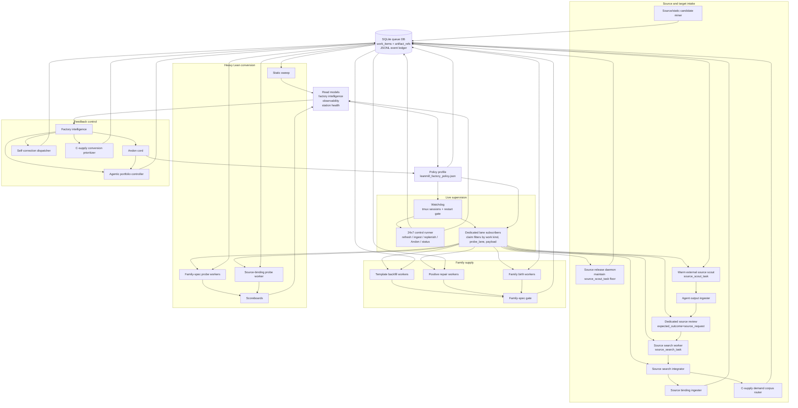

# LeanMill design history and decision log

> This is the dated research/decision log (the full derivation and "why" behind every invariant and capability: RCAs, measured A/B results, retired approaches, the chronological record). The durable, structured architecture lives in [`leanmill_architecture.md`](./leanmill_architecture.md). This file preserves the history so nothing is lost and settled decisions are not re-litigated. Append dated entries here; keep the architecture doc clean.
>
> Up: [Documentation map](../README.md)
>
> Current seam/spec: `research_areas/seams/engine/lean/GP-225_leanmill_vnext_station_factory_seam.md` and `research_areas/specs/active/engine/lean/GP-225_leanmill_vnext_station_factory_spec.md`.

LeanMill is a station workflow for Lean proof work. Its output unit is a typed learning-unit exit, not agent activity. Proof value is credited only when the execution artifact passes governance and matched controls. Everything else is inventory, routing signal, repair work, or retirement evidence.

## Table of Contents

- [INVARIANT, ONE governance kernel, shared across all solving modes (2026-06-04)](#invariant-one-governance-kernel-shared-across-all-solving-modes-2026-06-04)
- [INVARIANT, ONE governed solve entry (`solve_adhoc`); every lane is a target-PRODUCER through it (2026-06-05)](#invariant-one-governed-solve-entry-solve_adhoc-every-lane-is-a-target-producer-through-it-2026-06-05)
- [SETTLED, the leaf solver IS the agents; leanmill is the environment (do not re-litigate)](#settled-the-leaf-solver-is-the-agents-leanmill-is-the-environment-do-not-re-litigate)
- [SETTLED, the Goldilocks line: determinism ONLY at the soundness boundary, agency everywhere upstream (2026-06-11)](#settled-the-goldilocks-line-determinism-only-at-the-soundness-boundary-agency-everywhere-upstream-2026-06-11)
- [INVARIANT, the solver BUILDS new proofs; it is NOT a Mathlib lookup (do not re-forget)](#invariant-the-solver-builds-new-proofs-it-is-not-a-mathlib-lookup-do-not-re-forget)
- [SETTLED, the exogenous moves are a RELIABILITY layer, the GOVERNANCE is the differentiator (do not re-litigate, 2026-06-09)](#settled-the-exogenous-moves-are-a-reliability-layer-the-governance-is-the-differentiator-do-not-re-litigate-2026-06-09)
- [INVARIANT, ONE WorkItem contract: theorems, THEORY (defs + API), and manifests are typed, receipt-bearing work (2026-06-13)](#invariant-one-workitem-contract-theorems-theory-defs--api-and-manifests-are-typed-receipt-bearing-work-2026-06-13)
- [Comparable systems and positioning](#comparable-systems-and-positioning)
- [Core boundary](#core-boundary)
- [MECE contract spine](#mece-contract-spine)
  - [Queue-boundary fail-closed rule](#queue-boundary-fail-closed-rule)
  - [Anti-duplication rule](#anti-duplication-rule)
- [Typed contracts: the kernel data seams (#49)](#typed-contracts-the-kernel-data-seams-49)
- [Main lanes](#main-lanes)
- [Solver lane subsystem](#solver-lane-subsystem)
  - [Provider router (move generators)](#provider-router-move-generators)
  - [Premise-shelf retrieval](#premise-shelf-retrieval)
  - [Proof-state telemetry (partial-progress gradient)](#proof-state-telemetry-partial-progress-gradient)
  - [Orchestration measurement (matrix vs the production lane)](#orchestration-measurement-matrix-vs-the-production-lane)
  - [General proof-search engine (GP-246 v3: conjecture · verify · cache)](#general-proof-search-engine-gp-246-v3-conjecture--verify--cache)
  - [Agentic leaf solver + the calibrated multi-step lever (GP-246, validated 2026-06-02)](#agentic-leaf-solver--the-calibrated-multi-step-lever-gp-246-validated-2026-06-02)
  - [Closure integrity (unchanged invariants)](#closure-integrity-unchanged-invariants)
  - [Implementation reference: the complete solver-lane map (read this BEFORE proposing to build planner/decompose/recursion machinery; it already exists)](#implementation-reference-the-complete-solver-lane-map-read-this-before-proposing-to-build-plannerdecomposerecursion-machinery-it-already-exists)
- [End-to-end process flow](#end-to-end-process-flow)
  - [Source-growth routing](#source-growth-routing)
- [Distributed node topology and bring-up calibration](#distributed-node-topology-and-bring-up-calibration)
  - [Deploy and env provisioning (mechanized, for N nodes)](#deploy-and-env-provisioning-mechanized-for-n-nodes)
- [Stations and worker topology](#stations-and-worker-topology)
- [Worker specialization and conflict points](#worker-specialization-and-conflict-points)
- [Family lifecycle](#family-lifecycle)
- [Current credit definition](#current-credit-definition)
- [Restart and resume contract](#restart-and-resume-contract)
- [Strict C yield formula](#strict-c-yield-formula)
- [Mechanism vs competitive evidence](#mechanism-vs-competitive-evidence)
- [Agentic execution modes](#agentic-execution-modes)
- [Handoffs that must stay mechanized](#handoffs-that-must-stay-mechanized)
- [Operational read model](#operational-read-model)
- [Scaling rule](#scaling-rule)
- [Benchmark boundary](#benchmark-boundary)
- [Open areas for exploration (lift-mindful roadmap)](#open-areas-for-exploration-lift-mindful-roadmap)
  - [Open research directions by axis](#open-research-directions-by-axis)
  - [Mission apparatus, the mathematician×alien reconciliation (audit 2026-06-12, #124)](#mission-apparatus-the-mathematicianalien-reconciliation-audit-2026-06-12-124)
  - [Untrusted-claim verification, open build directions (the trust axis)](#untrusted-claim-verification-open-build-directions-the-trust-axis)
  - [Formal-verification PROVIDER boundary (cognitive-firm integration)](#formal-verification-provider-boundary-cognitive-firm-integration)
  - [Self-learning / compounding taxonomy (catalogued 2026-06-10)](#self-learning--compounding-taxonomy-catalogued-2026-06-10)
  - [Resilience & observability, the unbounded-blocking-wait class + the timeout factory (2026-06-10)](#resilience--observability-the-unbounded-blocking-wait-class--the-timeout-factory-2026-06-10)
  - [Adversarial bug-class audit + fail-closed hardening (2026-06-13)](#adversarial-bug-class-audit--fail-closed-hardening-2026-06-13)
  - [Capability A/B-discipline ledger (audit 2026-06-07)](#capability-ab-discipline-ledger-audit-2026-06-07)
  - [Move-carrier integrity and the open lift question](#move-carrier-integrity-and-the-open-lift-question)

## INVARIANT, ONE governance kernel, shared across all solving modes (2026-06-04)

There is exactly ONE governance kernel, and EVERY solving mode,
cascade, governed-DAG, ad-hoc (`solve_adhoc`), proof-repair, family/compounding, batch C-row, ratifies
through it. The kernel is the anti-laundering organ stack (`gates/lean_proof_gate.run_anti_laundering_kernel`,
renamed 2026-06-06 from the cryptic `_run_v33_anti_laundering`; back-compat alias kept; run by `proof_audit`)
+ the axiom-allowlist gate (the leaf's `#print axioms`) + matched-negative-control.
It is EXTENSIBLE BY ORGAN: a new governance check (e.g. `statement_integrity`, the def-alteration organ
added 2026-06-04) is registered ONCE in the kernel and every mode inherits it, it is NEVER bolted onto a
single mode. Rules: (1) no per-mode governance re-implementation (that is the duplicated governance path this invariant
forbids, it bred the duplicated-axiom-gate + ad-hoc-only-integrity bugs); (2) gates fail-OPEN on
tooling-inconclusive, fail-CLOSED only on a CONFIRMED violation; (3) solver `closed` is an UNRATIFIED
PROPOSAL, only the kernel verdict ratifies. `statement_integrity` is now a KERNEL ORGAN (in
`run_anti_laundering_kernel`, activated by passing `original_source`), so every mode inherits def-alteration
protection. Re-confirmed 2026-06-06: a `proof_cage` experiment (a Cage of a REDUCED gate set,
kernel/MNC/statement_integrity/axiom, beside the kernel) was exactly the per-mode re-implementation this
invariant forbids (a strict subset of the kernel's 6 organs) and was RETIRED; the fix is to REUSE
`run_anti_laundering_kernel` at the solver-lane gate (`_validate_against_contract`), which currently
ratifies on kernel-compile∧MNC and DEFERS the organ stack, `ZTARE_KERNEL_OBSERVE=1` logs what the kernel
would flag there (observe-first), ahead of folding its verdict into solve-time `credit_ready`. Backlog of mode-local governance bugs FIXED 2026-06-04 (cold-review-found): MNC now functional
(builds `theorem X <goal> := by body` from the row's goal, was a structural no-op) + FAIL-OPEN on
tooling/unknown-identifier (was false-rejecting on lake-absent); eligibility ignores governance-REJECTED
closures (`ratified=0` no longer poisons the queue); ratification stamps ONLY closing (`compile_ok=1`)
attempts (no fake per-move wins); source-slice is exact-prefix (no `LIKE` wildcard swallow);
governance-not-run flags `integrity_unverified`. RESIDUAL (deeper migration, not bugs): `est_p_close` is now recorded on EVERY mode, `_record_attempt`
auto-derives it from the provider via `PROVIDER_TO_MOVE → _move_prior` when a caller didn't pass it
(2026-06-04, kernel-fashion one-place fix). STILL OPEN: the cascade/DAG-typed closure path
(`_validate_and_maybe_close`) runs the MNC + kernel-compile receipt but NOT the v33+statement_integrity
organ stack inline, those reach batch closures only via the downstream `proof_audit` worker, and the
ad-hoc path inline. The clean unification = one `govern_closure()` the cascade/DAG path also calls
(reconstruct probe = source-with-sorry→proof_text, original = row source); deferred as a careful refactor,
not rushed (rushing shared governance is what created the duplicated-path failure).

Context-semantic-hijack organs + the cross-substrate kernel-hardener (2026-06-06). The FALSIFY
false-statement control (a calibration probe over known-FALSE targets) surfaced an actual laundering vector:
the leaf ADDS a `local instance : HAdd α Nat α where hAdd a _ := a` so `n+1` elaborates to `n`, a
VERBATIM statement (`∀ n, n=n+1`) is semantically hijacked, `statement_integrity` passed (signature text
unchanged; the instance is an "added helper decl"), and `#print axioms` was clean. RCA: syntactic
preservation ≠ semantic preservation, meaning depends on the ELABORATION CONTEXT. Two new organs close
the class: (1) `statement_integrity` now flags an ADDED instance providing a CORE operation class (fast
lexical leg); (2) `canonical_reelaboration.check` (wired into `run_anti_laundering_kernel`,
`ZTARE_CANONICAL_REELAB`, default-ON) is the airtight backstop, it STRIPS added instance/notation/macro/
set_option context (KEEPS opens + lemmas) and recompiles; if the target no longer closes, the proof
DEPENDED on the manipulation (`context_hijack_confirmed`). It recompiles ONLY when there is hijack-context
to strip, so cost is paid only on suspect probes., This is a gaming finding, so it is cataloged: the
gaming catalog is now the cross-substrate registry `analytics/public/queries/gaming_vector_catalog.jsonl`,
and the [GP-086](../../research_areas/seams/apparatus/cage/GP-086_cage_kernel_hardening_seam.md) cage gaming-pattern hardener is generalized into a shared `common/kernel_hardener.py`
contract (`KernelHardener` + `GamingVector` + `to_cage_gate`) instantiated by BOTH autoresearch
(`validator/autoresearch_hardener`, wraps `sandbox_gaming_extractor` + Cage gates) and leanmill
(`leanmill/solver/leanmill_hardener`, organs as `POST_JUDGE`/`proof_target` `cage.Gate`s), neural mining
allowed ([GP-248](../../research_areas/seams/engine/GP-248_neurosymbolic_boundary_seam.md) proposer column), gates always deterministic.

## INVARIANT, ONE governed solve entry (`solve_adhoc`); every lane is a target-PRODUCER through it (2026-06-05)

There is exactly ONE governed solve entry, `solver_core.solve_adhoc` (and its `solve_adhoc_governed`
retry wrapper), which runs the move space + the ONE governance kernel. EVERY way of producing work is a
target-PRODUCER that routes through it via the SAME interface `(target_name, source, goal, *, substrate,
mode, timeout_s)`; none re-implements solving or governance:
- ad-hoc, the CLI `adhoc` → `solve_adhoc_governed`.
- autoformalize, `autoformalize_and_solve` → `default_solve` → `solve_adhoc` (after the faithfulness firewall admits the statement).
- autoformalize-from-notes, `autoformalize_notes.autoformalize_from_notes`: a blueprint (NL `## Target` + `## Lemmas`, dependency order) → per-line `autoformalize_and_solve` → a citable proven-lemma SHELF; every line still routes through `solve_adhoc`. The blueprint is also threaded into the recursive planner as decomposition guidance (the `notes=` channel, see the Solver Lane reference). A thin LITE loop, NOT the autoresearch evidence-mutation machinery (`orchestrator.mutator_briefing` does open-ended discovery; this proves a KNOWN blueprint).
- residual-C / work_queue, the C-row lane → `solve`; governance-rejection retry is "PARITY with the C path".
- proof-repair, `proof_repair.repair` → `solve_adhoc` (after confirming the break).
- family / compounding, `solve_family` → `solve_adhoc` per sibling.
- iso-decompose (deanchor→isomorphism→audit), `isomorphism_decompose.solve_decomposition` → `solve_adhoc` per audited lemma. It is a PRODUCER, not a lane: it emits audited sub-goals; the kernel solves+ratifies them. (Parallel-path risk caught + fixed 2026-06-05: it previously dead-ended at the audited DAG without routing through `solve_adhoc`.)

SHARED PRIMITIVES the producers/lanes invoke (never fork): `agentic_leaf.default_dispatch` (the leaf,
which dispatches the codex/claude subscription agent through the SHARED durable warm-session manager in
`common/subscription_agent_runtime.py` (`get_or_create_warm_session` / `persist_warm_session` /
`warm_session_recovery_callbacks`): a disk-persisted, staleness-rotated, self-healing CLI conversation keyed
by (runtime, agent_id) so the fungible leaf's formalize→plan→solve dispatches share ONE warm agent and
RESUME across process / queue-work-item boundaries. This is the SAME manager the residual-family factory
workers run (`agent_repair_worker`, warm default-ON), extracted to the shared lib 2026-06-11 after the #96
in-memory hand-rolled copy in `agentic_leaf` diverged from it (the "two warm systems" duplicated path the
operator flagged). RULE: a caller NEVER hand-rolls subscription dispatch or session handling, it goes
through `default_dispatch` + the shared warm-session manager. A warm session is a PERFORMANCE CACHE of the
fungible leaf, NOT a persistent identity (leaf fungibility preserved; `ZTARE_LEANMILL_WARM_AGENTS=0` → cold).),
`conjecture.{conjecture_advances, decomposition_dag_audit}` (decomposition soundness), `proof_cache`
(verified-win memo), `no_good_store` (confirmed-refutation memo), `statement_integrity` (kernel organ),
`obstruction_to_conjecture` (refutation→targeted seed), `RefineHandover` (the ONE produce→verify→
feedback→refine loop), `failure_class.classify_failure` (the apparatus-vs-math tagger, convergent
eigenquestion gemini+codex 2026-06-05; reuses `proof_state` error-class + `residual_to_lever` signatures;
tags EVERY non-closure APPARATUS [gating/budget/toolchain] vs MATH [true kernel dead-end] so an
apparatus limit is never laundered as math-hard; wired into `solve_adhoc`'s return). RULE: a new capability is a PRODUCER that routes through `solve_adhoc` + composes
these shared primitives, it does NOT add a parallel solve path or parallel governance. The audit gates
reduction-SOUNDNESS; `solve_adhoc`'s kernel gates lemma-TRUTH, so a false sub-lemma fails cleanly
(no false closure), which is what makes producer-generated decompositions non-iatrogenic.

## SETTLED, the leaf solver IS the agents; leanmill is the environment (do not re-litigate)

The leaf solver is the subscription agents (codex/claude), swappable. **leanmill is the
ENVIRONMENT** (governed DAG + conjecture + cache + compounding + the ONE governance kernel) that
wraps and multiplies that leaf; it is itself a meta-solver. A stronger leaf (an RL/trained prover,
DeepSeek-Prover, LeanCopilot) is an OPTIONAL, already-supported provider-router registration
(a slot in `src/ztare/leanmill/providers/` `REGISTRY` (typed `Provider` ABC) + the cold fan-out in
`solver/llm_provers.py`; the old `leanmill_provider_registry.py` name is retired), NOT a missing capability and NOT a requirement. **Do NOT
re-raise "we need a trained/external prover"**, that is the trained-prover (AlphaProof) path and is
off the design here; the leaf is the agents, and the open question is whether the ENVIRONMENT improves
their closure rate (the SCALE / coherent-theory-build-up test), not leaf compute.

## SETTLED, the Goldilocks line: determinism ONLY at the soundness boundary, agency everywhere upstream (2026-06-11)

The operative corollary of "the leaf IS the agents", be CRISP about it; getting it wrong is what causes churn.
Put DETERMINISM exactly where soundness REQUIRES it, and NOWHERE else; put AGENCY everywhere upstream.
- Deterministic (the harness owns, mechanical, non-negotiable, the TRUST PRIMITIVES): the Lean kernel
  proof-check, the `#print-axioms` allowlist audit, `statement_integrity` (anti-laundering), the faithfulness
  GATE's pass/fail decision, the non-vacuity / matched-negative-control probes, budgets/sandbox. Mechanical so a
  closure is trustworthy REGARDLESS of what the agent did.
- Agentic (the agent owns, its OWN actions): formalize, choose/correct the STATEMENT, decompose, route
  moves, prove, construct witnesses, reformulate, decide when to gap. The harness gives GOAL + ENVIRONMENT
  (warm Lean, tools, Mathlib) + HARD RULES + TRUST, never the procedure.
- Test for any knob: does soundness REQUIRE this to be mechanical? yes → boundary, deterministic; no →
  agency. Err toward agency UPSTREAM + determinism AT THE BOUNDARY; no fuzzy blend in the middle.
- The two failure modes (both observed 2026-06-11): (a) determinism CREEP into the agent's lane (hand-wired
  routers, hand-crafted statements/hypotheses, prescriptive tool menus, a strict-EQUIVALENCE faithfulness judge
  that rejected a CORRECT constructive formalization) → cripples the frontier leaf + induces oscillation
  (over-determine → over-correct); (b) agency LEAK into the boundary (agent as its own faithfulness judge) →
  laundering. The reformulation re-entry, the soft `STATEMENT-FALSE` signal, full-auto permissions, and the
  DIRECTIONAL-for-proving judge are all instances of moving determinism OFF the agent's lane and concentrating
  it at the boundary. Before adding ANY logic ask: trust primitive (mechanical) or thinking step (agentic)?

## INVARIANT, the solver BUILDS new proofs; it is NOT a Mathlib lookup (do not re-forget)

leanmill CONSTRUCTS proofs from first principles. **A missing Mathlib lemma is a SUB-GOAL to prove, never
a wall and never a reason to retarget to the "supported" side.** The whole point, the open-problem regime
that is leanmill's defensible niche, is proving things for which NO pre-existing proof exists to compose.
So when a target needs machinery Mathlib lacks (e.g. P1/Denef-Lipshitz needs algebraic-power-series theory
Mathlib does not have), the move is to DECOMPOSE the missing piece into intermediate lemmas
(`MOVE_CONJECTURE` / the variant-curriculum library) and recurse until the leaves rest on the citable
foundation, the solver constructs the interior. A Mathlib survey therefore maps the BUILD-FRONTIER
(citable foundation vs the to-be-constructed decomposition tree), NOT a no-go zone; sequence the most
foundational sub-lemma first and build up. The matched-negative-control organ exists precisely to reject the
degenerate case where a "proof" IS just a Mathlib lookup, i.e. lookups are the thing governance guards
AGAINST, not the solver's mode of operation. Recurring failure to avoid: surveying Mathlib, finding a gap,
and concluding "avoid that direction", that silently demotes the meta-solver to a library composer and
abandons the open-problem regime (operator correction, 2026-06-05).

Competitive landscape, LEAP (Google Cloud AI Research / DeepMind, arXiv:2606.03303, 2026-06-03). An agentic Lean prover on Gemini-3.1-pro, no fine-tuning: informal blueprint → Lean → iterative compiler-feedback refinement, over an AND-OR DAG with shared-lemma memoization + DFS backtracking + an LLM decomposition-reviewer. Results: Putnam-2025 12/12, Lean-IMO-Bench 56.7% advanced, beats Aristotle, one-shot <10%→70%. This is independent evidence for the general-leaf + agentic-environment approach at scale (no trained prover → SOTA), and it convergently rebuilds several of our pieces (their AND-OR DAG = `governed_dag_search`; their memoization = `proof_cache`; their compiler-refinement = our gap-refine / `autoformalize_refine`; their blueprint-decomposition = `MOVE_CONJECTURE`). What LEAP has that we don't: external benchmarks (Lean-IMO-Bench) + a frontier-leaf result. What we have that LEAP does NOT: the governance kernel, anti-laundering, matched-negative-control (is the proof just a Mathlib lookup?), nondegenerate-instance probe (is the statement vacuously true?), faithfulness firewall on autoformalized statements. LEAP trusts "it compiled," which is sufficient for KNOWN-TRUE competition statements but not for OPEN problems (untrusted statement; "compiles" can be a vacuous/laundered shell). The target regime here is the untrusted-statement / open-problem case. Rescue/adopt (all published): (1) adopt Lean-IMO-Bench / Putnam-2025 as the DISCRIMINATING target tier (unblocks the cascade-vs-DAG A/B, SVD was too easy); (2) LEAP's blueprint-decomposition + memoization lift (73→83%) is direct evidence to WIRE THE DEAD `MOVE_CONJECTURE` production path over the spraying moves; (3) leaf = frontier model + governed search, NOT self-training (LEAP needs no fine-tuning).

## SETTLED, the exogenous moves are a RELIABILITY layer, the GOVERNANCE is the differentiator (do not re-litigate, 2026-06-09)

Empirically resolved (transcript-proven): the exogenous-compute moves (witness-transport / abduce-QE / sledgehammer) are NOT a capability edge over a shell-enabled frontier leaf. On an un-tabled Pell (D=4093, 21-digit core solution) with the witness tool OFF, the leaf wrote and ran its own `python3` continued-fraction solver and closed; on a tabled D it recalled the witness. The leaf reproduces the move itself. The witness `12/12` lift holds vs Lean tactics (`native_hammer`), but NOT vs the agent. So the moves' value is reliability + cost + determinism (a curated 1s sandboxed tool the leaf *prefers* over hand-rolling a solver, measured: with the tool working, the leaf used it, 5 tool-calls / 0 self-coded; with it broken it self-coded in 124s), NOT new capability. Do NOT re-raise "are the moves alien / a capability edge", they are not.

The truly alien differentiator is the governance, the same point as the LEAP comparison above, now demonstrated under adversarial pressure: on the OPEN denef_lipshitz target the leaf produced 3 closes that compiled, had no `sorry`, and had clean axioms, a naive "it compiled" verifier (LEAP) accepts all three; `statement_integrity` caught all three as laundered (`ratified=0`). That is the capability you cannot get from a stronger leaf, because the leaf is the thing being policed. Architecture, settled: leaf orchestrates + may CALL the exogenous-compute moves as tools (`agent_tools` surfaced via `move_cards`, behind `ZTARE_LEANMILL_AGENT_TOOLS`); the kernel + anti-laundering governance ratifies (deterministic). A truly alien MOVE would require what the leaf cannot reproduce in its sandbox (a trained specialist, or beyond-sandbox compute), an explicit, separate bet, not the SymPy-wrapper moves.

Recursive planner (the strategy layer), DEFAULT-ON 2026-06-09. Decomposition is NOT an `agent_tools` card, it is `isomorphism_decompose.route_and_solve`, the recursive planner-executor (the DeepSeek-Prover-V2 / BFS-Prover-V2 / LEAP shape): on a LEGITIMATE non-closure (`exact_gap/rung/new_sub_target` (+ cascade `open`/`failed`), never a caught cheat, direct-failure is the decompose signal; NOT gated behind triage `strong_missing`, which mis-tags formalized targets, see the Implementation Reference), the warm leaf generates the decomposition (deanchor prompt + iso hints, the leaf IS the planner; the iso-catalog is only a hint, NOT a rigid plan-source), the kernel audits it (`conjecture.decomposition_dag_audit`: sorry-free + non-circular + every-lemma-used + proves-G, a KERNEL decomposition-reviewer, vs LEAP's *LLM* reviewer = the governance differentiator), it re-plans on kill (bounded `RefineHandover`), proves each sub-lemma through the ONE governed solver (`solve_decomposition` → `solve_adhoc`, which re-enters this route on a sub-rung's `exact_gap` → recursion, depth-bounded `ZTARE_ISO_MAX_DEPTH=2`), then composite-ratifies the parent (`composite_ratify`'s anti-laundering kernel). One flip (`solver_core` gate `ZTARE_LEANMILL_ISO_ROUTE`, default-on, `=0` reverts) covers adhoc / autoformalize / proof-repair / residual-C (all route through `solve_adhoc`). SOUND BY CONSTRUCTION at default-on (parent closes only via the composite kernel; caught cheats excluded; fires on the legitimate non-closure, `ZTARE_LEANMILL_ISO_STRONG_ONLY=1` narrows it back to triage `strong_missing` for cost-bounded batches). The planner is a CONTRACT/layer the fungible leaf fills, no separate persistent planner agent (preserves leaf fungibility). Do NOT fork a 4th decompose path (the menu `MOVE_CONJECTURE` + in-head leaf are the others); route through `route_and_solve`.

Agent-orchestrated planning, the foot-gun + the fix (#74, 2026-06-10). Today the planner HARDCODES decompose: `route_and_solve` always calls `attack` (a DECOMP DAG), and *whether/how-deep/how-wide* to decompose is fixed Python (`ZTARE_ISO_MAX_DEPTH`, `ZTARE_ISO_SAMPLES`), the agent authors the decomposition CONTENT but does not orchestrate the META-strategy. That is the old tactic-cascade pattern moved up a layer (the solving stage was already freed: the agent chooses moves via `agent_tools`/`move_cards`). The agent's actual planning catalogue is the structural moves `{DECOMPOSE, SOLVE_DIRECT, SPECIALIZE, GENERALIZE, FALSIFY, ABDUCE, TRANSPORT}` (a catalogue with dualities, specialize↔generalize, falsify↔corroborate, and gaps like induction/case-split; NOT a strict MECE partition), each with an EXISTING executor (`conjecture.specialize_generate`/`falsify_generate`/`generalize_generate`, `abduction.abduce_seed`). Steps 1+2 BUILT, `ZTARE_LEANMILL_AGENT_PLAN` flipped DEFAULT-ON 2026-06-10 (operator: a sound knob left off "to A/B" just stays dormant; =0 is the opt-out baseline arm). Step 1: the planner prompt prepends `_plan_choice_prefix` asking the agent to declare `PLAN: <ACTION>` (parsed by the SHARED `leanmill/solver/agent_output.labeled_value`, recorded to `solver_lane_plan_choices.jsonl` for lift telemetry). Step 2 (NOT "open", wired at `isomorphism_decompose.py` ~391/410): the declared action DRIVES the artifact, the prompt asks for the action-appropriate proves-G DAG (DECOMPOSE→sub-lemmas, SPECIALIZE→stronger B as L₁, GENERALIZE→general H as L₁, ABDUCE→premise A as L₁, TRANSPORT→an exogenous/cross-substrate fact (a witness / Isabelle-hammered premise / Loogle-found lemma) as L₁ via the now-default-on `agent_tools`), ALL gated by the SAME kernel `decomposition_dag_audit` (sorry-free + non-circular + each lemma required + proves-G). This is the agent ORCHESTRATING the structural move, ONE unified action-parameterized DAG producer, NOT a forked executor path (the deterministic `specialize_generate`/etc. executors remain the non-agent fallback). FALSIFY/SOLVE_DIRECT don't fit a proves-G DAG (FALSIFY → the falsify move; SOLVE_DIRECT → no decomposition). TRANSPORT = the agent's leapfrog: it consults another substrate via the exogenous tools and brings the result back as a kernel-checked Lean fact, the practical cross-substrate transport (a full Isabelle/SMT proof-term port is NOT auto-done; the agent re-derives in Lean from the hint).

Decompose-FIRST + the closure-propagation fix (#106, 2026-06-11). Two bugs surfaced on the first truly hard target (P1 RUNG A, the partial-fraction antiderivative). (1) ORDERING, `route_and_solve` (the only path that can close a target NEEDING decomposition) ran AFTER a doomed direct cascade (warm/native/cold/frontier, moves that provably can't close it) that consumed the whole `notes_target` wallclock first; the planner got the leftovers, or the run timed out before it. (2) PROPAGATION GAP (the serious one), even when the planner CLOSED the parent through `composite_ratify`'s kernel, `solve_adhoc` returned the *cascade's* `r0` outcome (a miss) and only attached the closure as `res["iso_route"]` metadata, so `autoformalize_and_solve`'s `out["solved"] = r0.outcome` reported "not solved": the recursive planner could literally never report a win through the notes channel. FIX (`solver_core.solve_adhoc`): a DECOMPOSE-FIRST pre-pass, when `_notes_carry_decomposition(notes)` (≥2 formal `theorem … := by sorry` scaffolds, a human / prior-agent blueprint, e.g. the recovered Hermite DAG seeded into the notes), run `route_and_solve` BEFORE the cascade; if it closes the parent return SOLVED + skip the cascade, else the (now-calibrated) cascade is the FALLBACK. TOP-LEVEL only (`ZTARE_ISO_DEPTH==0`, sub-lemmas inherit the parent's notes, so without this guard they'd each re-decompose on the PARENT's blueprint). Gate `ZTARE_LEANMILL_DECOMPOSE_FIRST` (default-on); byte-parity for every `solve_adhoc` caller that passes no blueprint notes. `_lift_decomposition_closure` lifts a kernel-RATIFIED `parent_closed` into the primary outcome (`closed`), SOUND (composite_ratify is the gate) with a defense-in-depth guard that REFUSES to lift a `parent_closed` carrying no actual composite proof (no phantom closures; unit-tested 5/5). Companion calibrations: the iso planner now gets the warm `lean_check_server` (~0.1s) + the full caller wallclock, it had been COLD-compiling (`lake env lean` ~90s) and getting guillotined at the 180s `propose` clamp before it could emit (the agent had an audit-passing DAG ready and lost it to the timeout); and `_PERMOVE_FRAC` ceils were dropped to the measured success times (warm 1800→360s) so the doomed cascade can't monopolise the budget. NET: the apparatus now STRATEGIZES (decomposes) before it grinds, and a decomposition win is reportable. CLOSED 2026-06-12 (the agentic-first invariant, A+B): the follow-up "make the agent self-recognize 'this needs decomposition' at EVERY node" is now built. (B) the decompose-first gate no longer requires top-level + a seeded blueprint, `_agent_recommends_decompose` (one cheap, conservative DECOMPOSE-vs-SOLVE_DIRECT agent call) fires at every node below the depth ceiling (`_below_cap`); `_is_top` now only selects WHICH notes feed the planner (the seeded blueprint at the top, a FRESH decomposition on a sub-lemma's OWN goal below, never re-decompose a sub-lemma on the parent's blueprint). So the agent orchestrates SOLVING, not just the seeded top, the Goldilocks "agent orchestrates planning AND solving" thesis, finally a built invariant. (A) the deterministic `MOVE_ORDER` cascade is demoted to the explicit NON-AGENT fallback: when the agent path is live (`AGENT_TOOLS`), `move_policy` walks the AGENT-FIRST ladder `native_hammer (free filter) → claude_warm (the agent) → conjecture (decompose)` via `_active_move_order()`, `cold_shot`/`frontier` are the redundant cold one-shots a warm, tool-equipped, iterating agent already subsumes (the P1 run burned ~13min/0-closes on them), returned only with `ZTARE_LEANMILL_FULL_CASCADE=1` (the A/B baseline) or no agent. Sound: dropping direct-proof moves only shrinks attack surface, the kernel re-verifies every closure.

STATEMENT-FALSE is now KERNEL-GATED + a confirmed-false rung RE-PLANS (#143 / Layer-B, 2026-06-14). Found by reading the agent's ACTUAL probe (not DB aggregates) on v7 P1: the leaf flagged a planner sub-lemma `-- STATEMENT-FALSE` and hand-wrote a *compiling* `¬G`, it was CORRECT (the planner's `iso_lemma1` was a bare `∀ p q f` that DROPPED the parent's denominator-unit hypothesis, so Mathlib's `(non-unit)⁻¹ = 0` breaks the quotient rule; counterexample `p=1, q=X, f=X`). Two bugs: (1) a bare `-- STATEMENT-FALSE:` comment (the leaf's CLAIM) was treated as a refutation VERDICT, `solve_adhoc` set `res["statement_false"]` with NO kernel check, and the bubble-up scan over the SHARED scratch dir mis-attributed the sub-lemma's claim to the TRUE parent, so `_solve_refutation` fired `autoformalize_and_solve`'s reformulation re-entry on a provable target → churn. The engine's own rule is *only a kernel-checked ¬G refutes*. FIX: the capture point (`solver_core.solve_adhoc`) now routes the claim through `conjecture.verify_statement_false_claim` (dispatch the skeptic → PROVE ¬G → kernel-verify, via the WARM campaign env so it does not re-starve verify; goal recovered from source for the decomposition path's empty `goal`). Only a CONFIRMED ¬G sets `statement_false` (+ `statement_false_verified`); an unverified claim lands in `statement_false_unverified` + corrective feedback and does NOT reformulate. The leaf prompt now states the rule (a counterexample must satisfy EVERY hypothesis incl. each structure field; the claim is kernel-verified). `_solve_refutation` requires `statement_false_verified` (or the `=0` opt-out). Gate `ZTARE_LEANMILL_VERIFY_STATEMENT_FALSE` (default-on). (2) even gated, a truly false PLANNER sub-lemma just STALLED, the parent can't ratify on a false rung, and the agent's correct correction was dropped. FIX: `solve_decomposition` surfaces `false_rungs` (rungs the leaf flagged AND `solve_adhoc` kernel-confirmed false), and `route_and_solve` RE-PLANS, re-runs `attack` with the correction injected as advisory planner notes ("sub-lemma X is false: <cex>; restore the dropped hypothesis"), bounded by `ZTARE_LEANMILL_REPLAN_FALSE_RUNG` (default 1 round). SOUND: the kernel `decomposition_dag_audit` + `composite_ratify` still gate every new lemma, a re-plan can never launder; it only self-corrects a hypothesis-dropping decomposition the parent actually implies. NET: the engine now distinguishes "the leaf is wrong (true lemma, hard)" from "the PLANNER is wrong (dropped a hypothesis)", and fixes the latter where it had looped on the former. The lesson (operator, "why a day of bug-fixing"): the bugs lived in the harness's handling of CORRECT agent behaviour at the decomposition boundary and were only visible by reading the agent's actual Lean artifacts, DB/log aggregates hid them.

## INVARIANT, ONE WorkItem contract: theorems, THEORY (defs + API), and manifests are typed, receipt-bearing work (2026-06-13)

Origin: the maintainer's underpowering RCA, the NS millennium-hunt track had a mature work
discipline (pattern-router action cards with receipts, a canonical residual manifest with an
anti-rehash gate, a-priori declared check-moves; itself transported from the epistemic-generation
research-log pattern vocabulary), and leanmill never received it: the solver lane could only
manufacture *theorem-shaped* goals, so the formal SUBSTRATE a frontier campaign must CREATE
(definitions, structures, API lemmas, this directly serves the "BUILDS new proofs, NOT a Mathlib
lookup" invariant above) was never a first-class deliverable. Contract:
`contracts/work_items.py` (`WorkItem`/`WorkReceipt`, pydantic per #49); design rules:

- The non-anthropomorphic invariant (the distinctive insight). The NS cards are human-diligence
  artifacts, an RD reasoning legibly, one tick at a time. LeanMill's agents are not humans and the
  architecture must not cosplay one: (a) the warm session + the ledgers ARE the agent's working
  memory, so receipts are machine-consumed first (fed verbatim into the next dispatch: gap
  text, no-goods, adjacency vocabulary, consumer obligations) and human-rendered second (the
  dashboard is a projection, never the substrate); (b) a human works ~depth-first because context
  switches are expensive, the agent switches at the cost of a prompt, so items form a **typed
  FRONTIER, not a to-do list**: traversal order belongs to the calibrated policy (UCB,
  rung-adjacency, est_p) and may jump anywhere the receipts make attackable, order is policy,
  never structure; (c) a human re-derives, the agent must never need to: **a receipt's defining
  test is that any later item can build on it without re-derivation** (the conservation discipline
  extended from closures to all work kinds).
- Three kinds, every verdict from an EXISTING organ (no parallel governance):
  `theorem_goal`, the whole solve path; its cert-ledger entry IS the receipt's formal leg today
  (the wrapper only adds `residual_class` + `consumer_check`). `theory_extension`, campaign
  phase 0 (`autoformalize_notes.theory_consolidation`): the agent CREATES/EXTENDS the
  campaign-owned theory file (defs + sorried API statements); gates = kernel compile
  (sorry-tolerant v33 probe) + append-only integrity (prior non-import lines preserved
  verbatim, in order, definition EDITING is the laundering surface; violation reverts the file
  and rejects the round); each new sorried API statement auto-becomes a `theorem_goal`.
  `manifest_update`, the NS transport: a campaign obstacle manifest (canonical open nodes +
  alias table + anti-rehash gate) so a re-vocabularized gap is recognized as an alias, never
  funded as new work (v6's recurring GAP names were exactly alias-able).
- *The receipt's three legs bind what exists*: formal leg = cert/compile/manifest-diff verdicts;
  tool leg = the exogenous-move telemetry (referenced, not duplicated); **consumer leg = DEFERRED,
  stamped only when a later item actually consumes the deliverable** (`stamp_consumer`,
  append-only), the ledger-evidenced-use rule. A `theory_extension` whose API is never consumed
  stays visibly consumer-leg-empty: decorative theory, the analogue of a decorative hypothesis,
  surfaced for an operator to see.
- *Migration is deliberate, not a sweep*: (1) v7 ships `theory_extension` live; (2) `theorem_goal`
  wrapping = pure annotation on the cert ledger (zero behavior change); (3) the obstacle manifest +
  consumer-leg stamping in the compounding loop; (4) scheduler-consumes-WorkItems last, behind
  calibration evidence. This section is the design of record (no standalone doc).

## Comparable systems and positioning

leanmill is a *governed proof-search environment*: a deterministic governance kernel plus a
formalize → solve → govern → self-learn pipeline wrapping swappable frontier-model agent leaves. It
sits alongside, but is architecturally distinct from, recent automated-theorem-proving (ATP) systems
for Lean. Stated factually, with published results:

| System | Approach | Reported results |
|---|---|---|
| LEAP (Google, 2026) | Agentic, general LLM (Gemini), no fine-tuning; informal blueprint → Lean → compiler-feedback refinement over an AND-OR DAG with shared-lemma memoization | Putnam-2025 12/12; Lean-IMO-Bench 56.7% (advanced set) |
| AlphaProof (DeepMind, 2024) | RL-trained prover + large search (the "nature" path) | IMO-2024 silver-medal level |
| DeepSeek-Prover, LeanCopilot | Fine-tuned / trained Lean provers | pluggable as a leanmill provider-router slot |

*Convergence (corroborating).* Several leanmill mechanisms are independently
arrived at by these systems: the obligation DAG (`governed_dag_search`), lemma memoization
(`proof_cache`), iterative compiler-feedback refinement (`gap-refine`, `autoformalize_refine`), and
backward decomposition (`MOVE_CONJECTURE`).

What is distinctive is the governance kernel and the regime it targets:
- Closure verification beyond "it compiled": a matched-negative-control (the proof must need the
  source prelude, not be a Mathlib lookup), a non-degenerate-instance probe (the statement is not
  vacuously true), a statement-integrity check (no altered dependency), and a kernel axiom-allowlist gate.
- A faithfulness firewall on autoformalized statements (compile + non-trivial + round-trip
  cross-family judge + structural fingerprint) that gates the solver, so an unfaithful or vacuous
  statement is rejected before any proof is attempted. Two further kernel-grade legs move
  faithfulness from consensus (the LLM round-trip judge) to ground truth: a **semantic instance
  battery** (the formalized predicate must `decide` to human-labelled concrete cases, so a silently
  weakened/broadened rule is caught by a wrong decision on a labelled case), and, for a
  finite decidable domain, an exhaustive provable-equivalence check (`∀ x, ref x ↔ cand x` by
  `decide` enumerates every input: a 100%-faithfulness certificate on that domain, accepting a
  semantically-equivalent reformulation while rejecting any true divergence). These two legs are what
  let the firewall apply beyond math: the first validated non-math substrate is access-control
  policy (`projects/governed_autoformalization_demo/`), where a laundered policy formalization (∧→∨
  broadening, dropped clause, flipped role) is kernel-rejected on labelled allow/deny cases: the
  glass-box, auditable counterpart to "trust the model's formalization".
- Self-learning loops scored on the exogenous kernel/governance verdict (move-prior calibration,
  gap-refine, autoformalize-refine).

These matter most in the open-problem / untrusted-statement regime, where a compiling proof is
necessary but not sufficient. That is a different target than the known-true competition statements
leaderboard provers address.

*Scope, stated plainly.* leanmill does not currently claim leaderboard-level results on competition
benchmarks (Putnam / IMO). It has no comparable measured benchmark result yet; adopting a shared
discriminating benchmark is tracked work. Its claim is governed *closure-or-declared-gap* throughput in
the untrusted-statement regime, with the frontier-agent leaf swappable as external provers improve.

## Core boundary

The deterministic control plane owns queueing, leases, routing, stale-work checks, and read models. Agents and LLMs can propose YAML, source requests, templates, or repairs, but they cannot ratify proof value. Lean execution plus governance receipts decide whether a row becomes credit-ready.

Canonical kernel modules live under `src/ztare/leanmill/`. Operator scripts live under `scripts/public/control/`. Legacy shim files there re-export canonical kernel APIs. New durable logic should go in the kernel when it is substrate-generic, and in operator scripts only when it is LeanMill-specific orchestration.

## MECE contract spine

The architecture target is a smaller set of non-overlapping contracts that
every worker must obey. A station may specialize the work it performs, but it
may not invent a local meaning of "done", "blocked", "credit-ready",
"source-ready", or "handoff".

| Contract | Canonical owner | What it owns | What it must not own |
|---|---|---|---|
| Work bus contract | `src/ztare/leanmill/work_queue.py` | durable `work_items`, leases, terminal state, worker heartbeats, artifact role refs, and queue-boundary defaults | proof credit, benchmark credit, or station-specific scoring |
| Agentic handoff contract | `src/ztare/leanmill/contracts/handoff.py` plus policy `operations.agentic_handoff_contract_policy` | required terminal handoff receipts for accepted agentic generation; typed blocked/skipped receipts when no deterministic handoff exists | probe success, C credit, or benchmark lift |
| Source contract | source scout/review/search/integration contracts and receipts | typed source requests, retrieval evidence, allowed target bindings, and visible holds | treating an existing Mathlib theorem name as an unsolved target |
| Family contract | family-spec YAML, family-spec gate, activation selections, and target-aware template filters | positive/negative template pairs, target-safety, family birth, template backfill, and activation inventory | claiming proof value before downstream Lean/governance |
| Probe contract | probe packets, scoreboards, static filters, and matched controls | Lean execution evidence, positive canary results, negative-control outcomes, exact-gap/falsifier residuals | source or YAML generation credit |
| Governance contract | governance receipts and governed scoreboard summaries | final proof-value authority for rows and controls | queue routing or agent-generation allocation |
| Strict C credit contract | `leanmill_c_supply_credit.py` and factory-intelligence C read models | row-level `credit_ready` classification, dedupe, strict static no-signal, controls, family/source breadth diagnostics | relaxing the credit boundary to satisfy row-count goals |
| Factory intelligence contract | `leanmill_factory_intelligence.py` | deterministic single pane of glass: bottlenecks, recommendations, yield decomposition, and contract leakage | executing work or mutating scientific credit |
| Policy contract | `leanmill_factory_policy.json` | live priorities, worker counts, budgets, timeouts, model choices, breadth floors, and self-correction action allowlists | one-off station constants for live operating choices |

The table is intentionally MECE. If a new fact does not fit one row, add or
refine a contract before adding station-local state. If two stations need the
same classification, it belongs in one shared contract module or policy that
both import.

### Queue-boundary fail-closed rule

The queue DB is the distributed-system membrane. When a worker terminalizes an
accepted agentic family-spec patch, `work_queue.update_status` applies the
agentic handoff contract before storing the row. If the station did not write
the policy-required activation receipt, the queue stamps a visible
`skipped` handoff receipt with reason
`terminal_agentic_patch_missing_downstream_handoff_at_queue_boundary`. This
does not enqueue work or create credit. It prevents a completed agent transcript
from becoming hidden terminal state and gives factory intelligence a typed fact
to route against.

Richer station receipts still win when present. The queue-boundary receipt is
only the fail-closed default.

### Anti-duplication rule

Implementation should move toward these rules:

- Shared classifications live in `src/ztare/leanmill/contracts/` or another
  kernel module.
- Live knobs live in `leanmill_factory_policy.json`.
- Scripts may adapt CLI/path surfaces, launch tools, and write station
  receipts, but they should not re-derive credit, handoff, source, or priority
  semantics.
- Any new worker lane needs a typed input contract, typed terminal receipt,
  deterministic verifier or explicit blocked receipt, read-model projection,
  and policy-owned budget before it becomes part of the live factory.
- More workers are allowed only when the relevant contract read model shows the
  lane is producing deterministic downstream inventory and not merely
  increasing queued terminal artifacts.

## Typed contracts: the kernel data seams (#49)

The kernel passed data between modules as bare `dict`s and built/parsed strings with hand-rolled `.replace`/regex.
That is the dominant bug surface: a seam where one side writes `sorried_file` and the other reads `source_file`,
or a result shape drifts and `.get("results")` silently returns `None` (the 2026-06-03 flywheel bug), or the
`solved` field carries the OUTCOME STRING and a caller reads it as `bool(solved)` (scoring an unproven gap as a
closure). The convention (`src/ztare/leanmill/contracts/kernel.py`, pydantic):

| Kind | Home | Why |
|---|---|---|
| **Config** (cascades, thresholds, prover lists, timeouts, flags) | a `YamlConfig` subclass + a YAML file | scattered `os.environ.get` + hardcoded constants drift, unvalidated; a typo'd key now FAILS LOUD |
| **Cross-module data** (the proof `row`, a move outcome/result) | a pydantic model in `contracts/` | a bare dict has no declared shape; `.get` defaults hide seam drift until 3 calls later |
| **Inter-service contract** (the Isabelle server request) | a pydantic request model (`SledgehammerRequest`) | regex-extracting fields from a string WE generated is a self-inflicted round-trip |
| **External-tool output** (Lean / Isabelle stdout) | the producer's OWN decoder first (`YXML.content_of`), regex only at the true boundary | the irreducible boundary, minimise it, don't pretend it away |
| **Code templates** (the Isabelle ML harness, LLM prompts) | a parameterised template with DATA passed as data (a file/field), not interpolated into code | interpolating a symbol-laden value into source is what produced the `\<forall>` escaping bug; YAML-for-code is an anti-pattern |

Shipped contracts (the named seams, each behind a behaviour-equivalence test): `ProofTarget` (the `row`,
with the `source_path()` source/sorried fallback encoded once + a None→"" validator so the typed path can't crash
where `.get(k) or ""` worked); `MoveOutcome` (the `(closed, proof, transcript)` tuple); `primary_result` (kills the
flywheel `(…or [{}])[0]` mis-score, fails loud on an absent `results` key); `AttackRecord` (the notes-loop `solved`
truthy-string false-positive, `solved` is a typed BOOL, True IFF the firewall closed it); and the OUTCOME-VOCABULARY
seam (#49 finish, 2026-06-13), `MoveResult`/`GovernanceVerdict`/`FirewallResult` + the `OUTCOME_CLOSED`/`FW_*`
constants. The bare string `"closed"` was compared in ~15 places (each a drift risk); the typed accessors encode it
ONCE, `MoveResult.is_closed`, `FirewallResult.is_admitted_closed` (= `admitted_and_*` AND `solved == "closed"`, NOT
`bool(solved)`), `GovernanceVerdict.integrity_verified` (mirrors solver_core `_gov_verified`). These last three are
READ-ONLY accessors (from_dict + properties, no write-back ⇒ zero lossy-round-trip risk); the producers keep mutating
their dicts. Also live: the Isabelle server (`IsabelleServerConfig` YAML + `SledgehammerRequest`, goal-as-DATA-via-file),
domain firewall specs (declarative JSON), and the canonical Lean envelope/decl parsers (`agent_output.fenced_block`,
`lean_source`/`statement_integrity.decl_blocks`) replacing per-module regex.

*The Rule (and the scope of "finished"):* migrate highest-bug-risk-first, EACH behind a behaviour-equivalence test
(old expression == new), NEVER a blind sweep; a migration that CHANGES behaviour is a separate reviewed change, not
smuggled into a "typing" diff. So the typed contracts permeate the SEAMS (solver / autoformalizer / governance) and
the vocabulary is encoded once, but the in-place dict MUTATION inside `autoformalize_and_solve` is *deliberately*
left dict-shaped (typing a mutation-heavy local is the blind sweep we avoid; its consumers read through the typed
accessors). BDD invariants: `tests/test_parser_invariants.py` (hypothesis property tests, incl. the truthy-string trap
and AttackRecord⇄FirewallResult agreement) + each contract's `_selftest`.

## Main lanes

| Lane                       | Purpose                                                                                                                           | Typical work kind                                                        | Credit boundary                                                                                                                                                 |
| -------------------------- | --------------------------------------------------------------------------------------------------------------------------------- | ------------------------------------------------------------------------ | --------------------------------------------------------------------------------------------------------------------------------------------------------------- |
| Static/tool sweep          | Determine whether public tools already solve a row                                                                                | checkpoint/static artifacts                                              | Calibration only; C is not tested if static closes first                                                                                                        |
| Family-spec probe          | Execute existing repair-family positive/negative canaries                                                                         | `repair_canary_probe` with `probe_lane=family_spec`                      | Credit-ready only with ratified positive proof value, matched negative-control failure, zero unexpected negative-control passes, zero invalid negative failures |
| Family-spec generalize     | Add sibling or heldout positive/negative pairs to an existing family                                                              | `agent_repair_task` with `family_spec_patch_mode=generalize_family_spec` | No proof credit; creates future probe supply                                                                                                                    |
| Family birth               | Create a new family YAML from unmatched static-failure clusters                                                                   | `agent_repair_task` with `family_spec_patch_mode=family_birth_candidate` | No proof credit; accepted YAML auto-activates family-spec probes                                                                                                |
| Positive repair/backfill   | Fix a known positive template that failed, preserving controls                                                                    | `family_spec_positive_repair` or `c_supply_template_backfill`            | No proof credit until the activation probe passes governance                                                                                                    |
| Quarantine repair          | Remove or repair unsafe YAML patterns such as holes or bad controls                                                               | `repair_quarantine`                                                      | Hygiene only; may unblock future probes                                                                                                                         |
| Source scout/review/search | Keep upstream outside-source breadth active, review source-scout transcripts, retrieve/bind concrete source candidates, and route family-tagged allowed target rows into demand corpora | `source_scout_task`, `llm_proposal_validate`, `source_search_task`, integration receipts | Inventory and routing only; integration receipts are not C credit and cannot treat existing Mathlib theorem names as unsolved facts                              |
| Source-binding probe       | Execute guarded canary probes produced by source binding                                                                          | `repair_canary_probe` with `probe_lane=source_binding`                   | No proof credit from the worker; only governed probe receipts may become value evidence                                                                          |
| Source materialization     | Convert stable Mathlib metadata or inline theorem goals into target-resolved Lean snapshots                                       | source snapshot receipts                                                 | Infrastructure only; no static, C, benchmark, or proof credit                                                                                                   |
| C-supply growth controller | Grow strict Path C rows through source mining, governed-static confirmation, template backfill, static sweep, and governed probes | `leanmill_c_supply_growth_controller.py`                                 | Publishes running and terminal receipts; routing only, strict C credit still comes from downstream receipts                                                     |
| C-supply conversion priority | Reprioritize queued repair/probe/source work from the C read model toward uncredited and underrepresented families              | `leanmill_c_supply_conversion_prioritizer.py`                            | Queue routing only; does not refresh candidate timestamps or create proof, benchmark, or C credit                                                               |
| Benchmark harness          | Compare declared arms on frozen slices                                                                                            | evaluation harness rows/checkpoints                                      | Benchmark credit is separate from factory credit and policy-classified by completed-row count                                                                   |
| Solver lane (2026-05-28)   | Attack `no_positive_family_template` C-pool rows (static-missed + no family template + executable) that family-spec probes cannot reach. Agentic-first proposal via the provider router (`leanmill_provider_registry.py`: native_hammer / claude_opus / codex_gpt5 / deepseek_v2 / leancopilot) with the mechanical semantic premise shelf attached. | `solver_lane` attempt → `unratified_closure_candidate` exit + matched context-stripped negative control | No proof credit at the lane, solver PROPOSES, governance RATIFIES (leak-tight + matched-neg-control + L3). Worker `leanmill_solver_lane_worker.py`; policy `operations.solver_lane`. **Target-corpus is now a first-class policy decision (`operations.target_corpus`): natural-Mathlib is Munger-empty for C credit (all no-template rows are `existing_mathlib_target_snapshot`); point the solver lane at Mathlib-resistant corpora (ZtareProofs open sorries / Carleson / NS Track B / AlphaProof replication) for credit-eligible runs.** |

## Solver lane subsystem

The solver lane (table row above) attacks `no_positive_family_template` C-pool
rows that family-spec probes cannot reach. It is agentic-PROPOSE /
deterministic-RATIFY: the lane never mints credit, governance does. Worker
`scripts/public/control/leanmill/solver_lane_worker.py`; canonical kernel under
`src/ztare/leanmill/solver/`. Its internals were previously only a single table
cell; they are documented here because they are where current proof-orchestration
work lives.

### Provider router (move generators)

A row's goal is attacked by a layered set of move generators, cheapest first:

| Layer | Generator | Cost | Module |
|---|---|---|---|
| 0 | Slice load + attempts-DB filter (skip already-closed, cooldown after `MAX_FAILED_ATTEMPTS_PER_ROW`) | free | `solver_lane_worker` |
| 2 | Deterministic tactic cascade (`aesop, simp_all, tauto, omega, decide, rfl, polyrith, positivity, norm_num, linarith, nlinarith, field_simp;ring, ring`), first to compile clean wins | seconds | `solver/deterministic.py` (`native_hammer`) |
| 3-4 | LLM provers via the registry (`claude_opus`, `codex_gpt5`, `deepseek_v2`, `leancopilot`), whole-proof generate, then kernel-compile | minutes / metered | `solver/llm_provers.py`, `leanmill_provider_registry.py` |

Whole-proof granularity is deliberate: providers emit a complete `:= by …` body
compiled as a unit, NOT a tactic-by-tactic proof-state search. The governed DAG
(`solver/governed_dag_search.py`) shares these same generators but, as of
2026-05-31, consumes the partial-progress gradient (below): a non-closing move
that left one goal raises that node's `best_progress`, which boosts its best-first
frontier score and keeps it from deferring on the static prior alone. The
production move-runner fills `MoveResult.progress/goals_remaining/error_class`
from each compile tail via `proof_state_signal` (zero extra compile). This is what
lets the DAG climb the partial-progress gradient and escape the measured
DAG≈cascade failure mode (where every non-closure ranks identically); it still
earns adoption only by closing ≥ the cascade on the same rows.

### Premise-shelf retrieval

`_build_solver_context()` enriches the bare goal with a semantic premise shelf
(`src/ztare/leanmill/semantic_premise_shelf.py`) before any prover runs. Three
retrieval routes, all cosine-similarity over gemini-embedding vectors, all using
a corpus-driven inner join (rows iterate the *corpus* JSON; embeddings join
by `id`; an entry absent from the corpus can never surface, regardless of the
embeddings file):

- `mathlib_semantic_neighbours`, Mathlib decl index.
- `apn_semantic_neighbours` (`src/ztare/research_director/apn_semantic.py`), the
  AlphaProof-Nexus atlas (`analytics/public/queries/lean/apn_atlas_corpus.json` +
  `apn_atlas_embeddings.json`). This is the live APN route.
- domain-atlas route, additional atlases registered in policy
  `operations.semantic_premise_shelf.domain_atlases` (NS etc.); empty is a clean
  no-op. The shelf is gated by `LEANMILL_DISABLE_SEMANTIC_PREMISE_SHELF`.

#### Premise-shelf leakage (a first-class benchmark hazard)

A retrieval shelf built from the same repository as the benchmark TARGETS leaks:
the target's own published proof-helper DAG sits in the shelf, so a retrieving
solver is handed the proof skeleton and a closure measures retrieval, not
capability. A concrete measured case: the curated hard corpus
(`projects/gp_spectral_apn_seed_2026_05_28/curated_hard_provable/`) is
`leakage_clean = 0/8` against the shipped apn_atlas shelf because that shelf was
built from `google-deepmind/alphaproof-nexus-results`, the same repo the 8
targets come from (32-156 helper decls per target present in the shelf).

Quarantine discipline is GENERAL (it applies to any atlas, mathlib, apn, or a
policy-registered domain atlas, whenever the shelf shares a source with the
benchmark targets) and module-based: the kernel/shelf owns the general
capability, and each project plugs in its own quarantine inputs. The general
mechanism is: because retrieval is a corpus-driven join, dropping the leaked
entries from the *corpus* fully quarantines with NO embedding rebuild and WITHOUT
mutating the shipped general-purpose shelf, then point the run at the quarantined
corpus. Concretely:

- The project supplies its own `leakage_manifest.json` + `build_quarantined_shelf.py`
  (e.g. the APN benchmark's live in
  `projects/gp_spectral_apn_seed_2026_05_28/curated_hard_provable/`). The builder
  drops the leaked source files' entries (the whole cross-duplicated family, not
  one file) and verifies 0 target proof-helper decls survive, fails loud
  otherwise. This is plug-in data, kept out of the core logic.
- Route the run at the quarantined corpus. The general path is a policy
  `domain_atlases` entry whose `corpus_path` points at the quarantined file; for
  the one built-in (non-policy) APN route, the bridge is the env override
  `ZTARE_LEANMILL_APN_CORPUS=…` (resolved at import in `apn_semantic.py`). Either
  way the substrate-specific paths are injected, never hardcoded in the shared
  loader.

### Proof-state telemetry (partial-progress gradient)

The attempts DB (`solver_lane_attempts.db`) historically recorded only a binary
`compile_ok` per attempt. A binary outcome gives a best-first / DAG search
nothing to climb, every non-closure is identical, which is the measured reason
`orchestration_alpha` is 0 on live attempts (no gradient, only a cost edge).
`src/ztare/leanmill/solver/proof_state.py` extracts, at zero extra compile cost,
from the Lean output `_verify_compile` already captures:

- `error_class`, `clean` / `unsolved_goals` / `tactic_failed` /
  `unknown_identifier` / `type_mismatch` / `timeout` / `other_error` (a router
  signal: `unknown_identifier` ⇒ shelf missing a name; `unsolved_goals` ⇒
  decompose; `tactic_failed` ⇒ swap closer).
- `goals_remaining`, open-goal count (0 on a clean close).
- `progress`, coarse 0..1 score, monotone in goals remaining
  (closed 1.0 > 1-goal-left 0.5 > broken-name 0.05; live-verified).

These are additive columns on `attempts` (migrated in place) and are recorded by
`_record_attempt`, derived from compile output with zero call-site change. This
is the [GP-187](../../research_areas/seams/apparatus/engine/GP-187_proof_progress_middle_layer_seam.md) "missing middle layer": the gradient a governed DAG must order
candidates by before it can beat the cascade.

*Per-move yield shape (2026-06-06).* The DB keyed everything on `provider`, which conflates move identity
(`claude_opus`/`codex_gpt5` = cold_shot, `deepseek_v2` = frontier), so per-MOVE yield was not cleanly
groupable and the calibration map dropped the strategist rows. Three additive columns close this:
`move` (the CANONICAL move, backfilled for all historical rows from `provider`, which is deterministic;
this even re-unifies cold_shot that was split across provider names), `wallclock_s` (per-move wall time →
yield-per-second, the throughput axis; NULL for historical rows, populates forward), and `run_tag`
(`ZTARE_SOLVER_RUN_TAG`, slices A/B arms vs production). NOTE on semantics: only CLOSURE moves
(native/warm/cold/frontier/generalize/tactic_step) belong in `PROVIDER_TO_MOVE` (their success =
ratified `compile_ok`); the non-closure moves succeed differently, conjecture *advances*, specialize
*rungs*, falsify *falsifies*, so their `outcome` is their yield, NOT `compile_ok`, and they keep their
stub prior (calibrating their est_p_close from closure data would be wrong). generalize/tactic_step were
MISSING from the map (a latent bug surfaced when the unstarving fix below let them run): now added.

### Orchestration measurement (matrix vs the production lane)

The production lane is a cost-optimal fallback cascade: the warm agent runs
first and returns on closure, and the cold fan-out breaks on the first provider
that closes. That is correct for production but makes the ensemble's value
unobservable, if warm-claude closes a row, no other provider is asked, so
`orchestration_alpha` (rows the ensemble closes that the best single provider
misses) reads 0 as a measurement artifact, NOT as evidence orchestration is
worthless. To measure it, `orchestration_matrix.py` runs EVERY provider on EVERY
row INDEPENDENTLY (no short-circuit), reusing the worker's exact verify path so
it is apples-to-apples; `orchestration_alpha.py` then computes ensemble-vs-best.
Two disciplines make the result trustworthy: a backend-absent provider is
recorded `unavailable` (never a silent drop that could fake alpha=0), and a
closure is credit-grade only when it is kernel-clean AND passes the
matched-negative-control (`--no-mnc` downgrades to a faster, non-credit-grade
pilot). Leak-tight runs set `ZTARE_LEANMILL_APN_CORPUS` to the quarantined shelf.

### General proof-search engine ([GP-246](../../research_areas/seams/engine/lean/GP-246_governed_dag_proof_search_seam.md) v3: conjecture · verify · cache)

The fair experiments established that one-shot whole-proof generation lands ONE goal
short on leak-clean research-grade rows (0/7), and that the closure is reachable by
DECOMPOSITION (on P2, the architecture banked a leaf one-shot never closed). The
general engine generalizes that into one loop, conjecture → verify → cache, built
on `governed_dag_search.py` (the proposes/ratifies DAG) + `proof_cache.py`. It rests on
three legs, which are ZTARE's substrate-agnostic core (Lean is one plug-in):

- INVERT (`MOVE_CONJECTURE`): don't forward-prove the whole goal, work backward,
  propose the intermediate lemma that would discharge it (general `have`/`suffices`,
  any goal shape; the ∧-split is a degenerate case), recurse. The runner may INVENT
  new machinery, a stronger generalization that's easier to prove, an auxiliary
  construction, a reformulation, a new invariant. The engine is **indifferent to whether
  the invented math is conventional**: the kernel + matched-negative-control are the
  sole arbiters, a conjecture earns its place by being verified and advancing the goal.
  (Also INVERT: truth-by-rejection, the no-false-closure
  oracle below, and the falsifier branch that tries to disprove a target before spend.)
- COMPRESS (`proof_cache.py` + the semantic atlas): a verified lemma is a compressed,
  reusable node (one citable fact in place of a search subtree). The cache is a growing,
  deduplicated, name-agnostic library of verified lemmas; premise retrieval (the
  primitive semantic atlas) finds the minimal closing set; the proof-state gradient
  compresses "how close" into a scalar the best-first search climbs.
- SCALE (cache as shared memory): a lemma proved once is free wherever the SAME lemma
  recurs, within a search, and across rows/substrates *that share sub-lemmas*.
  Decomposition is divide-and-conquer over independent subgoals. **Measured caveat
  (2026-06-01):** cross-row compounding is CORPUS-DEPENDENT, on the APN
  hilbert set the 7 rows have *disjoint* leaf conjuncts (0 shared), so the cache gave
  zero cross-row reuse there. SCALE pays on a coherent theory build-up (one theorem's
  many shared lemmas), where independent targets share no lemmas to bank. Within-search reuse
  (COMPRESS) holds regardless. **Theoretical FLOOR (iso-run 2026-06-12, impossibility
  transport):** DAG-pebbling time-space lower bounds say re-derivation cannot be driven to
  zero without persistent per-artifact memory proportional to the build's width, so the
  compounding ledger REDUCES re-derivation, it does not eliminate it; and Witsenhausen's
  counterexample (decentralized control) warns that stateless short-lived leaves with no
  shared context are provably sub-optimal vs a consolidated long session, the formal case
  for the long-dispatch / session-continuity lever (#103/#117).

Closure persistence, the system of record (so a verdict is never unauditable). Durable, git-tracked
stores under `analytics/public/queries/`, each owning one fact:
- `solver_lane_proof_cache.jsonl` (`proof_cache.py`), the PROOF TEXT, statement-keyed (the COMPRESS store).
- `solver_lane_no_good_store.jsonl` (`no_good_store.py`), the REFUTATION dual: CONFIRMED governance
  rejections, statement-keyed, that `prompt_block` injects so the leaf never re-explores a refuted shape.
  Fed by the agentic-leaf statement-integrity path AND (2026-06-06) by `solve_adhoc`'s capability-entry
  kernel rejection (vacuity / leakage / def-alteration), closing the CROSS-RUN governance loop (the
  same-run governed-retry covered only within a run; the witness was otherwise discarded to the certificate).
- `solver_lane_outcome_links.jsonl` (`outcome_link.py`, 2026-06-06), the SELF-TUNING dual: binds a
  calibration RETUNE to a measured `closure_at_budget` outcome with `decisions_changed` (Holmström)
  attribution + a `verdict_coverage` read model. A retune that changed 0 move-selection decisions is
  `inconclusive` (NON-informative ⇒ never credited), so the self-tuning is scored against the OBJECTIVE,
  not the forecast-Brier proxy. Borrowed from cognitive-firm `orchestration/outcome_links.py`.
- `adhoc_closure_certificates.jsonl`, per ad-hoc closure, the AUDIT context: the governance-kernel verdict,
  the matched negative control, the EXACT recompilable probe (re-running `#print axioms` on that probe
  reproduces the axiom audit with zero archaeology), and `goal_sha` (the STATEMENT identity, planner DAG
  node names like `iso_lemma1` are generic and collide across runs). Written for clean closures AND
  governance-rejections. CLOSURE-ARTIFACT INVARIANT (v3 RCA 2026-06-12): every verified-OK compile in
  `LeanLakeChecker.verify` PERSISTS its probe (`RobustProbe_native_<row_id>.lean` in the shared probe_dir),
  the REPL fast-path verified in-memory and the cold path used a deleted tempdir, so cascade closures left
  NO artifact: the governance glob found nothing ⇒ statement-integrity silently skipped
  (`integrity_unverified`), the certificate captured an EMPTY probe, no `closures/<name>.lean` was
  materialized, and the rung was unauditable + unreusable. An `integrity_unverified` closure now stamps
  `ratified=0` (kernel-verified but NOT a governed win, fail-closed at the trust boundary, never
  fail-open); the notes channel surfaces ALL-depth kernel closures from this ledger
  (`autoformalize_notes.deep_closures_since`) into `.refined.md` + an accumulated sha-deduped
  `## Proven rungs (kernel-closed, auto)` section of the ORIGINAL notes, depth≥2 rungs previously never
  reached the compounding loop (v3 closed 2 and reported "none"); surfaced INCREMENTALLY per lemma (killed
  runs are the norm, a kill loses nothing). Companions from the same RCA: trust-conservation epilogue
  (`run_standards.trust_conservation_audit`, run at the end of every notes run, every `ratified=1` DB row
  must have an integrity-verified, recompilable cert; the layers can no longer disagree silently);
  warm-goal cap + retry feedback (`solver_core._WARM_GOAL_ATTEMPTS`: ≤2 warm DIRECT attempts per
  identical goal per run, attempt 2 carries the agent's OWN `r.gap` diagnosis back, v3 burned 91 min on
  9 blind sorried re-dispatches while the gap was dropped at the runner seam; the gap now also rides the
  attempts-DB notes); agent transcripts default-on (`ZTARE_LEANMILL_DEBUG_TRANSCRIPT`, per-run-tag
  subdirs under a configured temporary transcript directory). **Rung-adjacency attack
  prioritization** (#121, `solver/rung_adjacency.py`, default-on `ZTARE_LEANMILL_RUNG_ADJACENCY`): among an
  audited decomposition's (independently-solved) sub-lemmas, attack the highest identifier-coordination-
  with-proven-rungs ones FIRST under the shared deadline + advertise the proven attachment sites to the
  planner (advisory). Mechanism = MePo-style symbol-overlap relevance repurposed for budget ORDER with the
  closed-rung ledger as reference vocabulary (Kossel-Stranski transport, 2026-06-12 iso run). Order-only ⇒
  sound; lift PENDING the A/B (`res["rung_adjacency"]` telemetry per run). The research-isomorphism ledger
  now carries DISPOSITIONS (forecast/tested/wired/refuted/stale + `--review`) so surfaced candidates can't
  rot untracked. **DIFFERENTIAL RE-VERIFICATION stage (2026-06-12 iso-run transport, DEFAULT-ON
  `ZTARE_PROOF_MARGIN`; =0 reverts):** the margin-of-safety battery (now mandatory between compile and
  ratify) gained a `conclusion_discrimination` leg, rebuild the target with the NEGATED conclusion + the
  SAME proof body and recompile. A sound proof is conclusion-specific (negation must FAIL =
  differential confirmed); if the same body ALSO closes ¬G in the same context, the hypotheses are
  contradictory, kernel-true but VACUOUS, the shape laundering hides in, and that ONE verdict is a
  governance BLOCKER (`margin:zero_differential_vacuous_context` → rejected_governance). Fragility/
  decorative-hypothesis signals stay ADVISORY (kernel truth stands) and ride the cert + the notes render
  as a `fragile` tier. Cost ~1-2 warm compiles, closures only. Live on-kernel positive control (a
  contradictory-hypothesis target must be rejected) QUEUED for when the box is free.
- `leanmill_solver_lane_results.json` + typed-exits, the batch run's per-row outcomes/proofs.

The leaf's working probes (`RobustProbe_*.lean` in the substrate, temporary-directory compiles) are EPHEMERAL,
overwritten by the next run; they are NEVER the system of record. Any ad-hoc harness MUST persist
`res["proof_text"]` + `res["governance"]` + `res["closure_certificate"]` from `solve_adhoc`'s return, not
just the `closed`/`outcome` verdict, the gap that briefly left the 2026-06-04 spectral closures recoverable
only from temporary scratch (the proof itself was safe in the cache the whole time; the audit linkage was not).

The leaf solver (the LLM / future RL prover) is swappable; this engine is the
*environment* that wraps it. Status: the loop +
conjecture move + global cache are kernel-built and unit-tested (mock runner, no
Lean/LLM); the remaining gap to AlphaProof-Nexus on the hard leaves is **leaf-solver
strength** (their Gemini 3.1 Pro + RL prover + massive per-leaf search), orthogonal to
the engine. The production move-runner (LLM conjecture-generation + Lean verify) is the
wiring that turns this from kernel-tested to closing live rows.

MOVE_CONJECTURE, WIRED + SOUND + UN-INERTED (2026-06-05). Code: `src/ztare/leanmill/solver/conjecture.py` (extracted, #42) + the worker `move_runner`. Pipeline: `conjecture_generate` (invent lemma L + prove G-given-L) → `conjecture_advances` (kernel L⇒G sorry-discipline typecheck via the v33 `_compile_probe`, sorry-OK; comment-stripped cite-check + a DETERMINISTIC dependence probe (replace L's type with `True` → the goal-proof must BREAK, else L was cited-but-unused → reject; exogenous, stronger than the advisory reviewer); never closes G ⇒ no false closure, adversarially reviewed, w1162vqnh) → spawn L as `new_sub_goal_text` → INERTNESS FIX (`ZTARE_CONJECTURE_DECOMPOSE=1`, default off = byte-parity): spawned sub_goal nodes prove `node.goal_text`(=L), not re-prove G (the review found every generator re-proved G ⇒ the move was a no-op). Borrow B reviewer (`decomposition_review`, `ZTARE_CONJECTURE_REVIEW=1`, default off, ADVISORY + fail-OPEN): per-edge "is L strictly easier / non-circular?" productivity filter (LEAP §5.3). Three flags are default-off (parity); the lift validation is the PutnamBench A/B (#27), gated on the v4.27 Mathlib build + the substrate-routing fix (`solve()` hardcodes `DEFAULT_LEAN_ROOT_FOR_VERIFY` at ~22 sites; must thread the substrate root so PutnamBench/v4.27 verifies against its own toolchain, not the v4.30 sandbox). A/B flips are gated by the anytime-valid `SequentialABGate` (`src/ztare/leanmill/sequential_ab.py`, #40, MC-calibrated), no single-run lift claims.

*Strategist + Invert-leg moves (2026-06-06).* Beyond the base `MOVE_ORDER` walk, `STRATEGIST_MOVES` are offered ONLY when a node is STUCK (menu exhausted) and the move's env flag is set, default behaviour is byte-identical. The A=B control arm (`ZTARE_LEANMILL_STRATEGIST_RANDOM`) picks uniformly over the same eligible set, so SELECTION lift is the discriminator (signal > random) for any of them.
- MOVE_SPECIALIZE / MOVE_GENERALIZE (`ZTARE_LEANMILL_{SPECIALIZE,GENERALIZE}`, default-OFF, lift A/B in flight): a verified weaker-case RUNG (never closes G) / a closure via an internal strengthening.
- MOVE_FALSIFY, the Invert leg (`ZTARE_LEANMILL_FALSIFY`, default-OFF pending box validation). On the OPEN/untrusted regime the target may be FALSE; this PRODUCES a kernel-checked proof of `¬G` and feeds the existing falsifier sink (`MoveResult.falsifier` → `residual_to_lever`). SOUND by construction: the refuted Prop is OURS (`conjecture._closed_goal_prop` builds `∀ binders, concl` from the goal signature; the leaf supplies ONLY the proof), so "negate a strawman" is impossible. Kernel RATIFIES (sorry-free `¬G` compile via `falsification_is_genuine` + `run_anti_laundering_kernel` organs); never closes G. The Lean producer is the `conjecture.LeanFalsifier` instance of the shared Popper inversion contract `common/inversion.py` (`invert→specify→adjudicate`, "no doubt without a test"). `validator/inverter_agent` (autoresearch champion-thesis falsifier) is the OTHER instance (`ThesisInverter`, test-harness-DEFERRED adjudication), ONE contract, two substrates; `cognitive_gym`'s Invert-leg connector now EXECUTES the Lean producer (was a sink). See [GP-248](../../research_areas/seams/engine/GP-248_neurosymbolic_boundary_seam.md).
- MOVE_TACTIC_STEP, per-step agentic stepping (`ZTARE_LEANMILL_TACTIC_STEP`, default-OFF). The leaf emits ONE tactic at a time vs a PERSISTENT REPL proofState (`conjecture.tactic_step_solve` → `formal/lean_persistent.PersistentLean.start_tactic_proof`/`step`), REACTING to the live goal after each step (the non-redundant value over whole-proof moves; bounded by a step budget + per-step retry with the error fed back). ANTI-LAUNDERING INVARIANT: the decl is OURS (built from the goal + preamble) so a tactic CANNOT redefine a depended-on decl, no file-edit cheat surface. CALIBRATION-FIRST: a dead/mismatched REPL ⇒ INADMISSIBLE (never a fake negative; `substrate_liveness.calibrate`). REPL-`closed` is NOT the verdict, the accepted sequence is reassembled and re-verified through the SAME `_verify_compile` + `_govern` (kernel + MNC + statement_integrity), exactly like generalize.
- CEGIS no-good (`ZTARE_LEANMILL_NOGOOD`, DEFAULT-ON, disable via `=0`). `no_good_store` INFORMS the leaf prompt with CONFIRMED prior refutations (never prunes, can only help/no-op) and RECORDS each confirmed `statement_integrity` cheat; `obstruction_to_conjecture` localizes a confirmed cheat into a TARGETED `MOVE_CONJECTURE` seed (refutation→construction dual). Sound (the seeded lemma still routes the kernel), no move-budget cost ⇒ safe default-ON.

*Move budget (don't starve the strategist moves).* `solve()` now passes `move_budget_units` (env `ZTARE_DAG_MOVE_BUDGET`, default 32); the dag-search default of 20 let the base menu (cost 15) starve the cost-4 strategist moves regardless of wallclock (P1 hit exactly 20). Wallclock (`timeout_s`) + `max_moves` stay the binding caps.

Per-move wallclock caps, the ROOT starvation fix (`ZTARE_LEANMILL_PERMOVE_CAPS`, DEFAULT-ON since 2026-06-07, `=0` reverts to parity). Diagnosis (FALSIFY_DIAGNOSIS_2026-06-06 + workflow `w46e35wue`, all_wired confirmed): the move-budget UNITS were not the binding constraint, the per-move *leaf timeouts* were FRACTIONS of the total wallclock (`verify_timeout = timeout_s//2`; warm = `max(180, verify_timeout*2)` = the whole budget; native_hammer's 18-tactic cascade divides `timeout_s/18` then floors each, summing to ~400s). So `native_hammer + one warm call exhaust the wallclock` and the loop breaks (`wallclock_budget_exhausted`) before `move_policy` offers moves 3+, FALSIFY is offered 6th and was NEVER reached. Production DB confirms: native+warm = 90% of all attempts, warm is the only move that ever closes; the whole tail (cold/frontier/conjecture/generalize/specialize/falsify/tactic_step) is dormant. Because the caps were fractions of the total, bumping the wallclock is leaky (every per-move cap scales with it). FIX: `_cap(move, legacy)` returns the legacy expression byte-identically when off (parity) and an ABSOLUTE per-move cap when on (native 90 / warm 150 / cold_frontier 180 / conjecture 120 / falsify 120 …, env-overridable `ZTARE_LEANMILL_CAP_<MOVE>`), decoupling per-move time from the total so the full menu fits a sized wallclock. Three deadline guards make the caps actually BOUND wall time (the cap value alone was divided away): native's in-cascade deadline, cold/frontier's WHOLE-chain budget, conjecture's three sub-steps. All gated behind the flag (parity off). The `_propagate_closure` parent-by-children close is FAIL-SAFE under `ZTARE_CONJECTURE_DECOMPOSE=1` (withheld pending a composite `G-given-L ∧ L ⟹ G` re-ratification, no false closure via uncomposed lemmas).

Measuring it, the equal-total-budget A/B (`ZTARE_LEANMILL_MENU=native_warm`). `move_policy` can restrict the menu to native+warm so the A/B compares `{native+warm only}` vs `{full menu}` at the SAME caps + wallclock, the only difference being tail availability (unconfounded). Harness: `projects/leanmill_experiments/strategist_lift/_movespace_ab.py`. The CONFOUND fix is ATTRIBUTION: a win whose RESOLVING move is a tail move arm A lacks is unconfounded *by construction* (arm A cannot make it at any compute); a win via native/warm is the compute confound, flagged separately. This finally gives per-move YIELD data, currently we cannot evaluate ~90% of the move space we built.

Nurture + budget hardening, the apparatus was the ceiling, not the leaf (2026-06-07). A sweep driven by the maintainer's "you ARE the warm agent (codex-5.5-xhigh/opus), if you'd see it, the leaf should, unless the apparatus blinds it" calibration. Findings + fixes, all env-reversible:
- Prompts were iatrogenic (the gaming cause). `agentic_leaf`'s warm prompt optimized for COMPILATION ("iterate until it compiles, the definitions are already in the file"), forbade only sorry/axioms (NOT the laundering vectors), and offered no declared-gap path, so a stuck leaf gamed (instance-shadowing). REPLACED with `_leaf_prompt` (`ZTARE_LEANMILL_LEGACY_PROMPT=1` reverts): prove-it-correctly framing (compile = verification, not the goal), an explicit `-- GAP:` declared-gap exit (a localized gap is a VALUED outcome), and a precise prohibition on the laundering vectors (instances/notation/macros/set_option that change meaning, def-alteration, restating). The `isomorphism_decompose` deanchor prompt ALSO un-blindfolded, it forbade "recognize the named theorem / use memory," redundant with the kernel (MNC recompiles without gold context; the audit non-circular leg) and crippling on the open regime; now "USE your knowledge to find + transport the attack; you may not CITE a famous theorem as the proof." Result on P1: the leaf went gaming → a 4/5-sound G-function decomposition.
- Transportable-attack catalog (`isomorphism_decompose.TRANSPORTABLE_TECHNIQUES`, `ZTARE_ISO_TECHNIQUES`): a curated, MECHANISM-named, DOMAIN-GENERAL prior (orthogonality/polynomial-method/slice-rank; globally-bounded-ODE⇒algebraic = the G-function/André/p-adic-Frobenius vector; Christol; spectral-gap; duality; …) injected into the deanchor prompt so the leaf transports a NAMED attack, the cross-field LLM query returned EMPTY on P1.
- *Declared-gap consumption + retry feedback*: `agentic_leaf` extracts the `-- GAP:` diagnosis (`_extract_gap` → `LeafResult.gap`) and feeds the direct attempt's gap into the decompose retry (was discarded). `gap-refine` (the RefineHandover near-miss loop that hands the leaf back its own unsolved goals + shelf) flipped DEFAULT-ON (`ZTARE_GAP_REFINE=0` reverts), safe-by-construction (keep-better can't regress).
- *Warm-domination budget bug FIXED*: `_cap("warm")` bounded a single leaf DISPATCH, but the warm move = `solve_robust(codex,claude) × (direct+decompose+retries)` ≈ 8 dispatches with NO whole-move budget, so warm ran ~1250s under a 150s cap and starved the move space. `agentic_leaf` now shares ONE deadline across `solve_leaf`'s phases AND across `solve_robust`'s providers (each dispatch gets the REMAINING budget; stop when spent), the whole move is bounded to its cap.
- Per-move caps → FRACTIONS of the wallclock (`_permove_cap` + `_PERMOVE_FRAC`), caps DEFAULT-ON. The old absolute seconds (warm 150/360, native 90, …) silently assumed a ~900s run and didn't compose. Now each move's budget is `clamp(fraction × wallclock, floor, ceil)`, it SCALES (minutes→hours): at a 6h backstop warm is ≤30min/call and the hours spend across MANY moves; at 5min everything shrinks. The fractions ARE the allocation policy (scale-invariant, each an env-tunable). `PERMOVE_CAPS` default-on (`=0` reverts to the legacy parity expressions); per-move absolute override still via `ZTARE_LEANMILL_CAP_<MOVE>`.
- Adaptive stall-termination (`governed_dag_search`, `ZTARE_DAG_STALL_PATIENCE`, default 6): the search STOPS when it stalls, no AUDITED progress (more closed/rung nodes or higher best_progress) in K consecutive moves, so `max_moves`/`wallclock` become generous BACKSTOPS and the budget tracks PROGRESS. Safe: stopping early on a true stall only saves wasted budget; a node about to close shows RISING best_progress. The tasteful budget model: one maintainer backstop ("most I'll spend") + adaptive stall + fractional caps, no hardcoded 900/600/12 governing the search.
- Autonomous recursion (`isomorphism_decompose.route_and_solve` + `solve_adhoc` wiring, `ZTARE_LEANMILL_ISO_ROUTE`, DEFAULT-ON 2026-06-09, `=0` reverts): a LEGITIMATE exact_gap routes into the recursive planner and recurses on its sub-rungs (depth-guarded; fires on the legitimate non-closure, NOT gated behind triage `strong_missing` which mis-tags formalized targets, `ISO_STRONG_ONLY=1` restores the narrow gate). The TERMINAL-REJECTION case (`rejected_governance`) is excluded. Sound by construction (parent closes only via `composite_ratify`'s kernel). Full spec: the Solver Lane "Implementation Reference" subsection above.

MCTS/UCB search-selection + parallel diverse decomposition sampling (2026-06-07). Three flag-gated, default-OFF (byte-identical parity), self-tested selection upgrades, each A/B-able. An adversarial red-team + a fresh-eyes self-pass caught a regressive first cut and reshaped the design, recorded here so it is not relitigated.
- UCB-over-MOVES (`ZTARE_LEANMILL_UCB_MOVES`; `move_calibration.ucb_move_scores` + `governed_dag_search._ucb_move_policy`): replaces the fixed-priority closure-menu walk with argmax over `calibrated-Q + a SCALE-INVARIANT exploration bonus` (`c·span·√(ln N/(n+1))/(1+λ·cost)`, span = the Q-spread). The bonus is scaled by the Q-spread so `c` (`DEFAULT_UCB_C=0.15`, env `ZTARE_LEANMILL_UCB_C`) is a DIMENSIONLESS fraction that does not inflate as N grows, the first cut (`c=0.3`, un-scaled) was caught REGRESSING (the n=0 bonus was ~2× the whole Q-span, so the unproven tail steamrolled proven moves; measured on both the live skew and a matured-DB sim). Pool = the closure menu only (native/warm/cold/frontier/conjecture); the strategist tail (specialize/falsify/…) is EXCLUDED, blind UCB over their non-comparable Q (0.45=P(rung), 0.20=P(¬G)) over-promoted them (specialize won fresh nodes ahead of every closer). The tail stays on the existing stuck-gated `_strategist_move` path; its reachability is the context-prior's job ([GP-248](../../research_areas/seams/engine/GP-248_neurosymbolic_boundary_seam.md)). SCOPE (stated plainly): native is FREE and warm dominates, so closure-menu reordering is a MODEST lever.
- UCB-over-the-FRONTIER (`ZTARE_LEANMILL_UCB_FRONTIER`; `governed_dag_search._frontier_select`): the MCTS-style NODE selection, expand an UNDER-EXPANDED open node (visits = `len(moves_tried)`), replacing the greedy argmax of `_frontier_score`, so the search EXPLORES diverse decomposition branches. Bonus scaled by the frontier-score spread (`DEFAULT_UCB_FRONTIER_C=0.5`, env `ZTARE_LEANMILL_UCB_FRONTIER_C`). This is the lever with the most upside in the DEEP-decomposition regime (the P1 conjecture-DAG, `ZTARE_DAG_MAX_MOVES` raised); a no-op on a shallow single-node target.
- Warm-start visit denominator (`move_calibration.move_visit_counts`): UCB's exploration counts come from the canonical `move` column, FALLING BACK to the `provider` column via `PROVIDER_TO_MOVE` when `move` is absent/all-NULL (the un-backfilled live DB), without this fallback the live DB returned `{}`, collapsing UCB to cold-start pure-Q and re-starving the tail. Installed once per solve, HOISTED OUT of the `CALIBRATE_PRIORS` guard (so a `CALIBRATE_PRIORS=0`+UCB worker can't consult a stale snapshot). WHOLE-DB read (no run_tag slice) is deliberate, the denominator IS the warm-start production skew.
- Parallel diverse decomposition sampling (`isomorphism_decompose`, `ZTARE_ISO_SAMPLES`, default 1 = single-shot): a BREADTH leg over the sequential refine loop, generate K decompositions priming K DISTINCT transportable techniques (`_diversity_seed` rotates `TRANSPORTABLE_TECHNIQUES`), AUDIT all, pursue survivors; on a miss the best near-miss seeds the refine loop. FORMAL DOMINANCE: under the SOUND `decomposition_dag_audit` filter, best-of-K weakly dominates best-of-1 on P(≥1 sound). The A/B knob is cost-normalized lift vs K=1.
- A/B harness (`projects/leanmill_experiments/strategist_lift/_ucb_ab.py` + `lib.py` arms `ms_full_ucb` / `ms_full_ucb_frontier` / `ms_full_ucb_both`): the INSTRUMENTED selector-vs-selector test (ms_full fixed-order vs a UCB arm, equal menu/budget). Records per-target the SELECTED move SEQUENCE + an ADMISSIBILITY GATE, a null lift is INCONCLUSIVE (not "UCB no lift") unless the selector demonstrably acted (selections differ from fixed-order on ≥1 target). Lift A/Bs are VPS-pending; the move-UCB substrate is the shallow tiers, the frontier-UCB substrate is the DEEP/P1 regime.
- ENV KNOBS (all default-OFF / parity unless set; every tunable is an env var, no magic constants buried in code): `ZTARE_LEANMILL_UCB_MOVES` (enable move-UCB), `ZTARE_LEANMILL_UCB_C` (move exploration weight, default `DEFAULT_UCB_C=0.15`, dimensionless fraction of the Q-spread), `ZTARE_LEANMILL_UCB_LAMBDA` (cost-discount, default 0.15), `ZTARE_LEANMILL_UCB_MIN_SPAN` (Q-spread floor, default 0.05); `ZTARE_LEANMILL_UCB_FRONTIER` (enable node-UCB), `ZTARE_LEANMILL_UCB_FRONTIER_C` (default 0.5), `ZTARE_LEANMILL_UCB_FRONTIER_MIN_SPAN` (default 0.5); `ZTARE_ISO_SAMPLES` (decomposition sampling K, default 1 = single-shot); `ZTARE_LEANMILL_BOOST` (enable budget-concentration on a bottleneck node), `ZTARE_LEANMILL_BOOST_AFTER` (failed moves before a node is a bottleneck, default `DEFAULT_BOOST_AFTER=3`), `ZTARE_LEANMILL_BOOST_MULT` (per-move cap multiplier, default `DEFAULT_BOOST_MULT=2.0`, bounded by the run wallclock); `ZTARE_LEANMILL_KRONECKER` (enable the linear-SYSTEM witness route, Hankel/Diophantine systems); `ZTARE_LEANMILL_ISO_DYNAMIC_PRIMARY` (make the per-target gemini isomorphism engine PRIMARY and shrink the static catalog to a fallback). Each default lives as a NAMED module constant (`DEFAULT_UCB_*`, `DEFAULT_BOOST_*`), the single documented source of truth, that the env var overrides per-run; the A/B sweeps them and the end-state is auto-tuning (cf. `autotune_strength` for the prior strength k).

Consequence-corroboration, the Popper DUAL of falsify (exogenous move, `MOVE_CORROBORATE`, `ZTARE_LEANMILL_CORROBORATE`, default-OFF, 2026-06-07). Where `MOVE_FALSIFY` attacks G directly (prove ¬G), corroboration tests a CONSEQUENCE K of G: prove `G → K` AND `¬K`, then `¬G := fun hg => hnk (himpl hg)` follows by modus tollens, often FAR easier than direct ¬G because K can be a decidable instance / numerical corollary of a hard ∀-statement. Built in `conjecture.py` (`corroborate_generate` + the pure, unit-tested `assemble_consequence_refutation` + `LeanConsequenceCorroborator`), it REUSES the entire falsify machinery: we OWN the ¬G signature (`_closed_goal_prop`), the leaf supplies only K's Prop + the two proof bodies, and the assembled block routes through the IDENTICAL `falsification_is_genuine` + anti-laundering gate as `MOVE_FALSIFY` (the runner branch handles both moves). Soundness is automatic and adds NO new surface: if G is true, `G→K` true forces K true, contradicting `¬K`, so one leg cannot compile sorry-free, the kernel can never mint a falsifier for a true G. It is a stuck-gated strategist move offered BEFORE direct falsify (the consequence route is the cheaper disproof), never closes G, and emits a falsifier on success. ENHANCEMENT PATH (not yet built): the `¬K` step is where a SYMBOLIC COUNTEREXAMPLE SEARCH would seed the leaf, ztare HAS sympy (dispersed; extend a general-purpose helper, don't inline), SMT is absent (would extend the general-purpose libs). See `reference_sympy_capability_no_smt`.

Composite ratification, the decomposition→closure assembler (`ZTARE_LEANMILL_COMPOSITE_RATIFY`, default-ON, kernel-gated, 2026-06-07). THE blocker a cold review correctly named: the DAG `_propagate_closure` deliberately WITHHOLDS parent closure under decomposition (a child proving a distinct lemma L does not by itself prove G, the no-false-closure fail-safe), so sampling + iso-decompose could produce sound sub-lemmas + exact-gaps but never CLOSE a root. `isomorphism_decompose.composite_ratify` closes that: once every sub-lemma of an audited blueprint has closed, the pure `assemble_composite_proof` splices each lemma's ratified proof (from the proof cache) in place of its sorry and appends the CHAIN (which proves G using the lemma names) → one sorry-free source → `_compile_probe` (compile sorry-free) → `run_anti_laundering_kernel` on G (axioms / vacuity / statement-integrity vs the original). A RATIFIED parent closure, through the SAME gate as every other closure, a mis-assembled composite fails to compile or trips an organ, never a false close. Wired into `solve_decomposition`; the pure assembler is self-tested (`isomorphism_decompose._selftest`). (The DAG MOVE_CONJECTURE decompose path, which spawns sub-goal NODES where this path emits a blueprint+chain, still withholds; routing it through the same assembler is the open follow-up.)

Cross-substrate witness transport, computational (`MOVE_WITNESS_TRANSPORT`, `ZTARE_LEANMILL_WITNESS_TRANSPORT`, default-OFF, 2026-06-07). The exogenous move: transport a witness from the COMPUTATIONAL substrate (Python/SymPy) into Lean. The sound decomposition, witness-FINDING (SymPy, complete on its fragment) ⟂ PROVING (the Lean kernel), gives zero hallucination risk: SymPy FINDS the witness, we INJECT a Lean tactic (`refine ⟨<w : T>, ?_⟩ <;> norm_num`), the kernel RE-VERIFIES; a wrong witness fails to compile (a miss). The niche is exactly the gap left by the native cascade (`omega`=linear-ℤ, `polyrith`=CAS linear-combination, `decide`=finite, `nlinarith`=inequalities): NON-LINEAR EXISTENTIALS, where Lean has no native FINDER. SEPARATION OF CONCERNS (per the operator): the SANDBOXED-EXECUTION half, a static import-whitelist guard (`script_is_safe`) + a bounded ISOLATED-subprocess runner (`run_guarded_script`), lives in the CANONICAL shared home `ztare.common.sandboxed_python` (2026-06-07; the ONE home for "run Python out-of-process" across ZTARE, leanmill uses the guarded-snippet path, autoresearch's bridge/meta runners the trusted-file/module path; no more parallel subprocess wrappers, `bridge_discovery_evaluator` migrated, `v4_meta_runner`/`bridge_meta_runner` are remaining migration candidates). The MATH half, the witness/counterexample/recurrence/linear-system script BUILDERS, lives in `ztare.common.symbolic_witness` (`run_solver_script` kept there as a back-compat alias of `run_guarded_script`). leanmill's `witness_transport.py` IMPORTS both and owns only the Lean glue (the ∃-gate `is_computable_existential`, the Lean→SymPy translation, the type-aware tactic injection). It is a CLOSURE move (not a strategist-tail move): a REGEX gate (no LLM) tags computable existentials, the move is routed AFTER `native_hammer` (free native bridges first) but before the LLM moves, and the runner routes the tactic through the SAME `_verify_compile` + `_govern` closure gate as warm/generalize. Two-tier solver: a direct-SymPy path (no LLM, deterministic, unit-tested offline) + an opt-in LLM-writes-the-script fallback (`ZTARE_LEANMILL_WITNESS_LLM=1`, the model writes the EXTRACTOR not the answer). SMT/Z3 is a future extension of the COMMON module (absent today). The ABSTRACT (non-computable) complement, skeleton-indexed proof-PLAN transport, must be HINT-ONLY (never a closure path, per the cold review); deferred. Self-tested (`witness_transport._selftest`, `common.symbolic_witness._selftest`); VPS needs `sympy` in its venv.

Exogenous-move telemetry + C-discriminating benchmark (cold-review #3/#4, 2026-06-07). The discipline that keeps exogenous moves from becoming mythology: *"exogenous moves may generate ideas; only kernel-governed proof/exact-gap/falsifier exits create credit"*, and a move is PROMOTED only on evidence. `move_calibration.exogenous_move_telemetry` is the per-move outcome dashboard from the EXOGENOUS attempts DB (never self-scored): per move, attempts, useful_exits (closure | rung | falsified | advanced | exact_gap), no_positive (cheap misses), wrong_target (caught cheats), ratified_closes, false_ratifications (a `closed` that governance REJECTED, the safety tripwire), budget_s, useful_exit_rate; `promotion_eligible` iff useful_exit_rate > baseline AND false_ratifications == 0 AND attempts ≥ min. The C-discriminating benchmark (`projects/leanmill_experiments/strategist_lift/c_discriminating_benchmark.py` + the `ms_exogenous` arm) enforces *"test exogenous moves only where public tools fail"*: phase 1 runs `ms_baseline` (native+warm) and DROPS every row it resolves; phase 2 runs `ms_exogenous` (full menu + corroborate + witness-transport) on ONLY the baseline-FAILURE subset and reports per-move useful-exit lift via the telemetry (run_tag-sliced). A null on that subset is admissible (the baseline already failed those rows). The promotion gate replaces conceptual elegance with measured outcome lift. VPS-pending.

Target-conditioned MOVE ROUTER, the move-reachability fix (`move_router`, `ZTARE_LEANMILL_MOVE_ROUTER`, default-OFF, 2026-06-07). The fixed-priority menu is the wrong abstraction: a move's QUEUE POSITION has nothing to do with whether it fits THIS target, so the strategist/exogenous tail can STARVE UNREACHED behind a closure menu that exhausts the budget (conjecture diverting into sub-goals). The router (`governed_dag_search.move_router`) examines the goal's STRUCTURE + the failure SIGNAL and PROMOTES the matched move, selected on a PRECONDITION MATCH, fired after the free native probe: computable arithmetic `∃` → witness-transport (before warm, SymPy beats the LLM for an arithmetic witness); `unknown_identifier` → conjecture (invent the missing primitive); then, only AFTER warm has also failed (don't pre-empt the strong leaf): a CONFIRMED COUNTEREXAMPLE (a bounded `symbolic_witness.find_counterexample` grid search via `witness_transport.looks_false`) → falsify/corroborate, checked BEFORE the induction heuristic (a false ∀ that stalled goes to FALSIFY, not generalize); else an induction stall (`unsolved_goals`/`tactic_failed` on a true ∀) → generalize. So `symbolic_witness` powers BOTH arms, *witnesses* (→ witness-transport) and *counterexamples* (→ falsify), the same exogenous-compute discipline as a front-end SELECTOR. The falsity oracle `looks_false` is now TWO-STAGE (#114, 2026-06-12): stage 1 `symbolic_witness.invariant_mismatch` (degree/parity/growth conservation of an equality's two sides, ~ms) decides before the ~8s grid search; the SAME oracle is agent-callable as the `falsity` tool (5th agent_tools card), so the agent can screen a suspect sub-goal before grinding it. Advisory throughout, the kernel-proved ¬G remains the only refutation verdict. The kernel still ratifies (selection-only); the counterexample subprocess is memoized per node. Default-off (byte-identical parity); the A/B arm is `apparatus_v2`. This is the principled reachability fix (vs the satisficing frontier-UCB/context-prior, which don't address WHY the right move starves). (Experiment results, keystone validation, apparatus move-lift, P1 frontier-reach, live in the project memories + `projects/leanmill_experiments/` logs, NOT this spec.)

Kronecker / linear-SYSTEM witness route (`ZTARE_LEANMILL_KRONECKER`, default-OFF, 2026-06-07). Extends the existential witness transport from a single equality to a CONJUNCTION of equalities, a linear/Diophantine SYSTEM existential `∃ c0 c1 …, e0 ∧ e1 ∧ …`. The motivating case is Kronecker's theorem (a generating function is rational ⇔ finite Hankel rank): recovering the recurrence coefficients IS solving the Hankel LINEAR SYSTEM for the c's. The general SymPy compute lives in `common.symbolic_witness` (`solve_linear_system` via `linsolve`+nonlinear fallback, rejecting parametric solutions; and `find_linear_recurrence`, which recovers the minimal recurrence by the Hankel-determinant stabilization criterion `D_k≠0 ∧ D_{k+1}=0`, the rank test that rejects a prefix-overfit; caveat: it certifies only fit-on-the-prefix, the kernel re-verifies globally so a false recurrence fails cleanly). leanmill's `witness_transport.is_system_existential` gates the conjunction shape and routes it through the same `MOVE_WITNESS_TRANSPORT` runner (kernel verifies the FINITE conjunction = a clean close); `recurrence_specialize_seed` turns a recovered recurrence into a SPECIALIZE-rung conjecture for the ∀n claim (not a direct close). A/B arm `ms_kronecker` (vs `ms_witness`); meta `path=kronecker_system`. Self-tested (`symbolic_witness._selftest`, `witness_transport._selftest`). Pell/diophantine extension (2026-06-07): the same flag also routes a PELL-form existential `∃ x y, x²−D·y²=N [∧ 0<y]` through `solve_diophantine_pell` (SymPy `diop_DN`, the continued-fraction solver) → meta `path=pell_diophantine`. This is the strictly-LLM-IMPOSSIBLE niche: the core solution is enormous (D=61 ⇒ x=1766319049), SymPy-trivial, unguessable by an LLM, no native finder, so it is the discriminating substrate for the witness lift (with large-semiprime FACTORING systems `∃ x y, x·y=N ∧ x+y=S`, which the existing `solve_linear_system` nonlinear fallback cracks). Corpora: `corpus/{kronecker,pell}_tier.jsonl`; a closure tests both witness-FINDING and the kernel VERIFYING the big-integer `norm_num` arithmetic.

Boosting, budget-concentration on a bottleneck rung (`ZTARE_LEANMILL_BOOST`, default-OFF, 2026-06-07). The AdaBoost analog for the DAG search: a node the frontier keeps RE-SELECTING after `BOOST_AFTER` (default 3) failed moves is a BOTTLENECK rung, so its next move gets a per-move cap MULTIPLIER (`BOOST_MULT`, default 2.0, bounded by the run wallclock), concentrating DEPTH on the hard sub-goal under the run wallclock. Distinct from UCB-over-frontier (which NODE) and UCB-over-moves (which MOVE): boosting is HOW MUCH budget the chosen move gets. Pure helper `governed_dag_search._boost_factor(node)` (env-read-at-call) → `DagNode.boost_factor` → consumed in `solver_core._cap` (multiplies the per-move cap, wallclock-bounded so one node can't eat the whole budget). Default 1.0 = byte-identical caps (parity). A/B arm `apparatus_boost` (vs `apparatus_v2`). Self-tested (parity + bite + tunables + wallclock-bound).

Static-catalog SHRINK, dynamic-primary isomorphism (`ZTARE_LEANMILL_ISO_DYNAMIC_PRIMARY`, default-OFF, 2026-06-07). Addresses the maintainer's "why a static catalogue?" smell: the hand-curated `TRANSPORTABLE_TECHNIQUES` is a FALLBACK PRIOR, but it was ALWAYS injected alongside the per-target dynamic engine. Under this flag the static list is SHRUNK to a true fallback, suppressed once the per-target gemini engine (`surface_field_analogies`) surfaces usable hints (redundant), kept only when dynamic is empty. The routing decision is a pure helper `_resolve_iso_catalog(have_dynamic, dynamic_primary, has_techniques)` returning `(inject_static, iso_source∈{dynamic,static,both,none})`; `iso_source` is stamped into the decomposition result for per-arm telemetry. Default (flag off) ALWAYS injects the static prior = byte-identical parity. A/B arm `apparatus_dyniso` (vs `apparatus_v2`; needs a gemini key for the dynamic engine to fire). Self-tested.

[GP-248](../../research_areas/seams/engine/GP-248_neurosymbolic_boundary_seam.md) context-aware move prior (`ZTARE_LEANMILL_CONTEXT_PRIOR`, default-OFF). WIRING (not a new model): `_effective_est_p` conditions the per-move prior on `node.last_error_class` via `move_calibration.calibrated_priors_for_class` (the existing BIC-selected per-`(move,error_class)` Beta posterior). Ordering-only, the kernel still ratifies, so a bad prior wastes budget but can NEVER launder. The only "learned/neural" addition that fits the topology; a learned/differentiable GATE is forbidden (`research_areas/seams/engine/GP-248_neurosymbolic_boundary_seam.md`).

Governance→calibration loop CLOSED (the ratified verdict was emitted-then-dropped; 2026-06-06). The attempts DB stamps `ratified` (the kernel/MNC governance verdict) on every closing attempt, but the per-`(move,error_class)` context prior + the BIC model-selector aggregated raw `compile_ok` (`_cells_from_db`), so a gamed-then-REJECTED closure (`compile_ok=1, ratified=0`) counted as a calibration WIN and poisoned the priors that ORDER the search (on the live DB, 4 of 7 `compile_ok` "wins" were governance-rejected cheats). FIX: `_cells_from_db` now scores `COALESCE(ratified, compile_ok)`, a ratified closure is a win, a rejected closure is a LOSS, an ungoverned attempt (ratified NULL) keeps its raw compile_ok so sparse data is never starved (a column guard degrades to compile_ok on an un-migrated DB = parity). This makes the per-class prior consistent with the marginal `selection_priors` (already ratified-aware). Reversible via `ZTARE_CALIBRATION_SCORE=compile_ok`; regression-locked (`context_prior_ratified_downweights_gamed`). The OBJECTIVE metric the loop now tunes toward is `move_calibration.closure_at_budget` (ratified closures), measured by `outcome_link`, NOT the forecast-Brier proxy.

### Agentic leaf solver + the calibrated multi-step lever ([GP-246](../../research_areas/seams/engine/lean/GP-246_governed_dag_proof_search_seam.md), validated 2026-06-02)

`src/ztare/leanmill/solver/agentic_leaf.py` productionizes the empirically-validated
proof-search lever. A layered, kernel-arbitrated experiment on the APN hilbert-functions
corpus (matched live pair repl v4.29 + atlas_lean_2026_05_29) established the ranking:

- One-shot deterministic (native tactic battery + the obligation-router vocabulary +
  MM-3 reframes): 1/12 components. The research-ops / pec / MM-3 vocabulary added **zero
  lift** over a plain battery in one-shot mode (router ⊇ battery, router-only closures = 0):
  passive op-labels are latent-internalized by the model; the forcing/contract layer is what
  changes behaviour.
- Multi-step agentic LLM leaf (codex/claude on the maintainer's *subscription*, iterating
  against `lake`): closes leaves the one-shot path cannot, e.g. a degree-0 Hilbert-function
  value, by INVENTING a helper lemma (`totalDeg m = 0 → m = 0`) and decomposing. This is the
  per-node solver.
- Agentic leaf + decomposition (the conjecture-DAG move): on a hard frontier theorem
  (type-1 pure O-sequence unimodality) it *proves the scaffolding lemmas* and the lever reduces
  a hard theorem to proven structure + a localized, concretely-targetable open core. The
  obstruction was diagnosed as FORMALIZATION-bound (Mathlib lacks unimodal-sequence theory),
  collapsing to one missing reusable lemma (symmetric-unimodal product closure; symmetry is
  ~free via `Polynomial.mirror_mul_of_domain`). Whether the lane can MANUFACTURE that lemma
  under *guided missing-lemma targeting* (vs attacking the whole theorem) is an OPEN, staged
  two-route experiment, NOT a settled ceiling. An earlier "cannot invent the missing idea"
  read came from a non-probative whole-theorem attack (nested arms, n=1, unguided); see the
  [GP-246](../../research_areas/seams/engine/lean/GP-246_governed_dag_proof_search_seam.md) seam.

The primitive enforces three invariants (each a hard lesson, see
`docs/concepts/epistemic_principles.md` and the substrate/embedder/provider liveness gates):

1. Calibration-first, fail-closed. Before any "could not prove" is admissible, both
   instruments pass a positive control run through the SAME path: the LLM provider returns a
   live trivial answer AND the Lean substrate passes `substrate_liveness.calibrate`. A null
   from an un-calibrated instrument is `inadmissible=True`, never a true negative. This exists
   because every false signal in this thread (dead REPL via toolchain mismatch, env-blind
   proofState, dead API keys, prompt-not-delivered) was an uncalibrated instrument read as a
   negative.
2. Agent composes, kernel arbitrates. The agent's self-report is never trusted;
   `agentic_leaf` independently re-verifies compile + no-`sorry` + `#print axioms` ⊆
   {`propext`, `Classical.choice`, `Quot.sound`}.
3. Subscription only for OpenAI(codex)/Anthropic(claude), never the metered API; deepseek
   and gemini are the metered API providers. Dispatch routes through
   `common/subscription_agent_runtime`.

This is WIRED into the production worker: `solver_lane_worker._agentic_leaf_warm_solve`
routes the warm-solve through `agentic_leaf.solve_robust`, gated by `ZTARE_AGENTIC_LEAF=1`
(default OFF, `_warm_agent_solve` otherwise runs the one-shot scratch-dir Claude agent).
The remaining step is the §6n decision to FLIP THE DEFAULT ON, which needs a regression check
(worker closes ≥ the current warm path on the same rows, governance invariants intact) + an
adversarial review of the in-loop behavior swap before the validated multi-step lever becomes
the live per-node solver. NOT claimed:
frontier / leaderboard proof search, AlphaProof solves IMO problems; this closed degree-0 arithmetic +
scaffolding on one corpus. The distinct lever is the *environment* (a general model + a
governed loop), not trained-prover compute.

### Closure integrity (unchanged invariants)

Every claimed closure still passes: the no-false-closure oracle (`_is_compile_ok`
in `lean_compile_primitives.py`: exit 0 AND no error line AND no `sorry`/`admit`),
a matched context-stripped negative control, the axiom-allowlist
{`propext`, `Classical.choice`, `Quot.sound`} via `#print axioms`, and the
anti-pattern catalog (e.g. `gold_name_verbatim`). The lane exit is
`unratified_closure_candidate`; governance ratifies.

### Implementation reference: the complete solver-lane map (read this BEFORE proposing to build planner/decompose/recursion machinery; it already exists)

> This subsection is the single source of truth for *what is already wired*. The recurring failure mode is re-proposing to "build a recursive planner" or "surface decompose as a tool" when both exist. Defaults below are verified from code (`solver/governed_dag_search.py`, `solver/solver_core.py`, `solver/isomorphism_decompose.py`, `solver/conjecture.py`).

*Solve entry + flow.* ONE governed entry: `solve_adhoc(target_name, source, goal, *, mode="dag_search", timeout_s, substrate)` → `solve_adhoc_governed` wraps it with a governance-feedback retry (`ZTARE_GOV_MAX_RETRIES=1`). Flow: native_hammer (free) → DAG move-search (UCB over cost-weighted priors) → governance ratification → autonomous recursion on a legitimate non-closure (below). Every attempt is logged to `analytics/public/queries/solver_lane_attempts.db` (WAL; columns incl. `move, outcome, ratified, progress, est_p_close`). autoformalize / proof_repair / iso-decompose / residual-C ALL route through `solve_adhoc`, it is the only governed solve entry.

*The plan → solve → govern loop (state machine).* The flow above is a small state machine; making it explicit is the single source of truth for *where context enters and where soundness is gated*. There is NO separate FSM engine, these are the states the existing functions already move through (do not build a parallel loop driver):

```
  notes / blueprint ───────────────┐   (optional context, threaded at EVERY entry via `notes=`)
                                    ▼
  [INGEST] ─► [TRIAGE] ─► [PLAN / DECOMPOSE] ─► [SOLVE-LEAF] ─► [GOVERN / RATIFY] ─► (CLOSED)
   NL→firewall  actual      attack: leaf          solve_adhoc      composite_ratify + axiom
   OR Lean→     non-closure  GENERATES a DAG       per lemma /      + MNC + statement_integrity
   solve_adhoc  needs        (notes-informed),     cascade               │            │
                machinery    kernel-audited            │ non-closure     ├─► (REJECTED)  caught cheat, NOT re-decomposed
                    │            │ audit KILL           ▼ → recurse       └─► (OPEN / EXACT_GAP)  legitimate miss
                    ▼            ▼ → refine           to PLAN (depth<2)
                direct solve  (RefineHandover)
                (easy goal)
```

| state | owner | in → out |
|---|---|---|
| INGEST | `autoformalize_and_solve` (NL, firewall-gated) **or** `solve_adhoc` (formalized Lean) | a goal + optional `notes` → a target |
| TRIAGE | `frontier_triage.triage` (advisory) + `solve_adhoc`'s outcome gate | target → direct-solve, or PLAN on a legitimate non-closure |
| PLAN / DECOMPOSE | `isomorphism_decompose.route_and_solve` → `attack` | target + `notes` (prompt guidance) → a kernel-audited lemma DAG (audit-KILL → refine) |
| SOLVE-LEAF | `solve_decomposition` → `solve_adhoc` per lemma | each sub-lemma → closed lemmas; a sub-rung non-closure RE-ENTERS PLAN (depth ≤2) |
| GOVERN / RATIFY | `composite_ratify` + the governance stack | proven lemmas + chain → CLOSED (cert + `notes_used`), REJECTED (cheat), or OPEN |

The anti-laundering invariant is the terminal REJECTED state: a governance-caught cheat is excluded from re-decomposition (`solve_adhoc`'s route gate excludes `rejected_governance`), so re-planning can never launder a cheat. Notes enter at INGEST and are carried THROUGH the recursion, see the `notes=` channel below.

Move inventory (`governed_dag_search.py` `MOVE_*` + `MOVE_PRIOR_P_CLOSE`; runners in `solver_core.py` + the named module). "closure" = can close G; "advance" = produces a sub-goal/rung/falsifier, never closes G itself.

| move | prior P(close) | kind | runner module | one-line |
|---|---|---|---|---|
| `native_hammer` | 0.25 | closure (free, cost 0) | `solver_core` `_native_hammer_probe` | deterministic tactic cascade (rfl/decide/norm_num/simp_all/omega/linarith/exact?/aesop) |
| `claude_warm` (+`_refine`) | 0.35 | closure | `agentic_leaf` | iterative warm leaf (edit+`lake env lean`, ≤5 rounds, gap-refine) |
| `cold_shot_fanout` | 0.30 | closure | `solver_core` provider fan-out | multi-provider one-shot (claude_opus/codex_gpt5/gemini/deepseek) |
| `external_frontier_prover` | 0.40 | closure | `solver_core` | provider-agnostic frontier slot |
| `conjecture` (MOVE_CONJECTURE) | 0.50 | advance | `conjecture.conjecture_generate/_advances` | invent intermediate lemma L, prove G assuming L (kernel-audited), spawn L |
| `specialize` | 0.45 | rung | `conjecture.specialize_generate` | prove a weaker special case G' + G⇒G' (declared partial, not closure) |
| `generalize` | 0.35 | closure | `conjecture` GeneralizeLoop | close G via an internal stronger fact (have/suffices) |
| `falsify` | 0.20 | advance | `conjecture` LeanFalsifier | prove ¬G (kernel-checked falsifier) |
| `tactic_step` | 0.35 | advance | `conjecture` LeanTacticStepLoop | per-step agentic REPL search |
| `corroborate` | 0.22 | advance | `conjecture` LeanConsequenceCorroborator | refute a consequence K of G (G→K ∧ ¬K ⟹ ¬G) |
| `witness_transport` | 0.45 | closure | `witness_transport.solve_witness` | SymPy witness for a computable ∃ → `refine ⟨w,?_⟩` |
| `sledgehammer` | 0.30 | closure | `sledgehammer` | Isabelle premise selection → map facts to Mathlib (needs server) |
| `reflection` | 0.35 | closure | `reflection` | decidable `check` + soundness lemma → `by decide` |
| `abduce` | 0.45 | advance | `abduction.abduce_seed/route_abduction` | z3-QE most-general missing premise (Dillig "Explain"); fail-closed nonlinear |
| `functor_lift` | 0.25 | closure | `spectral_lift` | discrete→continuous (NumPy spectral) with a Mathlib bridge lemma |

Base menu, agent-first by default (`_active_move_order()`, A 2026-06-12): `native_hammer (free filter) → claude_warm (the agent) → conjecture (decompose)`. The full `MOVE_ORDER` (…→ cold_shot → frontier → …) is the NON-AGENT fallback, walked only with `ZTARE_LEANMILL_FULL_CASCADE=1` (A/B baseline) or no agent. The rest are STRATEGIST moves, each behind its own opt-in flag (default-OFF, table below), promoted only when stuck.

The recursive planner (the strategy layer), `isomorphism_decompose.route_and_solve`, DEFAULT-ON. This is the planner-executor (DeepSeek-Prover-V2 / BFS-Prover-V2 / LEAP shape). On a LEGITIMATE non-closure (`exact_gap/rung/new_sub_target` (+ cascade `open`/`failed`), NOT a caught cheat, direct-failure IS the decompose signal), `solve_adhoc` routes to:
1. `attack`, the warm leaf GENERATES the decomposition (deanchor prompt + cross-field iso hints). The iso-catalog is only a prompt HINT; the leaf is the planner. NOT "iso-catalog vs agent."
2. `conjecture.decomposition_dag_audit`, a KERNEL decomposition-review (sorry-free + every lemma cited + non-circular + compiles + every-lemma-used + proves-G). This is the differentiator vs LEAP's *LLM* reviewer. Unsound plan → REFUSED.
3. re-plan on kill, bounded `RefineHandover` (`ZTARE_ISO_REFINES=2`): the kill reason is fed back, the leaf re-decomposes.
4. `solve_decomposition`, proves each sub-lemma through `solve_adhoc` (the SAME governed entry), which re-enters this route on a sub-rung `exact_gap` → recursion, depth-bounded `ZTARE_ISO_MAX_DEPTH=2`.
5. `composite_ratify`, assemble {proven lemmas}+{chain} → the anti-laundering kernel ratifies the PARENT. The parent closes ONLY here ⇒ default-on is sound by construction (cannot launder); caught cheats are excluded.

Notes / blueprint context, the `notes=` channel (#81, 2026-06-10). A target may arrive with a human / research-director BLUEPRINT (research notes sketching the decomposition). That context now threads through the WHOLE plan+solve loop, not just the autoformalize front-end: `notes=` is an optional param on `solve_adhoc` → `route_and_solve` → `solve_decomposition` → `attack`, default `None` = byte-parity (no notes ⇒ the decomposition prompt is unchanged). Entry points: (a) a formalized-Lean target via `solve_adhoc(..., notes=…)`, the entry that previously had NO blueprint channel, because autoformalize is not invoked on already-formalized goals; (b) an NL target via `autoformalize_and_solve(..., notes=…)` (→ `default_solve` → `solve_adhoc`); (c) the blueprint loop `autoformalize_notes.autoformalize_from_notes`, which passes the whole blueprint to each line and the proven SHELF (the closed lemmas) to the target. Injection point: `attack` prepends the notes as a guidance block to the decomposition prompt, so the warm leaf decomposes ALONG the blueprint. Exit point: `solve_adhoc` and `attack` record `notes_used` on their result. ADVISORY by construction, the `decomposition_dag_audit` kernel still gates every lemma, so a misleading note cannot launder a closure (a wrong decomposition is killed exactly as a guessed one is). This is the LITE channel feeding a KNOWN blueprint into the recursive planner, NOT autoresearch's evidence-mutation discovery machinery.

Full notes LIFECYCLE (verified wired 2026-06-11, no state machine, it's linear): blueprint → planning (`notes=` injected into the planner prompt as decomposition guidance, `route_and_solve`/`attack`) → solver (each line through firewall+kernel; the proven-lemma shelf feeds the target) → governance (only `outcome=="closed"`, kernel-ratified, lemmas enter the shelf + the refined-notes "✅ kernel-closed, citable" section; an exact_gap/open does NOT) → write-back (`write_refined_notes(result, notes_path)` in `autoformalize_from_notes.main` emits `<name>.refined.md` = the deterministic ✅-closed-only certified shelf + the warm-agent synthesis that PREFERS the planner's ACTUAL sub-DAG from `route_and_solve` (surfaced, not re-proposed), so the next run reads the refined notes and COMPOUNDS: cites the proven shelf, attacks the finer breakdown). Each insert point is wired; write-back is now INCREMENTAL, re-emitted (deterministic ✅-closed shelf) after EVERY lemma when `notes_path` is threaded into `autoformalize_from_notes` (2026-06-11), so a timed-out/killed run keeps the compounding (fixing the actual loss: the 100-min-budget P1 run was SIGTERM'd mid-solve and the end-of-run write never fired). `main()` still adds the warm-agent synthesis at the very end. A gated SIBLING path `compound_into_original_notes` (`ZTARE_LEANMILL_COMPOUND_ORIGINAL`, default-OFF pending a live-run validation that `result['target']['decomposition']['lemmas']` is populated) writes the planner's OWN decomposition back into the ORIGINAL seed's `## Lemmas` body, so the seed itself compounds, not just `.refined.md`; the rewrite is order-preserving (keeps every other section, incl. any that FOLLOWS `## Lemmas`) and idempotent (no marker stacking), is a deterministic render of the agent's output (no authoring ⇒ no fake-closure surface), and no-ops when the planner produced no decomposition (never clobbers the seed). Governance is the invariant throughout: a note can only ever RAISE the faithful-render / decomposition-quality rate, never certify an unproven fact into the notes (the kernel gates what enters).

> REACHABILITY (2026-06-09, why default-on alone wasn't enough). The route originally fired ONLY on a `frontier_triage` `strong_missing` target. But `_target_strength` keys on ENGLISH discovery-markers ("conjecture" / "open problem" / "sharp constant" …) that exist in NL problem statements and are ABSENT from a FORMALIZED Lean signature, so `triage` tags BOTH the P1 autonomous-n1 target AND the full denef conjecture `elementary`, and the planner NEVER fired on the open targets it exists for (verified directly). Fixed: the route fires on the legitimate non-closure itself, direct-failure is the decompose signal, exactly as DeepSeek-Prover-V2 / BFS / LEAP do it; `target_strength` is now an advisory tag, not a gate. `ZTARE_LEANMILL_ISO_STRONG_ONLY=1` restores the narrow strong_missing gate (the cost valve for batches, below). (2026-06-10 bug-hunt follow-up.) `solve_adhoc`'s gate must match the `dag_search` PRODUCER enum (`governed_dag_search.residual_to_lever`) = `exact_gap` / `rung` / `new_sub_target`, a kernel-proven weaker *rung* (full goal still OPEN; P1's proven rungs are literally this) or a fresh *sub-target* both warrant re-decomposition, plus the cascade-mode `open` / `failed` / `failed_compile`; `falsifier` (target may be false), `retired_impossible` (true wall), and `rejected_governance` (caught cheat) stay OUT. The gate had listed only `exact_gap` + the cascade values, so it silently UNDER-FIRED on `rung` / `new_sub_target`, exactly the rung-style non-closures the recursion exists for.

> COST characteristic of default-on (the one property to know). `solve_decomposition` gives each sub-lemma the *full* `timeout_s` (not a divided fraction), so a routed row's wallclock is no longer ~`timeout_s` but up to ~`(N + N·M)·timeout_s` (N,M = lemmas per level, depth ≤2), and, post the reachability fix, the route now fires on EVERY legitimate non-closure, not just rare strong_missing ones. There is NO cumulative-time guard, only the depth-2 cap + the `decomposition_dag_audit` killing bad plans cheaply. For a hard single target (P1) this deep recursion is the POINT; for a BATCH worker it can blow a fixed time budget. Two mitigations: the CALLER's wallclock kill, and `ZTARE_LEANMILL_ISO_STRONG_ONLY=1` (batch workers narrow the route back to triage `strong_missing`). If batch blowup persists, add an opt-in total-recursion budget (`ZTARE_ISO_TOTAL_BUDGET_S`, default unbounded), do NOT default it (it would cut legitimate deep recursion). Measure actual wallclock in the lift A/B before adding any valve.

Three decompose surfaces exist (do NOT add a 4th): (a) the menu move `MOVE_CONJECTURE` (`runner_conjecture`, scheduler-selected, often starved); (b) in-head leaf (`agentic_leaf` decompose mode, no audit/recursion/memo); (c) `route_and_solve` (the governed recursion, the canonical one). The planner is a CONTRACT the fungible leaf fills, NOT a separate persistent agent (preserves leaf fungibility, GP-249). SHARED PRIMITIVES (never fork): `agentic_leaf.default_dispatch`, `conjecture.decomposition_dag_audit`, `isomorphism_decompose.{attack, solve_decomposition, assemble_composite_proof, composite_ratify}`, `proof_cache.ProofCache`.

Governance ratification stack (runs on every claimed closure; solver PROPOSES, this RATIFIES). Fail-CLOSED ⇒ `rejected_governance`; advisory ⇒ flag only. (1) no-false-closure oracle `_is_compile_ok` (exit 0 ∧ no error ∧ no sorry/admit); (2) axiom allowlist `#print axioms ⊆ {propext, Classical.choice, Quot.sound}`; (3) matched-negative-control (proof must FAIL on a near-miss statement); (4) `statement_integrity` (no altered depended-on definition); (5) v33 anti-laundering `run_anti_laundering_kernel` (single-lemma-lookup / vacuity / paraphrase-leakage; + advisory MDL & Schwartz-Zippel organs under `ZTARE_LEANMILL_EXTRA_ORGANS`); (6) `composite_ratify` for decomposed parents. A clean `#print axioms` is necessary, NOT sufficient, (3)+(4) are the decisive anti-laundering checks.

Warm-agent inventory (all roles, so "many warm agents" is concrete): the agentic leaf (`agentic_leaf.default_dispatch`/`solve_leaf`, the prover/executor, workspace-write); the iso planner (`isomorphism_decompose.attack`, generates decompositions; same leaf, planner contract); the autoformalize firewall judge (`autoformalize.py`, judges NL→Lean faithfulness, cross-family from the prover); the source scout/review/search/integration agents (`contracts/source_*`, upstream demand-corpus builders, NOT proof credit); proof_repair (`proof_repair.py`, repairs non-compiling proofs). The leaf is fungible (best-of-N codex/claude via `subscription_agent_runtime`).

*The default-ON principle (operator 2026-06-10).* A SOUND knob (pure-tuning, kernel-gated, a worse setting costs closures, never a FALSE closure) belongs DEFAULT-ON with `=0` as the opt-out, NOT default-off-"pending an A/B", because if we forget to run the A/B (we do), default-off means the capability does NOTHING, forever. The `=0` opt-out is the A/B baseline arm; you don't need default-off to measure lift. Default-OFF is reserved for the outright unsafe: contaminated-data learners, or a half-built capability. (Flipped under this principle: `AGENT_TOOLS`, `AGENT_PLAN`, `LEAN_WARM`, `FORMALIZE_API_FALLBACK`, `FORECAST_ROUTER`.)

Env-flag reference (verified defaults). DEFAULT-ON (set `=0` to revert): `ZTARE_LEANMILL_ISO_ROUTE` (recursive planner), `ZTARE_LEANMILL_COMPOSITE_RATIFY` (composite gate), `ZTARE_AGENTIC_LEAF`, `ZTARE_PROOF_CACHE`, `ZTARE_LEANMILL_NOGOOD` (CEGIS no-good store), `ZTARE_LEANMILL_PERMOVE_CAPS`, `ZTARE_CALIBRATE_PRIORS`, `ZTARE_ISO_EXPLICIT_LOOP`, `ZTARE_KERNEL_AUTHORITATIVE`, `ZTARE_LEANMILL_AGENT_TOOLS` (surface the 5 exogenous tools, witness/abduct/hammer/search=Loogle/falsity=invariant-screen+counterexample, to the leaf), `ZTARE_LEANMILL_AGENT_PLAN` (agent orchestrates the structural action incl. TRANSPORT), `ZTARE_LEANMILL_LEAN_WARM` (warm-REPL `lean_check_server` for the agent's iterate loop, ~0.1s vs cold ~60s), `ZTARE_LEANMILL_FORMALIZE_API_FALLBACK` (deepseek formalize fallback), `ZTARE_LEANMILL_FORECAST_ROUTER` (forecast-pool policy; advisory-logs-then-self-promotes). DEFAULT VALUES: `ZTARE_DAG_MAX_MOVES=12` (solve_adhoc raises for hard one-offs), `ZTARE_DAG_MOVE_BUDGET=32`, `ZTARE_DAG_STALL_PATIENCE=6`, `ZTARE_ISO_MAX_DEPTH=2`, `ZTARE_ISO_REFINES=2`, `ZTARE_GOV_MAX_RETRIES=1`, `ZTARE_LEANMILL_MENU="full"`, `ZTARE_CALIBRATION_SCORE="ratified"`. DEFAULT-OFF (opt-in `=1`): the DETERMINISTIC strategist/exogenous move executors, `ZTARE_LEANMILL_{SPECIALIZE,GENERALIZE,FALSIFY,TACTIC_STEP,CORROBORATE,SLEDGEHAMMER,REFLECT,ABDUCE,FUNCTORLIFT,WITNESS_TRANSPORT}` (these are the NON-agent fallback path; the agent now reaches the same moves via `AGENT_PLAN`+`AGENT_TOOLS`, so they're the redundant cascade, flip per-need), `ZTARE_LEANMILL_MOVE_ROUTER`, `ZTARE_LEANMILL_UCB_MOVES`, `ZTARE_LEANMILL_CONTEXT_PRIOR`, `ZTARE_CONJECTURE_DECOMPOSE`, `ZTARE_LEANMILL_EQUIV_CACHE` (sound knobs, candidates for the default-ON flip after a sanity check, per the principle above), and `ZTARE_LEANMILL_ISO_STRONG_ONLY` (a cost valve, correctly default-off; default = fire on every legitimate non-closure). Default-off for cause: `ZTARE_LEANMILL_LEARNED_CONTEXT`+`ZTARE_LEANMILL_CALIBRATION_TRUSTED` (the attempts-DB move-rates are contaminated by the 2026-06-08 dead-instrument bug). (Strategist moves are also stuck-gated inside `move_policy` regardless of flag.)

## End-to-end process flow

The factory is a staged flow shop with feedback loops.
Queue rows are the work-in-process inventory. Policy controls release
rates, station budgets, priorities, and routing. The normal flow is:

```text
candidate rows
  |
  v
target resolution + source inventory
  | \
  |  \-> outside source scouts -> source_review station
  |       -> source_request inventory -> source retrieval
  |       -> source-search integration receipts
  |       -> demand-corpus routing for family-tagged allowed targets
  |       -> source binding ingester -> source_binding probes
  |
  v
public/static sweep
  |                     static closes
  |------------------> calibration/control evidence
  |
  v                     static misses
C-discriminating candidate pool
  | \
  |  \-> no matching family -> family birth miner -> family YAML candidate
  |       -> family gate -> activation probes
  |
  |----> matching family -> template backfill/generalization/positive repair
          -> family gate -> activation probes

activation probes
  |
  v
family-spec/source-binding probe workers
  |
  v
positive canary + matched negative controls + scoreboard
  |
  v
governed receipt summary
  |
  v
factory intelligence read model
  |
  +-> conversion prioritizer, routing policy, source breadth pressure, family breadth pressure,
      benchmark readiness, Andon containment, retire/repair/backfill decisions
```

Obsidian-compatible Mermaid view of the same flow:



Only the lower half of this flow can produce factory proof-value evidence. Only the intelligence read model decides whether that evidence counts as a
strict C credit-ready row. Source scouts, source review, source search,
source-search integration, demand-corpus routing, source materialization,
static miners, family birth, and YAML repair create or filter inventory; they
do not create proof credit.

### Source-growth routing

The C-supply growth controller uses an advisory upstream rater for source-family
corpus ordering, but the rater cannot starve newborn families that
just produced a ratified seed probe. Policy
`operations.c_supply_source_growth_routing` defines this ordering:

1. Apply the validated upstream-rater order.
2. Promote up to `recent_ratified_seed_max_promoted_families` written demand
   corpora whose family has a recent ratified family-spec seed probe.
3. Mine static failures from that ordered list.

This is routing only. A ratified seed row may still be a known Mathlib snapshot
and therefore not strict C credit. The promotion exists to force at least one
downstream search for non-laundered sibling rows before older source-demand
families consume all narrow source-mining slots. Source-family conversion still
uses the stricter `source_family_match` policy: low-confidence or seed-only
matches remain diagnostic and do not route C-template conversion.

## Distributed node topology and bring-up calibration

The factory runs across an operator node and one or more worker nodes (e.g. the Hetzner VPS).
Each node carries the same proof-search instruments, and each instrument is a potential SILENT
false-negative source if misconfigured. The dead-REPL episode (a vendored repl binary at a
different Lean toolchain than the project's Mathlib oleans → `import Mathlib` silently returned
an empty env → every probe "failed") was a node misconfiguration nothing checked at bring-up.
Every node is CALIBRATED at provisioning and a misconfigured node FAILS LOUD.

```
            operator node (laptop)                         worker node(s) / VPS
        ┌────────────────────────────┐               ┌────────────────────────────────────┐
        │ RD pretick / governance     │  vps_update   │  solver_lane_worker (stations)       │
        │ amnesia firewalls           │  (rsync of    │   ├─ deterministic battery           │
        │  ├ primitive_amnesia ───────┼─ vps_sync_   ─┼─▶ ├─ agentic leaf (solve_leaf/robust) │
        │  └ scientific_amnesia       │   files.txt)  │   └─ governed DAG + ProofCache       │
        │ ↑ embedder_liveness guard   │               │                                      │
        └────────────────────────────┘               │  INSTRUMENTS (each calibrated):       │
                                                      │   • Persistent Lean REPL ──┐          │
        providers (shared, calibrated per node):      │       vendored repl binary │ MUST    │
          • codex  (OpenAI)  ── subscription CLI       │       + project Mathlib   ─┘ toolchain│
          • claude (Anthropic) ─ subscription CLI      │         oleans              MATCH     │
          • deepseek ─ API key                         │   • LLM providers (codex/claude/      │
          • gemini   ─ API key + embedding atlas       │       deepseek/gemini)                │
                                                      │   • embedder + semantic atlas         │
                                                      └──────────────┬───────────────────────┘
                                                                     │ bring-up
                                                    deploy/prepare_lean_backends.sh
                                                      step 6 → node_preflight.py
                                          ┌──────────────────────────────────────────────┐
                                          │ HARD (abort node if fail):                     │
                                          │   1 toolchain_match(repl, project) for ≥1 proj │
                                          │   2 substrate_liveness.calibrate (Mathlib loads,│
                                          │     false-accept + sorry-gate controls pass)   │
                                          │ SOFT (warn): embedder_liveness; provider avail. │
                                          └──────────────────────────────────────────────┘
```

*Why step 6 exists separately from step 5.* `prepare_lean_backends.sh` step 5 compiles a
trivial proof via `lake env lean`, which uses the *project's* toolchain and so passes even
when the *vendored repl binary* mismatches, it cannot catch the dead-REPL. Step 6
(`node_preflight.py`) calibrates the actual PersistentLean path: it confirms the repl
binary's `lean-toolchain` matches at least one Mathlib-built project AND that `import Mathlib`
truly loads there (positive controls + verifier false-accept guard + sorry-gate), HARD-failing
the node otherwise. Embedder and provider liveness are SOFT (warn; the node can run degraded
and be configured later, but visibly).

*Sync surface.* `vps_update.sh` does a targeted `rsync --files-from deploy/vps_sync_files.txt`
(KB, not the 33 GB tree). That list MUST include the instrument stack, `lean_persistent.py`,
`substrate_liveness.py`, `embedder_liveness.py`, `agentic_leaf.py`, `obligation_router.py`,
`node_preflight.py`, or a freshly-synced node would lack the REPL and the guards (this was a
actual gap, fixed 2026-06-02). The calibration primitives (`substrate_liveness`,
`embedder_liveness`) and `node_preflight` are the substrate-neutral, reusable mechanization of
the lesson: no node interprets a negative until its instruments pass a positive control.

The general-purpose `src/`+`scripts/` surface is tracked by two hand-maintained allowlists
(`deploy/vps_sync_files.txt` and `sync_parity.sh`); a new solver/gate module must be added to both in the
same change, or a fresh node silently runs a stale copy. Maintainer deployment notes own the detailed
procedure; the public invariant is that sync allowlists and parity checks move together.

### Deploy and env provisioning (mechanized, for N nodes)

Node bring-up is one idempotent command: `make setup-vps VPS=root@<ip>` → `scripts/public/control/setup_vps.sh`.
It hardens SSH, installs OS deps + Node 22 + the `claude`/`codex` CLIs, creates the `ztare` user, clones
the public kernel, builds the venv, stages systemd units, and (the part that was previously a manual checklist step)
replicates the environment, keys included:

- Env replication is mechanized. The laptop's `.env` is the source of truth; the deploy script merges
  it key-by-key into the node's `.env` (every non-empty `KEY=val` upserted, node-only keys preserved,
  `chmod 600`). Skip on an untrusted node with `SYNC_ENV=0`. This replaced the old "grep `~/.zshrc` exports"
  step that missed keys not exported in the shell, the gap that left the VPS with `no GOOGLE_API_KEY` and a
  silently-dead semantic shelf.
- Env loading is canonical and lazy. `ztare.common.llm_runtime._bootstrap_dotenv_if_needed()` loads the
  project-root `.env` whenever a provider key is absent from `os.environ` (daemon/manual launches often run
  with a scrubbed env). Its gate includes `GEMINI/GOOGLE`, and the ONE embedding engine
  (`ztare.common.embeddings.make_client`) calls it, so the shelf/atlases never run keyless when the `.env`
  has the key. Reuse this loader; do not add a second dotenv path.
- Subscription auth is a SEPARATE, interactive per-node step (not in `.env`): `claude setup-token` (OAuth)
  and `rsync ~/.codex/auth.json`. Anthropic/OpenAI run via subscription CLI; the `ANTHROPIC_/OPENAI_` keys that
  ride along in `.env` are only for the fail-closed API-prover path (`ZTARE_ALLOW_API_PROVER=1`) and substrate
  python that actually needs metered access, the CLIs prefer OAuth when the key is unset in their env.
- Per-node vs shared state. Every node gets identical env + instruments; per-node durable proof state
  (the ProofCache `solver_lane_proof_cache.jsonl`, `adhoc_closure_certificates.jsonl`, results/typed-exits)
  lives under `analytics/public/queries/`. The sync surface (`deploy/vps_sync_files.txt`) ships the instrument
  stack so a fresh node is never missing the REPL or the liveness guards.

Substrate-routing caveat (known, corrected 2026-06-04). `solve_adhoc(substrate=…)` is **cosmetic for
proving**: `solve()` hardcodes `DEFAULT_LEAN_ROOT_FOR_VERIFY` (`ztare_proofs`, currently Mathlib v4.30) at
EVERY verify call site (warm AND cold paths alike). `substrate=` only sets where the `AdHoc_<target>.lean`
INPUT file is written and the governance probe-search root, it does NOT change where any proof is verified.
Consequence: every closure (the whole spectral seed included) is verified against v4.30, not the labeled
substrate. The closures are v4.30-sound (they compiled there, NOT void; e.g. rayleigh recompiles clean
with allowlisted axioms), but the "`apn_v427_sidecar`" attribution is false, a proof citing a v4.30-only
lemma (e.g. `Matrix.isSymmetric_toEuclideanLin_iff`) would not recompile against v4.27. The closure
certificate's `verify_root` field records the TRUE root; treat the experiment substrate as v4.30. Two
resolutions, both bigger than a label fix: (a) thread `substrate` through `solve()` so `substrate=` is
actually honored, but forcing v4.27 has FEWER Mathlib lemmas, so it CHANGES difficulty and would break
valid v4.30 closures (a different experiment, not a bugfix); or (b) drop the v4.27 framing and label the
seed as v4.30. The critical-band calibration (below) must pin and report v4.30 as the substrate.

## Stations and worker topology

Operations-science view:

- Arrival streams: MCB/evaluation rows, source-demand rows, external
  source-scout proposals, family-birth clusters, and post-probe repair needs.
- Buffers/broker: the node-local SQLite queue database plus JSONL event
  ledger. `work_items` is the durable pub/sub substrate, kanban board, and
  lease table. `artifact_refs` is the mutable artifact role registry for
  canonical, self-correction, and diagnostic paths. Queue claims are the
  subscription mechanism; claim filters by kind, `probe_lane`, expected exit,
  and payload fields are the topics.
- Work centers: deterministic prep/static/source tools, subscription-agent
  YAML/source workers, heavy-Lean probe workers, ingesters, and read-model
  compilers.
- Bottleneck resources: heavy Lean REPL slots, source breadth, target-safe
  family templates, and validated negative-control pairs.
- Live supervision: `leanmill_watchdog.py` is the tmux launch and restart
  authority. It reads policy, starts dedicated lane daemons, restarts missing
  or stale sessions, runs safety gates, and writes watchdog status.
- Control loop: `leanmill_24x7_runner.py` is the live control-plane runner:
  corpus refresh, source recovery, ingestion, replenishment, factory
  intelligence, station health, Andon/self-correction, and status heartbeats.
  Under live profiles `runner_drain_lanes=false`, so it does not serially drain
  source, repair, or proof lanes. `leanmill_c_supply_growth_controller.py`
  remains the C-supply release controller; its governed static/source/probe
  stages are enabled by the policy-owned `allow_heavy_lean` gate. While a
  long controller run is active it writes a running receipt with
  `current_stage`, `latest_selection`, `best_selection`, effective target, and
  partial round data, so factory intelligence does not reason from a stale
  terminal file. Policy key `resume_previous_running_state` lets a restarted
  controller adopt the prior running latest/best checkpoint when present, so
  partial conversion work survives restart without changing the strict credit
  boundary.
- Lane daemons: dedicated watchdog-started workers drain source, repair,
  source-binding, family-spec, and non-family probe lanes through queue claim
  filters. A separate source-release daemon maintains the source-scout work
  floor from policy, so upstream sourcing does not wait for a long static or
  proof-control cycle.

Station/topology view:



Current `supervised_24x7` policy topology is watchdog-supervised. The live
profile starts one watchdog, one control runner, and dedicated lane daemons. The
policy file owns counts and claim filters; CLI arguments are compatibility,
artifact-path, test, or emergency surfaces.

Under live profiles the control runner has:

```text
runner_drain_lanes=false
```

The runner station order remains policy-owned, but it is a fallback/simulation
path when `runner_drain_lanes=true`, not the normal live factory drain path:

```text
source_review -> source_scout -> source_search -> source_search_integrator -> source_binding_probe -> agent_repair -> generic_probe
```

The ordering rationale is operational: upstream source breadth and source-bound
conversion are the current bottleneck, while generic repair agents can occupy a
long subscription-agent window. In live operation that rationale is expressed
by dedicated watchdog sessions and lane counts.

| Station/work center | Worker shape | Current policy value | Specialization |
|---|---:|---:|---|
| Watchdog supervisor | one tmux supervisor | one `leanmill_watchdog` session per node/profile | Starts and restarts bounded sessions from policy; owns shutdown-marker respect and worker-version drift containment |
| Control runner | one control-plane daemon | one `leanmill_24x7_<profile>` session, `runner_drain_lanes=false` | Refreshes corpora/read models, ingestion/recovery/replenishment, station health, Andon, and status; does not claim lane work in live mode |
| Agentic portfolio control | policy-owned pre-refresh and post-intelligence control steps | `run_agentic_portfolio=true`, `run_preflight_agentic_portfolio_from_last_intelligence=true`, max actions, lane order, and deterministic no-enqueue preflight in `agentic_portfolio_controller` policy | Allocates bounded generation spend across source requests, source-to-target binding, template-family generation, family birth, and proof proposals immediately after the governance sentinel from the last read model and again after fresh intelligence; template/family-birth lanes spend only after preview receipts show concrete jobs or clusters; creates no credit |
| General agent repair | dedicated subscription-agent daemons | canary profile `repair_agent_workers=1`; `agent_worker_passes=1` only for fallback/sim drains | Specialized by `family_spec_patch_mode`: C-template backfill, positive repair, family birth |
| Source scout | warm subscription-agent daemon | `source_agent_workers=1`, `source_agent_warm_max_tasks=20` | Claims only `source_scout_task` and `expected_exit=source_request`; emits typed source inventory only |
| Source review | dedicated review daemon | canary profile `source_review_worker_passes=1` | Claims only `llm_proposal_validate` rows with `expected_outcome=source_request`; keeps scout transcripts ahead of generic backlog |
| Source search | policy-driven retrieval daemons | canary profile `source_search_worker_passes=1`; limits live in `source_search_worker` policy | Converts reviewed source requests into concrete retrieval and source inventory evidence; retrieval/ranking is generation-side inventory, not credit |
| Source search integration | bounded agentic binding plus deterministic ingestion | `source_search_integrator_passes=1`; `binding_mode` lives in `source_search_integrator` policy | Uses agents where semantic source-to-target binding is the generation problem; deterministic allowlists, active-corpus checks, binding ingestion, matched controls, Lean probes, and governance verify before any value evidence |
| Source-binding probe | heavy-Lean guarded source daemon | `source_binding_probe_worker_passes=1`, `source_binding_probe_govern_winners=true` | Claims only `probe_lane=source_binding`; uses the shared heavy-Lean lock and governance boundary |
| External source-scout release | dedicated source-release daemon | `external_source_scout_release_daemon=true`, canary profile `external_source_scout_floor=4`, `max_enqueued=2`, `max_families=4`, `tasks_per_family=1` | Maintains a target-bound source-scout buffer from policy, uses the shared source-routing policy to promote recent ratified-seed families, derives family hints from specs, and skips families already queued/running; outside/public-source inventory only |
| Family-spec probe supply | seeding budget | canary profile keeps family-spec generation/probe release one-at-a-time | Creates family-spec probe packets, no proof credit |
| Heavy Lean probe execution | dedicated Lean worker pool | canary profile `family_spec_probe_workers=1`, `non_family_probe_workers=0`, host heavy-Lean slots policy-owned | Specialized by probe lane; family-spec probes carry positive and negative canary pairs |
| C-supply growth | closed-loop controller | canary profile `allow_heavy_lean=true`; agent/static/template/family-birth substeps are one-at-a-time; C-slice size, source-static budget, advisory upstream rater, and 120-row growth goal are policy-owned | Controller treats 20 as a floor and continues toward 120+ strict C rows; downstream gates own credit |
| Ingestion and binding | mixed generation/verification pipeline | source binding ingester, agent output ingester, source search integrator | Agentic transcripts and bindings become typed inventory/contracts; deterministic ingestion rejects malformed, unallowlisted, Mathlib-existing-target, or non-controlled artifacts |
| Andon/self-correction | feedback controller | `run_andon_cord=true`, `self_correct_from_intelligence=true`, canary profile max 1 action/cycle plus max 1 preflight action from last intelligence | Source-bound zero-value pauses direct binding/probe expansion; source scouts pause only on verified overproduction or stronger safety warnings; no proof credit |
| C-supply conversion priority | feedback controller | policy-owned floors and family spread budget | Reprioritizes queued conversion/source work toward uncredited or underrepresented families; does not touch `updated_at` or grant credit |
| Strict C yield decomposition | deterministic read model over policy terms | time, population Elo/frontier, binding, static, probe, governance, and diversity terms | Explains which factor limits strict C growth; predictive/PCA fit stays disabled until enough resolved attempts exist |
| Read models | deterministic compilers | factory intelligence, observability, station health | No work execution; gives GM/operator state |

The policy file is the source of truth for these counts. The architecture doc
names the work centers and current operating profile so conflicts are visible;
it should not be used as a replacement for `leanmill_factory_policy.json`.
Preflight self-correction from a previous intelligence snapshot is restricted
to actions explicitly marked `early_dispatch`; expensive source/static mining
runs after a fresh factory-intelligence refresh, under the named budget profile.

The canary C-supply growth controller uses an advisory upstream rater as a
generation-routing layer. The rater may reorder which source-family corpora get
static/template spend only after its JSON validates; invalid output falls back
to deterministic population-Elo order. Static no-signal, family-template,
probe, governance, and C-credit decisions remain deterministic.

The same source-routing policy also applies when the external source-scout
release lane chooses families. A recent ratified seed family is promoted into
the bounded source-scout candidate set before the `max_families` cut; recent
families with zero source spend are preferred over already-tried/open families,
and open-family duplicate suppression still prevents saturation. This is a
routing receipt only: the scout emits source requests, source search retrieves
and filters, binding/probe/static gates verify, and existing Mathlib targets or
static-positive rows still receive no strict C credit.

Within the C-supply growth loop, template backfill and family birth use the same
no-enqueue preview discipline as the portfolio controller. The controller may
observe stale template/family pressure, but it only enqueues agent work after a
preview shows concrete template-backfill jobs or family-birth clusters. This
keeps the productive source-static path active while avoiding agent spend on
empty pre-source inventory.

The agentic portfolio controller is the current execution hook for the stronger
agentic architecture. It reads factory intelligence, the C-supply growth
receipt, queue pressure, and Andon containment, then chooses a bounded set of
existing generation lanes to spend on next: source-request generation,
source-to-target binding, template-family generation, family birth, and proof
proposal generation. The runner executes it immediately after the governance
sentinel using the last read model so generation is not starved by refresh,
source-search, static, or probe work, and again after fresh factory intelligence
when the cycle reaches that point.

Demand pressure alone is not enough to spend a generation lane. For lanes with
known empty-input failure modes, the controller first runs the lane's
deterministic no-enqueue preview and records the result in the portfolio
receipt. Template generation is admitted only when preview finds concrete
template-backfill jobs from strict static-no-signal rows. Family birth is
admitted only when preview finds clusters under the current policy thresholds.
If pressure exists but preview returns zero jobs or clusters, factory
intelligence reports that as a first-class bottleneck. This is portfolio
allocation over stations; it adds no credit path, and outcomes are joined back
through deterministic read models, static/probe receipts, governance, and strict
C row accounting.

The handoff contract is also policy-owned. A terminal agentic generation row is
not enough: it must carry either a downstream deterministic handoff receipt or a
typed blocked/skipped receipt. Accepted family-spec patches must surface their
activation receipt; source-search rows with canary-ready candidates must be
integrated or held with a visible reason. `leanmill_factory_intelligence.py`
projects this as `agentic_handoff_contract` and raises
`agentic_handoff_contract_leakage` when completed agent work is missing the next
station receipt. This is routing integrity only; it creates no proof,
benchmark, governance, or strict C credit.

## Worker specialization and conflict points

Worker specialization is deliberate:

- `source_scout_task` workers are sourcing operators. They may use public
  Lean/mathlib lookup and the local mathlib lemma index, but their output is a
  typed `source_request` only.
- source-review workers claim only source-review proposals, so sourcing breadth
  does not wait behind generic decomposition/proposal backlog.
- source-binding probe workers claim only `probe_lane=source_binding` rows, so
  source-derived canaries do not depend on the generic probe-worker switch.
- the live control runner does not drain queue lanes when
  `runner_drain_lanes=false`; lane daemons are the production subscribers.
- `agent_repair_task` workers mutate family YAML only through scoped contracts,
  allowed paths, operator-contract checks, and family-spec gate validation.
- `repair_canary_probe` workers spend heavy Lean budget and are the only lane
  that can produce governed closure/exact-gap/falsifier evidence for a family.
- static sweep workers test public-tool solvability and must not be confused
  with proof-value workers.
- ingesters translate transcripts and source requests into typed queue work;
  they do not validate proof value.

The main conflict points are:

| Conflict point | Why it matters | Current guard |
|---|---|---|
| Heavy Lean slots | Parallel REPLs can contend for memory and make failures look like proof failures | policy-owned heavy slot counts and probe worker limits |
| Queue priority | Old high-score work can starve new family/source breadth | priority policy: higher integer wins, queue claims by priority then age |
| Source breadth vs. conversion | Converting one hot family can hit the row target while remaining brittle | C-breadth policy triggers source growth on row/family/source gaps |
| Source-search integration vs. target truth | Retrieval can find existing Mathlib theorem names that are useful source facts but not unsolved rows | integration receipts can route only family-tagged allowed targets into demand corpora; they do not create C credit |
| Source-scout queue vs. worker drain | Source scouts can be enqueued but not consumed if no source lane is active | `source_agent_workers` owns a source-scout drain lane |
| Source-binding probes vs. generic probe switch | Source-derived probes can be queued while generic probe execution is disabled | `source_binding_probe_worker_passes` owns a dedicated source-binding probe station |
| Bare runner vs. watchdog split-brain | A manually launched single-process runner can serialize lanes and hide missing dedicated subscribers | live profiles set `runner_drain_lanes=false`; `leanmill_restart.sh` should launch the watchdog path |
| Dedicated subscriber overlap | Two daemons claiming the same lane can distort conversion and retry accounting | watchdog sessions use policy-owned claim filters by work kind, `probe_lane`, expected exit, and patch mode |
| Canonical artifact overwrite | A corrective or diagnostic run can overwrite the JSON path consumed by read models | SQLite `artifact_refs` records path role and sha; self-correction c-supply runs are refused if they target shared dashboard outputs |
| Source overproduction vs. zero downstream value | More source rows can hide a bad binding/probe strategy | Andon cord pauses direct source binding on source-bound zero value; source scouts pause only after verified source overproduction or stronger safety warnings |
| Public-only no-signal vs. strict C no-signal | A public static miss alone is not enough for C credit | source-static candidates require strong family signatures and governed static confirmation |
| YAML repair vs. target leakage | A template can accidentally cite the theorem it is supposed to prove | target-aware family-spec gate quarantines target/gold references |
| Agent transcript vs. typed state | Free-form source or repair text can be laundered into state | agent output ingester and proposal gate require typed contracts |

## Family lifecycle

1. Static failures create pressure. A row that static tools close is a control or calibration row. A row static tools miss can become C supply only if a repair-family signature matches or if it contributes to family-birth pressure.
2. Existing-family path. `family_spec_generalize` widens a known family with sibling or heldout positive/negative canaries. The YAML must pass `leanmill_family_spec_gate.py`. Then activation enqueues normal `family_spec` probes.
3. New-family path. `leanmill_family_birth_miner.py` clusters unmatched static failures and emits `family_birth_candidate` agent tasks. The policy may enqueue several distinct birth candidates per cycle when they cover distinct families or mechanisms. If the agent writes a valid family YAML and the patch receipt passes, `leanmill_agent_repair_worker.py` auto-creates a family-birth activation selection and calls the normal seeder.
   Family-birth token suppression uses the same source-family match policy as source-static conversion: only `candidate_family`-or-stronger existing families suppress birth tokens. Seed-only families may explain a weak lexical match, but they are not strong enough to erase new-family evidence or block birth pressure.
4. Positive-repair path. A `family_spec_positive_repair` task may improve a failed positive template, but it must preserve matched negative controls and must not silently downgrade the family lifecycle status. If a patch changes a `candidate_family` or stronger family into `seed_only`, the worker receipt fails and the patch is rolled back or retried with explicit feedback.
5. Target-aware template path. Family templates are filtered with concrete row target names before they enter C-supply prep, benchmark prep, demand-corpus building, static-failure mining, slice analysis, post-probe triage, or benchmark execution. Templates that cite the target/gold theorem are quarantined from usable supply.
6. Source materialization path. `leanmill_c_supply_demand_corpus_builder.py` can materialize demanded-family rows with missing source files through `leanmill_source_materialization.py`. Source-search integration receipts may add family-tagged allowed target rows to these demand corpora. They are routing receipts only: they do not count as C credit, and an existing Mathlib theorem name is source authority, not an unsolved fact. Mathlib metadata is preferred; inline theorem-goal skeletons are allowed only as source snapshots and must pass target resolution before static mining. Missing-source rows remain source debt, not static no-signal evidence.
7. Source-binding path. `leanmill_source_scout_worker.py`, `leanmill_source_review_worker.py`, `leanmill_source_search_worker.py`, and `leanmill_source_search_integrator.py` turn outside-source work into typed source-binding artifacts. `leanmill_source_binding_ingester.py` converts accepted bindings into `probe_lane=source_binding` work, and `leanmill_source_binding_probe_worker.py` executes that lane under heavy-Lean/governance policy. Source-binding receipts can become C evidence only after the downstream probe is C-discriminating and any owed static no-signal arms are present.
8. Source-static confirmation path. `leanmill_static_failure_miner.py` mines executable source rows with public-tool no-signal and family-signature matches. Source discovery stays broad, but conversion spend is gated by `src/ztare/leanmill/contracts/source_family_match.py` and policy `operations.source_static_family_match_policy`: a source-mined row may advance to template backfill only with enough distinctive hits, enough confidence, negative controls, and `candidate_family`-or-stronger family status. Seed-only lexical matches remain diagnostics/source-demand/family-birth evidence; they do not route directly into C-template/probe spend. A validated advisory rater can order the next corpora to spend on, but it cannot mark a row creditable. Recent ratified seed families get a policy-limited source-mining promotion so they can search for non-laundered siblings before older demand families consume all narrow mining slots. For conversion-eligible matches, the controller writes a temporary source-candidate selection and runs `leanmill_c_static_sweep_backfill.py` so template backfill sees a two-arm strict static miss, not a public-only candidate.
9. Probe path. `leanmill_learning_work_seeder.py` converts selected YAML rows into packets with shared family-spec probe signatures, static filters, and scoreboards. `leanmill_probe_worker.py` rejects stale family-spec packets when YAML changed since enqueue.
10. Governed credit path. `leansearch_repair_canary_drain.py` executes the positive and negative canary tests. `leanmill_factory_intelligence.py` counts a live-queue C credit only when the scoreboard receipt has proof value plus matched negative-control discipline and strict static no-signal evidence.

This means family birth and generalization are supply factories. Family-spec probes are the conversion gate. Factory intelligence is the single pane of glass.

## Current credit definition

A C-supply row is `credit_ready` only with probe-verified
C-discriminating evidence and all of these receipts:

- terminal governed probe from an eligible C-discriminating proof lane;
- target-safe family template: no direct target/gold theorem reference in the positive template;
- completed public and governed static arms with no positive static signal where owed by the slice-prep contract;
- scoreboard reports ratified closure, exact-gap candidate, or valid falsifier;
- matched negative control failed at least once;
- unexpected negative-control passes equal zero;
- invalid negative-control failures equal zero;
- row is deduped by `row_id`, not by receipt count.

The shared code boundary for row classification is
`scripts/public/control/leanmill/c_supply_credit.py`; controller and
intelligence consumers should use that helper to derive strict credit from
`probe_credit_ready`.

The intelligence artifact stores the evidence under `c_supply_credit_ready_read_model.credit_ready_rows[].queue_evidence[]`: work id, family, exit kind, scoreboard path, proof-value counts, negative-control counts, and `receipt_ok`.

Rows with `c_discriminating_probe_verified_pending_static_sweep` are
near-ready inventory only. The growth controller and factory intelligence
surface them as `probe_verified_pending_static_count`, but they do not count as
strict C credit until the downstream slice-prep status is
`c_discriminating_probe_verified` and no static sweep is owed.

The row-count floor is policy-owned. The current policy minimum is 20 strict C
rows, and that is a readiness floor, not a stop condition. The live policy
growth goal is 120+ strict C rows, and continued growth is valuable only when
additional rows come from generalizable templates with family and source
breadth. Clean C-slice size is also policy-owned; docs and ad hoc scripts must
not freeze it. The breadth policy is a
diagnostic and routing contract: it can raise `c_supply_family_breadth_debt`,
`c_supply_source_breadth_debt`, or growth-goal debt, but it cannot create C
credit. A repeated-family run can still be useful mechanism evidence; it is not
enough for a competitive Path C claim.

Priority semantics live in the same policy file. Higher integer priority wins; durable queue workers claim by `priority DESC, created_at ASC`, and recommendations use `priority DESC, class ASC`. The rationale is explicit in policy so conflicts are inspectable: integrity and governance blockers outrank throughput; throughput outranks advisory observability once the credit boundary is safe; and priority never creates proof value.

## Restart and resume contract

The factory is distributed across tmux sessions, long-running controller
children, SQLite rows, JSONL events, and mutable artifact files. Restart safety
therefore has to be explicit:

- the queue owns claimed/running rows and worker heartbeats;
- watchdog shutdown reclaims open claims and terminates orphaned Lean/process
  groups;
- the C-supply controller writes running receipts with `latest_*` and `best_*`
  routing state;
- when a stage writes deterministic intermediate evidence before it can publish
  a new `latest_checkpoint`, the next controller run may adopt the recent
  stage-local artifact under policy max-age.

For C-supply source growth, the critical stage-local pair is:

```text
round_*.source_candidates.static_checkpoint.jsonl
round_*.source_static_candidates.selection.json
```

The checkpoint carries governed static evidence; the selection carries the
source-static candidate rows and family-match metadata. Both are required for
post-source slice prep and template backfill. Resuming only the checkpoint is
not enough because it loses the candidate/family context; resuming only the
selection is not enough because it lacks governed static evidence. The resume
contract preserves routing state only and creates no C credit.

## Strict C yield formula

Factory intelligence now emits a policy-owned strict C yield decomposition. It
does not replace the strict C credit boundary; it explains which factor is
limiting the path to 20, 120, or more rows:

```text
strict_c_yield_rate_per_hour =
  source_inventory_rate_per_hour
  * frontier_quality_multiplier
  * binding_quality_rate
  * static_no_signal_rate
  * probe_conversion_rate
  * governance_integrity_factor
  * diversity_retention_factor
```

The terms are intentionally separated:

- `source_inventory_rate_per_hour`: row-shaped upstream inventory divided by
  measured C-supply controller cycle time, or by the read-model trailing window
  when no controller wall-time receipt is present.
- `frontier_quality_multiplier`: population Elo/P-UCB signal over resolved
  executable attempts. It starts neutral until the policy minimum record count
  is met and never creates credit.
- `binding_quality_rate`: fraction of selected source/C rows that bind to
  executable, target-resolved, active rows.
- `static_no_signal_rate`: proxy for how often candidates survive the public
  and governed static filters without being a known/public solve.
- `probe_conversion_rate`: fraction of probe-visible candidates that become
  strict C credit-ready rows.
- `governance_integrity_factor`: policy-owned penalty for invalid controls,
  source disagreement, or live-queue/static-filter leakage.
- `diversity_retention_factor`: minimum coverage of family, source-file, and
  source-root breadth targets.

This is not a scalar credit score. `strict_c_yield_decomposition` also carries
`current_bottleneck`, `next_lever`, and a `feature_vector`. Predictive modeling
and PCA are gated by policy row-count thresholds; before there are enough
resolved attempts, the read model explicitly reports
`insufficient_resolved_attempts` or `feature_vector_only_not_enough_rows`.
That is deliberate: the factory should collect the variance-explaining feature
surface without fitting noise or laundering a tiny sample into a routing myth.

## Mechanism vs competitive evidence

A governed family-spec closure is proof-value evidence for the factory, but it is not automatically competitive evidence. `leanmill_family_spec_gate.py` now consumes row-context target names and source/gold names. Templates that directly reference the target/gold theorem are quarantined from usable probe supply. Templates that are public-lemma wrappers or generic tactic-floor closures remain visible as mechanism/calibration evidence, but `moat_disqualification_summary` (legacy field name; data-contract rename pending) marks them `mechanism_evidence_only` until the pre-registered arm comparison shows lift over public/static tools.

This prevents the factory from laundering Mathlib adaptation rows into solver-advantage claims. Competitive claims require C-discriminating rows: static/public tools fail, a family is eligible, controls pass, family/source breadth is visible, and the C arm improves closure/exact-gap/falsifier rate or efficiency under the frozen benchmark contract.

The operating rule is agentic generation and deterministic verification. Agents
should be used aggressively for source discovery, semantic source-to-target
binding, family-birth distinction, repair-template search, and adversarial
duplicate/laundering review. Their outputs are contracts and inventory, not
credit. Verification remains deterministic: target resolution, existing-Mathlib
target disqualification, source allowlists, active-corpus checks, static
no-signal, matched negative controls, Lean execution, governance, and the strict
C read model.

## Agentic execution modes

LeanMill uses three execution modes, and the discriminating criteria live in
`operations.agentic_execution_mode_policy` in the factory policy:

| Mode | Use when | Current LeanMill stations |
|---|---|---|
| Warm subscription agent | Multi-step semantic generation benefits from repository context, repeated task context, file inspection, source search, or scoped patch attempts | source scout, source review, family-birth, C-template backfill, positive repair, semantic source-to-target binding on full/overnight profiles |
| Cold subscription agent | A one-off high-context generation/review task needs file context or patch scope and no warm session is available, or warm session state/auth is stale | isolated source/review/repair tasks launched through the same subscription-agent contract |
| API LLM | The task is compact, bounded, and score-like: small JSON forecast, routing rater, classifier, or calibration packet where schema validation catches bad outputs | upstream routing rater and bounded independent scoring/review surfaces |
| Deterministic code | The task decides truth, credit, safety, queue state, target authority, or read-model joins | target resolution, Mathlib-existing-target disqualification, source allowlists, static sweeps, negative controls, Lean execution, governance, strict C credit, yield feature join, PCA readiness gate |

This split is practical. Warm agents are better for generation
lanes that need long context and iterative artifact production. API LLM calls
are better for cheap bounded scoring and calibration. Verification and credit
stay deterministic because generated text cannot ratify itself in
a distributed system.

Factory intelligence exposes this as `execution_mode_read_model`, a single-pane
view over intended lane modes, declared models, observed active workers,
observed open work, warm-session reuse, cold subscription calls, API LLM lanes,
and deterministic verification lanes. Model visibility is part of the contract:
the read model reports the general subscription-agent model, family-spec patch
model, source-scout model, API proposal model family/fallback, upstream rater
model, and source-search integration binding mode. Missing declared workers,
missing agentic source-binding work, or warm-session reuse failures become
`execution_mode_observability_gap` recommendations.

The same pane reports `declared_budgets` from
`operations.agentic_execution_budget_policy`: API LLM output-token and timeout
floors, warm source-agent wall time and iterations, source-binding agent wall
time and iterations, family-birth agent wall time and iterations, C-supply
agent worker timeout, and upstream-rater timeout. Budget failures become
`execution_budget_underprovisioned` recommendations. The rationale is narrow:
complex generation should not fail because it was truncated, but budget
adequacy still creates no proof, benchmark, governance, or C credit.

The evaluation harness emits a policy-backed claim class. Tiny runs and one-row smoke tests can show wiring health only, even when every arm is positive. Internal benchmark claims require a minimum completed-row count and clean preflight receipts; publishable benchmark claims require the policy's publishable threshold. This keeps integration smokes from being described as benchmark lift.

## Handoffs that must stay mechanized

| Handoff | Mechanism | Failure mode to surface |
|---|---|---|
| YAML change -> queued packet | family-spec template fingerprint in WorkItem payload | stale packet must exit typed without Lean spend |
| Row/context -> probe target | target-resolution contract in seeder metadata and probe signature | multi-theorem files without a concrete theorem target must not become no-signal evidence |
| Source-demand row -> static miner | demand-corpus executable-source filter plus source-materialization receipt | rows whose source files are missing must become materialization/source debt, not static no-signal supply |
| Source-search integration -> demand corpus | integration receipt with family tags plus allowed target rows | route to C-supply demand corpora only; existing Mathlib theorem names must be treated as known/source facts, not unsolved target claims |
| Source miner candidate -> governed static | two-hit source-signature filter, temporary source-candidate selection, and `leanmill_c_static_sweep_backfill.py` | public-only no-signal rows, singleton family-token matches, and integration receipts must not stall invisibly or be treated as strict C supply |
| Queued budget exhausted -> terminal state | queue terminalizer | exhausted queued rows must not block replenishment invisibly |
| Agent patch -> YAML acceptance | family-spec patch receipt and gate validation | missing patch, schema drift, self-reference, weak controls |
| Terminal agentic output -> next station | policy-owned `agentic_handoff_contract` read model | completed agent rows without deterministic activation/integration/blocker receipts must be leakage, not success |
| New family -> first probes | family-birth activation seed command | accepted family with no activation is supply leakage |
| Positive repair -> retry probes | positive-repair activation seed command | repaired YAML with no follow-on probe is supply leakage |
| Probe scoreboard -> intelligence count | live queue receipt summary | dashboard undercount, duplicate inflation, missing evidence |
| Mutable artifact path -> read model | `artifact_refs` table in the LeanMill SQLite queue DB | self-correction/diagnostic output must not become canonical factory state by filename collision |
| C read model -> queue priority | `leanmill_c_supply_conversion_prioritizer.py` using policy floors and family spread budget | repeated-family conversion starving underrepresented families; priority-only refresh must not satisfy freshness gates |
| C benchmark slice -> harness | frozen selection and checkpoint resume | rerunning from scratch or counting static-solvable rows as C tests |
| Tiny benchmark smoke -> claim language | evaluation harness claim-class policy | one-row or two-row positive smoke must not become benchmark-lift language |
| C-supply count -> competitive read model | breadth policy in factory intelligence | 20 rows from one family/source aperture must remain breadth debt |
| Watchdog session -> lane claim | policy-generated tmux session plus claim filters | missing source/review/search/probe subscribers must show as station health/runtime defects, not as empty demand |

## Operational read model

`leanmill_factory_intelligence.py` should answer these without operator reconstruction:

- total C credit-ready rows and remaining-to-target;
- probe-verified-but-static-pending near-ready rows;
- family breadth distribution;
- source-file and source-root breadth distribution;
- upstream source-demand family breadth;
- receipt evidence for every credited row;
- family-birth pressure and queued/running/done birth tasks;
- family-generalization backlog and accepted patches;
- activation leakage: accepted patches with zero seeded probes;
- stale/exhausted queue hygiene counts;
- upstream rater calibration and realized outcomes;
- strict C yield decomposition: time, Elo/frontier quality, binding, static,
  probe conversion, governance integrity, diversity, bottleneck, and next
  lever;
- execution modes and model visibility: warm/cold subscription-agent usage,
  API LLM lanes, deterministic verification lanes, declared models, active
  workers, and gap classes;
- benchmark readiness separated from factory progress.
- benchmark claim class: wiring smoke, internal benchmark, or publishable benchmark boundary.
- target-resolution debt for family-spec probes, including unresolved rows and open probes missing concrete theorem metadata.
- artifact registry health: canonical/self-correction/diagnostic refs, sha
  mismatches, path mismatches, and role conflicts for mutable dashboard paths.

If an operator must inspect raw chat or manually join scoreboards to determine whether credit is valid, the intelligence layer is incomplete.

In distributed operation, the VPS node-local SQLite queue DB is the live
authority for `work_items`, worker heartbeats, and `artifact_refs`. The
VPS-generated `leanmill_factory_intelligence.json` and `family_spec_gate.json`
are status projections over that state. Laptop-local runs are simulations or
operator projections over whatever local queue and temp selections are present;
their counts must not be reported as factory truth unless they were refreshed
from the VPS via the curated `deploy/vps_pull_files.txt` path. Do not run
multi-writer SQLite over file sync between Mac and VPS. If replication is
needed, replicate append-only events and DB snapshots from the authority node;
do not let two nodes write the same mutable queue/artifact database.

Every live code module used by watchdog, runner, or lane daemons must be listed
in `deploy/vps_sync_files.txt`. A local-only helper is a deployment bug: the
VPS may keep running already-loaded code until the next cycle, then fail at the
import boundary after restart or child-process launch.

Long Lean/static child commands must run in their own process group and be
killed as a group on timeout. A timed-out parent that keeps writing checkpoint
records after the controller has advanced is split-brain evidence, not useful
progress, because downstream selection refreshes will not consume that late
checkpoint deterministically.

Shutdown/restart also owns process-group cleanup. After tmux sessions stop,
`leanmill_shutdown.py` scans for LeanMill long-running controller/static/source
groups reparented outside tmux and terminates their process groups under the
policy key `shutdown_cleanup_process_groups`. This prevents an old generation
from consuming heavy Lean slots or writing stale checkpoints beside the current
controller generation.

## Scaling rule

Scale by balanced learning exits, not by worker count alone. The healthy loop is:

```text
strict static failures -> source-demand breadth -> public source static candidate -> governed static confirmation -> family match or birth pressure -> YAML supply -> activation probes -> governed receipt -> intelligence feedback -> routing priorities
```

Adding workers helps only when this loop has open, non-duplicate work and the Lean slot is the bottleneck. When the bottleneck is missing families, weak templates, narrow sourcing, or activation leakage, worker scaling just burns compute.

## Benchmark boundary

The public-tool calibration benchmark and C-discriminating benchmark are different artifacts. A row where static tools close first tests governance preservation and tool baseline strength. A row with the owed static no-signal and an eligible family/source template tests Path C. Benchmark reports must slice by this boundary, use the policy-owned clean C-slice size, and keep factory credits separate from benchmark wins. These are not interchangeable.

## Open areas for exploration (lift-mindful roadmap)

> ✅ CANONICAL HOME (2026-06-03). This section is the single source of truth for leanmill
> open areas + lift status. The [GP-246](../../research_areas/seams/engine/lean/GP-246_governed_dag_proof_search_seam.md) seam doc is FROZEN (historical log only). Memory holds
> one-line cross-session pointers. Record all new findings HERE, do not start a parallel log.

### Open research directions by axis

leanmill spans three axes; each has an open scientific question. The differentiation vs a fixed-statement
prover (e.g. Axiom) is NOT raw proving: it is governance + the cross-substrate moves + non-math reach.

- Autoformalizer (incl. non-math domains). Governed autoformalization of NON-MATH substrates, AML /
  sanctions / access-control policy → Lean, gated by the faithfulness firewall (compile + non-trivial +
  vacuity + structural + ground-truth battery + SMT-boundary + cross-vote). The wedge: kernel-grade,
  auditable faithfulness on regulatory rules, not just theorems. Open Q: where does governed
  autoformalization's faithfulness verdict beat a plain LLM judge? (Tested: NOT on judgment-class weakening,
  a strong LLM matches it; the defensible edge is VERIFIABILITY, a checkable kernel certificate, and the
  computational/adversarial classes. Substrate registry is org-pluggable.)
  *Faithfulness judge, directional-for-proving (2026-06-11).* The round-trip judge wrongly listed "existence
  vs a construction" as NOT_EQUIVALENT, so it REJECTED a leaf's faithful CONSTRUCTIVE formalization of an ∃-goal
  (it exhibited an explicit antiderivative for RUNG A vs "some F exists"), blocking the agent from owning its
  own correct statement. Fix: the judge now asks "would PROVING the candidate ESTABLISH the original's claim?"
 , a stronger-or-equal CONCLUSION (incl. a constructive witness) on the same-or-weaker HYPOTHESES is faithful
  (proving more can never launder, it's strictly harder); only a weaker/changed conclusion or a
  changed/RESTRICTED hypothesis set (e.g. assuming the field splits / poles rational) is rejected. Defense in
  depth unchanged (statement_integrity + structural + battery + cross-vote still gate). DIRECTIONAL implication
  is the correct faithfulness model for a PROVING firewall; equivalence was over-strict on the admit side.
- Solvers, the exogenous moves (outside-Lean machinery, ~absent from the NTP literature).
  *Computational reflection* (a verified decision procedure replaces search), *abduce* (cvc5 `get-abduct`
  proposes the missing premise, SMT⇄Lean solving), *sledgehammer-smuggle* (Isabelle premise selection →
  Mathlib), *spectral/functor lift* (discrete goal → spectrum → continuous bound). Open Q: per-move
  CLOSURE-lift on a DISCRIMINATING substrate (where the `native_hammer` cascade fails). Discipline: discover
  the cascade-failure set first; a null on an easy substrate is non-probative (subsumption). Reachable now:
  reflection, abduce. sledgehammer Isabelle server now LIVE (lift unmeasured). Blocked: spectral (Mathlib's spectral library is thin).
- Transport edges #1 to #4, the decision-procedure → Lean-certificate frontier (BUILT + kernel-validated 2026-06-13).
  Four new edges, each the witness-transport shape (an exogenous decision procedure for a theory Lean's tactics are
  incomplete on, landing a kernel-RE-VERIFIED certificate, a wrong cert is a MISS, never a false closure), all
  agent-electable via `agent_tools` + `move_cards`:
  • #3 Gröbner → `linear_combination` (`common/groebner_cert.py`, `groebner` tool): a multivariate polynomial
    EQUALITY from equation hypotheses is ideal membership, SymPy's exact division yields the cofactors, emitted as a
    `linear_combination` the kernel discharges by `ring`. Fail-closed when raw division doesn't reach remainder 0.
  • #1 nlsat oracle (`common/nlsat_oracle.py`, `nlsat` tool): z3 nlsat DECIDES a nonlinear-real ∀ (Tarski RCF-QE,
    decidable where `nlinarith` is heuristic). ADVISORY, VALID routes a `0 ≤ p` shape to `sos`; INVALID returns a
    counterexample (→ falsify). A decision, never a Lean closure (no soundness surface; mistranslation ⇒ wrong advice or None).
  • #2 multivariate SOS via SDP (`sos_certificate.sos_certificate_multivariate`, the `sos` tool's multivariate fall-through):
    cvxpy/SCS solves the SOS SDP, eigendecomposition → rounded `sq_nonneg` HINTS (HEURISTIC, the kernel's nlinarith
    re-verifies; a reconstruction gate prevents garbage; Motzkin-type nonneg-but-not-SOS ⇒ infeasible ⇒ None). cvxpy is
    an OPT-IN VPS dep (`requirements.txt`; multivariate fail-closes to None without it, univariate path unaffected).
  • #4 transport-of-structure (Lean-internal, agent-surfaced): the `Equiv`/`to_additive` prove-once-get-iso-free move,
    added to the deanchor `TRANSPORTABLE_TECHNIQUES` catalog (k=6). By Goldilocks this is agent JUDGMENT (the agent writes
    the transport, the kernel checks it), not a mechanical engine, so the wiring is the named technique, not a determinizer.
  KERNEL-VALIDATED (VPS, 2026-06-13): the emitted certs COMPILE, `nlinarith [sq_nonneg (x^2-1)]` closes `x⁴−2x²+1 ≥ 0`,
  `linear_combination (1)*h0+(1)*h1` closes a 2-hyp chain, and the SDP hint `sq_nonneg (6*x−6*y)` closes `x²+y²−2xy ≥ 0`.
  Per-move closure-LIFT is UNMEASURED (same discipline as the moves above). The lift BASELINE is NOT "the native
  cascade" alone, under the agentic-first solver (#107) the AGENT orchestrates the moves; the *native-hammer cascade*
  (`deterministic.py`, aesop/simp_all/omega/polyrith/…) survives only as the FREE zero-LLM Layer-2 FIRST pass (task
  #112), not the primary solver. So the discriminating substrate is goals that neither the free native pass NOR the
  agent's in-Lean tactics close, but the exogenous certificate does, an A/B is the next step (#139), not shipped.
  MECHANIZED for future nodes: dep in `requirements.txt`
  (auto-installed by `prepare_lean_backends.sh` step 6b) + a `check_*`/`_check_*` in `verify_solver_backends.py` +
  `preflight_carriers.py` (the SDP carrier is OPTIONAL, reported, never bricks a minimal node).
  RESULT (2026-06-09, stated plainly): on a WORKING baseline, computational reflection shows NO closure-lift, once
  the `native_hammer` adhoc-stub bug was fixed (see below) the bare cascade closes 7/7 verifiably-true
  decidable goals via `rfl`/`decide`/`norm_num`; reflection is subsumed. The moves are sound + wired but
  none yet demonstrates closure-lift over a working cascade on a reachable substrate, the discriminating
  substrate is rare/blocked. NB the night's actual solver win was a BUG FIX, not a move: `_native_hammer_probe`'s
  no-`source_file` fallback built a malformed `… := by := by` stub ⇒ the bare cascade was SILENTLY DEAD on
  every adhoc/`solve_adhoc` row (the NL→formalize→solve / non-math path); fixed ⇒ 0/8 → 7/8. Plus a cascade
  reorder (cheap deterministic closers before `exact?`/`aesop`, to avoid cap-starvation).
- Governance checkers. Checker-agnostic kernel (Lean / Python / SMT) + the cross-substrate propose→ratify
  leg (SMT proposes adversarial boundaries over ∞ domains, the Lean kernel certifies). Open Q: adversarial
  resistance on the semantic-degeneracy class (circular defs, hidden vacuity, def-shells) vs an LLM judge.
- Agent mode-fluidity, the governed solve↔NL↔formal re-entry (reformulation). The agent can already move
  solve↔plan (`route_and_solve` re-plans on an audit-kill; the leaf votes direct-vs-decompose and on recursion
  via `iso_should_recurse`) and NL→formal (`autoformalize_refine` on a compile/faithfulness failure). The
  MISSING governed seam: a solver-discovered *"this is a mis-formalization of the intended math, here is the
  corrected statement that IS provable"* signal (the `iso_lemma1` sign-error case, 2026-06-11) currently dies
  as a `-- GAP:`. The firewall gates BEFORE solving and never re-opens, but a *false* statement can pass the
  static firewall (it compiles + looks faithful) and only gets refuted DURING solving. Enabling (NOT a new
  loop): let that signal re-open `autoformalize_refine` with the agent's counterexample/correction as
  targeted feedback, bounded by `max_refines`, re-gated by the SAME faithfulness firewall. SOUND boundary
  (this is the prime laundering vector, so it must hold): a restatement is admissible only if it passes the
  firewall against the ORIGINAL NL (`provable_equivalence` / `statement_integrity` / directional judge); a
  counterexample is a TERMINAL legitimate non-closure (never a closure of the original); the original false
  formalization is never credited. ARCHITECTURE (decided 2026-06-11): the AGENT owns formalize↔prove↔reformulate
  (its own actions, one WARM-RESUMED session, re-entry is the agent CONTINUING, not a lossy cold re-call); the
  HARNESS owns only the independent faithfulness gate + kernel audit (the agent cannot be its own faithfulness
  judge, that is the laundering hole). The firewall-BEFORE-solve barrier is KEPT (vs collapsing to output-only
  gating) because it blocks proof-pressure-driven statement drift. STATUS: CORE BUILT + selftested
  (`autoformalize_and_solve` reformulate re-entry, `ZTARE_LEANMILL_REFORMULATE` default-off, `_ROUNDS` budget; 4
  boundary tests: reenters+closes / budget0-terminal / unfaithful-reformulation-REJECTED / clean-close-noop).
  Triggers on the HARD signal (`outcome="falsified"`, kernel ¬G) AND now the SOFT signal, the leaf's own
  `-- STATEMENT-FALSE:` refutation (it reasons the target mis-formalized without kernel-proving ¬G, the literal
  RUNG A case): prompts.py advertises the marker, `agentic_leaf._extract_statement_false` parses it onto
  `LeafResult.statement_false`, and `solve_adhoc` surfaces it via `scan_probes_for_statement_false` (a SINGLE
  capture point, scan the scratch probes, vs threading every `results.append`) into `res["statement_false"]`,
  which `_solve_refutation` reads → governed re-formalization. NET: the agent corrects the statement HIMSELF
  (no human editing the NL); the firewall re-verifies faithfulness so it can never launder. All selftested
  (parse + scan + the 4 re-entry boundary tests). REMAINING: (a) live-validate end-to-end on a controlled
  false/true pair before flipping default-on; (b) the re-entry is at the TOP (autoformalize) level, a SUB-lemma
  refutation inside `route_and_solve` currently re-formalizes the top NL (sound-neutral, bounded, but imprecise);
  the precise fix is a sub-lemma-level re-plan-with-correction inside the planner.

Lift-status board (each lever: non-iatrogenic? + lift demonstrated?):

| Lever | Non-iatrogenic | Lift |
|---|---|---|
| Agentic leaf warm-solve | ✅ default-on | ✅ closes governed rows |
| est_p_close calibration | ✅ free-floor | ✅ A/B: budget-tight row, no regression |
| Proof-cache re-verify-on-reuse | ✅ no-false-closure | ✅ A/B: 0-move reuse |
| Timeout-aware retry | ✅ parity when no timeout | ✅ recovers wall-hits |
| Ad-hoc entry (`solve_adhoc`) | ✅ new entry | n/a (entry, not a lever) |
| Governed proof-repair (`repair`) | ✅ confirm-break-first | ✅ **CONFIRMED**, controlled v4.x migration, kernel-verified |
| Closure-receipt leakage field | ✅ opt-in, fail-open | n/a (observability; caught contamination once) |
| Frontier-type triage | ✅ default-off defer | ⏳ defer-safe shown; budget-lift untested |
| Compounding (`solve_family`) | ✅ new fn, parity; banks the CLOSED SIBLING (not just body-helpers) | ✅ **SCALE MECHANISM DEMONSTRATED + N=3 REPLICATED** (2026-06-04): on a truly coherent theory (KRF mollified-hypotheses, L1a shared base), compound banks each proven lemma and downstream `refine`/`exact`-CITE the banked base, **reuse=3 DETERMINISTIC across all 3 runs** (= the exact dependency-DAG edges; true kernel-verified citations). The environment multiplied the leaf on a coherent theory, not a grab-bag. **MEASURED SCOPE (n=3): NO speed benefit** (Δwall +17%/+2%/−12% = noise, claim dropped) and **NO closure-rate benefit** (both arms 4/4, easy build-up ceiling). The MECHANISM is proven; the BENEFIT (closure-rate AMPLIFICATION, banking makes otherwise-unclosable targets reachable) needs a HARD build-up where baseline can't close = the decisive test, still pending (#1 queued) |
| Per-class calibration | ✅ nested shrinkage | ⏳ latent (sharpens as DB fills) |
| **Gap-refine tracked arm** (`MOVE_CLAUDE_WARM_REFINE`, #30) | ✅ parity-safe (no refine rows → stub; non-selectable, NOT in `MOVE_ORDER`); NO double-count (warm count unchanged, self-tested 0.3778 before/after) | n/a (observability arm, recovers near-miss-then-refined rows into calibration; posterior = P(close given near-miss + 2nd refine budget unit) → the "is refine worth it" signal) |
| **Unified RefineHandover contract** (`refine_handover.py`, #26/#33) | ✅ solver gap-refine + autoformalizer on ONE driver; **parity verified 7/7 mocked scenarios** (flag-off byte-parity, keep-better, near-miss gate, refine-label) | n/a (behavior-preserving unification, zero new governance; the gate is injected) |
| **Autoformalizer learn-from-feedback** (`autoformalize_refine`, #32) | ✅ fail-closed (accept only on `verdict.accepted`) | ✅ **CONFIRMED live e2e** (codex + lake + gemini): round-0 compile-reject → firewall failing-leg fed back as targeted guidance → round-1 REPAIRED + ADMITTED, the 3rd self-learning loop |
| Move forecast / Brier / Elo (`move_calibration.forecast_loop_report`) | ✅ forecast decoupled from selection floor | ✅ Brier=0.0995; claude_warm well-calibrated + Elo-top; native_hammer miscal 0.25→0.035 |
| **Ratified-outcome rating + recorded forecast** (false-positive fix) | ✅ scores governance verdict not compile_ok; per-attempt est_p_close logged | ✅ gamed cheats now LOSSES (mollifier 2/4 wins → 0/2); true skin-in-the-game Brier accumulates forward |
| DAG move-budget scaling (`ZTARE_DAG_MAX_MOVES`) | ✅ default 12 = batch parity; 60 for solve_adhoc | ⏳ "any-size" still untested (target trivially-closable, see note) |
| **Statement-integrity gate** (`statement_integrity`, governance) | ✅ fail-open on error, fail-closed on detected alteration | ✅ **catches the actual false closure**, rejects probes that altered a depended-on def |
| Recursive self-tuning (`selection_priors`) | ✅ data-gated (sparse→compile_ok=parity); free-floor; ONE kernel fn | ⏳ wired (worker loads it); self-shifts compile_ok→ratified as governed data accrues, lift latent until governed DB grows |
| **Calibration→control auto-tune** (`autotune_strength`, #28) | ✅ flag-gated `ZTARE_CALIBRATE_AUTOTUNE` (off ⇒ strength=DEFAULT = PARITY); CONSERVATIVE raise-k-only (overfitting-gap ⇒ MORE shrinkage; can't collapse the distribution; free-floor untouched); recorded-Brier LOGGED every run (observability, the "measure" half) | ⏳ CLOSES the loop, the recorded-Brier monitor (was zero-callers) now DRIVES k; self-tested (empty/no-gap→base_k, overfit→k=24 bounded); lift latent until the governed DB grows |
| Information-yield routing (REUSE `validator/core/information_yield`) | ✅ advisory in solve_family (records CONTINUE/REFRESH/PIVOT) | ⏳ QUEUED-for-lift, wired-to-have-ready; not a rebuild (existing autoresearch primitive) |
| **Randomized falsification probe** (`randomized_falsification_probe`, #38, Schwartz-Zippel ext. of #24) | ✅ ADVISORY (never auto-rejects); SOUND only for UNCONDITIONAL statements, a head-scan guard skips ALL hypothesis-guarded inputs (incl. nested-paren hyp types), so 0 false-positives on RED_TEAM_GENUINE | ⚖️ **RED-TEAM-GATED, scope REFUTED then RESCOPED**: pre-guard it false-positived `real_ineq` (ignored `h:a≤b`); does NOT beat #24 on the corpus (hypothesis-guarded vacuity defers to #24's linarith/omega, 3/4 caught there). Sound niche = a pre-proof FALSIFIER for **unconditional** conjectured lemmas (#35) / pure algebraic identities, NOT a governance-escape catcher. Catches unconditional-false (e.g. `a+b=a*b` at a=-8,b=4) |
| **PutnamBench apparatus A/B** (n=24, first ADMISSIBLE run, 2026-06-08) | ✅ paired arms, run_tag-attributed (contamination fixed), 0 regressions | ❌ **NO closure-lift** (closure_lift=−1; the lone "new closure" was a FileNotFoundError artifact ⇒ ZERO clean new closures). The +16 closed-or-GAP is HOLLOW, every `conjecture_lemma` on the 14 gap targets returned `no_advance` (circular / non-typechecking / empty ⇒ the soundness gate correctly REJECTED all; the gaps are *deferred failures*, not sound reductions). 2 divert-downgrades (apparatus over-decomposed a *closable* target). Instrument ADMISSIBLE (strategist fired 16/24); PutnamBench = no-regression substrate, NOT the compounding regime. Fixes: FileNotFoundError guard (done); divert = per-move budget starvation (moot for P1); gap soundness now verified hollow |
| **5 orchestrated moves** (reflection / abduce / functor_lift / sledgehammer / cross-voting) | ✅ wired (reflection/abduce/functor_lift in the DAG runner; cross-voting + cross-substrate at the autoformalize firewall); flag-gated default-OFF, byte-parity off, MOVE_ORDER untouched, kernel-gated (no false-closure). functor_lift re-verifies the leaf's BODY under the ORIGINAL goal (statement-swap ⇒ MISS). abduce reachable via `cvc5` pip-API (no binary). sledgehammer Isabelle server VALIDATED LIVE (the subprocess captures a valid proof via `isabelle build` session-mode + the Sledgehammer ML API + `YXML.content_of` decode, `deploy/isabelle_sledgehammer_server.py`, typed config/contract); the move stays opt-in (`ZTARE_ISABELLE_SERVER`). | **Per-move closure-lift is NOT a blanket "10×" and largely UNMEASURED, by regime, not by neglect**: reflection's `decide`-reflection is SUBSUMED by native_hammer's `decide` on easy targets (lift only where plain `decide` fails, a curated hard substrate); functor_lift is BLOCKED on Mathlib's thin spectral library; abduce is ADVANCE-only and was REBUILT on the frontier (2026-06-09): the original cvc5 first-`get-abduct` was a STRAWMAN (SyGuS → degenerate point-abducts; pip wheel hangs/crashes). The principled mechanism is **most-general abduct via QUANTIFIER ELIMINATION** (Dillig & Dillig "Explain", CAV 2013), wired as `abduction.qe_abduct_premise` (z3 `qe2` + pivot selection = eliminate the hyp∩concl vars), producing the exact weakest missing premise (`y≤z`, `0≤c`, `x≥11`), kernel-sound. The move now dispatches through an explicit **AST router** (`abduction.classify_abduction_route`/`route_abduction`, `ZTARE_LEANMILL_ABDUCE_ROUTER`): **linear → z3 QE; bitvector/string → cvc5 SyGuS; non-linear (`var·var`/`var^k`/`var-mod/div`) → ABORT fail-closed** (undecidable for ℤ, QE hangs, cvc5 degenerates/crashes, so don't burn compute; that niche is premise-selection = sledgehammer). z3-vs-cvc5 are complementary by THEORY, not superiority. **ADVANCE-lift MEASURED 6/6** (`qe_abduct_lift_controlled.py`, 2026-06-09): on missing-premise goals the native cascade advances 0/6, QE-abduce supplies the most-general premise admitted by `abduction_advances` 6/6 (abduce is an ADVANCE move, it spawns the missing premise, not a direct close). cross-voting + cross-substrate are FAITHFULNESS-not-closure moves. reflection closes a decidable target e2e; cross-voting kernel-equivalence is sound. `equiv_timeout` is env (`ZTARE_LEANMILL_EQUIV_TIMEOUT_S`, measured-default 180s). (Dated validation logs live in session memory, not here.) |
| **Cross-substrate propose→ratify** (SMT proposes, Lean kernel ratifies) | ✅ productionized as a firewall `battery_fn` (`default_smt_boundary_battery`) | z3 (`threshold_cases`/`distinguishing_requests`) proposes the adversarial numeric boundary over ∞ℤ → rendered to Lean → the existing `semantic_instance_battery` kernel certifies. Validated: faithful AML rule certified at the SMT-found $10k case, laundered (`>` vs `>=`) caught, directly and through `faithfulness_gate`. **Extended 2026-06-09: `smt_checker.auto_laundered_candidates` / `auto_distinguishing_battery` AUTO-derive the laundered variants (no human-supplied candidate), the battery covers the whole laundering surface, not one hand-picked point (selftest: reproduces the certify-demo 449 boundary automatically). Lean-verify wiring pending.** High-assurance value (kernel spot-checks at SMT boundaries, not a universal proof) remains a hypothesis. |
| **Cross-substrate CONSENSUS** (agreement = trust, disagreement = faithfulness-bug) | ✅ BUILT 2026-06-10 (`common/cross_substrate_consensus.py`, folded into `claim_audit.with_consensus`) | The peer layer above propose→ratify: reconciles the verdicts ≥2 **independent** substrates produced on the SAME claim (each via its own NL→formal translation), `corroborated` (trust-lift), `faithfulness_conflict` (≥1 ratifies, ≥1 refuses ⇒ exactly one translation is UNFAITHFUL, a translation bug localized with NO human), `insufficient` (fail-closed <2 distinct), `unanimous_reject`. PURE reconciliation of already-produced `CheckResult`s (`is_ok` strict), adds NO soundness surface; advisory-loud (a conflict flags + sets `trustworthy=False`, never flips the kernel verdict). The independence axis is the SUBSTRATE (different logic + different translation), not the model family, so it catches a faithful-looking-but-mistranslated Lean statement an independent z3 rendering would refuse, which a same-substrate cross-vote cannot. The 2025-26 literature (LEAP / BFS-Prover-V2 / hammers / ProofBridge) does NOT use cross-substrate disagreement as a signal, the novel piece. Selftest 8/8. MEASURED SCOPE: the decidable / non-math overlap where ≥2 substrates can both render the claim; degrades to the single-substrate cross-vote on open higher math (Finset/∑/nonlinear, where SMT/Isabelle bail out). **AGENT-ELECTABLE (2026-06-13):** the independent Isabelle verdict the consensus layer consumes is now an agent tool, `agent_tools verify` (8th card in `move_cards`, gated on `isabelle_hammer_live`) submits a COMPLETE Isabelle theory (or a bare `lemma … <proof>` it wraps) to `sledgehammer.verify_isabelle` and returns ACCEPT/REJECT. Goldilocks-fenced: an Isabelle accept is a peer-substrate corroboration signal, **NOT** a Lean closure (the tool says so in its output), the Lean kernel remains the sole closure arbiter; this only gives the agent the *agency to elect* a cross-substrate check (pairs with `hammer`: hammer finds the Isar proof, verify confirms it). Closes the #73 gap (the full-theory checker existed but was not agent-callable). |
| **Soundness vs public** (checkers-vs-public audit) | n/a (audit) | On pure soundness leanmill is behind lean4checker (no `Environment.replay`/olean re-check; inherits lean4 #7463/#8840); the edge is the agent-EDITABLE-context class (`statement_integrity` + `canonical_reelaboration`) fixed-statement provers never face. Lexical ban extended to the compiler-trust axioms `ofReduceBool`/`trustCompiler` (calibrated zero-FP; `partial`/`unsafe`/`@[extern]` left to the `#print axioms` allowlist). `lake exe lean4checker` olean-replay still pending (needs the exe). |
| Adaptive-budget stall-defer |, | ❌ REVERTED (iatrogenic) |

### Mission apparatus, the mathematician×alien reconciliation (audit 2026-06-12, #124)

Two deliberately different lenses were run over the apparatus ("what would a working mathematician
miss here" × "how would a non-anthropomorphic agent that can traverse the statement space faster than
a human actually USE this") and then reconciled. The reconciliation produced three build-now legs (in
build order, cheapest first) and three deferred-by-design directions. The non-anthropomorphic
invariant (operator): don't mimic a mathematician's workflow; mechanize the parts of it that are
SUBSTRATE (evidence, recall, cheap falsification) and let the agent traverse faster than a human would.

1. Instances-first gate (mathematician leg; the positive dual of `witness_transport.looks_false`).
   Before funding a dispatch ≥ half the `agent_dispatch` budget on a computable-shaped ∀-goal, CONFIRM
   3 to 5 concrete instances by SymPy (same parse / Lean→SymPy translation / sandboxed runner as
   `looks_false`, one home, no parallel translator). Confirmed instances ride into the leaf prompt as
   cheap confidence (comment-inert, like no-good/learned-context); a counterexample rides in as a
   LIKELY-FALSE warning AND feeds the existing falsity routing. ADVISORY at the agency line
   (Goldilocks): never blocks a dispatch; the kernel-proved ¬G stays the only refutation verdict.
   Each outcome is recorded as conjecture-book evidence (leg 3). `ZTARE_LEANMILL_INSTANCES_FIRST`,
   default-on, =0 reverts. STATUS: BUILT 2026-06-12 (`symbolic_witness.confirm_instances` +
   `witness_transport.instance_evidence` + the `_agentic_leaf_warm_solve` gate), selftested. Building
   it exposed + fixed TWO pre-existing `looks_false` holes (both regression-tested): the parenthesized
   binder `∀ (n : ℕ), …` that `_closed_goal_prop` emits mis-split as `vars='(n'` ⇒ silent no-signal;
   and a bare-Prop goal (what `_leaf_goal_from_source` hands the leaf) parsed as '' by the decl parser.
   SCOPE EXTENDED same day (the open extension built): hypothesis-guarded goals (`∀ …, H₁ → … → C`,
   hypothesis BINDERS `(h : 2 ≤ n)`, and same-type multi-group telescopes `∀ (a : ℤ) (b : ℤ), …`) are
   now sampled on hypothesis-ADMITTED points only, every guard must translate cleanly AND evaluate
   definite-True at a point for it to count (an untranslatable hypothesis ⇒ no signal at all; guards
   never satisfied in the box ⇒ no-signal, never fake confidence). The SAME guards extend `looks_false`
   (a guard-satisfying refutation of C soundly refutes the implication). SOUNDNESS NOTE: the #114
   invariant-screen (degree/parity/growth) runs UNGUARDED ONLY, under hypotheses the domain is
   restricted, so a global mismatch is not decisive. Still out of scope (conservative None): mixed-type
   telescopes, non-relational hypotheses (`Nat.Prime n`), ∧/∨-compound hypotheses.
2. Own-ledger semantic recall (alien leg; partially builds trust-direction #4 "failure-manifold-
   conditioned routing" below, over certs/gaps). Reuse the EXISTING
   embedding pipeline (`semantic_premise_shelf`, gemini-embedding-001, disk-cached vectors) to index
   leanmill's OWN production: the cert ledger's ratified closures (statement + proof head) and the
   attempts-DB GAP diagnoses (the agent's own named missing lemmas). On every shelf build, the query
   goal is cosine-matched against that corpus and the top-k structural matches surface in the SAME
   shelf block: "0.9-similar rung PROVEN, cite/transport it" / "0.9-similar GAP already diagnosed,
   don't re-derive it." The campaign manifest keeps governance NAMES; embeddings do RETRIEVAL.
   Advisory + fail-open like every shelf leg. STATUS: BUILT + LIVE-VALIDATED 2026-06-12 (`own_ledger_hits`
   leg in `semantic_premise_shelf`, injectable embedder, hermetic selftest; live positive control on the
   VPS corpus: querying the v7 crux statement recalled the PROVEN
   `rational_function_antiderivative_of_vanishing_simple_pole…` rung at cos 0.66 + the two GAP
   diagnoses naming the arithmetic residue obstruction at cos 0.70, exactly the cite/transport +
   don't-re-derive context the campaign needs; first corpus build 10.6s/28 embeds, then disk-cached).
   The control also caught an actual bug: sqlite `LIKE '%GAP:%'` is case-INSENSITIVE, so lowercase
   `agent's own gap:` cap-echo rows crashed the leg, fixed with a case-sensitive per-row re-check.
   NOTE the env seam: embedding needs `GOOGLE_API_KEY` (campaign launches source the repo `.env`; a
   bare shell gets a clean "query embedding unavailable" skip, never an error).
3. Conjecture book (mathematician leg; typed via the ONE WorkItem contract, `kind="conjecture"`).
   Conjectures accumulate EVIDENCE EVENTS append-only (`analytics/public/queries/conjecture_book.jsonl`,
   keyed by `proof_cache.normalize_statement`, the canonical statement key): `instance_confirmed`,
   `counterexample_found`, `special_case_proven`, `falsification_failed`. The book renders raw evidence
   tallies into prompts; it does NOT hand-roll a credence formula, CREDENCE is stamped only through
   the forecast POOL (the canonical diverse-forecaster market, `stamp_credence` seam for the
   `forecast_pool_bridge`), per the route-don't-one-off rule. The exp-rungs-are-evidence-for-the-
   residue-crux pattern is exactly what this ledgers. STATUS: BUILT 2026-06-12 (`conjecture_book.py`;
   WRITE side gate-wired for instance evidence, READ side consumed in the warm prompt via `render_block`
  , ledger-evidenced use, not write-only; pool-credence stamping + `special_case_proven` wiring from
   the compounding path = the open seams).

4. Error-conditioned fix memory (alien leg; the audit's orphan row, BUILT 2026-06-13, #125),
   `solver/fix_memory.py`, the REPAIR dual of `no_good_store`: error SIGNATURE (the canonical
   `proof_state_signal` error_class + the first error line normalized, identifiers→⟨id⟩ numbers→#) →
   the kernel-verified repair that followed it. WRITE: the warm retry-success path, only after
   `statement_integrity` passes (the confirmed-repair contract, never a narrated improvement). READ:
   the retry-feedback block, comment-inert inform-never-block ("a kernel-verified repair followed this
   error signature before: …"). `ZTARE_LEANMILL_FIX_MEMORY` default-on, =0 reverts. Full-cycle smoke:
   fail → record → retry-close → ledger row → recurrence prompt carries the fix. Next producer
   (recorded): RefineHandover / `autoformalize_refine` accepted rounds.
5. Conjecture-book pool credence, seam CLOSED 2026-06-13: `route_credence_via_pool` emits a micro
   contract through the CANONICAL `forecast_pool_bridge` (diverse external forecasters), reads the
   aggregate consensus, stamps it via `stamp_credence`. OPT-IN (`ZTARE_LEANMILL_CONJECTURE_POOL=1`,
   default OFF, each emission wakes warm forecaster dispatches, a per-conjecture token cost a campaign
   flips deliberately; the evidence EVENTS stay always-on/free).

Reconciliation ladder, ALL SEVEN RUNGS NOW BUILT + WIRED (2026-06-13). The two remaining gaps closed:
- *anti-unification extraction* ✅ MACHINERY + CONSUMER (`solver/anti_unify.py`: token-level lgg with
  metavariable CONSISTENCY (a recurring difference binds ONE ?Mi, anti-unification, not a diff), quality
  gates ≤4 holes / ≤40% coverage; schema = TARGETED CONJECTURE SEED under the `obstruction_to_conjecture`
  discipline, the agent formalizes, the kernel gates, no type inference, no laundering surface; reuses the
  ONE cert reader `own_ledger_corpus`). Live mine on the actual 25-rung corpus: 1 true sibling pair, zero
  false-positive flood. CONSUMER NOW WIRED: `autoformalize_notes._anti_unify_block` injects the top mined
  schema as an advisory lead into the theory-consolidation prompt (`ZTARE_LEANMILL_ANTIUNIFY` default-on,
  fail-open). The solver-side seed→`MOVE_CONJECTURE` path stays the next extension.
- *prompt evolution* ✅ SUBSTRATE WIRED (`solver/prompt_evolution.py`): the adjudicator
  (`SequentialABGate`, anytime-valid / peeking-safe) already existed; the missing half was the ledger that
  stamps each dispatch with the prompt-TEMPLATE fingerprint + (goal_sha, closed). Auto-accrues on every
  admissible warm-leaf outcome (close / non-close / laundering-catch), so when a template changes the new
  fingerprint's outcomes are A/B-adjudicable against the old, PAIRED by goal_sha, through the gate
  (`evaluate`; `report <slot>` CLI). Default-on telemetry, `ZTARE_LEANMILL_PROMPT_EVO=0` reverts. STATED PLAINLY
  LINE (no-frankenstein / no-dormancy): prompt GENERATION (proposing a mutation) stays with the agent or reviewer as a
  creative act, automating mutation on zero data is the overfit trap; the substrate makes volume accrue so
  the promotion loop activates when there is data. It is never dormant (records on every dispatch) and adds
  no parallel statistics (reuses the one gate).
- *goal-state REPL search* ✅ the `goalstate` agent tool exposes the existing
  `PersistentLean.start_tactic_proof`/`step` oracle (the agent drives the search, the harness adds no
  strategy, Goldilocks; REPL-closed is NOT credit, the kernel still re-verifies).

Deferred by design (a deliberate choice): the prompt-evolution generation/promotion LOOP (substrate
now feeds it; activates at volume) and the anti-unification solver-side consumer (theory-phase consumer
ships now). The goal-state SEARCH loop (multi-step tree search driven by the oracle) stays the agent's,
not a harness automation.

Reconciliation completions + agency additions (2026-06-13). A fresh both-lens re-assessment of the ladder
("exhaustive? well done? missing novel rungs?") found the ladder Goldilocks-correct (every leg advisory /
fail-open / kernel-backstopped / both lenses) but surfaced one actual MISSING PRODUCER and three harness
over-constraints. All built + selftested, advisory, no soundness/gaming surface:
- #128, GAP → conjecture-book producer (the missing writer). The conjecture book's only writer was the
  instances-first gate; the richest source of named OPEN conjectures, the agent's own `-- GAP:` diagnoses,
  never registered. Now the warm-leaf non-closure path `conjecture_book.register`s the GAP (`solver_core`,
  best-effort) so cross-run evidence (instances confirmed, special cases proven) accumulates on it. Closes
  the alien-leg curriculum substrate (A2 stays the agent's to drive).
- #129, full-proof transport on high-similarity recall. `own_ledger` recall surfaced only a 300-char
  statement preview; a mathematician REUSES the proof. The corpus now carries the kernel-verified proof and
  `own_ledger_hits` attaches it on a high-cosine (`ZTARE_LEANMILL_OWN_LEDGER_PROOF_SIM`, default 0.82) PROVEN
  rung; the shelf renders it as a "proof to transport, adapt the skeleton" block. The agent decides how to
  adapt; the kernel re-verifies. (Also fixed a binder-unsafe `(.*?):=` statement-extraction in the corpus.)
- #132 agency additions, harness determinism-creep removed (kernel still governs all). (a) The lexical
  `_notes_carry_decomposition` router (a `^theorem`×2 + `:= sorry` regex that misrouted `lemma`/inlined
  blueprints into the doomed direct cascade) is DELETED; a top-level blueprint now routes on PRESENCE to the
  agentic planner. (b) Skip-and-return: the fixed-order notes sweep now does ONE retry pass over still-open
  lemmas with the grown shelf, a lemma blocked early closes once a neighbour's closure makes it citable
  (`ZTARE_LEANMILL_NOTES_RETRY`, default-on; simmed: L open in pass 1 → closed on retry after B). (c) The
  planner prompt no longer COERCES a sub-lemma DAG: if SOLVE_DIRECT/FALSIFY is clearly best the agent
  declares it and stops (the cascade carries both the direct and the ¬G/falsify move), "the format serves
  the proof, never the reverse." (d) No-waste on an elected non-DAG action (#133): when the agent
  declares SOLVE_DIRECT/FALSIFY and produces no DAG, `_verify` labels it accurately (not "parse failure") and
  `_refine_ctx` returns `None` → `RefineHandover` stops the loop at one dispatch, leaving the DAG
  the agent deliberately declined uncoerced; the cascade (which owns the direct + ¬G moves and their outcome plumbing)
  routes it. Simmed via the live loop: elected non-DAG → 1 dispatch, a normal DAG-miss still refines.
  *Deliberately NOT done (lower value, deferred):* threading a *refuted* outcome (¬G is not a closure of G)
  as a first-class branch *inside* `route_and_solve`, the cascade already owns that plumbing, so duplicating
  it would be frankenstein; #133 keeps the slice that removes the waste and routes cleanly.
- #130, extremal instance probing (mathematician leg). `build_instance_check_script` already sampled the
  degenerate points (0, ±1) + a Fibonacci spread; it now ALSO probes the BOX EXTREMES (±bound, ±(bound−1)),
  so a ∀-claim that holds on small values but breaks at the boundary is caught. The extremes are probed
  AFTER the degenerate points but BEFORE the rest of the spread, a tail-appended extreme is never reached
  (the `k`-confirmation early-stop fires first; caught + fixed live). STRUCTURE-FREE by design (no parsing the
  relation for poles/roots, that would be iatrogenic); advisory, the kernel stays the arbiter. **Live-
  validated (SymPy, venv):** `n<20` over [0,24] → refuted at 24; `n²<100` signed → refuted at 24; true claims
  still confirm; full `symbolic_witness` selftest 49/49.

**Catalog, rungs a fresh both-lens pass surfaces that are CORRECTLY the agent's or deferred-by-design (#131,
documented so they are neither forgotten nor frankenstein-automated):**
- M3, generalize-to-induct / strengthen-the-IH. The classic "the statement is too weak to induct; prove
  the stronger parametric version." This is the agent's creative act (the harness must not automate it);
  anti-unification already SEEDS the generalization parameter (a recurring metavariable across siblings).
- A2, curriculum / intermediate-target generation loop. A non-anthropomorphic agent can bootstrap toward
  an out-of-reach crux via a ladder of intermediate conjectures. The conjecture book (+ the #128 GAP producer)
  is the SUBSTRATE; the generation loop stays the agent's (automating mutation on zero data is the overfit
  trap, same discipline as prompt-evolution generation).
- A3, positive manifold interpolation (the geodesic of lemmas between proven and target, the positive
  dual of failure-manifold routing). Speculative, no data, overfit risk → deferred.
- A4, agent-facing move-calibration. The richest learner (`move_calibration`, ~120 attempts) is
  agent-BLIND by default; `move_cards` surfaces it but is double-gated on the contaminated-DB re-baseline.
  A known agency gap, correctly gated on the data-admissibility A/B (#108-adjacent), not a frankenstein.

Adjacent ship (#117 leg, 2026-06-13): PARALLEL diverse-decomposition sampling. `_sample_diverse`'s
K planner dispatches now run CONCURRENTLY (`ZTARE_ISO_SAMPLES_PARALLEL` default-on; =0 reverts;
K=1 default never enters the branch, byte-parity): generation wall ≈ 1× planner budget instead of K×.
The enabling primitive is `agent_tag` on `default_dispatch`/`_dispatch_once`, a non-empty tag keys its
OWN durable warm session beside the repo-scoped one (a call PARAMETER, chosen because env is process-global and
not thread-safe). Sample 0 stays untagged (the warm campaign session, single-shot parity); samples
i≥1 get `iso_s<i>` slots that stay warm across rounds. This also FIXES an independence flaw: sequential
samples all resumed the ONE shared session, so later samples saw earlier samples' context, correlated
draws quietly weakening the best-of-K dominance argument; per-sample sessions make the K draws
truly independent. The audit (Lean compiles) stays SERIAL in sample order (the no-parallel-Lean
rule + deterministic selection). Hermetic selftests: overlap timing, tag assignment, order-stable
attempts, =0 sequential parity, one-raising-sample degradation. Live K>1 A/B = post-v6 box time.

### Untrusted-claim verification, open build directions (the trust axis)

The prover race optimizes closure % on TRUSTED benchmarks (miniF2F / Putnam), where "it compiled" suffices and governance is dead weight. leanmill's distinctive value is on UNTRUSTED claims, autoformalized math, AI-generated proofs, compliance/policy rules, open conjectures, where the question is not "can it be proved" but "can the result be trusted." No public benchmark exists for that regime; defining and winning it is the open direction.

> Measured carefully (2026-06-09, NOT an accuracy advantage). The firewall-vs-LLM-judge confusion matrix was run (`firewall_vs_agent_judge.py`: a STEELMANNED subscription agent judge vs the kernel firewall on the numeric SMT-boundary compliance pairs) and on accuracy the agent MATCHES the kernel (3/3 = 3/3), and on the structural + computational classes too (`RESULTS_faithfulness_lift.md`: catch-lift 0; a frontier LLM even matched/beat kernel `decide` on off-by-one arithmetic facts). So the differentiation is NOT "governance catches a weakening the LLM misses." It is (a) VERIFIABILITY, an auditable kernel certificate vs an unfalsifiable opinion, and (b) computational faithfulness: SMT-searched boundaries + kernel-decided ground truth over an INFINITE input range, the class an LLM can only guess at (reading the formalization isn't enough; you must search). The open #54 question is to find/measure the laundering class where that search gives the firewall an actual ACCURACY edge, not just a verifiability one, lead with computational faithfulness, not "catches what the LLM misses."
>
> EXTENDED to the full 7-domain matrix (#54, 2026-06-15), the plain framing HOLDS. `firewall_vs_agent_judge.py --real` over all 7 non-math domains × {faithful, laundered} (Basel/tax/Reg-T numeric + pharma/HIPAA/aviation/export structural), kernel firewall vs the steelmanned subscription judge: FIREWALL 14/14 (100%), JUDGE 13/14 (93%), delta +7% (numeric +0% / structural +12%). Crucially `caught_by_firewall_missed_by_judge = 0` in EVERY class, the judge caught all 7 launderings, so this is STILL NOT a "catches what the LLM misses" story. The entire delta is the judge's one FALSE-REJECTION (it ruled a *faithful* aviation-duty rule UNFAITHFUL; the firewall correctly accepted it with a kernel cert). So the measured firewall edge is precision (zero false-alarms) + verifiability (every verdict an auditable certificate), not launder-catch. The result is surfaced on the leanmill dashboard ("Non-math governance wedge" view, `nonmath_firewall_ab.json`); the harness + fixtures live in `projects/leanmill_experiments/` (gitignored experiment scratch, the *capability* is the committed `src/` firewall + SMT-boundary legs). Still OPEN: a launder subtle enough to split catch-rate (the hermetic `faithfulness_lift_pilot` shows the structural carrier catching `le_to_lt`/`quant_reorder`/`dropped_hyp` a plain judge misses, wire those subtle classes into the live `--real` matrix to move the catch-rate delta off 0).
>
> END-TO-END across repos, the non-math wedge → cognitive-firm, signature-chained (2026-06-15). The wedge is now demonstrated as a CROSS-REPO governance receipt, not just an internal verdict: `scripts/public/control/leanmill/nonmath_cognitive_firm_demo.py` runs the Basel CET1 rule through the LeanMill firewall and pushes the SIGNED `formal-verification-provider/v1` payload into the SIBLING `../cognitive-firm` repo via its actual CLI (`create-from-provider-payload`), over a verified Ed25519 signature and the installed `leanmill` trust policy, payload-only boundary, NO import coupling either way. Two arms, validated CONTRACT PASS: the FAITHFUL rule → `verified` (cognitive-firm bundle passes); the LAUNDERED twin (CET1 ≥ 449, the off-by-one) → the firewall FAILS it → `invalid` → cognitive-firm records it `invalid` (bundle FAILS), and BOTH are `signature_verified=True` on the consumer side. This is the structurally-unreproducible-by-a-bare-prover claim made concrete: a non-math compliance launder is caught by the LeanMill kernel AND rejected by an independent firm's governed bundle, cryptographically chained across two repos. Hermetic stub battery keeps the selftest Lean-free (exercises the ACTUAL signing + ACTUAL cognitive-firm CLI); `--real` swaps in the Lean firewall. LeanMill = the formal-verification PROVIDER (`src/ztare/leanmill/formal_verification_provider.py`), cognitive-firm = the governed CONSUMER.

Concrete builds, each REQUIRES the prover + governance + SMT combination together, so a bare prover structurally cannot reproduce them:

1. Self-generating discriminating instance batteries (BUILT + Lean-wired 2026-06-09/-10, `smt_checker.auto_laundered_candidates` / `auto_distinguishing_battery`, consumed by `autoformalize.default_smt_boundary_battery(auto_candidates=True, default-on)` which threads the auto-derived boundary instances through `default_instance_battery → _compile_probe`, so the Lean KERNEL ratifies each auto-generated case; pos/neg control confirmed on live Lean, the faithful rule passes the auto-battery, the off-by-one launder FAILS it). Auto-derive the plausible laundered variants of a rule (off-by-one thresholds, operator weakenings) and the boundary instances where they diverge, generalizing a hand-picked boundary to the whole laundering surface with NO human supplying the candidate. Open: extend beyond the arithmetic-policy fragment; measure assurance-lift vs a human-written battery (the #54 confusion-matrix A/B).
2. Adversarial faithfulness, matched-negative-control for the STATEMENT, not the proof. Spend the prover to prove the claim's NEIGHBORS to triangulate the claim's actual semantic strength, the deepest faithfulness check, using the prover as a semantic-strength oracle. The two deepest neighbor-legs already exist in `solver/proof_margin_of_safety.py` (don't rebuild them, anti-amnesia 2026-06-10): (a) the *hypothesis-dropped* neighbor: trivialize each Prop hypothesis to `True` and recompile; one that still closes is DECORATIVE because the statement is over-specified or the proof ignores it; (b) the *strengthened variant* = `rung_tighten` (the leaf extracts an explicit strictly-STRONGER B, kernel-verified `B ⇒ claim` sorry-free + B≠claim, else not banked). Both reuse the one kernel + the leaf, ADVISORY (annotate, never re-reject), emit a `RobustnessReport` (strengthen/weaken/inconclusive). The remaining gaps: the *negation* leg is the existing kernel MNC (separate); compose the three into one statement-strength read and fold the `RobustnessReport` into the legible `claim_audit` (DONE 2026-06-10, the audit now renders decorative-hypothesis / provable-strengthening signals as faithfulness caveats). The hypothesis-necessity leg is now validated on live Lean (2026-06-10 pos/neg control: an over-specified `(h:2≤n)⊢0≤n` flags `h` DECORATIVE/weaken; a tight `(h:2≤n)⊢1≤n` reports required/strengthen, the selftest had only monkeypatched the probe). Open = the contrapositive leg + a calibrated lift measurement on a discriminating over-specified/vacuous corpus (does margin-of-safety catch what a bare close misses, at rate).
3. The certificate as a distilled AUDIT, not the raw proof (BUILT 2026-06-10, `common/claim_audit.py`). The deliverable for an untrusted-claim consumer is a legible audit, {claim, faithfulness evidence, the discriminating instances decided, the laundering checks survived, axioms used, the matched-negative-controls that failed}, distilled from the governance organs already run. The proof is the evidence; the audit is the product. `ClaimAudit` (substrate-neutral, in `common/` beside `governed_verification`/`apparatus_certificate`; NO substrate import) is PURE DISTILLATION + RENDERING, it READS the organ verdicts the kernel already produced and re-runs nothing, so it adds NO soundness surface (it cannot make a wrong close look right; it can only present, faithfully, what governance found). Two working distillers (the `common/` ≥2-consumer rule): `from_lean_gate_result` (math, reads `LeanProofGateResult`'s compiled/gate_passed/axiom_audit/anti_laundering/v33_organ_flags/extra_axioms/theorem_statement_hashes; surfaced as `LeanProofGateResult.to_claim_audit()`) and `from_provider_payload` (non-math/SMT, reads the `formal-verification-provider/v1` payload's `anti_laundering` + `provider_artifacts` battery/boundary; surfaced as `formal_verification_provider.render_audit()` + the `audit` CLI). The laundered→`invalid` invariant holds (an organ flag is `invalid`, never surfaced as `verified`); every audit carries the standing P16 caveat (formal↔informal semantic equivalence stays human). Validated on the live Lean-certified Basel payload (renders VERIFIED with the SMT boundary @ 449 as a discriminating instance, MNC + statement-integrity survived, axiom-clean). Open: wire `to_claim_audit` into the live solver-closure path (currently the gate result exposes it; the cascade/DAG `govern_closure()` unification is where it lands) + measure whether the legible audit lifts human trust calibration vs the bare verdict.
4. Failure-manifold-conditioned routing. Embed the target + its failure signature; retrieve structurally-similar past failures (the no-good store); route the next move by what worked on similar failures, turning the failure archive into a search prior. Open: the embedding + retrieval; the lift vs the coarse per-`error_class` prior.

Two capability levers behind these: (a) cache → learned library, periodically distill banked proofs into reusable lemmas that compress future proofs (wire `proof_cache` + `solve_family` + the default-off MDL-library into a library-learning loop), raising the leaf's effective ceiling without a stronger model; (b) autonomy, proactive target generation + curriculum + an autonomy-gap measurement, with governance as the enabler (an autonomous prover is only useful if its results are trustworthy). Build order: (1) done; (3) audit-as-product done 2026-06-10 (`common/claim_audit.py`, both substrates, validated); (2) adversarial faithfulness, its deepest legs already existed (`proof_margin_of_safety`: decorative-hypothesis perturbation + `rung_tighten` strengthening) and are now folded into the legible audit (`ClaimAudit.with_robustness`, 2026-06-10); remaining open = the contrapositive leg + a lift measurement (does margin-of-safety catch over-specified/vacuous statements a bare close misses, on a discriminating corpus). Next deepest unbuilt area: (4) failure-manifold-conditioned routing.

### Formal-verification PROVIDER boundary (cognitive-firm integration)

leanmill exports its certify/firewall verdicts to cognitive-firm as a provider, not as a library: cognitive-firm's kernel records a `formal-verification-provider/v1` payload and never imports leanmill; leanmill never imports `cognitive_firm`. The entire contract is the signed JSON payload, a clean process/CLI boundary, so neither codebase can break the other and the kernel stays checker-agnostic. Adapter: `src/ztare/leanmill/formal_verification_provider.py` (READ before touching the integration). The kernel half lives in cognitive-firm `orchestration/formal_verification.py`; the public contract is `cognitive-firm/docs/protocols/formal-verification.md`.

- Verdict mapping (`map_verdict`, order-sensitive): an unfaithful formalization → `invalid` (NOT `verified`, NOT a `refuted` of the original claim, it proved a *different* statement); anti-laundering / statement-integrity caught → `invalid`; faithful claim with a checker counterexample → `refuted` (+ mandatory `counterexample_ref`); timeout / no-checker → `inconclusive`; faithful + checker-closed + ratified → `verified`. The faithfulness/governance failures are checked *before* the closed/refuted read so a laundered close can never surface as `verified`.
- Signing parity decides whether the signature verifies. A `verified` row is trusted only if `metadata.provider_payload_signature` (Ed25519) verifies against the org-installed public key AND `faithfulness_refs` + `checker_evidence_refs` are non-empty (the bundled `leanmill-formal-verification` trust overlay). The signature is over `canonical_provider_payload_bytes`, which normalizes the payload through the kernel's dataclass field set (drops unknown top-level keys, fills list defaults, strips the 4 signature-bookkeeping metadata keys) and serializes `sort_keys=True, separators=(",",":"), ensure_ascii=True`. The adapter reproduces this byte-for-byte without importing cognitive_firm; the module selftest cross-checks byte-equality against the kernel's own `canonical_provider_payload_bytes`/`sign_provider_payload` whenever `cognitive_firm` is importable, and a wire round-trip (install trust policy → ingest → assert `signature_verified=True`; tampered + unsigned both rejected) passed 9/9. If you change the canonical surface on either side, both signatures break, re-run the parity selftest.
- *e2e*: `certify_demo_to_payload(...)` runs the certify firewall (`autoformalize.default_instance_battery`) on a candidate formalization against labelled cases + a matched-laundered control (the anti-laundering signal: a candidate that passes while its laundered twin is *not* rejected ⇒ `governance_ratified=False` ⇒ `invalid`), maps the verdict, attaches faithfulness/checker refs + a re-runnable `metadata.provider_artifacts` receipt, and signs. The checker is injectable (`battery_fn`) so the selftest stays Lean-free. CLI: `python -m ztare.leanmill.formal_verification_provider {selftest|keygen|emit-demo}`, `emit-demo` runs the Basel rule against live Lean and emits a signed payload for `cognitive-firm-formal-verification create-from-provider-payload`.
- *Boundary discipline*: payload/CLI only. Do NOT `import cognitive_firm` from `ztare/*`, nor `import ztare` from cognitive-firm. The kernel is untouched; trust is org-policy (an installed public key) + a re-verifiable certificate, never a provider name.

### Self-learning / compounding taxonomy (catalogued 2026-06-10)

> Balance thesis (operator): a capable agentic prover needs determinism (the kernel audit, anti-laundering, and safety caps), agentic planning (the agent orchestrates planning, solving, and substrate-routing, and sets search knobs instead of reading hardcoded env vars), and self-learning (the system compounds from its own runs and the agent can consult what it learned). LeanMill has all three layers, but the self-learning layer's richest signal is currently agent-blind.

Seven mechanisms compound across runs. The decisive column is the last: does the agent consult it, or only the Python scheduler?

| # | Mechanism | learns | persists | compounds (flag) | **AGENT-facing?** |
|---|---|---|---|---|---|
| 1 | `proof_cache` | verified proofs (statement-keyed) | `solver_lane_proof_cache.jsonl` (committed) | exact reuse, re-compiled in-context (default-**ON**) | **NO**, scheduler short-circuit before any leaf call |
| 2 | `family_lemma_library` | invented helper lemmas (per-family context) + MDL keep/retire ledger | `<substrate>/family_context_FLYWHEEL.lean` (per-run) | generalize to a sibling family (`solve_family`; MDL off) | **YES**, provisioned into the leaf prompt, but only inside `solve_family` |
| 3 | `no_good_store` | confirmed refutations | `solver_lane_no_good_store.jsonl` (committed) | negative memo, statement-keyed (default-**ON**) | **YES**, `prompt_block` "do NOT repeat these refuted attempts" |
| 4 | `move_calibration` + UCB + context-prior | move-values (Beta posteriors / Elo / useful-exit) per `(move, error_class)` | `solver_lane_attempts.db` (committed) | a prior over move-selection (marginal default-**ON**; UCB/context-prior off) | **MOSTLY NO**, the scheduler `move_policy` consumes it; the agent never sees the Q-values |
| 5 | `obstruction_to_conjecture` | the missing bridge lemma from a rejected cheat | in-memory seed (derived from #3) | refutation→targeted conjecture (rides #3, default-**ON**) | **YES (indirect)**, rewrites the conjecture prompt, post-cheat only |
| 6 | `move_cards` | re-surfaces #4's per-move track-records as tool cards | reads the attempts DB | a learned prior the agent reads (`ZTARE_LEANMILL_AGENT_TOOLS`, **off**) | **YES**, but default-off |
| 7 | `outcome_link` | did a calibration retune change a decision + help (Holmström) | `solver_lane_outcome_links.jsonl` | meta-learning over the tuner (recorder) | **NO**, built-but-**DORMANT** (zero production callers) |

*The sharp finding:* the richest learner (#4, 120 attempts, ratified-aware, per-error-class) is agent-blind in the default config; the Python scheduler picks the move from it, the agent never sees "for this error-class, native_hammer is 0/29, warm closes 38%." Three of seven reach the agent's prompt (no_good default-on; family in `solve_family`; obstruction post-cheat); the calibration bridge (`move_cards`) is default-off. And no target-CLASS-conditioned "for targets like this, these moves/substrates/decompositions worked" block exists, every agent-facing channel is keyed to the *exact* goal or the *current* family.

Interface verdict (the maintainer's question, primitive or not?): a thin shared read interface is warranted; a unified write/persist abstraction is not (the stores are truly different shapes, statement-keyed JSONL, a SQLite attempts DB, a per-run Lean file, and forcing them under one persist API is the "two-engines-one-coat" trap they correctly avoid today via the shared `_key_for` only where it fits). The read side passes the ≥2-consumer bar cleanly: `no_good.prompt_block` + `move_cards.render_tool_block` + `family.provision` are already three independent producers of agent-prompt blocks from learned stores, injected at the same `agentic_leaf` seam with no shared contract. BUILT 2026-06-10: `solver/learned_context.py`, `render(goal, error_class, *, no_good_path, db_path)` composes the existing producers (no reimplementation): the `no_good_store` refutation memo (gated by `ZTARE_LEANMILL_NOGOOD`, default-on, parity with the prior injection) + the per-error-class (else marginal) move close-rates read from `move_calibration._cells_from_db`. Wired at the live leaf-prompt seam (`solver_core` ~1232, replacing the bare no-good injection). The no-good memo (trustworthy, confirmed refutations) surfaces by default (parity). The move-track-record surfacing is DOUBLE-gated by `ZTARE_LEANMILL_LEARNED_CONTEXT` (default-OFF = byte-identical to today) AND `ZTARE_LEANMILL_CALIBRATION_TRUSTED` (default-OFF). Selftest 7/7 incl. the off-parity and the contamination guard.

> ⚠ DATA-ADMISSIBILITY (maintainer's catch, 2026-06-10), the deepest self-learning lesson. The attempts-DB calibration is CONTAMINATED: `native_hammer 0/46`, `cold_shot 0/27`, `external_frontier_prover 0/8` are NOT "these moves are bad", they are dead-instrument artifacts from the pre-carrier-fix bug (those moves fed the kernel a never-parsing probe and so recorded 0/N without ever running; fixed 2026-06-08, but the poisoned rows persist). Surfacing that to the agent would teach it the bug ("never use native_hammer"), self-learning *compounding* a defect. So the move-stats are suppressed unless `CALIBRATION_TRUSTED=1` asserts the DB was re-baselined on the fixed apparatus. The `apparatus_certificate` rule, "a negative is inadmissible without calibration", applies to the LEARNING DATA itself; a 0/N from a dead carrier must not enter calibration. The SCHEDULER's priors read the same contaminated DB (it has been down-weighting native_hammer for a bug, not a measurement). FIXED 2026-06-10: the admissibility filter is BUILT in `move_calibration._cells_from_db` (the single aggregation feeding both the scheduler priors AND learned_context): (a) a re-baseline cutoff `attempt_at >= 2026-06-09` (the carrier+REPL fix boundary, the maintainer's "the cutoff is essentially from yesterday when we fixed the bug"; env `ZTARE_LEANMILL_CALIBRATION_SINCE`), and (b) apparatus-failure error-class exclusion (`parse_error` = probe never parsed; `timeout` = right-censored cold-reload, neither is a move-quality signal). Default-on; `ZTARE_LEANMILL_CALIBRATION_ADMISSIBLE=0` reverts. Measured on the live DB: `native_hammer 0/46 → 0/10`, `cold_shot 0/27 → 0/7`, the poisoned dead-instrument losses dropped, so the prior falls back to the clean stub instead of being dragged to 0. This is the goldilocks bridge built correctly, the deterministic store persists, the agent + scheduler consult, but a negative from a dead instrument is refused entry (the `apparatus_certificate` rule applied to the learning data). The agent channel's move-stats stay double-gated (`LEARNED_CONTEXT` + `CALIBRATION_TRUSTED`) pending the A/B that the now-clean data unblocks.

BUILT 2026-06-10, the compounder, from taxonomy to wired primitives. The catalogue above became code:
- `contracts/learning_unit.py`, the unified model the taxonomy implied. `LearningKind` (6: PROOF · LEMMA · REFUTATION · POLICY · FAITHFULNESS · CHEAT_PATTERN), `KeyLearningUnit` (the atomic increment), and `LearningExit` (CLOSED/GAP/REFUTED/CHEAT_CAUGHT/NO_SIGNAL/INADMISSIBLE) which unifies the four legacy vocabularies, `exit_of()` maps every solver `outcome` AND every factory `exit_kind` (the live `learning_feedback.py` set, all 13 values bridged, verified) into one disposition. "Exit-C credit" is one kind (PROOF/CLOSED); "credit" = the `admissible` bit (kernel-confirmed ∧ carrier-live), not the unit. Borrows `context_signature` + the `PolicyPromotion` blocked→advisory→promotable gate from cognitive-firm's `action_impact` (design-adapted, NOT imported, the payload-boundary discipline).
- `solver/faithfulness_store.py` (the 8th mechanism), the FAITHFULNESS axis was stateless (every NL↔formal verdict recomputed cold). Now the dual of `no_good_store`: confirmed NL→Lean correspondences + cross-substrate conflict memos, statement-keyed JSONL, wired INTO the firewall (`autoformalize_and_solve`: deposit on a confirmed admit; recall feeds `structural_faithfulness` its reference so the silent-weakening guard runs the hypothesis-necessity probe, where with no reference it would default advisory-True). Default-off (`ZTARE_LEANMILL_FAITHFULNESS_STORE`).
- `solver/forecast_router.py` (the POLICY router the forecast pool lacked), wired at the STRATEGIC seam (`solver_core.solve` batch loop, where targets are distinct statements): a calibration-weighted ensemble over the signals the system already produces (move prior · cache · no_good · faithfulness · agent vote) prices the target batch by EV (`rank_rows`, advisory); `resolve_batch` records each kernel outcome → per-signal Brier → reweight, so it LEARNS which signal to trust and can earn promotion (advisory→active via `PolicyPromotion`). Gated (`ZTARE_LEANMILL_FORECAST_ROUTER`, default-off). Correctly NOT in the tactical move loop (the per-statement signals short-circuit earlier there, it would duplicate UCB+priors and create a second policy path). Measured null: near-term signal is thin on fresh targets (the default move prior); it compounds as cache/no_good history accrues on re-attacks, the machinery is the deliverable, the lift is the open A/B.
- Dead-learners: `family_lemma_library.record_reuse` is revived, it was never called, so the MDL ledger retired every banked lemma as dead weight; a closed proof's cited helpers now get `+1 reuse`. `outcome_link` (#7) stays dormant (zero callers, revive-or-retire open).

### Resilience & observability, the unbounded-blocking-wait class + the timeout factory (2026-06-10)

The recurring "a run silently dies / hangs" class was root-caused: an unbounded or over-budget blocking wait in a deeply-nested layer (a warm-REPL `check`, a cold `lake env lean #print axioms` audit, an agent-CLI dispatch that got most of the wallclock). The fixes, all parity-safe:
- Central time-budget factory `common/timeouts.py`, `timeout_s(name)` / `clamp_to_remaining()` / `budgets_report()`; named operational budgets with env overrides (defaults-in-code, absent ⇒ byte-parity, mirrors `solver/config.py`, which keeps the native-hammer tuning knobs; one home per concept). A missing timeout is now greppable ("a blocking call that didn't call `timeout_s`"). Warm-REPL compiles are capped at a ceiling (the persistent REPL is ~0.1s warm; >ceiling = pathological → fail-closed fast, cold `lake` keeps its full budget); the axiom audit fails closed (a timeout returns a sentinel axiom so it can never read as axiom-clean). Coverage extended (2026-06-11): the previously-scattered hardcoded call-site literals across the solver/formalizer/governance hot path now route through the factory too, `notes_refine`(240) · `leaf_verify`(250) · `vacuity_probe`(150) · `substrate_liveness`(120) · `independent_verify`(70) · `margin_probe`(90) · `selfcheck_compile`(180), each key defaulting to its prior literal (byte-parity verified per key, zero behavior change). The few remaining un-migrated sites are peripheral by design (internal server-ready polls in `lean_check_server`, subprocess version/availability checks, and already-caller-overridable `timeout_seconds=` function-signature defaults), a focused follow-up, not a blind sweep.
- Dispatch heartbeats + py-spy, every agent dispatch brackets a flushed `[dispatch] <rt> start/done` line, so a frozen log localizes a wedge without a live stack dump; py-spy is the live-stack tool when one is needed.
- Provider failover + one-switch primary, codex/claude have separate subscription quotas; `agentic_leaf.default_dispatch` fails over on a quota/auth-dead provider, and `ZTARE_DEFAULT_SUBSCRIPTION_RUNTIME` flips the whole apparatus (leaf/planner/formalizer/provider-order) to the live one. A both-dead dispatch is classified INADMISSIBLE (the dead-instrument rule applied to the formalizer carrier, deposits nothing, not a false `faithful=False`).
- Compile-error feedback to the refine loop, 2026-06-10 (firewall convergence + burn fix), the autoformalize compile-fix refine loop was blind: `compile_fn` returns a strict bool, so a rejected-on-typecheck formalization handed the formalizer only "it did not typecheck" with no error to act on ⇒ it re-guessed ⇒ non-convergent retries (the P1-RUNG-A root cause: valid-but-malformed `RatFunc`/partial-fraction Lean rejected + ~36% of dispatches burned to timeout on blind retries). Fix: `default_compile_diagnose` returns the ACTUAL Lean error (reuses the warm REPL's diagnostics, already produced and discarded), threaded via `compile_diagnose_fn` into `_formalize_feedback_hint` so a compile-fail refine is GUIDED ("fix EXACTLY these errors") not blind. ADVISORY (never a gate, the firewall's strict-bool soundness contract is untouched; only the hint changes). Validated: an accurate diagnostic returned on a malformed statement, empty on valid, firewall selftest 7/7. The firewall itself is SOUND, it correctly refuses non-typechecking statements; the bottleneck was formalizer convergence, now fed the signal to converge.
- Formalize provider resilience (API-activated, single-shot), 2026-06-10, the formalizer is NL→Lean single-shot, so unlike the agentic solver leaf it can use a non-subscription API model. `default_formalize` falls the subscription lane (codex/claude CLI) back to an env-selected, provider-agnostic API model when the subscription returns DEAD/EMPTY (the sole-claude-contention timeouts that zeroed P1-RUNG-A): `ZTARE_LEANMILL_FORMALIZE_API_MODEL` (default `deepseek-chat`), routed by `llm_runtime.call_text` to whichever of deepseek/gemini/openai owns the id, availability checked with the util's own `model_is_configured` (no hardcoded `*_API_KEY`). Default-on (`ZTARE_LEANMILL_FORMALIZE_API_FALLBACK`); passing `runtime='<model-id>'` formalizes purely via the API provider. The firewall stays the SOLE faithfulness arbiter, so a weaker API formalizer can only ever FAIL CLOSED, never launder. The solver leaf is agentic (writes probes, runs Lean, multi-turn tool-use), so a single-shot API model cannot drive it; its resilience remains the subscription-CLI failover (a non-subscription *agentic* leaf is open future work, not retrofitted onto the firewall).
- Global campaign wall + per-move-clamp finding (the "v6 ran 6 hours" RCA, 2026-06-13). The per-lemma / per-target budgets are GENEROUS by design, but under deep recursion (`ZTARE_ISO_MAX_DEPTH`) their SUM across the tree is effectively unbounded, v6 closed the easy rungs in ~3h then ground the open-math residue crux for 3 more (7 codex timeouts, 0 closures, no global wall). Fix: `autoformalize_from_notes` now has `ZTARE_LEANMILL_CAMPAIGN_WALL_S` (default 14400 = 4h; 0 disables): once the monotonic deadline passes, remaining lemmas + the target are SKIPPED as `wall_deferred` (left open, never a fake closure; earned rungs are already kill-safe via incremental write-back). DEEPER finding from the same RCA: all 7 v6 timeouts hit at *exactly* 358 to 360s, the true guillotine was the per-MOVE sub-allocation clamp (a 1800s lemma budget split across the DAG moves ⇒ ~358s/move), not the lemma budget; a proof making measurable progress could not request more time. Mitigation in use (bigger lemma budget ⇒ proportionally bigger per-move share); the proper fix (a move requests its own budget) is [#103]. CAUTION re-stated for accuracy: v6's 3 ratified certs were exp-MODEL-CASE + a MvPolynomial helper, NOT the 4 blueprint decomposition lemmas (all four stayed open), see `reference_v6_forensic_blueprint_lemmas_all_open` memory; do not cite ratified-cert *count* as crux progress.
- Leaf model + reasoning-effort pinning (2026-06-13). The claude leaf lane pins per-run via env (no code change at call sites): `ZTARE_CLAUDE_AGENT_MODEL` (e.g. `claude-opus-4-8`) → `--model`, and `ZTARE_CLAUDE_EFFORT` (`low|medium|high|xhigh|max`) → `--effort` (validated against the live `claude --print` flag set; unset/garbage ⇒ omitted = account-default parity). `ZTARE_LEANMILL_LEAF_RUNTIME=claude` routes the leaf to the claude lane. (Used by the v7 campaign: Opus-4-8 at `xhigh`, claude `--print` BUFFERS output so it is exempt from the codex-only idle-kill, which also removes the 358s idle-guillotine on a long correct proof.)
- Calibration-banner de-spam (2026-06-13). The move-calibration table was re-printed on EVERY `solve_adhoc` entry, 368 table lines (40% of the 918-line v6 log), burying the actual reasoning. The full table now prints only when calibration *changes* (a content fingerprint guard, `_LAST_CALIB_FP`); else a one-liner. `ZTARE_LEANMILL_VERBOSE_CALIB=1` restores the always-full behaviour. Pure observability fix, no behaviour change.

### Adversarial bug-class audit + fail-closed hardening (2026-06-13)

Triggered by a costly iatrogenic (a PROVEN theory lemma queued as a malformed work item because the sorried-detection grep `"sorry" in <lean_text>` was fooled by a section-header comment containing the word "sorry"). Two adversarial sweeps followed; all fixes below are parity-safe and selftested.

- THE INVARIANT (lexical-decision hardening). A consequential decision about Lean source (is this sorried? where does the statement end? which decls exist?) is NEVER made by a raw substring/`split` on source text, it routes through the canonical comment-stripping primitives (`lean_source.has_sorry`, `statement_integrity._strip_comments`/`_blank_comments`/`decl_blocks`) or, better, the kernel (REPL `sorries` / `#print axioms sorryAx`). A `sorry`/`theorem`/`:= by` inside a comment, string, or identifier must not drive routing/extraction/gating. Sites fixed to this invariant: `autoformalize_notes` sorried-extraction (the original bug), `isomorphism_decompose._parse_dag` chain-vs-lemma classification, `conjecture`/`spectral_lift`/`reflection` proof sorry-checks, `autoformalize` statement extraction, `solver_core` governance probe-selection, the `_notes_carry_decomposition` route, and `statement_extract.py` (the goal-extractor, `parse_decls`/`split_header`/`local_refs` now blank comments first, via an offset-preserving `_blank_lean_comments`, so a `-- theorem … := by` in a comment no longer creates a phantom decl or mis-cuts the header). All are COST/CORRECTNESS (the kernel backstops closure); none was a soundness hole. The proper kernel-backed sorried detector is [#126].

  CODEBASE-WIDE SWEEP (2026-06-13, "fix once and for all", the operator: "we have ast/contracts, why harm ourselves; regex is not the right tool for this"). Lean's grammar is not regular (nested `/- /- -/ -/`, `:=` in binders, unicode, string literals), so a regex/substring is a strictly-weaker PROXY for what the kernel knows exactly. The fix is structural:
  - ONE comment scanner. `lean_source._comment_mask` is the single nested-aware Lean-comment scan; `strip_comments` (remove) and `blank_comments` (offset-preserving) both derive from it. A bare `re.sub(r"/-.*?-/")` is non-nested (stops at the first `-/`, leaks the tail → phantom decls). Every ad-hoc comment stripper in leanmill was migrated to delegate here, `statement_integrity._strip_comments`/`_blank_comments`, `statement_extract._blank_lean_comments`, `isomorphism_decompose.deanchor`, `conjecture` (×2), `abduction` (×2), `spectral_lift`, `reflection` (×3). Re-scan confirms zero `re.sub(r"/-…-/")` outside the canonical home.
  - ONE binder-safe `:=` split. `lean_source.split_at_proof` / `signature_before_proof` cut at the first bracket-depth-0 `:=`, a `let k := 5` in a hypothesis binder, a `(n := 3)` default arg, a `{ x := 1 }` structure literal is NOT mistaken for the proof. Replaced `text.split(":=")[0]` / `re.split(r":=", …)` in `proof_cache.normalize_statement` (the canonical cache KEY, parity for every non-binder statement, correct for the rest), `anti_unify`, `autoformalize._extract_signature`, `solver_core` sibling-banking, plus the `extract_signature` no-sorry fallback itself.
  - KERNEL TRUTH for "is it open?". New `solver/kernel_structure.py`: a decl is OPEN iff `#print axioms` shows `sorryAx` (reusing `audit_external`'s pattern, the same F1/F2 channel that gates closures, name-based, no line arithmetic). `theory_consolidation` now asks the kernel which NEW decls are sorried (the file just compiled), falling back to the now-correct `has_sorry` only when no live REPL exists, so the lexical check is a safety net, never authoritative. This is [#126] done right. The only residual `"sorry" in X` in the solver is a selftest fixture assertion.
  - Lexical `sorry` decisions (the cheap, non-kernel sites, proof-cheat guards, chain assembly) now route through the nested-aware `lean_source.has_sorry`: `conjecture` special/implies/refute/blob gates, `isomorphism_decompose` composite-assembly proof guard, `autoformalize` fallback line scan.
- BUG fixed (anti-laundering, soundness): `theory_consolidation` append-only GATE 1 was a SUBSTRING match. `_a_text.find(line)` let an in-place definition edit whose old text is a prefix of the new line (`def A := True` → `def A := True ∧ True`) pass the wall that exists to reject definition editing (GATE 2's sorry-tolerant compile can't catch an edited def, it still compiles). Now whole-line, in-order matching. A silently-edited def could invalidate a previously-proven rung, so this is an actual soundness tightening (not new governance, making an existing gate do its job).
- FAIL-CLOSED at the soundness boundary (3 gates hardened). The standing rule "a gate that cannot run must BLOCK the closure, never credit it" was violated in three places, now fixed: (1) `leanmill_cage.govern_via_cage` wrapped the *fallback anti-laundering kernel* in its fail-open `try`, so a kernel crash returned `passed=True`, the fail-open scope is now ONLY the Cage routing; a fallback-kernel crash returns `passed=False`. (2) `_agentic_leaf_warm_solve` ran the statement-integrity diff (the laundering-catch on the self-edited probe) only `if ptxt:`, silently crediting a closure whose probe was unreadable, now it fails closed (and the probe lookup handles a winner closing on attempt index >0, not a hardcoded `_0`). (3) the adhoc governance kernel-crash branch now stamps `integrity_unverified=True` so the cert/notes layers don't ratify an integrity-unverified closure. Regression-tested: a reported closure with no verifiable probe returns a non-closure.
- Minor (cost/telemetry). `_domain_atlas_semantic_hits` reported the last atlas's row count instead of the merged corpus size (`len(all_rows)`); `agent_output.budget_request`'s clamp could exceed `cap` when `floor>cap` (now `min(cap, max(min(floor,cap), v))`).
- Round 3, numeric / state / typed-contract (2026-06-13). A third adversarial sweep + the typed-contract (#49) gap audit. Fixed: forecast scores clamped to [0,1] (`forecast_router` AgentVote + Pool, the LLM-sourced forecaster emitting `95` ("95%") would corrupt the EV ranking AND the Brier ledger that drives the learned per-signal weights, an actual silent-wrong-result); winner-probe path carried (`agentic_leaf` records the exact `RobustProbe_<provider>_<i>.lean` it closed on, so the warm-leaf integrity readback stops guessing `_0` + a lexically-mis-ordered glob, fixes A1 and the `sorted()[-1]` `_10<_9` bug B2 in one move); recursion depth threaded as a parameter (`route_and_solve`/`solve_decomposition`/`solve_adhoc` take `_depth`; the `os.environ['ZTARE_ISO_DEPTH']` mutation that raced under concurrency is gone, env stays a read-only top-level override, #127 done); nested block comments (`lean_source.strip_comments` is now a depth-aware scanner, `/- /- -/ -/` removes the whole region; `has_sorry` routes through it, so the comment-strip class handles even nested comments); spawned sub-goal gets a distinct name (`_eff_row` no longer silently inherits the parent's `target_theorem_name` on a regex miss); `ProofTarget.source_path()` at the warm-leaf read (a missing key is a clean miss, not a `KeyError`); deleted the dead `_source_cue_check_legacy` twin; `stamp_credence` clamped; the iso warm-check probe is per-target (`IsoDagProbe_<target>.lean`, no cross-shard collision). DEFERRED as deliberate migrations (the convention's own rule, highest-risk-first behind equivalence tests, never a blind sweep, #49): the ~15 bare `(ok, proof, tail)` move tuples → `MoveOutcome`; the near-duplicate contract-builders → one canonical. THE PRINCIPLE (operator): brittle bare-dict/regex parsing is the #1 bug class; route every structured-data seam through the typed contracts (`ProofTarget`/`MoveOutcome`/`YamlConfig`) and every Lean-source/LLM-output parse through the canonical extractors (`lean_source`/`decl_blocks`/`fenced_block`), pydantic where the data is a dict, canonical parser where it is Lean text.

### Capability A/B-discipline ledger (audit 2026-06-07)

> Why this exists (operator): the system is now complex enough that the capabilities are *un-auditable in
> aggregate* unless EVERY one carries the five elements, flag (default-OFF parity), **baseline/isolating
> A/B arm, telemetry (per-move attribution sliceable by arm), pass/fail gate, and a measured lift**.
> Each capability is individually plausible; together they can only be trusted if each is independently
> measurable. This ledger is the standing self-audit; "lift test pending" is a truthful state, not a gap to hide.
> Legend: ✅ present · ⚠️ present-but-flawed · ❌ missing. Grounded by the 16-capability audit
> (`leanmill-capability-discipline-audit`, 2026-06-07).

> PRE-REGISTERED VERDICT MAPS (NS-hunt transfer, 2026-06-13). A 6th element for NEW lift
> experiments: fix the test spec, thresholds, and what-each-outcome-will-mean BEFORE the result
> lands (the NS phase5bp rule, interpreting after seeing the data is the architectural-leakage
> trap). Pre-registrations live in `projects/leanmill_experiments/preregistrations/`; first
> instance: `k3_parallel_sampling_ab.md` (authored before v7 launched, it scopes what the
> sampling lever may claim from a bundled campaign run: only its internal metrics, never the
> closure-rate delta). NS-hunt meta-pattern review (2026-06-13, deliberately conservative):
> ABSORBED = this pre-registration rule + the impossibility-as-deliverable kill leg in the theory
> prompt (a compiled `<name>_impossible` is a kernel-certified route correction, Level439's
> self-kill pattern) + definitional-bundling-over-compatibility-hypotheses; ALREADY HAD =
> consequence-for-next-consumer (`consumer_check`), pattern-action cards (`move_cards` RP-002),
> eigenquestion ≈ `residual_class`; REJECTED (overfit risk, no demonstrated leanmill failure
> mode) = second-order control taxonomy (classifying the negative controls themselves).

| Capability | Flag (default-off) | Isolating A/B arm | Telemetry | Pass/fail gate | Lift |
|---|---|---|---|---|---|
| proof_cache (reuse) | ⚠️ default-**ON** (`ZTARE_PROOF_CACHE`) | ❌ only a MOCKED A/B (no kernel) | ✅ **FIXED 2026-06-07** (`MOVE_CACHE_REUSE` row + `on_cache_reuse` hook, reuse was invisible to the attempts DB) | ⚠️ ad-hoc | ⏳ pending (live bank→hit→reverify e2e) |
| UCB-over-moves | ✅ `ZTARE_LEANMILL_UCB_MOVES` | ✅ `ms_full_ucb` vs `ms_full` | ✅ | ✅ | ⏳ pending (run `_ucb_ab.py` on VPS) |
| UCB-over-frontier | ✅ `ZTARE_LEANMILL_UCB_FRONTIER` | ✅ `ms_full_ucb_frontier` (needs a DEEP-decomp corpus; no-op on shallow) | ⚠️ frontier-select trace only | ⏳ | ⏳ pending |
| witness_transport (∃) | ✅ `ZTARE_LEANMILL_WITNESS_TRANSPORT` | ✅ **`ms_witness` added 2026-06-07** (was bundled in `ms_exogenous`) | ✅ (path in attempt notes) | ✅ kernel | ✅ **MEASURED 2026-06-09: 12/12 vs native 0/12**, but the "NON-SUBSUMED" label is **CORRECTED 2026-06-16**: that was vs the WEAK native cascade only. vs a strong reasoning model the Pell/Kronecker corpus is SUBSUMED (the Kronecker rows leak via the sum; Pell witnesses small). The clean surviving lift = **only-N integer factoring** (bare deepseek 1/4 vs leanmill 4/4 kernel-verified, +3) via the `factorization` path; see `witness_transport_separation/` |
| **Kronecker / linear-system** (NEW) | ✅ `ZTARE_LEANMILL_KRONECKER` | ✅ `ms_kronecker` (vs `ms_witness`) | ✅ (`path=kronecker_system`) | ✅ kernel | ⏳ pending |
| MOVE_FALSIFY | ✅ `ZTARE_LEANMILL_FALSIFY` | ✅ `falsify` | ✅ | ✅ | ✅ **MEASURED 2026-06-09: 4/4 + 0 wrongly-falsified**, controlled runner (live `falsify_generate`+`falsification_is_genuine`, sidesteps the prior 0/4 STARVATION confound): cascade proves the false G 0×, falsify kernel-proves ¬G on all 4 truly-false targets, soundness control holds (0/2 true wrongly refuted) (`falsify_lift_controlled.py`) |
| MOVE_CORROBORATE | ✅ `ZTARE_LEANMILL_CORROBORATE` | ⚠️ rides `ms_exogenous` (sliced post-hoc) | ✅ | ✅ | ⏳ pending |
| MOVE_SPECIALIZE | ✅ `ZTARE_LEANMILL_SPECIALIZE` | ✅ `ms_full`/`signal` | ✅ | ✅ (verified rung) | ⏳ never-fired (starvation, router fix targets this) |
| MOVE_GENERALIZE | ✅ `ZTARE_LEANMILL_GENERALIZE` | ⚠️ confounded w/ SPECIALIZE in `signal` | ✅ | ✅ | ⚖️ inadmissible (band `too_easy`) |
| MOVE_CONJECTURE | ✅ `ZTARE_LEANMILL_NO_CONJECTURE` (off-flag added 2026-06-12; default-OFF = byte-parity, excludes it from all 4 selection paths) | ✅ `apparatus_no_conjecture` (vs `apparatus`) | ✅ | ✅ | ⏳ control WIRED; run pending (serial Lean + admissible 0<base<1 corpus) |
| iso-decompose | ✅ `ZTARE_LEANMILL_ISO_ROUTE`/`ZTARE_ISO_SAMPLES` | ✅ `apparatus`/`apparatus_v2` | ⚠️ no `MOVE_ISO` constant (records under leaf move) | ✅ audit | ⏳ pending |
| **catalog-shrink** (dynamic-primary iso, NEW) | ✅ `ZTARE_LEANMILL_ISO_DYNAMIC_PRIMARY` | ✅ `apparatus_dyniso` (vs `apparatus_v2`) | ✅ (`iso_source` in result) | ✅ audit | ⏳ pending (needs gemini key) |
| composite ratification | ⚠️ default-on-in-`apparatus` (`ZTARE_LEANMILL_COMPOSITE_RATIFY`) | ❌ no `apparatus_no_composite` control | ⚠️ | ✅ kernel (keystone PASS) | ⏳ soundness ✅, lift pending |
| **boosting** (budget-concentration, NEW) | ✅ `ZTARE_LEANMILL_BOOST` (+`_AFTER`/`_MULT`) | ✅ `apparatus_boost` (vs `apparatus_v2`) | ✅ (`boost` trace events) | ✅ | ⏳ pending |
| target-conditioned move_router | ✅ `ZTARE_LEANMILL_MOVE_ROUTER` | ✅ `apparatus_v2` (vs `apparatus`) | ✅ | ✅ | ⏳ pending (the reachability fix) |
| parallel diverse sampling | ✅ `ZTARE_ISO_SAMPLES>1` | ✅ in `apparatus` | ⚠️ | ✅ best-of-K audit | ⏳ pending |
| gap-refine | ⚠️ default-**ON** (`ZTARE_GAP_REFINE`) | ❌ no isolating arm | ✅ | ✅ | ⏳ pending |
| autoformalize | ❌ no flag (opt-in/UNWIRED) | ❌ | ❌ | ✅ firewall | ⚖️ not a live capability (Mathlib-bound) |
| governance retry / MNC | n/a (a GATE, not a lever) | n/a | ⚠️ | ✅ | n/a (soundness gate) |

### Move-carrier integrity and the open lift question

A 2026-06-08 audit of the attempts ledger found that **every recorded closure came from the warm agentic
leaf** (`claude_warm`). The deterministic cascade (`native_hammer`), `cold_shot_fanout`, and
`external_frontier_prover` had a 0% close rate because their probe assembly fed the kernel a never-parsing
string (the enriched context was valid as an LLM *prompt* but not as *compiler input*: a bare,
unwrapped goal signature plus raw, un-commented premise-shelf text). The strategist moves never
produced a closure either. So the governed apparatus had, in effect, never run. Prior "measured lift = 0 /
lift pending" results compared the warm leaf against itself with the other moves dead; they are
dead-instrument artifacts, not evidence that the environment does not help. The nurture thesis is
*untested*, not refuted. (Read the "lift pending" cells in the ledger above as "carrier was dead until
2026-06-08; lift now measurable," not "built and measured-null.")

The fix, compile-valid probes built from the actual source via `ztare.leanmill.lean_source`, native_hammer
compiling the actual file, and a resilient statement extractor, resurrected the dead moves (proven on live
Lean). Three standing guards now make a silent dead move impossible:

- Move-carrier integrity (positive control). Before any run trusts a move *negative*, `solve_adhoc`
  runs a pre-flight requiring `native_hammer` to close a trivial `: True := by trivial`; a move that
  cannot close anything is loudly flagged `harness_dead` and its negatives are inadmissible. A 0/N
  from a move whose carrier never fired is not a scientific result.
- Failure triage. `ztare.leanmill.failure_triage` classifies every `failed_compile` by error class;
  a move whose failures are ≥80% parse/elaboration errors is a DEAD INSTRUMENT (the probe never parsed,
  not the math), surfaced to factory intelligence (`leanmill_failure_triage.json`).
- One canonical parser. `ztare.leanmill.lean_source` is the single home for reading structure out of
  Lean source (signatures, stubs, sorry-detection, names); no module rolls its own goal/signature/proof
  regex, the divergence that caused the bug.

The decisive open measurement is now possible for the first time: an apparatus-vs-bare-leaf A/B on the
fixed solver, on a critical-band substrate (the leaf near ~50% stochastic closure), scored on
closed-or-exact-gap, does the now-alive apparatus close (or localize) anything the bare warm leaf cannot?
Lift is only visible in that critical band: on easy substrates a strong leaf closes everything and the
environment is invisible; on impossible ones nothing closes either way.

Detailed, dated session-by-session notes on these open areas are kept in an internal engineering log.
