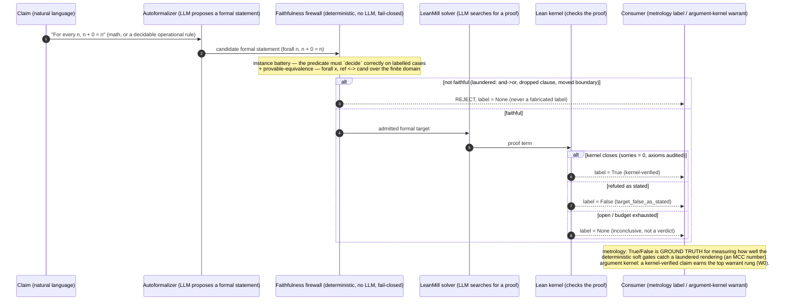

# ZTARE Workflow

> Up: [Documentation map](../README.md)

The day-to-day guide for running ZTARE on a real project. The old basic loop
still exists, but it is only one operating flavor:

```
Gather sources -> Build workspace -> Extract evidence -> Run adversarial loop -> Generate report
```

Most current work starts one step earlier: decide what kind of object you are
holding before you choose a tool.

```text
choose work object -> choose route -> run in-loop, work out-of-loop, or prepare project intake
-> write outcome -> feed reflexive intelligence
```

For a plain-English glossary of terms, see [../concepts/glossary.md](../concepts/glossary.md). For setup and first run, see `README.md`.

---

## 0. Route before you run

Pick the route before launching a loop. This prevents a common failure: using
the in-loop validator because it is available, even when the task is actually
source work, proof decomposition, project setup, or human-agent co-work.

1. In-loop autoresearch
   - Use when the task has the four required surfaces: bounded claim, stable
     evaluator or gate, rubric, and artifact output.
   - This is the validator path:
     `raw -> workspace -> evidence -> autoresearch loop -> synthesis`.
   - It is strongest for bounded claim tests, empirical-law searches, evidence
     ceilings, and adversarial falsification of a declared thesis.

2. Out-of-loop research operations
   - Use when a researcher, maintainer, or agent needs to do research work
     before a loop is justified: read sources, split a proof, write a probe,
     mine a trajectory, ask another agent, prepare a synthesis, or route a
     human bottleneck.
   - ZTARE provides callable primitives and ledgers for this work, but the work
     is not automatically an autoresearch iteration.

3. Project intake
   - Use when the next job is to prepare the boundary object for a future
     in-loop run: project/rubric, bounded task, source refs, evidence refs,
     non-claims, expected command, and next falsifier.
   - The optional prep ledger is only an append-only record for missing intake
     surfaces. It is not an autoresearch scheduler and not the out-of-loop RD
     execution layer.

4. Program hardening workflow
   - Use when the object is ZTARE itself: kernel behavior, source connectors,
     ledgers, gates, control-plane code, or public docs.
   - The path is `seed spec -> genesis -> debate/build/verify -> gates`.

The in-loop path asks: "What can this bounded claim and evidence surface
actually answer?" The out-of-loop path asks: "What is the next useful
operation?" Project intake asks: "What surfaces are missing before this task
can enter the loop?"
Those are different questions. Autoresearch is strong when the claim is
bounded and the gates are defined. Out-of-loop operations are better when the
next step is proof work, coding, source acquisition, panel review, or
human-agent co-work.

Intake readiness is intentionally explicit. A ready intake file has a bounded
claim, source references, evidence references, non-claims, an expected in-loop command,
and a next falsifier:

```bash
ztare project intake create --path demo_intake.json \
  --project demo --rubric demo \
  --task "test bounded claim X" \
  --bounded-claim "claim X holds on fixture Y" \
  --source-ref README.md \
  --evidence-ref docs/guides/workflow.md \
  --non-claim "not a full replication" \
  --next-falsifier "run the setup from a clean checkout" \
  --expected-command "ztare autoresearch route --task 'test bounded claim X' --project demo --rubric demo"
ztare project intake validate --path demo_intake.json --json
```

A malformed intake file fails before it enters the intake ledger. For example,
one with no `evidence_refs` returns `ok: false` with
`missing required non-empty list: evidence_refs`. Fix the intake file first, then
queue it. Use `ztare project prep-ledger add ...` only for follow-up prep work
whose acceptance check is clear.
Local `source_refs` and `evidence_refs` are checked relative to the intake
directory and repo root. Use an explicit URI for external references, or put
missing local artifacts in the prep ledger until they exist. The expected
command must also name the intake file's project and rubric so ready intake cannot
silently point at a different in-loop surface.
When the intake project already exists under `projects/`, validation also runs
the offline raw/source typing preflight. Use
`ztare project intake validate --path demo_intake.json --source-preflight` when
you want that source surface to be required even before the project exists.
`ztare project intake enqueue` always requires the source preflight because the
intake ledger is for source-ready intake. Missing source/evidence prep belongs
in `ztare project prep-ledger ...` instead.

## 0a. Routing table

| If the work object is... | Use... | Durable output |
| --- | --- | --- |
| A claim with bounded intake and an evidence surface | in-loop autoresearch | `evidence.txt`, validator outputs, synthesis |
| A data, decision, or domain project whose limits are unknown | in-loop autoresearch, once intake and evidence surfaces exist | gates, ceilings, demotions, allowed claims |
| Missing source/evidence/rubric surfaces for a future loop | project intake | intake JSON, prep-ledger row, acceptance check |
| A proof branch, Lean obligation, theorem split, or symbolic calculation | out-of-loop research operations | proof files, proof notes, residual state |
| A frontier research question where the next move is unclear | out-of-loop research operations | brief, plan, probes, decision rows, synthesis |
| A human task blocking agent work | out-of-loop research operations | handoff artifact, attestation, delegated subtask |
| A code, kernel, or docs improvement | program hardening workflow | seam/spec if needed, patch, tests, docs |
| A metric-bearing operational decision | out-of-loop operations plus reflexive ledgers | forecast, action-impact row, outcome row |
| A tiny one-off check | manual workflow | short note only if it should become durable memory |

Rules:

- do not force everything through the supervisor
- do not force every research move through the autoresearch loop
- do not leave high-rigor kernel work in chat-only routing once the boundary
  object is stable

## 0a2. New in this release: the governed decision flow

Alongside the autoresearch loop, this release adds a governed *decision* flow for holding a project's argument accountable to its evidence:

```text
scenario run -> governed research map -> argument kernel (grounded verdict + minimal cores + warrants + cheapest-next-test agenda)
  -> bind evidence / annotate / reingest a deliverable -> recompile -> watch the strength move (and how reliably that warrant tier has held)
  -> (optional) let the autoresearch loop take its next experiment from the agenda, feeding results back as warranted evidence
```

The argument kernel is a *view* of the same research map the workbench Map already draws (one source of truth, not a second graph). It emits a grounded verdict (SUPPORTED / BLOCKED / REFUTED), the minimal cores (the assumption-sets the decision turns on), a warrant per edge (how re-executably checkable that support is), and a cheapest-next-test agenda. See `docs/concepts/capabilities.md` for the argument-kernel and metrology sections. The formal-grounding path below is the strongest warrant in that ladder.

The Workbench calls an admitted agenda item a **decision test** (the stable kernel type is `wager`). Its job is to
make one blocked uncertainty executable: name the claim, describe the observation, list at least two plausible
outcomes (including an inconclusive branch when appropriate), and declare effort/deadline. The kernel simulates
every outcome and persists the test only when the edits are valid and at least one outcome changes the compiled
standing. Recording an outcome is a separate preview-then-apply action; the resulting decision delta and
fingerprint refresh the map. This is not a confidence score or a fourth verdict, and it never changes the claim
without governed evidence.

Does this change your day-to-day workflow? Mostly no. The core loop (`raw -> workspace -> evidence -> validator -> synthesis`) is unchanged. What this release adds is a tighter feedback surface *around* a governed decision: one new action — bind a source to a claim and recompile — plus two read surfaces you did not have before (the strength trajectory that moves as you recompile, and the warrant-tier reliability that reports how often that grade of backing has held when re-checked). Letting the agenda steer the loop's next experiment is opt-in and off by default; flip it on only when you want the loop to prioritise the kernel's cheapest-next-test over its own mutation.

## 0a3. Workbench scenarios and plugin surfaces

The Workbench keeps one stable navigation spine. A scenario can change how a
run is judged and which contextual tools appear, but it cannot add a sidebar
destination. This keeps a project navigable when many domain bundles are
installed.

A scenario may compose:

- a rubric and run defaults;
- evidence, renderer, solver, and recheck capabilities;
- deterministic gate packages;
- governed deliverables; and
- optional Workbench panels in declared host slots.

The current panel host is `results`. A manifest opts into a panel by reference,
for example:

```yaml
workbench_panels:
  - results:governed-rice
```

The panel implementation belongs to the plugin author. Put it under
`forensic-workbench/src/scenario-panels/<panel-id>.jsx`, export a default React
component, and export metadata with the same id and host:

```jsx
export const scenarioPanel = {
  id: "governed-rice",
  host: "results",
  label: "Governed RICE",
  description: "Prioritization with evidence-derived confidence.",
};

export default function GovernedRicePanel({ project, liveMode }) {
  // Read and write through bounded Workbench API routes.
}
```

Vite discovers these modules at build time. Adding or changing a frontend panel
therefore requires a frontend rebuild. Scenario and rubric data can be reloaded
at runtime; Python capability files can be dropped into
`plugins/scenarios/` or a directory named by `ZTARE_SCENARIO_PLUGINS`, then
reloaded from the Plugins screen. These are separate lifecycles.

Panels receive a host context and own their domain-specific interaction. They
must not mutate global navigation. Dialogs should use the shared
`ModalPortal` and `useModalBehavior` helpers so layering, Escape, focus
containment, trigger restoration, and background scroll behave consistently.
The maintainer supports this extension contract, not bespoke domain panels.
The shipped product-manager bundle is an example of the contract rather than a
special branch in Workbench chrome.

### One-shot scenario documents

A scenario can also declare a document design without adding Python or CSS:

```yaml
deliverables:
  - decision_memo
  - tradeoff_register
deliverable_specs:
  - name: tradeoff_register
    label: Trade-off register
    audience: Decision team
    sections:
      - label: Decision
        kinds: [thesis, claim]
      - label: Trade-offs
        kinds: [tension, constraint, gap]
      - label: Revisit if
        kinds: [falsifier]
```

The section recipe selects exact governed nodes and edge-licensed relations; it cannot create facts. The
Plugins editor can create and edit these designs, and the same scenario contract is resolved by the CLI, API,
Verdict, and full-set producer. The default output is a readable governed **source draft**. `presentation_brief`
may guide a future editorial renderer, but model-polished prose remains Draft until it passes the re-ingest gate
against the same decision state. Verdict is the one home for compose/status/regenerate; Results panels may show a
scenario interpretation or link there, but should not duplicate the deliverable list.

## 0b. Two audiences

This repo now serves two distinct readers. If you can identify which one you are, you can skip most of the document.

1. Project users: you want to test a thesis or a claim on a domain
   (startup, activist target, strategy question, research area). You do not
   care about kernel internals, benchmarks, or the supervisor.
   - Read: section 0 routing, section 1 (When to use), section 2 (Mental model), section 3 (Operating loops), section 3a (Rerun cadence), section 4 commands for `workspace-update` / `evidence-compile` / `loop` / `synth`, section 5 (Human role), and whichever of sections 6-8 matches your project type.
   - Skip: section 15 (Program hardening), the supervisor-specific command blocks.
   - If your work is a bounded claim test, your loop is: `raw -> workspace -> evidence -> validator -> synthesis`.
   - If your work is exploratory frontier research, work out of loop first and
     invoke the validator only when a bounded intake/evidence surface exists.

2. Kernel and workflow developers: you are modifying the validator, the
   workspace compiler, primitives, public gates, or the supervisor control
   plane.
   - Read everything, but pay special attention to section 0 routing, section 14 (primitive workflow), section 15 (program hardening workflow), and the supervisor command surface. Pair this doc with `docs/concepts/architecture.md`.
   - The hardening path and supervisor-routed programs are for you, not for the general-purpose user.

If you are not sure which you are, start as a project user. You
almost certainly do not need the hardening machinery on day one.

Inside the supervisor path:

- verifier success advances the active manifest automatically
- dependent packets unblock when prerequisites complete
- reporting is read-only and renders from `status.json` + `events.jsonl`
- human gate resolution is handled by `supervisor-resolve-gate`
- research programs now support deterministic prose-spec artifacts at `A2/B/C`
- the runtime can prefill a prose spec path, a draft markdown path, and a deterministic `prose_verifier` command
- research `A2` now carries the burden of exact contract emission: canonical `ProseSpec` only, with exact phrase/citation strings that `B` must include verbatim
- research `C` remains a dumb exact gate (only reversible canonicalization like newline / trailing-space normalization is allowed there)
- generic document assembly is deterministic plumbing (not LLM work): ordered fragments can be concatenated into one output artifact after section packets verify cleanly
- cross-model `A1/A2` debate and optional manual ZTARE passes remain outside the runtime for now
- active runs should live under `supervisor/active_runs/<run_id>/`, a stable repo-local path, so wrapper sandboxes can access staging files reliably (older runs that staged into `/tmp/` lost files)

## 0c. Out-of-loop discipline

Out-of-loop work holds the same rigor as in-loop work. Its unit of work is
sometimes a validator iteration and sometimes a proof step, source pass, or
panel review. A serious out-of-loop run still needs:

- a named object of work
- a current residual or bottleneck
- the primitive, script, proof tool, panel, or agent being used
- a written outcome
- a next decision or kill condition
- a durable ledger row when the result changes routing

The public sprint narrative in [../sprint_70day_journey.md](../sprint_70day_journey.md)
explains the shift from "ZTARE versus agents" to "ZTARE as a workbench, agents
and humans as the workforce." This guide uses that frame.

## 0d. Researcher discipline (read if you care whether a run counts as evidence)

If your ZTARE run is a cited experiment, one whose outcome will be cited as evidence, three rules govern whether the run is diagnostic. Full version in [`docs/guides/for_researchers.md`](for_researchers.md).

1. Charter contamination. `autoresearch_loop.py:1319` injects `project_charter.md` verbatim into the mutator prompt every turn. Any target form, parameter values, or derivation you write to "motivate" or "explain" the target becomes a turn-1 cheat sheet. The target itself lives only in the private sealed pre-reg area. Before sealing a charter, sha256 it, grep it for GT substrings, and ask whether a stranger could reconstruct the target from it alone. Origin: [GP-023](../../research_areas/seams/substrates/planck/GP-023_ontology_trap_planck_mechanism_seam.md) sandbox_07, 2026-04-14. Two mutators transcribed the charter's derivation on iter 1 and "recovered" the GT to six decimals. Neither run was diagnostic.

2. Visibility rule: closed = public, open/testing = private. Closed seams and pre-regs move to `research_areas/seams/` at close time. In-flight experiment artifacts (pre-regs, GT derivations, blind oracle details) stay in the private sealed area until the experiment closes, even if other materials are public. One seam, one place. No toggle, no symlink. Full rule in `AGENTS.md`.

3. Honeypot mode is bug-bounty, not discovery-proof. `rubrics/honeypot_minimal.json` uses a loose discovery rubric (max 115 including +15 gaming bonus). A high honeypot score is a bug report: it names something the standard gate suite missed. Those bugs are candidates for new deterministic gates. A 115 honeypot run does *not* mean discovery. Read the judge's weakest-point note and treat it as the handle to grab next. Honeypot scores are not comparable to standard-run scores.

If you are a project user (section 0b path 1), you can skip this section. If you
are running experiments whose outcomes will be cited, read
`docs/guides/for_researchers.md` end-to-end before sealing your first pre-reg.

---

## 1. When to use this workflow

Use this workflow when:

- the project will evolve over time
- source material accumulates
- contradictions matter
- you want reproducible evidence snapshots
- you expect to rerun the validator as new information arrives

Do not use this full workflow for:

- tiny one-off tests
- toy projects with 1-2 source files
- cases where writing `evidence.txt` manually is faster

---

## 2. Core mental model

There are four layers:

1. `raw/`
   - the source bucket
2. `workspace/`
   - persistent structured memory, inspired by [Karpathy's LLM wiki pattern](https://gist.github.com/karpathy/442a6bf555914893e9891c11519de94f): raw sources accumulate, an LLM extracts structured notes, and the system compounds knowledge over time without the validator ever trusting it as authority
3. `evidence.txt`
   - bounded validation snapshot
4. ZTARE + synthesis
   - adversarial validation and final artifacts

The evidence layer should behave like a source-grounded project wiki, where
entries persist and stay tied to their sources. Accepted source fetches are the only rows remembered as
duplicates. Rejected provider attempts stay in manifests as retry/debug state
and do not poison future runs. Public-source recovery records the web-search
backend separately from the model used for workspace update, evidence compile,
or the in-loop validator.

In one line:

```text
raw -> workspace -> evidence snapshot -> validator -> artifact
```

---

## 3. Standard loop

For a real project, the loop is:

1. add or update source material in `projects/<project>/raw/`
2. update the workspace
3. review facts, contradictions, and open questions
4. compile a bounded evidence snapshot
5. promote it to `evidence.txt` if running the current validator unchanged
6. run ZTARE
7. synthesize the result
8. repeat when new evidence arrives

---

## 3a. Rerun cadence (project users)

The most common question for general-purpose users is "which step do I have to rerun when X changes?" The rule: only rerun downstream of what changed. Upstream artifacts stay valid.

| Trigger                                                         | Rerun starting at                                   | Why                                                                                                 |
|-----------------------------------------------------------------|-----------------------------------------------------|-----------------------------------------------------------------------------------------------------|
| You added or edited files under `projects/<project>/raw/`      | `ztare project source-check --project <project> --json`, then `make evidence-prepare PROJECT=<project> MODEL=<model>` | Source typing should fail before any model-backed workspace/evidence call. `evidence-prepare` repeats the preflight, updates workspace memory, and compiles evidence. |
| `contradictions.md` / `facts.md` / `open_questions.md` changed from a workspace update | `evidence-compile`                          | Evidence snapshot is derived from workspace memory.                                                 |
| `compiled_evidence.txt` changed (new bounded snapshot)          | promote to `evidence.txt`, then `loop`              | Promotion is a rebaseline event: score regime fingerprints the bytes of `evidence.txt`; prior champions become `regime_mismatch` by design. |
| You changed the rubric, model pairing, or iteration budget      | `loop`                                              | Validator is stateless. No upstream rerun needed; workspace and evidence are independent of rubric. |
| You want a fresh report for the current champion                | `synth`                                             | Synthesis is downstream of `champion_*` artifacts; earlier stages are untouched.                    |
| Provider outage / compile failed closed (`latest_compile_failure.json` written) | `evidence-compile` (retry), then promote + `loop` | Compiler fails closed for a reason. Retry the compile until it succeeds.                      |
| `thesis.md` changed (new claim to test) but same evidence base  | `loop` (optionally `synth` after)                   | Thesis lives with the validator input, not with the workspace.                                      |
| You reach `UNDERIDENTIFIED` and want to branch                  | See §5b: use `hypotheses/<candidate>/`              | Do not overwrite the active thesis ad hoc; preserve the current branch and promote a candidate.     |

Two rules to keep rerun cost bounded:

1. Do not rerun `workspace-update` just because you reran the loop. Workspace is expensive and deterministic against `raw/`. If raw did not change, workspace is still fresh.
2. Do not skip the `compiled_evidence.txt -> evidence.txt` promotion step silently. Promotion is a rebaseline. If you skip it, the validator is running against an older frontier than the compiler just produced, and champions will look better than they are.

---

## 4. Commands

All operational commands now run as Python modules from repo root:

```bash
python -m ztare.<area>.<module> ...
```

For common tasks, you can also use the repo `Makefile`:

```bash
make help
ztare project source-check --project <project> --json
make evidence-prepare PROJECT=<project> MODEL=<model>
make loop PROJECT=<project> RUBRIC=<rubric> ITERS=10 MUTATOR_MODEL=<model> JUDGE_MODEL=<model>
make autoresearch-projection PROJECT=<project> OUT=<project>_projection.json
make autoresearch-kernel-health JSON=1
make operations-intelligence OUT=ztare_intel.json MD_OUT=ztare_intel.md
make blitz-survival-report PROJECT=<project> OUT=<project>_blitz_survival.json
make action-intel-materialize-dry
make synth PROJECT=<project> MODEL=<model> QA_MODEL=<review_model> RENDERER=founder_memo
make benchmark-stage1 BENCH_JUDGE=<model> BENCH_JOBS=3
```

### When to use `make loop` vs `make experiment-loop`

`make experiment-loop` is a wrapper around `make loop` that adds two layers of safety:

1. Always passes `--disable_attacker_tools` (closes the attacker-exfil class, any live run, blind or not, wants this default).
2. Iff the rubric declares `holdout_hard_gate: true`, it also verifies `gate_harness.py` and `evidence_holdout.txt` exist, pre-flights that the harness produces valid JSON, and auto-sets `--underidentified_after=$(ITERS)` to prevent the underidentified-kill bug on hard-gate runs.

Decision tree:

```
Choose make experiment-loop by default.
  └── If rubric declares holdout_hard_gate: true, hardening kicks in automatically
      (harness + holdout pre-flight + underidentified fix).
  └── Otherwise, it passes through to make loop with --disable_attacker_tools added.

Choose make loop ONLY when:
  • Actively debugging and you need attacker tools available, OR
  • You are hand-pinning all flags yourself and understand the safety trade-off.
```

In practice: `make experiment-loop` is the correct default for any live run, including qualitative / exploratory / no-ground-truth projects. The "experiment" prefix is about pre-registered safety, not about requiring a hidden GT. The hard-gate-specific hardening only activates when the rubric asks for it.

Pre-registered falsification runs (blind law recovery with sealed GT) additionally require `make seal` before launch, see `docs/guides/experiment_cookbook.md`. That discipline is separate from the loop vs experiment-loop choice.

### In-loop vs RD/out-of-loop agent work

Use `make experiment-loop` / `ztare autoresearch run` when the task has a
bounded claim, stable evaluator, rubric surface, and artifact surface. After a
run, use `make autoresearch-trace PROJECT=<slug> RUBRIC=<slug> INTAKE=<slug>_intake.json JSON=1`
or `ztare autoresearch trace --project <slug> --rubric <slug> --intake <slug>_intake.json --json`
to inspect the read-only trace over the intake boundary, raw/source carriers,
evidence/provenance, projection, health gaps, and next commands. Historical
projects can still be inspected without an intake file, but first-run candidates
should carry one. Use `ztare autoresearch projection --project <slug>` only
when you specifically need the projection carrier over `eval_history`.

Do not use autoresearch as a replacement for every model or agent call. Use a
cold-shot model call when the main need is a fresh frame or a quick
counter-hypothesis. Use a persistent agent when the value is carried context,
judgment, and many dependent moves. Use autoresearch when the value is
adversarial accumulation: prior failures become constraints, proposals are tied
to artifacts, and claims face gates, judges, projections, and post-run audits.
If the loop would only add fields without changing the proposal boundary,
evidence record, or gate behavior, stay out of loop.

To audit narrowing behavior across stale runs, use
`ztare autoresearch hillclimb-audit --project <slug>` or
`make autoresearch-hillclimb-audit PROJECT=<slug>`. It joins
`iteration_telemetry.jsonl`, `loop_events.jsonl`, `parallel_blitz_log.jsonl`,
and `explored_primitive_classes.jsonl` and flags workspaces where stagnation
appears without any recorded pivot, blitz, or primitive-class evidence. The
audit uses the rubric's effective pivot threshold, so a run that only reaches
the threshold on its final row is not treated as an overdue control failure.
The report separates active controls from advisory and diagnostic surfaces:
pending eigenquestions and survival reports are visible, but they do not count
as a recorded breadth-control activation. For direct recovery work, use
`ztare autoresearch hillclimb-audit --recovery-queue --json`, which emits only
the loop-control episode queue, aggregate counts, project-intake status, and
the next recovery command for each row. Add
`--recovery-intake-status ready` to inspect rows that already have a project
intake file. Intake-present does not mean the row can enter the in-loop
kernel: queue rows also report `kernel_entry_status`, kernel blockers, and the
next trace-derived repair command. A compiled evidence artifact is reported
separately when present. It is not itself a loop intake file. If review shows
that intake should be drafted from an existing compiled artifact, run
`ztare project intake draft-from-compiled --project <project> --path projects/<project>/<project>_intake.json`
and then validate the intake file before using it in `autoresearch run`. If review
shows that no follow-up should run,
record the decision with
`ztare autoresearch hillclimb-audit --record-resolution --workspace <workspace> --iteration <n> --last-control-iteration <n> --outcome-status <status> --reason "<why>"`.
That receipt clears the active recovery queue row but does not count as
post-control success. The audit also reports a three-iteration
post-control outcome window: score improvement, champion promotion, or reduced
stagnation after an active control fires. This is an evidence-coverage check
and an observational follow-up metric, not a claim that any specific escape
move caused the improvement.
When the loop-control evaluator returns `REFRESH_SPECIALISTS`,
`PIVOT_REQUIRED`, or `UNDERIDENTIFIED`, the next mutator prompt now includes a
compact loop-control signal: pending action, stagnant window, and the evaluator
reason. This puts breadth controls at the proposal boundary, where they shape
the next mutation, and they remain visible in post-run telemetry too.

For a first-page preflight, use
`ztare autoresearch health --project <project> --json` or
`make autoresearch-kernel-health PROJECT=<project> JSON=1`. The project-scoped
health report includes raw/source typing preflight alongside the narrower
dispatch, catalog, fixture, rubric, and control audits, and prints each
component's owning drill-down command. It prints advisory `evidence_gaps` when
a comparative claim is under-supported by current run history, and
`coverage_opportunities` when optional controls are wired but dormant in the
selected scope. Evidence gaps do not fail strict preflight by themselves. Use
the named drill-down command to collect the missing evidence before making a
transport or mechanism-lift claim. Coverage opportunities are weaker: they say
what to exercise before making a coverage claim, not that the current project
verdict is under-supported.
The corpus-wide rubric-mode audit reports legacy unset rubrics as a measured
count, not a global blocker. When you scope health or the audit to a specific
rubric, a missing `rubric_mode` becomes attention: choose `newton`, `kepler`,
or `calibration` before treating that rubric as a serious launch surface.
The dispatch component also names direct API exceptions by file, function, and
reason. A green count is therefore inspectable: direct calls are acceptable only
when they are one of the named wrapper fallbacks or an explicitly dual-transport
surface.
The health report includes a compact operations-intelligence component so sparse
RD route logging or blocking action-intelligence sources are visible before a
run. Explained ready-workbench bypasses remain visible as counts. Bypasses
without `why_not_autoresearch` become health debt because the later source
repair pass cannot tell whether the RD had a good reason to stay out of loop.
Source-health warnings are also counted there by issue type. They are advisory
unless they become blocking, but review them before relying on the
operations packet for allocation claims.
Use `make operations-intelligence` for the full read-only packet.
The equivalent CLI form is
`ztare autoresearch operations-intelligence --out ztare_intel.json --markdown ztare_intel.md`.
For dormant in-loop mechanisms, run `ztare autoresearch fixtures --json` or
`make inloop-fixture-validate JSON=1`. The fixture matrix names each mechanism,
what the fixture proves, the command to try next, and the focused test
reference.
If the question is whether optional controls are visible to the normal
project-scoped evidence audit, run `ztare autoresearch control-demo --json` or
`make autoresearch-control-demo JSON=1`. This materializes a controlled local
replay project for parallel blitz, primitive-class rotation, and eigenquestion
preflight. Treat it as wiring/evidence-surface validation, not as live research
lift.

When a run uses the blitz/parallel-mutator path, use
`make blitz-survival-report PROJECT=<slug>` to join the tournament winner to
downstream evaluation, gate failures, and champion promotion. This is the
quick check for whether the cheap candidate selector is producing candidates
that survive the normal gate stack. The loop also materializes
`workspace/blitz_survival_report.json` and `.md` at run end whenever blitz
artifacts are present. The Make target reruns the same read-only join.

Before deciding manually, ask the router:

```bash
ztare autoresearch route \
  --task "<task description>" \
  --project <project> \
  --rubric <rubric>

make autoresearch-route \
  TASK="<task description>" \
  PROJECT=<project> \
  RUBRIC=<rubric>
```

The decision values are `invoke_autoresearch`, `prepare_autoresearch_surface`,
and `stay_out_of_loop`. The router infers the four workbench prerequisites from
project/rubric context when possible. Use `--bounded-claim`,
`--stable-evaluator`, `--rubric-ready`, and `--artifact-surface` only as
overrides. When the decision is `prepare_autoresearch_surface` or
`stay_out_of_loop`, the JSON includes `surface_scaffold`: the missing artifact,
required fields, and acceptance check for each absent prerequisite. Use scoped
subscription flags only after the route says the workbench surface exists, for
example `ZTARE_AGENT_DISPATCH_MUTATOR=agent`. Avoid the global flag for first
measurements because it promotes every wired call site.

For `prepare_autoresearch_surface`, record the missing surface work in the
durable project/data prep ledger, where it survives the session. The one-command path records
the route/action row and appends the scaffolded surface prep:

```bash
ztare autoresearch route --task "<task description>" --project <project> --rubric <rubric> \
  --record-decision-id <decision_id> --queue-missing-surface
```

If you already have a route JSON, append it directly:

```bash
ztare autoresearch route --task "<task description>" --project <project> --rubric <rubric> \
  > autoresearch_route.json
ztare project prep-ledger add-from-route --route-json autoresearch_route.json
```

Do not use the project/data prep ledger for `stay_out_of_loop`. That decision
means the Research Director should do agent work outside the autoresearch kernel
until there is a bounded claim/evaluator surface to route again.

The Make surface exposes the same scoped knobs:

```bash
make experiment-loop PROJECT=<project> RUBRIC=<rubric> \
  AGENT_MUTATOR=1 AGENT_JUDGE=1 AGENT_COMMITTEE=1 AGENT_INVERTER=1 \
  AGENT_RUNTIME=codex
```

Use dispatch parity for contract plumbing, then use run-history outcomes for
the actual transport comparison:

```bash
ztare autoresearch dispatch-parity --json
ztare autoresearch subscription-outcomes --json
```

When comparable rows are missing, `subscription-outcomes` includes a
`matched_run_plan` with ready project/rubric candidates plus the paired API,
subscription, and follow-up audit commands. Use `--plan-limit <n>` or
`PLAN_LIMIT=<n>` to change how many candidates are shown. Each candidate also
reports `suitability_score` and `risk_flags`. Prefer high-suitability surfaces
for the first transport comparison and avoid starting with hard proof-search
or extra-gated projects unless that is the explicit target.
`autoresearch health --json` also lifts the first suggested matched-pair
command into the `subscription_outcomes` evidence gap, so the first-page health
report can be used as the launch checklist.
The default text report is read-only and prints `model_calls=none`. Only the
generated `experiment-loop` commands or the matched-pair wrapper with
`RUN_MATCHED_PAIR=1` launch model work.

The generated commands stamp `MATCHED_RUN_ID` and `MATCHED_RUN_ROLE` into
future `eval_history.jsonl` rows. After both sides run, the audit reports
`matched_run_groups` and `comparable_matched_run_group_count`, so the ex-post
read is a grouped comparison keyed on the stamped ids. The
audit suggestions use the next visible id for that project, for example
`pair_<project>_001`, then `_002` after the first pair appears in history. Do
not reuse a pair id for a second transport trial.

To avoid copying the pair manually, use the dry-run wrapper first:

```bash
make autoresearch-matched-transport-pair PROJECT=<project> [RUBRIC=<rubric>]
```

It prints the API row, subscription row, and follow-up audit command. Add
`RUN_MATCHED_PAIR=1` only when you intend to launch both runs. If
`MATCHED_RUN_ID` is omitted, the wrapper uses a UTC timestamp plus shell-PID id
so repeated wrapper invocations do not collide. The equivalent CLI surface is
`ztare autoresearch matched-transport-pair --project <project> --rubric
<rubric> --intake <project_intake.json> --mutator <model> --judge <review_model> --inverter
<inverter_model> --llm-timeout-seconds 240 --llm-retries 1 [--agent-timeout 240]
[--run]`. Pass `--pair-id <id>` only when you deliberately want a specific id.
Do not omit `--intake` for project-intake-backed runs. Otherwise the comparison
will not exercise the same run-readiness surface as the normal loop command.

Fresh `eval_history.jsonl` rows record both an aggregate transport and
`worker_metadata_by_call_site` for mutator, judge, committee, and inverter
review. Successful subscription-backed mutator, judge, and committee calls also
emit prompt-free `worker_dispatch_receipts`. The projection prefers those
completed receipts over requested policy metadata when they are present. That
keeps judge-only or committee-only subscription experiments visible to the
outcome audit, while avoiding a false subscription row when a flag was set but
the call site did not complete through the subscription worker.

When the question is which substrate or branch surface to prepare next, use the
RD recommender before creating project scaffolding:

```bash
ztare autoresearch substrate-recommend --prompt-only
ztare autoresearch substrate-recommend --agent-recommender --agent-runtime codex
```

Eigenquestion rotation is adjacent but not automatic. `ztare eigenquestion
propose --project <project>` writes an advisory `proposed_eigenquestion_*.md`
and does not rewrite `project_charter.md`. `rd_tick_brief.py` surfaces pending
proposals in §8f when `--autoresearch-project` is set, including whether the
proposal is newer than the charter. `make loop`, `make experiment-loop`, and
`ztare autoresearch run` also run a non-mutating preflight that warns when an
advisory proposal is newer than the charter. Use
`ztare eigenquestion status --project <project>` or
`make eigenquestion-status PROJECT=<project>` to inspect it directly. Set
`EIGENQUESTION_PREFLIGHT=strict` on the Make path to fail the launch until the
proposal is reviewed. Before merging a proposal, run `ztare eigenquestion
validate --project <project>` or `make eigenquestion-validate PROJECT=<project>`
so falsified explored-class rows have real `evidence_path` receipts.

If a Research Director uses Codex, Claude, or another persistent/subscription
agent outside the loop on a task that could plausibly have gone through
autoresearch, record the decision with:

```bash
ztare autoresearch route \
  --task "<task description>" \
  --project <project> \
  --rubric <rubric> \
  --record-decision-id DECISION_ID
```

That row belongs to `domain=agentic_workbench` and should include the router
decision: invoke autoresearch, prepare the missing surface, or stay out of loop
with an explicit reason. Use `--selected-action` and
`--why-not-autoresearch` when the RD chooses a different path from the router's
default action. This is mandatory when the router says `invoke_autoresearch`
and the selected action stays out of loop. Otherwise kernel health flags the row
as an unexplained bypass. The command saves the route JSON under
`analytics/public/queries/rd/autoresearch_routes/` and appends a validated
action-impact row. The route JSON also records the worker shape as explicit
metadata: archetype, capability, state, identity, and transport. Use
`record-agentic-route` for a pre-existing route JSON and
`record-agentic-work --route-json-ref <route.json>` only when the row needs a
custom payload. The row feeds action-impact evidence for later reflexive mining
and operations intelligence. The aggregate
in-loop/out-of-loop split already comes from reflexive mining
(`analytics/public/ledgers/reflexive/bifurcation_report.json`) and is pushed to
the dashboard via `scripts/public/mining/build_dashboard_bundle.py`. The
action-intelligence row gives the decision-level explanation underneath that
dashboard metric.

Before treating subscription-backed workers as an execution default, run
`ztare autoresearch dispatch-parity --json` on the fixed contract set. It
reports API/subscription contract parity, replay `quality_score`, and a
latency/call-count `cost_proxy`. `--live` exercises the subscription leg while
keeping the API leg deterministic.

For depth-sensitive RD closes, carry the same decision into
`research_done.carrier_schema_receipts.autoresearch_workbench_routing` when
the pattern-action contract selects `OP-AWR-01`. The receipt fields are owned
by `src/ztare/research_director/pattern_action_contract.py`. The close scaffold
only creates the placeholder object. Always include `route_json_ref` and
`action_impact_ref` from the recorded route. The route/action row should also
carry `operator_card_routes[]` and `operator_card_ids[]` so later mining can
tell which workbench card selected the route. If the router chooses
`stay_out_of_loop`, include `why_not_autoresearch` and set
`workbench_evidence_ref` to the action-intelligence row. If it chooses
`invoke_autoresearch`, set `workbench_evidence_ref` to the run/projection
artifact. If it chooses `prepare_autoresearch_surface`, name the missing
evaluator/rubric/artifact surface there. `surface_scaffold` is the next build
target.

Supervisor commands:

```bash
make benchmark-supervisor
make benchmark-supervisor-registry
make benchmark-supervisor-seed-registry
make benchmark-supervisor-genesis
make benchmark-supervisor-staging
make benchmark-supervisor-report
```

### Step 0: Scope-anchor broad projects

Before the first serious run on a broad project, scaffold and edit a charter:

```bash
python -m ztare.common.scaffold_project_charter \
  --project <project> \
  --mode broad
```

Use `project_charter.md` when:

- the question has multiple plausible sub-questions
- a project could drift into a narrower seam and still look good rhetorically
- end states need to remain distinct
- the project inherits from another project

The charter is advisory in prose and deterministic in anchors:

- `Core Question` / `Out Of Scope` / `End States` guide the judge
- `Forecast Type` tells the system whether bounded tilt or `%` claims are even in-bounds
- `Anchor Proxies` drive mathematical drift detection

Forecast typing rule:

- use `directional_forecast` when the project may include a bounded forward-looking tilt but is not a calibrated `%` forecast project
- use `probabilistic_forecast` only when the project explicitly targets a point probability for a defined event and horizon
- do not let the existence of a probability DAG silently convert a directional project into a probabilistic one
- directional projects that sneak in unsupported `%` claims are now intended to be capped by the scorer, not discouraged in the prompt

Stagnation pivoting:

- the loop injects a named, logged pivot profile once the active threshold is reached (earlier versions injected a single silent prompt)
- Newton-mode rubrics pivot at `stagnation_count >= 2`. Kepler, calibration, and legacy-unspecified rubrics pivot at `stagnation_count >= 3`
- `composition_stagnation_threshold` in the rubric overrides those defaults for that project
- profiles currently include:
  - `legacy_generic`
  - `bounded_discriminator`
  - `kernel_bounded`
  - `newton_discovery`
- stdout reports which profile and heuristic modules were injected

### Artifact roles

Validation runs now maintain two explicit artifact families:

- `latest_*`
  - the most recent evaluated attempt
- `champion_*`
  - the current promoted best result for the active regime

This matters because the newest evaluated candidate may be worse than the promoted champion.

For domain projects, expect:

- `projects/<project>/latest_eval_results.json`
- `projects/<project>/champion_eval_results.json`
- `projects/<project>/latest_probability_dag.json`
- `projects/<project>/champion_probability_dag.json`
- `projects/<project>/workspace/latest_evidence_gaps.json`
- `projects/<project>/workspace/champion_evidence_gaps.json`
- `projects/<project>/workspace/latest_constraint_proposals.json`
- `projects/<project>/workspace/derived_constraints.json`
- `projects/<project>/workspace/derived_constraints_brief.md`

If `champion_*` artifacts are missing or stale relative to the project's saved-best history marker, the loop now reconstructs them from history before trusting them as the active baseline.

This migration path is covered by a local regression:

```bash
python -m ztare.validator.tests.champion_artifacts_fixture_regression
```

### Step 1: Update the workspace

```bash
python -m ztare.workspace.update_workspace --project <project> --model <model>
```

This reads `projects/<project>/raw/` and updates:

- `workspace/source_notes/*.json`
- `workspace/source_index.json`
- `workspace/workspace_snapshot.json`
- `workspace/facts.md`
- `workspace/ranges.md`
- `workspace/contradictions.md`
- `workspace/open_questions.md`
- `workspace/candidate_claims.md`

### Step 2: Review the workspace

The minimum useful files to inspect are:

- `projects/<project>/workspace/facts.md`
- `projects/<project>/workspace/contradictions.md`
- `projects/<project>/workspace/open_questions.md`
- `projects/<project>/workspace/candidate_claims.md`
- `projects/<project>/workspace/champion_evidence_gaps.json` (preferred, if present)
- `projects/<project>/workspace/latest_evidence_gaps.json` (if present)
- `projects/<project>/workspace/derived_constraints.json` (confirmed structural limits)
- `projects/<project>/workspace/latest_constraint_proposals.json` (fresh candidate constraints from the latest run)
- `projects/<project>/workspace/evidence_gap_brief.md` (after compile, read
  `## Next Action` first when active rows are present)
- `projects/<project>/workspace/evidence_gap_action.json` (same selected action
  in machine-readable form)

Human job here:

- make sure obvious contradictions were preserved
- make sure important unknowns were not smoothed away
- decide what claim or thesis is worth testing next
- if typed evidence gaps exist, decide whether the next bottleneck is evidence collection, which more blind iterations cannot resolve
- if confirmed derived constraints exist, treat them as read-only structural limits the next run inherits

### Step 3: Compile evidence

```bash
python -m ztare.workspace.compile_evidence --project <project> --mode workspace
```

Default outputs:

- `projects/<project>/compiled_evidence.txt`
- `projects/<project>/compiled_evidence_packet.json`
- `projects/<project>/compiled_evidence_provenance.json`
- `projects/<project>/compiled_evidence_replay_manifest.json`
- `projects/<project>/workspace/evidence_gap_brief.md` (always refreshed: it
  either selects the next active gap action or states that current rows are
  inactive/resolved)
- `projects/<project>/workspace/evidence_gap_action.json` (the selected action
  contract for scripts and UI surfaces)
- `projects/<project>/workspace/latest_compile_failure.json` (only on fail-closed compile errors)

If the compiler hits a provider outage or other compile-time exception, it now fails closed:

- exit code is `1`
- no Python traceback is required for the local user path
- a structured failure artifact is written to `workspace/latest_compile_failure.json`

The replay manifest is the stable evidence identity surface. It records source
bindings, workspace-snapshot or raw-cache replay mode, packet/support hashes,
and output artifact hashes. Use it when a script, report, or UI needs to know
whether the same source bundle still supports the same compiled evidence
surface.
Run `ztare project evidence-replay --project <project> --json` to verify that
the compiled evidence still matches the current project files. Run
`ztare project claim-support --project <project> --json` when a report, review,
or UI needs to know which compiled claims are directly source-bound,
synthesized across sources, local/seed-only, mixed, missing refs, or unsourced.
Claim support is a source-binding audit. It does not prove semantic entailment. It
also verifies that source-index rows still point at the current raw source bytes
and returns bounded source previews for review. A stale or missing raw source
blocks the audit before a report treats the row as source-backed.
`ztare autoresearch trace --project <project> --rubric <rubric> --intake <intake.json> --json`
also surfaces this replay status. If the manifest is present and stale, trace
blocks run readiness until evidence is refreshed or the stale artifact is fixed.
- recovery is: retry later or switch model, then rerun `compile_evidence.py`

### Step 4: Promote the snapshot for the current validator

ZTARE still reads `projects/<project>/evidence.txt`, so for now:

```bash
cp projects/<project>/compiled_evidence.txt projects/<project>/evidence.txt
```

Important:

- the active score regime fingerprints the byte content of `evidence.txt`
- promoting `compiled_evidence.txt` into `evidence.txt` is therefore a rebaseline event
- old champions from the prior evidence frontier are intentionally treated as `regime_mismatch` after promotion
- the evidence compiler prefers `champion_evidence_gaps.json` only when it
  contains active rows. If champion rows are all resolved, justified, or waived,
  it falls back to active rows in `latest_evidence_gaps.json`

### Step 5: Run ZTARE

Example:

```bash
python -m ztare.validator.autoresearch_loop \
  --project <project> \
  --rubric <rubric> \
  --iters 10 \
  --mutator_model <model> \
  --judge_model <model>
```

Legacy *Cognitive Camouflage* benchmark shortcuts:

```bash
make paper1-tsmc-legacy
make paper1-epistemic-legacy
```

Stagnation handling is now explicit:

- on non-V4 Newton-mode projects, the `newton_discovery` structural-pivot profile starts at `stagnation_count >= 2`
- on non-V4 Kepler, calibration, and legacy-unspecified projects, the default structural-pivot profile starts at `stagnation_count >= 3`
- one count after the pivot threshold, the loop also purges visible axiom context and forces a blank-slate reset unless the rubric overrides the threshold
- on V4-family projects, the generic structural pivot is intentionally suppressed. `stagnation_count >= 3` injects a bounded, scoped mutation override (the free-form pivot stays disabled on these projects)
- these modes are now announced in loop stdout so the reviewer can see when the prompt contract changes
- loop-event JSON keeps legacy `event_type` ids for dashboard compatibility and adds `event_label` for the reviewer-facing name

## Runtime Notes

- provider/model resolution, retry handling, and usage extraction now come from `src/ztare/common/llm_runtime.py`
- persistent transient provider failures can trigger automatic cross-provider failover, keeping the run alive on a second provider
- cost estimates depend on `supervisor/model_pricing.json`
- versioned provider model names are normalized before pricing lookup, so telemetry can still price runs when providers return names like `models/gemini-2.5-flash`
- if a judge call falls back to a different effective model, the scoring regime fingerprint changes on purpose so mixed-provider evaluations do not masquerade as directly comparable

V4 kernel meta-runner shell shortcuts:

```bash
make v4-meta-show
make v4-meta-run-current
make v4-meta-reset
```

### Step 5a: Use a short probe budget before declaring closure

Do not treat a single `iter0 = 0` or similar hard baseline as automatic proof that the current project has no viable on-charter basin.

A baseline is a local readout. It does not prove global exhaustion.

Use a short additional probe budget (`2-3` iterations) before declaring the current framing closed when all of the following are true:

- the falsification suite passes
- drift is controlled or not firing
- the failure is substantive, confirmed clear of infrastructure/provider noise
- the project, regime, or charter was recently reframed, hardened, or rebaselined

Why:

- the mutator may still discover a different basin inside the same charter and evidence frontier
- the maintainer's "there is nothing here" instinct can itself be wrong

Do not turn this into open-ended grinding.

If the same hard failure repeats with no useful basin movement after the probe budget:

- stop iterating
- change the evidence frontier
- or branch the hypothesis explicitly

If a materially better on-charter basin appears during the probe budget:

- treat that as genuine new information
- update the active champion
- and continue from that new champion, leaving the earlier failed baseline behind

### Step 5b: Branch after `UNDERIDENTIFIED`

If a project reaches `UNDERIDENTIFIED`, do not overwrite the active thesis ad hoc.

Use project-local hypothesis bundles instead:

```text
projects/<project>/
  thesis.md
  test_model.py
  workspace/
  hypotheses/
    <candidate_name>/
      thesis.md
      test_model.py   # optional
      notes.md
```

Why:

- the active thesis and active falsification suite must travel together
- copying only a new `thesis.md` can leave a stale `test_model.py` evaluating the wrong object
- `workspace/` is machine-owned and should not hold maintainer exploration notes

Recommended workflow:

1. preserve the current best branch as its own hypothesis bundle
2. draft alternative candidates under `hypotheses/`
3. promote one candidate into the project root
4. run a fresh loop episode
5. compare against the preserved baseline

For `eu_union_stability`, use:

```bash
python projects/eu_union_stability/promote_hypothesis.py <candidate_name> --clear-status
python -m ztare.validator.autoresearch_loop \
  --project eu_union_stability \
  --rubric eu_union_integration \
  --iters 3 \
  --mutator_model <model> \
  --judge_model <review_model> \
  --deterministic_score_gates
```

`promote_hypothesis.py` does three things safely:

- copies the candidate `thesis.md` into the project root
- copies the candidate `test_model.py` if present
- otherwise deletes the stale project-root `test_model.py` so the next run fail-closes, blocking the case where a new thesis would be evaluated with an old suite

Optional:

- `--clear-status` archives stale workspace status files for maintainer clarity

This is a project workflow convention unrelated to the supervisor.

These commands apply to the kernel-local promotion runner, not the supervisor control plane.

V4 bounded debate-orchestration shortcuts:

```bash
make v4-debate-init RUN_ID=<run_id>
make v4-debate-show TASK_ID=<task_id>
make v4-debate-merge TASK_ID=<task_id>
```

### Step 6: Synthesize

Founder pack:

```bash
python -m ztare.synthesis.synthesize --project <project> --model <model> --pack founder
```

Single artifact:

```bash
python -m ztare.synthesis.synthesize --project <project> --model <model> --renderer-type founder_memo
```

Multi-project artifact:

```bash
python -m ztare.synthesis.synthesize --projects p1,p2 --model <model> --renderer-type research_note
```

When a project has autoresearch run artifacts, synthesis also creates
`projects/<project>/synthesis/autoresearch_review_context.json` from
`ztare autoresearch trace` and feeds that compact context into the renderer.
It also writes `synthesis/report_support_contract.json`, which carries trace
readiness, run-readiness blockers, evidence replay/output/provenance status,
graph/evidence-gap actions, and next commands into render/refine/QA. If replay
is stale or required-but-unverified, the report contract must caveat evidence
backed conclusions and surface the stale replay to the reader. The contract also has
top-level `ok`, `status`, and `status_reasons` fields so a reviewer can tell
whether the report surface is `ready`, needs `attention`, or is `blocked`
without reverse-engineering nested trace fields. The top-level
`source_claim_support` section summarizes how many intake/source claims were
directly source-backed, synthesized across sources, weak, or blocked by source
context, with compact sample rows and problem rows for review. Normal iteration
budget endings appear under `runtime_caveats`. Provider failures, stale
evidence, and launch-preflight errors appear under `runtime_risks`. Use it for
reporting and review only. Post-run thesis composition is handled by
`src/ztare/synthesis/post_run_thesis_synthesizer.py`, which is a separate
state-changing path with its own audit log and promotion threshold.

---

## 5. Human role at each step

### In `raw/`

Human decides what source material belongs in scope.

Examples:

- startup: customer interviews, pricing pages, pilot results, attendance logs, founder notes
- strategy: filings, earnings calls, transcripts, market notes, competitor pricing
- research/architecture: logs, papers, failure notes, architecture constraints, benchmark results

### In `workspace/`

Human does not rewrite everything manually. The human reviews for:

- omitted contradictions
- obvious extraction mistakes
- missing source categories
- whether the candidate claims are actually worth testing

### In ZTARE

Human chooses:

- the rubric
- the iteration budget
- the model pairing
- whether the project is exploratory, diligence-oriented, or architectural

### In synthesis

Human chooses:

- the audience
- the renderer
- whether to send memo, appendix, or both

---

## 6. Example: startup project

Goal:

- pressure-test a startup thesis using interviews, product notes, and pilot data

Loop:

1. add founder notes, customer interviews, pricing, and pilot metrics to `raw/`
2. run `python -m ztare.workspace.update_workspace`
3. inspect:
   - contradictions between founder narrative and user behavior
   - unresolved unknowns such as real conversion or retention
4. compile evidence
5. run ZTARE on one bounded question
   - example: “Does repeat same-group attendance drive the core growth mechanism?”
6. synthesize into:
   - founder memo
   - quantitative appendix

What the human is actually doing:

- deciding which strategic question is decisive
- ensuring the evidence base is not missing the obvious blockers

---

## 7. Example: strategy / activist thesis

Goal:

- stress-test an investment or activist thesis against filings, earnings calls, and market evidence

Loop:

1. add filings, transcript excerpts, market notes, competitor benchmarks to `raw/`
2. update workspace
3. inspect:
   - contradictions between management claims and economics
   - open questions that block the short or long thesis
4. compile evidence
5. run ZTARE on one bounded claim
   - example: “Price compression destroys the current margin narrative”
6. synthesize into a research note or decision brief

What the human is actually doing:

- scoping the thesis tightly
- deciding which claim is important enough to attack first

---

## 8. Example: kernel / architecture project

Goal:

- evolve the kernel using its own failure logs and constraints

Loop:

1. add debate logs, architecture notes, benchmark failures, and design constraints to `raw/`
2. update workspace
3. inspect:
   - recurring architectural contradictions
   - unresolved open problems
4. compile evidence
5. run ZTARE on one architectural claim
   - example: “Static evidence is the bottleneck”
6. synthesize into an architectural memo or research note

What the human is actually doing:

- choosing whether the next loop should improve the validator, the evidence substrate, or the synthesis layer

---

## 9. What this adds versus the old workflow

Old workflow:

- human manually rewrites `evidence.txt`
- contradictions are easy to omit
- evidence does not accumulate cleanly over time
- provenance is fragile

New workflow:

- source material accumulates in `raw/`
- structured memory accumulates in `workspace/`
- evidence snapshots are reproducible
- contradictions and unknowns are preserved explicitly
- ZTARE receives a cleaner bounded input

The change is:

from manual brief-writing to persistent evidence operations

---

## 10. What this still does not do

It does not yet:

- autonomously search the web
- autonomously decide truth
- replace human thesis selection
- remove the need for adversarial validation

The workspace helps prepare claims.
ZTARE helps break claims.

---

## 11. Recommended initial practice

For a new project:

1. start with `raw/`
2. update workspace
3. compile evidence
4. compare compiled evidence against your manual intuition
5. only then run ZTARE

For an existing project:

1. backfill important source material into `raw/`
2. build the workspace once
3. compare:
   - old manual `evidence.txt`
   - new `compiled_evidence.txt`
4. run the same rubric with fixed settings
5. evaluate whether the compiled evidence improves downstream thesis quality

---

## 12. Sandbox Construction: Visible/Held-Out Isolation Protocol ([GP-072](../../research_areas/seams/protocol/GP-072_role_separation_sandbox_construction_seam.md))

When setting up a science sandbox (closed experiment with known ground truth),
use the Division A / Division B information-isolation protocol. Do not have
a single agent that knows the answer also write mutator-visible files.
Contamination is an information-flow problem, not a matter of discipline.

### Division A (lab tech, knows GT)

Produces GT-aware artifacts only:
- `evidence.txt`, `evidence_holdout.txt` (generated from GT formula)
- GT module (e.g., `src/ztare/substrates/<slug>_gt.py` with `f_true`, `f_dominant`)
- `.denylist` file (GT-specific patterns for the leak sentinel)
- Pre-registration document (private, names GT, seals protocol)

Division A artifacts live in the private sealed area or the project directory
only when the file is never mutator-visible.

### Division B (principal investigator, GT-blind)

Receives only the abstract problem brief and evidence data. Produces:
- `project_charter.md` (neutral language, no structural hypotheses)
- Rubric JSON (no GT framework vocabulary like "corrector", "dominant term")
- `test_model.py` (trivial baseline: `f(u, v) -> 0`)
- `gate_harness.py` (frozen, imports from test_model.py)

### Pre-seal gate: leak sentinel

```bash
python -m ztare.validator.leak_sentinel \
    projects/<project> \
    rubrics/<rubric>.json \
    --denylist-file projects/<project>/.denylist
```

Exits 0 if clean, 1 if any denylist pattern appears in mutator-visible files. The sentinel is necessary but not sufficient. Also run integration tests (all harness flags) before sealing.

### Agent implementation

When using Claude Code, spawn Division A and Division B as separate agents with information barriers:
- Division A agent: briefed with GT formula, produces GT-aware artifacts
- Division B agent: briefed with only the abstract problem description, produces mutator-visible artifacts
- Run the leak sentinel after both agents finish

See `GP-072 (internal seam)` for the full protocol and lessons learned.

## 13. Current limitations

1. PDFs/images need conversion before ingest.
2. The validator still reads `evidence.txt`, so snapshot promotion is manual.
3. Workspace quality depends on source-note extraction and merge quality.
4. This workflow is worth it only when the project has enough source complexity to justify it.

---

## 13. Practical rule

Use the workspace when the project has memory.

If the project does not accumulate sources, contradictions, and updates over time, skip it and write `evidence.txt` manually.

---

## 14. Optional primitive workflow

Use the primitive workflow only after you have enough run history for repeated adversarial failures to show up.

1. extract incidents from prior runs
```bash
python -m ztare.workspace.extract_incidents
```

2. draft candidate primitives
```bash
python -m ztare.primitives.draft_primitives --model <model> --skip-existing
```

3. review and promote selectively
```bash
python -m ztare.primitives.approve_primitive --primitive-key cooked_books --decision approved
```

4. arm the validator with approved precedents
```bash
python -m ztare.validator.autoresearch_loop --project <project> --rubric <rubric> --use_primitives
```

Default usage is attacker/judge-side only. That is the non-overfitting setting.

Only expose primitives to the mutator when you explicitly want transfer hypotheses:
```bash
python -m ztare.validator.autoresearch_loop --project <project> --rubric <rubric> --use_primitives --use_transfer_hypotheses
```

That second mode is stronger but riskier. Keep it off unless you want the mutator to explore cross-project pattern transfer explicitly.

---

## 15. Program hardening workflow

Use this when the work is not a domain project but a kernel/program improvement track.

This workflow now has two sublayers:

1. proposal layer
   - seed -> proposal manifest -> human acceptance
2. active program layer
   - genesis -> program manifest -> supervisor loop

### Step 1: Write or select a seed

Seed specs live in:

- `research_areas/seeds/active/`
- `research_areas/seeds/deferred/`
- `research_areas/seeds/legacy/`

Current active critical-path seed:

- `research_areas/seeds/active/stage2_derivation_seam.md`

Deferred future seeds:

- `research_areas/seeds/deferred/systems_to_algorithms.md`
- `research_areas/seeds/deferred/ztare_open_source.md`

### Step 2: Ensure seed registry status

The seed must be represented in:

- `research_areas/seed_registry.json`

### Step 3: Accept a program

Only after human acceptance:

- write `supervisor/program_genesis/<program>.json`
- add the program to `supervisor/program_registry.json`

Optional pre-registry planning tools:

- `python -m ztare.supervisor.supervisor_proposal ...`
- outputs:
  - `supervisor/proposed_manifests/`
  - `research_areas/proposal_plans/`
  - `research_areas/debates/planning/`

### Step 4: Route with the supervisor

See:

- `supervisor/USER_MANUAL.md`

Core commands:

```bash
python -m ztare.supervisor.supervisor_what_next ...
python -m ztare.supervisor.supervisor_backlog ...
python -m ztare.supervisor.supervisor_loop init ...
python -m ztare.supervisor.supervisor_loop emit-staging ...
python -m ztare.supervisor.supervisor_loop launch-staging ...
python -m ztare.supervisor.supervisor_loop commit-staging ...
python -m ztare.supervisor.supervisor_attended_autoloop ...
```

Notes:

- `launch-staging` removes manual copy/paste by invoking configured wrappers from `supervisor/agent_wrappers.json`
- verifier turns can now be launched locally and will prefill the verification request
- when wrapper telemetry is available, the wrapper writes `turn_usage` into the staged request and a usage JSON file under `staging/launch/`
- bounded spec refinement is supported as `A2 -> A1`, capped at 2 rounds before forcing `B` or `D`
- budget-aware refinement is supported but remains disabled until `supervisor/model_pricing.json` is populated and a run is initialized with `--max-refinement-cost-usd`
- attended autoloop can remove repeated command entry while preserving the manual `D` gate and fail-closed preview behavior
- active human-readable plans live in:
  - `research_areas/program_plans/`
- proposal-stage human-readable plans live in:
  - `research_areas/proposal_plans/`

For document programs, the intended long-term shape is:

- bounded fragment packets in `research_areas/drafts/<program_id>/`
- deterministic section specs in `research_areas/specs/`
- one assembly manifest that concatenates fragments into a canonical full-document artifact

That keeps drafting bounded while still allowing one final manuscript file.

### RACI for seed / debate / spec / draft separation

`A = Accountable`, `R = Responsible`, `C = Consulted`, `I = Informed`

| Activity / Artifact | Human | A1/A2 Spec Agent | B Writer / Builder | C Verifier | Supervisor |
|---|---|---|---|---|---|
| Select or revise seed specs in `research_areas/seeds/**/*.md` | A/R | C | I | I | I |
| Append bounded turns in `research_areas/debates/**/*.md` | C | R | C | I | A |
| Lock deterministic contracts in `research_areas/specs/**` | C | R | I | I | A |
| Write generated artifacts in `research_areas/drafts/**` or approved implementation paths | I | C | R | I | A |
| Run deterministic verification and produce verification reports | I | I | I | R | A |
| Commit state transition, manifest advancement, and staged archive | I | I | I | I | A/R |
| Resolve freeze / close / resume at `D` | A/R | C | C | C | I |

The folder split is intentional:

- `research_areas/seeds/**` = strategic starting contracts
- `research_areas/debates/**` = bounded argument history
- `research_areas/specs/**` = locked deterministic contracts
- `research_areas/drafts/**` = generated manuscript or draft artifacts

Do not let generated debate or draft artifacts silently overwrite seed specs.

### Step 5: Close or freeze

When the program finishes:

- update `supervisor/program_registry.json`
- preserve the genesis artifact
- do not mutate the seed spec

### Rules

- do not derive the portfolio by scanning `projects/`
- do not let tactical debate logs overwrite seed specs
- do not create routable work without genesis
- do not reopen closed/frozen programs without a human gate
- do not confuse proposal planning with active program execution

---

## 16. Scientific experiment workflow: law recovery from synthetic data

Use this when the goal is to test whether ZTARE can recover a known mathematical
law from evidence, with a sealed ground truth for verification. This workflow is
distinct from general-purpose domain projects: the answer is known, the sandbox
is constructed under visible/held-out information isolation, and the gate is
deterministic (RMSE or exact-match).

### When to use

- Testing a new grammar-guided symbolic regression command or primitive on a controlled target
- Calibration runs before pointing ZTARE at a genuinely unknown domain
- Infrastructure verification (continuous substrate, bivariate evidence, new mutator plumbing)

### Full command sequence

1. Write the GT script (Division A)

```python
# src/ztare/substrates/<slug>_gt.py
def f_true(x1, x2) -> float: ...       # ground truth
def f_dominant(x1, x2) -> float: ...   # dominant term for residual diagnostics
def evidence_grid() -> list[tuple[float, float]]: ...   # visible training points
def holdout_grid() -> list[tuple[float, float]]: ...    # hidden evaluation points
```

For discrete 1-variable substrates, `evidence_grid()` / `holdout_grid()` are
optional. The substrate generator uses integer ranges instead.

2. Generate substrate artifacts

```bash
# Project/data surface scaffolding is exposed through the CLI wrapper. See its arguments:
ztare project new --help
# Provide the slug, the GT script (src/ztare/substrates/<slug>_gt.py),
# the input variables, and the problem brief per --help, following the
# sandbox-construction discipline (historical seam: GP-072; AGENTS.md
# "Don't hand-build sandboxes").
```

This writes Division B artifacts (rubric, gate_harness.py, test_model.py, evidence files, charter) and an opaque re-export stub at `src/ztare/substrates/<slug>_gt.py`. The rubric field `residual_diagnostics_gt_module` points to the stub, not the Division A script. `component_c_gt_module` remains accepted only as a legacy alias for old rubrics.

3. Seal the sandbox

```bash
ztare project seal --project <slug> --rubric rubrics/<slug>.json
```

Runs the leak sentinel (sentinel must pass), integration tests (smoke-test + gates must produce valid JSON), and writes `projects/<slug>/sandbox_seal.json`. Must run before the loop. Never skip.

4. Launch the experiment loop

```bash
make experiment-loop \
    PROJECT=<slug> \
    RUBRIC=rubrics/<slug>.json \
    ITERS=10 \
    MUTATOR_MODEL=<model> \
    JUDGE_MODEL=<review_model>
```

5. If you stop and restart

```bash
# Reset thesis to virgin state (remove any best_iteration tag)
# Clear workspace
rm -f projects/<slug>/workspace/*.json projects/<slug>/workspace/*.jsonl projects/<slug>/workspace/*.md
# Re-seal
make seal PROJECT=<slug> RUBRIC=rubrics/<slug>.json
# Relaunch
make experiment-loop PROJECT=<slug> RUBRIC=rubrics/<slug>.json ITERS=10 MUTATOR_MODEL=<model> JUDGE_MODEL=<review_model>
```

### RMSE gate calibration rule

The RMSE threshold must reject the zero model (`f(x1, x2) = 0`). Before sealing:

```bash
python projects/<slug>/gate_harness.py --run-smoke-test
```

If `harness_ok: true` on the zero model, tighten the threshold. For noiseless synthetic data, `0.05` is a reasonable default. The zero model RMSE should be >> threshold.

### Division A / B boundary

| Artifact | Division | Mutator-visible? |
|---|---|---|
| `src/ztare/substrates/<slug>_<domain>_gt.py` | A (Division A GT script) | No |
| `src/ztare/substrates/<slug>_gt.py` (stub) | A (opaque re-export) | No |
| `projects/<slug>/evidence.txt` | B | Yes |
| `projects/<slug>/evidence_holdout.txt` | B (locked) | No |
| `projects/<slug>/gate_harness.py` | B | No |
| `projects/<slug>/test_model.py` | B | Yes (mutator rewrites this) |
| `rubrics/<slug>.json` | B | No |

Slug must be opaque (`exp080_01`, not `exp080_tacrolimus_01`). The slug leaks into rubric `project` field and charter. A domain name in the slug is a semantic hint to the mutator.

### Boundary: this is not rebuilding ZTARE

This organization of labor does not replace ZTARE or replicate the old V4 hardening path if the boundary is kept clean.

- ZTARE remains the zero-trust workbench for attack/defense pressure, claim discipline, and truth-sensitive thesis work.
- V4 hardening remains the kernel/program hardening path for core system integrity.
- The supervisor research pipeline is narrower:
  - form the bounded contract
  - route labor
  - preserve provenance
  - verify deterministic conformance
  - stop at human gates

If semantic truth judgment, novelty scoring, or open-ended epistemic attack gets
pushed into supervisor `C`, that would be a bad duplicate of ZTARE. The current
intent is organization of labor, not a second claim-auditing system.

## 16. Formal grounding — the oracle path (opt-in)

Most projects never need this, but it anchors the whole trust story. When a claim is precise enough to be **decidable** — a math statement, or an operational rule like an access-control or AML/sanctions predicate — ZTARE can turn it into a machine-checked verdict instead of a human eyeballing "does this look right?". Nothing in this path uses an LLM as a *judge*: the LLM only *proposes*, and deterministic checks *decide*.



What it buys you:

- **A ground-truth label for metrology.** The kernel's True/False is what the fast deterministic soft-gates are measured against — how well they catch a *laundered* rendering (a dropped clause, a moved `>=`->`>` boundary). That is the honest number behind "the gates work," not an assertion.
- **The top warrant rung (W0).** In the argument kernel's warrant ladder (W0 kernel-certificate -> W1 re-executable -> W2 verbatim-quote -> W3 proposed-unchecked), a kernel-verified claim is the only thing that earns W0. Everything else is admitted but marked weaker.

When it fires: **opt-in only** (`ZTARE_METROLOGY_LIVE_ORACLE=1`). Importing the code never launches a proof search, because a live search dispatches an LLM and the metrology layer is deterministic by charter. It is not wired into any live loop — it is a deliberate, out-of-band run. Source: `src/ztare/scenarios/metrology.py` (`formal_oracle_label`) and the faithfulness firewall in `src/ztare/leanmill/solver/autoformalize.py`.
