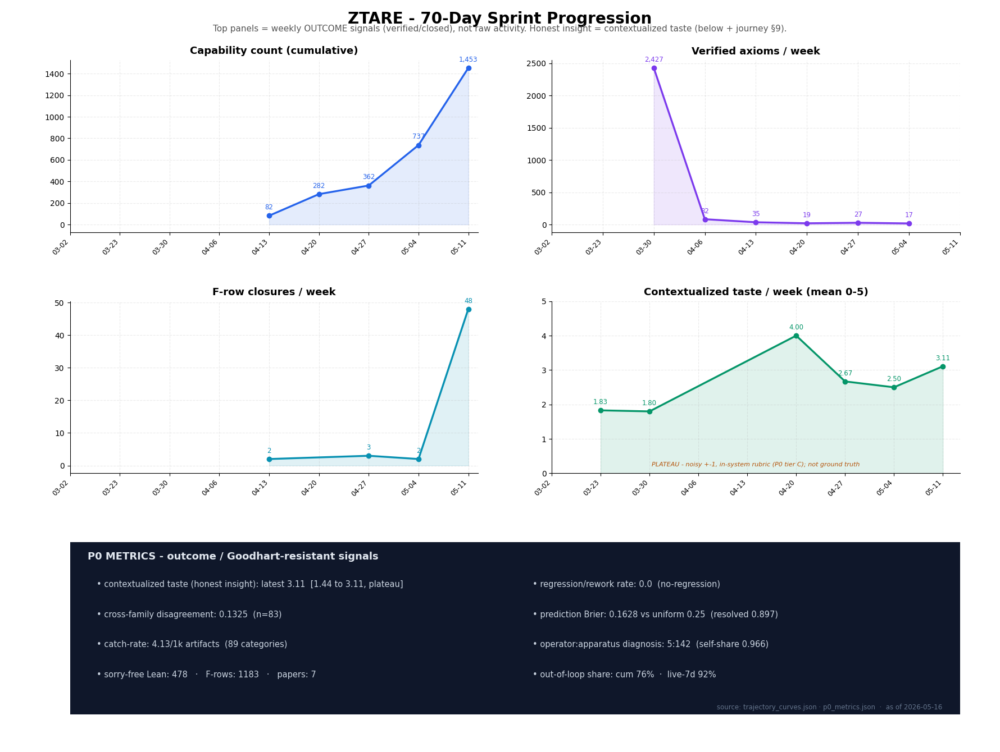

# A 70-Day Sprint, Six Architectural Phases

> **Public positioning note:** this is a historical build narrative, not the
> canonical system-positioning page or claim register. Start with
> [system_position_and_module_map.md](concepts/system_position_and_module_map.md)
> and [public_claim_register.md](public_claim_register.md) for current public
> claims. Live sprint language below is preserved as provenance and should be
> read through the anti-laundering discipline in this repo.

Human in the loop (aka operator): Daniel Alami. Window: roughly mid-March 2026 through 2026-05-29.
This is one operator's sprint, not a general theory of AI-assisted research.
Companion to `JOURNEY.md` (the NS Track B scoreboard), paper7 (the
four-substrate cross-domain capability paper), and
`docs/concepts/reflexive_mining_methodology.md` (the weekly self-audit that,
on 2026-05-16, caught this very document's measurement instrument being
mis-selected and forced the correction in §9). Anti-laundering vigilance
per `org/anti-patterns/`: where this document drifts toward inflation, the
catch ledger should fire, that is a falsification of §6's claims about
human-in-the-loop discipline._

## §0, TL;DR

_The four panels favour weekly **outcome** signals, capability count, verified axioms, F-row closures, contextualized-taste mean (quality-weighted), with a current-progress **P0-metrics strip** (Goodhart-resistant: contextualized taste, regression/rework, cross-family disagreement, Brier-vs-uniform, catch-rate, operator:apparatus diagnosis) beneath. Gameable activity proxies (paper line-count, autonomous-action count) are **deliberately excluded**, more ≠ better. The honest insight measure is the contextualized taste curve in §9. Sources: `analytics/public/queries/trajectory/trajectory_curves.json` + `analytics/public/ledgers/reflexive/p0_metrics.json`; regenerate via `scripts/public/mining/render_sprint_progression.py`._

This is not one artifact. In about seven weeks one operator and a rotating
set of AI agents built a connected universe of work, and then pointed it at
itself. The pieces that came out of it:

- **ZTARE**, a zero-trust adversarial kernel: one agent proposes, others
  attack, deterministic gates decide, durable artifacts record what survived.
- **Cognitive-Firm**, an organizational-design kernel (M-form separation,
  damage signals, mandates) used to actually run "ZTARE Research Co" itself.
- **Agentic-engineering patterns** (17 catalogued), reusable practices for
  building multi-agent research systems — stub-replay testing, eligibility
  pre-filters, provenance telemetry, knowledge-graph cross-references —
  the kind of thing the next operator does not have to rediscover.
- **Reflexive primitives** (9 catalogued), capabilities the apparatus
  applies to itself: measuring its own return on effort, auditing its own
  claims, demoting hypotheses that did not earn their keep.
- **Anti-pattern catalogue** (30 entries), failure modes mined from this
  sprint's own trajectory archive and validated across three different
  LLM providers, so the labels are not a single-model artifact.
- **A four-substrate prober** (modified gravity, neural scaling,
  consciousness-ascription, Navier-Stokes) that returned binding-constraint
  diagnoses rather than positive laws, the same discipline hitting four
  different walls.
- **A weekly reflexive self-audit** that re-mines every artifact, scores
  insight density with a contextualized rater, and feeds the result back, 
  the architecture observing itself on a cadence.

The through-line is the model-environment thesis. The sprint was not a bet
that scaffolding beats frontier model capability. It was a bet that frontier
capability needs a serious research environment around it: bounded evidence,
separate verification, persistent state, source-readiness discipline,
falsifier routing, and demotion of attractive wrong stories. The stronger the
model, the more valuable that environment becomes, because capability amplifies
both useful insight and the ability to satisfy weak evaluation surfaces.

The same through-line has a lab-scale reading. Frontier labs can internalize
many of these moves into evals, post-training, and future model development.
The public lesson is not that labs lack this idea; it is that the useful
supervision object is the full research trace, not only the final answer:
attempts, critiques, executable checks, source gaps, demotions, nulls, and next
falsifiers.

The six architectural phases (detailed in §1-§6) trace the path: a
reasoning engine → a pivot to scientific discovery and the extraction of an
organisational kernel for running it → a self-audit layer where the
architecture starts to observe itself → Navier-Stokes as the deepest test
substrate, with the inner iteration loop quietly giving way to direct agent
dispatch → the reframe of the system as a **workbench** of primitives that
an agent **workforce** calls into → an honest critique of the Cognitive
Gym and the operator functions nothing in the stack replaces.

**The honest spine (measured, not asserted, see §9).** On 2026-05-16 the
reflexive audit was run end-to-end and produced hard numbers about the
architecture itself:

1. **The architecture bifurcated.** Of 34,440 authored artifacts, **~25%
   sit inside the original iteration loop and ~75% are work done outside
   it by directly-dispatched agents**, and in the trailing-7-day live
   window **~97% is outside the loop**. The live substrate is agent
   dispatch plus governance plus mining, not the original closed loop the
   architecture started with.
2. **The apparatus falsified its own substrate and reported it.** Its own
   capability-ROI audit (28-day, 157 projects) found of ~18 catalogued
   primitives: **4 engaged, 7 dead, 7 never instantiated.** The survivors are
   three governance/critic primitives plus one solver (a Lagrangian-derivation
   primitive at 76% engagement). The evolutionary zoo did not survive contact
   with the work, and the machine said so.
3. **Recursive gain was real, then plateaued.** Contextualized insight
   density rose **1.83 → 2.80** over seven weekly buckets (the compounding is
   genuine and independently cross-validated), then ticked to **2.40** in the
   final bucket as effort moved onto the stuck NS/Clay frontier. Compounding,
   then flattening, not exponential.
4. **The discipline caught itself, this week, on this document.** The weekly
   audit run surfaced that the wrong rating instrument had been selected
   (cold vs. the canonical contextualized rater) and that a ledger had been
   contaminated. It forced an RCA and a self-correction, recorded in §9 and
   in `docs/concepts/reflexive_mining_methodology.md`. The strongest evidence
   the discipline works is that it demoted this sprint's own measurement.

**Scope discipline.** The earlier-era substrates (modified gravity with
GPU runs, consciousness-ascription, neural scaling) ran on the original
experiment loop and demonstrate the discipline is not Navier-Stokes-only.
The current meta-architecture (the catalogued patterns, the audit chain,
the self-audit loop, the architecture index, the reflexive primitives, and
the agent orchestration layer) was validated most deeply on one substrate
(Navier-Stokes); cross-substrate validation of the *current* layer is still
pending. Nothing here claims a solved Clay problem, an autonomous research
engine, or a general law. The operator is non-expert; the system is single
N=1; the contribution is the discipline and the honest record of where it
broke.

**Naming note, the strange-loop credit.** The "META-DARWIN strange-loop"
discipline that recurs throughout this document inherits its core conceit
from Douglas Hofstadter's *Gödel, Escher, Bach: An Eternal Golden Braid*
(1979) and *I Am a Strange Loop* (2007). The architecture's specific instance
an audit-of-the-audit that demoted the architecture's own claims five-plus
times in the 2026-05-08 session, is named in tribute. The "DARWIN" half (idea-killer
selection pressure) is a separate inheritance from population-of-ideas
Darwinism (Dennett, *Darwin's Dangerous Idea*, 1995). Neither half is
original; the composite "META-DARWIN strange-loop applied to the
architecture's own promotion claims with binary-falsifiable demotion
language" is the contribution.

## §1, Phase 1: ZTARE in-loop

The starting configuration was **substrate / mutator / judge**, the
three-component closed loop documented in paper5 and `docs/concepts/architecture.md`.
A frontier mutator (Claude or GPT or Gemini, rotated) proposed a parametric
form against a charter that named the substrate and the rubric. A
deterministic harness (`scipy.optimize`, BIC budgeted, gate stack run) closed
the cheap formal vulnerabilities. A separate-family judge scored the thesis
against the rubric. The loop iterated until either a champion survived the
gate stack and the farther-tail holdout, or the apparatus exited with a
diagnosed cap (grammar ceiling, substrate-data ceiling, identifiability
degeneracy, etc.).

The early weeks of the sprint ran this loop on calibration substrates and
on the four science-domain substrates that became paper7 §3.1-§3.4: neural
scaling-law exponents (OLMo2 7B/13B), Navier-Stokes singularity diagnostics
on chiral-knot ansatz families, modified-gravity radial-acceleration
relations, and consciousness-ascription governance. ZTARE produced what an
adversarial symbolic-regression engine produces best: empirical regularities
that survive cross-modality and gauge-removal stress (the trajectory-shape
law, the β ≈ 1/2 cross-modality anchor), structural diagnostics that retire
prior framings (the bounded-near-miss as Galerkin-truncation artifact at the
spectral edge), substrate-data ceilings made legible (within-class feature
collapse on the v2 RAR substrate), and high-scoring corpus-gradient
recapitulations that the apparatus's structural-repair gates eventually
demoted (the v1 pluralism thesis at score 98). It also produced honest
nulls, the 17-form RAR backtest hitting the same Class-B/Class-C frontier
in every family, the optimizer-control phase-flow law that anti-transferred
from toy-grids to production telemetry, and it produced its own self-demotions,
documented in the same paper as the original results.

Why was NS Clay closure being chased here at all? Because the substrate
prober's logical place is exactly the ambiguous published-paper-grade
diagnostic ("is the bounded near-miss a survival mechanism or a
representational artifact?") and the analogous theorem-facing question
("does the route-5 exponential rescue impose a quantified material-frame
metric-degeneracy?"). The Clay attempt was, at the start of the sprint,
a stress test of the substrate prober, not a Clay attempt with the
apparatus on trial.

## §2, Phase 2: Extracting `org/` primitives

After several weeks of running ZTARE iter loops the architecture had
accumulated something subtler than substrate findings: **an operational
discipline**. The discipline showed up as recurring patterns, "before
finalizing a fix, spin a bounded read-only critique agent without run
history" (`feedback_bounded_critique_agent.md`); "after any evidence.txt
update, `make compile` first, then `make loop`" (`feedback_compile_before_loop.md`);
"never `dict.get(key, safe_default)` on contract keys" (`feedback_interface_debt_silent_default.md`);
"strip proper nouns and concrete mechanisms from any sentence stated as a
principle; if it collapses, it was an instantiation"
(`feedback_principle_vs_instantiation.md`). Each pattern was first observed
inside ZTARE, as a hard-won fix to a specific failure, and only later
recognized as substrate-independent.

That recognition triggered Phase 2: the **`org/` primitive extraction**.
The repo's `org/` directory is the artifact of that extraction. It contains
roles (`org/roles/`), mandates (`org/mandates/`), patterns (`org/patterns/`),
anti-patterns (`org/anti-patterns/`), gates, signals, channels, and the
delegation/assignment graph. The patterns directory ships
`darwin_idea_killer.md`, `pattern_1_friction_debate.md`, `swarm_dispatch.md`,
`reducer.md`, `tautology_trap.md`, `three_leg_verification.md`,
`vocabulary_quarantine.md`, `falsifiable_asymmetry.md`,
`independent_cas_verification.md`, `business_framing.md`, and
`smuggling_audit.md`. The anti-patterns directory ships nine machine-checkable
binary tests including `citation_laundering`, `sorry_obligation_laundering`,
`vocabulary_smuggling`, `pattern_1_rabbit_hole`, `narrative_inflation`,
`cross_agent_monoculture`, `charity_grade_inflation`,
`deployment_time_pre_spec_laundering`, and `criterion_selection_rigging`.

The mandate compiler (`org/mandates/`) crystallized what had previously
been operator-typed instructions into typed role contracts: the Research
Director mandate, the Debate Runner mandate, the Manager mandate, the
Product Manager mandate, plus templates. The `org/delegation.yaml` and
`org/assignments.yaml` files turned the implicit human-in-the-loop routing
into a graph any agent (or any human) could read.

The non-trivial claim of Phase 2 is that this extraction was **bidirectional**:
not just "ZTARE's discipline became reusable patterns" but "the patterns,
once named, exposed structural gaps in ZTARE that were not visible from
inside the iter loop." `feedback_miner_blind_spot_structural_analogy.md`
is the canonical case: the operator surfaced "charter should be a recursive
refinement loop, mirroring evidence-fetch", and the reflexive miner could
not have. The miner was asking "is this engaging / central / dead /
covered" but not "should there be a loop here?" Naming the pattern in `org/`
made the gap visible.

_Scope note: the structural-discipline patterns extracted into `org/`
during Phases 1-2 emerged from the broader ZTARE experiment-loop era and
were exercised across the four science-domain substrates listed in §1.
The current meta-architecture (catch ledger, anti-pattern catalog,
META-DARWIN strange-loop, architecture-index meta-graph, reflexive
primitives, Claude Code orchestration) crystallized later, during the
NS Track B sprint specifically. So far it has been validated on NS
Track B only. It is designed to be substrate-general; that empirical
test is pending._

## §3, Phase 3: The system analyzes itself (recursive gain)

By late April the architecture had a third layer: it was **observing its
own dynamics**. Concretely, this meant three artifacts: the GP-227 dashboard
(`analytics/public/dashboard/`), the reflexive miner stack (closure-patterns,
climb-triggers, lollapalooza, weakest-link clusters, score-ceilings, all
visible in `analytics/public/queries/`), and the trajectory archive
(`analytics/public/ledgers/trajectory/trajectory_archive_enriched.jsonl`).

The GP-227 dashboard is the "exponential self-use website": a Vite-built
React surface (`analytics/public/dashboard/src/`) that aggregates five mining
sources (structural_analogies, synthesis, reference_graph structural-criticality,
closure_patterns, cross_audit) into ranked candidate lists. Its public
data tables include `consequential_artifacts_by_week.json`,
`recursive_gain_candidates.json`, `reference_graph.json`,
`structural_analogies.json`, `taste_weighted_insight.json`, and
`trajectory_curves.json`. The "exponential self-use" framing referred to
the consequential-artifacts-by-week graph: the rate at which each week's
artifacts cited or extended prior weeks' artifacts, which the operator
treated as a leading indicator of compounding.

The architecture _learned about itself_ in three specific ways during
Phase 3.

First: **recursive gain is agent-agnostic**
(`feedback_agent_agnostic_recursive_gain.md`, 2026-05-06). The premise that
recursive self-improvement required an in-loop ZTARE-on-ZTARE substrate
broke when most R&D shifted to Research Director agents working outside
the iter loop. The conclusion "recursive gain went dormant" was wrong.
Recursive gain needs the data ecosystem (F-rows, seam files, project
workspaces, evidence files, verified-axioms ledgers) plus mining plus a
feedback path, not the iter loop itself. The week-scale gain cycle
(mine → surface candidates → ship refinement → next week's mining catches
consequences) is structurally identical to the iter-scale loop, only
slower because each cell is "ship a real apparatus refinement" rather
than "evaluate a candidate string." The slowness is a feature.

Second: **recursive loops surface apparatus bugs first**
(`feedback_recursive_loop_finds_apparatus_bugs_first.md`, 2026-05-06). The
first end-to-end Layer-3 reflexive cycle produced four apparatus fixes, 
R8/R9 wired (5-month-old dead code); R20-R24 registered in the audit
registry; cross-audit dashboard alias map; closure-miner Lane-A-vs-Lane-B
guard catching LLM over-tagging on governance prose, and **zero new
primitives**. The honest output was correct. Shipping a synthetic primitive
to "have output" would have polluted the cage catalog and poisoned future
audits. The "no new primitives" verdict is shippable.

Third: **the reflexive miner's blind spot is structural-analogy class-2
findings**. The miner today asks coverage and ROI questions; it does not
ask "should there be a loop here?" or "is this one-shot generation step
the right granularity?" That is still operator work.

Phase 3's empirical claim is bounded: an architecture with this much
artifact density and a working miner _can_ observe its own dynamics
usefully. It does not yet self-improve in the strong sense; it surfaces
candidates that operator and substrate must ship.

## §4, Phase 4: Pivoting off ZTARE-orchestration for discovery

By the second week of May the operator's discovery work was no longer
running through ZTARE's iter loop. ZTARE iter loops were too slow for
Lean/Mathlib formalization and for open-math attempts. The substrate
prober had shipped its substrate-prober results (the four paper7 case
studies); the marginal hour spent inside an iter loop was producing less
than the marginal hour spent dispatching Claude Code agents on typed Lean
companion packs, on `lean-dojo` bridges, on Mathlib-search-then-port, on
parallel adversarial-CAS verification, on swarm decompositions of
typed-companion problems.

The pivot crystallized in the 2026-05-07 → 2026-05-08 push. The
companion `JOURNEY.md` records the artifacts: twelve Unified Categorical Compactness
wall-certificates, atom 1's full ten-field `MeasureValuedTightnessWitness`
discharged on a Dirac substrate, atom 8 four-way decomposed with sub-atom
8a closed via Aubin-Lions-Simon, T9 scaffold sorry-free with four greppably-
hoisted axioms (then honestly demoted via the three-leg verification
catch #34), PR-A2 sorry-free modulo PR-A1 transitive obligation, the
architecture-index meta-graph cataloging 187 primitives with five typed
edge kinds, the catch ledger trimmed to 24 ratified rows after ~40%
inflation removal, the anti-pattern catalog with binary falsifiable tests,
and the META-DARWIN strange-loop demoting at least five of the architecture's
own claims in real time. None of these ran through a ZTARE iter loop.

Why did Claude Code agents prove faster for this substrate? Three reasons,
each surfaced as feedback memory.

The first is the **typed-companion + 4-way swarm pattern**
(`feedback_typed_companion_swarm_decomposition.md`): convert opaque `Prop`
fields into typed companions, parallelize the resulting independent leaves
across agents, compose via a single spine file, and toy-substrate-smoke-test
before claiming reduction. ZTARE's substrate / mutator / judge is one agent
at a time; Claude Code agents naturally support 4-6 in parallel through
background-dispatch.

The second is the **adversarial 2-role friction pattern** with built-in
**business-framing for pre-category-emergence stuck states**
(`feedback_agent_orchestration_patterns_2026_05_08.md`). When the math
substrate is stuck pre-vocabulary, reframing as a business problem
("what's the bucket-leverage / multi-discharge / single-PDE-delivery-moves-
five-atoms" framing of GP216 atom-leverage) unblocks the structural insight
without requiring a math vocabulary the operator may not have.

The third is **independent CAS verification as a kill mechanism**: the 2026-05-08
W6 Newton-mode attempt found a sign error in the third algebraic identity
that would have laundered through Lean's `linarith` if not for the
independent CAS check. ZTARE's iter loop has gates; it does not natively
have parallel CAS verification of algebraic identities.

The honest framing of Phase 4 is _not_ "ZTARE-orchestration was abandoned."
ZTARE iter loops still own substrate-prober work on numerical / fitting /
empirical-law substrates. They were de-prioritized for theorem-formalization
and open-math attempts where the bottleneck is parallel typed-companion
decomposition rather than parametric search.

## §5, Phase 5: ZTARE-as-workbench, Claude Code as workforce

The 2026-05-08 architectural realization is the most consequential of
the sprint. It is the **inversion of the relationship between ZTARE and
Claude Code agents**.

Through Phase 4 the implicit framing was "ZTARE iter loops or Claude Code
agents, pick one for this task." That framing was wrong, and the corrected
framing is: **ZTARE is the workbench; Claude Code agents are the workforce**.
The architecture-index meta-graph (RP-001, the first registered _reflexive
primitive_) is the wire that connects them.

Concretely this means: ZTARE's code primitives, `lagrangian_derivation.py`
(the GP-180/181 Lagrangian + Buckingham-π + Noether-variance-loss stack);
`fit_engine.py` (`fit_primitive` 1D + `fit_primitive_features` N-D
sibling-block); the 60+ cage gates (R1 through the R20-R24 structural
anti-pattern band, R26 feature-collapse, plus the dispatcher); the mining
infrastructure (`scripts/public/mining/{sample,rate,aggregate}_artifacts_for_taste.py`,
the closure-pattern miner, the structural-analogy miner, the cross-audit
dashboard); the GP-216 theory-building operations registry; the GP-219 PDE
estimate-craft registry; the Cognitive Gym hooks (Layer 1-6 separation of
concerns, Newton-mode rubric, contamination gate, additive-regime
compositor); the `eigenquestion_generator` and the OKR closure tree;
the canonical-form Framer; the typed task declaration and procedural
self-audit checklist, all of these are **callable surfaces a Claude Code
agent invokes during dispatch**. The agents are not replacing ZTARE; they
are using ZTARE the way a craftsperson uses a workbench.

The 2026-05-08 Newton-mode CAS verification scripts on the W6 bilinear
sum-closure attempt are the canonical example. The agents wrote new attack
files (`ns_trackb_W6_*.lean`, five of them); the algebra was checked by
calling out to `lagrangian_derivation`-style symbolic primitives; the
verification of the third identity caught the sign error. Without
`lagrangian_derivation` as a callable, the agent would have asked Lean's
`linarith` to do work it cannot reliably do.

The architecture-index meta-graph (`research_notes/architecture_index_meta_graph_literature_scout_2026_05_08.md`)
catalogs 187 primitives with five typed edge kinds: **refines**, **falsifies**,
**discharges**, **blocks**, **dual-of**. RP-001 instruments this graph as
a reflexive primitive with a four-week Spearman-ρ falsifier, predicting
correlation between primitive structural-criticality scores and downstream
void-discharge rates. The graph is the dispatch surface: an agent that
needs to discharge atom 5 looks up the discharges-edges, finds the typed
companion files that supply the analytic content, and invokes the
appropriate Lean lemma plus the appropriate `fit_primitive_features`
calibration plus the appropriate CAS check.

The pattern that makes this work is not "more code", it is **typed
boundaries between primitives**. The architecture-index meta-graph is the
typed boundary at the meta-level. The Cage Orchestrator
(`docs/concepts/cognitive_gym.md` Layer 0) is the typed boundary inside
ZTARE itself. The Lean typed-companion convention is the typed boundary
inside Mathlib formalization. Each typed boundary lets an external agent
dispatch into ZTARE's primitives without being inside ZTARE's iter loop.

## §6, Phase 6: The human role and the Cognitive Gym critique

Across all six phases there is one thing no agent did. It is what the
operator did. Naming it precisely is more useful than gesturing toward
"taste."

The operator's **direction-setting** function is concrete and dated. On
2026-05-08 the operator said three specific things that no agent surfaced
on its own: "we should create an md that describes the process" (the
recognition that the architectural-evolution narrative was not yet
captured); "don't balk" (when an agent began softening a structurally
ambitious claim into a hedged one); and "use all of ZTARE" (the
ZTARE-as-workbench reframe of Phase 5). On 2026-05-07 the operator
identified Papailiopoulos's vision as external validation, an
out-of-distribution corroboration that connects this work to the broader
research community without the operator soliciting it. Earlier in the
sprint the operator surfaced "match patterns to current problem space"
(the orchestration-chains-from-repo-history work,
`feedback_orchestration_chains_from_repo_history_2026_05_08.md`),
"submit to adversarial debate" (the recurring move that produced the
META-DARWIN strange-loop), and the discoverability failure that motivated
the architecture-index meta-graph in the first place ("if I cannot find
this primitive in 10 seconds, no agent will").

The **anti-laundering supervision** function is the mechanism by which
operator taste enters as a typed object. The catch ledger
(`research_notes/catch_ledger_meta_audit_2026_05_08_evening.md`) is the
artifact: 24 ratified rows after duplicate collapse, with ~40% inflation
removal documented on the same artifact, governed by a concurring-agent
gate (one agent scores, a second ratifies). Catches #17, #26, #32, #34
are the operator's primary objections that became typed gates. Catch
#34's three-leg verification protocol (LEG 1 inversion, LEG 2 compression,
LEG 3 cold-read) is now an `org/patterns/three_leg_verification.md` entry
that any future dispatch consults before claiming "user-visible sorry-free."

The **course-correction** function showed up as the recurring fractal
de-anchoring move (`feedback_fractal_deanchoring.md`): when more than five
turns of apparatus iteration produce no score movement, the FRAME is the
suspect, not the code. The operator's explicit reframe prompt names the
implicit loss function. Phase 5's ZTARE-as-workbench reframe is the
canonical instance.

The **meta-pattern recognition** function is what surfaced the six phases
of this document. The operator's question "what role does ZTARE play, is
it like the workbench" was the architectural realization. No agent in this
repository proposed it on its own.

What the human does **not** do is grade math, write the proofs, search
Mathlib, run the gates, dispatch the agents, mine the trajectory archive,
or build the dashboard. The architecture's central claim is that
**direction + taste + anti-laundering + course-correction + meta-pattern
recognition** is sufficient operator-side work for the rest to be agent
work, given enough typed boundaries and enough mining.

### §6.1, The four operator functions

Across the four scientific substrates this work touched, the operator's
role compressed into four functions. They survive the ZTARE →
cognitive-firm transition without modification, so they belong in this
journey doc as the durable operator-side contract:

1. **Gate design.** The operator decides what deterministic checks run
   on every iteration, which structural properties a candidate object
   must satisfy, and what the acceptance thresholds are. This is
   epistemic engineering, not domain knowledge. The operator does not
   need to be able to derive the chameleon-thin-shell saturation; the
   operator needs to be able to write `R26: feature-collapse fires when
   any depended-on axis has near-zero within-class variance on any
   extrapolation class`.

2. **Pre-registration.** Every substantive claim requires a
   pre-registered prediction or acceptance threshold authored before
   the result that confirms or refutes it is seen. Pre-registration is
   the structural defense against post-hoc re-interpretation of fitted
   constants or governance preferences as earned results.

3. **Inversion logic.** When the apparatus proposes a result, the
   operator asks: *what would need to be true for this to be wrong?*
   That inversion question becomes the next falsification probe. The
   apparatus's own enthusiasm is the primary target of inversion. This
   move requires no domain knowledge; it requires willingness to
   generate hostile tests against the apparatus's own outputs.

4. **Authorization of self-demotion events.** When the apparatus
   produces a result that does not survive its own subsequent audit,
   the operator authorizes the demotion and ensures it is documented
   in the same artifact as the original result. *Demotion without
   documentation is the failure mode this discipline exists to
   prevent.*

The "third thing" framing follows directly: neither domain-expert
discovery nor raw LLM output, but disciplined non-expert operation of
an adversarial falsification apparatus. The LLMs / Claude Code agents
supply the domain content; the operator supplies the falsification
architecture.

### §6.2, The kill log: four self-correction episodes that taught the discipline

Four episodes where the apparatus produced a result, then refuted
itself. They are the empirical evidence behind the "agents can game
any rubric" lesson that motivated everything in this journey doc:

- **Neural 1/φ recovery.** The apparatus generated a candidate β = 1/φ
  via PSLQ on a small sample, partially supported it, then refuted it
  under cross-modality testing. PSLQ at tolerance 10⁻⁴ does not
  distinguish 1/φ from 5/8 or π/5 at n=5; the "match" was finding the
  nearest named constant in a crowded neighborhood. *Lesson: a striking
  match to a named constant on a small sample is corpus-gradient bait,
  not signal.*

- **Navier-Stokes "candidate singular-core lead" reframed.** Across
  iterations 5g-5o on a chiral-knot ansatz family, the apparatus
  produced strong stretching and a tracked competitive two-core
  structure, initially read as a candidate singular-core lead. Five
  sequential falsification probes plus AMR-proxy diagnostics reframed
  the mechanism as Galerkin-truncation-limited rather than physically
  survival-bounded. *Lesson: fixed-resolution simulations cannot decide
  the blow-up/regularity question; "physical survival" at fixed N must
  be audited against spectral-edge proximity before being asserted.*

- **Gravity hallucinated bridge caught by triangulation.** An offline
  agent reported "bridge found" with specific parameter values and
  per-class performance. The Research Director reproduced the same form
  under an independent code path; the actual values differed
  substantially. *Lesson: any quantitative claim from an offline agent
  must be reproduced under a different code path before entering
  verified results.* That triangulation rule is now an apparatus rule.

- **Gravity PMOND v5_locked, terminally closed at L1.0 (curve-fit
  confirmed) via four phases of pre-registered falsification.** The
  PMOND v5_locked variant (Hill-saturated MOND + multiplicative
  external-field effect; α=26.66, β=1.37, κ=110.04, cefe=90.16,
  δ=1.57) was calibrated on SPARC classes A/B/C/D/N/S at mean MRE
  0.18 and validated on 9 UDGs including NGC 1052-DF2, with one
  free `gext_over_a0` parameter per galaxy. Three independent
  pre-registered tests demoted the result:

  - **Phase 3 cross-cluster M/R² expansion**, Phase 2's post-hoc
    ρ=0.51 (PMOND-EFE projection) failed to replicate on
    independent expansion (n=4 from F-G 2024 quiescent-survivors,
    catalogue exhausted): expansion-only ρ=0.0000, combined ρ=0.352.
  - **Phase 4 within-Hydra-I 1/D² expansion**, original 5 Hydra-I
    UDGs gave ρ=+0.78; expansion 4 new UDGs (LEWIS-II Hartke 2025)
    gave ρ=−0.77 (**opposite sign**). Combined washed to ρ=+0.05.
    The original signal was small-N noise.
  - **Solar-system EFE check**, v5_locked Q2 ≈ 2.4×10⁻²⁷ s⁻²
    survives Cassini bound (3 ± 3)×10⁻²⁷ s⁻², but only because
    cefe=90.16 was free-parameter-fit on UDG class_mre. Doubly
    curve-fit: same parameter governs both UDG fit and solar-system
    survival. Strengthens the closure rather than reopening
    (Desmond-Hees-Famaey 2024 documents the same family-level
    tension at 8.7σ for δ≈1).

  **Root cause: boundary-pinning pathology.** 7 of 9 within-Hydra-I
  rows pin at gext={0, 2.0}. The functional form cannot represent
  the gobs/gbar distribution at any feasible gext, fitted gext is
  a model-failure flag, not an environment estimate.

  **Substrate-prober contribution (diagnostic, not dismissal).**
  Curve fitting is fine when the fit constrains its parameters
  (Newton on Mercury precession, Lelli & McGaugh PMOND on 175 SPARC
  galaxies). What makes a fit promotable is the constraint-to-DoF
  ratio. PMOND v5_locked / per-galaxy-free-gext / UDG-only had 5 +
  15 = 20 parameters on 15 data points, DoF/data-point > 1, fit
  absorbs UDG-class variance. The campaign's contribution is the
  diagnostic structure naming why this specific test path can't
  carry EFE-form questions, NOT a claim that "modified gravity is
  dead." Cross-cluster strong lensing, wide-binary asymptotic
  acceleration, and GW170817 EFE-scalar bound paths have higher
  constraint-to-DoF ratios and remain viable for future apparatus
  campaigns.

  **Apparatus-side methodology contributions surfaced by this
  closure** (each persisted in `analytics/public/ledgers/catch/catch_ledger.jsonl` and
  the relevant pattern doc):
  - **C-41** doubly-curve-fit detection across substrates, 
    generalizes Desmond-Hees-Famaey 2024 to a substrate-prober
    diagnostic
  - **C-42** sign-reversal under expansion as terminal catch on
    small-N rescue offers
  - **PATTERN-007 SR-001** (pivot-evaluation trip-wire) caught the
    afternoon verdict upgrade as sentiment-driven; extended by
    **C-40** to fire on dispatcher prompts inheriting falsified
    mechanisms
  - **PATTERN-007 SR-002** (insufficient-data exit-hatch
    trip-wire) caught Phase 3's "operator decision required"
    framing
  - **Calibration arc** PL-001 to PL-007 effort estimates: 8.1× →
    8.5× → 11.1× → 11.8× → calibrated → 1.0× → 1.27×. The
    human-vs-agent effort bug closed across 7 predictions, 
    strongest empirical evidence the prediction-ledger pattern
    works as designed.

  **Audit trail (for forensics, not narrative):** `RD_CHARTER_2026_05_08.md`,
  `ns_pattern_application_2026_05_08/phase{1,2,3,4}/*_RESULT.md`,
  `analytics/public/ledgers/prediction/prediction_ledger.jsonl` (PL-001 to PL-007 + PL-011 +
  PL-015), `analytics/public/ledgers/catch/catch_ledger.jsonl` (C-37 to C-43).

### §6.3, NS atom 8c sharpening (2026-05-09)

Atom 8c (Reynolds-stress L³(L³) on rough Galerkin) did not close. The residual void sharpened from a monolithic obligation into three structurally distinct sub-questions:

- **SQ1**, Convex-integration substrate selection (Galerkin-compatible Buckmaster-Vicol Mikado). Clay-level open.
- **SQ2**, Bohr-coefficient Diophantine smallness on the Reynolds tensor, stated as a dichotomy SQ2.A (NearZeroBohrL1 upper-bound) / SQ2.B (Diophantine lower-bound near zero). Composes with the W6 small-divisor wall via the existing `W6_sharp_conditional_lerner2026_bohrAP_port` axiom, NOT Bourgain-Kuksin / KAM-reducibility (that route was falsified by the prior `alien_math_6` audit; catch C-40 fired on the inherited misattribution at the dispatcher layer).
- **SQ3**, Aubin-Lions-Simon-style L^p compactness extension. Mechanizable in 4 Mathlib PRs / ~1000 LoC for spatial KRF (8 PRs / ~2750 LoC for full ALS). PR #1 scaffold drafted with 4 supporting lemmas sorry-free; structural relabeling: SQ3 is "L^p formalization with L³(L^q) Bochner instance," not literally an "L³ extension", Mathlib has no L² KRF either; gap is p-generic.

PATTERN-007 fired pre-shipping on a proposed `ReynoldsStressL3L3TypedData` typed companion: every analytically-meaningful upstream constructor still consumed hypotheses equivalent to the existing `ConverseDirectionOpenAtomicHypothesis`. The companion was killed before entering the Lean tree (catch C-37). Zero new named axioms shipped, exactly what the discipline requires.

An EQ-S5 scout falsified the "rough Galerkin" framing at the random-Besov-IC level: rough decays *faster* than smooth on viscous Galerkin. The decisive axis is Mikado-ansatz IC, not rough Besov IC.

Atom 8b (correlation defect; nominally "lower Clay-class" per the atom 8c agent's pivot recommendation) ran the same protocol. The atom 8b agent caught its own dispatch framing as vocabulary-laundering at the meta-level (catch C-38): narrower-disjunction is not lower analytic class, atom 8b is a strict sub-case of atom 8c at the SAME analytic level. PATTERN-007 sub-rule SR-001 (pivot-evaluation trip-wire) is the persistent rule from this case, recorded in `org/patterns/smuggling_audit.md`.

The chain: atom 8c → atom 8b → SQ3 dispatched. Three substrate moves, two meta-catches, one Lean-mechanization PR scaffold landed.

- **Consciousness pluralism at score 98 retired as
  corpus-gradient recapitulation.** The first run recovered the
  experimental-philosophy mainstream at score 98. The high score was
  the warning sign, not the validation: an apparatus that scores 98 on
  a result the training corpus already encodes is retrieving, not
  discovering. The diagnostic was confirmed by structural repair.
  *Lesson: in qualitative substrates, a 98 is a flag for laundered
  retrieval, not a flag for discovery.*

These four episodes together produced the operating disciplines used
across the rest of the sprint: pre-registration, falsification probes,
gauge audits, multi-model cold-shot diversity, corpus-gradient
suppression, and explicit self-demotion. They are not abstract
principles. Each one is the named apparatus correction from a specific
failure that almost shipped.

The honest critique of the Cognitive Gym is that it may be too restrictive
for Phase 5. The gym was designed (paper5, `docs/concepts/cognitive_gym.md`)
as a fixed apparatus: Layers 1-6 plus the Cage Orchestrator, with rigid
separation-of-concerns ("LLM never touches a gradient; SciPy never picks
a family"). That rigidity is what produced the substrate-prober's results
in Phase 1. But Claude Code agents are more flexible than the mutator
slot the gym was designed around. They can write the next gate; they can
propose a new layer; they can refuse to run when they detect a contamination
risk the gym did not name. The gym's architecture-as-fixture framing
constrains them.

The Phase-5 reframe softens that constraint without dissolving it: ZTARE
remains the workbench (the gym's primitives are callable), but the
workbench does not constrain the workforce's choice of how to invoke
those primitives. The agent decides whether `fit_primitive_features` is
the right tool for the current sub-problem; the gym does not prescribe
it. The cost of this softening is real, losing the gym's hard-zero
discipline in favor of agent-side judgment risks reintroducing the
failure modes the gym was built to prevent (numerical hallucination,
combinatorial explosion, oracle-trap retrieval). The mitigation is the
catch ledger plus the anti-pattern catalog plus the META-DARWIN strange-
loop self-demotion. It is an open question whether that mitigation is
tight enough.

## §7, Honest scope and what survived META-DARWIN

Not everything the architecture has built holds up to the architecture's
own audits. The catch ledger trimmed to 24 ratified rows after a ~40%
inflation removal pass; many earlier-claimed catches were demoted by
duplicate-collapse, by the META-DARWIN strange-loop, or by the three-leg
verification protocol catching pre-spec laundering and underscore-bound
charity grading. The 2026-05-08 META-DARWIN run demoted at least five of the
architecture's own claims: the pincer-verdict UPGRADE, the fix-dispatch
UPGRADE attempt, the `_of_liminf_eq` "Onsager-1/3-open → uncontroversial"
laundering, the "no new 2026 breakthroughs needed" overclaim, and the
T9 "user-visible sorry-free" claim.

Across the sprint, the analogous demotion list is longer than the survival
list. The Hadamard-lacunary AP closure was demoted to a corollary. The
finite-resonance + small-data AP closure was demoted to a BMN-1999
corollary. T8'' and T13 were demoted with their structural relatives. The
v1 pluralism thesis at score 98 was retired as corpus-gradient
recapitulation. The 1/φ neural-scaling candidate was retired in the same
session that generated it. The optimizer-control phase-flow law was
retired from production claims after anti-transferring across every
holdout split. The chiral-knot bounded-near-miss was reframed from
"candidate singular-core lead" to "Galerkin-truncation-limited boundary
mechanism." The hallucinated chameleon-thin-shell bridge was caught by
triangulation and retired as an LLM-agent hallucination.

What survived is narrower than the headline claims would suggest. On
the math side: ~22+ sorry-free Lean files in the `ZtareProofs` umbrella
(~3700+ jobs green); 6 sorry-free GlobalSmoothSolution theorems; 14
AP-Liouville closures (with TWO independent novel axes after the audit:
T9 and T7b, not seven, as initially claimed); twelve UCC wall-certificates
in Lean; one fully-wired atom (atom 1 on a Dirac substrate, not Galerkin);
one CLOSED sub-atom (8a via Aubin-Lions-Simon); one bucket-1 confirmed
(atom 6); one upgraded bucket-1 (atom 7). The remainder is structurally-
localized open content. On the substrate-prober side: one externally-
validated empirical regularity (the OLMo2 trajectory-shape law), one
diagnostic that retired a published-paper-grade interpretation (the NS
Galerkin-truncation diagnosis), one structural diagnostic of a
non-replicable substrate-data ceiling (the v2 RAR within-class feature
collapse), and one governance/identification result (AID-MCVP plus the
Conservative Invariance theorem mechanically verified in Lean against
Mathlib v4.30).

This is **not** Clay closure. It is, per the JOURNEY.md framing, "scaffold
sorry-free modulo named axioms" with "structurally-localized open content"
remaining in W6 (Diophantine-approximation question on Liouvillian Bohr
coefficients), Atom 8c (Reynolds-stress L³(L³) on rough Galerkin, 
Onsager 1/3 / Buckmaster-Vicol Clay-class), PR-A1's four-sorry transitive
obligation, the three liminf-eq hypotheses on actual Galerkin substrate,
and Atom 1's ten-Prop bucket on Galerkin (Dirac substrate is the smoke-
test). If all of those land, residual_void_score moves 8 → 1; atom 8c
stays Clay-class.

### §7.1, What the discipline asserts and does not assert

The honest scope of this work is bounded enough that it belongs as a
section, not a footnote. Stated as an asserts / does-not-assert pair:

**Asserts:** a non-domain-expert principal operating a cybernetic
apparatus under these disciplines (pre-registration, falsification
probes, gauge audits, multi-model cold-shot diversity, corpus-gradient
suppression, explicit self-demotion) produces defensible cross-domain
results, including catching standard methodology errors (Galerkin
truncation; non-transferring toy-grid laws; restart-contaminated raw
train-loss seams), surfacing bounded empirical regularities (the OLMo2
7B/13B trajectory morphology; the cross-modality β ≈ 1/2 anchor),
formalizing governance constraints (AID-MCVP as an identification
condition for low-concern verdicts), and self-demoting the apparatus's
own wrong causal stories.

**Does not assert:** that the apparatus replaces domain experts; that
the automated epistemic falsification discipline is unique to this
apparatus rather than a general structural principle; that the same
operating regime would produce the same results with a different
principal or under a different apparatus stack; that any single domain's
contribution rises to the level of a domain-expert breakthrough.

The honest non-claim worth stating explicitly: **single-N=1 cybernetic
system, single-operator, single-corpus-per-domain.** The apparatus, the
operator, and the substrates are not independently replicated. The
methodology generalization is a hypothesis this sprint proposes, not a
result it demonstrates. The two-repo release (ZTARE + cognitive-firm)
is the first move toward independent replication: putting both halves
of the operating discipline into the open so a second principal under
a different apparatus stack can either reproduce the third-thing claim
or refute it.

## §8, What's next

The eigenquestion set after this sprint is concrete and short.

First: **does the socio-technical architecture remain legible next to
related systems?** AI Co-Mathematician is a related math-agent workbench,
not a public yardstick for ZTARE. The useful distinction is artifact class:
math-agent substrate versus filesystem-backed claim lifecycle. ZTARE's
public question is whether its ledgers, gates, demotions, forecast records,
and operator/agent role boundaries improve research reliability across
substrates. Cite-and-adopt is the operating rule; comparative language
belongs behind a declared benchmark gate, not in the sprint narrative.

Second: **do Papailiopoulos-style external validations compound?** The
2026-05-07 vision-validation that the operator surfaced is one external
data point. If similar OOD validations land in the next four weeks, the
architecture's research-positioning argument tightens. If they do not,
the META-DARWIN demotion of "this work is externally-validated" should
fire.

Third: **does the architecture-index meta-graph survive its own four-week
Spearman-ρ falsifier?** RP-001's prediction is that primitive structural-criticality
scores will correlate with downstream void-discharge rates. Failure of the
correlation means the meta-graph is decorative. Success means it is the
right dispatch surface for the next sprint.

Fourth: **what is the Cognitive Gym's right boundary in Phase 5?** The
gym's hard-zero discipline produced the substrate-prober's most defensible
results (paper7 §3.1's β = 1/2 cross-modality anchor; the named-import
hard-zero forcing the engine to express A001414's `sopfr` as
"Multiplicative-to-Additive Homomorphism with Empirical Base Identity").
Softening the gym to allow Claude Code agents flexibility risks
re-introducing the failure modes the gym was built against. The
mitigation is the catch ledger plus the anti-pattern catalog plus
META-DARWIN. Whether that is enough is the next sprint's empirical
question.

Fifth: **does the human-in-the-loop function reduce as the typed
boundaries densify?** The operator's primary functions through
this sprint were direction, taste, anti-laundering, course-correction,
and meta-pattern recognition. As the architecture-index meta-graph,
the catch ledger, and the anti-pattern catalog mature, some of those
may become typed and dispatchable. Direction-setting at the sprint
scale ("write a journey MD"; "don't balk"; "use all of ZTARE") seems
unlikely to mechanize. Anti-laundering at the catch-row scale already
has, the META-DARWIN strange-loop fires before the operator does in
many of the 2026-05-08 demotions. If the trend continues, the human's
primary function shifts upward in scope; what does not shift is
the human's role as the reference frame against which "structurally critical"
itself is defined.

---

_Length-discipline note: this synthesis was drafted long because it covers
six phases, not one night. It was self-reviewed against the catch ledger
for laundered claims before commit. If a reader finds an inflation, 
particularly in the operator-role descriptions of §6, where the
hagiographic failure mode is real, that is a falsification of §6's claims
about typed anti-laundering supervision and should be filed against the
next ledger row. The honest scope is one operator's 70-day sprint with
five active substrate domains, a single apparatus stack, and a single
agent-orchestration regime. Generalization is a hypothesis this document
proposes; it is not a result it demonstrates._

---

## Phase 7, 2026-05-09 night: the apparatus demolished its own narrative three times in twelve hours, then formalized the demolition

The W6 closure question on rank-2 multi-Liouvillian Bohr-AP NS had been
the central open residual since the Phase 6 architectural cleanup. Going
into 2026-05-09 evening, the assumption was that W6 was a Lerner-2026
analog, structurally hard in the Bohr-AP class because Lerner was
structurally hard in the Galdi-decay class.

The operator dispatched two GPT-5 cold-shots overnight that broke that
assumption.

The first asked whether the standard 3D NS substrate provides the
(BKGSW)+(NC) preconditions the W6 narrative had inherited from earlier
session work. Verdict: no. (NC) is outright false on T³, explicit
shear-flow counterexample. The additive-combinatorics route was dead.

The second asked whether the W6 sharp conditional in Lean was a
faithful encoding of Lerner-2026 Theorem 1.12. Verdict: no. The
function class was incompatible, Lerner assumes decay at infinity;
Bohr-AP velocities don't decay. The low-frequency Wiener-algebra port
was a different theorem in the same notational dress.

The Research Director then proposed a non-additive replacement based
on the Leray-skew height-filtered commutator framework. GPT-5 itself
derived the framework. Four hours later, an RD-direct GPT-5 cold-shot
demolished it: for Liouville ω, the substrate's natural invariant
(height max(|m|, |n|)) is unboundedly decoupled from NS's natural
invariant (physical scale |m + nω|). The cold-shot constructed an
explicit Liouville-approximating mode counterexample.

Three closure routes, three demolitions, twelve hours, one external
prover. The third demolition arrived against a target that the same
prover had proposed.

The meta-pattern was visible by the third catch. The 2026-05-09 META-
DARWIN audit named it: META-PATTERN-021 (cross_layer_alignment_failure).
ANTI-PATTERN-010 (substrate_invariant_target_decoupling) is the
narrow quantitative subclass. The catch ledger now has six disjoint
instances of the meta-pattern across the night, including the GPT-5
phantom-arXiv hallucination (3 of 3 IDs returned in one dispatch
resolved to a statistics paper, a judo match analysis, and an
information-science paper on student relevance assessments), a
calibration miss at the citation layer that triggered a structural
fix in PATTERN-014's prompt protocol (mandatory abstract-first-
sentence quotation as verification anchor; verified working on the
next dispatch, 4/4 anchors clean).

The honest framing: the W6 question may be empty in the unforced
stationary Bohr-AP class via a 2-line Bohr-mean energy identity
argument, but only after a regularity-class strengthening (C²_b
rather than the originally-encoded bounded-smooth + C⁰ Bohr-AP)
that the existing literature does not assume. The strengthening was
shipped to Lean as a typed-companion axiom citing Levitan-Zhikov
§I.4 Theorem 1.4.5. The demolition theorem itself was then composed
in Lean, `W6_unforced_stationary_trivial`, 388 LoC, lake-clean,
zero sorries, three new typed-companion axioms each with explicit
literature anchors. The medium-risk axiom (whether W6 stratum
correctly excludes the constant zero-mode) was verified by a
follow-up internal-Claude audit: the W6_RankGE2 conjunct fires
first and rules out constants by definition; the amplitude class
condition would be vacuous on the trivial spectrum, but is
unreachable.

The pivot away from the demolished W6 narrative was scoped during
the same night. The new charter targets stationary D-solution
Liouville at Lorentz exponent p ∈ (3, 9/2), strictly inside the
open strip between Galdi's L^{9/2} closure and the Galdi-moonshot
weak-L³ endpoint. The existing repo's `ns_trackb_ess_l3_endpoint.lean`
already encodes the endpoint as Clay-equivalent, which independently
confirms the charter's positioning one strip below the moonshot.
The 1-month first-ship target is `caccioppoli_weakLp_ball`, a
generalization of Galdi Vol. I Lemma X.5.1 to weak-L^p, with a
decisive smoke test (set p = 9/2 and recover Galdi exactly)
named in the charter.

What the night demonstrated empirically, beyond any specific
mathematical result: an external prover can demolish three closure
narratives in twelve hours when given eigenquestion-shape prompts
with explicit anchored-failure-modes lists, and the same prover
will hallucinate citations at roughly 50% rate on the same dispatch
class without an abstract-quote verification anchor. The discipline
that catches the second failure mode (PATTERN-014's protocol fix)
is empirically validated on N = 2 dispatches: 0 of 4 anchors
phantom under protocol; 3 of 3 phantom without. The methodology
contribution is not separable from the substrate work.

The calibration arc held. Sixteen pre-registered probability
predictions resolved overnight; fifteen of sixteen ratified prior.
The single miss (PL-070, the phantom-arXiv outcome at 5% prior)
triggered the structural protocol fix that subsequent dispatches
relied on. Self-improvement via self-analysis is empirically a
terminating process for this apparatus, not a recursive trap;
the 2026-05-09 META-DARWIN audit categorized each catch as ending
in {true-negative, fixable-defect, irreducible-open}, none in
recursive-regress.

Post-midnight, the honest NS frontier narrowed again. The strongest
current branch is no longer the W6 stationary narrative but the
rescaled-increment / concentration route around Duchon-Robert flux:
ordinary Young-measure packaging was replaced by a p=3 concentration
carrier, the CKN side was split into support-localization plus an open
quantitative regularity-scale bridge, and the first pure one-scale
enstrophy bridge to the repo's literal all-scale local-smallness
predicate was demoted. What survived was narrower: a deterministic
no-go against pure one-scale enstrophy for the literal predicate, an
asymptotic/eventual-smallness salvage route, and a more explicit
positive lane requiring Galilean-invariant velocity-pressure excess.
This matters for public framing because it moves the honest claim one
step further away from "approaching closure" and one step closer to
"the apparatus localized the missing PDE mechanism and corrected its
own over-optimistic bridge."

The X post draft has a Variant D for operator review that
integrates this Phase 7 honestly. The headline counts have been
adjusted from the earlier 2026-05-08 version: "12 formally-verified
theorems" → "9 Mathlib-grounded sorry-free theorems", and "26
self-catches" → "18 catches plus 16 PLs resolved with 15 of 16
ratified prior, plus one external-prover citation hallucination
caught." The operator decides whether to ship the variant,
splice paragraphs, or stay with the canonical 2026-05-08 wording.

---

_Phase 7 length: ~700 words. Matched against the catch ledger
before commit; if a reader finds inflation, particularly in
the "twelve hours" framing or the methodology-vs-substrate
balance, that is a falsification of this section's claims and
should be filed against the next ledger row._

### Phase 7 note, related-system boundary around AI Co-Mathematician

DeepMind released AI Co-Mathematician during this sprint window. This note is
historical provenance, not current public positioning. ZTARE should mention
AI Co-Mathematician only as a related-system pointer: a math-focused agentic
workbench adjacent to ZTARE's proof-search and formalization modules.

The current public distinction is broader and less competitive. ZTARE is a
socio-technical research system: a filesystem-backed loop where a human
operator and agentic operators produce source packets, claims, forecasts,
gates, demotions, proof artifacts, and roadmap decisions. Its proof-search
surface is one module inside that loop, not the whole system.

The relevant question is therefore not "which system is better at math?" The
question is whether ZTARE's operating discipline makes AI-assisted research
more inspectable: who proposed the claim, what evidence was admitted, what
gate passed, what gate failed, what got demoted, and what next falsifier is
owed. Any direct performance comparison belongs in a separately declared,
fair benchmark with leakage controls and non-claims stated up front.

Where the systems overlap, both use formal artifacts as correctness gates.
The durable distinction is what happens before and after elaboration: claim
selection, adversarial review, source-readiness checks, operator governance,
and public demotion records.

The X post Variant D's explicit phrasing, "not a smarter agent,
but the discipline that keeps an agent honest under recursion", 
is the operator's edited version of this distinction. The
operator decides whether to ship that phrasing.

## §9, 2026-05-16: the reflexive audit turned on itself

The weekly reflexive practice was run end-to-end through a single
orchestrator (`scripts/public/mining/run_reflexive_mine.py`). The point of
this section is not the numbers; it is what the practice did to this
sprint's own story.

**The self-catch.** Running the audit, the operator and an agent selected
the wrong rating instrument, a *cold* rater (no codebase context) instead
of the canonical *contextualized* rater, and pooled it into the historical
series, contaminating it. A "no recursive gain" verdict was stated on that
wrong, contaminated instrument. The practice surfaced the error the same
session; it forced a root-cause analysis, a corrected canonical procedure,
and a fail-closed gate so it cannot recur
(`docs/concepts/reflexive_mining_methodology.md`). The strongest evidence
the discipline works is not any metric below, it is that the apparatus
demoted this sprint's own measurement, in writing, in the same artifact.

**What the corrected instruments then showed:**

- **Bifurcation, cumulative:** of 34,440 authored artifacts, ~25% are
  ZTARE iteration work files (iter** artifacts), ~75% out-of-loop agent
  work. In-loop is the iter** files themselves, not project-dir
  membership (operator-corrected 2026-05-16; the invariant is the files).
- **Bifurcation, as of today (point-in-time, not weekly):** of 21,066
  artifacts touched in the trailing 7 days, **540 are iter-loop and 20,526
  are agent-work, ~97% out-of-loop.** The iteration loop is not merely a
  historical minority; in the live window it is near-silent.
- **Capability-ROI (28-day, 157 projects):** of ~18 catalogued primitives,
  4 engaged, 7 dead, 7 never instantiated. Survivors: three governance/
  critic primitives + one solver (Lagrangian derivation, 76% engagement).
  The apparatus's own audit falsified most of its evolutionary substrate.
- **Contextualized insight density:** rose 1.83 → 2.80 over seven weekly
  buckets (genuine, independently cross-validated compounding), then 2.40
  in the current bucket as effort moved onto the stuck NS/Clay frontier.

**The reading (self-demotion, not redefinition).** The honest account is
not "ZTARE was always the governed agent loop", that would be face-saving
of exactly the kind the apparatus exists to catch. It is: the
champion-evolution engine was a hypothesis; the apparatus's own ROI audit
falsified it and reported it; the part that survived is the discipline plus
one derivation primitive plus agent dispatch plus mining feedback. That
self-falsification is the result, recorded as a dated demotion rather than
edited out.

**The honest open edge.** The surviving apparatus is roughly three-quarters
governance/critic and one-quarter generation, the generation being a single
primitive plus agent dispatch. It is strong at not fooling itself and thin
at producing new closures at the frontier, which matches the hard-math
record (NS/Clay open, GP-225 scoped). The forward direction the data points
to is to widen the generative surface (operationalizing the principle that
an adversarial verifier, run backward, is a generator) rather than add more
governance. A standing rule falls out of the contamination episodes:
measurement-bearing work must run through a governed agent with provenance,
independence, dedup and rater segregation; only non-measurement scaffolding
may use ungoverned calls.

## §10, 2026-05-17 to 2026-05-24: a child seam landed, and its rules were earned not asserted

This week the first child of the forecast-pool primitive (GP-230) crystallized
into a documented operational discipline rather than a sketch. That is the
headline. The self-corrections inside it are part of the result, not a
disclaimer attached to the result.

**What landed.** The GP-245 Forecast Calibration Program now stands as a
33-finding child seam with explicit retest tags and a public claim surface
at `projects/llm_forecasting_calibration_program/forecaster_skill_calibration_v1/public/CLAIM_SUMMARY.md`. The
central pieces:

- A separately-elicited tail-worry token (`tail_insurance_premium`) is now
  a canonical schema field on GP-230 forecast rows. The token predicts
  per-row Brier independently of `p_success` and has replicated across
  four pilots, with the fourth (F32) producing the first pilot where all
  three agents agree in direction. The scorer
  (`scripts/public/control/forecast/pool.py`) was extended to surface
  second-moment-channel Spearman alongside point-Brier.
- A specific operational rule about how to *use* the signal: high tail-
  worry on a material contract routes to abstain-and-escalate, not to
  threshold-shift. Where escalation is needed, the apparatus dispatches
  a fresh forecaster from a different model family to re-price the same
  contract without prior-agent context, and that judge's row replaces
  the original decision. The closed-loop super-judge wiring is
  empirically better than abstention on asymmetric-favor-yes cost
  regimes (Brier 0.21 vs original 0.35 on the worried subset, N=44).
- An architectural — not behavioral — sealing rule for ensemble
  independence. Two registered light-touch remediations are now on
  record as failing: cross-agent rationale exchange (F19/F22, pooled
  Brier ~chance) and direct skeptical-instruction framing (F33, slope
  of receiver-toward-prior unchanged at +0.75 with or without the
  instruction). The rule that survives is: do not expose forecasters
  to each other's outputs before they emit. Pattern 12, Primitive 9,
  the forecasting mandate, and the GP-230 seam now state this rule
  with two pieces of registered negative evidence behind it rather
  than as a stylistic preference.

These rules were *earned*. Each one cost a pilot or a pair of pilots,
and each one has the negative experiment that would have refuted it in
the research log.

**What the program demoted in itself.** Three demotions landed in the
same week the program landed, which is the system working as intended
rather than a confession:

- F32 narrowed F20 in-session. F20 had asserted "tail-premium strictly
  stronger than verbal confidence." F32, the same instrument's fourth
  replication, found that on the gp225 apparatus-replay corpus
  verbal-confidence was the stronger channel for two of three agents.
  The corrected claim — tail-premium is the channel that doesn't
  sign-flip across agents, not the channel that always reads strongest
  on any given agent — is sharper than the original and survives the
  new data. The codex_55 verbal-confidence sign-flip reproduced.
- Codex 5.4 adversarial review returned `do-not-cite` on both
  in-flight paper drafts (the Failure Atlas and the GP-245-CalBench
  testbed paper), with five kills per paper. The revisions integrated
  each kill into the text rather than carving them off as caveats.
  The re-review is owed.
- F33 closed a registered hypothesis cleanly negatively. Skeptical-
  instruction framing as a herding remediation had been on the
  roadmap; v5.1 ran it; the result was statistically indistinguishable
  from the no-framing baseline. Combined with F19/F22 this leaves the
  architectural fix as the only intervention with evidence behind it,
  which is itself a positive *generative* finding because it tells the
  next operator what to build (a sealed pool) rather than what to
  write (a clever instruction).

**The standing limits.** Zero second-lab submissions to
GP-245-CalBench. The agent trio is 1 claude + 2 codex variants, so
cross-family replication (reasoning-class, Gemini, open-weights) is
owed before any finding is read as model-class-general. A WebSearch
survey rated 3–4 of the 33 findings as novel instruments rather than
novel mechanisms — most of the rest extend Closing-Confidence-
Faithfulness-Gap, Wired-for-Overconfidence, Schoenegger 2024,
Tian 2023, and the multi-agent herd-behavior literature. The atlas and
testbed papers carry these limits in their honest non-claims sections;
the public claim register and per-project claim summary repeat them.

**The forward direction.** F33 and the closed-loop super-judge are
generation-side discoveries, not governance-side. §9 said the
apparatus's forward direction was to widen the generative surface;
this week produced two concrete instances of that — a specific
architectural pattern (sealed pool with abstain-or-escalate routing)
and a specific operational pattern (cross-family judge re-decision on
the worried subset). The next generation-side question the data
points to is whether tail-premium plus closed-loop judging ports to
one of the hard-math substrates (GP-225 premise selection has the
right structure: each premise is a contract, the outcome is a Lean
compile, and a worried-token routing could replace either a
search-budget hint or a stop-decision).

**Rollout housekeeping that earned its line.** The public-rollout
surface was tightened the same week. A structural leak of a private
external collaborator's name through the reflexive ledger generator
(filename metadata, even though file content stayed gitignored) was
fixed at the generator — `research_areas/private/` paths are now
skipped at index time, not redacted after. Three downstream tracked
artifacts that carried the name (a benchmark, a rubric, three ledger
rows) were moved into the private subtree or filtered out. The
top-level `public/` plus per-project `projects/*/public/`
claim-summary convention was exercised at scale (the GP-245 program's
claim surface joined ~80 existing per-project surfaces, plus a
top-level cross-cutting summary and the relocated field manual). The
product-export artifacts that drive ClearJudgment and mini-ztare
moved out of a one-off `exports/` folder into
`analytics/public/product_exports/` so they live where other
regenerated machine artifacts live. None of that is research progress;
all of it is the kind of housekeeping that has to be done before any
of the research is publicly readable.

## §11, 2026-05-24 to 2026-05-29: the forecasting program tripled, the audit tooling grew teeth, and one finding got killed by our own auditor

Ten more days. The forecast-calibration child seam went from a 33-finding
sketch to 104 documented F-findings, the panel widened from a claude+codex
trio to a five-family panel (claude-opus-4.7, codex-gpt-5.5,
codex-gpt-5.4-mini, deepseek-chat, gemini-2.5-flash), and the Lean-audit
side grew a real toolchain. The shape of the ten days is: a few positive
deployments, two earned retractions, and one finding we voided ourselves
the day after we wrote it down. The void is the part worth the most ink.

**What landed positively.** The composed-routing recipe became deployable.
At N=142 a four-rule shrinkage stack (`routed_v1`) beats the median-of-5
ensemble at p=0.0013 and mean-of-5 at p=0.0069; against the best single
forecaster the comparison stays *inconclusive_underpowered* at the
program's Δ≥0.05 detection bar, and the doc says so rather than rounding
it up (F97 → F99). The one standalone rule that survives on its own is
`confident_no_discount`, a single per-family correction for very-low
`p_raw` that improves Brier at p<0.05 on every panel member, including
deepseek at p=0.0008 (F100); it is wired into
`org/calibration/per_agent_prompt_policy.yaml`. Inducted on top of
F100-F102, the Frequency-Inheritance Hypothesis (F104) proposed that LLM
bias inheritance partitions into ESCAPE / INHERIT / MIMIC cells along
three axes (elicitation surface × bias-mechanism class × alignment
overlay). The pre-registration set the bar at ≥8/10 cell-classifications
correct; the claude-subscription confirmatory scored **8 of 10**, with the
two misses (D sunk-cost, I in-group) both informative — they sharpen the
MIMIC predicate rather than refute the frame. The honest public number is
8/10. A later, post-hoc per-family alignment-damping axis could be made to
recover the two misses, but that augmentation came *after* seeing them, so
it is not the pre-registered result and the public surfaces report 8/10,
not 10/10. The novel-bias split (F102) replicated across all five families
on a diversified n=42 Metaculus+FRED corpus — and the public docs are
careful to cite which corpus carries which number (v28a gives a loss-frame
gap of 0.035-0.148, the diversified n=42 gives 0.061-0.124; the two are not
pooled into one range).

**The Lean-audit toolchain grew teeth.** The leanmill router gained
multi-provider dispatch, and the APN governance audit (Lane B, the
canonical L1+L2+L3 stack run against eight published AlphaProof
bare-Mathlib proofs) plus an ATLAS audit pass surfaced real bugs in the
audit code itself. A helper-vs-top-level status rule, a forced v4.27
sidecar for non-drift `compile_failed`, and process-group kill discipline
for orphaned `lake` subprocesses all landed as fixes. The corrected,
honest verdict over the eight theorems is: **8/8 compile kernel-clean at
the pinned v4.27 toolchain** (no `sorry`/`admit`; only allowlisted kernel
axioms) and **all eight are top-level L3-clean** — no headline theorem is
a vacuous restatement. The two substantive caveats are **toolchain-pinning**
(5/8 fail native v4.30) and **library-composition** (the proofs assemble
existing Mathlib lemmas — limited novel-math content, normal for
formalization). The harder lesson was about the audit's own framing:
**L3 helper-level flags are advisory, not findings.** A helper lemma
citing a Mathlib lemma by name is normal library use; the only
discriminating laundering signal is a *top-level* flag, and there are
none here. Two interim framings were both wrong and are retracted — an
auditor Bug-4 once conflated helper-blocker passes into "clean" (overstating
quality), and a later "1 clean, 7 carry blockers" reading overstated a
defect by weighting helper-level L3 it should not have.

**Two earned retractions.** The earlier "DeepMind laundering caught"
framing on the APN proofs was wrong; we do **not** claim DeepMind published
anything fake, and that framing is explicitly retracted in every public
surface that carried it (F103). The Halawi 2024 forecasting dataset turned
out to be structurally contaminated for the 2025+ LLM generation — its
resolve-year histogram has zero entries past 2024, so every panel member's
knowledge cutoff postdates every resolution, and a 30-call probe returned
the memorization signature (raw Brier 0.13 with perfect bin-calibration).
The deployable consequence is one filter, `resolve_date > max(panel_cutoff)`,
which empties the dataset for the current generation (F101). The earlier
gemini sign-inversion claim (F42) was also retracted: an N=42 public-domain
retest excluded the inverted direction (F95).

**The void, and why it is the headline.** F105 was an effort-calibration
finding — the idea that the apparatus could measure and "nurture" an
agent's effort against task difficulty. It was written into the research
log and, for one day, looked like a result. A Meta-Darwin audit ran the
day after and killed it: the harness was construct-invalid. The outcome
variable it scored was just the difficulty label re-encoded, and the
resolver never checked whether the answer was actually correct, so the
"calibration" it measured was a tautology, not a skill. F105 is **VOID** as
of 2026-05-30. No effort-calibration or nurture claim appears as supported
in any public document; if F105 surfaces anywhere it is marked in-progress
and not established. The discipline here is the point. The instrument that
caught the broken instrument was our own scheduled audit, not an external
reviewer and not the operator. A program that triples its finding count in
ten days has every incentive to keep a finding that flatters it; catching a
construct-invalid one of our own making, and voiding it before it ever
reached a public claim, is the same anti-laundering reflex §6 describes,
firing on exactly the kind of finding it was built to catch. We would
rather report 104 findings with one self-voided than 105 with one that
quietly does not mean what it says.

**The standing limits, unchanged in kind.** Zero second-lab submissions to
GP-245-CalBench. The five-family panel diversifies cross-family power but
n=42 per arm on the diversified corpus is the current ceiling for
power-aware comparisons, and codex errors inside the panel are correlated.
The WebSearch novelty self-rating still lands at 3-4 novel instruments, not
a hundred novel mechanisms. The program continues to treat over-claiming
novelty as itself a failure mode, and the count of findings is not the
measure of the program — the measure is how many survive being attacked.
